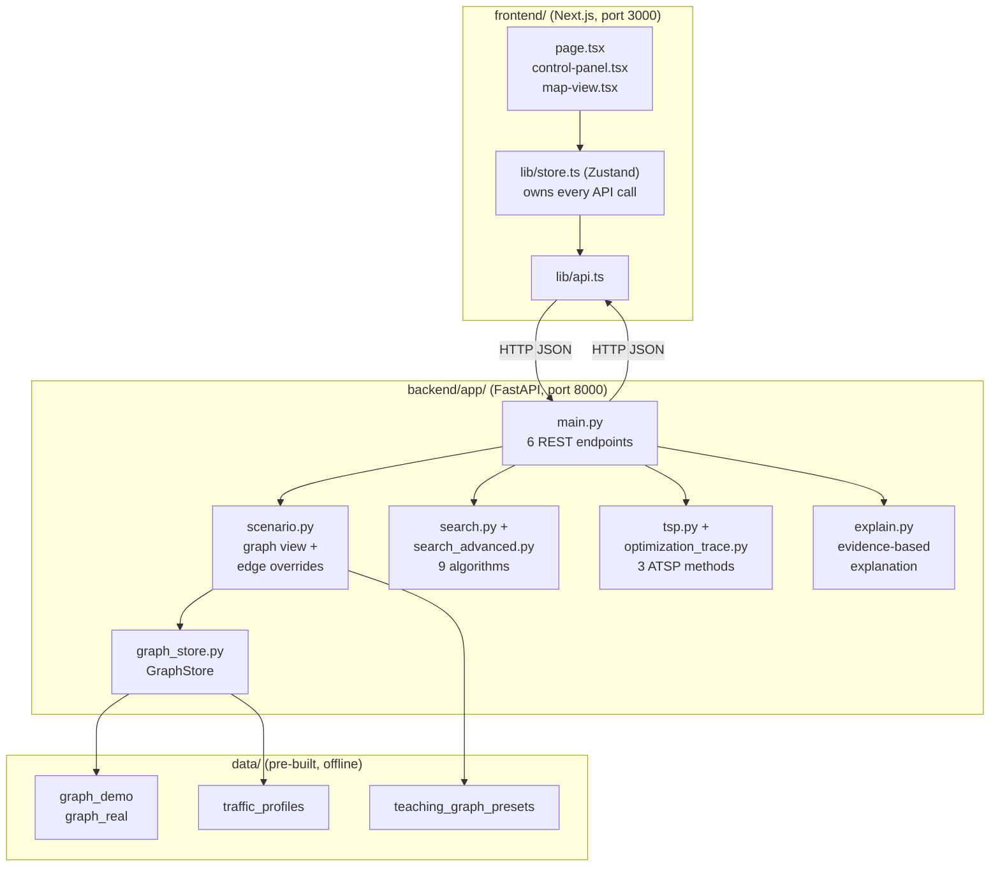
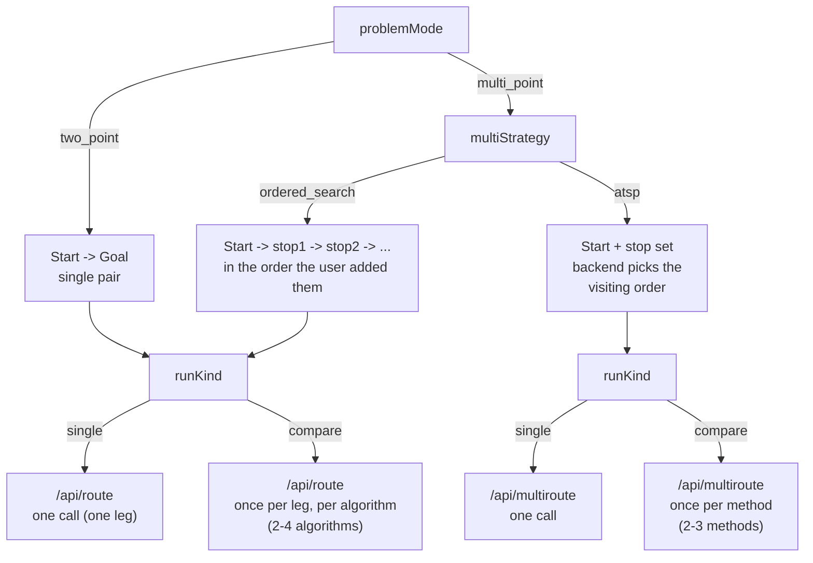
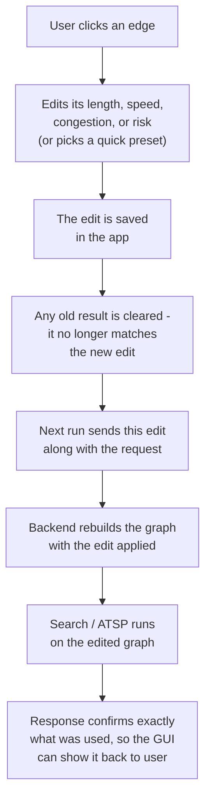
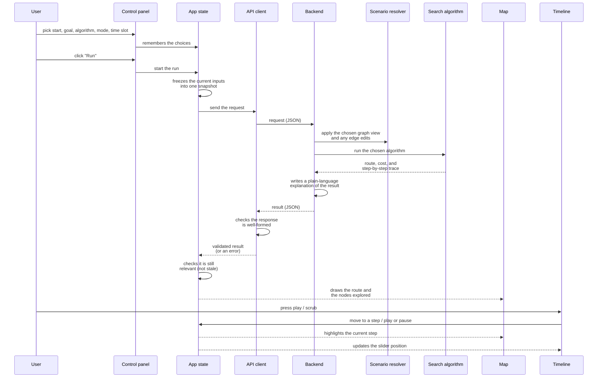

# Program Flow

## 1. System overview

The project is a client/server web app: a Next.js single-page GUI on top of a
stateless FastAPI backend that owns all search/TSP logic. The backend never
calls the network at request time - the graph and traffic data are pre-built
JSON files, loaded once into memory and served from there.

## 2. Two axes that decide which request the GUI sends

Every run in the GUI is a point on two independent switches kept in the
store: **problem mode** (how many stops) and **run kind** (one algorithm or a
side-by-side comparison). Their combination decides which backend endpoint
gets called and how many times.

- **`two_point`** (default): a plain Start→Goal search with one of the 9
  point-to-point algorithms.
- **`multi_point` + `ordered_search`**: the stops are visited in the order the
  user added them; the GUI just chains several two-point searches
  (Start→stop1, stop1→stop2, ...) and stitches the legs into one route.
- **`multi_point` + `atsp`**: the backend decides the *optimal visiting
  order* itself via one of the 3 ATSP methods (`held_karp` / `nn_2opt` / `sa`).
- **`runKind: compare`** re-runs the same journey with 2-4 algorithms (route)
  or 2-3 methods (ATSP) against one frozen input snapshot, so results are
  judged on identical conditions.

## 3. Scenario sandbox

A drawer tab lets the user edit one edge's length, free speed, per-slot
congestion, or risk flags before running a search, without touching the
on-disk graph. This is resolved **server-side**, once, before the algorithm
runs - the GUI's sandbox editor and the search functions always see the same
consistent graph.

The same mechanism also powers **graph views**: on the demo graph, the user
can shrink it down to a smaller teaching subgraph (as few as 3 nodes) to make
a step-by-step demo easier to follow, or switch back to the full graph at any
time. The real graph always stays at full size - it cannot be shrunk this
way.

## 4. Main backend modules

| Module | Responsibility | Key symbols |
|---|---|---|
| `main.py` | FastAPI app, 6 REST endpoints, request dispatch, unified error envelope | `post_route`, `post_multiroute`, `get_graph`, `get_traffic`, `post_benchmark`, `ALL_ALGORITHMS` |
| `graph_store.py` | Loads/validates graph + traffic JSON once per level, builds adjacency lists, precomputes edge weights for every (mode, time_slot) pair and node heuristics | `GraphStore.load`, `weights`, `heuristic` |
| `scenario.py` | Resolves the requested graph view (`full`/`teach_N`) and edge overrides into a request-scoped, immutable `GraphStore`; never mutates the cached base graph | `resolve_scenario`, `resolve_view_store`, `graph_response` |
| `costs.py` | Edge weight and heuristic math (distance/time/balanced modes) | `congestion_factor`, `edge_weight`, `haversine_m`, `heuristic_m`, `heuristic_s` |
| `search.py` | 5 core algorithms: BFS, DFS, IDDFS, UCS, A* + shared trace/decision recorder | `ALGORITHMS`, `bfs`, `dfs`, `iddfs`, `ucs`, `astar` |
| `search_advanced.py` | 4 additional algorithms: Greedy Best-First, Bidirectional Dijkstra, IDA*, Beam Search | `ADVANCED_ALGORITHMS`, `greedy`, `bidijkstra`, `idastar`, `beam` |
| `tsp.py` | Builds the asymmetric pairwise cost matrix (via an internal UCS search per point), 3 ATSP solvers, multi-stop orchestration | `build_matrix`, `held_karp`, `nn_2opt`, `simulated_annealing`, `solve_multiroute` |
| `optimization_trace.py` | Bounded, deterministic recorder for the ATSP optimization trace (DP updates, NN decisions, 2-opt/or-opt moves, SA iterations); never influences the solver, only samples its events | `OptimizationTraceRecorder` |
| `explain.py` | Builds the evidence-based explanation: summary, cost breakdown, congestion/risk factors, and reference routes (UCS optimum, avoid-edge counterfactual) used to judge how far a heuristic result is from optimal | `build_explanation` |
| `models.py` | Pydantic contracts shared by API and frontend (`Trace`, `RouteRequest`, `MultirouteRequest`, `ScenarioConfig`, ...) - executable form of `docs/SCHEMA.md` | - |
| `benchmark.py` | Offline experiment runner (7 experiments), writes `results/`; served read-only by `/api/benchmark`, never runs live search | `exp1` ... `exp7` |

## 5. Main frontend modules

| Area | Files | Responsibility |
|---|---|---|
| Page | `app/page.tsx`, `app/benchmark/page.tsx` | Route-planning workspace; read-only benchmark results viewer |
| Shell | `components/app-shell.tsx`, `control-panel.tsx` | Responsive layout; problem-mode/run-kind switches, algorithm/mode/time-slot/stop controls |
| Single-run map | `components/map-view.tsx` | Store-aware wrapper: owns editing/picking, timeline, legend, and toast copy for the single-run screen |
| Reusable canvas | `components/route-map-canvas.tsx` | Prop-driven MapLibre + deck.gl canvas (no store access) - reused by the single-run map and by every comparison pane |
| Comparison | `components/comparison/route-comparison-workspace.tsx`, `atsp-comparison-workspace.tsx` | Render N `RouteMapCanvas` panes (one per algorithm/method) plus the comparison table |
| ATSP | `components/atsp/*` | Multi-stop setup, method picker, result panel, and optimization-trace playback UI |
| Timeline | `components/timeline.tsx`, `lib/use-animation.ts` | Step-by-step playback of either the search trace or the ATSP optimization trace, keyboard shortcuts, speed control |
| Drawer | `components/drawer/{drawer,metrics-tab,explain-tab,compare-tab,scenario-tab}.tsx` | Right-hand results panel with 4 tabs: Metrics (g/h/f + decision table), Explain (evidence-based summary), Compare, Scenario (edge sandbox) |
| Explanation | `components/explanation/*` | Cost breakdown, reference-route comparison, per-factor overlays driving the Explain tab and map highlight |
| State | `lib/store.ts` (Zustand) | Single global store: journey inputs, run lifecycle, results (`trace`/`multi`/comparison sessions), animation state; every API call and toast lives in a store action |
| Policy/orchestration | `lib/journey-mode-policy.ts`, `run-orchestrator.ts`, `comparison-policy.ts`, `sequential-route.ts`, `scenario.ts` | Pure functions the store composes: journey state machine, immutable `RunSnapshot` construction, run-lifecycle/abort bookkeeping, comparison-session state machine, leg-merging for ordered multi-stop routes, scenario/edge-cost math |
| API client | `lib/api.ts`, `lib/contract-guards.ts` | Thin fetch wrapper for the 5 non-health endpoints; `contract-guards.ts` parses and validates every response against the locked contract before it reaches the store |

## 6. How the GUI drives the search algorithms

The GUI never implements search logic itself - it only collects parameters,
freezes them into a snapshot, calls the backend, and visualizes the returned
`Trace`.

Key points:

- **One contract, nine algorithms.** The GUI sends an `algorithm` string
  (`bfs`, `astar`, `idastar`, ...); the backend looks it up in
  `ALL_ALGORITHMS` and always returns the same `Trace` shape, so the frontend
  code that renders results never branches per algorithm.
- **Ordered multi-stop routes** reuse `/api/route`: the store chains one
  request per leg (Start→stop1, stop1→stop2, ...) and
  merges the legs into one continuous `Trace` for the map and timeline.
- **ATSP multi-stop routes** go through `/api/multiroute`: the
  backend builds a cost matrix from internal UCS searches, solves the
  visiting order with `held_karp` / `nn_2opt` / `sa`, and optionally returns
  a bounded `optimization_trace` the timeline can replay just like a search
  trace.
- **Comparison mode** reruns the same request shape 2-4 (route) or 2-3
  (ATSP) times against one frozen snapshot, rendering one map pane and one
  comparison-table row per item.
- **Trace-driven visualization.** The backend does the actual graph search;
  the frontend's only "algorithm-aware" behavior is replaying the `trace`
  array (expanded node, frontier, g/h/f values, and the selection-decision
  record per step) on the map and in the metrics tab - the search itself
  never runs in the browser.
- **Scenario-aware by construction.** The scenario (graph view + edge edits)
  is captured in the same frozen snapshot as the rest of the request, and the
  backend always echoes back exactly which scenario it used. If a response
  ever turns out not to match the sandbox state the user was looking at, the
  GUI can tell and simply throws that response away.
- **One request in flight at a time**, with explicit cancellation. `running`
  / `comparing` / `multiRunning` guard new runs, and `cancelActiveRun()`
  aborts the in-flight `fetch` via `AbortController`, so a slow response can
  never overwrite a screen the user has since changed.
- **Consistent across multiple calls.** A multi-stop journey or a comparison
  needs several backend calls (one per leg, or one per algorithm/method).
  Each response carries back a signature of the exact data it was computed
  against; if a later call turns out to disagree with the first one, the
  whole result is discarded rather than silently stitched together from two
  different data states.
