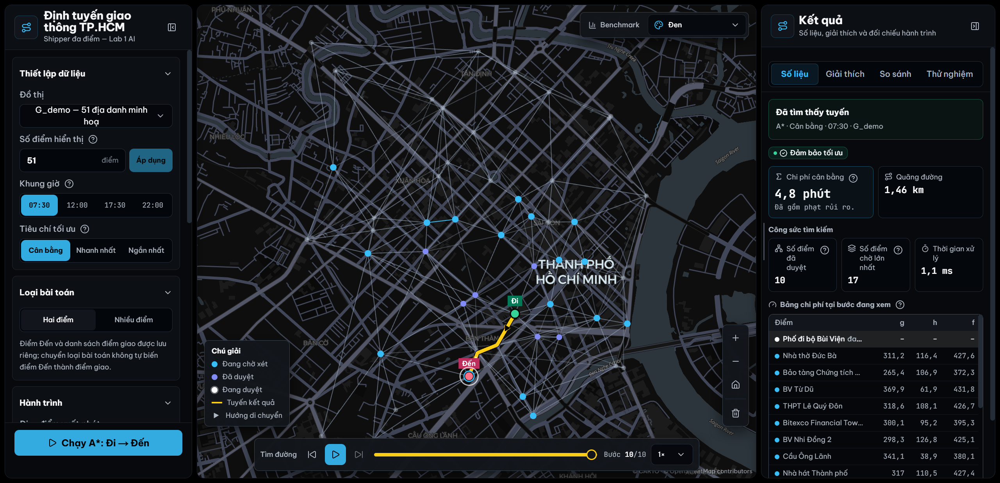
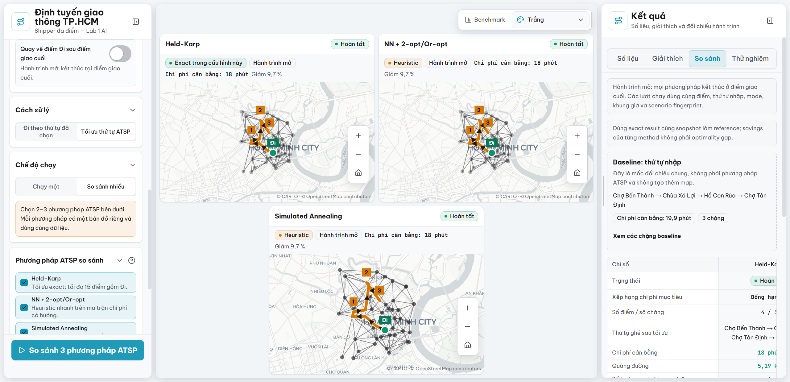

# Tìm đường cho shipper đa điểm tại TP.HCM

Đồ án Lab 1 môn Cơ sở Trí tuệ nhân tạo: mô hình hoá giao thông đô thị bằng đồ
thị có hướng, trực quan hoá 9 thuật toán tìm đường hai điểm và tối ưu thứ tự
giao hàng bằng 3 phương pháp ATSP. Backend dùng FastAPI; frontend dùng Next.js,
MapLibre và deck.gl; dữ liệu chạy demo được lưu cục bộ nên thuật toán không cần
gọi mạng.

Implementation frontend hiện hành và duy nhất trong tracked tree là
`frontend/`. Thư mục draft cũ `frontend1/` đã bị xoá và không được dùng làm
bằng chứng cho hành vi sản phẩm.

## Nhóm thực hiện

- **GroupID:** 2; không sử dụng tên nhóm.
- **Repository:** <https://github.com/ThaiQuangHuy2906/Lab1_Searching>
- **Người đại diện nộp chính thức:** Thái Quang Huy.

| MSSV | Họ tên | Phạm vi đã xác nhận | Đóng góp khai báo |
|---|---|---|---:|
| 24127078 | Nguyễn Hữu Gia Minh | Chưa chốt | 100% |
| 24127177 | Thái Quang Huy | 3 thuật toán ATSP | 100% |
| 24127205 | Nguyễn Văn Minh | 9 thuật toán tìm đường hai điểm | 100% |
| 24127249 | Mai Phương Thùy | Chưa chốt | 100% |
| 24127505 | Trần Hoàng Phúc | Chưa chốt | 100% |

Vai trò thực tế và các mục báo cáo còn lại sẽ được nhóm chốt sau.

## Xem nhanh

| A* + route trace — giao diện Đen | So sánh 3 phương pháp ATSP — giao diện Trắng |
|---|---|
|  |  |

Hai ảnh trên được chụp lại ngày 2026-08-11 từ runtime thật sau clean restart và
hard refresh bằng Google Chrome 151 maximized trên màn hình laptop vật lý
2560×1440, Windows scale 150% (viewport CSS 1707×825, DPR 1,5). Ảnh thứ hai minh
hoạ Phase 7 với đúng ba phương pháp, ba map độc lập; baseline thứ tự nhập chỉ ở
bảng và không tạo map thứ tư. Đây không phải ảnh thay thế cho toàn bộ screenshot
bắt buộc trong report/video.

### Tính năng nổi bật

- 9 thuật toán tìm đường dùng chung contract `Trace`, timeline và bảng g/h/f.
- Ba phương pháp ATSP cho hành trình nhiều điểm trên đồ thị có hướng, bất đối xứng.
- Bản đồ G_demo/G_real, lớp ùn tắc, offline mode và chọn điểm trực tiếp trên map.
- GraphView backend thật cho G_demo: `full` hoặc `teach_3`…`teach_50`; UI nhận
  số node nguyên 3…51, với 51 ánh xạ về `full`. Mọi graph, traffic, route và
  multiroute cùng resolve một view; G_real chỉ hỗ trợ `full`.
- ATSP optimization trace opt-in có player riêng; không trộn với route `Trace`.
- Sandbox chỉnh cạnh chỉ trong request/phiên hiện tại, có preview cost, provenance và
  fingerprint do backend sinh; không sửa graph/profile gốc.
- Luồng sáng nhấn tuyến, focus/keyboard đầy đủ và fallback `prefers-reduced-motion`.
- Giải thích tiếng Việt từ evidence typed cho đủ 9 thuật toán route; ở chế độ
  Chạy một có đối chiếu tuyến tham chiếu hậu kiểm và overlay nét đứt. So sánh
  route chọn 2–4 thuật toán, đúng N lựa chọn tạo N map final-only độc lập và bảng
  N-way trong drawer. ATSP hỗ trợ Chạy một hoặc so sánh 2–3 phương pháp; đúng N
  phương pháp tạo N map final-only, còn baseline thứ tự nhập chỉ xuất hiện một
  lần trong bảng và không tạo map giả.
- Drawer kết quả có bốn tab `Số liệu`, `Giải thích`, `So sánh`, `Thử nghiệm`;
  editor kịch bản chỉ nằm ở tab `Thử nghiệm` với `Chọn nhanh`/`Chỉnh chi tiết`.
- Tên thuật toán dùng nhãn ngắn; số liệu hành trình hiển thị km/phút. Ở desktop,
  objective và quãng đường nằm cạnh nhau; thời gian xử lý thuật toán vẫn dùng ms.
- Benchmark viewer chỉ đọc với provenance của lượt kết quả chính thức.

> **Trạng thái audit ngày 2026-08-11 — implementation qua Phase 8, chưa phải bộ
> nộp hoàn chỉnh:**
> Lượt data refresh cuối đã tích hợp đủ raw TomTom 07:30, 12:00, 17:30 và 22:00
> dưới dạng bốn snapshot đại diện lấy trên hai ngày thứ Hai; profile hiện là
> `tomtom+synthetic`. Raw GraphML, bốn TomTom JSON và OSMnx cache hiện được Git
> track dưới `data/raw/`. Contract/runtime Explanation v2, route comparison 2–4,
> ATSP comparison 2–3 và hardening Phase 8 đã được nối end-to-end. Fresh gate của
> audit và result closeout đạt `235 passed` backend, `137/137` frontend,
> TypeScript, production
> build 6/6 static pages và `ALL DATA VALID`; `G_demo` hiện có 51 node / 298 cạnh.
> Regression IDA* từng bị validator bác nhầm nghiệm hợp lệ trong biên ε đã được
> sửa và test. Chrome Desktop full-view đã pass trên máy audit với route
> single/compare 2–4, ordered multi-point và ATSP single/compare 2–3; clean
> session có 0 console error/warning. Nếu máy audit không phải máy demo cuối:
> **FINAL DEMO-MACHINE PREFLIGHT REQUIRED**.
> Chuỗi kết quả chính thức đã hoàn tất ngày 2026-08-11 mà không rebuild data:
> exp1–exp7 chạy cô lập (seed 42), γ̂ = 1,238 từ 160 mẫu/4 slot, teaching doc
> được tái sinh và kiểm byte-identical. Provenance/checksum xem
> [`results/README.md`](results/README.md).

## Trạng thái kiểm chứng

| Hạng mục | Trạng thái hiện tại | Bằng chứng |
|---|---|---|
| Backend | **Đạt** | `235 passed, 1 dependency warning`; 9 route algorithms, 3 ATSP methods, contract v2 và artifact-generator regressions đều qua suite; known issue IDA* cũ đã có regression |
| Data contract | **Đạt** | `ALL DATA VALID`; profile `tomtom+synthetic`; raw GraphML và TomTom 4/4 hiện diện, được Git track |
| Frontend automated | **Đạt** | `npm test`: 137/137 pass |
| TypeScript | **Đạt** | `npx tsc --noEmit --incremental false` exit 0 |
| Frontend production build | **Đạt** | Next.js 15.5.22 compile/type/static generation 6/6; `/` 58,7 kB, first-load 242 kB |
| G_demo | **Hiện hành** | 51 node, 298 cạnh có hướng, 60 cạnh một chiều |
| G_real | **Hiện hành** | 2.118 node, 4.699 cạnh có hướng, 1.433 cạnh một chiều |
| Benchmark | **Chính thức, hiện hành** | exp1 800/800; exp3 3.600 dòng/9 thuật toán; exp4 149/200 = 74,5%; exp7 HK tiết kiệm 42,2%; provenance/checksum tại [`results/README.md`](results/README.md) |
| UI/runtime | **Chrome Desktop full-view đạt** | Chrome 151 maximized, viewport CSS 1707×825/DPR 1,5: route N=1/2/3/4, ordered multi-point, ATSP N=1/2/3, retry/cancel/stale guard, camera độc lập, offline/reduced-motion và không page overflow đều đạt; clean console 0 error/warning |
| Backend sau clean restart | **Đã kiểm** | `/api/graph?level=demo&view=full` trả đúng G_demo 51/298/60 từ snapshot trên đĩa; backend-offline alert và retry phục hồi bằng response 200 |
| Trước khi nộp | **Còn việc tay** | 8 URL nguồn risk đã tích hợp nhưng còn final link QA; report vẫn còn nhiều marker nội dung/screenshot và phân công chưa chốt; ảnh/sơ đồ ngoài hai ảnh README, report PDF, slide, video/link và ZIP chưa hoàn tất |

Backend dùng cache theo vòng đời process. Trước khi demo hoặc chụp hình, phải
restart cả hai service, hard-refresh trình duyệt và xác nhận
`/api/graph?level=demo` trả `51` node / `298` cạnh.

## Sản phẩm và rubric

| Tiêu chí đề bài | Hiện thực trong repo |
|---|---|
| Bối cảnh giao thông Việt Nam | Shipper giao nhiều điểm ở trung tâm TP.HCM; ùn tắc theo 4 khung giờ; ngập, lô cốt, hẻm và đèn tín hiệu |
| Mô hình, dataset, cost | Hai graph có hướng G_demo/G_real; OSM; cost `distance`, `time`, `balanced`; contract trong [`docs/SCHEMA.md`](docs/SCHEMA.md) |
| Thuật toán bắt buộc | BFS, DFS, UCS, A* |
| Thuật toán bổ sung | IDDFS, Greedy, Bidirectional Dijkstra, IDA*, Beam |
| Đa điểm | Held–Karp, Nearest Neighbor + cải thiện bất đối xứng, Simulated Annealing |
| GUI | Shell điều hành với bảy giao diện, chọn điểm trên map, animation trace và luồng sáng tuyến có reduced-motion, timeline, bảng g/h/f, ATSP, route comparison 2–4 bằng N map độc lập, explanation typed theo từng result/thuật toán và trang benchmark đọc bộ kết quả chính thức |
| Báo cáo và video | Có khung a–j, outline 14 slide và kịch bản video; vẫn cần nhóm hoàn thiện artifact thật |

Rubric chính thức 100 điểm và yêu cầu đóng gói nằm trong
[`docs/Lab 1 - Searching.pdf`](docs/Lab%201%20-%20Searching.pdf). Bản đối chiếu
chi tiết xem [`docs/CODEX-CODEBASE-MAP.md`](docs/CODEX-CODEBASE-MAP.md).

## Kiến trúc

```text
OSM + TomTom tùy chọn + manual risks
                 │
                 ▼
        scripts/01–05 + validator
                 │
                 ▼
   graph/profile JSON đã commit trong data/
                 │
                 ▼
      GraphStore + 9 search + 3 ATSP
                 │
          ┌──────┴────────┐
          ▼               ▼
   FastAPI /api/*    benchmark.py
          │               │
          ▼               ▼
 Next.js + MapLibre   results/ + tài liệu sinh
```

Luồng chạy sản phẩm chỉ đọc snapshot trong `data/`; các bước tải OSM/crawl
TomTom là pipeline ngoại tuyến. `/api/benchmark` chỉ đọc artifact cached trong
`results/`, không tự chạy benchmark.

## Thuật toán và bảo đảm

| Thuật toán | Thứ tự ưu tiên | Bảo đảm trong dự án |
|---|---|---|
| BFS | số cạnh | Tìm tuyến ít cạnh; không tối ưu cost có trọng số |
| DFS | chiều sâu | Không bảo đảm tối ưu |
| IDDFS | độ sâu tăng dần | Tìm nghiệm nông nhất trong depth cap; không tối ưu cost, chủ yếu dùng G_demo |
| UCS | `g` | Tối ưu với trọng số không âm |
| A* | `g + h` | Tối ưu nhờ heuristic admissible + consistent |
| Greedy | `h` | Không bảo đảm tối ưu |
| Bidirectional Dijkstra | `g` từ hai phía | Tối ưu trên graph có hướng với backward search đúng chiều đảo |
| IDA* | ngưỡng `g + h` | Trong `C* + ε` khi tìm được trước cap; mặc định ε = 5 m ở `distance`, 5 s ở mode còn lại |
| Beam | top-k theo `g + h` | Có thể không tìm thấy dù đường tồn tại; không bảo đảm tối ưu |

Mọi thuật toán trả cùng một kiểu `Trace`; cap 5.000 bước chỉ giới hạn payload,
không được cắt công việc tìm kiếm hay metrics. Chứng minh heuristic xem
[`docs/HEURISTIC-PROOF.md`](docs/HEURISTIC-PROOF.md).

ATSP hỗ trợ tối đa 16 điểm kể cả điểm xuất phát; riêng Held–Karp tối đa 15 điểm
và có bảo đảm tối ưu. `nn_2opt` và `sa` là heuristic, không có bảo đảm tối ưu.

## Yêu cầu môi trường

| Thành phần | Mốc đã kiểm |
|---|---|
| Windows | Windows 11 + PowerShell |
| Python | 3.14.0 |
| Node.js / npm | 24.14.1 / 11.11.0 |
| Backend chính | FastAPI 0.140.0, Pydantic 2.13.4, pytest 9.1.1 |
| Frontend chính | Next 15.5.22, React 19.2.8, TypeScript 5.9.3 |

Python dependencies được pin trong `backend/requirements.txt`; frontend lock
bằng `frontend/package-lock.json`.

## Cài đặt nhanh trên PowerShell

Chạy từ repo root:

```powershell
py -3.14 -m venv .venv
.\.venv\Scripts\python.exe -m pip install -r backend\requirements.txt

Set-Location frontend
npm ci
Set-Location ..
```

TomTom chỉ cần cho crawl tùy chọn. Không commit key:

```powershell
Copy-Item .env.example .env
# Điền TOMTOM_API_KEY trong .env khi thực sự crawl.
```

Mặc định, frontend gọi `/api/*` cùng origin và Next.js chuyển tiếp request tới
`http://127.0.0.1:8000`. Cách này hoạt động cả khi mở giao diện bằng `localhost`
lẫn IP LAN. Nếu backend chạy ở địa chỉ khác, tạo `frontend/.env.local`:

```dotenv
BACKEND_INTERNAL_URL=http://127.0.0.1:8000
```

Chỉ đặt `NEXT_PUBLIC_API_BASE` khi muốn trình duyệt gọi thẳng FastAPI; khi đó
backend phải cho phép origin của frontend qua CORS.

`.env`, các biến thể local và `frontend/.env.local` đã được Git ignore;
`.env.example` vẫn được track.

## Chạy ứng dụng

Terminal 1:

```powershell
Set-Location backend
..\.venv\Scripts\python.exe -m uvicorn app.main:app --port 8000
```

Terminal 2:

```powershell
Set-Location frontend
npm run dev
```

Mở:

- giao diện: <http://localhost:3000>
- benchmark viewer: <http://localhost:3000/benchmark>
- OpenAPI/Swagger: <http://localhost:8000/docs>

Hướng dẫn thao tác Chạy một, route compare 2–4, ATSP compare 2–3, timeline, tab
Giải thích, tuyến tham chiếu, đường đỏ ùn tắc và nhiều điểm nằm tại
[`docs/HUONG-DAN-SU-DUNG-UI.md`](docs/HUONG-DAN-SU-DUNG-UI.md).

Với Git Bash trên Windows, dùng `.venv/Scripts/python.exe` và dấu `/`; trên
macOS/Linux dùng `.venv/bin/python`. Không sao chép nguyên lệnh PowerShell có
dấu `\` sang Bash.

## REST API

| Method | Endpoint | Chức năng |
|---|---|---|
| GET | `/api/health` | health và version |
| GET | `/api/graph?level=demo\|real&view=full\|teach_*` | graph snapshot/view đã resolve |
| GET | `/api/traffic?slot=07:30&level=demo&view=...` | congestion của graph/view/slot đã resolve |
| POST | `/api/route` | một trong 9 thuật toán hai điểm; nhận `scenario` tùy chọn |
| POST | `/api/multiroute` | tối ưu thứ tự nhiều điểm; nhận `scenario` và `include_trace` tùy chọn |
| POST | `/api/benchmark` | đọc kết quả benchmark cached |

Request/response, enum, đơn vị và error envelope đầy đủ nằm trong
[`docs/SCHEMA.md`](docs/SCHEMA.md). `distance` dùng mét; `time` và `balanced`
dùng giây. `found=false` là response 200 hợp lệ, không nhất thiết là lỗi HTTP.

## Kiểm tra an toàn

Chạy từ repo root:

```powershell
.\.venv\Scripts\python.exe -m pytest backend\tests\ -q
.\.venv\Scripts\python.exe scripts\validate_data.py

Set-Location frontend
npm test
npx tsc --noEmit
```

Fresh automated gates sau official-result closeout 2026-08-11:

- backend: `235 passed`, 1 Starlette/httpx dependency deprecation warning;
- data validator: `ALL DATA VALID` với G_demo 51/298/60 one-way và
  G_real 2.118/4.699/1.433 one-way;
- frontend: `137/137` tests và TypeScript exit 0;
- production build: Next.js 15.5.22 compile/type/static generation 6/6.

Chrome Desktop runtime hiện hành được kiểm ngày 2026-08-11 trên màn hình laptop
vật lý 2560×1440, scale 150%, viewport CSS 1707×825, DPR 1,5. Nếu đây không phải
đúng máy trình chiếu/nộp cuối thì **FINAL DEMO-MACHINE PREFLIGHT REQUIRED**;
không suy PASS của máy cuối chỉ từ test/build hoặc commit message.

## Dữ liệu và benchmark

Snapshot graph/profile hiện hành đủ để chạy demo offline. Bản đồ nền Carto vẫn
cần mạng; UI có chế độ offline không basemap.

Lượt data cuối và chuỗi kết quả đã hoàn tất theo đúng dependency chain:

1. giữ nguyên snapshot `tomtom+synthetic` đã validate, không rebuild lại;
2. benchmark exp1–exp7 chạy riêng đúng một lượt ngày 2026-08-11;
3. hiệu chuẩn γ và generator hoàn tất; đủ năm vị trí provenance/số liệu đã sync;
4. nếu code/graph/profile đổi sau mốc này, downgrade trạng thái và chạy lại trọn chuỗi.

Các lệnh trên ghi đè artifact dữ liệu được Git theo dõi. Không chạy từng phần
và không trộn graph/profile/result từ các lượt khác nhau.

## Cấu trúc thư mục

```text
backend/app/       API, graph store, cost, search, ATSP, benchmark
backend/tests/     test schema, data, cost, search, TSP và API
artifacts/readme/  hai ảnh minh hoạ giao diện hiện hành cho README
data/              graph/profile snapshot, POI, risk và DATA.md
docs/              đề bài, contract, proof, design, baseline và audit
frontend/app/      trang chính và /benchmark
frontend/components/
frontend/lib/      API client, types, format và Zustand store
report/            khung báo cáo, slide và video
results/           benchmark chính thức 2026-08-11 + provenance/checksum
scripts/           pipeline data, validator, generator và QA
```

## Bản đồ tài liệu

| Tài liệu | Vai trò |
|---|---|
| [`docs/Lab 1 - Searching.pdf`](docs/Lab%201%20-%20Searching.pdf) | đề bài và rubric chính thức |
| [`docs/Lab1-ChotPhuongAn.md`](docs/Lab1-ChotPhuongAn.md) | quyết định dự án đã chốt |
| [`PROMPT-MASTER.md`](PROMPT-MASTER.md) | đặc tả thi công gốc; phần phase là lịch sử |
| [`docs/SCHEMA.md`](docs/SCHEMA.md) | contract graph, trace, API và cost |
| [`data/DATA.md`](data/DATA.md) | nguồn, pipeline, giả định và snapshot |
| [`docs/DESIGN.md`](docs/DESIGN.md) | contract thiết kế UI |
| [`docs/HUONG-DAN-SU-DUNG-UI.md`](docs/HUONG-DAN-SU-DUNG-UI.md) | hướng dẫn thao tác giao diện hiện hành qua Phase 8 |
| [`UI_PLAN.md`](UI_PLAN.md) | checklist triển khai và bằng chứng hoàn tất phase UI Clarity |
| [`UI_caithien.md`](UI_caithien.md) | master plan UI & Explanation v2; Phase 0–8 dùng hệ phase này |
| [`docs/CODEX-BASELINE.md`](docs/CODEX-BASELINE.md) | baseline kỹ thuật ngày 2026-07-27; giữ làm lịch sử |
| [`docs/CODEX-CODEBASE-MAP.md`](docs/CODEX-CODEBASE-MAP.md) | bản đồ kiến trúc và current-state đã cập nhật qua UI & Explanation v2 Phase 8 |
| [`docs/TIENDO.md`](docs/TIENDO.md) · [`docs/KIEMTOAN.md`](docs/KIEMTOAN.md) · [`docs/AUDIT-CLAUDE-PRE-SUBMISSION.md`](docs/AUDIT-CLAUDE-PRE-SUBMISSION.md) | nhật ký/audit lịch sử, không phải bằng chứng current |
| [`docs/GIAI-THICH-THUAT-TOAN.md`](docs/GIAI-THICH-THUAT-TOAN.md) | tài liệu sinh tự động từ view `teach_7` và exp3/exp7 chính thức; không hand-edit phần số |
| [`docs/ROLE-C-ADVANCED-ATSP-GIAI-THICH-DE-HIEU.md`](docs/ROLE-C-ADVANCED-ATSP-GIAI-THICH-DE-HIEU.md) | tài liệu lịch sử tên Role C; hiện dùng để học thuật toán nâng cao và ATSP, không đại diện vai trò đã chốt |

## Checklist nộp bài

Với GroupID 2, gói nộp `2.zip` gồm:

- `2 - SC.txt` — đã tạo; còn phải thử link source ở tab ẩn danh;
- `2 - Report.pdf` — báo cáo kỹ thuật hoàn chỉnh;
- `2 - Slide.pptx` hoặc `2 - Slide.pdf`;
- `2 - Video.txt` — link video mở được ở tab ẩn danh;
- `2 - Data.zip` hoặc `2 - Data.txt`.

Tám `source_url` của manual risk đã được đối chiếu và tích hợp ngày 2026-08-08;
đây là nguồn sự kiện lịch sử ở cấp tuyến/khu vực, không phải dữ liệu real-time và
không xác nhận tọa độ/bán kính/penalty. Trước khi đóng gói vẫn phải mở lại các
link bằng tab ẩn danh trên máy nộp bài, tự chốt vai trò/phân công còn lại, xử lý
toàn bộ marker, chụp screenshot/Google Maps và tạo report/slide/video thật. Chuỗi
benchmark/gamma/generator cùng việc gỡ năm banner tạm đã hoàn tất.

## Troubleshooting

| Triệu chứng | Cách xử lý |
|---|---|
| Frontend không gọi được backend | chạy uvicorn, kiểm `BACKEND_INTERNAL_URL`, rồi restart frontend |
| API trả graph cũ | tắt process cũ, restart backend, hard-refresh và kiểm `/api/graph?level=demo` |
| Port 8000/3000 bận | tìm PID bằng `netstat -ano \| findstr :<port>` rồi chỉ tắt đúng process đó |
| Map nền trống | kiểm mạng hoặc bật chế độ offline |
| 404 hàng loạt file Next | tắt dev server, xoá riêng `frontend/.next`, chạy `npm run dev` lại |
| Đổi `next.config.ts` nhưng không có hiệu lực | restart dev server |
| Chữ Việt lỗi trên console Windows | đọc/ghi UTF-8 và cấu hình stdout UTF-8 trong script |

Không chạy `npm run build` đồng thời với `npm run dev`: cả hai cùng ghi
`frontend/.next`. Chỉ build sau khi đã tắt mọi Next dev process.

## Quyền sử dụng

Repository hiện không có file `LICENSE`; vì vậy không nên suy luận rằng mã nguồn
được cấp phép tái sử dụng hoặc phân phối. Nhóm cần chốt chính sách với giảng viên
và chủ sở hữu trước khi thêm license hoặc công khai repository.
