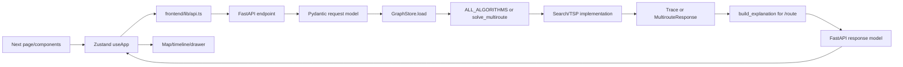
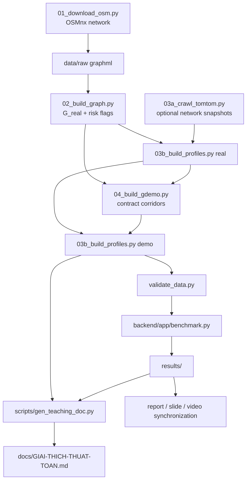
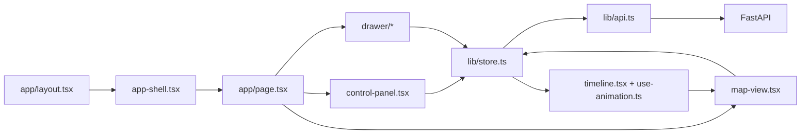

# Project01 Codebase Map

This map records the repository as inspected and documentation-refreshed on
2026-07-27, starting from
`aedcf7255c4beadd1de0be69e5638f146bae89ed`. It distinguishes intended
contracts, current implementation, executed tests, generated artifacts, and
historical claims. `UNVERIFIED` means the onboarding could not establish the
claim with a suitable runtime check.

## 1. Project purpose and rubric

The assignment is a Vietnamese urban-traffic search project. This repository
chooses a multi-stop shipper in central HCMC, implements ten two-point searches,
three ATSP methods, a step-by-step web GUI, route explanations, and an offline
data/benchmark/report pipeline.

The authoritative rubric was read from page 10 of
`docs/Lab 1 - Searching.pdf` and visually checked:

| Criterion | Points |
|---|---:|
| Vietnamese traffic context and realistic problem scenario | 10 |
| Graph modeling, dataset design, and cost function | 15 |
| Correct implementation of required search algorithms | 20 |
| Additional search or optimization algorithms | 10 |
| Multi-location route optimization | 10 |
| GUI and visualization of the search process | 10 |
| Route explanation and comparison of alternatives | 10 |
| Technical report quality | 10 |
| Demo video quality | 5 |
| **Total** | **100** |

The PDF requires one `[GroupID].zip` containing a source-link TXT, report PDF,
slide PPTX/PDF, video-link TXT, and dataset/data-description ZIP/TXT. These
submission artifacts are not all present.

## 2. Repository structure

Condensed structure, excluding `.git`, `.venv`, `node_modules`, `.next`, and
caches:

```text
.
├── AGENTS.md                         future-agent operating context
├── CLAUDE.md                         legacy handoff and commands
├── PROMPT-MASTER.md                  historical construction specification
├── README.md                         user run guide
├── backend/
│   ├── app/                          API, models, stores, search, TSP, benchmark
│   ├── tests/                        seven pytest modules
│   ├── conftest.py
│   └── requirements.txt
├── data/
│   ├── graph_{demo,real}.json
│   ├── traffic_profiles_{demo,real}.json
│   ├── gdemo_corridors.json
│   ├── gdemo_pois.json
│   ├── manual_risks.json
│   ├── mock/                         schema/frontend fixtures
│   └── DATA.md
├── docs/
│   ├── Lab 1 - Searching.pdf         assignment and rubric
│   ├── Lab1-ChotPhuongAn.md          settled design choices
│   ├── SCHEMA.md                     intended graph/trace/API/cost contract
│   ├── HEURISTIC-PROOF.md
│   ├── DESIGN.md
│   ├── GIAI-THICH-THUAT-TOAN.md      generated teaching document
│   ├── TIENDO.md                     historical phase log
│   ├── KIEMTOAN.md                   historical audit/fix ledger
│   └── AUDIT-CLAUDE-PRE-SUBMISSION.md untracked input audit
├── frontend/
│   ├── app/                          root map and benchmark pages
│   ├── components/                   controls, map, timeline, drawer, UI
│   ├── lib/                          Zustand, API, types, formatting, colors
│   └── package.json                  Next 15 / React 19 / TypeScript
├── report/                           report frame, slide outline, video script
├── results/                          stale CSV/JSON/PNG benchmark artifacts
├── scripts/                          data, validation, generator, contrast tools
└── hdcrawl.md                        final TomTom/refresh run-book
```

Inventory at onboarding: 132 tracked files, 7 backend test modules, 35
TypeScript/TSX files. The only pre-existing unignored changes were modified
`.gitignore` and untracked `docs/AUDIT-CLAUDE-PRE-SUBMISSION.md`.

## 3. Source-of-truth hierarchy

| Domain | Intended source of truth | Executable/current evidence | Derived, generated, or historical |
|---|---|---|---|
| Assignment/rubric | `docs/Lab 1 - Searching.pdf` | Deliverables on disk | Report self-assessments |
| Settled choices | `docs/Lab1-ChotPhuongAn.md` | Current implementation/data | `PROMPT-MASTER.md` construction details |
| Graph/trace/API/cost contract | `docs/SCHEMA.md` | `backend/app/models.py`, producers, consumers | Generated teaching examples |
| Current backend behavior | Current `backend/app/*.py` | Fresh tests/live calls | `TIENDO.md`, old audit claims |
| Current data | Current JSON metadata/content | `scripts/validate_data.py` | Old result prose and old graph counts |
| UI behavior | `docs/DESIGN.md` for intent | Current TS/TSX plus browser QA | Screenshots/audit prose |
| Benchmark definition | `backend/app/benchmark.py` | A coherent fresh run | Current `results/` are stale |
| Generated teaching doc | `scripts/gen_teaching_doc.py` plus current inputs | Regenerated output | Existing output may reflect stale inputs |
| Progress/audit history | None for current behavior | Re-check code/data/tests | `TIENDO.md`, `KIEMTOAN.md`, audit/run-book |

For current-behavior disputes, use:

```text
current code/data
  > fresh executed tests/runtime checks
  > intended schema/assignment
  > generated docs
  > historical logs and audit claims
```

For requirement disputes, use:

```text
assignment PDF
  > docs/Lab1-ChotPhuongAn.md
  > PROMPT-MASTER.md
```

## 4. Backend architecture

Primary modules:

| Module | Responsibility | Key symbols |
|---|---|---|
| `models.py` | Pydantic v2 executable contracts | `GraphFile`, `TrafficProfiles`, `Trace`, `RouteRequest`, `MultirouteResponse` |
| `costs.py` | edge weights and heuristics | `congestion_factor`, `edge_penalty_s`, `edge_weight`, `haversine_m` |
| `graph_store.py` | validated load, adjacency, weights, path metrics | `GraphStore.load`, `weights`, `heuristic`, `path_metrics`, `reweighted` |
| `search.py` | six core searches and common recorder/finalizer | `_Recorder`, `_finish`, `bfs`, `dfs`, `iddfs`, `_best_first` |
| `search_advanced.py` | four advanced searches | `greedy`, `bidijkstra`, `idastar`, `beam` |
| `tsp.py` | ATSP matrix and three solvers | `build_matrix`, `held_karp`, `nn_2opt`, `simulated_annealing`, `solve_multiroute` |
| `explain.py` | Vietnamese route explanation/alternatives | `build_explanation` and internal Dijkstra alternative helper |
| `main.py` | FastAPI, dispatch, error envelope, cached result serving | `post_route`, `post_multiroute`, `post_benchmark`, exception handlers |
| `benchmark.py` | seven offline experiments | `exp1` through `exp7`, `main` |

End-to-end request flow:



## 5. REST API

| Method | Path | Request model | Response model | Handler | Core dependency | Test coverage |
|---|---|---|---|---|---|---|
| GET | `/api/health` | query-free | `HealthResponse` | `health` | `platform.python_version` | `test_health` |
| GET | `/api/graph` | `level` query | graph dict validated on load | `get_graph` | `graph_payload`, `GraphStore.load` | demo/real and bad level |
| GET | `/api/traffic` | `slot`, `level` | `TrafficResponse` | `get_traffic` | cached store profiles | coverage/range and bad slot |
| POST | `/api/route` | `RouteRequest` | `Trace` | `post_route` | `ALL_ALGORITHMS`, explanation | all ten, defaults, params, errors, explanation |
| POST | `/api/multiroute` | `MultirouteRequest` | `MultirouteResponse` | `post_multiroute` | `solve_multiroute` | NN+2opt, limits, duplicates, TSP unit tests |
| POST | `/api/benchmark` | `BenchmarkRequest` | `BenchmarkResponse` | `post_benchmark` | reads whitelisted result files | all/single, 200-or-404 artifact behavior |

`/api/benchmark` serves files; it never runs `benchmark.py`. When `{}` is used,
it silently returns the subset of experiment files that exist and only 404s if
none exist. This partial-result behavior is not explicit in `SCHEMA.md`.

Error handling:

| Exception | Handler | HTTP/code | Current risk |
|---|---|---|---|
| `RequestValidationError` | `on_validation_error` | 422 `VALIDATION_ERROR` or `HELD_KARP_LIMIT` | Request errors normalized |
| `KeyError` for `node ...` | `on_key_error` | 404 `NODE_NOT_FOUND` | Other key errors become 500 |
| internal Pydantic `ValidationError` | `on_internal_pydantic_validation_error` | 500 `INTERNAL` | Generic client response; traceback logged |
| `ValueError` | `on_value_error` | 422 validation/held-karp | Domain/input value errors only |
| `StarletteHTTPException` | `on_http_error` | original status, `VALIDATION_ERROR` | 404/405 use schema envelope |
| unexpected `Exception` | `on_internal` | 500 `INTERNAL` | Generic client message; traceback logged |
| `BenchmarkMissing` | `on_benchmark_missing` | 404 `RESULTS_NOT_FOUND` | Artifact-dependent |

Pydantic `ValidationError` is a `ValueError`. The exact handler added on
2026-07-27 now wins Starlette's MRO lookup, logs the internal traceback, and
returns a generic 500 without validator detail. `RequestValidationError` has a
different MRO and remains on the normalized 422 handler. An endpoint regression
covers both response secrecy and retained `exc_info`.

`RouteParams` permits `beam_width >= 1` and `epsilon > 0`. Irrelevant parameters
are intentionally ignored because all registered algorithms accept `**params`;
this matches `SCHEMA.md`.

## 6. GraphStore and caching

`GraphStore.load(level, data_dir=None)`:

- is `@lru_cache(maxsize=4)`;
- validates graph/profile JSON with Pydantic;
- builds stable sorted adjacency and reverse adjacency;
- indexes edges/nodes;
- precomputes weights for 3 modes × 4 slots;
- keeps graph, profiles, indices, and weights in RAM for process life.

`main.graph_payload(level)` has a second `@lru_cache(maxsize=2)`. There is no
reload endpoint or automatic disk-change invalidation.

Therefore changing files on disk does nothing to an existing process until
caches are cleared or the backend restarts. This is not hypothetical: the live
API returned `G_demo` created 2026-07-26 with 51/141 while the current file on
disk is 2026-07-27 with 51/292.

Demo pre-flight:

1. stop old backend and frontend processes;
2. start the backend from the current checkout;
3. start/restart the frontend and hard-refresh;
4. check `/api/graph?level=demo` against current on-disk metadata;
5. only then capture screenshots/video.

## 7. Cost and unit model

| Mode | Edge weight | `total_cost` | `total_time_s` | Heuristic | IDA* epsilon unit | Explanation unit |
|---|---|---|---|---|---|---|
| `distance` | `length_m` | metres | balanced seconds | haversine metres | metres | must be `m`/`km` |
| `time` | free time × congestion | seconds | balanced seconds | haversine / `v_max` | seconds | seconds/minutes |
| `balanced` | time weight + risk penalties | seconds | same balanced seconds | haversine / `v_max` | seconds | seconds/minutes |

Definitions in `costs.py`/`SCHEMA.md`:

```text
t_free = length_m / (free_speed_kmh / 3.6)
f_cong = 1 + gamma * (congestion - 1) / 4, gamma = 1.5
penalty = 60*flood + 90*construction + 30*narrow_alley + 25*traffic_light
balanced = t_free*f_cong + penalty
```

Graph JSON stores `free_travel_time_s` rounded to 0.1 s; runtime weights
recompute from length/speed without using the rounded field. Pipeline
`ceil_dm` protects lower-bound/consistency behavior against length rounding.

Resolved on 2026-07-27: `build_explanation` now derives the IDA* epsilon and
non-optimal cost-gap suffix from the mode. `distance` uses metres;
`time`/`balanced` use seconds, with three-mode API regressions for both branches.

## 8. Heuristic and proof

`GraphStore.heuristic` uses:

- `haversine_m(node, goal)` for distance;
- `haversine_m / graph-wide v_max_mps` for time/balanced.

`docs/HEURISTIC-PROOF.md` proves consistency from geometric distance, the
global maximum free speed, non-negative congestion/penalties, and the fact that
road length lower-bounds straight-line distance. Consistency implies
admissibility. Parameter changes must preserve non-negative additive costs and
the global-speed bound.

Executed tests:

- `test_weight_lower_bound_lemma3`;
- `test_heuristic_consistent_on_every_edge`.

The consistency test covers every edge but only three goals per store; its
name/proof prose should not be confused with an exhaustive all-goal run.
Existing exp2 output is stale with the rest of `results/`.

## 9. Ten search algorithms

All functions use signature-compatible `**params`, validate endpoints, and
return `Trace`.

| Algorithm | File/function | Frontier/priority | Weight/heuristic | Goal test | Guarantee condition | Termination/cap | Current test evidence |
|---|---|---|---|---|---|---|---|
| BFS | `search.py::bfs` | FIFO queue | unweighted | pop/expand | hop-optimal only | queue empty | 100 seeded demo hop comparisons |
| DFS | `search.py::dfs` | LIFO stack | unweighted | pop/expand | none | stack empty | valid paths |
| IDDFS | `search.py::iddfs` | depth-limited LIFO rounds | unweighted | pop/expand | shallowest within configured depth | default max depth 100 | BFS-depth samples, limit field |
| UCS | `search.py::ucs` | min-g heap | mode weight | pop/expand | non-negative weights | heap empty | exhaustive demo combinations + real samples |
| Dijkstra | `search.py::dijkstra` | min-g heap | mode weight | pop/expand | non-negative weights | heap empty | same oracle coverage |
| A* | `search.py::astar` | `(f,h,tie)` heap | g + h | pop/expand | admissible/consistent h | heap empty | same cost oracle plus heuristic tests |
| Greedy | `search_advanced.py::greedy` | min-h heap | h only | pop/expand | none | heap empty | path/suboptimal witness, h-only trace |
| Bidijkstra | `search_advanced.py::bidijkstra` | two min-g heaps | forward/reverse g | selected-side pop | non-negative weights and stop rule | `top_f+top_b >= mu` | Dijkstra comparisons, side/key shape |
| IDA* | `search_advanced.py::idastar` | f-bounded DFS rounds | g + h, epsilon thresholds | in-bound pop | epsilon claim when found; proof when exhaustively unreachable | default 1,000 rounds; cap exit has no guarantee | sampled epsilon, cap, and unreachable tests |
| Beam | `search_advanced.py::beam` | layer then best-k pruning | g + h | current-layer expansion | none; incomplete | retained layer empty/found | width 60/1/default plus controlled top-k trace |

Common `_Recorder` caps trace storage at 5,000 steps while search and metrics
continue. `start == goal` returns `[start]`, zero expansions, and an empty trace.

Practical claims must be conditional:

- IDDFS is not unconditionally complete with `IDDFS_MAX_DEPTH=100`.
- IDA* can exhaust `IDASTAR_MAX_ROUNDS=1000`; that capped `found=false` exit now
  reports `optimal_guarantee=false`, while exhaustive unreachability reports
  `true`.
- Beam is intentionally incomplete/non-optimal.

## 10. Trace contract

| Field | Schema meaning | Producer | Validator/consumer | Required invariant |
|---|---|---|---|---|
| `step` | 1-based continuous expansion number | `_Recorder.record` | TS timeline/table | continuous and unique |
| `expanded` | node just expanded | each algorithm | map/timeline | valid graph node |
| `frontier` | open nodes immediately after expansion | algorithm snapshot | map/g-h-f table | no expanded/closed-only values |
| `g` | displayed mode cost for frontier | weighted searches | model field family | keys equal frontier; rounded display |
| `h` | heuristic for frontier | Greedy/A*/IDA*/Beam | model field family | keys equal frontier |
| `f` | raw g+h then display rounding | A*/IDA*/Beam | model field family | same frontier and arithmetic meaning |
| `depth_limit` | current IDDFS round | `iddfs` | model/timeline | IDDFS only |
| `side` | expanded Bidijkstra side | `bidijkstra` | model/map | bidijkstra only |
| `trace_truncated` | stored list hit 5,000 | `_Recorder`/`_finish` | metrics UI | full-run metrics remain independent |
| `epsilon_bound` | IDA* threshold increment | `idastar` | metrics | same unit as mode |
| `beam_width` | retained layer limit | `beam` | metrics | integer >= 1 |

Repair status:

1. **Resolved:** `iddfs` records after pushing eligible successors.
2. **Resolved:** `idastar` records after pushing eligible successors.
3. **Resolved:** Bidijkstra selects g from each node's active side and uses
   `min` only when the node is active in both frontiers.
4. **Resolved:** Beam snapshots only the selected top-k next-layer candidates.
5. **Resolved:** Beam `max_frontier` measures the selected beam and is bounded
   by `beam_width`; IDA* snapshots after generation and its cap termination is
   explicit.

The model enforces algorithm-specific nullability, not every semantic
invariant. Controlled tests now cover all five repaired items.

## 11. TSP and multiroute

`build_matrix` runs a product Dijkstra from each selected point over directed
weights and caches each leg path. The matrix is asymmetric.

| Method | Function | Exact/heuristic | Limit | Randomness | Return to start | Guarantee |
|---|---|---|---:|---|---|---|
| Held-Karp | `held_karp` | exact bitmask DP | <=15 total points | none | supported | true |
| NN + 2-opt/Or-opt | `nn_2opt` | heuristic | <=16 total points | none | supported | false |
| Simulated Annealing | `simulated_annealing` | heuristic | <=16 total points | seeds 0-4, 2,000 iterations/seed | supported | false |

The asymmetric-safe local search fully re-costs changed orders instead of using
a symmetric 2-opt delta. `solve_multiroute` returns original-order totals,
optimized totals, savings, legs, and method guarantee. Unit tests cover
asymmetry, Held-Karp vs brute force, determinism, schema, return-to-start, and
limits. Unreachable multi-stop behavior lacks a dedicated test.

## 12. Explanation generation

`post_route` always calls `build_explanation`. It uses current route metrics,
path congestion, a distance-optimal alternative, a Greedy alternative, and an
internal product Dijkstra for optimal-gap wording.

Intended outputs:

- Vietnamese `summary_vi`;
- only on-path congestion segments with level >=4;
- alternatives with same endpoints and mode-aware comparison;
- explicit guarantee wording.

Tests verify substantial text and selected mode-dependent numbers, including
all three units for epsilon/gap wording, but not all algorithms, all slots,
`found=false`, no-congestion paths, or every alternative semantic.

## 13. Data pipeline



Correct dependency order:

```text
01 -> 02 -> optional 03a for each selected slot -> 03b real
   -> 04 -> 03b demo -> validate -> one isolated benchmark run
   -> optional gamma calibration -> teaching regeneration
   -> manual report/slide/video/banner synchronization
```

Network calls are limited to one-off scripts: OSMnx in 01, TomTom requests in
03a, and Carto style access in the contrast checker. Demo/backend routing does
not crawl.

## 14. Current data snapshot

Directly read from current JSON and rechecked by `validate_data.py`:

| Graph | Created | Nodes | Directed edges | `oneway=true` | Flood | Construction | Narrow alley | Traffic light |
|---|---|---:|---:|---:|---:|---:|---:|---:|
| `G_demo` | 2026-07-27 | 51 | 292 | 56 | 24 | 24 | 0 | 131 |
| `G_real` | 2026-07-27 | 2,118 | 4,699 | 1,433 | 54 | 19 | 8 | 185 |

Both profile files:

- were created 2026-07-27;
- declare `source: synthetic`;
- contain exactly 4 slots;
- cover all 292 or 4,699 edges per slot.

Two raw TomTom snapshots exist:
`data/raw/tomtom/0730/flow_20260727T074003.json` and
`data/raw/tomtom/1200/flow_20260727T124957.json`. There is no 17:30 or 22:00
snapshot. Validator exits 0 but warns for both graph levels that raw TomTom data
exists while profiles remain synthetic.

`manual_risks.json` has 8 records and 8 placeholder `source_url` strings, hence
zero usable cited URLs. Its `meta.description_vi` still describes the old
"either endpoint inside radius" rule, while the current build/data contract
uses the "edge entering the zone" rule.

The six demo-vs-real contraction invariants are:

- free-flow time <=1.5x;
- distance <=1.8x;
- balanced cost <=1.5x for each of the four slots.

## 15. Benchmark pipeline

`backend/app/benchmark.py` uses seed 42 and 200 OD pairs. Runtime values are
wall-clock and therefore not byte-reproducible.

| Exp | Purpose | Input/algorithms | Randomness | Output | Main consumers |
|---|---|---|---|---|---|
| 1 | correctness | `G_real`; UCS/Dijkstra/A* vs NetworkX at 2 slots | OD seed 42 | `exp1_correctness.csv` | correctness claims |
| 2 | heuristic empirical check | 10 goals, reverse Dijkstra h* | seed 42 | CSV + scatter | proof/report |
| 3 | ten-algorithm comparison | 200 pairs × 2 slots | shared pairs | CSV + 3 figures | report/benchmark page |
| 4 | congestion route change | A* 07:30 vs 22:00 | shared pairs | CSV + examples | headline/report/video |
| 5 | gamma sensitivity | gamma 0..3 | shared pairs | CSV + curve | cost rationale |
| 6 | qualitative routes | five G_demo POI pairs | fixed | JSON + PNG/GeoJSON | Google Maps captures |
| 7 | ATSP comparison | one ten-point scenario | SA seeds 0-4 | CSV + map | report/video |

Current results are from 2026-07-26; current data was rebuilt 2026-07-27.
`results/README.md` explicitly marks them `SỐ TẠM`. Do not quote existing
headline values as current.

`results/README.md` now correctly states that exp1 compares UCS, Dijkstra and A*
against NetworkX; exp3 is the ten-algorithm run.

## 16. Generated artifacts

| Artifact | Source/owner | Current status |
|---|---|---|
| `docs/GIAI-THICH-THUAT-TOAN.md` | `scripts/gen_teaching_doc.py` + data/traces + exp3/exp7 | generated and deliberately left provisional until the four-slot refresh |
| `results/*.csv`, figures, routes | `backend/app/benchmark.py` | generated and stale |
| `data/graph_*.json`, profiles, preview | pipeline scripts | generated snapshot; current and validated |
| `report/BaoCao-Khung.md` | manual frame with data/result references | incomplete |
| `report/Slide-Outline.md` | manual | outline only |
| `report/Video-KichBan.md` | manual | script only, video absent |

Five explicit `SỐ TẠM` locations:

1. `results/README.md`
2. `report/BaoCao-Khung.md`
3. `report/Slide-Outline.md`
4. `report/Video-KichBan.md`
5. `docs/GIAI-THICH-THUAT-TOAN.md`

`BaoCao-Khung.md` contains 40 actionable fill-marker occurrences on 30 content
lines after excluding its marker-legend line, eight requested GUI screenshots,
and five Google Maps comparison captures. The audit's older "31 placeholders"
count is stale.

## 17. Frontend architecture



`app/page.tsx` owns a desktop three-column/full-screen shell and dynamically
loads `MapView` client-side. `useApp` is the single global state/action store.
`lib/types.ts` mirrors backend response shapes. `lib/api.ts` normalizes the
backend error envelope.

The separate `/benchmark` page loads cached experiment results and renders
Recharts. There is no repository frontend test runner; the executed gates are
TypeScript checking plus targeted headless-Chrome behavior probes.

## 18. Zustand state and invalidation

| State | Initial value | Setter/owner | Persisted | Invalidates/async behavior |
|---|---|---|---|---|
| theme | dark | `initTheme`, `toggleTheme` | `traffic-theme` | none |
| graph | demo | `loadGraph` | no | clears journey/results; reloads graph/traffic |
| slot | 07:30 | `setSlot` | no | clears results; reloads traffic |
| mode | balanced | `set` | no | not immediately invalidated |
| algorithm | astar | `set` | no | not immediately invalidated |
| start/goal | null/null | centralized `set` | no | clears trace/compare/multi |
| stops | `[]` | centralized `set` | no | clears results; adding stop clears goal |
| beamWidth/epsilon | blank | `set` | no | sent only for matching algorithm |
| offlineMode | false | `set` | no | changes basemap branch |
| trafficLayer | false | `set` | no | display only |
| traceOnReal | false | `set` | no | hides animation trace, keeps route |
| trace/compare/multi | null | async actions | no | stale-response guards compare request snapshot |
| timeline | step 0, paused, 1x | `setStep`, `togglePlay` | no | reset on journey/result changes |
| drawer | open, metrics tab | `set` | no | layout only |

Journey invalidation compares semantic start/goal/stops values. Re-selecting
the same endpoint or passing an equal ordered stops array preserves results;
real-map and demo-picker paths both prevent a start from duplicating a stop.
Tour mode disables the two-endpoint swap control. Async response guards are
good, but shared `finally` flags have an unverified overlap race if a later
request starts before an earlier stale request finishes.

## 19. Visualization and timeline

`MapView` combines MapLibre/Carto or an offline plain background with deck.gl
layers for roads, traffic, nodes, paths, alternatives, direction arrows,
labels, and the current-node pulse. `useAnimation` projects the current
`TraceStep`; the map, timeline, and g/h/f table share `stepIdx`.

Verified/current findings:

- Timeline installs a window-level Space/Left/Right handler only while a trace
  is visible.
- Native controls, links, contenteditable targets, and Radix control roles own
  their keyboard events; a browser probe confirmed Space toggles a focused
  switch without playing the timeline, while body Space still plays it.
- A 50 ms pulse updates state included in the full layer memo dependencies;
  the rebuild/performance impact is statically plausible but not measured.
- `clearMap` immediately clears selections/results without confirm or undo.
- Offline mode is not persisted.
- `next/font/google` and Carto styles mean disconnected-first build/render is
  not proven.
- The map page deliberately targets desktop, not mobile responsiveness.

B-5 repair:

- root body: `h-screen overflow-hidden`;
- benchmark main now owns `h-screen overflow-y-auto`;
- its inner content owns width/padding and uses `min-h-full`.

Headless Chrome first reproduced no scroll owner, then verified at 1366×768
that `main` had client/scroll heights 768/796 px and reached `scrollTop=28`.
The map route retained root body overflow ownership.

## 20. Test architecture

Current collection: 88 test functions plus parameterization produce 95 pytest
items. All 95 passed after the semantic repair batches.

| Test file | Module/type | Main invariant/oracle | Dataset | Important gap |
|---|---|---|---|---|
| `test_schema.py` | model/contract | graph, trace, bidi, multiroute validators | mock | several cross-field semantic invariants |
| `test_costs.py` | math | hand cost, lower bound, consistency | demo/real | all-goal proof wording |
| `test_search.py` | core search | NetworkX weighted/hop oracles; IDDFS post-expand trace | demo + sampled real | cap semantics, repeated determinism |
| `test_search_advanced.py` | advanced search | Dijkstra comparison, epsilon bounds, Bidijkstra ownership, IDA* trace/cap, Beam top-k trace | demo + sampled real + tiny controlled stores | broader termination/property coverage |
| `test_tsp.py` | ATSP | brute force, asymmetry, determinism | demo | unreachable multistop and fuller API method coverage |
| `test_api.py` | FastAPI | endpoint shapes/errors; three-mode units; internal-error secrecy/logging | current stores/results-dependent | broader injected internal failures |
| `test_data.py` | built data | Pydantic load, size/regression | current demo/real | benchmark/data provenance fingerprint |

Scale statements such as thousands of NetworkX comparisons inside loops are
not pytest item counts.

Completed semantic regressions:

1. exact post-expand trace snapshots for IDDFS and IDA*;
2. Bidijkstra g values from the frontier side(s) where each node is active;
3. mode-aware explanation epsilon/gap units across all three modes;
4. Beam selected frontier and metric bounded by `beam_width`;
5. IDA* capped versus exhaustive-unreachable guarantees;
6. internal Pydantic failure is generic 500 with server-side traceback;
7. browser scroll, keyboard ownership, and journey-state behavior.

Priority semantic tests still missing:

1. full metrics/search after 5,000-step trace truncation;
2. full keyboard role/contenteditable matrix beyond the focused-switch probe;
3. async overlap behavior;
4. benchmark artifact provenance tied to graph/profile fingerprints.

## 21. Build and run commands

From repo root in PowerShell:

```powershell
.venv\Scripts\python.exe -m pytest backend\tests\ -v
.venv\Scripts\python.exe scripts\validate_data.py
Set-Location frontend
npx tsc --noEmit
```

From repo root in Git Bash on Windows:

```bash
.venv/Scripts/python.exe -m pytest backend/tests/ -v
.venv/Scripts/python.exe scripts/validate_data.py
cd frontend
npx tsc --noEmit
```

Development CWDs:

- backend: `..\.venv\Scripts\python.exe -m uvicorn app.main:app --port 8000`
  in PowerShell, or `../.venv/Scripts/python.exe ...` in Git Bash;
- frontend: `npm run dev`.

Do not run `npm run build` while any Next dev process is active. Benchmark and
teaching generator are intentional generated writes and are not default
validation commands.

## 22. Critical invariants

- PDF requirements outrank project plans.
- Schema changes precede public contract implementation changes.
- One trace contract serves all ten algorithms.
- `distance` is metres; `time`/`balanced` are seconds.
- Never mix units in cost, heuristic, epsilon, or explanation text.
- NetworkX stays out of runtime search/TSP/API.
- Backend demo is network-free; optional crawlers remain isolated.
- All randomness is explicitly seeded.
- Trace cap affects payload only, not result/metrics.
- Heuristic and weight premises must remain valid.
- Traversal/tie-break order remains stable.
- Directed/ATSP semantics are preserved.
- Data/results are not regenerated piecemeal.
- Generated teaching content is regenerated through its script.
- Stale benchmark numbers are never promoted to official current values.

## 23. Audit verification matrix

Statuses use the onboarding vocabulary requested by the handoff.

### BLOCKER

| ID | Status | Current file/function | Root cause/evidence | Existing test | Missing verification/test |
|---|---|---|---|---|---|
| B-1 | `CONFIRMED` | current data vs `results/*` | data dated 27/07; results dated 26/07; README says old | validator checks data, not provenance | coherent rerun after final data decision |
| B-2 | `CONFIRMED` | `report/*`, repository root | no final report PDF, deck, video link, ZIP; 40 actionable fill markers excluding the legend; URLs/screenshots absent | none appropriate | manual artifact review/package check |
| B-3 | `RESOLVED` | `iddfs`, `idastar`, `bidijkstra` | snapshots moved post-generation; g restricted to active side(s) | red-before/green-after semantic tests | full 95-item suite passed |
| B-4 | `RESOLVED` | `explain.py::build_explanation` | mode-derived `m`/`s` suffix | epsilon and gap tested in all 3 modes | full 95-item suite passed |
| B-5 | `RESOLVED` | benchmark page scroll owner | reproduced before patch; `main` now independently scrolls 28 px | headless Chrome 1366×768 | recheck on actual projector before recording |
| B-6 | `CONFIRMED` | `GraphStore.load`, `graph_payload`, live API | process caches old data; live API returned 51/141 vs disk 51/292 | no live lifecycle test | restart/hard-refresh pre-flight |

### High-priority audit findings

| ID | Status | Evidence | Remaining uncertainty |
|---|---|---|---|
| P-01 timeline captures keys | `RESOLVED` | native/Radix/contenteditable ownership guard; listener absent without trace | focused-switch/body Space browser matrix passed |
| P-02 IDA*/IDDFS runtime budget and epsilon | `PARTIALLY_CONFIRMED` | finite algorithm caps but no time budget; UI min epsilon 0.1 | extreme runtime not reproduced |
| P-03 Beam frontier schema | `RESOLVED` | trace/metric expose selected top-k only | controlled width-1 regression |
| P-04 IDA* exhausted-round guarantee | `RESOLVED` | capped exit false; exhaustive-unreachable true | controlled termination regressions |
| P-05 light-theme contrast | `NEEDS_RUNTIME_VERIFICATION` | audit claim only; contrast/browser not run | live visual/contrast audit |
| P-06 offline mode/Google font | `PARTIALLY_CONFIRMED` | offline not persisted; `next/font/google` present | disconnected build not run |
| P-07 same-value invalidation | `RESOLVED` | semantic value comparison precedes invalidation | same-start browser reselect preserved trace |
| P-08 manual risk description | `CONFIRMED` | metadata states old endpoint-radius rule | update with data contract |
| P-09 result README/run-book defects | `RESOLVED` | exp1 now names UCS/Dijkstra/A*; run-book lists all five banners | final coherent refresh still pending |
| P-10 Pydantic `ValidationError` | `RESOLVED` | exact handler returns generic/logged 500; request errors remain 422 | endpoint response/log regression |
| P-11 start may equal an existing stop in UI | `RESOLVED` | demo picker filters stops; real-map picker rejects them; tour swap disabled | browser picker/tour probe |
| P-12 README Git Bash paths | `RESOLVED` | PowerShell and Bash path conventions are now separated | execute on non-Windows only if that platform becomes supported |
| P-13 deck.gl pulse rebuild | `PARTIALLY_CONFIRMED` | 50 ms pulse is a layer memo dependency | profile in browser |
| P-14 `max_frontier` overhead | `PARTIALLY_CONFIRMED` | DFS/IDDFS/Bidi compute/sort frontier on run path | benchmark impact not measured |

### Lower-priority grouped observations

| Group | Status | Notes |
|---|---|---|
| trace display rounding/start==goal animation | `PARTIALLY_CONFIRMED` | code rounds maps independently; trivial route trace is empty |
| code hygiene/docstrings/logging | `PARTIALLY_CONFIRMED` | static issues exist but were not exhaustively adjudicated |
| proof/test wording | `PARTIALLY_CONFIRMED` | sampled goals vs broad prose confirmed |
| historical doc line references/counts | `STALE` | several old counts/line anchors conflict with current files |
| a11y/responsive/reduced motion | `NEEDS_RUNTIME_VERIFICATION` | source suggests gaps; no browser/a11y run |
| miscellaneous performance/API payload comments | `NOT_REPRODUCED` | non-blocking audit suggestions were not benchmarked |

## 24. Known stale information

- All current exp1-exp7 outputs and every headline copied from them.
- The 83.5% route-change and 0.565 heuristic-ratio examples in report/run-book
  material.
- Old graph counts such as 141/253/402 edges in history.
- `TIENDO.md` phase rows; later entries are newer but still historical.
- `KIEMTOAN.md` and the Claude audit are claim collections, not current truth.
- Audit placeholder count 31 is stale; current count is 40 actionable
  occurrences on 30 content lines, excluding the marker-legend line.

## 25. Safe change workflow

1. Preserve the user's modified `.gitignore` and untracked audit document.
2. Identify requirement, intended contract, current producer, consumer, and
   semantic test before patching.
3. If a public contract should change, patch `SCHEMA.md` first with approval.
4. Keep patches small and do not touch data/results/generated docs incidentally.
5. Run the narrow regression test.
6. Run all 95 backend tests, validator, and frontend type check as applicable.
7. Use live/browser verification for UI/lifecycle claims.
8. If data changes, execute the entire dependency chain once; never mix old and
   new artifacts.
9. Inspect diff/status and do not commit unless asked.

## 26. Recommended fix order

The authorized B-3/B-4/B-5 and semantic repair batches are complete. Remaining
safe order:

1. Decide the explicit runtime-budget/epsilon policy for bounded IDDFS/IDA*;
   do not invent a timeout contract implicitly.
2. Collect the remaining TomTom 17:30 and 22:00 snapshots; do not
   rebuild profiles from a partial set.
3. With all four slots available, decide final TomTom versus transparent
   synthetic inputs and run the authorized data/profile/validation chain once.
4. Run one isolated benchmark, then regenerate teaching content and synchronize
   all five banners/numbers.
5. Restart services, verify live graph metadata, capture UI/Maps evidence.
6. Complete URLs, names/contributions, report PDF, slides, video, links, and
    final ZIP.

## 27. Unresolved questions

- Final profile choice remains deferred by the user until all four TomTom slots
  are collected; 07:30 and 12:00 exist now, while 17:30 and 22:00 remain.
- Who supplies/verifies the eight real risk citations?
- Who owns final group identity, contribution percentages, GroupID, and submitter?
- Can/should the Google fonts be localized before an offline defense?
- What exact timeout/cancellation contract should IDDFS and IDA* expose?
- Should `/api/benchmark` reject partial artifact sets or explicitly report
  completeness?
- Production build, map/theme/contrast, offline, accessibility, and broader
  responsive checks remain unverified; targeted scroll/keyboard/journey
  browser checks passed.
