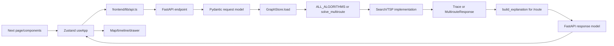
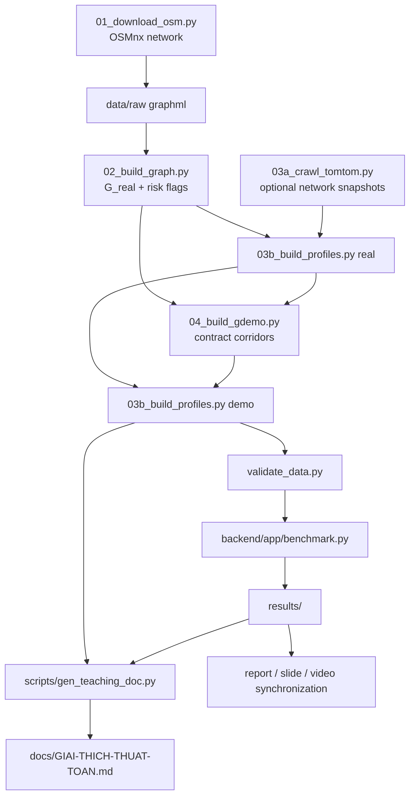
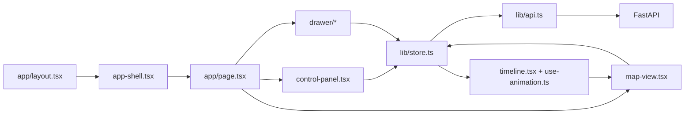

# Project01 Codebase Map

This map records the repository originally inspected on 2026-07-27 from
`aedcf7255c4beadd1de0be69e5638f146bae89ed`, then current-state refreshed on
2026-08-03 through `f22698c9e3636e580b8392a1d213f963e466068c`. It distinguishes intended
contracts, current implementation, executed tests, generated artifacts, and
historical claims. `UNVERIFIED` means the onboarding could not establish the
claim with a suitable runtime check.

The current-state sections were refreshed again on 2026-08-04 from the dirty,
validated worktree at HEAD `9a790dee005ffc13016094749b92c0375d16929b`; these
uncommitted changes are user work, not a release commit.

**Historical audit refresh — 2026-08-08:** current-state claims at that checkpoint were
rechecked on base HEAD `8a78a22` plus the current worktree. The active and only
tracked application frontend is `frontend/`; `frontend1/` was deleted in
commit `faf9866` and is not a current implementation. Fresh gates are 177
backend tests, 41 frontend tests, `ALL DATA VALID`, and a passing TypeScript
check. A clean `npm run build` also completed all 6 static pages. Browser QA at
1366×768, 1024×768 and 390×844 belongs to the preceding UI Clarity freeze and
covered route/ATSP, four result tabs, scenario editing, keyboard/focus, reduced
motion and responsive reflow; the nine-algorithm catalog change was rechecked by
automated tests/build, not by a new manual browser session. Dated
onboarding/FINAL-01 sections below remain historical evidence; the exact
projector/browser used for recording still needs its own pre-flight.

**UI & Explanation v2 implementation snapshot — earlier 2026-08-11:** Phase 0–6 đã hoàn tất và Phase 7
ATSP comparison 2–3 đã triển khai end-to-end trong worktree. Runtime hiện có typed
termination/decision/explanation, subject binding, single-route reference
comparison, prop-driven map canvas, route comparison 2–4 và ATSP comparison 2–3
với N map final-only. Phase 8 bổ sung persistent single-run retry, disclosure
semantics, reduced-motion camera/loading và memoized comparison panes. Fresh gates
là 135 frontend tests, TypeScript/build pass, 228 backend core tests và
`ALL DATA VALID`. Ở checkpoint lịch sử này Phase 7–8 còn chờ browser QA; final
audit refresh ngay dưới supersedes count và verdict đó.

**Final repository audit refresh — 2026-08-11:** baseline `main` / HEAD
`821e77d38b41bb98e473be620b17c76e09a000d8`, initial tracked worktree clean.
Fresh gates trên code hiện hành: backend 235/235 (1 dependency warning), frontend
137/137, TypeScript pass, Next production build 6/6 và data validator `ALL DATA
VALID`. Known issue validator IDA* cũ không còn tái lập và đã có regression cho
exact reference tốt hơn trong biên ε. Một bug shared mutable empty `Explanation`
đã được tái lập, sửa bằng instance riêng cho mỗi `Trace` và test chống nhiễm chéo.
Chrome 151 Desktop maximized trên màn hình vật lý 2560×1440 (viewport CSS
1707×825, DPR 1,5) đã pass toàn bộ flow route/ordered/ATSP, failure/retry/cancel,
stale guard, independent camera, offline/reduced-motion và clean console. Hai ảnh
README đã được chụp lại từ runtime này; browser count cũ phía dưới là historical.

**Official-result closeout — later 2026-08-11:** with explicit authorization,
the repository completed one isolated `benchmark.py` run, gamma calibration and
teaching-document generation against the current 2026-08-03 graph/profile chain.
Independent checks confirmed 800/800 exp1 oracle rows, zero exp2 violations over
21,170 points, exactly 3,600 exp3 rows for nine algorithms, 149/200 exp4 route
changes, seven exp5 gamma rows, five exp6 routes and a five-row exp7 manifest.
`results/README.md` records input/output SHA-256 fingerprints. The generated
teaching document was regenerated twice byte-identically. Counts later in this
map that predate this closeout remain historical rather than current evidence.

**Documentation consolidation — 2026-08-15:** completed implementation plans,
intermediate UI phase-readiness files, duplicate historical ledgers and the
obsolete TomTom closeout run-book were removed. Current contracts remain in
`docs/SCHEMA.md`/`docs/DESIGN.md`; the final UI QA checkpoint remains in
`docs/UI-V2-PHASE8-READINESS.md`; data/result provenance remains in
`data/DATA.md` and `results/README.md`. A read-only re-verification matched all
19 recorded SHA-256 values, passed 235 backend tests and 137 frontend tests,
returned `ALL DATA VALID`, and completed TypeScript with exit code 0. No data,
benchmark, calibration or generated teaching artifact was rewritten.

**Route-contract delta — 2026-08-08:** the group removed the standalone
`dijkstra` choice because it duplicated UCS. The current product exposes nine
route algorithms; Bidirectional Dijkstra remains. Historical audit and result
references below may still describe the previous ten-algorithm artifacts.

### Current frontend and release delta — through 2026-08-08

- `d44b96a`: refreshed the shared pathfinding shell and dark/light control-room
  surface system.
- `f670fa6`: separated ATSP setup/result presentation into
  `frontend/components/atsp/atsp-setup.tsx` and `atsp-result.tsx` without changing
  the store or API contract.
- `6789f25`: hardened accessibility/responsive behavior and added the deck.gl
  route-flow extension in `frontend/lib/route-flow-extension.ts`, with a static
  reduced-motion fallback.
- `f22698c`: completed the read-only benchmark viewer states while retaining
  explicit stale-data provenance.
- FINAL-01 verdict: **DEMO-READY WITH WARNINGS**, **SUBMISSION BLOCKED** and
  **FINAL-DATA NOT ALLOWED**. Backend/API/schema/data/results were unchanged by
  the four UI commits.
- Subsequent work through the UI Clarity worktree adds finite-epsilon/API/benchmark
  regressions, dynamic GraphView/scenario sandbox, ATSP optimization trace,
  seven themes and the completed UI Clarity phase. The right panel now has
  `Số liệu/Giải thích/So sánh/Thử nghiệm`, scenario editing has one authority,
  route outcomes use km/minutes on screen, and start/goal markers plus result
  hierarchy were browser-verified as recorded above. The later nine-algorithm
  catalog delta has automated coverage but no new manual browser run.

## 1. Project purpose and rubric

The assignment is a Vietnamese urban-traffic search project. This repository
chooses a multi-stop shipper in central HCMC, implements nine two-point searches,
three ATSP methods, a step-by-step web GUI, route explanations, and an offline
data/benchmark/report pipeline.

The authoritative rubric was read from page 10 of
`docs/Lab 1 - Searching.pdf` and visually checked:

| Criterion | Points |
|---|---:|
| Vietnamese traffic context and realistic problem scenario | 10 |
| Graph modeling, dataset design, and cost function | 15 |
| Correct implementation of required search algorithms | 20 |
| Additional search or optimization algorithms | 10 |
| Multi-location route optimization | 10 |
| GUI and visualization of the search process | 10 |
| Route explanation and comparison of alternatives | 10 |
| Technical report quality | 10 |
| Demo video quality | 5 |
| **Total** | **100** |

The PDF requires one `[GroupID].zip` containing a source-link TXT, report PDF,
slide PPTX/PDF, video-link TXT, and dataset/data-description ZIP/TXT. These
submission artifacts are not all present.

## 2. Repository structure

Condensed structure, excluding `.git`, `.venv`, `node_modules`, `.next`, and
caches:

```text
.
├── AGENTS.md                         future-agent operating context
├── CLAUDE.md                         legacy handoff and commands
├── PROMPT-MASTER.md                  historical construction specification
├── README.md                         user run guide
├── backend/
│   ├── app/                          API, models, stores, search, TSP, benchmark
│   ├── tests/                        eleven pytest modules
│   ├── conftest.py
│   └── requirements.txt
├── data/
│   ├── graph_{demo,real}.json
│   ├── traffic_profiles_{demo,real}.json
│   ├── gdemo_corridors.json
│   ├── gdemo_pois.json
│   ├── manual_risks.json
│   ├── mock/                         schema/frontend fixtures
│   └── DATA.md
├── docs/
│   ├── Lab 1 - Searching.pdf         assignment and rubric
│   ├── Lab1-ChotPhuongAn.md          settled design choices
│   ├── SCHEMA.md                     intended graph/trace/API/cost contract
│   ├── HEURISTIC-PROOF.md
│   ├── DESIGN.md
│   ├── GIAI-THICH-THUAT-TOAN.md      generated teaching document
│   ├── UI-V2-PHASE8-READINESS.md     final UI v2 QA checkpoint
│   └── AUDIT-CLAUDE-PRE-SUBMISSION.md historical input audit
├── frontend/
│   ├── app/                          root map and benchmark pages
│   ├── components/                   controls, map, timeline, drawer, UI
│   ├── lib/                          Zustand, API, types, formatting, colors
│   └── package.json                  Next 15 / React 19 / TypeScript
├── report/                           ATSP Markdown reports, report frame, slide/video sources
├── results/                          official 2026-08-11 benchmark artifacts
└── scripts/                          data, validation, generator, contrast tools
```

Inventory at onboarding: 132 tracked files, 7 backend test modules, 35
TypeScript/TSX files. The only pre-existing unignored changes were modified
`.gitignore` and untracked `docs/AUDIT-CLAUDE-PRE-SUBMISSION.md`.

## 3. Source-of-truth hierarchy

| Domain | Intended source of truth | Executable/current evidence | Derived, generated, or historical |
|---|---|---|---|
| Assignment/rubric | `docs/Lab 1 - Searching.pdf` | Deliverables on disk | Report self-assessments |
| Settled choices | `docs/Lab1-ChotPhuongAn.md` | Current implementation/data | `PROMPT-MASTER.md` construction details |
| Graph/trace/API/cost contract | `docs/SCHEMA.md` | `backend/app/models.py`, producers, consumers | Generated teaching examples |
| Current backend behavior | Current `backend/app/*.py` | Fresh tests/live calls | old audit claims |
| Current data | Current JSON metadata/content | `scripts/validate_data.py` | Old result prose and old graph counts |
| UI behavior | `docs/DESIGN.md` for intent | Current TS/TSX plus browser QA | Screenshots/audit prose |
| Benchmark definition | `backend/app/benchmark.py` | Official 2026-08-11 run plus independent artifact checks | Older benchmark prose is historical |
| Generated teaching doc | `scripts/gen_teaching_doc.py` plus current inputs | Official regenerated output; byte-idempotence checked | Older generated examples are historical |
| Progress/audit history | None for current behavior | Re-check code/data/tests | baseline and historical audit documents |

For current-behavior disputes, use:

```text
current code/data
  > fresh executed tests/runtime checks
  > intended schema/assignment
  > generated docs
  > historical logs and audit claims
```

For requirement disputes, use:

```text
assignment PDF
  > docs/Lab1-ChotPhuongAn.md
  > PROMPT-MASTER.md
```

## 4. Backend architecture

Primary modules:

| Module | Responsibility | Key symbols |
|---|---|---|
| `models.py` | Pydantic v2 executable contracts | `GraphFile`, `TrafficProfiles`, `Trace`, `RouteRequest`, `MultirouteResponse` |
| `costs.py` | edge weights and heuristics | `congestion_factor`, `edge_penalty_s`, `edge_weight`, `haversine_m` |
| `graph_store.py` | validated load, adjacency, weights, path metrics | `GraphStore.load`, `weights`, `heuristic`, `path_metrics`, `reweighted` |
| `search.py` | five core searches and common recorder/finalizer | `_Recorder`, `_finish`, `bfs`, `dfs`, `iddfs`, `_best_first` |
| `search_advanced.py` | four advanced searches | `greedy`, `bidijkstra`, `idastar`, `beam` |
| `tsp.py` | ATSP matrix and three solvers | `build_matrix`, `held_karp`, `nn_2opt`, `simulated_annealing`, `solve_multiroute` |
| `explain.py` | Vietnamese route explanation/alternatives | `build_explanation` and internal UCS alternative helper |
| `main.py` | FastAPI, dispatch, error envelope, cached result serving | `post_route`, `post_multiroute`, `post_benchmark`, exception handlers |
| `benchmark.py` | seven offline experiments | `exp1` through `exp7`, `main` |

End-to-end request flow:



## 5. REST API

| Method | Path | Request model | Response model | Handler | Core dependency | Test coverage |
|---|---|---|---|---|---|---|
| GET | `/api/health` | query-free | `HealthResponse` | `health` | `platform.python_version` | `test_health` |
| GET | `/api/graph` | `level` query | graph dict validated on load | `get_graph` | `graph_payload`, `GraphStore.load` | demo/real and bad level |
| GET | `/api/traffic` | `slot`, `level` | `TrafficResponse` | `get_traffic` | cached store profiles | coverage/range and bad slot |
| POST | `/api/route` | `RouteRequest` | `Trace` | `post_route` | `ALL_ALGORITHMS`, explanation | all nine, removed-Dijkstra rejection, defaults, params, errors, explanation |
| POST | `/api/multiroute` | `MultirouteRequest` | `MultirouteResponse` | `post_multiroute` | `solve_multiroute` | NN+2opt, limits, duplicates, TSP unit tests |
| POST | `/api/benchmark` | `BenchmarkRequest` | `BenchmarkResponse` | `post_benchmark` | reads whitelisted result files | all/single, 200-or-404 artifact behavior |

`/api/benchmark` serves files; it never runs `benchmark.py`. When `{}` is used,
it silently returns the subset of experiment files that exist and only 404s if
none exist. This partial-result behavior is not explicit in `SCHEMA.md`.

Error handling:

| Exception | Handler | HTTP/code | Current risk |
|---|---|---|---|
| `RequestValidationError` | `on_validation_error` | 422 `VALIDATION_ERROR` or `HELD_KARP_LIMIT` | Request errors normalized |
| `KeyError` for `node ...` | `on_key_error` | 404 `NODE_NOT_FOUND` | Other key errors become 500 |
| internal Pydantic `ValidationError` | `on_internal_pydantic_validation_error` | 500 `INTERNAL` | Generic client response; traceback logged |
| `ValueError` | `on_value_error` | 422 validation/held-karp | Domain/input value errors only |
| `StarletteHTTPException` | `on_http_error` | original status, `VALIDATION_ERROR` | 404/405 use schema envelope |
| unexpected `Exception` | `on_internal` | 500 `INTERNAL` | Generic client message; traceback logged |
| `BenchmarkMissing` | `on_benchmark_missing` | 404 `RESULTS_NOT_FOUND` | Artifact-dependent |

Pydantic `ValidationError` is a `ValueError`. The exact handler added on
2026-07-27 now wins Starlette's MRO lookup, logs the internal traceback, and
returns a generic 500 without validator detail. `RequestValidationError` has a
different MRO and remains on the normalized 422 handler. An endpoint regression
covers both response secrecy and retained `exc_info`.

`RouteParams` permits `beam_width >= 1` and `epsilon > 0`. Irrelevant parameters
are intentionally ignored because all registered algorithms accept `**params`;
this matches `SCHEMA.md`.

## 6. GraphStore and caching

`GraphStore.load(level, data_dir=None)`:

- is `@lru_cache(maxsize=4)`;
- validates graph/profile JSON with Pydantic;
- builds stable sorted adjacency and reverse adjacency;
- indexes edges/nodes;
- precomputes weights for 3 modes × 4 slots;
- keeps graph, profiles, indices, and weights in RAM for process life.

`main.graph_payload(level)` has a second `@lru_cache(maxsize=2)`. There is no
reload endpoint or automatic disk-change invalidation.

Therefore changing files on disk does nothing to an existing process until
caches are cleared or the backend restarts. The 2026-07-27 onboarding reproduced
a stale live API (51/141 versus the then-current 51/292 on disk). FINAL-01 later
verified that historical 51/292 snapshot after a clean restart. The latest
clean runtime probe on 2026-08-11 matched the current G_demo (51/298/60 one-way)
and G_real (2.118/4.699/1.433 one-way); the lifecycle risk still remains.

Demo pre-flight:

1. stop old backend and frontend processes;
2. start the backend from the current checkout;
3. start/restart the frontend and hard-refresh;
4. check `/api/graph?level=demo` against current on-disk metadata;
5. only then capture screenshots/video.

## 7. Cost and unit model

| Mode | Edge weight | `total_cost` | `total_time_s` | Heuristic | IDA* epsilon unit | Explanation unit |
|---|---|---|---|---|---|---|
| `distance` | `length_m` | metres | balanced seconds | haversine metres | metres | must be `m`/`km` |
| `time` | free time × congestion | seconds | balanced seconds | haversine / `v_max` | seconds | seconds/minutes |
| `balanced` | time weight + risk penalties | seconds | same balanced seconds | haversine / `v_max` | seconds | seconds/minutes |

Definitions in `costs.py`/`SCHEMA.md`:

```text
t_free = length_m / (free_speed_kmh / 3.6)
f_cong = 1 + gamma * (congestion - 1) / 4, gamma = 1.5
penalty = 60*flood + 90*construction + 30*narrow_alley + 25*traffic_light
balanced = t_free*f_cong + penalty
```

Graph JSON stores `free_travel_time_s` rounded to 0.1 s; runtime weights
recompute from length/speed without using the rounded field. Pipeline
`ceil_dm` protects lower-bound/consistency behavior against length rounding.

Resolved on 2026-07-27: `build_explanation` now derives the IDA* epsilon and
non-optimal cost-gap suffix from the mode. `distance` uses metres;
`time`/`balanced` use seconds, with three-mode API regressions for both branches.

## 8. Heuristic and proof

`GraphStore.heuristic` uses:

- `haversine_m(node, goal)` for distance;
- `haversine_m / graph-wide v_max_mps` for time/balanced.

`docs/HEURISTIC-PROOF.md` proves consistency from geometric distance, the
global maximum free speed, non-negative congestion/penalties, and the fact that
road length lower-bounds straight-line distance. Consistency implies
admissibility. Parameter changes must preserve non-negative additive costs and
the global-speed bound.

Executed tests:

- `test_weight_lower_bound_lemma3`;
- `test_heuristic_consistent_on_every_edge`.

The consistency test covers every edge but only three goals per store; its
name/proof prose should not be confused with an exhaustive all-goal run. The
official exp2 artifact adds an empirical check over 21,170 reached-node records
for ten goals: zero violations and `max(h/h*) = 0.8886`. Its SHA-256 still
matched the official ledger on 2026-08-15; the proof, not this finite sample,
supports the general guarantee.

## 9. Nine search algorithms

All functions use signature-compatible `**params`, validate endpoints, and
return `Trace`.

| Algorithm | File/function | Frontier/priority | Weight/heuristic | Goal test | Guarantee condition | Termination/cap | Current test evidence |
|---|---|---|---|---|---|---|---|
| BFS | `search.py::bfs` | FIFO queue | unweighted | pop/expand | hop-optimal only | queue empty | 100 seeded demo hop comparisons |
| DFS | `search.py::dfs` | LIFO stack | unweighted | pop/expand | none | stack empty | valid paths |
| IDDFS | `search.py::iddfs` | depth-limited LIFO rounds | unweighted | pop/expand | shallowest within configured depth | default max depth 100 | BFS-depth samples, limit field |
| UCS | `search.py::ucs` | min-g heap | mode weight | pop/expand | non-negative weights | heap empty | exhaustive demo combinations + real samples |
| A* | `search.py::astar` | `(f,h,tie)` heap | g + h | pop/expand | admissible/consistent h | heap empty | same cost oracle plus heuristic tests |
| Greedy | `search_advanced.py::greedy` | min-h heap | h only | pop/expand | none | heap empty | path/suboptimal witness, h-only trace |
| Bidijkstra | `search_advanced.py::bidijkstra` | two min-g heaps | forward/reverse g | selected-side pop | non-negative weights and stop rule | `top_f+top_b >= mu` | UCS comparisons, side/key shape |
| IDA* | `search_advanced.py::idastar` | f-bounded DFS rounds | g + h, epsilon thresholds | in-bound pop | epsilon claim when found; proof when exhaustively unreachable | default 1,000 rounds; cap exit has no guarantee | sampled epsilon, cap, and unreachable tests |
| Beam | `search_advanced.py::beam` | layer then best-k pruning | g + h | current-layer expansion | none; incomplete | retained layer empty/found | width 60/1/default plus controlled top-k trace |

Common `_Recorder` caps trace storage at 5,000 steps while search and metrics
continue. `start == goal` returns `[start]`, zero expansions, and an empty trace.

Practical claims must be conditional:

- IDDFS is not unconditionally complete with `IDDFS_MAX_DEPTH=100`.
- IDA* can exhaust `IDASTAR_MAX_ROUNDS=1000`; that capped `found=false` exit now
  reports `optimal_guarantee=false`, while exhaustive unreachability reports
  `true`.
- Beam is intentionally incomplete/non-optimal.

## 10. Trace contract

| Field | Schema meaning | Producer | Validator/consumer | Required invariant |
|---|---|---|---|---|
| `step` | 1-based continuous expansion number | `_Recorder.record` | TS timeline/table | continuous and unique |
| `expanded` | node just expanded | each algorithm | map/timeline | valid graph node |
| `frontier` | open nodes immediately after expansion | algorithm snapshot | map/g-h-f table | no expanded/closed-only values |
| `g` | displayed mode cost for frontier | weighted searches | model field family | keys equal frontier; rounded display |
| `h` | heuristic for frontier | Greedy/A*/IDA*/Beam | model field family | keys equal frontier |
| `f` | raw g+h then display rounding | A*/IDA*/Beam | model field family | same frontier and arithmetic meaning |
| `depth_limit` | current IDDFS round | `iddfs` | model/timeline | IDDFS only |
| `side` | expanded Bidijkstra side | `bidijkstra` | model/map | bidijkstra only |
| `trace_truncated` | stored list hit 5,000 | `_Recorder`/`_finish` | metrics UI | full-run metrics remain independent |
| `epsilon_bound` | IDA* threshold increment | `idastar` | metrics | same unit as mode |
| `beam_width` | retained layer limit | `beam` | metrics | integer >= 1 |

Repair status:

1. **Resolved:** `iddfs` records after pushing eligible successors.
2. **Resolved:** `idastar` records after pushing eligible successors.
3. **Resolved:** Bidijkstra selects g from each node's active side and uses
   `min` only when the node is active in both frontiers.
4. **Resolved:** Beam snapshots only the selected top-k next-layer candidates.
5. **Resolved:** Beam `max_frontier` measures the selected beam and is bounded
   by `beam_width`; IDA* snapshots after generation and its cap termination is
   explicit.

The model enforces algorithm-specific nullability, not every semantic
invariant. Controlled tests now cover all five repaired items.

## 11. TSP and multiroute

`build_matrix` runs a product UCS from each selected point over directed
weights and caches each leg path. The matrix is asymmetric.

| Method | Function | Exact/heuristic | Limit | Randomness | Return to start | Guarantee |
|---|---|---|---:|---|---|---|
| Held-Karp | `held_karp` | exact bitmask DP | <=15 total points | none | supported | true |
| NN + 2-opt/Or-opt | `nn_2opt` | heuristic | <=16 total points | none | supported | false |
| Simulated Annealing | `simulated_annealing` | heuristic | <=16 total points | seeds 0-4, 2,000 iterations/seed | supported | false |

The asymmetric-safe local search fully re-costs changed orders instead of using
a symmetric 2-opt delta. `solve_multiroute` returns original-order totals,
optimized totals, savings, legs, and method guarantee. Unit tests cover
asymmetry, Held-Karp vs brute force, determinism, schema, return-to-start, and
limits. Unreachable multi-stop behavior lacks a dedicated test.

## 12. Explanation generation

`post_route` always calls `build_explanation`. It uses current route metrics,
path congestion, a distance-optimal alternative, a Greedy alternative, and an
internal product UCS for optimal-gap wording.

Intended outputs:

- Vietnamese `summary_vi`;
- only on-path congestion segments with level >=4;
- alternatives with same endpoints and mode-aware comparison;
- explicit guarantee wording.

Tests verify substantial text and selected mode-dependent numbers, including
all three units for epsilon/gap wording, but not all algorithms, all slots,
`found=false`, no-congestion paths, or every alternative semantic.

## 13. Data pipeline



Correct dependency order:

```text
01 -> 02 -> optional 03a for each selected slot -> 03b real
   -> 04 -> 03b demo -> validate -> one isolated benchmark run
   -> optional gamma calibration -> teaching regeneration
   -> manual report/slide/video/banner synchronization
```

Network calls are limited to one-off scripts: OSMnx in 01, TomTom requests in
03a, and Carto style access in the contrast checker. Demo/backend routing does
not crawl.

## 14. Current data snapshot

Directly read from current JSON and rechecked by `validate_data.py`:

| Graph | Created | Nodes | Directed edges | `oneway=true` | Flood | Construction | Narrow alley | Traffic light |
|---|---|---:|---:|---:|---:|---:|---:|---:|
| `G_demo` | 2026-08-03 | 51 | 298 | 60 | 24 | 24 | 0 | 130 |
| `G_real` | 2026-07-27 | 2,118 | 4,699 | 1,433 | 54 | 19 | 8 | 185 |

Both profile files:

- were created 2026-08-03;
- declare `source: tomtom+synthetic`;
- contain exactly 4 slots;
- cover all 298 or 4,699 edges per slot.

Four raw TomTom snapshots exist: 07:30 and 12:00 were queried on 2026-07-27;
17:30 and 22:00 were queried on 2026-08-03. Both dates are Mondays, seven days
apart, so these are representative slot snapshots rather than a same-day time
series. Each slot has 40 valid sample points. The real profile assigns TomTom
levels to 635/4,699 edges per slot and uses deterministic synthetic fallback for
the other 4,064 edges. The demo profile is derived from real-profile corridor
weighted means. `graph_raw.graphml`, all four TomTom JSON files and the OSMnx
cache are present under `data/raw/` and Git-tracked in the current repository.
Validator reports `ALL DATA VALID`.

`manual_risks.json` has 8 records and 8 reviewed direct `source_url` values. Its
`meta.description_vi` matches the current "edge entering the zone" rule,
discloses the route-start-inside limitation, and classifies the URLs as
historical route/area evidence rather than real-time incident data. `r02` has a
borderline spatial match; `r07` is an emergency sinkhole work zone rather than a
sewer project; `r08` is historical water-infrastructure work rather than road
resurfacing. Full caveats are in `data/DATA.md` §2.1.

The six demo-vs-real contraction invariants are:

- free-flow time <=1.5x;
- distance <=1.8x;
- balanced cost <=1.5x for each of the four slots.

## 15. Benchmark pipeline

`backend/app/benchmark.py` uses seed 42 and 200 OD pairs. Runtime values are
wall-clock and therefore not byte-reproducible.

| Exp | Purpose | Input/algorithms | Randomness | Output | Main consumers |
|---|---|---|---|---|---|
| 1 | correctness | `G_real`; UCS/A* vs NetworkX at 2 slots | OD seed 42 | `exp1_correctness.csv` | correctness claims |
| 2 | heuristic empirical check | 10 goals, reverse UCS h* | seed 42 | CSV + scatter | proof/report |
| 3 | nine-algorithm comparison | 200 pairs × 2 slots | shared pairs | CSV + 3 figures | report/benchmark page |
| 4 | congestion route change | A* 07:30 vs 22:00 | shared pairs | CSV + examples | headline/report/video |
| 5 | gamma sensitivity | gamma 0..3 | shared pairs | CSV + curve | cost rationale |
| 6 | qualitative routes | five G_demo POI pairs | fixed | JSON + PNG/GeoJSON | Google Maps captures |
| 7 | ATSP comparison | one ten-point scenario | SA seeds 0-4 | CSV + map | report/video |

The official 2026-08-11 run consumes the current 2026-08-03 graph/profile
chain. It produced 800/800 passing NetworkX comparisons, zero empirical
admissibility violations over 21,170 points (maximum sampled `h/h* = 0.8886`),
3,600 exp3 rows for nine algorithms, 149/200 changed routes between 07:30 and
22:00, and current exp5–exp7 outputs. Runtime columns are environment-dependent;
the structural, oracle, aggregate and checksum evidence is the reproducible
part. Full provenance and SHA-256 fingerprints are in `results/README.md`.

## 16. Generated artifacts

| Artifact | Source/owner | Current status |
|---|---|---|
| `docs/GIAI-THICH-THUAT-TOAN.md` | `scripts/gen_teaching_doc.py` + data/traces + exp3/exp7 | official 2026-08-11 generated output; repeated generation was byte-identical |
| `results/*.csv`, figures, routes | `backend/app/benchmark.py` | official 2026-08-11 coherent run; verified against current inputs |
| `data/graph_*.json`, profiles, preview | pipeline scripts | generated snapshot; current and validated |
| `report/Report_3ATSP_Final.md`, `report/Report_3ATSP_EN.md` | manual report sources + official exp7 artifact | current ATSP report section in Vietnamese plus English companion; result provenance rechecked 2026-08-15 |
| `report/BaoCao-Khung.md` | manual frame with data/result references | incomplete |
| `report/Slide-Outline.md` | manual | outline only |
| `report/Video-KichBan.md` | manual | script only, video absent |

The five former `SỐ TẠM` locations (`results/README.md`, the three report
sources and the generated teaching document) were synchronized in the same
official-result closeout. Historical audit ledgers may still quote the former
banner as dated evidence; they do not describe the current artifacts.

`BaoCao-Khung.md` now contains 25 `[ĐIỀN…]` occurrences and 23 actionable
content markers after excluding two instructional/self-referential mentions.
There are also 13 screenshot-marker occurrences and eight actionable unassigned
responsibility entries. Earlier 13/11 and 31/25 counts are historical.

## 17. Frontend architecture



`app/page.tsx` owns the route workspace inside a responsive shell: three regions
at desktop, one control rail plus result overlay at tablet widths, and map-first
controls/results sheets below 960 px. It dynamically loads `MapView` client-side.
`useApp` is the single global state/action store.
`lib/types.ts` mirrors backend response shapes. `lib/api.ts` normalizes the
backend error envelope. `lib/metric-presentation.ts` keeps raw API metres/seconds
separate from visible km/minutes; `lib/ui-copy.ts` centralizes mode copy;
`lib/atsp-event-copy.ts` maps raw optimizer events to Vietnamese presentation.
`components/applied-scenario-details.tsx` presents scenario provenance without
duplicating the editor, while `lib/use-mobile-dialog-focus.ts` owns sheet focus
entry/return.

The separate `/benchmark` page loads cached experiment results and renders
Recharts. `frontend/package.json` defines the repository test runner as
`npm test`; the current suite contains 137 deterministic Node test cases.
TypeScript checking and browser/runtime QA remain separate gates.

## 18. Zustand state and invalidation

| State | Initial value | Setter/owner | Persisted | Invalidates/async behavior |
|---|---|---|---|---|
| theme | `default` | `initTheme`, `setTheme` | `traffic-theme-v2` | none |
| graph | demo | `loadGraph` | no | clears journey/results; reloads graph/traffic |
| slot | 07:30 | `setSlot` | no | same-value is a no-op; a real change clears dependent results and old traffic, then reloads with a latest-request/graph-slot guard |
| mode | balanced | `set` | no | not immediately invalidated |
| algorithm | astar | `set` | no | not immediately invalidated |
| start/goal | null/null | centralized `set` | no | clears trace/compare/multi |
| stops | `[]` | centralized `set` | no | clears results; adding stop clears goal with an explanatory toast; duplicates with start/goal/another stop are rejected |
| beamWidth/epsilon | blank | `set` | no | sent only for matching algorithm |
| offlineMode | false | `set` | no | changes basemap branch |
| trafficLayer | false | `set` | no | display only |
| traceOnReal | false | `set` | no | hides animation trace, keeps route |
| trace/compare/multi | null | async actions | no | stale-response guards compare request snapshot |
| timeline | step 0, paused, 1x | `setStep`, `togglePlay` | no | reset on journey/result changes |
| drawer | open, metrics tab | `set` | no | four tabs: metrics/explain/compare/scenario; layout only |

Journey invalidation compares semantic start/goal/stops values. Re-selecting
the same endpoint or passing an equal ordered stops array preserves results;
real-map and demo-picker paths prevent endpoint/stop duplication. Tour mode
disables the Goal picker and two-endpoint swap, and the route action is blocked
while any stop exists. Route/graph/traffic responses use request-snapshot or
latest-request guards. Every async `finally` checks the current request/run token
before clearing a busy flag, so an older completion cannot end the state of a
newer run.

## 19. Visualization and timeline

`MapView` is now the single-run state wrapper around prop-driven
`RouteMapCanvas`. The canvas combines MapLibre/Carto or an offline background
with deck.gl layers for roads, traffic, nodes, final/reference paths, direction
arrows, labels, the current-node pulse and route-flow emphasis. Comparison
reuses the canvas with shared geometry and view-only capabilities. `useAnimation`
projects the current `TraceStep`; the primary map, timeline and g/h/f table share
`stepIdx`.

Verified/current findings:

- Timeline installs a window-level Space/Left/Right handler only while a trace
  is visible.
- Native controls, links, contenteditable targets, and Radix control roles own
  their keyboard events; a browser probe confirmed Space toggles a focused
  switch without playing the timeline, while body Space still plays it.
- The trace current-node pulse updates every 50 ms; reduced motion keeps a
  static ring instead of pulsing.
- `ROUTE_FLOW_EXTENSION` is a singleton deck.gl `LayerExtension` driven by
  `_animate`; the base route remains readable and reduced motion uses a static
  highlight. Its input is either the final two-point path or one continuous
  ATSP polyline assembled from `multi.legs`; repeated join nodes are removed so
  the highlight travels from Đi through the full delivery order instead of
  restarting on every leg. Active trace steps suppress two-point route-flow to
  avoid competing motion.
- The result-route stack (casing, route body, flow and direction arrows) is
  composed above base/frontier/expanded nodes so dense G_real trace states do
  not cut the route into visually disconnected fragments. Current-node rings,
  POI labels and endpoint/stop chips remain above the route; route layers stay
  non-pickable so node selection behavior is unchanged.
- Route comparison selects 2–4 algorithms. N selected algorithms create N
  equal-size final-only map panes with independent camera; panes do not expose
  picking, editing, clear, timeline or autoplay. The drawer presents an N-way
  table, per-item status/retry and binds Explain to the selected result.
- Single two-point Explain can select a posthoc UCS reference and render it as
  a dashed, 4 px offset route. Congestion levels 4–5 on the selected final route
  are highlighted red only as result evidence; panel copy says this is not the
  algorithm's current timeline path.
- Drawer Explanation recognizes ordered multi per-leg evidence. ATSP compare
  mode now selects 2–3 methods, runs them sequentially on one immutable snapshot,
  keeps partial results/retry, renders one final-only map per method and presents
  baseline legs, outcome/effort, exact gap and per-result explanation in one table.
- FINAL-01 functional route-flow QA passed G_demo/G_real, compare, trace,
  clear/invalidation and reduced-motion states. G_real measured only about
  16 FPS under Chromium SwiftShader; a hardware-GPU run was not reproduced.
- The ATSP route-flow follow-up passed G_demo dark/light, moving-frame,
  reduced-motion and clear/invalidation checks at 1366×768. G_real start/stop
  picking was smoke-tested; a G_real ATSP result was not runtime-reproduced.
- `clearMap` immediately clears selections/results without confirm or undo.
- Offline mode is not persisted.
- `next/font/google` and Carto styles mean disconnected-first build/render is
  not proven.
- The shell remains desktop-first. FINAL-01 found no horizontal overflow at
  1180×720, 1366×768 or 1600×900; smaller/mobile layouts remain out of contract.

B-5 repair:

- root body: `h-screen overflow-hidden`;
- benchmark main now owns `h-screen overflow-y-auto`;
- its inner content owns width/padding and uses `min-h-full`.

Headless Chrome first reproduced no scroll owner, then verified at 1366×768
that `main` had client/scroll heights 768/796 px and reached `scrollTop=28`.
The map route retained root body overflow ownership.

## 20. Test architecture

The official-result closeout gate produced **235 passing backend tests** (one
dependency warning). Frontend has a separate **137-test** Node suite plus a passing
TypeScript check. The suites cover v2 termination/decision/explanation,
comparison sessions, map isolation, drawer resize, reference-route presentation,
per-result explanation isolation, ATSP open/closed presentation and
trace-cap/full-metrics parity. The clean
Next 15.5.22 production build completed compile/type/static generation 6/6;
Chrome Desktop N-map QA also passed in a clean session with 0 console
error/warning.

| Test file | Module/type | Main invariant/oracle | Dataset | Important gap |
|---|---|---|---|---|
| `test_schema.py` | model/contract | graph, trace, bidi, multiroute validators | mock | several cross-field semantic invariants |
| `test_costs.py` | math | hand cost, lower bound, consistency | demo/real | all-goal proof wording |
| `test_search.py` | core search | NetworkX weighted/hop oracles; IDDFS post-expand trace; cap-only payload; result isolation | demo + sampled real | repeated determinism |
| `test_search_advanced.py` | advanced search | UCS comparison, epsilon bounds, Bidijkstra ownership, IDA* trace/cap, Beam top-k trace | demo + sampled real + tiny controlled stores | broader termination/property coverage |
| `test_tsp.py` | ATSP | brute force, asymmetry, determinism | demo | unreachable multistop and fuller API method coverage |
| `test_api.py` | FastAPI | endpoint shapes/errors; three-mode units; internal-error secrecy/logging | current stores/results-dependent | broader injected internal failures |
| `test_artifact_generation.py` | generator/benchmark semantics | exp5 cost mode, ATSP gap wording, executable generator entry point and current BFS narrative | synthetic fixtures + current generated artifact | benchmark runtime itself is checked by the independent artifact ledger rather than pytest |
| `test_data.py` | built data | Pydantic load, size/regression | current demo/real | benchmark/data provenance fingerprint |
| `test_optimization_trace.py` | ATSP recorder | strict event union, caps/sampling, trace-on/off equality | demo + controlled cases | dedicated frontend render test |
| `test_scenario.py` | GraphView/scenario | dynamic 3…50 views, SCC, preset/generator parity, fingerprint | current demo/real | browser parity after final generator run |
| `test_scenario_overrides.py` | sandbox | validation, immutability, recomputation, fingerprint/API errors | current demo | long-running concurrent request stress |
| `test_ui_v2_phase0_fixtures.py` + `test_ui_v2_phase1_contract.py` | UI v2 contract/golden | Bidi overlap/μ stop, termination/decision/explanation, trace on/off parity, asymmetric ATSP | tiny controlled + demo fixtures | browser presentation remains separate |

Scale statements such as thousands of NetworkX comparisons inside loops are
not pytest item counts.

Completed semantic regressions:

1. exact post-expand trace snapshots for IDDFS and IDA*;
2. Bidijkstra g values from the frontier side(s) where each node is active;
3. mode-aware explanation epsilon/gap units across all three modes;
4. Beam selected frontier and metric bounded by `beam_width`;
5. IDA* capped versus exhaustive-unreachable guarantees;
6. internal Pydantic failure is generic 500 with server-side traceback;
7. browser scroll, keyboard ownership, and journey-state behavior (historical
   FINAL-01 evidence);
8. finite positive epsilon and model/API rejection of non-finite values;
9. typed OpenAPI graph/error responses and experiment-6 JSON benchmark rows;
10. Bidirectional Dijkstra initial frontier and trivial-route mode units;
11. slot/traffic coherence, route–multiroute guards, effective-trace legend and
    sign-aware ATSP savings, dynamic GraphView, theme behavior and presentation
    copy/unit rules plus the exact nine-algorithm catalog in the frontend 42-test suite;
12. Phase 0 golden parity cho Bidi overlap/μ và ba ATSP methods ở open/closed,
    cùng regression provenance/objective của copy Giải thích;
13. trace cap chỉ cắt payload, không đổi path/full metrics, và mỗi `Trace` sở hữu
    một `Explanation` rỗng riêng.

Priority semantic tests still missing:

1. full metrics/search after 5,000-step trace truncation;
2. full keyboard role/contenteditable matrix beyond the focused-switch probe;
3. async overlap behavior;
4. benchmark artifact provenance tied to graph/profile fingerprints.

## 21. Build and run commands

From repo root in PowerShell:

```powershell
.venv\Scripts\python.exe -m pytest backend\tests\ -v
.venv\Scripts\python.exe scripts\validate_data.py
Set-Location frontend
npx tsc --noEmit
```

From repo root in Git Bash on Windows:

```bash
.venv/Scripts/python.exe -m pytest backend/tests/ -v
.venv/Scripts/python.exe scripts/validate_data.py
cd frontend
npx tsc --noEmit
```

Development CWDs:

- backend: `..\.venv\Scripts\python.exe -m uvicorn app.main:app --port 8000`
  in PowerShell, or `../.venv/Scripts/python.exe ...` in Git Bash;
- frontend: `npm run dev`.

Do not run `npm run build` while any Next dev process is active. Benchmark and
teaching generator are intentional generated writes and are not default
validation commands.

## 22. Critical invariants

- PDF requirements outrank project plans.
- Schema changes precede public contract implementation changes.
- One trace contract serves all nine algorithms.
- `distance` is metres; `time`/`balanced` are seconds.
- Never mix units in cost, heuristic, epsilon, or explanation text.
- NetworkX stays out of runtime search/TSP/API.
- Backend demo is network-free; optional crawlers remain isolated.
- All randomness is explicitly seeded.
- Trace cap affects payload only, not result/metrics.
- Heuristic and weight premises must remain valid.
- Traversal/tie-break order remains stable.
- Directed/ATSP semantics are preserved.
- Data/results are not regenerated piecemeal.
- Generated teaching content is regenerated through its script.
- Benchmark numbers are official only when their recorded input/output
  fingerprints still match the current files; otherwise downgrade them to stale.

## 23. Audit verification matrix

Statuses use the onboarding vocabulary requested by the handoff.

### BLOCKER

| ID | Status | Current file/function | Root cause/evidence | Existing test | Missing verification/test |
|---|---|---|---|---|---|
| B-1 | `RESOLVED` | current data vs `results/*` | isolated 11/08 run consumed the 03/08 graph/profile chain; independent oracle/shape/aggregate/image checks and SHA-256 ledger passed | generator regression plus artifact validation ledger | downgrade to stale if a recorded input fingerprint changes |
| B-2 | `CONFIRMED` | `report/*`, repository root | no final report PDF, deck, video link, ZIP; 23 actionable fill markers out of 25 occurrences after excluding two instructional mentions; final URL QA/screenshots absent | none appropriate | manual artifact review/package check |
| B-3 | `RESOLVED` | `iddfs`, `idastar`, `bidijkstra` | snapshots moved post-generation; g restricted to active side(s) | red-before/green-after semantic tests | full 111-item suite passed |
| B-4 | `RESOLVED` | `explain.py::build_explanation` | mode-derived `m`/`s` suffix | epsilon and gap tested in all 3 modes | full 111-item suite passed |
| B-5 | `RESOLVED` | benchmark page scroll owner | reproduced before patch; `main` now independently scrolls 28 px | headless Chrome 1366×768 | recheck on actual projector before recording |
| B-6 | `MITIGATED` | `GraphStore.load`, `graph_payload`, live API | process caches old data; the latest clean probe matched disk for demo 51/298 and real 2.118/4.699 | clean-start runtime probe | repeat restart/hard-refresh pre-flight before every capture |

### High-priority audit findings

| ID | Status | Evidence | Remaining uncertainty |
|---|---|---|---|
| P-01 timeline captures keys | `RESOLVED` | native/Radix/contenteditable ownership guard; listener absent without trace | focused-switch/body Space browser matrix passed |
| P-02 IDA*/IDDFS runtime budget and epsilon | `PARTIALLY_CONFIRMED` | finite algorithm caps but no time budget; UI min epsilon 0.1 | extreme runtime not reproduced |
| P-03 Beam frontier schema | `RESOLVED` | trace/metric expose selected top-k only | controlled width-1 regression |
| P-04 IDA* exhausted-round guarantee | `RESOLVED` | capped exit false; exhaustive-unreachable true | controlled termination regressions |
| P-05 light-theme contrast | `RESOLVED` | contrast checker passed and FINAL-01 exercised dark/light runtime states | formal WCAG/screen-reader audit not run |
| P-06 offline mode/Google font | `PARTIALLY_CONFIRMED` | offline not persisted; `next/font/google` present; online production build passes | disconnected build not run |
| P-07 same-value invalidation / stale traffic | `RESOLVED` | semantic slot comparison precedes invalidation; real slot changes clear traffic and guard graph/slot/request identity | automated regression; latest browser interaction is unverified |
| P-08 manual risk description | `RESOLVED` | metadata now states `u` outside/`v` inside and the start-inside limitation | JSON/prose inspection |
| P-09 result README/run-book defects | `RESOLVED` | official README records nine-algorithm shape, full provenance, checksums and verification; all five former banners are synchronized | none for the current frozen inputs |
| P-10 Pydantic `ValidationError` | `RESOLVED` | exact handler returns generic/logged 500; request errors remain 422 | endpoint response/log regression |
| P-11 endpoint/stop conflict and route–multiroute overlap | `RESOLVED` | pickers reject duplicates; route action is blocked while stops exist; tour Goal/swap controls are disabled | automated policy regression; latest browser interaction is unverified |
| P-12 README Git Bash paths | `RESOLVED` | PowerShell and Bash path conventions are now separated | execute on non-Windows only if that platform becomes supported |
| P-13 deck.gl animation performance | `PARTIALLY_CONFIRMED` | functional pulse/route-flow states pass; G_real SwiftShader run was about 16 FPS | profile with hardware GPU |
| P-14 `max_frontier` overhead | `PARTIALLY_CONFIRMED` | DFS/IDDFS/Bidi compute/sort frontier on run path | benchmark impact not measured |

### Lower-priority grouped observations

| Group | Status | Notes |
|---|---|---|
| trace display rounding/start==goal animation | `PARTIALLY_CONFIRMED` | code rounds maps independently; trivial route trace is empty |
| code hygiene/docstrings/logging | `PARTIALLY_CONFIRMED` | static issues exist but were not exhaustively adjudicated |
| proof/test wording | `PARTIALLY_CONFIRMED` | sampled goals vs broad prose confirmed |
| historical doc line references/counts | `STALE` | several old counts/line anchors conflict with current files |
| a11y/responsive/reduced motion | `PARTIALLY_VERIFIED` | 71/71 browser assertions include keyboard/focus/targets, reduced motion and three desktop viewports | real screen reader and mobile/formal WCAG not run |
| miscellaneous performance/API payload comments | `NOT_REPRODUCED` | non-blocking audit suggestions were not benchmarked |

## 24. Known stale information

- The old 83.5% route-change, 0.565 heuristic-ratio, ten-algorithm and synthetic
  benchmark examples survive only in dated historical ledgers; current artifacts
  are the official 2026-08-11 set.
- Old graph counts such as 141/253/402 edges in history.
- The retained baseline and Claude audit are historical claim collections, not
  current truth.
- Earlier audit placeholder counts 31/25 and 13/11 are stale; current count is
  25 occurrences and 23 actionable markers after excluding two instructional
  mentions.

## 25. Safe change workflow

1. Inspect `git status --short` and preserve all existing user work.
2. Identify requirement, intended contract, current producer, consumer, and
   semantic test before patching.
3. If a public contract should change, patch `SCHEMA.md` first with approval.
4. Keep patches small and do not touch data/results/generated docs incidentally.
5. Run the narrow regression test.
6. Run the full backend suite, validator, frontend tests, and type check as applicable.
7. Use live/browser verification for UI/lifecycle claims.
8. If data changes, execute the entire dependency chain once; never mix old and
   new artifacts.
9. Inspect diff/status and do not commit unless asked.

## 26. Recommended fix order

The authorized data closeout and GraphView/ATSP-trace/sandbox implementation
are complete. Remaining safe order:

1. Freeze the graph/profile/benchmark/generator inputs whose fingerprints are
   recorded in `results/README.md`; if any changes, explicitly downgrade the
   official-result claim until a coherent authorized rerun.
2. Restart services, verify live graph metadata, and redo browser QA at the
   actual capture/projector resolution before recording.
3. Complete final anonymous-link QA, remaining role/report assignments, report
   PDF, slides, video, data package, links, and final ZIP.

## 27. Unresolved questions

- Who owns the remaining roles/report sections, and who reconfirms Thái Quang
  Huy as the final submitter?
- Can/should the Google fonts be localized before an offline defense?
- What exact timeout/cancellation contract should IDDFS and IDA* expose?
- Which browser, projector resolution and hardware will be used for the final
  pre-flight and recording?
