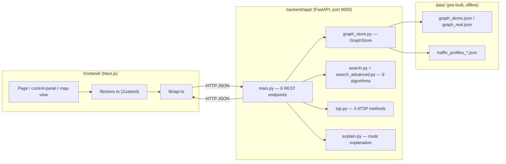
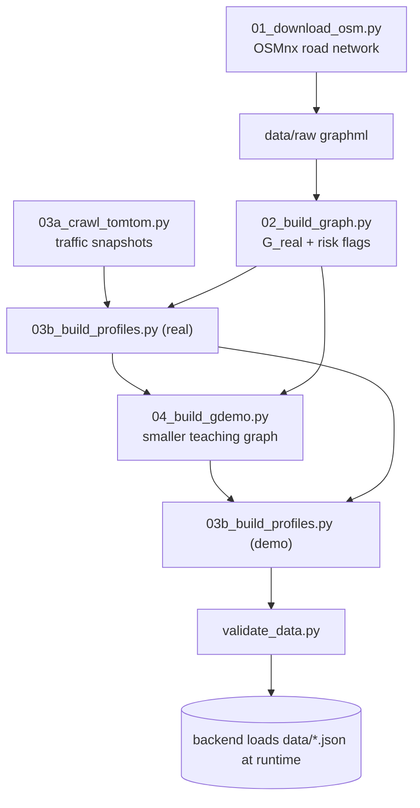
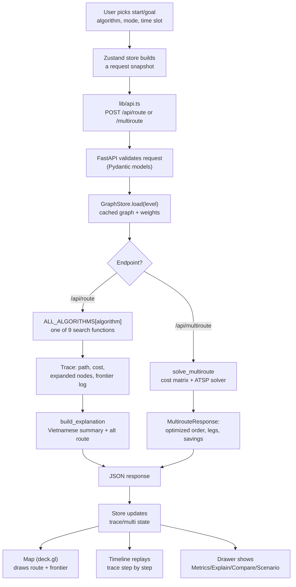
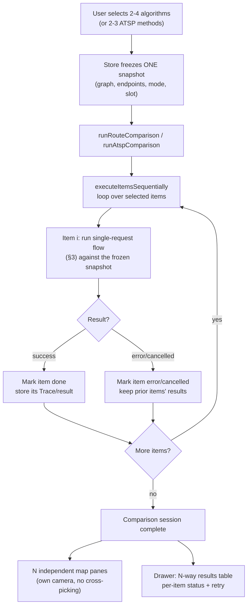
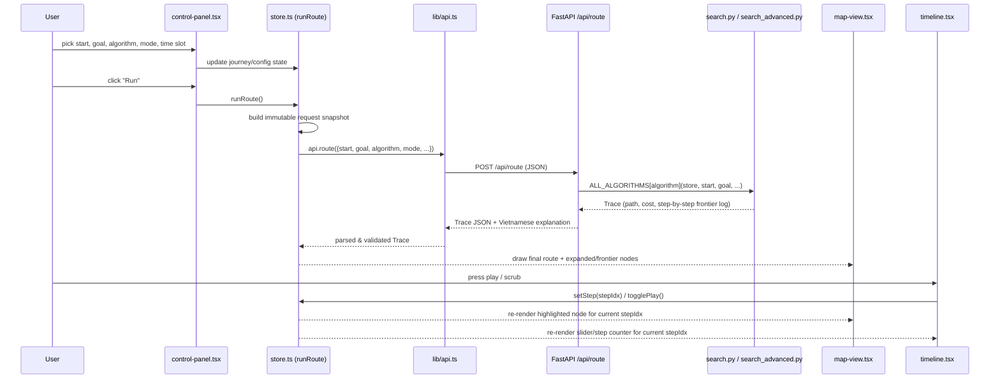

# Program Flow

High-level reference for how the system is wired together: architecture, main
processing steps, module responsibilities, and how the GUI drives the search
algorithms. For contracts and rubric detail, see `docs/SCHEMA.md` and
`docs/CODEX-CODEBASE-MAP.md`.

## 1. System overview

The project is a client/server web app: a Next.js single-page GUI on top of a
stateless FastAPI backend that owns all search/TSP logic. The backend never
calls the network at request time; graph and traffic data are pre-built JSON
files loaded once into memory.

## 2. Offline data pipeline (build-time, not part of a live request)

Graph and traffic data are generated once by scripts, not by the running app.

## 3. End-to-end request flow (main processing steps)

This is the core loop the GUI drives every time a user runs a search: pick
endpoints/algorithm → call API → backend runs the algorithm → result renders
on the map/timeline.

### 3.1 Comparison mode (N algorithms, one snapshot)

Comparison mode does not add a new backend path — it replays the single-run
flow above once per selected algorithm/ATSP method, against one frozen
snapshot, and keeps each result independent so a failure or cancel on one
item does not affect the others.

Key points:

- **One snapshot, many runs.** The snapshot (endpoints/mode/slot/scenario) is
  frozen before the loop starts, so every algorithm/method in the comparison
  is judged on identical inputs — only the algorithm choice varies per call.
- **Independent failure handling.** Each item tracks its own
  `running`/`done`/`error`/`cancelled` status; one slow or failing algorithm
  does not block or invalidate the others' results.
- **N map panes, not N timelines.** Each pane is final-route-only (no
  step-by-step trace playback, no editing) so the UI stays legible with up to
  4 route algorithms or 3 ATSP methods side by side.

## 4. Main backend modules

| Module | Responsibility | Key symbols |
|---|---|---|
| `main.py` | FastAPI app, 6 REST endpoints, request dispatch, unified error envelope | `post_route`, `post_multiroute`, `get_graph`, `get_traffic`, `post_benchmark` |
| `graph_store.py` | Loads/validates graph + traffic JSON once, builds adjacency, precomputes edge weights and heuristics, in-memory cache | `GraphStore.load`, `weights`, `heuristic` |
| `costs.py` | Edge weight and heuristic math (distance/time/balanced modes) | `congestion_factor`, `edge_weight`, `haversine_m` |
| `search.py` | 5 core algorithms: BFS, DFS, IDDFS, UCS, A* + shared trace recorder | `ALGORITHMS`, `bfs`, `dfs`, `iddfs`, `ucs`, `astar` |
| `search_advanced.py` | 4 additional algorithms: Greedy, Bidirectional Dijkstra, IDA*, Beam | `ADVANCED_ALGORITHMS`, `greedy`, `bidijkstra`, `idastar`, `beam` |
| `tsp.py` | Builds asymmetric cost matrix, 3 ATSP solvers, multi-stop orchestration | `build_matrix`, `held_karp`, `nn_2opt`, `simulated_annealing`, `solve_multiroute` |
| `explain.py` | Produces the Vietnamese route explanation and alternative-route comparison | `build_explanation` |
| `scenario.py` | Resolves graph "views" and user edge-weight overrides (what-if sandbox) | `resolve_scenario`, `resolve_view_store` |
| `models.py` | Pydantic contracts shared by API and frontend (`Trace`, `RouteRequest`, ...) | — |
| `benchmark.py` | Offline experiment runner (7 experiments), writes `results/`; not called by the live API | `exp1`...`exp7` |

All 9 two-point algorithms share one function signature and one `Trace`
output type, so `main.py` can dispatch through a single `ALL_ALGORITHMS` dict
keyed by algorithm name — the GUI just sends a string.

## 5. Main frontend modules

| Area | Files | Responsibility |
|---|---|---|
| Pages | `app/page.tsx`, `app/benchmark/page.tsx` | Route-planning workspace; read-only benchmark results viewer |
| Shell | `components/app-shell.tsx`, `control-panel.tsx` | Responsive layout, endpoint/algorithm/mode/time-slot controls |
| Map | `components/map-view.tsx`, `route-map-canvas.tsx` | MapLibre + deck.gl rendering of graph, route, and live search frontier |
| Timeline | `components/timeline.tsx`, `lib/use-animation.ts` | Step-by-step playback of the algorithm's expansion trace |
| Drawer | `components/drawer/*` (metrics/explain/compare/scenario tabs) | Result metrics, Vietnamese explanation, route/ATSP comparison, scenario editor |
| State | `lib/store.ts` (Zustand) | Single global store: journey inputs, run lifecycle, results, UI state |
| API client | `lib/api.ts`, `lib/contract-guards.ts` | Talks to FastAPI, normalizes errors, validates response shape at runtime |
| Orchestration | `lib/run-orchestrator.ts` | Builds request snapshots, runs single/sequential/comparison requests, guards stale responses |

## 6. How the GUI drives the search algorithms

The GUI never implements search logic itself — it only collects parameters,
calls the backend, and visualizes the returned `Trace`.

Key points:

- **One contract, nine algorithms.** The GUI sends an `algorithm` string
  (`bfs`, `astar`, `idastar`, ...); the backend looks it up in
  `ALL_ALGORITHMS` and always returns the same `Trace` shape, so the frontend
  code that renders results does not branch per algorithm.
- **Multi-stop routes** go through `/api/multiroute` instead: the store sends
  a list of stops and a TSP method (`held_karp`/`nn_2opt`/`sa`); the backend
  builds a cost matrix with per-leg UCS searches, solves the ordering, and
  returns legs the GUI renders as one continuous path.
- **Comparison mode** (`runRouteComparison`) runs several algorithms
  sequentially against the same snapshot and renders one map pane per result,
  so the algorithm choice only changes *how many* backend calls are made, not
  the request/response shape.
- **Trace-driven visualization.** The backend does the actual graph search;
  the frontend's only "algorithm-aware" behavior is replaying the `trace`
  array (expanded node, frontier, g/h/f values per step) on the map and in a
  g/h/f table — the search itself is never re-run in the browser.
- **Scenario/what-if edits** (edge weight overrides) are resolved server-side
  by `scenario.py` before the algorithm runs, so the GUI's sandbox editor and
  the search functions always see a consistent graph.
