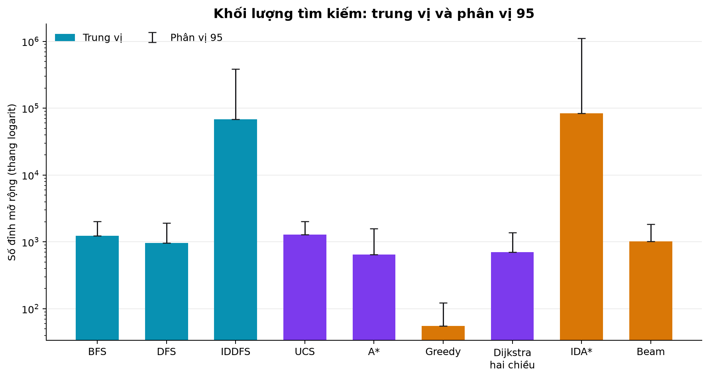
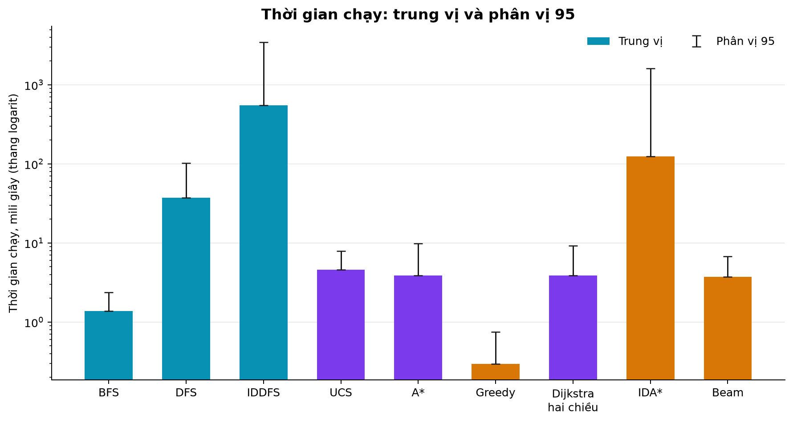
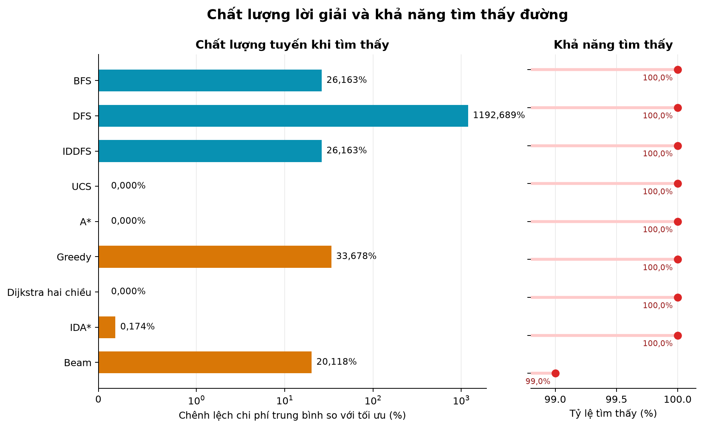
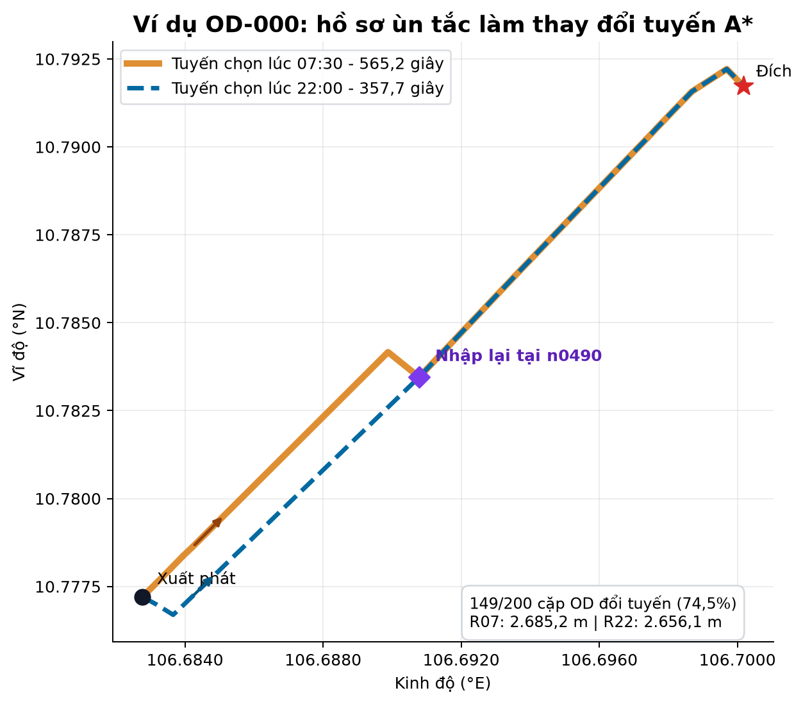

# CHƯƠNG 5. CƠ SỞ LÝ THUYẾT CÁC THUẬT TOÁN TÌM ĐƯỜNG HAI ĐIỂM

## 5.1. Phát biểu bài toán

Bài toán tìm đường hai điểm được mô hình hóa trên đồ thị đường bộ có hướng
$G=(V,E)$. Mỗi đỉnh biểu diễn một địa điểm hoặc nút giao thông; mỗi cạnh có
hướng biểu diễn một đoạn đường được phép di chuyển từ đỉnh đầu đến đỉnh cuối.
Do đó, sự tồn tại của cạnh $(u,v)$ không kéo theo sự tồn tại của cạnh $(v,u)$.
Đặc điểm này đặc biệt quan trọng khi xử lý đường một chiều và khi xây dựng tìm
kiếm hai chiều.

Với đỉnh xuất phát $s$, đỉnh đích $t$ và hàm trọng số $w$, mục tiêu là tìm một
đường đi $P=(s=v_0,v_1,\ldots,v_k=t)$ sao cho

$$
C(P)=\sum_{i=0}^{k-1}w(v_i,v_{i+1})
$$

là nhỏ nhất đối với các thuật toán có bảo đảm tối ưu. Với các thuật toán không
tối ưu như BFS, DFS, Greedy hoặc Beam Search, kết quả vẫn phải là một đường đi
hợp lệ trên đồ thị có hướng, nhưng chi phí có thể lớn hơn nghiệm tối ưu.

**Bảng 5.1. Quy mô đồ thị và hồ sơ giao thông**

| Bộ dữ liệu | Mục đích | Ngày tạo đồ thị | Số đỉnh | Số cạnh có hướng | Cạnh một chiều | Ngày tạo hồ sơ | Nguồn hồ sơ |
|---|---|---:|---:|---:|---:|---:|---|
| Đồ thị minh họa | Giảng dạy, mô phỏng và giải thích từng bước | 03/08/2026 | 51 | 298 | 60 | 03/08/2026 | TomTom kết hợp dữ liệu tổng hợp |
| Đồ thị thực nghiệm | Đánh giá khả năng mở rộng và hiệu năng | 27/07/2026 | 2.118 | 4.699 | 1.433 | 03/08/2026 | TomTom kết hợp dữ liệu tổng hợp |

Các mức ùn tắc là hồ sơ đại diện theo khung giờ, không phải dữ liệu giao thông
trực tiếp tại thời điểm người dùng chạy chương trình. TomTom cung cấp mẫu cho
một số trục đường chính; các cạnh chưa được bao phủ sử dụng phương pháp tổng
hợp tất định để bảo đảm toàn bộ đồ thị có dữ liệu.

## 5.2. Hàm chi phí và hàm ước lượng

### 5.2.1. Ba chế độ tối ưu

Với cạnh $e$, gọi $\ell(e)$ là chiều dài tính bằng mét, $v(e)$ là vận tốc tự do
tính bằng m/s, và $c(e,h)\in\{1,2,3,4,5\}$ là mức ùn tắc tại khung giờ $h$.
Thời gian di chuyển tự do là

$$
t_{\mathrm{free}}(e)=\frac{\ell(e)}{v(e)}.
$$

Hệ số ùn tắc được xác định bởi

$$
f_{\mathrm{cong}}(e,h)=1+1{,}5\frac{c(e,h)-1}{4}.
$$

Các cờ rủi ro tạo ra mức phạt không âm:

$$
p(e)=60I_{\mathrm{ngập}}+90I_{\mathrm{thi\ công}}
     +30I_{\mathrm{hẻm\ hẹp}}+25I_{\mathrm{đèn\ đỏ}}.
$$

Ba chế độ chi phí là

$$
\begin{aligned}
w_{\mathrm{khoảng\ cách}}(e)&=\ell(e) &&\text{(mét)},\\
w_{\mathrm{thời\ gian}}(e,h)&=t_{\mathrm{free}}(e)f_{\mathrm{cong}}(e,h)
&&\text{(giây)},\\
w_{\mathrm{cân\ bằng}}(e,h)&=t_{\mathrm{free}}(e)f_{\mathrm{cong}}(e,h)+p(e)
&&\text{(giây)}.
\end{aligned}
$$

Chế độ cân bằng được dùng mặc định vì đồng thời phản ánh thời gian, ùn tắc và
rủi ro. Mọi trọng số đều không âm; trên dữ liệu hiện tại, chiều dài và vận tốc
tự do đều dương nên chi phí cạnh cũng dương.

**Bảng 5.2. Đơn vị của các đại lượng đánh giá tuyến đường**

| Đại lượng | Đơn vị | Ý nghĩa |
|---|---|---|
| Tổng chi phí | Mét hoặc giây | Phụ thuộc chế độ đang tối ưu |
| Tổng quãng đường | Mét | Tổng chiều dài các cạnh thuộc tuyến |
| Tổng thời gian cân bằng | Giây | Luôn gồm thời gian đã điều chỉnh ùn tắc và mức phạt rủi ro |
| Số đỉnh mở rộng | Đỉnh | Khối lượng công việc tìm kiếm |
| Kích thước biên lớn nhất | Đỉnh | Chỉ báo nhu cầu bộ nhớ của cấu trúc biên |
| Thời gian chạy | Mili giây | Thời gian thực thi thuật toán trong môi trường đo |

“Tổng thời gian” luôn được tính theo chi phí cân bằng, kể cả khi thuật toán đang
tối ưu quãng đường hoặc thời gian thuần túy. Quy ước này giúp so sánh các tuyến
theo cùng một thước đo vận hành.

### 5.2.2. Hàm ước lượng

Gọi $d_H(n,t)$ là khoảng cách Haversine từ đỉnh $n$ đến đích $t$ và $v_{\max}$
là vận tốc tự do lớn nhất trên đồ thị hiệu lực đang xét. Hàm ước lượng được chọn
như sau:

$$
h(n)=
\begin{cases}
d_H(n,t), & \text{nếu tối ưu khoảng cách},\\
\dfrac{d_H(n,t)}{v_{\max}}, & \text{nếu tối ưu thời gian hoặc cân bằng}.
\end{cases}
$$

Khoảng cách Haversine không lớn hơn chiều dài của mọi tuyến đường thực tế nối
hai điểm. Đồng thời, $v_{\max}$ không nhỏ hơn vận tốc tự do của bất kỳ cạnh nào,
hệ số ùn tắc không nhỏ hơn 1 và mức phạt rủi ro không âm. Vì vậy, với mọi cạnh
$(u,v)$:

$$
h(u)\le w(u,v)+h(v).
$$

Hàm ước lượng vừa chấp nhận được vừa nhất quán. Đây là điều kiện để A* trả về nghiệm
tối ưu và để IDA* thỏa biên sai số cộng đã công bố [2], [5].

## 5.3. Hợp đồng kết quả và quy tắc thực thi chung

Chín thuật toán sử dụng cùng một cấu trúc kết quả. Mỗi lần chạy phải cho biết
có tìm thấy đường hay không, danh sách đỉnh trên đường đi, tổng chi phí, quãng
đường, thời gian cân bằng, số đỉnh mở rộng, kích thước biên lớn nhất, thời gian
chạy và lý do dừng. Khi bật chế độ minh họa, từng bước còn lưu đỉnh đang xét,
tập biên và các giá trị $g$, $h$, $f$ phù hợp với thuật toán.

Thứ tự kề và quy tắc phá hòa được cố định để cùng một đầu vào luôn tạo ra cùng
một đường đi và cùng một chuỗi bước. Giới hạn 5.000 bước chỉ giới hạn lượng dữ
liệu minh họa được lưu; thuật toán vẫn tiếp tục chạy để tính đủ kết quả và các
chỉ số cuối cùng.

## 5.4. Ví dụ chung trên đồ thị bảy đỉnh

Phần này dùng cùng một tiểu đồ thị có hướng gồm bảy địa điểm tại trung tâm Thành
phố Hồ Chí Minh. Điểm xuất phát là Chợ Bến Thành (A), điểm đích là Bitexco (G),
chế độ chi phí cân bằng và khung giờ 07:30.

**Bảng 5.3. Các đỉnh trong ví dụ**

| Ký hiệu | Địa điểm | Giá trị ước lượng đến G (giây) |
|---|---|---:|
| A | Chợ Bến Thành | 58,6 |
| B | Bảo tàng Mỹ thuật | 44,4 |
| C | Saigon Centre | 34,7 |
| D | Đền Bà Mariamman | 73,9 |
| E | Điểm trung chuyển Hàm Nghi | 30,2 |
| F | Công viên 23/9 | 88,9 |
| G | Bitexco | 0,0 |

**Bảng 5.4. Danh sách kề có hướng và trọng số cân bằng**

| Đỉnh | Các cạnh đi ra, kèm chi phí (giây) |
|---|---|
| A | B: 176,0; C: 303,9; D: 194,9 |
| B | A: 104,6; C: 223,2; D: 155,5; E: 30,3; G: 124,1 |
| C | A: 99,2; D: 122,8; E: 52,0; G: 123,3 |
| D | A: 100,3; B: 91,6; C: 230,0; F: 28,1; G: 181,0 |
| E | B: 30,3; G: 135,1 |
| F | D: 34,1 |
| G | A: 136,9; C: 227,2; D: 160,5; E: 89,7 |

Các cạnh B→C, B→G, C→E và G→A chỉ tồn tại theo một chiều trong tiểu đồ thị.
Nghiệm tối ưu là A→B→G với chi phí $176{,}0+124{,}1=300{,}1$ giây.

## 5.5. Tìm kiếm theo chiều rộng (BFS)

BFS sử dụng hàng đợi vào trước ra trước. Thuật toán mở rộng các đỉnh theo từng
lớp độ sâu, vì vậy đường đầu tiên đến đích có số cạnh ít nhất.

```text
Đưa s vào hàng đợi; đánh dấu s đã thăm
Trong khi hàng đợi chưa rỗng:
    Lấy đỉnh u ở đầu hàng đợi
    Nếu u là đích: dựng lại đường đi và kết thúc
    Với mỗi đỉnh v kề u theo thứ tự ổn định:
        Nếu v chưa được thăm:
            Ghi cha của v là u; đánh dấu v; đưa v vào cuối hàng đợi
```

BFS đầy đủ trên đồ thị hữu hạn nhưng chỉ tối ưu khi mọi cạnh có cùng chi phí,
hoặc khi mục tiêu là giảm số cạnh. Trong ví dụ, thứ tự mở rộng là
A, B, C, D, E, G; tuyến nhận được là A→B→G, chi phí 300,1 giây.

## 5.6. Tìm kiếm theo chiều sâu (DFS)

DFS sử dụng ngăn xếp vào sau ra trước và đi sâu theo một nhánh trước khi quay
lui. Các đỉnh kề được đưa vào ngăn xếp theo thứ tự đảo để khi lấy ra vẫn tuân
theo thứ tự kề đã quy định.

```text
Đưa s vào ngăn xếp
Trong khi ngăn xếp chưa rỗng:
    Lấy đỉnh u ở đỉnh ngăn xếp
    Nếu u đã thăm: bỏ qua
    Đánh dấu u đã thăm
    Nếu u là đích: dựng lại đường đi và kết thúc
    Đưa các đỉnh kề chưa thăm của u vào ngăn xếp theo thứ tự đảo
```

DFS có ưu điểm đơn giản nhưng phụ thuộc mạnh vào thứ tự kề và không tối ưu chi
phí. Trong ví dụ, DFS mở rộng A, B, E, G và trả về A→B→E→G với chi phí
341,5 giây, cao hơn tối ưu 41,4 giây.

## 5.7. Tìm kiếm sâu dần (IDDFS)

IDDFS lặp lại DFS giới hạn độ sâu với các mức 0, 1, 2, … cho đến khi tìm thấy
đích hoặc đạt giới hạn an toàn 100. Thuật toán kết hợp khả năng tìm nghiệm nông
của BFS với cách tổ chức theo chiều sâu.

```text
Với giới hạn L từ 0 đến giới hạn tối đa:
    Chạy DFS nhưng không đi sâu hơn L
    Nếu gặp đích: dựng lại đường đi và kết thúc
Nếu mọi vòng đều thất bại: trả về lý do đạt giới hạn hoặc đã duyệt cạn
```

Trong ví dụ, các vòng lần lượt mở rộng A; rồi A, B, C, D; cuối cùng
A, B, E, G. Tổng số lần mở rộng là 9 và kết quả là A→B→G, chi phí 300,1 giây.
Việc mở rộng lặp lại là nguyên nhân IDDFS có thể chậm trên đồ thị lớn.

## 5.8. Tìm kiếm chi phí đồng nhất (UCS)

UCS luôn chọn đỉnh có chi phí tích lũy $g(n)$ nhỏ nhất trong hàng đợi ưu tiên.
Khi mọi trọng số không âm, lần lấy đích ra khỏi hàng đợi xác lập chi phí tối ưu.
Về nguyên lý, đây chính là Dijkstra một nguồn áp dụng cho một truy vấn đích;
hệ thống không trình bày Dijkstra một chiều như một lựa chọn tách biệt.

```text
g(s) = 0; đưa s vào hàng đợi ưu tiên
Trong khi hàng đợi chưa rỗng:
    Lấy u có g(u) nhỏ nhất
    Nếu bản ghi đã lỗi thời: bỏ qua
    Nếu u là đích: dựng lại đường đi và kết thúc
    Với mỗi cạnh (u,v):
        Nếu g(u) + w(u,v) < g(v):
            Cập nhật g(v), cha của v và hàng đợi ưu tiên
```

Trong ví dụ, UCS mở rộng A, B, D, E, F, G và trả về A→B→G với chi phí
300,1 giây.

## 5.9. Tìm kiếm tham lam tốt nhất trước (Greedy Best-First)

Greedy chỉ ưu tiên hàm ước lượng $h(n)$ và không sử dụng chi phí đã đi $g(n)$ trong
quyết định chọn đỉnh kế tiếp.

```text
Đưa s vào hàng đợi ưu tiên theo h
Trong khi hàng đợi chưa rỗng:
    Lấy u có h(u) nhỏ nhất
    Nếu u là đích: dựng lại đường đi và kết thúc
    Đưa các đỉnh kề hợp lệ vào hàng đợi và lưu cha
```

Greedy thường hướng nhanh về phía đích nhưng có thể chọn tuyến đắt do bỏ qua
chi phí quá khứ. Trong ví dụ, thuật toán mở rộng A, C, G và trả về A→C→G,
chi phí 427,3 giây. Đây là số đỉnh mở rộng ít nhất trong ví dụ, nhưng chi phí
cao hơn tối ưu 42,4%.

## 5.10. Tìm kiếm A*

A* ưu tiên tổng $f(n)=g(n)+h(n)$. Trong đó $g(n)$ là chi phí từ điểm xuất phát
đến $n$, còn $h(n)$ ước lượng chi phí còn lại. Với hàm ước lượng nhất quán, khi
đích được lấy khỏi hàng đợi ưu tiên, đường đi thu được là tối ưu.

```text
g(s) = 0; đưa s vào hàng đợi ưu tiên theo f = g + h
Trong khi hàng đợi chưa rỗng:
    Lấy u có f(u) nhỏ nhất
    Nếu bản ghi đã lỗi thời: bỏ qua
    Nếu u là đích: dựng lại đường đi và kết thúc
    Nới lỏng mọi cạnh đi ra từ u và cập nhật f của đỉnh kề
```

Trong ví dụ, A* mở rộng A, B, E, D, G và trả về tuyến tối ưu A→B→G với chi
phí 300,1 giây.

## 5.11. Dijkstra hai chiều

Dijkstra hai chiều chạy đồng thời một tìm kiếm từ $s$ trên danh sách kề thuận
và một tìm kiếm từ $t$ trên danh sách kề ngược. Việc dùng danh sách kề ngược là
bắt buộc đối với đồ thị có hướng. Gọi $\mu$ là chi phí tốt nhất của một đường
đã nối được hai phía; thuật toán dừng khi

$$
\min Q_{\mathrm{thuận}}+\min Q_{\mathrm{ngược}}\ge\mu.
$$

```text
Khởi tạo khoảng cách thuận từ s và khoảng cách ngược từ t
Trong khi cả hai hàng đợi còn phần tử:
    Chọn phía có khóa nhỏ hơn để mở rộng
    Nới lỏng cạnh theo đúng hướng của phía đó
    Nếu hai phía gặp nhau: cập nhật đường tốt nhất μ
    Nếu tổng hai khóa nhỏ nhất không nhỏ hơn μ: dừng
Ghép đường thuận và đường ngược tại điểm gặp tốt nhất
```

Trong ví dụ, thuật toán mở rộng A ở phía thuận, G và C ở phía ngược; kết quả là
A→B→G với chi phí 300,1 giây. Thuật toán vẫn tối ưu với trọng số không âm,
nhưng lợi ích thực tế phụ thuộc cấu trúc đồ thị và vị trí cặp đầu–cuối.

## 5.12. IDA*

IDA* thực hiện nhiều vòng DFS với ngưỡng $f=g+h$. Ngưỡng đầu là $h(s)$; sau mỗi
vòng, ngưỡng mới là giá trị nhỏ nhất đã vượt ngưỡng cũ, nhưng tăng ít nhất
$\varepsilon=5$ đơn vị chi phí. Vì vậy, kết quả thỏa

$$
C_{\mathrm{IDA*}}\le C^*+\varepsilon,
$$

với $\varepsilon=5$ mét ở chế độ khoảng cách và 5 giây ở hai chế độ còn lại.

```text
ngưỡng = h(s)
Lặp tối đa số vòng an toàn (mặc định 1.000):
    Chạy DFS, chỉ mở rộng trạng thái có g + h không vượt ngưỡng
    Nếu gặp đích: trả về đường đi
    Ghi nhận giá trị f nhỏ nhất đã vượt ngưỡng
    Tăng ngưỡng lên giá trị lớn hơn giữa mức đó và ngưỡng + ε
```

Trong ví dụ, các ngưỡng là 58,6; 220,4; 236,5; 268,9 và 300,1. IDA* mở rộng
tổng cộng 14 lượt, trả về A→B→G với chi phí 300,1 giây. Nếu chạm giới hạn số
vòng trước khi tìm được nghiệm, thuật toán phải báo thất bại chưa kết luận và
không được tuyên bố bảo đảm sai số.

## 5.13. Tìm kiếm chùm (Beam Search)

Tìm kiếm chùm duyệt theo lớp nhưng chỉ giữ lại $k$ ứng viên tốt nhất theo
$f=g+h$ ở mỗi lớp. Độ rộng mặc định là 5 trên đồ thị minh họa và 50 trên đồ
thị thực nghiệm.

```text
Biên hiện tại gồm s
Trong khi biên chưa rỗng:
    Sinh các đỉnh kế tiếp từ toàn bộ biên hiện tại
    Loại trạng thái không hợp lệ hoặc kém hơn bản ghi đã biết
    Sắp xếp ứng viên theo f = g + h
    Chỉ giữ lại k ứng viên tốt nhất cho lớp sau
    Nếu gặp đích: dựng lại đường đi và kết thúc
```

Tìm kiếm chùm kiểm soát kích thước biên nhưng có thể loại bỏ mọi nhánh dẫn đến
đích, nên không đầy đủ và không tối ưu. Trong ví dụ với $k=5$, thuật toán mở
rộng A, B, D, C, E, G và trả về A→B→G, chi phí 300,1 giây.

## 5.14. Tổng hợp ví dụ

**Bảng 5.5. Kết quả của chín thuật toán trên cùng ví dụ**

| Thuật toán | Thứ tự mở rộng | Tuyến trả về | Chi phí (giây) | Số đỉnh mở rộng | Biên lớn nhất | Bảo đảm |
|---|---|---|---:|---:|---:|---|
| BFS | A, B, C, D, E, G | A→B→G | 300,1 | 6 | 4 | Ít cạnh nhất |
| DFS | A, B, E, G | A→B→E→G | 341,5 | 4 | 4 | Không tối ưu |
| IDDFS | A; A, B, C, D; A, B, E, G | A→B→G | 300,1 | 9 | 4 | Ít cạnh nhất trong giới hạn |
| UCS | A, B, D, E, F, G | A→B→G | 300,1 | 6 | 4 | Tối ưu |
| A* | A, B, E, D, G | A→B→G | 300,1 | 5 | 4 | Tối ưu |
| Greedy | A, C, G | A→C→G | 427,3 | 3 | 4 | Không tối ưu |
| Dijkstra hai chiều | A thuận; G, C ngược | A→B→G | 300,1 | 3 | 5 | Tối ưu |
| IDA* | Năm vòng ngưỡng | A→B→G | 300,1 | 14 | 6 | Trong $C^*+5$ giây |
| Beam Search | A, B, D, C, E, G | A→B→G | 300,1 | 6 | 3 | Không tối ưu |

Ví dụ cho thấy không thể đánh giá thuật toán chỉ bằng một đại lượng. Greedy mở
rộng ít đỉnh nhất nhưng cho tuyến đắt nhất; Dijkstra hai chiều vừa tối ưu vừa mở
rộng ít trong tiểu đồ thị; IDA* dùng biên nhỏ nhưng phải lặp nhiều lần.

# CHƯƠNG 7. ĐÁNH GIÁ VÀ SO SÁNH CÁC THUẬT TOÁN TÌM ĐƯỜNG HAI ĐIỂM

## 7.1. So sánh lý thuyết

**Bảng 7.1. Tính chất lý thuyết của các thuật toán**

| Thuật toán | Đầy đủ | Tối ưu | Điều kiện hoặc giới hạn |
|---|---|---|---|
| BFS | Có trên đồ thị hữu hạn | Chỉ theo số cạnh | Không tối ưu khi trọng số khác nhau |
| DFS | Có trên đồ thị hữu hạn khi có tập đã thăm | Không | Kết quả phụ thuộc thứ tự kề |
| IDDFS | Có trong phạm vi độ sâu cho phép | Theo số cạnh trong phạm vi đó | Giới hạn độ sâu 100 có thể làm thất bại chưa kết luận |
| UCS | Có | Có | Trọng số không âm |
| A* | Có | Có | Hàm ước lượng chấp nhận được, nhất quán; trọng số không âm |
| Greedy | Có nếu duyệt hết đồ thị hữu hạn | Không | Hàm ước lượng chỉ định hướng, không tạo bảo đảm chi phí |
| Dijkstra hai chiều | Có | Có | Trọng số không âm; phía ngược phải dùng cạnh đảo |
| IDA* | Có nếu đủ số vòng | Trong $C^*+\varepsilon$ | Hàm ước lượng chấp nhận được; mặc định $\varepsilon=5$; giới hạn vòng có thể cắt tìm kiếm |
| Beam Search | Không | Không | Có thể loại bỏ toàn bộ nhánh dẫn đến đích |

Gọi $b$ là hệ số phân nhánh, $d$ là độ sâu của nghiệm nông nhất, $k$ là độ rộng
Beam và $Q$ là số bản ghi lớn nhất nằm đồng thời trong ngăn xếp tường minh.
Bảng 7.2 tách cận thời gian thường dùng khỏi bộ nhớ của cách hiện thực hiện tại;
với A*, Greedy và IDA*, hiệu quả thực tế còn phụ thuộc mạnh vào chất lượng hàm
ước lượng.

**Bảng 7.2. Độ phức tạp và đặc điểm sử dụng tài nguyên**

| Thuật toán | Thời gian điển hình hoặc cận xấu nhất | Bộ nhớ của cách hiện thực | Đặc điểm chính |
|---|---|---|---|
| BFS | $O(V+E)$ | $O(V)$ | Tốt cho số bước, không xét trọng số |
| DFS | $O(V+E)$ | $O(V+E)$ trong trường hợp xấu do ngăn xếp có thể chứa ứng viên trùng | Đi sâu nhanh, nhạy với thứ tự kề |
| IDDFS | $O(b^d)$ | $O(V+Q)$ cho ánh xạ độ sâu và ngăn xếp tường minh | Mở rộng lặp nhiều vòng |
| UCS | $O((V+E)\log V)$ | $O(V+E)$ trong trường hợp xấu do hàng đợi có bản ghi cũ | Mốc chuẩn tối ưu đáng tin cậy |
| A* | Xấu nhất $O((V+E)\log V)$ | $O(V+E)$ trong trường hợp xấu do hàng đợi có bản ghi cũ | Có thể giảm tìm kiếm nhờ hàm ước lượng |
| Greedy | Xấu nhất $O((V+E)\log V)$ | $O(V)$ | Nhanh nhưng không bảo đảm chất lượng |
| Dijkstra hai chiều | Xấu nhất $O((V+E)\log V)$ | $O(V+E)$ cho hai phía và các bản ghi hàng đợi | Hai biên tìm kiếm và điều kiện dừng chặt chẽ |
| IDA* | Xấu nhất $O(b^d)$ | $O(V+Q)$ cho các ánh xạ theo đỉnh và ngăn xếp tường minh | Biên nhỏ nhưng tái mở rộng rất nhiều |
| Beam Search | Xấp xỉ $O(dkb\log(kb))$ khi không lưu diễn tiến | $O(V+kb)$ do vẫn giữ tập đã thăm, chi phí và cha | Giới hạn lớp kế tiếp bằng $k$, đánh đổi tính đầy đủ |

Các cận trên không tính chi phí tuần tự hóa diễn tiến minh họa. Khi lưu từng
bước, việc dựng và sắp xếp ảnh chụp biên làm tăng thời gian và bộ nhớ. Chỉ số
“biên lớn nhất” trong thực nghiệm vì thế là một chỉ báo thuật toán, không phải
toàn bộ bộ nhớ của tiến trình và cũng không nhất thiết bằng $Q$.

## 7.2. Thiết kế thực nghiệm

### 7.2.1. Dữ liệu và cách lấy mẫu

Thực nghiệm sử dụng đồ thị thực nghiệm gồm 2.118 đỉnh và 4.699 cạnh có hướng.
Hai trăm cặp xuất phát–đích có thứ tự được lấy mẫu với hạt giống ngẫu nhiên 42;
khoảng cách đường chim bay của mỗi cặp ít nhất 1.000 m. Cùng một tập cặp được
dùng cho tất cả thuật toán để bảo đảm so sánh ghép cặp công bằng.

Mỗi cặp được chạy ở hai hồ sơ đại diện: 07:30 và 22:00, trong chế độ chi phí
cân bằng. Tổng số bản ghi là

$$
9\ \text{thuật toán}\times200\ \text{cặp}\times2\ \text{khung giờ}=3.600.
$$

### 7.2.2. Mốc chuẩn và phép đo

UCS được dùng để tính chi phí tối ưu $C^*$ cho từng cặp và khung giờ. Độ chênh
lệch chi phí của một kết quả tìm thấy được tính bằng

$$
\Delta(P)=100\frac{C(P)-C^*}{C^*}\%.
$$

Độ đúng của UCS và A* còn được kiểm tra độc lập bằng một thư viện đồ thị chuẩn.
Đối chứng gồm $2\times200\times2=800$ trường hợp. Tất cả 800/800 trường hợp đều
đạt, với sai số tuyệt đối không vượt quá $10^{-6}$. Đây là bằng chứng thực
nghiệm rằng hai thuật toán nhất quán với lời giải chuẩn trên tập đánh giá.

**Bảng 7.3. Các chỉ số thực nghiệm**

| Chỉ số | Cách diễn giải | Giới hạn khi sử dụng |
|---|---|---|
| Tỷ lệ tìm thấy | Số lượt có đường đi hợp lệ trên tổng số lượt | Không tự phản ánh chất lượng đường |
| Chênh lệch chi phí | Mức cao hơn nghiệm tối ưu, chỉ tính khi tìm thấy | Cần đọc cùng tỷ lệ tìm thấy |
| Số đỉnh mở rộng | Khối lượng tìm kiếm thực sự | Không hoàn toàn đồng nhất với số thao tác máy |
| Biên lớn nhất | Kích thước cấu trúc biên lớn nhất được ghi nhận | Không phải phép đo trực tiếp dung lượng RAM |
| Thời gian chạy | Thời gian thực thi mỗi truy vấn | Phụ thuộc máy, hệ điều hành và tải nền |

### 7.2.3. Môi trường chạy

Lượt đo hiệu năng hoàn tất lúc 00:06 ngày 15/08/2026 và kéo dài 609,118 giây.
Cấu hình đo gồm AMD Ryzen 7 7735HS, 8 nhân/16 luồng, 15,25 GiB RAM,
Microsoft Windows 11 Home Single Language bản dựng 26100 và Python 3.14.7.
Trong thời gian đo, máy chủ giao diện và máy chủ dịch vụ không chạy để tránh
cạnh tranh tài nguyên. Sau phép đo, dịch vụ API được khởi động độc lập và xác
nhận nạp đủ 3.600 bản ghi; trang trình bày kết quả phản hồi HTTP 200 và mã giao
diện vượt kiểm tra kiểu tĩnh riêng. Các kiểm tra hậu nghiệm này không tham gia
và không làm thay đổi phép đo hiệu năng.

Lượt ngày 15/08 đo lại thí nghiệm so sánh chín thuật toán trên đúng đồ thị,
hồ sơ, mã thuật toán, hạt giống và 200 cặp OD của lượt chính thức ngày
11/08/2026. Đối chiếu từng hàng cho thấy **0/3.600 hàng khác nhau ở mọi cột xác
định** gồm thuật toán, cặp, khung giờ, trạng thái tìm thấy, chi phí, độ chênh, số
đỉnh mở rộng và biên lớn nhất; chỉ cột thời gian chạy thay đổi ở 3.594/3.600
hàng do khác máy và nhiễu đo. Vì vậy, các bảng chất lượng/tìm kiếm dùng bằng
chứng xác định chung của hai lượt, còn mọi nhận xét về mili giây trong chương
này chỉ áp dụng cho môi trường ngày 15/08 nêu trên.

Do phân phối thời gian và số đỉnh mở rộng lệch phải mạnh, báo cáo ưu tiên trung
vị và phân vị 95 (P95). Giá trị trung bình vẫn được dùng cho độ chênh chi phí để
phản ánh toàn bộ mức thiệt hại do các nghiệm xấu.

## 7.3. Kết quả thực nghiệm

### 7.3.1. Chất lượng lời giải

**Bảng 7.4. Tỷ lệ tìm thấy và chênh lệch chi phí trên 400 lượt mỗi thuật toán**

| Thuật toán | Tìm thấy | Tỷ lệ | Chênh lệch trung bình | Chênh lệch trung vị | Chênh lệch P95 | Chênh lệch lớn nhất |
|---|---:|---:|---:|---:|---:|---:|
| BFS | 400/400 | 100,0% | 26,163% | 21,762% | 65,804% | 116,903% |
| DFS | 400/400 | 100,0% | 1.192,689% | 980,228% | 2.899,089% | 6.169,801% |
| IDDFS | 400/400 | 100,0% | 26,163% | 21,762% | 65,804% | 116,903% |
| UCS | 400/400 | 100,0% | 0,000% | 0,000% | 0,000% | 0,000% |
| A* | 400/400 | 100,0% | 0,000% | 0,000% | 0,000% | 0,000% |
| Greedy | 400/400 | 100,0% | 33,678% | 28,981% | 79,546% | 157,447% |
| Dijkstra hai chiều | 400/400 | 100,0% | 0,000% | 0,000% | 0,000% | 0,000% |
| IDA* | 400/400 | 100,0% | 0,174% | 0,000% | 0,797% | 2,120% |
| Beam Search | 396/400 | 99,0% | 20,118% | 16,846% | 52,846% | 104,173% |

UCS, A* và Dijkstra hai chiều đạt độ chênh bằng 0 trong toàn bộ 400 lượt. Kết quả
này phù hợp với bảo đảm tối ưu của ba thuật toán. IDA* có độ chênh trung bình
0,174%. Tính xấp xỉ từ các giá trị đã làm tròn trong bảng dữ liệu, sai lệch
tuyệt đối trung bình là 0,849 giây, P95 là 3,750 giây và lớn nhất khoảng
4,845 giây. Như vậy, toàn bộ quan sát IDA* đều phù hợp với biên cộng 5 giây đã
công bố.

BFS và IDDFS có cùng thống kê độ chênh trên tập đo, phù hợp với việc cả hai ưu
tiên nghiệm nông theo số cạnh; dữ liệu tổng hợp không lưu chuỗi đỉnh nên không
dùng kết quả này để khẳng định hai thuật toán luôn trả cùng một tuyến khi có
nhiều nghiệm đồng độ sâu. Chi phí trung bình của chúng cao hơn tối ưu 26,163%.
Greedy hướng mạnh về đích và nhanh, nhưng độ chênh trung bình 33,678%. DFS cho
chất lượng kém nhất:
độ chênh trung vị 980,228%, cho thấy một tuyến được tìm thấy không đồng nghĩa
với một tuyến hữu ích. Tìm kiếm chùm có độ chênh thấp hơn BFS và Greedy trên
các lượt thành công, nhưng bỏ lỡ 4/400 truy vấn vì thao tác cắt tỉa đã loại bỏ
các nhánh cần thiết.

### 7.3.2. Khối lượng tìm kiếm, biên và thời gian

**Bảng 7.5. Mức sử dụng tài nguyên và thời gian chạy**

| Thuật toán | Đỉnh mở rộng trung vị | Đỉnh mở rộng P95 | Biên trung vị | Biên P95 | Thời gian trung vị (ms) | Thời gian P95 (ms) |
|---|---:|---:|---:|---:|---:|---:|
| BFS | 1.240,0 | 2.021,95 | 80,0 | 117,00 | 1,381 | 2,384 |
| DFS | 971,0 | 1.908,65 | 193,5 | 259,00 | 37,293 | 102,089 |
| IDDFS | 67.970,0 | 388.666,05 | 29,0 | 41,00 | 552,871 | 3.466,554 |
| UCS | 1.279,0 | 2.035,15 | 69,0 | 91,05 | 4,622 | 7,937 |
| A* | 649,5 | 1.587,85 | 62,5 | 101,05 | 3,862 | 9,825 |
| Greedy | 55,0 | 122,15 | 37,0 | 60,00 | 0,295 | 0,753 |
| Dijkstra hai chiều | 698,5 | 1.387,00 | 78,0 | 108,10 | 3,906 | 9,224 |
| IDA* | 83.931,0 | 1.108.857,05 | 29,0 | 47,00 | 124,213 | 1.607,135 |
| Beam Search | 1.025,0 | 1.836,10 | 50,0 | 50,00 | 3,717 | 6,743 |

Trong môi trường đo đã nêu, Greedy nhanh nhất với trung vị 0,295 ms và chỉ mở
rộng trung vị 55 đỉnh, nhưng
đánh đổi bằng độ chênh lớn. BFS có thời gian thấp thứ hai dù mở rộng nhiều đỉnh, vì
mỗi thao tác hàng đợi đơn giản và không cần tính thứ tự ưu tiên theo trọng số.

A* giảm số đỉnh mở rộng trung vị từ 1.279 của UCS xuống 649,5, tương đương giảm
49,2%, đồng thời giữ nghiệm tối ưu. Thời gian trung vị cũng giảm từ 4,622 ms
xuống 3,862 ms. Tuy nhiên P95 của A* là 9,825 ms, cao hơn UCS 7,937 ms; ở các
truy vấn khó, chi phí tính hàm ước lượng và quản lý hàng đợi có thể bù mất lợi ích
từ số đỉnh mở rộng thấp hơn.

Dijkstra hai chiều mở rộng trung vị 698,5 đỉnh, thấp hơn UCS 45,4%, nhưng thời
gian trung vị 3,906 ms chỉ nhỉnh hơn A* một ít. Kết quả này cho thấy chiến lược
hai chiều hiệu quả, song phải duy trì hai hàng đợi và hai tập khoảng cách.

IDDFS và IDA* minh họa rõ sự đánh đổi giữa biên và tái mở rộng. Cả hai có biên
trung vị chỉ 29 đỉnh, nhưng IDDFS mở rộng trung vị 67.970 đỉnh còn IDA* là
83.931 đỉnh. IDA* đạt chất lượng gần tối ưu, trong khi IDDFS chỉ tối ưu theo số
cạnh. Các phân vị 95 rất lớn chứng tỏ hai thuật toán có đuôi thời gian dài và
không phù hợp làm lựa chọn mặc định trên đồ thị thực nghiệm này.

Tìm kiếm chùm giữ biên P95 đúng bằng 50, phản ánh trực tiếp độ rộng đã cấu hình.
Dù thời gian trung vị 3,717 ms khá tốt, tỷ lệ tìm thấy 99,0% khiến thuật toán
phù hợp hơn cho minh họa sự đánh đổi hoặc tình huống chấp nhận rủi ro thất bại.



*Hình 7.1. Số đỉnh mở rộng; trục tung dùng thang logarit.*



*Hình 7.2. Thời gian chạy; trục tung dùng thang logarit.*



*Hình 7.3. Chất lượng lời giải và tỷ lệ tìm thấy trên 400 lượt. Trong ba hình
7.1-7.3, màu lam biểu diễn nhóm duyệt không thông tin, màu tím biểu diễn nhóm
tối ưu chính xác và màu cam biểu diễn nhóm heuristic hoặc có cắt/biên sai số.*

### 7.3.3. Ảnh hưởng của khung giờ đến hiệu năng thuật toán

**Bảng 7.6. Kết quả tách theo hồ sơ 07:30 và 22:00**

| Thuật toán | Khung giờ | Tìm thấy | Chênh lệch trung bình | Đỉnh mở rộng trung vị | Thời gian trung vị (mili giây) |
|---|---:|---:|---:|---:|---:|
| BFS | 07:30 | 200/200 | 24,073% | 1.240,0 | 1,322 |
| BFS | 22:00 | 200/200 | 28,253% | 1.240,0 | 1,407 |
| DFS | 07:30 | 200/200 | 1.183,227% | 971,0 | 37,181 |
| DFS | 22:00 | 200/200 | 1.202,152% | 971,0 | 37,539 |
| IDDFS | 07:30 | 200/200 | 24,073% | 67.970,0 | 542,357 |
| IDDFS | 22:00 | 200/200 | 28,253% | 67.970,0 | 560,181 |
| UCS | 07:30 | 200/200 | 0,000% | 1.278,5 | 4,550 |
| UCS | 22:00 | 200/200 | 0,000% | 1.285,5 | 4,647 |
| A* | 07:30 | 200/200 | 0,000% | 761,0 | 4,535 |
| A* | 22:00 | 200/200 | 0,000% | 571,0 | 3,378 |
| Greedy | 07:30 | 200/200 | 31,949% | 55,0 | 0,298 |
| Greedy | 22:00 | 200/200 | 35,407% | 55,0 | 0,290 |
| Dijkstra hai chiều | 07:30 | 200/200 | 0,000% | 713,5 | 3,923 |
| Dijkstra hai chiều | 22:00 | 200/200 | 0,000% | 688,0 | 3,887 |
| IDA* | 07:30 | 200/200 | 0,124% | 138.948,5 | 191,381 |
| IDA* | 22:00 | 200/200 | 0,223% | 43.769,0 | 66,124 |
| Beam Search | 07:30 | 197/200 | 17,769% | 1.025,5 | 3,844 |
| Beam Search | 22:00 | 199/200 | 22,444% | 1.019,0 | 3,511 |

BFS, DFS, IDDFS và Greedy có cùng số đỉnh mở rộng trung vị ở hai khung giờ vì
quy tắc duyệt của chúng không dùng trọng số giao thông để chọn thứ tự mở rộng.
Tuyến mà chúng trả về giữ nguyên, nhưng độ chênh thay đổi do chi phí tối ưu tham
chiếu và trọng số tuyến thay đổi theo hồ sơ.

A* hưởng lợi rõ ở hồ sơ 22:00: số đỉnh mở rộng trung vị giảm từ 761 xuống 571,
và thời gian trung vị giảm 25,5%. IDA* cũng giảm mạnh khối lượng tìm kiếm vào
22:00. Điều này không có nghĩa 22:00 luôn nhanh hơn trong thực tế; kết luận chỉ
đúng với hai hồ sơ đại diện và tập 200 cặp đã chọn. Beam Search thất bại ba lượt
ở 07:30 và một lượt ở 22:00, cho thấy kết quả cắt tỉa có thể thay đổi khi trọng
số giao thông thay đổi.

### 7.3.4. Ùn tắc làm thay đổi tuyến được chọn

Thí nghiệm đổi khung giờ chạy A* trên cùng 200 cặp OD, cùng chế độ cân bằng và
chỉ thay hồ sơ ùn tắc từ 07:30 sang 22:00. Kết quả có **149/200 cặp đổi chuỗi
đỉnh, tương đương 74,5%**. Đây là bằng chứng trực tiếp cho yêu cầu phân tích ảnh
hưởng của ùn tắc đến tuyến, khác với Bảng 7.6 vốn đo hiệu năng thuật toán.

Một ví dụ cụ thể là cặp OD-000, từ nút `n0457` đến `n0103`. Hai tuyến nhập lại
với nhau tại `n0490` rồi dùng chung hậu tố:

```text
S = n0490 → n0498 → n0461 → n0400 → n2060 → n2061 → n1859
  → n0157 → n0502 → n1949 → n0372 → n0172 → n0531 → n0981
  → n0470 → n0373 → n2049 → n0103

R07 = n0457 → n0122 → n1424 → n0419 → n1426 → n0523 → n0518
    → n0484 → n0485 → n0804 → S

R22 = n0457 → n1621 → n1982 → n1981 → n0123 → n0402 → n0990
    → n0080 → n1436 → n0511 → n0460 → n0456 → n1318 → S
```

**Bảng 7.7. Hai tuyến ứng viên của cặp OD-000 được chấm dưới cả hai hồ sơ**

| Tuyến | Quãng đường (m) | Chi phí lúc 07:30 (giây) | Chi phí lúc 22:00 (giây) | Trễ do ùn tắc 07:30 / 22:00 (giây) | Phạt rủi ro (giây) |
|---|---:|---:|---:|---:|---:|
| R07 - tuyến được chọn lúc 07:30 | 2.685,2 | **565,2** | 376,1 | 249,0 / 60,0 | 75,0 |
| R22 - tuyến được chọn lúc 22:00 | 2.656,1 | 596,1 | **357,7** | 283,6 / 45,2 | 100,0 |

Tại 07:30, R07 rẻ hơn R22 khoảng 30,9 giây; đến 22:00, thứ tự đảo lại và R22
rẻ hơn R07 khoảng 18,4 giây. Phần khác biệt trước nút nhập `n0490` giải thích
quyết định này rõ hơn: ở 07:30, toàn bộ 13 cạnh của nhánh R22 nằm ở mức ùn tắc
4 hoặc 5, làm chi phí tiền tố tăng lên 276,6 giây; tại 22:00, các cạnh này đều
hạ xuống mức 1 hoặc 2, kéo chi phí tiền tố còn 169,4 giây. Trong khi đó, tiền
tố R07 lần lượt có chi phí 245,7 và 187,8 giây.

Các đoạn thay đổi mạnh trên R22 gồm `n0460→n0456` (mức 5→1, chi phí
61,8→39,7 giây), `n0990→n0080` (5→2, 36,0→19,8 giây),
`n1436→n0511` (5→2, 17,7→9,7 giây) và `n0511→n0460` (5→2,
38,1→20,9 giây). A* vì vậy không đơn thuần chọn tuyến ngắn hơn: nó chọn R07
trong hồ sơ sáng dù R07 dài hơn 29,1 m, rồi chuyển sang R22 khi mức ùn tắc trên
nhánh này giảm vào hồ sơ đêm.



*Hình 7.4. Phần nét tách nhau thể hiện hai tiền tố khác nhau; hai tuyến nhập lại
tại n0490 và đi chung đến đích.*

Kết luận trên chỉ áp dụng cho hai **hồ sơ đại diện** đã thu thập và mô phỏng;
không được diễn giải thành tình trạng giao thông thời gian thực hoặc quan hệ
nhân quả tổng quát cho mọi ngày.

## 7.4. Thảo luận

### 7.4.1. Lựa chọn thuật toán theo mục tiêu

- Nếu cần nghiệm tối ưu và dễ giải thích, UCS là mốc chuẩn phù hợp.

- Nếu cần nghiệm tối ưu với hiệu quả tốt trên dữ liệu hiện tại, A* là lựa chọn
  cân bằng nhất: độ chênh bằng 0, số đỉnh mở rộng trung vị thấp và thời gian trung vị
  dưới 4 ms.

- Dijkstra hai chiều là phương án tối ưu cạnh tranh với A*, đặc biệt có giá trị
  khi muốn minh họa tìm kiếm từ hai phía trên đồ thị có hướng.

- Greedy phù hợp khi ưu tiên tốc độ hơn chất lượng. Tuy nhiên độ chênh trung bình
  33,678% là quá lớn nếu tuyến đường được sử dụng trong vận hành thật.

- IDA* có chất lượng rất gần tối ưu và biên nhỏ, nhưng thời gian có đuôi dài;
  không nên chọn mặc định cho đồ thị thực nghiệm hiện tại.

- Beam Search giới hạn biên rõ ràng nhưng không bảo đảm tìm thấy đường. Cần hiển
  thị minh bạch trạng thái thất bại thay vì âm thầm thay bằng một thuật toán khác.

- BFS, DFS và IDDFS có giá trị giảng dạy cao vì làm nổi bật các chiến lược duyệt,
  nhưng không phải lựa chọn phù hợp để tối ưu chi phí đường bộ không đồng nhất.

### 7.4.2. Giới hạn của thực nghiệm

Thứ nhất, 200 cặp đầu–cuối chỉ là một mẫu tất định của một đồ thị tại khu vực
nghiên cứu; kết quả không tự động khái quát cho mọi thành phố hoặc mọi quy mô.
Thứ hai, hai khung giờ là hồ sơ đại diện chứ không phải chuỗi quan sát giao thông
trực tiếp trong cùng một ngày. Thứ ba, thời gian chạy ở mức mili giây nhạy với
trình thông dịch, trạng thái bộ nhớ đệm và tải nền; vì vậy trung vị và P95 đáng
tin cậy hơn một lần đo đơn lẻ. Thứ tư, kích thước biên là chỉ báo thuật toán,
không phải số byte RAM đo trực tiếp. Cuối cùng, chất lượng hàm ước lượng phụ thuộc
tọa độ và giới hạn vận tốc; nếu thay đổi mô hình chi phí theo hướng tạo trọng số
âm hoặc “phần thưởng”, các chứng minh hiện tại phải được xem xét lại.

## 7.5. Kết luận chương

Thực nghiệm mới xác nhận ba nhóm hành vi. Nhóm tối ưu gồm UCS, A* và Dijkstra
hai chiều đạt độ chênh bằng 0 trên toàn bộ 400 lượt; trong đó A* cho sự cân bằng tốt nhất
giữa chất lượng và khối lượng tìm kiếm. Nhóm gần tối ưu gồm IDA*, đạt sai lệch
lớn nhất xấp xỉ 4,845 giây nhưng phải trả giá bằng số lần mở rộng và thời gian lớn. Nhóm
không tối ưu gồm BFS, DFS, IDDFS, Greedy và Beam Search thể hiện các đánh đổi
khác nhau; Greedy nhanh nhất trong môi trường đo, còn Beam kiểm soát biên nhưng
không đầy đủ.

Ảnh hưởng của giao thông không chỉ thể hiện ở thời gian chạy thuật toán:
149/200 cặp OD đổi chính tuyến A* giữa hai hồ sơ. Ví dụ OD-000 cho thấy các cạnh
trên nhánh R22 giảm từ mức ùn tắc 4 đến 5 xuống 1 đến 2, đủ làm thứ tự chi phí của hai
tuyến đảo chiều. Bằng chứng này hoàn thành phần so sánh tuyến cụ thể nhưng vẫn
được giới hạn đúng phạm vi hai hồ sơ đại diện.

Kết quả quan trọng nhất là không có một thuật toán thắng trên mọi tiêu chí. Với
bài toán giao thông có hướng và trọng số biến đổi theo thời gian, lựa chọn hợp
lý phải đồng thời xét bảo đảm nghiệm, chất lượng tuyến, khối lượng tìm kiếm,
nhu cầu bộ nhớ và khả năng giải thích cho người dùng.

# DANH MỤC BẢNG VÀ HÌNH

## Danh mục bảng

1. Bảng 5.1. Quy mô đồ thị và hồ sơ giao thông.
2. Bảng 5.2. Đơn vị của các đại lượng đánh giá tuyến đường.
3. Bảng 5.3. Các đỉnh trong ví dụ.
4. Bảng 5.4. Danh sách kề có hướng và trọng số cân bằng.
5. Bảng 5.5. Kết quả của chín thuật toán trên cùng ví dụ.
6. Bảng 7.1. Tính chất lý thuyết của các thuật toán.
7. Bảng 7.2. Độ phức tạp và đặc điểm sử dụng tài nguyên.
8. Bảng 7.3. Các chỉ số thực nghiệm.
9. Bảng 7.4. Tỷ lệ tìm thấy và chênh lệch chi phí.
10. Bảng 7.5. Mức sử dụng tài nguyên và thời gian chạy.
11. Bảng 7.6. Kết quả tách theo khung giờ.
12. Bảng 7.7. Hai tuyến ứng viên của cặp OD-000 dưới hai hồ sơ.

## Danh mục hình

1. Hình 7.1. Trung vị và P95 số đỉnh mở rộng của chín thuật toán.
2. Hình 7.2. Trung vị và P95 thời gian chạy của chín thuật toán.
3. Hình 7.3. Chênh lệch chi phí trung bình và tỷ lệ tìm thấy.
4. Hình 7.4. Hai tuyến A* của cặp OD-000 dưới hồ sơ 07:30 và 22:00.

# TÀI LIỆU THAM KHẢO

[1] Bộ môn Trí tuệ nhân tạo, *Bài thực hành 1: Tìm kiếm – Tối ưu tuyến giao
thông đô thị Việt Nam*, tài liệu giao bài, 2026.

[2] Nhóm thực hiện, *Đặc tả mô hình dữ liệu, hàm chi phí, hàm ước lượng và cấu trúc
kết quả tìm kiếm*, tài liệu kỹ thuật nội bộ, 2026.

[3] Nhóm thực hiện, *Bộ dữ liệu đồ thị đường bộ và hồ sơ giao thông đại diện tại
trung tâm Thành phố Hồ Chí Minh*, phiên bản ngày 03/08/2026.

[4] Nhóm thực hiện, *Kết quả thực nghiệm độ đúng, hiệu năng và ảnh hưởng của ùn
tắc đến tuyến đường*, các lượt xác minh ngày 11/08/2026 và 15/08/2026.

[5] S. Russell và P. Norvig, *Artificial Intelligence: A Modern Approach*,
ấn bản thứ 4, Pearson, 2020, Chương 3.

[6] T. H. Cormen, C. E. Leiserson, R. L. Rivest và C. Stein,
*Introduction to Algorithms*, ấn bản thứ 4, MIT Press, 2022.

[7] P. E. Hart, N. J. Nilsson và B. Raphael, “A Formal Basis for the Heuristic
Determination of Minimum Cost Paths,” *IEEE Transactions on Systems Science and
Cybernetics*, tập 4, số 2, tr. 100–107, 1968.

[8] R. E. Korf, “Depth-First Iterative-Deepening: An Optimal Admissible Tree
Search,” *Artificial Intelligence*, tập 27, số 1, tr. 97–109, 1985.

# DANH SÁCH KIỂM TRA HOÀN THIỆN

- [x] Toàn bộ nội dung trình bày bằng tiếng Việt; tên tiếng Anh chỉ được giữ
  khi là tên riêng chuẩn của thuật toán hoặc tài liệu.
- [x] Phạm vi gồm đúng chín thuật toán tìm đường hai điểm.
- [x] Không xem Dijkstra một chiều là một thuật toán độc lập trong hệ thống.
- [x] Công thức chi phí ghi đúng đơn vị mét và giây.
- [x] Mọi thuật toán dùng chung một ví dụ đồ thị có hướng.
- [x] Số liệu hiệu năng được chạy mới, không còn ô chờ người dùng tự điền.
- [x] Độ đúng được đối chiếu trên 800/800 trường hợp.
- [x] Bảng hiệu năng có đủ 3.600 bản ghi và 400 lượt cho mỗi thuật toán.
- [x] Phân tích tách biệt chất lượng, số đỉnh mở rộng, biên, thời gian và tỷ lệ
  tìm thấy.
- [x] Có bằng chứng 149/200 cặp đổi tuyến và một cặp OD cụ thể với hai đường đi,
  chi phí, mức ùn tắc cạnh và giới hạn diễn giải hồ sơ đại diện.
- [x] Phần thuyết minh không chứa tên tệp, mã phiên bản hoặc chỉ dẫn thao tác nội bộ.
- [x] Không thảo luận các thuật toán tối ưu hành trình nhiều điểm trong hai
  chương này.
