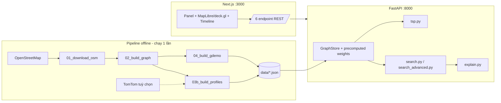
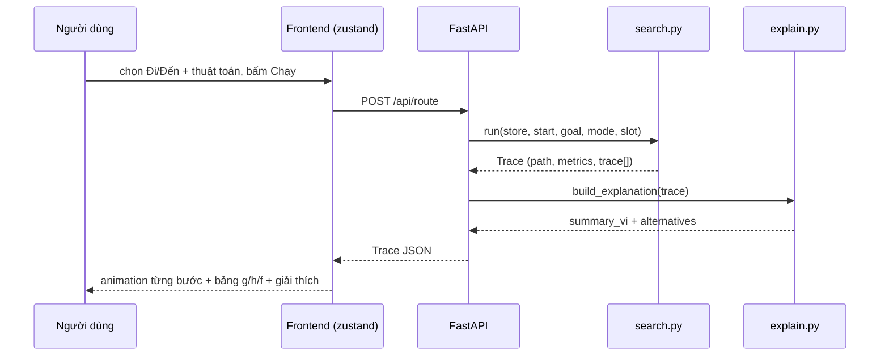

# KHUNG BÁO CÁO KỸ THUẬT — Lab 1: Search Algorithms for Vietnamese Traffic

> ⚠️ **SỐ BENCHMARK LÀ TẠM (2026-07-26):** mọi con số exp1–exp7 trong tài liệu này lấy
> từ lượt chạy congestion **synthetic**. Nhóm sẽ chạy lại TOÀN BỘ benchmark MỘT lượt
> duy nhất sau khi có dữ liệu TomTom — khi đó thay số theo `results/` mới rồi mới nộp.

> **Đích:** hoàn thiện thành PDF 35–50 trang, đủ 10 mục a–j đúng đề. Khung này điền sẵn
> mọi thứ máy làm được (công thức, bảng, số liệu benchmark, hình); phần lập luận để
> nhóm TỰ VIẾT bằng lời của mình.
>
> **Quy ước marker:**
> - `[ĐIỀN: …]` — nhóm tự viết prose theo mô tả.
> - `[SỐ LIỆU → file]` — con số lấy từ file benchmark (đã điền sẵn giá trị hiện tại,
>   chạy lại benchmark thì đối chiếu lại file).
> - `[HÌNH → file]` — hình đã sinh sẵn, chỉ việc chèn.
> - `[SCREENSHOT: …]` — nhóm chụp GUI theo mô tả (chế độ TỐI — quy ước DESIGN.md §1).
> - `> 💡 Gợi ý:` — cần chạm ý gì, độ dài, tiêu chí chấm nào ăn điểm.
> - `> ✍️ Phụ trách:` — theo phân công phương án §8 (A→d; B→e,f; C→e,h; D→i; E→a,b,g,j).

---

## a. Giới thiệu nhóm (2–3 trang)

> ✍️ Phụ trách: **E**
> 💡 Gợi ý: trung thực về mức hoàn thành; rubric 100 điểm bên dưới là thứ giảng viên
> dò từng dòng — tự chấm trước sẽ ghi điểm thiện chí. Ghi chú hạn chế mobile ~"GUI 95%".

**Bảng thành viên** *(điền MSSV thật — cột vai trò theo phương án §8)*:

| Vai trò | Họ tên | MSSV | Đóng góp chính | % đóng góp |
|---|---|---|---|---|
| A — Data Engineer | [ĐIỀN] | [ĐIỀN] | pipeline scripts/01–04, G_demo, DATA.md | [ĐIỀN] |
| B — Core Search | [ĐIỀN] | [ĐIỀN] | search.py 6 thuật toán + trace + test | [ĐIỀN] |
| C — Advanced + TSP | [ĐIỀN] | [ĐIỀN] | search_advanced.py, tsp.py | [ĐIỀN] |
| D — Frontend | [ĐIỀN] | [ĐIỀN] | toàn bộ frontend/ | [ĐIỀN] |
| E — API + Eval + Report | [ĐIỀN] | [ĐIỀN] | main.py, explain.py, benchmark.py, báo cáo | [ĐIỀN] |

**Bảng tự đánh giá theo rubric đề (100 điểm):**

| Tiêu chí (theo đề) | Điểm tối đa | Nhóm tự chấm | Ghi chú |
|---|---|---|---|
| Bối cảnh giao thông VN thực tế | 10 | [ĐIỀN] | kịch bản shipper TP.HCM, dữ liệu OSM khu trung tâm |
| Mô hình đồ thị, dataset, hàm chi phí | 15 | [ĐIỀN] | 2 tầng G_demo/G_real; cost quy về giây |
| Cài đúng 4 thuật toán bắt buộc | 20 | [ĐIỀN] | +đối chứng NetworkX 1200/1200 (exp1) |
| Thuật toán bổ sung (≥2) | 10 | [ĐIỀN] | nhóm làm 6: Dijkstra, Greedy, BiDijkstra, IDA*, Beam, IDDFS |
| Tối ưu đa điểm | 10 | [ĐIỀN] | Held-Karp + NN+2-opt + SA (3 phương pháp) |
| GUI + visualize quá trình tìm kiếm | 10 | [ĐIỀN] | animation từng bước, bảng g/h/f, 2 theme; hạn chế: chưa responsive mobile |
| Giải thích tuyến + so sánh phương án | 10 | [ĐIỀN] | explanation tiếng Việt + ≥1 alternative |
| Chất lượng báo cáo | 10 | [ĐIỀN] | |
| Chất lượng video | 5 | [ĐIỀN] | |

---

## b. Bối cảnh bài toán (2–3 trang)

> ✍️ Phụ trách: **E**
> 💡 Gợi ý: 3 ý bắt buộc: (1) vấn đề thật của TP.HCM giờ cao điểm; (2) vì sao tuyến
> ngắn nhất km không phải tuyến tốt; (3) shipper đa điểm cần gì. Dẫn 1–2 nguồn
> (cổng giao thông TP.HCM giaothong.hochiminhcity.gov.vn, báo chí về điểm ngập).
> Ăn điểm tiêu chí "Vietnamese traffic context" (10đ).

[ĐIỀN: kịch bản shipper giao hàng đa điểm khu trung tâm TP.HCM — ùn tắc 07:30/17:30,
mạng lưới một chiều dày đặc (1 433/4 699 cạnh một chiều trong dữ liệu nhóm), điểm ngập
(Nguyễn Hữu Cảnh, Đinh Tiên Hoàng…), lô cốt thi công, và nhu cầu: (i) tìm đường tốt
giữa 2 điểm theo nhiều tiêu chí, (ii) xếp thứ tự giao nhiều đơn tối ưu.]

[ĐIỀN: vì sao chọn kịch bản shipper — có sẵn cả HAI bài toán đề yêu cầu.]

---

## c. Mô hình hoá bài toán (3–5 trang) `[⚠️ CHƯA PHÂN CÔNG — đề xuất B hỗ trợ A]`

> 💡 Gợi ý: mục ăn điểm "Graph modeling + cost function" (15đ). Điểm KHÁC BIỆT phải
> lập luận kỹ: nhóm KHÔNG cộng α·dist + β·time + γ·cong đa đơn vị như công thức mẫu
> của đề mà QUY HẾT VỀ GIÂY — đề vẫn được thoả vì đủ 4 thành phần distance/time/
> congestion/risk (mode distance riêng, congestion nhân vào time, risk cộng giây).
> Trỏ sang thí nghiệm 5 khi bàn cách chọn γ.

**Định nghĩa hình thức** *(điền sẵn — nhóm kiểm tra và diễn giải thêm)*:
- Không gian trạng thái: tập node V (giao lộ/địa danh); trạng thái = node hiện tại.
- Hành động: đi qua cạnh có hướng (u, v) ∈ E; đồ thị CÓ HƯỚNG — đường 2 chiều là 2 cạnh.
- Trạng thái đầu: node xuất phát; đích: node đến; nghiệm: dãy cạnh liên tiếp.
- Chi phí bước = trọng số cạnh theo chế độ (bảng dưới).

**Thuộc tính cạnh** *(chèn từ `docs/SCHEMA.md` §A.3 — bảng đầy đủ trong đó)*:
`length_m`, `highway`, `oneway`, `free_speed_kmh`, `free_travel_time_s`,
`risk{flood, construction, narrow_alley, traffic_light}`.

**Hàm chi phí** *(điền sẵn từ SCHEMA §D — ĐÚNG như code)*:

```
t_free(e)   = length_m / (free_speed_kmh / 3.6)                    [giây]
f_cong(e,h) = 1 + γ·(congestion(e,h) − 1)/4        γ = 1,5; congestion ∈ [1..5]
penalty(e)  = 60·ngập + 90·lô_cốt + 30·hẻm_nhỏ + 25·đèn_đỏ         [giây]

mode=distance → w = length_m                       [mét]
mode=time     → w = t_free · f_cong                [giây]
mode=balanced → w = t_free · f_cong + penalty      [giây]  (MẶC ĐỊNH)
```

[ĐIỀN: lập luận vì sao quy hết về giây thay vì tổng đa đơn vị: (1) mọi thành phần
cùng thứ nguyên → cộng có nghĩa vật lý "thời gian tương đương"; (2) penalty đọc được
("một điểm ngập đắt ngang 60 giây đi đường"); (3) heuristic admissible chứng minh
được sạch sẽ trên cùng đơn vị. Nêu vì sao γ=1,5: trỏ [HÌNH → results/figs/exp5_gamma_curves.png]
— thời gian tuyến đạt cực tiểu quanh γ=1,5 [SỐ LIỆU → results/exp5_gamma.csv:
790,8 s tại γ=1,5 so với 811,8 s tại γ=0].]

[ĐIỀN: ùn tắc đổi tuyến thế nào — trỏ exp4: 83,5% cặp OD đổi tuyến giữa 07:30 và 22:00.]

---

## d. Dataset (3–5 trang)

> ✍️ Phụ trách: **A**
> 💡 Gợi ý: phần lớn nội dung đã có trong `data/DATA.md` — chuyển thành prose, đừng
> dán nguyên bảng. Bắt buộc nêu: pipeline 4 bước + validator; 2 tầng đồ thị và LÝ DO;
> nguồn (OSM/OSMnx v2, TomTom tuỳ chọn + synthetic fallback, cổng giao thông đối chiếu
> định tính); bảng free-speed; giả định & hạn chế (mục 8 DATA.md — trung thực là điểm cộng).

**Sơ đồ pipeline** *(vẽ lại từ DATA.md §1)*: `01_download_osm → 02_build_graph →
03b_build_profiles(real) → 04_build_gdemo → 03b(demo) → validate_data`.

**Số liệu bản build hiện tại** *(từ DATA.md §7)*:

| | G_real | G_demo |
|---|---|---|
| Node | 2 118 (raw 2 230, lấy SCC) | 51 địa danh thật |
| Cạnh | 4 699 (1 433 một chiều) | 253 (51 một chiều) |
| Đèn / ngập / lô cốt / hẻm | 185 / 402 / 107 / 8 | 122 / 39 / 31 / 0 |
| Bất biến demo/real | — | time ≤1,5× · dist ≤1,8× mọi cặp POI (validator chặn) |

[ĐIỀN: kiến trúc 2 tầng — vì sao cần cả hai: G_demo để visualize/giảng/quay video
(tên thật, cạnh co kế thừa hình học thật), G_real để benchmark/chứng minh scale.]

[ĐIỀN: luật synthetic congestion (DATA.md §5) + khẳng định demo offline 100%.]

[SCREENSHOT: `data/gdemo_preview.png` — sơ đồ G_demo 51 điểm]

---

## e. Nguyên lý thuật toán (8–12 trang)

> ✍️ Phụ trách: **B** (6 thuật toán lõi) + **C** (4 nâng cao)
> 💡 Gợi ý: mục ăn điểm "Correct implementation" (20đ) + "Additional" (10đ). Mỗi thuật
> toán 1 tiểu mục theo KHUNG: ý tưởng ngắn → pseudocode → ví dụ minh hoạ → complete/
> optimal. Ví dụ minh hoạ: `[ĐIỀN — VIẾT LẠI BẰNG LỜI CỦA BẠN từ docs/GIAI-THICH-THUAT-TOAN.md
> — bảng từng bước đã sinh sẵn từ dữ liệu thật, được phép chèn bảng, cấm chép nguyên văn lời giảng]`.

Danh sách tiểu mục (theo thứ tự): BFS · DFS · IDDFS · UCS · Dijkstra (+quan hệ UCS↔Dijkstra)
· A* · Greedy Best-First · Bidirectional Dijkstra (đồ thị đảo cạnh, luật dừng μ) ·
IDA* (ngưỡng ε=5 s) · Beam Search (k, incomplete).

**Tiểu mục heuristic** *(chèn sẵn)*: toàn bộ chứng minh admissible + consistent lấy từ
`docs/HEURISTIC-PROOF.md` (Bổ đề 1–3, Định lý 1–3, mục 6b về làm tròn số — bài học hay
nên kể). Kèm [HÌNH → results/figs/admissibility_scatter.png] và
[SỐ LIỆU → results/exp2_admissibility.csv: 0 vi phạm trên 21 170 điểm; h/h* lớn nhất ≈ 0,565].

[ĐIỀN: nhận xét h/h* ≈ 0,565 nghĩa là heuristic "lỏng" — vì sao (đường vòng + ùn tắc
làm chi phí thật lớn hơn nhiều thời gian bay thẳng ở 60 km/h) và hệ quả (A* vẫn đúng
nhưng tiết kiệm expand có giới hạn: 771 so với 1 226 của Dijkstra — exp3).]

---

## f. Program flow (2–3 trang)

> ✍️ Phụ trách: **B**
> 💡 Gợi ý: 2 sơ đồ + mô tả module. Mermaid dựng sẵn dưới — render rồi chèn hình.





[ĐIỀN: mô tả 1 đoạn/module: graph_store (nạp + precompute weight 12 tổ hợp),
search/search_advanced (hợp đồng trace duy nhất), tsp, explain, main (6 endpoint,
error envelope), frontend store/timeline đồng bộ 2 chiều.]

---

## g. So sánh thuật toán (4–6 trang)

> ✍️ Phụ trách: **E**
> 💡 Gợi ý: bảng lý thuyết `[nhóm kiểm tra lại]` rồi ĐỐI CHIẾU số đo thật — phân tích
> chênh lệch lý thuyết/thực nghiệm là chỗ ăn điểm phân tích. b = bậc nhánh, d = độ sâu
> nghiệm, C* = chi phí tối ưu, ε = trọng số cạnh nhỏ nhất.

**Bảng lý thuyết** *(điền sẵn — [nhóm kiểm tra lại])*:

| Thuật toán | Thời gian | Bộ nhớ | Complete | Optimal |
|---|---|---|---|---|
| BFS | O(b^d) | O(b^d) | ✔ | ✘ (chỉ khi cạnh đều) |
| DFS | O(b^m) | O(bm) | ✔ (hữu hạn+visited) | ✘ |
| IDDFS | O(b^d) | O(bd) | ✔ | ✘ (như BFS) |
| UCS | O(b^(1+C*/ε)) | O(b^(1+C*/ε)) | ✔ | ✔ |
| Dijkstra | O((V+E)logV) | O(V) | ✔ | ✔ |
| A* | O(b^d) — thực tế ≪ UCS | O(b^d) | ✔ | ✔ (h admissible) |
| Greedy | O(b^m) | O(b^m) | ✔ (visited) | ✘ |
| BiDijkstra | ~2·O(b^(d/2)) | 2 frontier | ✔ | ✔ |
| IDA* | lặp lại theo ngưỡng | O(bd) | ✔ | ✔ trong C*+ε |
| Beam | O(k·d) | O(k) | ✘ | ✘ |

**Bảng thực nghiệm** *(điền sẵn từ [SỐ LIỆU → results/exp3_benchmark.csv] — trung bình
200 cặp × 2 khung giờ trên G_real)*:

| Thuật toán | expand TB | runtime TB (ms) | gap % TB | found % |
|---|---|---|---|---|
| bfs | 1 242 | 0,9 | 39,3 | 100 |
| dfs | 1 036 | 19,0 | 1 631,3* | 100 |
| iddfs | 109 612 | 299,2 | 39,3 | 100 |
| ucs | 1 226 | 2,8 | 0 | 100 |
| dijkstra | 1 226 | 2,6 | 0 | 100 |
| astar | 771 | 2,8 | 0 | 100 |
| greedy | 62 | 0,2 | 60,9 | 100 |
| bidijkstra | 751 | 2,7 | 0 | 100 |
| idastar | 630 225 | 649,5 | 0,1 (≤ ε) | 100 |
| beam (k=50) | 1 075 | 3,0 | 22,4 | 98,5 |

*\*DFS gap trung bình cực lớn vì vài ca lượn gần hết đồ thị — nêu thêm median nếu nhóm muốn công bằng hơn.*
*(Số tổng hợp từ 400 dòng/thuật toán trong CSV — làm tròn để đọc; đối chiếu file khi cần chính xác.)*

[HÌNH → results/figs/exp3_expanded_bar.png] · [HÌNH → results/figs/exp3_runtime_bar.png]
· [HÌNH → results/figs/exp3_gap.png]

[ĐIỀN: phân tích — (1) A*/BiDijkstra tiết kiệm ~37–39% expand so UCS/Dijkstra, khớp
lý thuyết heuristic/2-phía; (2) Greedy expand ít nhất (62) nhưng gap trung bình 60,9%
— cái giá của việc bỏ qua g, đắt hơn cả BFS; (3) IDDFS/IDA* expand khủng (hàng trăm
nghìn) do chạy lại từng vòng — CÁI GIÁ của tiết kiệm bộ nhớ O(bd), IDA* vẫn giữ chất
lượng nghiệm (gap ≤ ε) còn IDDFS thì không; (4) Beam k=50 lỡ 1,5% ca không tìm thấy
— minh hoạ incomplete bằng số; (5) DFS gap 4 chữ số: vô nghĩa cho định tuyến.]

**Ảnh hưởng ùn tắc** [SỐ LIỆU → results/exp4_congestion.csv]: **167/200 cặp (83,5%)**
đổi tuyến giữa 07:30 và 22:00. [ĐIỀN: bình luận + lấy 1 ví dụ GeoJSON trong
results/exp4_examples/ mô tả cụ thể đổi thế nào.]

**Đối chứng Google Maps (định tính)** — 5 cặp trong `results/exp6_pairs.json`:
[SCREENSHOT ×5: mở từng `google_maps_url` lúc ~07:30, chụp đặt cạnh
`results/exp6_routes/route_i.png`; nhận xét trùng/khác và VÌ SAO (Google có dữ liệu
real-time, ta dùng snapshot 4 khung giờ)].

---

## h. Tối ưu đa điểm (3–4 trang)

> ✍️ Phụ trách: **C**
> 💡 Gợi ý: mục ăn điểm "Multi-location" (10đ). Nhấn: vì sao ATSP (bất đối xứng do
> một chiều — ví dụ ngay trong GIAI-THICH-THUAT-TOAN §11: BT→SC = 266 nhưng SC→BT = 232);
> Held-Karp là ground truth ≤15 điểm; tuyên bố rõ cái nào TỐI ƯU cái nào XẤP XỈ.

**Phát biểu bài toán** [ĐIỀN: shipper từ kho (Bưu điện TP), thăm k điểm giao đúng 1 lần,
không quay về (return_to_start=false — giả định ghi rõ); ma trận chi phí từ Dijkstra
theo (mode, khung giờ); tổng điểm ≤ 16, Held-Karp ≤ 15].

**Kết quả kịch bản 10 điểm** *(điền sẵn từ [SỐ LIỆU → results/exp7_tsp.csv])*:

| Phương pháp | Tổng chi phí (s) | Tiết kiệm vs thứ tự nhập | Runtime (ms) | Tối ưu? |
|---|---|---|---|---|
| Thứ tự nhập | 7 662,1 | — | — | — |
| Held-Karp | 3 557,5 | **53,6%** | 2,8 | ✔ tuyệt đối |
| NN + 2-opt | 3 557,5 | 53,6% | 0,7 | ✘ (lần này đạt 100% tối ưu) |
| SA (best/5 seed) | 3 557,5 | 53,6% | 29,3 | ✘ (mean 3 564,6 ± 9,7) |

[HÌNH → results/figs/exp7_tsp_map.png]

[ĐIỀN: thảo luận — NN+2-opt và SA đều chạm nghiệm tối ưu trên instance 10 điểm này
(không gian nhỏ); độ lệch SA giữa seed (±9,7 s) minh hoạ tính ngẫu nhiên; với k lớn
hơn 15 chỉ còn heuristic. Nêu giới hạn Held-Karp O(n²·2ⁿ).]

[SCREENSHOT: GUI multiroute — thứ tự đánh số trên bản đồ + card "Tiết kiệm %"]

---

## i. Hướng dẫn sử dụng (2–3 trang)

> ✍️ Phụ trách: **D**
> 💡 Gợi ý: dựng từ README (đã có lệnh PowerShell + bash). Kèm ví dụ input/output cụ thể.

Cài đặt & chạy: *(chép từ README.md — venv → pip → uvicorn → npm run dev; pipeline
data chỉ cần khi muốn build lại từ OSM)*.

**Luồng sử dụng GUI:** [ĐIỀN theo trải nghiệm thật: chọn đồ thị/khung giờ/tiêu chí →
thuật toán (+tham số) → Đi/Đến → Chạy → timeline ▶ + bảng g/h/f → tab Giải thích →
So sánh → multiroute → trang Benchmark].

**Danh sách 8 screenshot cần chụp** *(chế độ Tối)*:
1. [SCREENSHOT: toàn cảnh trang chính G_demo + lớp ùn tắc 07:30]
2. [SCREENSHOT: animation A* đang chạy — node trắng pulse + frontier cyan + bảng g/h/f]
3. [SCREENSHOT: tuyến kết quả amber + panel Số liệu + badge "Đảm bảo tối ưu"]
4. [SCREENSHOT: tab Giải thích — summary tiếng Việt + đoạn ùn tắc tô đỏ trên map]
5. [SCREENSHOT: Dijkstra hai chiều — 2 màu 2 phía]
6. [SCREENSHOT: chế độ So sánh A* vs BFS — 2 tuyến chồng + bảng đối chiếu]
7. [SCREENSHOT: multiroute 9 điểm — số thứ tự + tiết kiệm %]
8. [SCREENSHOT: trang /benchmark với 3 biểu đồ]

**Ví dụ input/output:** [ĐIỀN: 1 request POST /api/route mẫu + đoạn JSON trả về rút gọn
(cắt trace), giải thích từng trường theo SCHEMA].

---

## j. Hạn chế & hướng phát triển (1–2 trang)

> ✍️ Phụ trách: **E**
> 💡 Gợi ý: trung thực + cụ thể; mỗi hạn chế kèm "nếu có thêm thời gian sẽ làm gì".

**Điền sẵn từ phương án §10 + phát sinh thực tế:**
- Chưa mô hình turn penalty / cấm rẽ trái (cần edge-based graph) — Future Work.
- Heuristic còn "lỏng" (h/h* ≈ 0,565) — có thể nâng bằng landmark ALT.
- Congestion synthetic (chưa gắn TomTom key); 4 khung giờ tĩnh, không real-time.
- `narrow_alley` hiếm vì network drive loại hẻm (DATA.md §8) — cần network_type="all".
- VRP nhiều shipper, GA/ACO: ngoài phạm vi, đã chừa kiến trúc.
- GUI chưa responsive mobile (tự chấm GUI ~95%).
- [ĐIỀN: khó khăn thực tế nhóm gặp — gợi ý kể chuyện THẬT: lỗi làm tròn phá admissible
  bị test bắt được (HEURISTIC-PROOF §6b); chữ Ð của OSM khác Đ tiếng Việt; npm build
  đè .next của dev server. Kể được bug mình tự bắt là điểm cộng trưởng thành kỹ thuật.]
