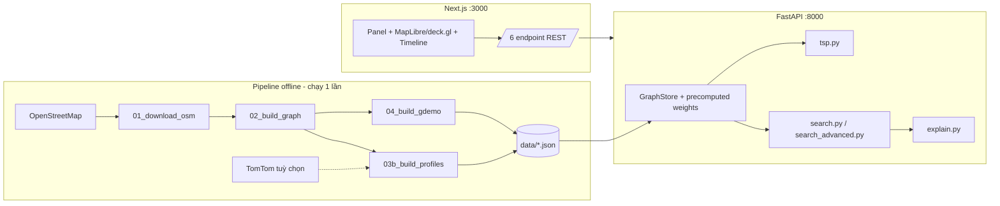
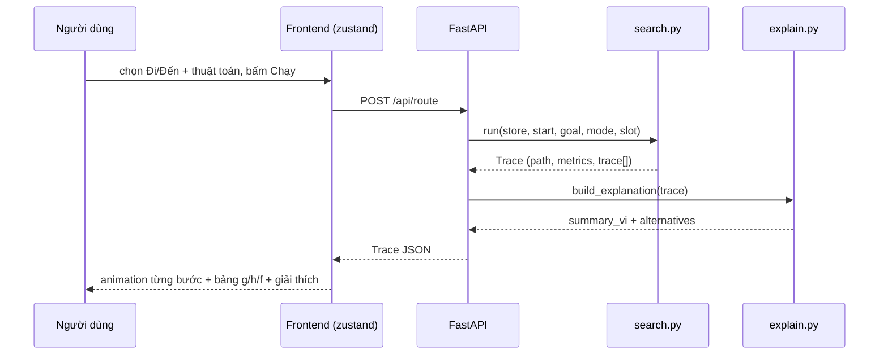

# KHUNG BÁO CÁO KỸ THUẬT — Lab 1: Search Algorithms for Vietnamese Traffic

> ⚠️ **SỐ TẠM (2026-07-27):** mọi con số exp1–exp7 trong tài liệu này lấy từ lượt chạy
> congestion **synthetic** — và CẢ CÁC SỐ VÍ DỤ CHẠY TAY (446/341/+31%/+104 s/ma trận
> 304/120/beam 415…) cũng đổi theo profiles, không riêng số benchmark. Sau khi có
> TomTom, phần data đã được làm mới theo `03b real → 04 → 03b demo → validate_data`.
> Benchmark, hiệu chuẩn γ và `scripts/gen_teaching_doc.py` vẫn chưa chạy lại;
> chỉ thay số theo Phụ lục A của `docs/KIEMTOAN.md` sau lượt cuối đó rồi mới nộp.
>
> **Tiến độ dữ liệu:** raw TomTom đã đủ 4/4 snapshot đại diện lấy trên hai ngày
> thứ Hai; profile hiện là `tomtom+synthetic`; `G_demo` đã rebuild 51/298 và
> validator đạt. Raw GraphML/TomTom/cache hiện được Git track dưới `data/raw/`.
> **Tiến độ nội dung:** đây vẫn là khung Markdown, còn 40 chỗ cần điền
> trên 30 dòng nội dung (không tính dòng chú giải marker), cùng các marker
> screenshot/hình. Chưa phải report PDF để nộp.

> **Đích:** hoàn thiện thành PDF 35–50 trang, đủ 10 mục a–j đúng đề. Khung này điền sẵn
> mọi thứ máy làm được (công thức, bảng, số liệu benchmark, hình); phần lập luận để
> nhóm TỰ VIẾT bằng lời của mình.
>
> **Quy ước marker:**
> - `[ĐIỀN: …]` — nhóm tự viết prose theo mô tả.
> - `[SỐ LIỆU → file]` — con số lấy từ file benchmark (đã điền sẵn giá trị hiện tại,
>   chạy lại benchmark thì đối chiếu lại file).
> - `[HÌNH → file]` — hình đã sinh sẵn, chỉ việc chèn.
> - `[SCREENSHOT: …]` — nhóm chụp GUI theo mô tả (chế độ TỐI — quy ước DESIGN.md §1).
> - `> 💡 Gợi ý:` — cần chạm ý gì, độ dài, tiêu chí chấm nào ăn điểm.
> - `> ✍️ Phụ trách:` — theo phân công phương án §8 (A→d; B→e,f; C→e,h; D→i; E→a,b,g,j).

---

## a. Giới thiệu nhóm (2–3 trang)

> ✍️ Phụ trách: **E**
> 💡 Gợi ý: trung thực về mức hoàn thành; rubric 100 điểm bên dưới là thứ giảng viên
> dò từng dòng — tự chấm trước sẽ ghi điểm thiện chí. Ghi chú hạn chế mobile ~"GUI 95%".

**Bảng thành viên** *(điền MSSV thật — cột vai trò theo phương án §8)*:

| Vai trò | Họ tên | MSSV | Đóng góp chính | % đóng góp |
|---|---|---|---|---|
| A — Data Engineer | [ĐIỀN] | [ĐIỀN] | pipeline scripts/01–04, G_demo, DATA.md | [ĐIỀN] |
| B — Core Search | [ĐIỀN] | [ĐIỀN] | search.py 6 thuật toán + trace + test | [ĐIỀN] |
| C — Advanced + TSP | [ĐIỀN] | [ĐIỀN] | search_advanced.py, tsp.py | [ĐIỀN] |
| D — Frontend | [ĐIỀN] | [ĐIỀN] | toàn bộ frontend/ | [ĐIỀN] |
| E — API + Eval + Report | [ĐIỀN] | [ĐIỀN] | main.py, explain.py, benchmark.py, báo cáo | [ĐIỀN] |

**Bảng tự đánh giá theo rubric đề (100 điểm):**

| Tiêu chí (theo đề) | Điểm tối đa | Nhóm tự chấm | Ghi chú |
|---|---|---|---|
| Bối cảnh giao thông VN thực tế | 10 | [ĐIỀN] | kịch bản shipper TP.HCM, dữ liệu OSM khu trung tâm |
| Mô hình đồ thị, dataset, hàm chi phí | 15 | [ĐIỀN] | 2 tầng G_demo/G_real; cost quy về giây |
| Cài đúng 4 thuật toán bắt buộc | 20 | [ĐIỀN] | +đối chứng NetworkX 1200/1200 (exp1) |
| Thuật toán bổ sung (≥2) | 10 | [ĐIỀN] | nhóm làm 6: Dijkstra, Greedy, BiDijkstra, IDA*, Beam, IDDFS |
| Tối ưu đa điểm | 10 | [ĐIỀN] | Held-Karp + NN+2-opt + SA (3 phương pháp) |
| GUI + visualize quá trình tìm kiếm | 10 | [ĐIỀN] | animation từng bước, bảng g/h/f, 7 theme; hạn chế: chưa xác minh responsive mobile đầy đủ |
| Giải thích tuyến + so sánh phương án | 10 | [ĐIỀN] | explanation tiếng Việt + ≥1 alternative |
| Chất lượng báo cáo | 10 | [ĐIỀN] | |
| Chất lượng video | 5 | [ĐIỀN] | |

---

## b. Bối cảnh bài toán (2–3 trang)

> ✍️ Phụ trách: **E**
> 💡 Gợi ý: 3 ý bắt buộc: (1) vấn đề thật của TP.HCM giờ cao điểm; (2) vì sao tuyến
> ngắn nhất km không phải tuyến tốt; (3) shipper đa điểm cần gì. Dẫn 1–2 nguồn
> (cổng giao thông TP.HCM giaothong.hochiminhcity.gov.vn, báo chí về điểm ngập).
> Ăn điểm tiêu chí "Vietnamese traffic context" (10đ).

[ĐIỀN: kịch bản shipper giao hàng đa điểm khu trung tâm TP.HCM — ùn tắc 07:30/17:30,
mạng lưới một chiều dày đặc (1 433/4 699 cạnh một chiều trong dữ liệu nhóm), điểm ngập
(Nguyễn Hữu Cảnh, Đinh Tiên Hoàng…), lô cốt thi công, và nhu cầu: (i) tìm đường tốt
giữa 2 điểm theo nhiều tiêu chí, (ii) xếp thứ tự giao nhiều đơn tối ưu.]

[ĐIỀN: vì sao chọn kịch bản shipper — có sẵn cả HAI bài toán đề yêu cầu.]

---

## c. Mô hình hoá bài toán (3–5 trang) `[⚠️ CHƯA PHÂN CÔNG — đề xuất B hỗ trợ A]`

> 💡 Gợi ý: mục ăn điểm "Graph modeling + cost function" (15đ). Điểm KHÁC BIỆT phải
> lập luận kỹ: nhóm KHÔNG cộng α·dist + β·time + γ·cong đa đơn vị như công thức mẫu
> của đề mà QUY HẾT VỀ GIÂY — đề vẫn được thoả vì đủ 4 thành phần distance/time/
> congestion/risk (mode distance riêng, congestion nhân vào time, risk cộng giây).
> Trỏ sang thí nghiệm 5 (PHÂN TÍCH ĐỘ NHẠY) khi bàn về γ — γ=1,5 là hằng số thiết kế;
> exp5 chỉ chứng minh kết luận BỀN với lựa chọn γ, không phải "chọn 1,5 bằng thí nghiệm".

**Định nghĩa hình thức** *(điền sẵn — nhóm kiểm tra và diễn giải thêm)*:
- Không gian trạng thái: tập node V (giao lộ/địa danh); trạng thái = node hiện tại.
- Hành động: đi qua cạnh có hướng (u, v) ∈ E; đồ thị CÓ HƯỚNG — đường 2 chiều là 2 cạnh.
- Trạng thái đầu: node xuất phát; đích: node đến; nghiệm: dãy cạnh liên tiếp.
- Chi phí bước = trọng số cạnh theo chế độ (bảng dưới).

**Mô hình cần diễn giải trong bản PDF:** đặt `G=(V,E)` là graph có hướng;
`adj(u)` liệt kê cạnh đi từ `u`, còn `radj(v)` liệt kê cạnh đi vào `v` và chỉ dùng
đúng chiều ngược trong Bidirectional Dijkstra. Một path hợp lệ là
`P=(v₀,…,v_k)` sao cho `(v_i,v_{i+1})∈E`; với mode/slot đã chọn,
`cost(P)=Σ_i w(v_i,v_{i+1})`. Cạnh một chiều chỉ có một hướng hợp lệ; cạnh hai
chiều được biểu diễn bằng hai edge có hướng. Điều này giải thích cả route hai
điểm lẫn vì sao ma trận multi-location có thể bất đối xứng `c(a,b) ≠ c(b,a)`.

**Thuộc tính cạnh** *(chèn từ `docs/SCHEMA.md` §A.3 — bảng đầy đủ trong đó)*:
`length_m`, `highway`, `oneway`, `free_speed_kmh`, `free_travel_time_s`,
`risk{flood, construction, narrow_alley, traffic_light}`.

**Hàm chi phí** *(điền sẵn từ SCHEMA §D — ĐÚNG như code)*:

```
t_free(e)   = length_m / (free_speed_kmh / 3.6)                    [giây]
f_cong(e,h) = 1 + γ·(congestion(e,h) − 1)/4        γ = 1,5; congestion ∈ [1..5]
penalty(e)  = 60·ngập + 90·lô_cốt + 30·hẻm_nhỏ + 25·đèn_đỏ         [giây]

mode=distance → w = length_m                       [mét]
mode=time     → w = t_free · f_cong                [giây]
mode=balanced → w = t_free · f_cong + penalty      [giây]  (MẶC ĐỊNH)
```

[ĐIỀN: lập luận vì sao quy hết về giây thay vì tổng đa đơn vị: (1) mọi thành phần
cùng thứ nguyên → cộng có nghĩa vật lý "thời gian tương đương"; (2) penalty đọc được
("mỗi LƯỢT băng qua một vùng ngập đắt thêm 60 giây" — flag đặt tại cạnh ĐI VÀO vùng
nên tuyến xuyên vùng trả đúng một lần, không cộng dồn theo từng đoạn OSM nhỏ,
xem DATA.md §4); (3) heuristic admissible chứng minh
được sạch sẽ trên cùng đơn vị. Về γ=1,5: trình bày là HẰNG SỐ THIẾT KẾ — nghĩa vật lý
"kẹt cứng mức 5 làm thời gian gấp (1+γ) = 2,5 lần lúc thoáng". TUYỆT ĐỐI KHÔNG lập luận
"đường cong đạt cực tiểu tại γ=1,5 nên 1,5 là đúng": thước đo của exp5 tự dùng γ=1,5
nên cực tiểu tại 1,5 là hệ quả toán học của thước, không phải bằng chứng (đổi thước
sang γ=0 thì "cực tiểu" nhảy về 0). Trình bày exp5 đúng vai PHÂN TÍCH ĐỘ NHẠY: trỏ
[HÌNH → results/figs/exp5_gamma_curves.png] — thời gian tuyến chênh trên CẢ DẢI γ∈[0;3]
chỉ ~2,6% [SỐ LIỆU → results/exp5_gamma.csv: 790,8 s tại γ=1,5 vs 811,8 s tại γ=0]
⇒ kết luận của hệ ít nhạy với lựa chọn γ. Sau lượt crawl TomTom bổ sung thêm một câu:
γ̂ ước lượng riêng từ raw TomTom local (scripts/05_calibrate_gamma.py — fit
f = 1 + γ(c−1)/4 trên inflation freeFlow/current của từng điểm đo) =
[SỐ LIỆU → results/gamma_calibration.csv] — đối chiếu với hằng số 1,5.]

[ĐIỀN: ùn tắc đổi tuyến thế nào — trỏ exp4: 83,5% cặp OD đổi tuyến giữa 07:30 và 22:00.]

**Ghi chú scenario dạy học/thử nghiệm (không thay dataset gốc):** bản triển khai
mở rộng dùng graph view induced `full` hoặc `teach_3`…`teach_50` (UI nhận 3…51,
51 ánh xạ về `full`) và sandbox
edge override request-scoped. View/sandbox chỉ là graph hiệu lực của một request;
không sửa `graph_*.json`, profile base hay benchmark. Mỗi result phải echo
provenance/fingerprint do server sinh để người xem biết đang xem data gốc, graph
dạy học hay kịch bản thử nghiệm. Phần này phải được mô tả theo `SCHEMA.md §E`,
không thay thế provenance dataset ở mục d.

---

## d. Dataset (3–5 trang)

> ✍️ Phụ trách: **A**
> 💡 Gợi ý: phần lớn nội dung đã có trong `data/DATA.md` — chuyển thành prose, đừng
> dán nguyên bảng. Bắt buộc nêu: pipeline 4 bước + validator; 2 tầng đồ thị và LÝ DO;
> nguồn (OSM/OSMnx v2, TomTom 4/4 snapshot đại diện trên hai ngày thứ Hai, chỉ
> dùng trên các cạnh được gán + synthetic fallback,
> cổng giao thông đối chiếu
> định tính); bảng free-speed; giả định & hạn chế (mục 8 DATA.md — trung thực là điểm cộng).

**Sơ đồ pipeline** *(vẽ lại từ DATA.md §1)*: `01_download_osm → 02_build_graph →
03b_build_profiles(real) → 04_build_gdemo → 03b(demo) → validate_data`.

**Số liệu bản build hiện tại** *(từ DATA.md §7)*:

| | G_real | G_demo |
|---|---|---|
| Node | 2 118 (log download trước SCC: 2 230; GraphML được lưu sau SCC: 2 118) | 51 POI do nhóm curate rồi snap vào G_real |
| Cạnh | 4 699 (1 433 một chiều) | 298 (60 một chiều) |
| Đèn / ngập / lô cốt / hẻm | 185 / 54 / 19 / 8 | 130 / 24 / 24 / 0 |
| Bất biến demo/real | — | time ≤1,5× · dist ≤1,8× · balanced ≤1,5× cả 4 khung giờ, mọi cặp POI (validator chặn) |

[ĐIỀN: kiến trúc 2 tầng — vì sao cần cả hai: G_demo để visualize/giảng/quay video
(tên POI do nhóm curate, cạnh co kế thừa chiều dài/hướng/thuộc tính tổng hợp của corridor G_real;
JSON không lưu polyline geometry), G_real để benchmark/chứng minh scale.]

[ĐIỀN: luật TomTom + synthetic fallback (DATA.md §5), phạm vi phủ mẫu và khẳng
định demo offline 100%.]

**Bảng provenance bắt buộc trong PDF** *(không được gộp lẫn “thật” và “nhóm đặt”)*:

| Nhóm | Field/ý nghĩa |
|---|---|
| Artifact OSM-derived | topology/toạ độ và thuộc tính name/highway dùng để build G_real; raw GraphML local hiện được track, nhưng không được live re-query trong audit |
| Suy ra từ topology/thuộc tính OSM | `oneway` public của G_real (có/không ordered pair ngược sau dedup), free-time, traffic_light, narrow_alley |
| Suy ra từ G_real | toạ độ/hướng/length/corridor và thuộc tính tổng hợp của G_demo |
| Nhóm đặt thủ công | POI ban đầu, giả định free-speed, vùng flood/construction |
| Synthetic deterministic fallback | congestion của edge không được TomTom gán ở slot tương ứng |

Nêu rõ bốn snapshot TomTom là hai slot 2026-07-27 và hai slot 2026-08-03, cùng là
thứ Hai cách nhau bảy ngày: chúng là snapshot đại diện theo slot, **không phải**
time series cùng một ngày. Mỗi slot có 40 record hợp lệ và chỉ gán mức TomTom cho
635/4 699 edge G_real; phần còn lại dùng fallback seed 42, còn G_demo kế thừa qua
corridor weighted mean. Assignment hiện dùng khoảng cách từ node nguồn cạnh tới
sample gần nhất trong 250 m trên edge thuộc `MAIN_CLASSES`; không map-match tên
đường/segment geometry/`frc`. Tám `source_url` manual risk vẫn TODO là việc tay chặn
final submission, không được bịa nguồn để điền.

Các nhãn OSM/TomTom ở bảng trên mô tả provenance của artifact local và phép dẫn
xuất có thể tái kiểm, không tuyên bố ground truth ngoài đời hay traffic real-time.

[SCREENSHOT: `data/gdemo_preview.png` — sơ đồ G_demo 51 điểm]

---

## e. Nguyên lý thuật toán (8–12 trang)

> ✍️ Phụ trách: **B** (6 thuật toán lõi) + **C** (4 nâng cao)
> 💡 Gợi ý: mục ăn điểm "Correct implementation" (20đ) + "Additional" (10đ). Mỗi thuật
> toán 1 tiểu mục theo KHUNG: ý tưởng ngắn → pseudocode → ví dụ minh hoạ → complete/
> optimal. Ví dụ minh hoạ: `[ĐIỀN — VIẾT LẠI BẰNG LỜI CỦA BẠN từ docs/GIAI-THICH-THUAT-TOAN.md
> — bảng từng bước hiện còn được sinh từ graph/profile synthetic cũ; phải
> regenerate sau lượt dữ liệu cuối; được phép chèn bảng, cấm chép nguyên văn lời giảng]`.

Danh sách tiểu mục (theo thứ tự): BFS · DFS · IDDFS · UCS · Dijkstra (+quan hệ UCS↔Dijkstra)
· A* · Greedy Best-First · Bidirectional Dijkstra (đồ thị đảo cạnh, luật dừng μ) ·
IDA* (ε=5 m ở distance, 5 s ở time/balanced; cap 1.000 vòng) · Beam Search
(k, incomplete).

**Khung thống nhất cho đủ 13 phương pháp** (10 search + Held–Karp + NN/local +
SA): mỗi tiểu mục cần có (1) mục đích, (2) trực giác, (3) input/parameter/default,
(4) output, (5) cấu trúc dữ liệu, (6) các bước, (7) pseudocode, (8) priority/đại
lượng quyết định, (9) time complexity, (10) space complexity, (11) complete và
điều kiện, (12) optimal và điều kiện, (13) ưu điểm, (14) nhược điểm/khi dùng,
(15) ví dụ chạy tay + so sánh với phương pháp gần nhất. Không dùng benchmark để
thay chứng minh guarantee. IDDFS chỉ complete khi depth nghiệm không vượt cap 100;
IDA* chỉ giữ guarantee khi chưa chạm cap 1.000 round; Bidirectional Dijkstra
không được quảng cáo tốt hơn Dijkstra trong worst case vô điều kiện.

**Ranh giới của khung này:** 15 mục trên là cấu trúc bắt buộc đã khóa cho cả 13
tiểu mục, không phải tuyên bố rằng prose, pseudocode diễn giải bằng lời nhóm,
ví dụ chạy tay, hình và report PDF đã hoàn tất. Các phần đó vẫn là việc tay trước
khi nộp; giữ marker `[ĐIỀN]` và không thay số `SỐ TẠM` bằng số benchmark mới khi
chưa được phép chạy chuỗi benchmark/generator cuối.

**Tiểu mục heuristic** *(chèn sẵn)*: toàn bộ chứng minh admissible + consistent lấy từ
`docs/HEURISTIC-PROOF.md` (Bổ đề 1–3, Định lý 1–3, mục 6b về làm tròn số — bài học hay
nên kể). Kèm [HÌNH → results/figs/admissibility_scatter.png] và
[SỐ LIỆU → results/exp2_admissibility.csv: 0 vi phạm trên 21 170 điểm; h/h* lớn nhất ≈ 0,565].

[ĐIỀN: nhận xét h/h* ≈ 0,565 nghĩa là heuristic "lỏng" — vì sao (đường vòng + ùn tắc
làm chi phí thật lớn hơn nhiều thời gian bay thẳng ở v_max = 45 km/h) và hệ quả (A* vẫn đúng
nhưng tiết kiệm expand có giới hạn: 771 so với 1 226 của Dijkstra — exp3).]

---

## f. Program flow (2–3 trang)

> ✍️ Phụ trách: **B**
> 💡 Gợi ý: 2 sơ đồ + mô tả module. Mermaid dựng sẵn dưới — render rồi chèn hình.





[ĐIỀN: mô tả 1 đoạn/module: graph_store (nạp + precompute weight 12 tổ hợp),
search/search_advanced (hợp đồng trace duy nhất), tsp, explain, main (6 endpoint,
error envelope), frontend store/timeline đồng bộ 2 chiều.]

---

## g. So sánh thuật toán (4–6 trang)

> ✍️ Phụ trách: **E**
> 💡 Gợi ý: bảng lý thuyết `[nhóm kiểm tra lại]` rồi ĐỐI CHIẾU số đo thật — phân tích
> chênh lệch lý thuyết/thực nghiệm là chỗ ăn điểm phân tích. b = bậc nhánh, d = độ sâu
> nghiệm, C* = chi phí tối ưu, ε_min = cận dưới trọng số cạnh dương trong bound
> textbook của UCS; ε_IDA = bước nới ngưỡng IDA* theo đơn vị mode.

**Bảng lý thuyết** *(điền sẵn — [nhóm kiểm tra lại])*:

| Thuật toán | Thời gian | Bộ nhớ | Complete | Optimal |
|---|---|---|---|---|
| BFS | graph traversal O(V+E) | O(V) | trên graph hữu hạn | ✘ (chỉ cost-optimal khi cạnh đều) |
| DFS | graph traversal O(V+E) | O(V) | trên graph hữu hạn + visited | ✘ |
| IDDFS | textbook O(b^d) | stack/closed theo vòng | Có điều kiện: d≤cap 100 | ✘ (như BFS) |
| UCS | O((V+E)logV) với heap | O(V+E) worst case với lazy heap | ✔ khi weight không âm | ✔ khi weight không âm |
| Dijkstra | O((V+E)logV) | O(V+E) worst case với lazy heap | ✔ khi weight không âm | ✔ khi weight không âm |
| A* | worst case có thể xét toàn graph | O(V+E) worst case với heap/lazy entry | ✔ với heuristic nhất quán | ✔ với heuristic admissible + consistent |
| Greedy | phụ thuộc frontier/heap; không dùng g để chọn | O(V) | tìm path trên graph hữu hạn có closed set | ✘ |
| BiDijkstra | worst-case cùng bậc Dijkstra, không hơn vô điều kiện | O(V+E) worst case với hai lazy heap | ✔ khi weight không âm + stop rule | ✔ khi weight không âm + stop rule |
| IDA* | thường O(b^d), có lặp threshold, tối đa 1.000 vòng | O(V+Q): `best_g`/`parent`/`h_of` + explicit stack đang chờ Q | Có điều kiện: chưa chạm cap | ✔ trong C*+ε_IDA nếu chưa chạm cap |
| Beam | xấp xỉ O(b·k·d) | O(V+b·k): maps + raw pool lớp kế | ✘ | ✘ |

**Bảng thực nghiệm** *(điền sẵn từ [SỐ LIỆU → results/exp3_benchmark.csv] — trung bình
200 cặp × 2 khung giờ trên G_real)*:

| Thuật toán | expand TB | runtime TB (ms) | gap % TB | found % |
|---|---|---|---|---|
| bfs | 1 242 | 0,9 | 39,3 | 100 |
| dfs | 1 036 | 19,0 | 1 631,3* | 100 |
| iddfs | 109 612 | 299,2 | 39,3 | 100 |
| ucs | 1 226 | 2,8 | 0 | 100 |
| dijkstra | 1 226 | 2,6 | 0 | 100 |
| astar | 771 | 2,8 | 0 | 100 |
| greedy | 62 | 0,2 | 60,9 | 100 |
| bidijkstra | 751 | 2,7 | 0 | 100 |
| idastar | 630 225 | 649,5 | 0,1 (≤ ε) | 100 |
| beam (k=50) | 1 075 | 3,0 | 22,4 | 98,5 |

*\*DFS gap trung bình cực lớn vì vài ca lượn gần hết đồ thị — nêu thêm median nếu nhóm muốn công bằng hơn.*
*(Số tổng hợp từ 400 dòng/thuật toán trong CSV — làm tròn để đọc; đối chiếu file khi cần chính xác.)*

[HÌNH → results/figs/exp3_expanded_bar.png] · [HÌNH → results/figs/exp3_runtime_bar.png]
· [HÌNH → results/figs/exp3_gap.png]

[ĐIỀN: phân tích — (1) A*/BiDijkstra tiết kiệm ~37–39% expand so UCS/Dijkstra, khớp
lý thuyết heuristic/2-phía; (2) Greedy expand ít nhất (62) nhưng gap trung bình 60,9%
— cái giá của việc bỏ qua g, đắt hơn cả BFS; (3) IDDFS/IDA* expand khủng (hàng trăm
nghìn) do chạy lại từng vòng; implementation IDA* hiện vẫn giữ các map theo node
và explicit stack nên không được quảng cáo là `O(bd)`. IDA* chỉ giữ guarantee
gap ≤ ε khi chưa chạm cap, còn IDDFS không tối ưu weighted cost; (4) Beam k=50
lỡ 1,5% ca không tìm thấy
— minh hoạ incomplete bằng số; (5) DFS gap 4 chữ số: vô nghĩa cho định tuyến.]

**Ảnh hưởng ùn tắc** [SỐ LIỆU → results/exp4_congestion.csv]: **167/200 cặp (83,5%)**
đổi tuyến giữa 07:30 và 22:00. [ĐIỀN: bình luận + lấy 1 ví dụ GeoJSON trong
results/exp4_examples/ mô tả cụ thể đổi thế nào.]

**Đối chứng Google Maps (định tính)** — 5 cặp trong `results/exp6_pairs.json`:
[SCREENSHOT ×5: mở từng `google_maps_url` lúc ~07:30, chụp đặt cạnh
`results/exp6_routes/route_i.png`; nhận xét trùng/khác và VÌ SAO (Google có dữ liệu
real-time, ta dùng snapshot 4 khung giờ)].

**Mẫu provenance cho mọi số benchmark sau lượt cuối** (điền cạnh bảng/hình, không
chỉ nêu một headline): graph `name/created`, profile `created/source`, GraphView và
scenario fingerprint, mode/slot, OD hoặc stop set, algorithm/params, seed, command,
commit và đường dẫn artifact. Trước khi có một lượt benchmark coherent mới, giữ mọi
con số hiện hữu dưới banner **SỐ TẠM** và không gọi chúng là kết quả current.

---

## h. Tối ưu đa điểm (3–4 trang)

> ✍️ Phụ trách: **C**
> 💡 Gợi ý: mục ăn điểm "Multi-location" (10đ). Nhấn: vì sao ATSP (bất đối xứng do
> một chiều — ví dụ ngay trong GIAI-THICH-THUAT-TOAN §11: BT→SC = 304 nhưng SC→BT = 120);
> Held-Karp là ground truth ≤15 điểm; tuyên bố rõ cái nào TỐI ƯU cái nào XẤP XỈ.

**Phát biểu bài toán** [ĐIỀN: shipper từ kho (Bưu điện TP), thăm k điểm giao đúng 1 lần,
không quay về (return_to_start=false — giả định ghi rõ); ma trận chi phí từ Dijkstra
theo (mode, khung giờ); tổng điểm ≤ 16, Held-Karp ≤ 15].

**Trace tối ưu thứ tự (nếu bật trong GUI):** đây là `OptimizationTrace` riêng, không
phải `Trace` của mười thuật toán route. Nó chỉ giải thích việc chọn/thay đổi thứ tự
ghé (DP update, NN decision, local improvement, SA seed/iteration), còn tuyến xe
thật là các leg cuối. Cap Held–Karp 2 000, NN/local 2 000 và SA 1 500 chỉ cắt
payload theo sampling deterministic; chúng không dừng optimizer. Phần report/video
phải gọi đúng đây là quá trình tối ưu **thứ tự**, không gọi là frontier search trên
graph đường phố.

**Kết quả kịch bản 10 điểm** *(điền sẵn từ [SỐ LIỆU → results/exp7_tsp.csv])*:

| Phương pháp | Tổng chi phí (s) | Tiết kiệm vs thứ tự nhập | Runtime (ms) | Tối ưu? |
|---|---|---|---|---|
| Thứ tự nhập | 7 662,1 | — | — | — |
| Held-Karp | 3 557,5 | **53,6%** | 2,8 | ✔ tuyệt đối |
| NN + 2-opt | 3 557,5 | 53,6% | 0,7 | ✘ (lần này đạt 100% tối ưu) |
| SA (best/5 seed) | 3 557,5 | 53,6% | 29,3 | ✘ (mean 3 564,6 ± 9,7) |

[HÌNH → results/figs/exp7_tsp_map.png]

[ĐIỀN: thảo luận — NN+2-opt và SA đều chạm nghiệm tối ưu trên instance 10 điểm này
(không gian nhỏ); độ lệch SA giữa seed (±9,7 s) minh hoạ tính ngẫu nhiên; với k lớn
hơn 15 chỉ còn heuristic. Nêu giới hạn Held-Karp O(n²·2ⁿ); Nearest Neighbour hiện
là O(n² log n) vì sort ở mỗi vòng; local 2-opt/Or-opt là O(Pn³) vì Θ(n²)
candidate/pass × Θ(n) full re-cost; SA là O(S·I·n) với S=5 seed, I=2 000
iteration/seed. “Nghiệm bằng Held–Karp ở instance này” không biến NN/local hoặc SA
thành thuật toán đảm bảo tối ưu toàn cục; local optimum chỉ là điểm không còn nước
cải thiện theo neighbourhood đã chọn.]

[SCREENSHOT: GUI multiroute — thứ tự đánh số trên bản đồ + card "Tiết kiệm %"]

---

## i. Hướng dẫn sử dụng (2–3 trang)

> ✍️ Phụ trách: **D**
> 💡 Gợi ý: dựng từ README (đã có lệnh PowerShell + bash). Kèm ví dụ input/output cụ thể.

Cài đặt & chạy: *(chép từ README.md — venv → pip → uvicorn → npm run dev; pipeline
data chỉ cần khi muốn build lại từ OSM)*.

**Luồng sử dụng GUI:** [ĐIỀN theo trải nghiệm thật: chọn đồ thị/khung giờ/tiêu chí →
thuật toán (+tham số) → Đi/Đến → Chạy → timeline ▶ + bảng g/h/f → tab Giải thích →
So sánh → multiroute → trang Benchmark].

**Danh sách 8 screenshot cần chụp** *(chế độ Tối)*:
1. [SCREENSHOT: toàn cảnh trang chính G_demo + lớp ùn tắc 07:30]
2. [SCREENSHOT: animation A* đang chạy — node trắng pulse + frontier cyan + bảng g/h/f]
3. [SCREENSHOT: tuyến kết quả amber + panel Số liệu + badge "Đảm bảo tối ưu"]
4. [SCREENSHOT: tab Giải thích — summary tiếng Việt + đoạn ùn tắc tô đỏ trên map]
5. [SCREENSHOT: Dijkstra hai chiều — 2 màu 2 phía]
6. [SCREENSHOT: chế độ So sánh A* vs BFS — 2 tuyến chồng + bảng đối chiếu]
7. [SCREENSHOT: multiroute 9 điểm — số thứ tự + tiết kiệm %]
8. [SCREENSHOT: trang /benchmark với 3 biểu đồ]

**Ví dụ input/output:** [ĐIỀN: 1 request POST /api/route mẫu + đoạn JSON trả về rút gọn
(cắt trace), giải thích từng trường theo SCHEMA].

---

## j. Hạn chế & hướng phát triển (1–2 trang)

> ✍️ Phụ trách: **E**
> 💡 Gợi ý: trung thực + cụ thể; mỗi hạn chế kèm "nếu có thêm thời gian sẽ làm gì".

**Điền sẵn từ phương án §10 + phát sinh thực tế:**
- Chưa mô hình turn penalty / cấm rẽ trái (cần edge-based graph) — Future Work.
- Heuristic còn "lỏng" (h/h* ≈ 0,565) — có thể nâng bằng landmark ALT.
- Profile congestion hiện là `tomtom+synthetic`: TomTom 4/4 chỉ phủ các cạnh
  trục chính được gán, phần còn lại fallback; 4 khung giờ tĩnh, không real-time.
- `narrow_alley` hiếm vì network drive loại hẻm (DATA.md §8) — cần network_type="all".
- VRP nhiều shipper, GA/ACO: ngoài phạm vi, đã chừa kiến trúc.
- GUI chưa responsive mobile (tự chấm GUI ~95%).
- [ĐIỀN: khó khăn thực tế nhóm gặp — gợi ý kể chuyện THẬT: lỗi làm tròn phá admissible
  bị test bắt được (HEURISTIC-PROOF §6b); chữ Ð của OSM khác Đ tiếng Việt; npm build
  đè .next của dev server. Kể được bug mình tự bắt là điểm cộng trưởng thành kỹ thuật.]
