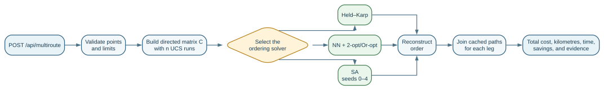
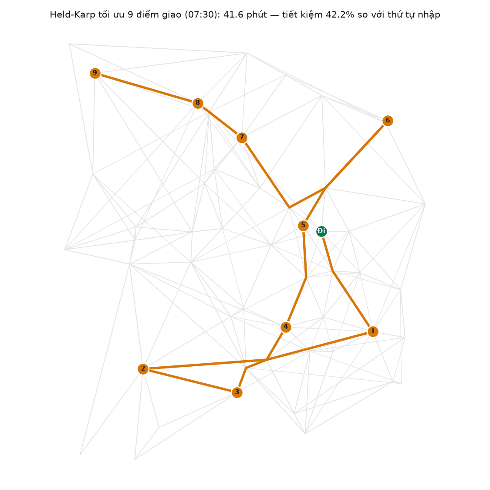

## Multi-stop Optimization

When a shipper needs to deliver multiple orders in one trip, the question is not only *which route to take* but also *in which order to visit the stops*. Because the HCMC street network includes many one-way roads and direction-dependent congestion, the cost of traveling from A to B generally differs from B to A. Finding the optimal visit order on such an asymmetric cost matrix is an instance of the **Asymmetric Traveling Salesman Problem (ATSP)** [1].

The group implements three methods at three levels of guarantee: **Held–Karp** (exact, ≤ 15 points), **Nearest Neighbor + 2-opt/Or-opt** (heuristic, fast and deterministic), and **Simulated Annealing** (metaheuristic, broader exploration). On a 10-point scenario with `balanced` at 07:30, all three achieve 41–42% cost savings compared to the input order.

> **Result provenance.** Experiment 7 was produced by the official isolated run
> on 11 August 2026. A read-only check on 15 August 2026 matched all 19 recorded
> graph/profile/source/result SHA-256 values; no benchmark or artifact was regenerated.

### Problem statement

The street graph is denoted by $G=(V,E)$, where $V$ is the set of intersections/locations and $E$ is the set of directed road segments. The shipper starts from a fixed location and must visit every delivery point exactly once; the set of points to optimize is $P=\{p_0,p_1,\ldots,p_{n-1}\}\subseteq V$, where $p_0$ is the starting point. For every ordered pair $(p_i,p_j)$, the system runs Uniform Cost Search (UCS) on $G$ to obtain the optimal cost $c_{ij}$. Because one-way roads and direction-dependent congestion make the costs generally different in opposite directions, $c_{ij}\ne c_{ji}$; therefore the matrix $C=[c_{ij}]$ is **asymmetric**.

The assignment suggests the general cost function $Cost=\alpha\,Distance+\beta\,Time+\gamma\,Congestion+\delta\,Risk$ [1]. The group specializes this into three modes: `distance` optimizes metres, `time` optimizes free-flow travel time multiplied by a congestion factor (seconds), and `balanced` optimizes time plus risk penalty (seconds) — all expressed in a single unit to avoid mixing metres with seconds. Full cost-function details are in the problem modeling section (§c). For each request, the implementation constructs the ATSP matrix using the selected `mode` and `time_slot`; in the response, `total_time_s` remains the balanced-time contract. The experiment below uses `balanced` at the representative 07:30 time slot [7], [8].

The project's default objective is an **open route**: $\pi_0=p_0$ and

$$
\min_{\pi}\;\sum_{k=0}^{n-2}c_{\pi_k,\pi_{k+1}},
$$

where $\pi$ is a permutation of $P$. When `return_to_start=true`, the system adds $c_{\pi_{n-1},p_0}$ to obtain a closed ATSP cycle. The API currently limits the total number of points, including the start, to 16; Held–Karp is limited to 15 points [6], [7].

**Terminology used in this section.** An *exact algorithm* guarantees a globally optimal solution. A *heuristic* quickly finds a good solution without guaranteeing the best one. A *metaheuristic* is a general search strategy that controls exploration across multiple regions of the solution space. A *local optimum* is a solution with no improvement in the neighborhood being considered; a *global optimum* is the best solution in the entire space. *Ground truth* here means the exact solution used as an internal comparison baseline, not an external data source. The *objective* is the total cost to minimize. A *seed* initializes the pseudo-random number generator so that a stochastic run can be reproduced.

### Common processing flow

All three methods share the same pipeline: receive the list of points → build the directed cost matrix via UCS → optimize the visit order → assemble the cached UCS paths into a complete route.



*Figure 1. From a multi-stop request → directed cost-matrix construction → visit-order optimization → assembly of the cached UCS paths.*

### Worked example — four-point matrix

The following four-point matrix is used throughout the explanations. The shipper starts at **BT** (Chợ Bến Thành / Bến Thành Market), delivers at **HN** (Điểm trung chuyển Hàm Nghi / Hàm Nghi transfer point), **MT** (Bảo tàng Mỹ thuật TP.HCM / Ho Chi Minh City Museum of Fine Arts), and **SC** (Saigon Centre (Takashimaya)), without returning to BT. Each cell is the `balanced` cost of the corresponding UCS route at 07:30, rounded to the nearest second [9].

| From / To | BT | HN | MT | SC |
|---|---:|---:|---:|---:|
| **BT** | — | 206 | 176 | 304 |
| **HN** | 135 | — | 30 | 254 |
| **MT** | 105 | 30 | — | 223 |
| **SC** | 99 | 52 | 82 | — |

The example makes the asymmetry explicit: BT $\rightarrow$ SC costs 304 s, whereas SC $\rightarrow$ BT costs only 99 s. Therefore, $c_{ij}$ must not be replaced by $c_{ji}$, and symmetric-TSP cost-difference formulas must not be applied.

### Held–Karp (Dynamic Programming) — Exact algorithm

Held–Karp is the first of the three methods, serving as the **reference baseline** (ground truth) because it is the only one that guarantees a globally optimal solution.

#### Operating theory — DP states and recurrence

Held–Karp is an exact algorithm based on **dynamic programming**: it stores solutions to subproblems so that the same visited set is not recomputed. A visited set is encoded by a **bitmask**, where each bit indicates whether a point has already appeared in the route. This approach originates from Held and Karp's dynamic-programming method for sequencing problems [3].

Let $D[S,j]$ be the minimum cost of starting at $p_0$, visiting exactly the points in set $S$, and ending at $p_j$. Then:

$$
D[\{p_0\},p_0]=0,
$$

$$
D[S,p_j]=\min_{p_i\in S\setminus\{p_j\}}
\left(D[S\setminus\{p_j\},p_i]+c_{ij}\right).
$$

For an open route, the optimal cost is

$$
C^*=\min_{j\ne 0}D[P,p_j].
$$

For a closed route, each possible final endpoint is additionally charged $c_{j0}$. Every state stores its predecessor so that the optimal order can be reconstructed by backtracking. The recurrence uses the directed value $c_{ij}$ directly, so it handles ATSP without assuming symmetry.

For the four-point example, several states on the optimal chain are:

| State | Best value (s) | Predecessor |
|---|---:|---|
| $D[\{BT,SC\},SC]$ | 304 | BT |
| $D[\{BT,SC,HN\},HN]$ | $304+52=356$ | SC |
| $D[\{BT,SC,HN,MT\},MT]$ | $356+30=386$ | HN |

After comparing all other possible final endpoints, the algorithm returns `BT → SC → HN → MT`, with total cost 386 s. The key point is that Held–Karp does not simply choose the cheapest immediate edge; it evaluates the total cost of the remaining route.

#### Program-flow design — `dp` table and backtracking

The following abbreviated pseudocode matches `backend/app/tsp.py`:

```text
HELD_KARP(C, points, return_to_start)
    dp[{start}, start] <- (0, none)
    for each mask containing start:
        for each endpoint i stored in dp[mask]:
            for each point j not in mask:
                candidate <- dp[mask, i] + C[i, j]
                if candidate improves dp[mask ∪ {j}, j]:
                    store candidate and predecessor i
    choose the cheapest final endpoint
    if return_to_start: add C[endpoint, start]
    follow predecessors to reconstruct order
    return order, total_cost
```

The code builds the matrix and path cache first; $n>15$ is rejected and $n\ge13$ produces a warning. `dp` starts at `dp[1][0]`, updates using directed $c_{ij}$ values, and then follows `predecessor` to reconstruct the order and decompose the route into legs. The trace records DP updates; its 2,000-event limit only samples trace output (via stride sampling) and does not truncate the optimization itself [7].

#### Complexity, completeness, and optimality

Let $n$ be the total number of points, including the start. There are $O(2^n)$ subsets and at most $n$ endpoints per subset. Each state considers at most $n$ predecessors or next points:

- **Time:** $O(n^2\,2^n)$.
- **Space:** $O(n\,2^n)$ for costs and predecessors; this is the main practical limitation.
- **Completeness:** yes, when all required matrix entries exist and $n$ is within the supported limit. If a directed pair is unreachable, the API stops before optimization and returns `found=false` rather than producing an invalid route.
- **Optimality:** yes. Dynamic programming considers every visited-set/endpoint possibility; by the principle of optimality, an optimal route to $(S,j)$ must contain an optimal route to its predecessor state. The guarantee applies to both asymmetric matrices and open/closed route settings.

#### Why the route is selected in practice — global decisions

Held–Karp chooses the route with the **lowest total objective**, not necessarily the shortest first leg. In the four-point example, BT $\rightarrow$ MT costs only 176 s, less than BT $\rightarrow$ SC at 304 s; however, starting with MT leads to a more expensive remainder. The sequence `BT → SC → HN → MT` exploits two cheap later legs (52 s and 30 s), giving the global optimum of 386 s.

In the 10-point scenario, Held–Karp reduces 4,320.1 s to 2,494.9 s, a 42.2% saving. This exact result is the **internal reference optimum** on the fixed matrix $C$ of the specified instance (`G_demo`, `balanced`, 07:30, open route, 10 points), used to measure heuristic gaps. It does not prove that real-world traffic data or the cost model is universally accurate; operationally, it is appropriate for small instances and the project's $n\le15$ limit.

### Nearest Neighbor combined with 2-opt/Or-opt — Heuristic

Held–Karp guarantees optimality but has exponential complexity $O(n^2\,2^n)$, making it infeasible beyond 15 points. The second method trades the absolute optimality guarantee for **response speed** and scalability.

#### Operating theory — greedy construction and directed neighborhoods

The method has two stages. **Nearest Neighbor (NN)** constructs an initial order quickly: at the current point $p_i$, it chooses the unvisited point $p_j$ with the smallest directed cost $c_{ij}$. Because this rule only looks at the next decision, it can fall into a **greedy trap**: cheap early choices may force an expensive final part of the route.

The local search then improves the complete order using two move types:

- **2-opt:** reverse the segment `order[i:j+1]` while keeping the start at the first position. In symmetric Euclidean TSP, 2-opt is often illustrated as removing crossing edges; in an urban ATSP, that geometric interpretation is insufficient because reversing a segment also reverses the direction of its internal legs.
- **Or-opt:** extract a segment of length 1–3 and insert it elsewhere while preserving the segment's orientation. This is particularly useful when reversing direction is heavily penalized by one-way roads.

Because this is an ATSP, the implementation **fully recomputes every candidate route cost** instead of using a symmetric-TSP delta that changes only four edges. A symmetric delta can miss directed internal-edge changes $c_{uv}\to c_{vu}$. 2-opt originates with Croes [4]; full recomputation and Or-opt are project choices that preserve ATSP semantics [6].

In the example, NN produces `BT → MT → HN → SC` (460 s). 2-opt reverses `[MT,HN,SC]` to obtain `BT → SC → HN → MT` (386 s), and accepts the candidate after recomputing the directed cost. Matching Held–Karp is only an observation for this instance, not a guarantee.

#### Program-flow design — NN followed by local search

```text
NN_2OPT(C, points, return_to_start)
    order <- [start]
    while unvisited points remain:
        sort candidates to make tie-breaking stable
        choose j with the smallest C[current, j]
        append j to order

    repeat
        improved <- false
        examine every 2-opt reversal and fully re-cost the route
        if cost decreases: accept the new route; improved <- true
        examine every Or-opt relocation of length 1..3 and fully re-cost it
        if cost decreases: accept the new route; improved <- true
    until improved = false
    return order, total_cost
```

The flow keeps the start fixed, breaks ties by node ID, accepts only strict improvements, and stops when a pass contains no better move. The trace records NN decisions and local improvements; its 2,000-event limit only truncates payload, not the optimization. The final order is then joined with the directed cached paths and returned with its metrics.

#### Complexity, completeness, and optimality — full ATSP recosting

The entire method should not be summarized as $O(n^2)$. $O(n^2)$ describes only basic NN when each step scans candidates linearly. The project implementation uses `sorted(left)` for deterministic tie-breaking, so:

- **NN:** $O(n^2\log n)$ time.
- **2-opt/Or-opt:** each pass examines $\Theta(n^2)$ candidate orders; each candidate is fully re-costed in $\Theta(n)$, giving $O(n^3)$ per pass. With $P$ passes until termination, the total is $O(P\,n^3)$.
- **Solver space:** $O(n)$ for the order and one candidate at a time; including the shared matrix gives $O(n^2)$, before the node-path cache.
- **Completeness:** yes under the stated conditions. With a complete matrix, NN constructs a valid order, and strict improvement over a finite permutation set ensures that local search terminates.
- **Optimality:** not guaranteed globally. At termination, the result is only a local optimum with respect to the selected 2-opt and length-1-to-3 Or-opt neighborhoods; a larger move may still produce a cheaper route.

#### Why the route is selected in practice — fast approximation

NN chooses the cheapest next leg **in the current direction**; 2-opt/Or-opt keeps only moves that reduce the objective after recomputing the entire route. For an ATSP, the criterion is the directed candidate cost, not merely the removal of a geometric crossing.

In the 10-point experiment, NN reaches 2,534.2 s, a 41.3% saving, which is 1.6% higher than Held–Karp; its solver runtime is 1.5 ms, the lowest of the three. This is a practical choice for fast interaction, but it must not be labeled globally optimal.

### Simulated Annealing with 5 Seeds — Metaheuristic

NN + local search converges quickly but stops as soon as it reaches a local optimum — it cannot escape if a better solution lies beyond a cost "hilltop." The third method, Simulated Annealing, addresses this by **accepting worse moves in a controlled manner** to open paths toward other regions of the solution space.

#### Operating theory — temperature and acceptance probability

Simulated Annealing (SA) models **thermal annealing**: at high temperature, the algorithm may accept a worse solution to escape a local optimum; as temperature falls, the search becomes more selective. The principle is presented in [5] and in the instructor's local-search material [2].

For a minimization problem, define

$$
\Delta=C_{candidate}-C_{current}.
$$

If $\Delta\le0$, the candidate is no worse and is accepted. If $\Delta>0$, it is accepted with probability

$$
\Pr(accept)=\exp\left(-\frac{\Delta}{T}\right).
$$

Controlled acceptance of a worse solution helps the search leave a local optimum. When $T$ is high, this probability can be substantial; as $T$ falls, the algorithm increasingly concentrates around good regions.

The implementation initializes with NN, sets $T_0=0.2\,C_{initial}$, cools by $T_{k+1}=0.995T_k$, and runs 2,000 iterations per seed. Each step chooses a `swap` or `insert` move while keeping the start fixed; seeds `0,1,2,3,4` run independently and the best-of-5 result is returned [6].

On the four-point matrix, the NN route costs approximately 460 s, so $T_0\approx92$. If a move produces a 542 s route, then $\Delta=82$ and the initial acceptance probability is approximately $e^{-82/92}\approx0.41$. The algorithm may temporarily move in a worse direction to reach another region. In contrast, the candidate `BT → SC → HN → MT` has $\Delta=-74$, is accepted deterministically under the $\Delta\le0$ rule, and becomes the best-so-far route at 386 s.

#### Program-flow design — five seeded trajectories

```text
SIMULATED_ANNEALING(C, points, seeds = 0..4)
    global_best <- infinity
    for each seed:
        rng <- Random(seed)
        current <- NearestNeighbor(C, points)
        local_best <- current
        T <- max(0.2 * cost(current), 1e-9)
        repeat 2000 times:
            candidate <- swap or insert using rng
            delta <- cost(candidate) - cost(current)
            if delta <= 0 or rng.random() < exp(-delta / T):
                current <- candidate
                update local_best if it improves
            T <- 0.995 * T
        update global_best with local_best
    return global_best and statistics for five seeds
```

Each seed uses its own `random.Random(seed)`, so rerunning the same code and data yields the same decision sequence. The system returns the best value, mean, and sample standard deviation. The trace records up to 1,500 events using a priority allocation policy (boundary → new\_best → periodic); the recorder does not consume additional random numbers and therefore does not alter the result.

#### Complexity, completeness, and optimality — iteration and seed budgets

Let $S$ be the number of seeds, $I$ the iterations per seed, and $n$ the number of points. Each swap/insert creates a new order and recomputes its route cost in $O(n)$:

- **Time:** including NN initialization once per seed, $O\bigl(S(n^2\log n+I\,n)\bigr)$; the SA iteration phase alone is $O(S\,I\,n)$. The current configuration uses $S=5$ and $I=2,000$, or 10,000 iteration candidates per sufficiently large request.
- **Solver space:** $O(Sn)$ for per-seed statistics and best orders; if seeds are processed sequentially and only the best cost is retained, the search core is $O(n)$. Including the shared matrix, the dominant term is $O(n^2+Sn)$.
- **Completeness:** conditional. With a complete matrix and a valid initial route, the finite temperature schedule terminates after at most $S\,I$ iterations and returns a valid route.
- **Optimality:** not guaranteed. Theoretical convergence results for SA require a sufficiently slow schedule and enough time; the implementation uses a finite geometric schedule to obtain practical response times, so it provides only a heuristic solution.

Five seeds diversify trajectories and expose dispersion, but they do not turn a probability into a proof; best-of-5 only increases the chance of finding a good solution.

#### Why the route is selected in practice — exploration and stability

SA returns the lowest-cost route observed across the 10,000 iterations of five seeds, not necessarily the final state. A temporarily more expensive solution may be accepted early to open a path toward another region; later, the lower temperature makes the search more selective.

In the 10-point experiment, best-of-5 reaches 2,494.9 s and saves 42.2%; the mean best cost is 2,584.6 ± 66.0 s and runtime is 40.5 ms. The best seed matching Held–Karp is an observation for this instance only and does not change the method's non-guaranteed optimality.

### Algorithm comparison and selection

#### Theoretical comparison

The table compares only the **ordering solvers on the already-built matrix $C$**. Matrix construction uses $n$ UCS runs and path caching as shared work; with a heap, its worst case is approximately $O(n(E+V)\log V)$, so it is kept separate from solver time for a fair comparison.

| Method | Solver time | Solver space | Complete? | Global optimum? | Role |
|---|---|---|---|---|---|
| Held–Karp | $O(n^2\,2^n)$ | $O(n\,2^n)$ | Yes, $n\le15$ | **Yes** | Exact reference; few points |
| NN + 2-opt/Or-opt | $O(n^2\log n+P\,n^3)$ | $O(n^2)$ incl. matrix | Conditional | **No** | Fast, deterministic |
| SA, 5 seeds | $O(S\,I\,n)$ (iteration phase) | $O(n^2+Sn)$ incl. matrix | Conditional | **No** | Broader exploration |

Here $P$ is the number of local-search passes; the current configuration uses $S=5$ and $I=2,000$. "Returns a route" refers only to feasibility and termination; it does not mean that the best possible route has been found.

#### Experimental results on the 10-point scenario

Experiment 7 uses the current G_demo (51 nodes, 298 directed edges), starts at **Bưu điện Thành phố**, visits nine delivery points, uses `balanced` at 07:30, and sets `return_to_start=false`. These values are the official artifacts from 11/08/2026 using the `tomtom+synthetic` profile. The TomTom snapshots are representative samples rather than a real-time traffic feed. `runtime` measures the solver after matrix construction; it is machine-dependent wall-clock time and excludes matrix-building time [8].

| Method | Total cost (s) | Versus input order | Gap vs Held–Karp | Solver time (ms) | Interpretation |
|---|---:|---:|---:|---:|---|
| Input order | 4,320.1 | — | +73.2% | — | Baseline |
| Held–Karp | **2,494.9** | **42.2% saving** | 0% | 3.9 | Exact optimum on exp7's matrix |
| NN + 2-opt/Or-opt | 2,534.2 | 41.3% saving | +1.6% | **1.5** | Fastest in exp7; 1.6% gap on this instance |
| SA, best-of-5 | **2,494.9** | **42.2% saving** | 0% on this instance | 40.5 | Matches the optimum here, without a guarantee |
| SA, mean best cost | 2,584.6 ± 66.0 | — | — | — | Shows variation across seeds |

`Gap` is the percentage by which a method's cost exceeds Held–Karp; SA's 0% gap is valid only for this 10-point instance.

The main orders are:

- **Input order:** Bưu điện Thành phố (City Post Office) → Chợ Bến Thành → Nhà thờ Đức Bà → Bitexco → Chợ Tân Định → Thảo Cầm Viên → BV Từ Dũ → Phố đi bộ Bùi Viện → Chùa Vĩnh Nghiêm → Công viên Lê Văn Tám.
- **Held–Karp, also SA best-of-5:** Bưu điện Thành phố → Bitexco → BV Từ Dũ → Phố đi bộ Bùi Viện → Chợ Bến Thành → Nhà thờ Đức Bà → Thảo Cầm Viên → Công viên Lê Văn Tám → Chợ Tân Định → Chùa Vĩnh Nghiêm.
- **NN + 2-opt/Or-opt:** Bưu điện Thành phố → Thảo Cầm Viên → Nhà thờ Đức Bà → Bitexco → BV Từ Dũ → Phố đi bộ Bùi Viện → Chợ Bến Thành → Công viên Lê Văn Tám → Chợ Tân Định → Chùa Vĩnh Nghiêm.

Figure 2 illustrates the optimal Held–Karp route and the directed paths between delivery points in the same 10-point scenario.

{width=60%}

*Figure 2. Held–Karp order on G_demo at 07:30. Orange lines are directed paths between delivery points; "Go" denotes Bưu điện Thành phố. Source: the official experiment-7 artifact [8].*

#### Usage recommendations

- **Held–Karp:** use when $n\le15$, the matrix is complete, and a provably exact answer is needed; monitor memory near the limit.
- **NN + 2-opt/Or-opt:** use when fast, stable, and explainable response is important; the 1.6% gap is an observation, not a guarantee.
- **SA:** use when escaping local optima is valuable and higher runtime is acceptable; report the seeds and iteration budget, and do not call the result globally optimal.
- With the current implementation, $n=16$ uses a heuristic because Held–Karp is capped; the API does not claim support for larger instances.

The three methods are complementary: Held–Karp supplies an exact reference for small problems, NN plus local search prioritizes speed, and SA explores more broadly when additional runtime is acceptable.

### References

1. Department of Introduction to Artificial Intelligence, [*Lab 1: Search Algorithms for Vietnamese Traffic Route Optimization*](<../docs/Lab 1 - Searching.pdf>), sections 4.2–4.10 and evaluation criteria, 2026.
2. [*Artificial Intelligence — Chapter 6: Local Search*](https://lenbui.github.io/bookai/ai-06-local-search.html), course material, accessed 11/08/2026.
3. M. Held and R. M. Karp, "A Dynamic Programming Approach to Sequencing Problems," *Journal of the Society for Industrial and Applied Mathematics*, vol. 10, no. 1, pp. 196–210, 1962, [doi:10.1137/0110015](https://doi.org/10.1137/0110015).
4. G. A. Croes, "A Method for Solving Traveling-Salesman Problems," *Operations Research*, vol. 6, no. 6, pp. 791–812, 1958, [doi:10.1287/opre.6.6.791](https://doi.org/10.1287/opre.6.6.791).
5. S. Kirkpatrick, C. D. Gelatt Jr., and M. P. Vecchi, "Optimization by Simulated Annealing," *Science*, vol. 220, no. 4598, pp. 671–680, 1983, [doi:10.1126/science.220.4598.671](https://doi.org/10.1126/science.220.4598.671).
6. Group 2, [`backend/app/tsp.py`](../backend/app/tsp.py), current ATSP implementation (matrix, Held–Karp, NN + 2-opt/Or-opt, SA).
7. Group 2, [`docs/SCHEMA.md`](../docs/SCHEMA.md), sections C.5, D, E.4, and F.4, cost, multiroute, and optimization-trace contracts.
8. Group 2, [`results/exp7_tsp.csv`](../results/exp7_tsp.csv) and [`results/README.md`](../results/README.md), official experiment results and provenance dated 11/08/2026.
9. Group 2, [`docs/GIAI-THICH-THUAT-TOAN.md`](../docs/GIAI-THICH-THUAT-TOAN.md), "Multi-stop TSP — four-point worked example," an artifact generated from the current code and data.
