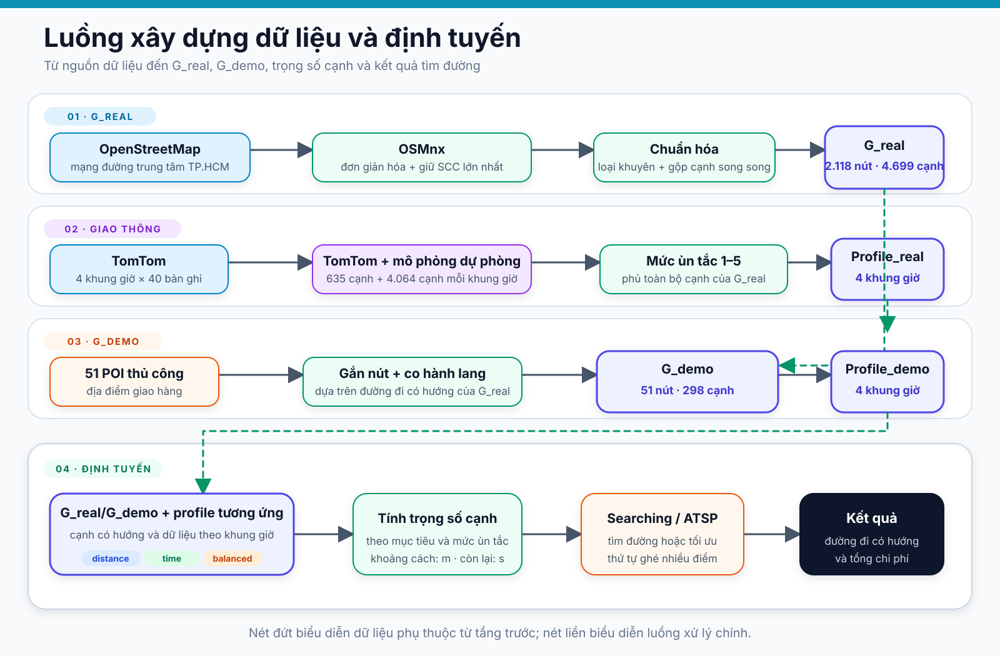

# d. Dataset

## d.1. Phương pháp thiết kế và phạm vi dữ liệu

Đề tài sử dụng **chiến lược tích hợp dữ liệu hỗn hợp (hybrid data
integration)**, kết hợp dữ liệu bản đồ mở đã qua tiền xử lý, các mẫu giao thông
quan sát được, dữ liệu do nhóm xây dựng và thành phần mô phỏng có khả năng tái
lập. Cách tiếp cận này giữ được cấu trúc liên kết có hướng của mạng đường đô
thị, đồng thời tạo ra một bộ dữ liệu phù hợp cho cả đánh giá thuật toán và trực
quan hóa quá trình tìm kiếm.

Đặc điểm quan trọng của bộ dữ liệu không nằm ở việc mô phỏng toàn bộ trạng thái
giao thông thực tế, mà ở **khả năng truy vết nguồn** và **tính nhất quán giữa
hai độ phân giải đồ thị**. Mỗi cạnh trên đồ thị POI được liên kết với một hành
lang có hướng trên đồ thị mạng đường chi tiết; vì vậy, khoảng cách, thời gian,
ùn tắc và rủi ro được tổng hợp từ cùng một chuỗi cạnh thay vì được gán độc lập.

Bộ dữ liệu gồm hai đồ thị và hai hồ sơ giao thông tương ứng. Thông tin chính
được tóm tắt trong bảng dưới đây.

| Thuộc tính | \(G_{\text{real}}\) | \(G_{\text{demo}}\) |
|---|---:|---:|
| Mục đích | Đánh giá thuật toán trên không gian trạng thái lớn | Trực quan hóa, giải thích và định tuyến giữa các POI |
| Nút | 2.118 đỉnh mạng đường | 51 POI |
| Cạnh có hướng | 4.699 | 298 |
| Cạnh một chiều theo cấu trúc | 1.433 | 60 |
| Cạnh có chỉ báo ngập | 54 | 24 |
| Cạnh có chỉ báo thi công | 19 | 24 |
| Cạnh có chỉ báo đường hẹp | 8 | 0 |
| Cạnh đi vào nút đèn tín hiệu | 185 | 130 |
| Khoảng chiều dài cạnh | 1,1–1.682,3 m | 23,0–2.775,6 m |
| Khoảng tốc độ có trong bản dữ liệu | 25–45 km/h | 30–45 km/h |
| Khoảng thời gian thông thoáng đã làm tròn | 0,1–134,6 s | 1,8–270,8 s |
| Số khung giờ | 4 | 4 |
| Tính liên thông | Liên thông mạnh | Liên thông mạnh |

Hai đồ thị dùng hệ tọa độ WGS 84 (EPSG:4326) và cùng giới hạn địa lý
\([106{,}68;10{,}76;106{,}72;10{,}80]\), theo thứ tự kinh độ trái, vĩ độ dưới,
kinh độ phải, vĩ độ trên. Phạm vi này bao phủ một phần khu vực trung tâm, không
đại diện cho toàn bộ Thành phố Hồ Chí Minh.

## d.2. Danh sách địa điểm của đồ thị POI

Các nút mạng đường trong \(G_{\text{real}}\) không có tên địa điểm, nên không
được trình bày như một danh mục POI. Danh sách tương tác gồm 51 POI của
\(G_{\text{demo}}\). Tên dưới đây được giữ nhất quán với bản dữ liệu.

| Nhóm địa điểm | Số lượng | Địa điểm |
|---|---:|---|
| Điểm được quy ước làm kho | 1 | Bưu điện Thành phố |
| Bệnh viện | 3 | BV Nhi Đồng 2; BV Mắt TP.HCM; BV Từ Dũ |
| Trường học | 7 | ĐH Kiến trúc TP.HCM; ĐH Kinh tế TP.HCM; THPT Lê Quý Đôn; Trường Marie Curie; THPT Nguyễn Thị Minh Khai; ĐH Mở TP.HCM; ĐH Khoa học Tự nhiên (Nguyễn Văn Cừ) |

Bốn mươi địa danh còn lại được trình bày thành hai cột để bảo đảm khả năng tra
cứu khi báo cáo được xuất sang PDF.

| STT | Địa danh | STT | Địa danh |
|---:|---|---:|---|
| 1 | Chợ Bến Thành | 21 | Chùa Ngọc Hoàng |
| 2 | Nhà thờ Đức Bà | 22 | Công viên Lê Văn Tám |
| 3 | Dinh Độc Lập | 23 | Chợ Tân Định |
| 4 | Hồ Con Rùa | 24 | Nhà thờ Tân Định |
| 5 | Công viên Tao Đàn | 25 | Cầu Kiệu |
| 6 | Bitexco Financial Tower | 26 | Chùa Vĩnh Nghiêm |
| 7 | Nhà hát Thành phố | 27 | Chùa Xá Lợi |
| 8 | UBND TP.HCM | 28 | Bảo tàng Chứng tích Chiến tranh |
| 9 | Saigon Centre (Takashimaya) | 29 | Vòng xoay Dân Chủ |
| 10 | Công trường Mê Linh | 30 | Cung Văn hoá Lao Động |
| 11 | Bến Bạch Đằng | 31 | Bảo tàng TP.HCM |
| 12 | Cầu Mống | 32 | Bảo tàng Mỹ thuật TP.HCM |
| 13 | Bảo tàng Hồ Chí Minh (Bến Nhà Rồng) | 33 | Điểm trung chuyển Hàm Nghi |
| 14 | Cầu Ba Son | 34 | Công viên 23/9 |
| 15 | Thảo Cầm Viên | 35 | Đền Bà Mariamman |
| 16 | Bảo tàng Lịch sử TP.HCM | 36 | Phố đi bộ Bùi Viện |
| 17 | Đài truyền hình HTV | 37 | Chợ Thái Bình |
| 18 | Sân vận động Hoa Lư | 38 | Cầu Ông Lãnh |
| 19 | Nhà văn hoá Thanh Niên | 39 | Cầu Calmette |
| 20 | Chợ Đa Kao | 40 | Chợ Nancy |

Tên, loại và tọa độ đầu vào của các POI do nhóm chọn lọc thủ công. Mỗi POI được
đối sánh với một nút \(G_{\text{real}}\) khác nhau để trở thành vị trí định
tuyến. Khoảng cách từ tọa độ đầu vào đến nút được chọn có giá trị nhỏ nhất 2,70 m, trung vị
46,14 m và lớn nhất 185,74 m. Năm POI có khoảng cách gắn nút lớn hơn 100 m là Dinh
Độc Lập (185,74 m), Công viên Tao Đàn (154,2 m), Cầu Ba Son (139,9 m), Cung Văn
hoá Lao Động (116,7 m) và Bảo tàng Hồ Chí Minh – Bến Nhà Rồng (105,8 m). Nhà
thờ Tân Định là trường hợp duy nhất dùng nút gần thứ hai, cách 72,46 m, để tránh
trùng nút trong ngưỡng 120 m. Các khoảng cách này đánh giá phép đối sánh
POI–nút, không xác nhận tọa độ POI đầu vào hoặc cổng ra vào là chính xác ngoài
thực địa.

## d.3. Nguồn dữ liệu và xuất xứ dữ liệu

### d.3.1. Phân loại nguồn

| Nhóm dữ liệu | Nguồn và quy mô/độ phủ | Bản chất và vai trò trong mô hình |
|---|---|---|
| Cấu trúc liên kết, tọa độ, chiều dài, loại và tên đường | OpenStreetMap qua OSMnx; 2.118 nút và 4.699 cạnh sau xử lý | Dữ liệu bản đồ mở được dẫn xuất và đơn giản hóa |
| Đèn tín hiệu | Thẻ nút OpenStreetMap; dẫn xuất thành 185 cạnh trên \(G_{\text{real}}\) và 130 cạnh trên \(G_{\text{demo}}\) | Biến chỉ báo khi cạnh đi vào nút tín hiệu |
| Ùn tắc tại các điểm mẫu | TomTom Flow Segment Data; 4 khung giờ × 40 bản ghi, gán cho 635 cạnh mỗi khung giờ | Thành phần giao thông quan sát được |
| Ùn tắc trên phần mạng không được mẫu phủ | Quy tắc mô phỏng với hạt giống giả ngẫu nhiên 42; 4.064 cạnh mỗi khung giờ | Thành phần dự phòng mô phỏng, có khả năng tái lập |
| Địa điểm giao hàng | Nhóm chọn lọc và nhập tọa độ; 51 POI | Dữ liệu thủ công, sau đó đối sánh với nút \(G_{\text{real}}\) |
| Vùng ngập và thi công | Tám vùng tròn do nhóm mô hình hóa: 5 vùng ngập và 3 vùng thi công | Kịch bản rủi ro; nguồn ngoài chỉ hỗ trợ bối cảnh lịch sử |
| Tốc độ theo loại đường, hệ số ùn tắc và chi phí phạt | Tham số do nhóm thiết kế, áp dụng cho toàn bộ cạnh | Cấu hình mô hình, không phải số đo hoặc giới hạn pháp lý |
| Cạnh POI và thuộc tính tổng hợp | Phép co 298 hành lang có hướng; mỗi hành lang gồm 1–33 cạnh mạng đường | Dữ liệu dẫn xuất từ \(G_{\text{real}}\) |

OpenStreetMap là dữ liệu mở theo giấy phép ODbL (OpenStreetMap contributors,
n.d.). OSMnx 2.1.1 được dùng để tải, đơn giản hóa và chuyển dữ liệu đường thành
đồ thị mạng lưới; cách tiếp cận này phù hợp với phương pháp mô hình hóa mạng
đường bằng OSMnx (Boeing, 2025). Các trường tốc độ của mẫu giao thông được diễn
giải theo đặc tả Flow Segment Data (TomTom, n.d.).

### d.3.2. OpenStreetMap và quá trình xây dựng \(G_{\text{real}}\)

Nguồn gần dữ liệu OSM nguyên bản nhất được lưu là phản hồi Overpass có
mốc thời gian nền 2026-07-26T11:45:05Z, gồm 19.864 phần tử: 15.959 nút và 3.905
đường (way). Từ phản hồi này, OSMnx tạo mạng đường cho phương tiện cơ giới trong
vùng địa lý đã nêu, đơn giản hóa cấu trúc liên kết và giữ thành phần liên thông
mạnh có hướng lớn nhất.

Đồ thị trung gian sau bước OSMnx là một đa đồ thị có hướng gồm 2.118 nút và
4.721 cạnh. Nó đã qua đơn giản hóa và lọc thành phần liên thông nên không phải
dữ liệu OSM nguyên bản. Quá trình chuẩn hóa tiếp theo loại hai cạnh tự nối, gộp
các cạnh song song cùng cặp có thứ tự và gán mã ổn định, tạo \(G_{\text{real}}\)
có 4.699 cạnh. Tọa độ nút, chiều dài cạnh, loại đường, tên đường và thông tin
nút đèn tín hiệu có nguồn từ OSM. Ngược lại, tốc độ thông thoáng không lấy từ
trường giới hạn tốc độ của OSM; nó được gán theo bảng cấu hình của nhóm.

Quá trình rút gọn giúp đồ thị phù hợp với thuật toán tìm kiếm, nhưng làm mất một
số thông tin gốc như mã OSM, hình học đường, số làn, hạn chế tiếp cận, hạn chế rẽ
và các lựa chọn đường song song đã bị gộp. Vì vậy \(G_{\text{real}}\) nên được
mô tả là đồ thị có hướng đã xử lý từ OSM, không phải dữ liệu OSM nguyên bản.

### d.3.3. TomTom và hồ sơ giao thông hỗn hợp

Đề tài có bốn bản trích xuất TomTom chỉ lưu các trường đã chọn, mỗi bản gồm 40
bản ghi hợp lệ. Dữ liệu chỉ giữ tọa độ truy vấn, tốc độ hiện tại, tốc độ thông
thoáng, phân hạng chức năng của đường và thời điểm bắt đầu đợt thu thập; đây
không phải bản sao đầy đủ của phản hồi API.

Bốn mươi điểm truy vấn được chọn ngoại tuyến từ các cạnh đường chính của
\(G_{\text{real}}\): các cạnh được sắp giảm dần theo chiều dài, lấy tọa độ nút
đầu và loại trùng theo lưới tọa độ làm tròn ba chữ số. Vì vậy, tọa độ được lưu là
điểm gửi truy vấn, không phải tọa độ đoạn đường do TomTom trả về.

Bốn đợt được ghi nhận như sau:

| Khung giờ đại diện | Thời điểm bắt đầu đợt thu thập được lưu | Số bản ghi |
|---|---:|---:|
| 07:30 | 2026-07-27 07:40:03 | 40 |
| 12:00 | 2026-07-27 12:49:57 | 40 |
| 17:30 | 2026-08-03 17:30:01 | 40 |
| 22:00 | 2026-08-03 22:27:52 | 40 |

Hai bản trích xuất đầu và hai bản sau được lấy vào hai ngày thứ Hai cách nhau
bảy ngày. Chúng là các quan sát đại diện theo khung giờ, không phải chuỗi thời
gian trong cùng một ngày và không phải nguồn cấp thời gian thực. Mốc thời gian
được tạo một lần cho cả đợt và không lưu múi giờ, nên không được hiểu là thời
điểm riêng của từng truy vấn.

Tỷ lệ giữa tốc độ hiện tại và tốc độ thông thoáng được chuyển thành mức ùn tắc:

| Tỷ lệ tốc độ \(r\) | Mức ùn tắc |
|---:|---:|
| \(r\geq0{,}85\) | 1 |
| \(0{,}70\leq r<0{,}85\) | 2 |
| \(0{,}55\leq r<0{,}70\) | 3 |
| \(0{,}40\leq r<0{,}55\) | 4 |
| \(r<0{,}40\) | 5 |

Sau phép quy đổi, hồ sơ chỉ lưu mức 1–5 theo cạnh. Các tốc độ TomTom không thay
thế tốc độ thông thoáng cấu hình của từng cạnh khi hệ thống tính chi phí.

Mẫu TomTom chỉ được gán cho cạnh thuộc nhóm đường chính khi nút đầu cạnh cách
điểm truy vấn gần nhất không quá 250 m. Phép gán không đối sánh theo tên đường,
phân hạng chức năng của đường, hướng chạy hoặc hình học đoạn đường. Trường phân
hạng được lưu để mô tả nhưng không tham gia phép gán hoặc hàm chi phí. Với mỗi
khung giờ, 635/4.699 cạnh \(G_{\text{real}}\), tương đương khoảng 13,51%, nhận
mức ùn tắc từ mẫu TomTom; 4.064 cạnh còn lại, tương đương 86,49%, dùng dữ liệu
dự phòng mô phỏng.

Dữ liệu dự phòng sử dụng **hạt giống giả ngẫu nhiên 42** để có thể tái lập. Ở
07:30 và 17:30, các nhóm đường *primary*/*trunk* nhận mức cơ sở 4–5,
*secondary* nhận 3–4, *tertiary* nhận 2–4 và nhóm còn lại nhận 2–3. Trên mỗi
cạnh, mỗi giờ cao điểm độc lập có xác suất 10% tăng thêm một mức, tối đa 5, để
mô phỏng sự cố cục bộ. Trong phần dự phòng, mức
12:00 bằng mức dự phòng 07:30 trừ 1 với sàn 1, còn mức 22:00 được sinh trong
khoảng 1–2. Vì vậy hồ sơ giao thông là dữ liệu
**TomTom kết hợp dữ liệu dự phòng mô phỏng**, không phải dữ liệu giao thông
được quan sát trên toàn bộ mạng.

Mức ùn tắc của \(G_{\text{demo}}\) không được sinh ngẫu nhiên lần nữa. Với từng
cạnh POI và từng khung giờ, mức này là trung bình mức của các cạnh
\(G_{\text{real}}\) trong hành lang, có trọng số theo thời gian thông thoáng và
được làm tròn theo quy tắc 0,5 làm tròn lên về số nguyên 1–5. Nhờ đó hai tầng đồ
thị có dữ liệu giao thông nhất quán với nhau.

### d.3.4. Dữ liệu rủi ro

Mô hình có năm vùng ngập và ba vùng thi công. Tâm và bán kính trong bảng dưới
là hình học mô hình do nhóm đặt. Các nguồn công khai chỉ ghi nhận bối cảnh lịch
sử của tuyến hoặc khu vực; chúng không xác nhận chính xác tâm, bán kính, mức phạt
hay tình trạng hiện tại.

| Loại | Khu vực; tâm (vĩ độ; kinh độ); bán kính mô hình | Nguồn bối cảnh lịch sử |
|---|---|---|
| Ngập | Nguyễn Hữu Cảnh; (10,7925; 106,7190); 400 m | (Ủy ban nhân dân Thành phố Hồ Chí Minh, 2016) |
| Ngập | Đinh Tiên Hoàng gần Cầu Bông; (10,7955; 106,6985); 250 m | (Báo Nhân Dân, 2005) |
| Ngập | Cống Quỳnh gần BV Từ Dũ; (10,7680; 106,6870); 250 m | (Báo Tin tức, 2024) |
| Ngập | Calmette–Bến Chương Dương/Võ Văn Kiệt; (10,7648; 106,6975); 250 m | (Báo Tin tức, 2025) |
| Ngập | Trần Hưng Đạo, khu vực Bùi Viện; (10,7625; 106,6890); 300 m | (Báo Tiền Phong, 2025) |
| Thi công | Lê Thánh Tôn trước chợ Bến Thành; (10,7730; 106,6990); 150 m | (VnExpress, 2024) |
| Thi công | Hai Bà Trưng/Tân Định; (10,7890; 106,6905); 200 m | (Trần, 2013) |
| Thi công | Võ Thị Sáu–Pasteur; (10,7860; 106,6890); 200 m | (Công ty Cổ phần Cấp nước Bến Thành, 2021) |

Trên \(G_{\text{real}}\), biến chỉ báo ngập hoặc thi công được tạo khi một
cạnh đi từ ngoài vào trong vùng tròn. Nếu tuyến bắt đầu sẵn trong vùng, mô hình
không cộng chi phí đi vào vùng cho trạng thái ban đầu. Chỉ báo đường hẹp không dùng số đo
chiều rộng thực tế mà được suy ra từ loại đường; chỉ báo đèn tín hiệu được dẫn
xuất từ nút OSM có thẻ đèn tín hiệu. Trên \(G_{\text{demo}}\), chỉ báo ngập,
thi công hoặc đèn tín hiệu bằng 1 nếu ít nhất một cạnh trong hành lang có chỉ
báo tương ứng; chỉ báo đường hẹp bằng 1 khi hơn 30% chiều dài hành lang đã được
đánh dấu hẹp.

## d.4. Quy trình tạo dữ liệu

Quy trình dữ liệu được tổ chức thành bốn giai đoạn:

1. **Xây dựng \(G_{\text{real}}\).** Dữ liệu OpenStreetMap trong vùng địa lý
   được tải qua OSMnx, đơn giản hóa, giữ thành phần liên thông mạnh lớn nhất,
   loại cạnh tự nối, gộp cạnh song song, chuẩn hóa thuộc tính và bổ sung các
   biến chỉ báo rủi ro.
2. **Tạo hồ sơ ùn tắc cho \(G_{\text{real}}\).** Tỷ lệ tốc độ từ bốn bản trích
   xuất TomTom được đổi thành mức ùn tắc rồi gán cho một phần cạnh đường chính.
   Những cạnh không được phủ nhận mức từ quy tắc dự phòng có hạt giống giả
   ngẫu nhiên 42.
3. **Tạo \(G_{\text{demo}}\).** 51 POI thủ công được đối sánh với
   \(G_{\text{real}}\). Các đường đi có hướng giữa POI lân cận được co thành
   cạnh POI, đồng thời kế thừa chiều dài, tốc độ tương đương, loại đường chiếm
   ưu thế và các biến chỉ báo rủi ro.
4. **Tạo hồ sơ ùn tắc cho \(G_{\text{demo}}\) và sử dụng.** Mức ùn tắc của mỗi
   hành lang POI được tổng hợp từ hồ sơ \(G_{\text{real}}\). Khi định tuyến, hệ
   thống đọc đồ thị và hồ sơ đã lưu rồi tính trọng số hiệu dụng; không gọi
   lại OpenStreetMap hoặc TomTom.

Quy trình tách bước thu thập dữ liệu khỏi bước định tuyến. Điều này giúp thí
nghiệm và minh họa hoạt động với dữ liệu cố định, có khả năng tái lập, nhưng
cũng có nghĩa thông tin giao thông không tự cập nhật theo thời gian thực.

Sơ đồ dưới đây tổng hợp mối liên hệ giữa nguồn dữ liệu, quá trình xây dựng
\(G_{\text{real}}\) và \(G_{\text{demo}}\), hồ sơ giao thông, mô hình cạnh có
hướng và ba hàm chi phí được sử dụng trong đề tài.

*Hình d.1. Quy trình tích hợp nguồn dữ liệu, xây dựng hai độ phân giải đồ thị và
tính trọng số phục vụ định tuyến. Nguồn: nhóm thực hiện.*

## d.5. Khoảng cách, thời gian, ùn tắc, loại đường và rủi ro

### d.5.1. Loại đường và tốc độ mô hình

Loại đường bắt nguồn từ thuộc tính *highway* trong hệ phân loại của OSM. Bảng
tốc độ sau do nhóm cấu hình để chuyển chiều dài thành thời gian thông thoáng
(*free-flow travel time*).

| Nhóm loại đường | Tốc độ mô hình |
|---|---:|
| Motorway và motorway link | 60 km/h |
| Trunk, primary và các link tương ứng | 45 km/h |
| Secondary và secondary link | 40 km/h |
| Tertiary và tertiary link | 35 km/h |
| Unclassified, residential, road hoặc loại mặc định | 30 km/h |
| Living street, service, alley, track | 25 km/h |

Trên \(G_{\text{real}}\), tốc độ được gán trực tiếp theo bảng cấu hình. Trên
\(G_{\text{demo}}\), tốc độ tương đương được tính từ tổng chiều dài chia cho
tổng thời gian thông thoáng của hành lang; nó không được gán lại từ loại đường
chiếm ưu thế và được lưu sau khi làm tròn đến 0,1 km/h.

Dữ liệu hiện tại không có cạnh thuộc nhóm *motorway*, nên tốc độ thực sự xuất
hiện trong \(G_{\text{real}}\) chỉ từ 25 đến 45 km/h. Phân bố cạnh theo loại
đường được thể hiện trong bảng dưới đây.

| Loại đường | \(G_{\text{real}}\) | \(G_{\text{demo}}\) |
|---|---:|---:|
| Residential | 2.220 | 27 |
| Tertiary và tertiary link | 975 | 84 |
| Primary và primary link | 985 | 121 |
| Secondary và secondary link | 478 | 66 |
| Trunk và trunk link | 33 | 0 |
| Living street | 8 | 0 |

Ở cạnh POI, loại đường là loại chiếm tổng chiều dài lớn nhất trong hành lang,
không nhất thiết mô tả từng đoạn đường con.

### d.5.2. Ý nghĩa các giá trị

- **Khoảng cách** là chiều dài đường hoặc tổng chiều dài hành lang, tính bằng mét;
  nó không phải khoảng cách thẳng giữa hai POI.
- **Thời gian thông thoáng** được suy ra từ chiều dài và tốc độ cấu hình. Giá
  trị lưu để mô tả được làm tròn 0,1 giây; phép tính chi phí sử dụng tỷ lệ chính
  xác từ chiều dài và tốc độ.
- **Ùn tắc** là mức rời rạc 1–5 theo bốn khung giờ, không phải tốc độ km/h hoặc
  xác suất. Nó làm thay đổi chi phí thời gian và cân bằng nhưng không thay đổi
  khoảng cách.
- **Loại đường** mô tả lớp đường đã chuẩn hóa. Nó được dùng để gán tốc độ và tạo
  dữ liệu dự phòng, nhưng không được cộng trực tiếp như một số hạng chi phí.
- **Rủi ro** gồm bốn biến chỉ báo nhị phân. Chúng chỉ tác động đến chi phí cân
  bằng; không biểu diễn xác suất, mức độ nghiêm trọng hoặc tình trạng sự cố hiện
  hành.

## d.6. Đánh giá tính nhất quán nội bộ của bộ dữ liệu

Bộ dữ liệu cuối được kiểm tra theo các nhóm tiêu chí cấu trúc, độ phủ và quan hệ
giữa hai độ phân giải. Kết quả được tóm tắt trong bảng dưới đây.

| Tiêu chí kiểm chứng | Kết quả trên dữ liệu cuối |
|---|---|
| Số lượng và định danh | Số nút/cạnh khai báo khớp dữ liệu; mã cạnh và cặp nút có thứ tự không trùng |
| Tính hợp lệ của cạnh | Không có cạnh tự nối; mọi nút đầu và nút cuối đều tồn tại |
| Khả năng tiếp cận | Cả \(G_{\text{real}}\) và \(G_{\text{demo}}\) đều liên thông mạnh |
| Độ phủ hồ sơ giao thông | 100% cạnh được gán đúng một mức ở cả bốn khung giờ; không thiếu hoặc thừa mã cạnh |
| Nguồn gốc hành lang POI | 298/298 cạnh trên \(G_{\text{demo}}\) ánh xạ tới hành lang \(G_{\text{real}}\) liên tục và không rỗng |
| Độ kéo giãn khoảng cách | Giá trị lớn nhất giữa hai độ phân giải là 1,57, thấp hơn ngưỡng kiểm tra 1,8 |
| Độ kéo giãn thời gian và chi phí cân bằng | Giá trị lớn nhất ở bốn khung giờ là 1,50, không vượt ngưỡng kiểm tra 1,5 |
| Điều kiện hình học cho heuristic | Chiều dài mọi cạnh không nhỏ hơn khoảng cách Haversine giữa hai đầu cạnh |

Các kiểm tra này xác nhận tính nhất quán nội bộ. Cùng với quy trình cố định và
hạt giống đã xác định, chúng hỗ trợ khả năng tái lập của bộ dữ liệu. Chúng không
chứng minh rằng mọi giá trị phản ánh chính xác trạng thái giao thông ngoài đời
tại thời điểm sử dụng.

## d.7. Các giả định mô hình hóa

Các giả định chính của nhóm được trình bày rõ để phân biệt với dữ liệu quan sát.

1. **Phạm vi địa lý:** vùng giới hạn ở trung tâm được xem là đủ để minh họa bài
   toán; các khu vực ngoài phạm vi không được mô hình hóa.
2. **Loại mạng đường:** mạng OSM dành cho xe cơ giới được dùng làm nền. Những
   hẻm nhỏ dành cho xe máy có thể không xuất hiện đầy đủ.
3. **Tính liên thông:** chỉ thành phần liên thông mạnh có hướng lớn nhất được giữ
   để mọi điểm trong bản dữ liệu đều có thể tiếp cận lẫn nhau.
4. **Trạng thái và phép chuyển:** trạng thái chỉ là nút hiện tại; mô hình không
   mang theo hướng đến, cạnh trước hoặc trạng thái rẽ.
5. **Tốc độ thông thoáng:** tốc độ theo loại đường là cấu hình đại diện, không
   phải giới hạn tốc độ pháp lý hoặc tốc độ đo riêng cho từng cạnh.
6. **Giao thông:** bốn khung giờ được xem là các bản dữ liệu đại diện và cố định
   trong một truy vấn. Cạnh không có mẫu được giả lập bằng quy tắc có hạt giống
   giả ngẫu nhiên cố định.
7. **Đối sánh bản đồ:** một mẫu gần nút đầu cạnh trong bán kính 250 m trên nhóm
   đường chính được xem là đại diện cho cạnh.
8. **POI:** tên, loại và tọa độ đầu vào được chọn lọc thủ công; nút giao thông
   sau phép gắn được xem là đại diện cho địa điểm giao hàng.
9. **Rủi ro:** vùng ngập/thi công được mô hình bằng hình tròn và rủi ro là biến
   chỉ báo nhị phân. Bốn mức phạt là độ trễ tương đương do nhóm quy ước và chưa
   được hiệu chuẩn.
10. **Đồ thị POI:** một hành lang ngắn nhất theo thời gian thông thoáng được
    xem là đủ đại diện cho kết nối giữa hai POI; tên và loại đường chiếm ưu thế
    được dùng để mô tả cả hành lang.
11. **Chi phí:** chi phí là tổng các chi phí cạnh và không thay đổi trong khi một
    truy vấn đang chạy. Không có tương tác dòng xe, hàng chờ lan ngược hoặc thời
    gian đến từng cạnh.
12. **Bài toán nhiều điểm:** chiều đi và chiều về được tính độc lập; điểm xuất
    phát cố định và hành trình mặc định không bắt buộc quay lại kho.

## Tài liệu tham khảo

Báo Nhân Dân. (2005, August 19). *Mưa to, triều cường gây ngập úng tại TP Hồ Chí Minh*. https://nhandan.vn/mua-to-trieu-cuong-gay-ngap-ung-tai-tp-ho-chi-minh-post410945.html

Báo Tiền Phong. (2025, November 5). *Phố Tây Bùi Viện ngập sau mưa lớn ở TP.HCM*. https://tienphong.vn/pho-tay-bui-vien-ngap-sau-mua-lon-o-tphcm-post1793541.tpo

Báo Tin tức. (2024, May 27). *TP Hồ Chí Minh: Ngập nặng nhiều tuyến đường sau cơn mưa như trút nước*. https://baotintuc.vn/xa-hoi/tp-ho-chi-minh-ngap-nang-nhieu-tuyen-duong-sau-con-mua-nhu-trut-nuoc-20240527215404154.htm

Báo Tin tức. (2025, November 5). *TP Hồ Chí Minh: Triều cường dâng cao, nhiều tuyến đường ngập sâu*. https://baotintuc.vn/anh/tp-ho-chi-minh-trieu-cuong-dang-cao-nhieu-tuyen-duong-ngap-sau-20251105181405682.htm

Boeing, G. (2025). Modeling and analyzing urban networks and amenities with OSMnx. *Geographical Analysis, 57*(4), 567–577. https://doi.org/10.1111/gean.70009

Công ty Cổ phần Cấp nước Bến Thành. (2021). *Thông báo về việc gián đoạn cung cấp nước để phục vụ công tác tại các giao lộ Võ Thị Sáu–Pasteur, Võ Văn Tần–Trương Định và đường Trần Quốc Thảo*. https://benthanh.sawaco.com.vn/tin-tuc/hoat-dong-san-xuat-kinh-doanh/thong-bao-ve-viec-gian-doan-cung-cap-nuoc-de-phuc-vu-cong-tac.-vi-tri-thi-cong-giao-lo-vo-thi-sau-pasteur-giao-lo-vo-van-tan-truong-dinh-va-198-tran-quoc-thao-thuoc-phuong-vo-thi-sau-va-phuong-9-quan-3..html

OpenStreetMap contributors. (n.d.). *Copyright and license*. OpenStreetMap. Retrieved August 16, 2026, from https://www.openstreetmap.org/copyright

TomTom. (n.d.). *Flow segment data*. TomTom Traffic API documentation. Retrieved August 16, 2026, from https://docs.tomtom.com/traffic-api/documentation/tomtom-maps/v1/traffic-flow/flow-segment-data

Trần, T. (2013, September 19). *TPHCM: “Hố tử thần” bất ngờ xuất hiện giữa đường*. Dân Trí. https://dantri.com.vn/thoi-su/tphcm-ho-tu-than-bat-ngo-xuat-hien-giua-duong-1380068305.htm

Ủy ban nhân dân Thành phố Hồ Chí Minh. (2016, November 30). *Quyết định số 6261/QĐ-UBND ban hành Kế hoạch thực hiện Nghị quyết Đại hội Đảng bộ Thành phố lần thứ X về Chương trình Giảm ngập nước giai đoạn 2016–2020*. Công báo Thành phố Hồ Chí Minh. https://congbao.hochiminhcity.gov.vn/cong-bao/van-ban/quyet-dinh/so/6261-qd-ubnd/ngay/30-11-2016/tai-ve/42090

VnExpress. (2024, June 15). *TP HCM chỉnh trang quảng trường trước chợ Bến Thành từ tháng 10*. https://vnexpress.net/tp-hcm-chinh-trang-quang-truong-truoc-cho-ben-thanh-tu-thang-10-4758459.html
