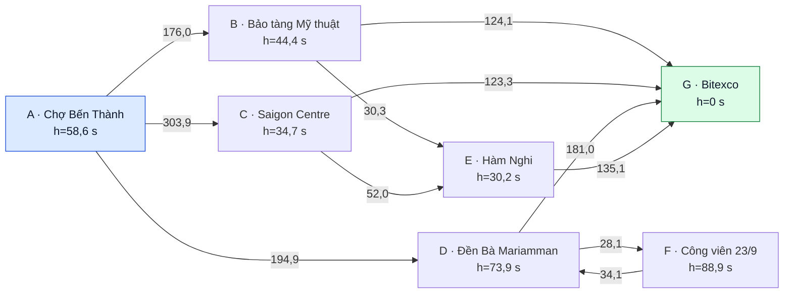

# e. Nguyên lý các thuật toán tìm đường hai điểm

Phần này trình bày cơ sở lý thuyết của chín thuật toán tìm đường hai điểm được
hiện thực trong hệ thống: Breadth-First Search (BFS), Depth-First Search (DFS),
Iterative Deepening Depth-First Search (IDDFS), Uniform-Cost Search (UCS),
Greedy Best-First Search, A*, Bidirectional Dijkstra, Iterative Deepening A*
(IDA*) và Beam Search. Mỗi thuật toán được phân tích theo cùng một cấu trúc gồm
nguyên lý hoạt động, cấu trúc dữ liệu, giả mã, độ phức tạp, ví dụ minh họa và
điều kiện về tính đầy đủ (*completeness*) cũng như tính tối ưu (*optimality*).

Phạm vi của phần này chỉ giới hạn ở truy vấn tìm đường giữa một điểm xuất phát
và một điểm đích. Bài toán tối ưu thứ tự ghé nhiều địa điểm được trình bày riêng
trong phần Multi-location Optimization.

## e.1. Phát biểu bài toán và ký hiệu

Mạng lưới đường bộ được mô hình hóa bằng đồ thị có hướng
\(G=(V,E)\), trong đó mỗi đỉnh \(v\in V\) biểu diễn một địa điểm hoặc nút giao
thông và mỗi cạnh có hướng \(e=(u,v)\in E\) biểu diễn khả năng di chuyển hợp lệ
từ \(u\) đến \(v\). Sự tồn tại của \((u,v)\) không kéo theo sự tồn tại của
\((v,u)\); vì vậy, mô hình bảo toàn ngữ nghĩa đường một chiều và chi phí bất đối
xứng của mạng đường đô thị.

Với điểm xuất phát \(s\), điểm đích \(t\) và hàm trọng số \(w\), một đường đi
hợp lệ được viết dưới dạng

\[
P=(s=v_0,v_1,\ldots,v_k=t),
\]

với \((v_i,v_{i+1})\in E\) cho mọi \(0\le i<k\). Chi phí của đường đi là

\[
C(P)=\sum_{i=0}^{k-1}w(v_i,v_{i+1}).
\]

Đối với các thuật toán tối ưu theo chi phí, mục tiêu là tìm

\[
P^*=\underset{P:s\leadsto t}{\arg\min}\;C(P),
\qquad C^*=C(P^*).
\]

Ba đại lượng được sử dụng trong các thuật toán tìm kiếm có thông tin là:

- \(g(n)\): chi phí thực đã tích lũy từ \(s\) đến đỉnh \(n\);
- \(h(n)\): cận dưới ước lượng chi phí còn lại từ \(n\) đến \(t\);
- \(f(n)=g(n)+h(n)\): ước lượng tổng chi phí của một lời giải đi qua \(n\).

Trong phân tích độ phức tạp, \(|V|\) và \(|E|\) lần lượt là số đỉnh và số cạnh;
\(b\) là hệ số phân nhánh; \(d\) là độ sâu của nghiệm nông nhất; \(k\) là độ
rộng Beam; và \(Q\) là số trạng thái chờ lớn nhất trong ngăn xếp tường minh.
Các cận nêu dưới đây mô tả công việc tìm kiếm; chi phí ghi và tuần tự hóa toàn
bộ diễn tiến trực quan có thể làm tăng thời gian và bộ nhớ thực tế.

### e.1.1. Hàm chi phí được tối ưu

Với cạnh \(e\), gọi \(\ell(e)\) là chiều dài tính bằng mét, \(v(e)\) là vận tốc
thông thoáng tính bằng m/s, và \(c(e,h)\in\{1,2,3,4,5\}\) là mức ùn tắc tại
khung giờ đại diện \(h\). Thời gian thông thoáng và hệ số ùn tắc lần lượt là

\[
t_{\mathrm{free}}(e)=\frac{\ell(e)}{v(e)},
\qquad
f_{\mathrm{cong}}(e,h)=1+1{,}5\frac{c(e,h)-1}{4}.
\]

Phần phạt rủi ro không âm được mô hình hóa bởi

\[
p(e)=60I_{\mathrm{ngập}}+90I_{\mathrm{thi\ công}}
     +30I_{\mathrm{đường\ hẹp}}+25I_{\mathrm{đèn\ tín\ hiệu}}.
\]

Ba chế độ tối ưu sử dụng các trọng số:

\[
\begin{aligned}
w_{\mathrm{distance}}(e)&=\ell(e) &&[\mathrm{m}],\\
w_{\mathrm{time}}(e,h)&=t_{\mathrm{free}}(e)f_{\mathrm{cong}}(e,h)
&&[\mathrm{s}],\\
w_{\mathrm{balanced}}(e,h)&=t_{\mathrm{free}}(e)f_{\mathrm{cong}}(e,h)+p(e)
&&[\mathrm{s}].
\end{aligned}
\]

Như vậy, chế độ `distance` tối ưu quãng đường; chế độ `time` tối ưu thời gian đã
điều chỉnh theo ùn tắc; và chế độ `balanced` đồng thời xét thời gian, ùn tắc và
các yếu tố rủi ro. Mọi trọng số đều dương trên bộ dữ liệu hiện tại. Đây là tiền
đề quan trọng cho các bảo đảm của UCS, A* và Bidirectional Dijkstra.

## e.2. Đồ thị minh họa dùng xuyên suốt

Để bảo đảm các thuật toán được so sánh trên cùng điều kiện, toàn bộ ví dụ trong
phần này sử dụng một tiểu đồ thị có hướng gồm bảy địa điểm tại trung tâm Thành
phố Hồ Chí Minh. Điểm xuất phát là Chợ Bến Thành (A), điểm đích là Bitexco (G),
chế độ chi phí là `balanced` và hồ sơ giao thông đại diện là 07:30. Đây không
phải dữ liệu giao thông trực tiếp tại thời điểm chạy.

| Ký hiệu | Địa điểm | \(h(n)\) đến G (giây) |
|---|---|---:|
| A | Chợ Bến Thành | 58,6 |
| B | Bảo tàng Mỹ thuật Thành phố Hồ Chí Minh | 44,4 |
| C | Saigon Centre | 34,7 |
| D | Đền Bà Mariamman | 73,9 |
| E | Điểm trung chuyển Hàm Nghi | 30,2 |
| F | Công viên 23/9 | 88,9 |
| G | Bitexco Financial Tower | 0,0 |

Sơ đồ sau lược giữ những cung quyết định trực tiếp đến các diễn tiến minh họa.
Danh sách kề đầy đủ được cung cấp ngay sau sơ đồ.



**Hình e.1.** Tiểu đồ thị minh họa rút gọn; nhãn cạnh là chi phí cân bằng tính
bằng giây. Mũi tên biểu diễn chiều di chuyển hợp lệ.

| Đỉnh | Các cạnh đi ra và chi phí cân bằng (giây) |
|---|---|
| A | B: 176,0; C: 303,9; D: 194,9 |
| B | A: 104,6; C: 223,2; D: 155,5; E: 30,3; G: 124,1 |
| C | A: 99,2; D: 122,8; E: 52,0; G: 123,3 |
| D | A: 100,3; B: 91,6; C: 230,0; F: 28,1; G: 181,0 |
| E | B: 30,3; G: 135,1 |
| F | D: 34,1 |
| G | A: 136,9; C: 227,2; D: 160,5; E: 89,7 |

Các cạnh B→C, B→G, C→E và G→A chỉ tồn tại theo một chiều trong tiểu đồ
thị. Nghiệm tối ưu theo chi phí cân bằng là

\[
A\rightarrow B\rightarrow G,
\qquad C^*=176{,}0+124{,}1=300{,}1\ \mathrm{s}.
\]

Các giá trị trình bày đã được làm tròn đến 0,1 giây; hệ thống sử dụng số thực
đầy đủ khi so sánh và ra quyết định.

## e.3. Hàm heuristic theo không gian địa lý

### e.3.1. Mục tiêu thiết kế

Một heuristic phù hợp cho bài toán phải đồng thời đáp ứng bốn yêu cầu:

1. sử dụng được trực tiếp với tọa độ vĩ độ–kinh độ của các đỉnh;
2. cùng đơn vị với hàm chi phí đang tối ưu;
3. không ước lượng vượt chi phí tối ưu còn lại;
4. vẫn hợp lệ khi đồ thị có đường một chiều, ùn tắc và phần phạt rủi ro.

Haversine được chọn vì nó đo độ dài cung tròn lớn giữa hai tọa độ trên bề mặt
Trái Đất. Với vĩ độ \(\varphi\), kinh độ \(\lambda\), bán kính Trái Đất
\(R=6.371.000\ \mathrm{m}\), đặt

\[
\begin{aligned}
\Delta\varphi &= \varphi_t-\varphi_n,\\
\Delta\lambda &= \lambda_t-\lambda_n,\\
a &= \sin^2\!\left(\frac{\Delta\varphi}{2}\right)
   +\cos\varphi_n\cos\varphi_t
    \sin^2\!\left(\frac{\Delta\lambda}{2}\right).
\end{aligned}
\]

Khoảng cách Haversine là

\[
d_H(n,t)=2R\arcsin(\sqrt{a}).
\]

Heuristic được chuyển đổi theo từng chế độ:

\[
h(n)=
\begin{cases}
d_H(n,t), & \text{nếu tối ưu khoảng cách},\\[4pt]
\dfrac{d_H(n,t)}{v_{\max}}, & \text{nếu tối ưu thời gian hoặc cân bằng},
\end{cases}
\]

trong đó \(v_{\max}=\max_{e\in E}v(e)\) được tính trên chính đồ thị hiệu lực
đang tìm kiếm. Trên hai đồ thị nền hiện tại, \(v_{\max}=45\ \mathrm{km/h}\);
trên tiểu đồ thị bảy đỉnh, giá trị lớn nhất là khoảng
\(43\ \mathrm{km/h}\). Việc tính lại \(v_{\max}\) theo đồ thị hiệu lực giúp
heuristic giữ đúng đơn vị và cận dưới khi phạm vi đồ thị thay đổi.

### e.3.2. Vì sao chọn Haversine thay cho các khoảng cách khác?

| Lựa chọn | Đánh giá đối với bài toán |
|---|---|
| Haversine | Là khoảng cách địa lý trực tiếp giữa hai tọa độ; không cần chiếu bản đồ; thỏa bất đẳng thức tam giác; tạo cận dưới tự nhiên cho chiều dài đường thực. |
| Euclidean trên vĩ độ–kinh độ thô | Trộn hai đại lượng góc như tọa độ phẳng, không cho kết quả theo mét và làm sai tỷ lệ kinh độ theo vĩ độ. Vì vậy không phù hợp nếu không có phép chiếu và phân tích sai số riêng. |
| Euclidean sau phép chiếu | Có thể sử dụng trên một vùng nhỏ nếu chọn hệ quy chiếu phù hợp và chứng minh sai số không phá cận dưới. Tuy nhiên, cách này thêm phụ thuộc vào phép chiếu trong khi Haversine hoạt động trực tiếp trên dữ liệu hiện có. |
| Manhattan | Phù hợp hơn với lưới trực giao có các trục chuyển động cố định. Mạng đường trung tâm Thành phố Hồ Chí Minh không phải lưới đều; khoảng cách \(L_1\) còn có thể lớn hơn khoảng cách địa lý, nên dùng trực tiếp có nguy cơ ước lượng vượt. |
| Khoảng cách đường bộ hoặc bảng đường ngắn nhất tiền xử lý | Có thể chặt hơn, nhưng đòi hỏi bộ nhớ và tiền xử lý đáng kể; tính hợp lệ còn phải được duy trì khi trọng số, khung giờ hoặc kịch bản giao thông thay đổi. |

Do đó, Haversine không được chọn vì giả định xe chạy theo đường thẳng, mà vì
nó cung cấp **cận dưới hình học** độc lập với hướng đường, ùn tắc và rủi ro.
Đường thẳng địa lý luôn là một mục tiêu lạc quan hơn hoặc bằng bất kỳ tuyến
đường bộ hợp lệ nào.

### e.3.3. Chứng minh tính nhất quán

Một heuristic là **nhất quán** (*consistent*) nếu \(h(t)=0\) và, với mọi cạnh
\((u,v)\),

\[
h(u)\le w(u,v)+h(v).
\]

Chứng minh dựa trên ba bổ đề.

**Bổ đề 1 — chiều dài đường không nhỏ hơn khoảng cách địa lý.** Với mọi cạnh
\(e=(u,v)\),

\[
\ell(e)\ge d_H(u,v).
\]

Thật vậy, \(d_H(u,v)\) là độ dài cung tròn lớn ngắn nhất nối hai tọa độ, trong
khi \(\ell(e)\) là chiều dài của một hành lang đường thực cụ thể nối chúng.

**Bổ đề 2 — bất đẳng thức tam giác.** Khoảng cách Haversine là một metric trên
mặt cầu, do đó

\[
d_H(u,t)\le d_H(u,v)+d_H(v,t).
\]

**Bổ đề 3 — cận dưới của trọng số thời gian.** Vì
\(v(e)\le v_{\max}\), \(f_{\mathrm{cong}}(e,h)\ge1\) và \(p(e)\ge0\), ta có

\[
\begin{aligned}
w_{\mathrm{balanced}}(e,h)
&\ge w_{\mathrm{time}}(e,h)
\ge t_{\mathrm{free}}(e)\\
&=\frac{\ell(e)}{v(e)}
\ge\frac{\ell(e)}{v_{\max}}
\ge\frac{d_H(u,v)}{v_{\max}}.
\end{aligned}
\]

**Trường hợp tối ưu khoảng cách.** Từ Bổ đề 1 và 2:

\[
\begin{aligned}
h(u)&=d_H(u,t)\\
&\le d_H(u,v)+d_H(v,t)\\
&\le \ell(u,v)+h(v)
=w_{\mathrm{distance}}(u,v)+h(v).
\end{aligned}
\]

**Trường hợp tối ưu thời gian hoặc cân bằng.** Chia bất đẳng thức tam giác cho
\(v_{\max}>0\), sau đó áp dụng Bổ đề 3:

\[
\begin{aligned}
h(u)&=\frac{d_H(u,t)}{v_{\max}}\\
&\le\frac{d_H(u,v)}{v_{\max}}
  +\frac{d_H(v,t)}{v_{\max}}\\
&\le w(u,v)+h(v).
\end{aligned}
\]

Ngoài ra, \(h(t)=d_H(t,t)=0\). Vì vậy, heuristic nhất quán trong cả ba chế
độ chi phí.

### e.3.4. Chứng minh tính chấp nhận được

Một heuristic là **chấp nhận được** (*admissible*) nếu

\[
0\le h(n)\le h^*(n)
\]

với mọi \(n\), trong đó \(h^*(n)\) là chi phí tối ưu thật từ \(n\) đến đích.
Xét một đường tối ưu
\(n=v_0\rightarrow v_1\rightarrow\cdots\rightarrow v_m=t\). Áp dụng tính
nhất quán liên tiếp trên từng cạnh:

\[
\begin{aligned}
h(v_0)&\le w(v_0,v_1)+h(v_1)\\
&\le w(v_0,v_1)+w(v_1,v_2)+h(v_2)\\
&\le\cdots\le\sum_{i=0}^{m-1}w(v_i,v_{i+1})+h(t)\\
&=h^*(v_0).
\end{aligned}
\]

Do đó, tính nhất quán kéo theo tính chấp nhận được. Nếu một đỉnh không thể đi
đến đích thì \(h^*(n)=+\infty\), nên bất đẳng thức vẫn đúng.

### e.3.5. Ý nghĩa đối với A*, Greedy và IDA*

- A* dùng cả \(g\) và \(h\). Tính nhất quán bảo đảm khi một đỉnh được lấy ra
  với \(f\) nhỏ nhất, chi phí \(g\) của nó đã tối ưu; vì vậy tập đóng an toàn
  và nghiệm trả về là tối ưu (Hart et al., 1968).
- Greedy dùng cùng \(h\) nhưng bỏ qua \(g\). Một heuristic chấp nhận được không
  thể biến Greedy thành thuật toán tối ưu vì quy tắc lựa chọn của Greedy không
  đánh giá tổng chi phí lời giải.
- IDA* dùng \(f=g+h\) làm ngưỡng cắt. Heuristic chấp nhận được bảo đảm các nhánh
  có khả năng chứa nghiệm tốt không bị loại bởi một cận dưới sai; cấu hình tăng
  ngưỡng theo \(\varepsilon\) tạo biên chất lượng cộng được thảo luận ở mục
  e.11.

### e.3.6. Ví dụ tính \(g\), \(h\) và \(f\)

Sau khi mở rộng A, ba ứng viên đầu tiên có các giá trị:

| Ứng viên | \(g(n)\) (s) | \(h(n)\) (s) | \(f(n)=g(n)+h(n)\) (s) |
|---|---:|---:|---:|
| B | 176,0 | 44,4 | 220,4 |
| C | 303,9 | 34,7 | 338,6 |
| D | 194,9 | 73,9 | 268,8 |

Greedy chọn C vì \(h(C)=34{,}7\) nhỏ nhất. Ngược lại, A* chọn B vì
\(f(B)=220{,}4\) nhỏ nhất. Từ B, A* tìm được E với
\(g(E)=206{,}3\), \(h(E)=30{,}2\), \(f(E)=236{,}5\), đồng thời đã biết một
đường đến G với \(g(G)=300{,}1\). Ví dụ này cho thấy vai trò khác nhau của
\(g\), \(h\) và \(f\): \(h\) tạo định hướng địa lý, còn \(g\) ngăn thuật
toán bỏ qua chi phí đã thực sự phát sinh.

### e.3.7. Điểm đáng chú ý của thiết kế heuristic

Haversine/vận tốc cực đại là một cận dưới kinh điển, không được tuyên bố là một
heuristic mới về mặt toán học. Đóng góp đáng chú ý của hệ thống nằm ở cách tích
hợp cận dưới này với bài toán giao thông cụ thể: heuristic được chuẩn hóa theo
đơn vị của từng mục tiêu, \(v_{\max}\) được lấy từ đúng đồ thị hiệu lực, phần
phạt luôn không âm, và chiều dài cạnh được bảo toàn sao cho không nhỏ hơn khoảng
cách Haversine sau bước làm tròn dữ liệu. Sự kết hợp giữa chứng minh lý thuyết
và các bất biến dữ liệu giúp bảo đảm của A* không chỉ đúng trên giấy mà còn phù
hợp với số học của mô hình thực thi.

## e.4. Breadth-First Search (BFS)

### e.4.1. Nguyên lý hoạt động

BFS mở rộng không gian trạng thái theo từng lớp độ sâu. Hàng đợi FIFO bảo đảm
mọi đỉnh cách \(s\) một cạnh được xét trước các đỉnh cách hai cạnh, rồi tiếp tục
tương tự. Thuật toán không đọc trọng số khi quyết định thứ tự mở rộng; mục tiêu
nội tại của nó là giảm số cạnh trên đường đi (Russell & Norvig, 2021).

**Cấu trúc dữ liệu:** hàng đợi FIFO, tập đã thăm và ánh xạ cha để dựng lại đường.

```text
BFS(s, t):
    queue ← [s]; visited ← {s}
    while queue không rỗng:
        u ← lấy phần tử đầu queue
        if u = t: return đường dựng từ parent
        for mỗi v kề u theo thứ tự ổn định:
            if v chưa được thăm:
                visited ← visited ∪ {v}
                parent[v] ← u
                đưa v vào cuối queue
    return không có đường
```

**Độ phức tạp:** thời gian \(O(|V|+|E|)\), vì mỗi đỉnh được mở rộng tối đa một
lần và mỗi cạnh được quét tối đa một lần; bộ nhớ \(O(|V|)\) cho hàng đợi, tập
đã thăm và ánh xạ cha.

### e.4.2. Ví dụ minh họa

| Bước | Đỉnh mở rộng | Biên sau khi mở rộng |
|---:|---|---|
| 1 | A | B, C, D |
| 2 | B | C, D, E, G |
| 3 | C | D, E, G |
| 4 | D | E, F, G |
| 5 | E | F, G |
| 6 | G | F |

BFS trả về A→B→G, gồm hai cạnh và có chi phí 300,1 giây. Việc tuyến này đồng
thời là tuyến tối ưu theo chi phí chỉ là kết quả của ví dụ cụ thể, không phải
bảo đảm tổng quát của BFS.

### e.4.3. Tính đầy đủ và tối ưu

**Đầy đủ:** có trên đồ thị hữu hạn vì tập đã thăm ngăn lặp vô hạn; nếu đích có
thể đạt được, BFS cuối cùng sẽ mở rộng lớp chứa đích.

**Tối ưu:** tối ưu theo số cạnh vì đích được gặp lần đầu ở độ sâu nhỏ nhất. BFS
chỉ tối ưu theo chi phí khi mọi cạnh có cùng trọng số. Trên mạng đường có chiều
dài, vận tốc và ùn tắc khác nhau, ít cạnh hơn không đồng nghĩa với chi phí thấp
hơn; do đó BFS không có bảo đảm tối ưu theo ba hàm chi phí của hệ thống.

## e.5. Depth-First Search (DFS)

### e.5.1. Nguyên lý hoạt động

DFS sử dụng ngăn xếp LIFO để đi sâu theo một nhánh trước khi quay lui. Thứ tự
kề ổn định làm cho kết quả có thể tái lập, nhưng đường tìm được vẫn phụ thuộc
mạnh vào thứ tự này.

**Cấu trúc dữ liệu:** ngăn xếp, tập đã thăm và ánh xạ cha.

```text
DFS(s, t):
    stack ← [s]
    while stack không rỗng:
        u ← lấy phần tử trên cùng
        if u đã được thăm: continue
        đánh dấu u đã thăm
        if u = t: return đường dựng từ parent
        đưa các đỉnh kề chưa thăm vào stack theo thứ tự đảo
    return không có đường
```

**Độ phức tạp:** thời gian \(O(|V|+|E|)\). Trong cách hiện thực bằng ngăn xếp
tường minh, nhiều bản ghi đang chờ có thể cùng tham chiếu một đỉnh trước khi
đỉnh đó được mở rộng; vì vậy cận bộ nhớ trường hợp xấu là \(O(|V|+|E|)\), thay
vì chỉ phụ thuộc vào độ sâu của cây tìm kiếm.

### e.5.2. Ví dụ minh họa

Với thứ tự kề đã cố định, DFS mở rộng A, B, E và G:

```text
A → B → E → G
```

Chi phí tuyến là
\(176{,}0+30{,}3+135{,}1=341{,}4\) giây, xấp xỉ 341,5 giây theo số thực đầy
đủ. Tuyến này cao hơn nghiệm tối ưu khoảng 41,4 giây mặc dù DFS chỉ mở rộng bốn
đỉnh.

### e.5.3. Tính đầy đủ và tối ưu

**Đầy đủ:** có trên đồ thị hữu hạn khi sử dụng tập đã thăm. Nếu không có cơ chế
đánh dấu, DFS có thể lặp vô hạn trên chu trình và không còn đầy đủ.

**Tối ưu:** không. DFS dừng tại đường đầu tiên chạm đích, trong khi thứ tự duyệt
không phản ánh số cạnh hoặc chi phí. Một nhánh được xét sớm có thể dài và đắt
hơn nhiều so với nhánh chưa được khám phá.

## e.6. Iterative Deepening Depth-First Search (IDDFS)

### e.6.1. Nguyên lý hoạt động

IDDFS lặp lại DFS giới hạn độ sâu với các ngưỡng
\(L=0,1,2,\ldots\). Mỗi vòng chỉ mở rộng trạng thái có độ sâu không vượt quá
\(L\). Cách tiếp cận này kết hợp thứ tự tìm nghiệm nông của BFS với tổ chức tìm
kiếm theo chiều sâu của DFS.

**Cấu trúc dữ liệu:** ngăn xếp giới hạn độ sâu, ánh xạ độ sâu tốt nhất và ánh
xạ cha của từng vòng. Hệ thống sử dụng giới hạn an toàn tối đa 100 cạnh.

```text
IDDFS(s, t, Lmax):
    for L từ 0 đến Lmax:
        result ← DepthLimitedDFS(s, t, L)
        if result tìm thấy: return result
        if result chứng minh không còn trạng thái sâu hơn: return không có đường
    return thất bại chưa kết luận do chạm giới hạn
```

**Độ phức tạp:** cận thường dùng là \(O(b^d)\) thời gian; các đỉnh gần gốc bị
mở rộng lại qua nhiều vòng. Cách hiện thực giữ ánh xạ theo đỉnh và một ngăn xếp
tường minh, nên bộ nhớ được mô tả bởi \(O(|V|+Q)\) trong mỗi vòng.

### e.6.2. Ví dụ minh họa

| Giới hạn độ sâu | Thứ tự mở rộng | Kết quả vòng |
|---:|---|---|
| 0 | A | Chưa đạt đích |
| 1 | A, B, C, D | Chưa đạt đích |
| 2 | A, B, E, G | Tìm thấy A→B→G |

Tổng cộng IDDFS thực hiện chín lượt mở rộng và trả tuyến A→B→G với chi phí
300,1 giây. Các lần mở rộng lặp của A và B minh họa chi phí thời gian đổi lấy
khả năng tìm theo độ sâu tăng dần.

### e.6.3. Tính đầy đủ và tối ưu

**Đầy đủ có điều kiện:** nếu một nghiệm tồn tại ở độ sâu không vượt quá giới
hạn 100, IDDFS cuối cùng sẽ chạy vòng đủ sâu để tìm thấy nó. Nếu chạm giới hạn
trong khi vẫn còn trạng thái sâu hơn, kết quả chỉ là *chưa kết luận*, không phải
chứng minh rằng không có đường.

**Tối ưu:** đường đầu tiên được tìm thấy có số cạnh nhỏ nhất trong phạm vi độ
sâu đã duyệt. Tuy nhiên, giống BFS, IDDFS không tối ưu chi phí trên đồ thị có
trọng số không đồng nhất.

## e.7. Uniform-Cost Search (UCS)

### e.7.1. Nguyên lý hoạt động

UCS luôn mở rộng đỉnh có chi phí tích lũy \(g(n)\) nhỏ nhất. Khi tìm thấy một
đường rẻ hơn đến một đỉnh đang chờ, thuật toán cập nhật \(g\) và cha của đỉnh
đó. Kiểm tra đích được thực hiện khi đích được lấy ra khỏi hàng đợi ưu tiên,
không phải ngay khi đích vừa được sinh ra. Về nguyên lý, UCS là cách diễn đạt
theo tìm kiếm trí tuệ nhân tạo của thuật toán đường đi ngắn nhất Dijkstra
(Dijkstra, 1959).

**Cấu trúc dữ liệu:** hàng đợi ưu tiên min-heap theo \(g\), bảng chi phí tốt
nhất, tập đóng và ánh xạ cha.

```text
UCS(s, t):
    g[s] ← 0; priority_queue ← [(0, s)]
    while priority_queue không rỗng:
        u ← đỉnh có g nhỏ nhất
        if bản ghi của u đã lỗi thời: continue
        if u = t: return đường dựng từ parent
        for mỗi cạnh (u, v):
            new_g ← g[u] + w(u, v)
            if new_g < g[v]:
                g[v] ← new_g; parent[v] ← u
                cập nhật v trong priority_queue
    return không có đường
```

**Độ phức tạp:** với min-heap, thời gian
\(O((|V|+|E|)\log |V|)\); cận bộ nhớ trường hợp xấu là
\(O(|V|+|E|)\) vì heap có thể chứa các bản ghi cũ chờ được loại bỏ
(Cormen et al., 2022).

### e.7.2. Ví dụ minh họa

| Bước | Mở rộng | Một số giá trị \(g\) đang chờ (giây) |
|---:|---|---|
| 1 | A | B=176,0; D=194,9; C=303,9 |
| 2 | B | D=194,9; E=206,3; G=300,1; C=303,9 |
| 3 | D | E=206,3; F=223,0; G=300,1; C=303,9 |
| 4 | E | F=223,0; G=300,1; C=303,9 |
| 5 | F | G=300,1; C=303,9 |
| 6 | G | Dừng |

Khi G được lấy ra, không có trạng thái chưa mở rộng nào có \(g<300{,}1\). UCS
trả A→B→G với chi phí tối ưu 300,1 giây.

### e.7.3. Tính đầy đủ và tối ưu

**Đầy đủ:** có trên đồ thị hữu hạn với trọng số cạnh dương. Nói rộng hơn, UCS
đầy đủ khi tồn tại một cận dương cho chi phí bước; điều kiện này ngăn thuật toán
mở rộng vô hạn nhiều đường có chi phí vẫn thấp hơn nghiệm.

**Tối ưu:** có với trọng số không âm. Khi đỉnh \(u\) có \(g\) nhỏ nhất được lấy
ra, mọi đường chưa xét đến \(u\) phải đi qua một trạng thái có chi phí không nhỏ
hơn \(g(u)\), nên không thể tạo đường rẻ hơn. Do đó, khi \(t\) được lấy ra,
\(g(t)=C^*\).

## e.8. Greedy Best-First Search

### e.8.1. Nguyên lý hoạt động

Greedy Best-First Search chọn đỉnh có \(h(n)\) nhỏ nhất, tức đỉnh có vẻ gần
đích nhất theo ước lượng địa lý. Thuật toán có khả năng hướng nhanh về đích,
nhưng không đưa chi phí đã đi \(g(n)\) vào tiêu chí lựa chọn.

**Cấu trúc dữ liệu:** hàng đợi ưu tiên min-heap theo \(h\), tập mở, tập đóng và
ánh xạ cha.

```text
Greedy(s, t):
    priority_queue ← [(h(s), s)]
    while priority_queue không rỗng:
        u ← đỉnh có h nhỏ nhất
        if u = t: return đường dựng từ parent
        for mỗi v kề u chưa được xét:
            parent[v] ← u
            đưa v vào priority_queue theo h(v)
    return không có đường
```

**Độ phức tạp:** trường hợp xấu cần quét toàn bộ đồ thị, với thời gian
\(O((|V|+|E|)\log |V|)\) và bộ nhớ \(O(|V|)\). Chất lượng heuristic có thể
giảm đáng kể số đỉnh mở rộng trong trường hợp thuận lợi nhưng không thay đổi
cận xấu nhất.

### e.8.2. Ví dụ minh họa

| Bước | Mở rộng | Biên và giá trị \(h\) (giây) |
|---:|---|---|
| 1 | A | C=34,7; B=44,4; D=73,9 |
| 2 | C | G=0,0; E=30,2; B=44,4; D=73,9 |
| 3 | G | Dừng |

Greedy trả A→C→G với chi phí
\(303{,}9+123{,}3=427{,}2\) giây, xấp xỉ 427,3 giây theo số thực đầy đủ.
Tuyến này cao hơn nghiệm tối ưu khoảng 42,4%, dù chỉ cần mở rộng ba đỉnh.

### e.8.3. Tính đầy đủ và tối ưu

**Đầy đủ:** có trên đồ thị hữu hạn với cách đánh dấu đã xét đang sử dụng, vì
nếu chưa gặp đích, thuật toán cuối cùng sẽ lấy hết các đỉnh có thể đạt được ra
khỏi hàng đợi. Kết luận này không áp dụng cho không gian trạng thái vô hạn.

**Tối ưu:** không. Heuristic chấp nhận được chỉ là cận dưới của phần chi phí còn
lại; Greedy bỏ qua \(g\), nên có thể ưu tiên một trạng thái trông gần đích dù
đường đã đi hoặc cạnh kế tiếp rất đắt. Ví dụ A→C→G là một phản chứng cụ thể.

## e.9. A* Search

### e.9.1. Nguyên lý hoạt động

A* mở rộng đỉnh có \(f(n)=g(n)+h(n)\) nhỏ nhất. Thành phần \(g\) phản ánh chi
phí đã biết, còn \(h\) định hướng tìm kiếm về đích. Khi hai ứng viên có cùng
\(f\), ứng viên có \(h\) nhỏ hơn được ưu tiên; quy tắc phá hòa này chỉ thay đổi
thứ tự mở rộng, không thay đổi bảo đảm tối ưu.

**Cấu trúc dữ liệu:** hàng đợi ưu tiên theo bộ \((f,h)\), bảng \(g\) tốt nhất,
tập đóng và ánh xạ cha.

```text
AStar(s, t):
    g[s] ← 0; priority_queue ← [(h(s), h(s), s)]
    while priority_queue không rỗng:
        u ← đỉnh có (f, h) nhỏ nhất
        if bản ghi của u đã lỗi thời: continue
        if u = t: return đường dựng từ parent
        for mỗi cạnh (u, v):
            new_g ← g[u] + w(u, v)
            if new_g < g[v]:
                g[v] ← new_g; parent[v] ← u
                f[v] ← g[v] + h(v)
                cập nhật v trong priority_queue
    return không có đường
```

**Độ phức tạp:** trường hợp xấu
\(O((|V|+|E|)\log |V|)\) thời gian và
\(O(|V|+|E|)\) bộ nhớ đối với cách hiện thực heap có loại bỏ bản ghi cũ. Trong
thực tế, một heuristic giàu thông tin có thể giúp A* mở rộng ít đỉnh hơn UCS;
tuy nhiên, cận xấu nhất vẫn có thể tương đương UCS.

### e.9.2. Ví dụ minh họa

| Bước | Mở rộng | Lý do lựa chọn |
|---:|---|---|
| 1 | A | Trạng thái xuất phát, \(f=58{,}6\) |
| 2 | B | \(f(B)=220{,}4\) nhỏ hơn \(f(D)=268{,}8\) và \(f(C)=338{,}6\) |
| 3 | E | Sau B, \(f(E)=236{,}5\) là nhỏ nhất |
| 4 | D | \(f(D)=268{,}8\) vẫn nhỏ hơn \(f(G)=300{,}1\) |
| 5 | G | \(f(G)=g(G)=300{,}1\); dừng với nghiệm tối ưu |

A* trả A→B→G, cùng chi phí với UCS nhưng mở rộng năm thay vì sáu đỉnh trong ví
dụ này.

### e.9.3. Tính đầy đủ và tối ưu

**Đầy đủ:** có trên đồ thị hữu hạn với trọng số dương. Nếu nghiệm tồn tại, số
trạng thái có \(f\) thấp hơn chi phí nghiệm là hữu hạn và A* cuối cùng sẽ lấy
đích ra khỏi hàng đợi.

**Tối ưu:** có trong hệ thống vì heuristic đã được chứng minh nhất quán và chấp
nhận được. Khi đích được lấy ra, \(h(t)=0\), nên \(f(t)=g(t)\). Nếu tồn tại một
đường rẻ hơn chưa hoàn thành, trên đường đó phải có một trạng thái biên
\(n\) với \(f(n)\le C^*<g(t)\); trạng thái này lẽ ra phải được mở rộng trước
đích, tạo mâu thuẫn. Do đó \(g(t)=C^*\) (Hart et al., 1968).
Kết luận này cũng phù hợp với phân tích tổng quát về điều kiện tối ưu của các
chiến lược best-first (Dechter & Pearl, 1985).

## e.10. Bidirectional Dijkstra

### e.10.1. Nguyên lý hoạt động

Bidirectional Dijkstra chạy hai quá trình tìm kiếm theo chi phí:

- tìm kiếm thuận từ \(s\) trên các cạnh gốc;
- tìm kiếm ngược từ \(t\) trên danh sách kề đảo.

Danh sách kề đảo chỉ là công cụ toán học để tìm các đỉnh có thể đi đến đích;
nó không cho phép phương tiện đi ngược chiều. Gọi \(g_F(n)\) là chi phí từ
\(s\) đến \(n\), \(g_B(n)\) là chi phí từ \(n\) đến \(t\), và \(\mu\) là
chi phí nhỏ nhất của một đường hoàn chỉnh đã nối được hai phía. Thuật toán dừng
khi

\[
\min Q_F+\min Q_B\ge\mu.
\]

**Cấu trúc dữ liệu:** hai min-heap, hai bảng khoảng cách, hai tập đóng và hai
hệ thống liên kết để ghép đường tại điểm gặp.

```text
BidirectionalDijkstra(s, t):
    khởi tạo tìm kiếm thuận từ s và tìm kiếm ngược từ t
    mu ← +∞; meeting ← null
    while ít nhất một phía còn trạng thái hiệu lực:
        if min(QF) + min(QB) ≥ mu: break
        mở rộng phía có khóa nhỏ hơn
        nới lỏng các cạnh theo đúng hướng của phía đó
        nếu một đỉnh đã được biết từ cả hai phía:
            cập nhật mu và meeting
    if meeting tồn tại: ghép hai nửa đường và return
    return không có đường
```

**Độ phức tạp:** cận xấu nhất vẫn là
\(O((|V|+|E|)\log |V|)\) thời gian và \(O(|V|+|E|)\) bộ nhớ. Tìm kiếm hai
chiều có thể giảm vùng tìm kiếm trên nhiều trường hợp, nhưng không có bảo đảm
luôn nhanh hơn UCS trong trường hợp xấu (Pohl, 1971).

### e.10.2. Ví dụ minh họa

1. Phía thuận mở rộng A và ghi nhận B=176,0; D=194,9; C=303,9.
2. Phía ngược mở rộng G. Từ các cạnh đi vào G, phía ngược thu được
   C=123,3; B=124,1; E=135,1; D=181,0.
3. Hai phía đã biết B nên có một đường hoàn chỉnh với
   \(\mu=176{,}0+124{,}1=300{,}1\).
4. Phía ngược mở rộng C vì 123,3 là khóa nhỏ nhất.
5. Khi đó \(\min Q_F=176{,}0\), \(\min Q_B=124{,}1\), và
   \(176{,}0+124{,}1\ge300{,}1\); thuật toán dừng và ghép A→B→G.

Điểm gặp đầu tiên không tự động tạo bảo đảm tối ưu; chính cận
\(\min Q_F+\min Q_B\ge\mu\) mới chứng minh rằng không còn đường chưa xét nào
rẻ hơn.

### e.10.3. Tính đầy đủ và tối ưu

**Đầy đủ:** có trên đồ thị hữu hạn với trọng số dương, với điều kiện phía ngược
dùng đúng danh sách kề đảo. Nếu dùng cạnh thuận từ đích trên đồ thị có hướng,
thuật toán có thể bỏ qua các đường hợp lệ đi vào đích.

**Tối ưu:** có với trọng số không âm và luật dừng nêu trên. Mọi đường chưa hoàn
thiện phải có chi phí ít nhất bằng tổng hai khóa nhỏ nhất. Khi tổng này không
nhỏ hơn \(\mu\), không đường chưa xét nào có thể cải thiện lời giải hiện tại;
do đó \(\mu=C^*\).

## e.11. Iterative Deepening A* (IDA*)

### e.11.1. Nguyên lý hoạt động

IDA* thực hiện nhiều vòng tìm kiếm theo chiều sâu, nhưng chỉ mở rộng trạng thái
có \(f(n)=g(n)+h(n)\) không vượt ngưỡng \(T\). Ngưỡng đầu tiên là \(h(s)\).
Sau mỗi vòng, ngưỡng được cập nhật bằng

\[
T_{i+1}=\max\left(
\min_{f(n)>T_i}f(n),\;T_i+\varepsilon
\right).
\]

Trong hệ thống, \(\varepsilon=5\) đơn vị chi phí theo mặc định: 5 mét với
`distance`, và 5 giây với `time` hoặc `balanced`. Số vòng được giới hạn ở 1.000
để tránh thời gian chạy không kiểm soát.

**Cấu trúc dữ liệu:** ngăn xếp DFS tường minh, bảng \(g\) tốt nhất trong từng
vòng, bảng heuristic và ánh xạ cha.

```text
IDAStar(s, t, epsilon):
    threshold ← h(s)
    lặp trong giới hạn số vòng:
        chạy DFS từ s
        bỏ qua trạng thái có g + h > threshold
        if gặp t: return đường đi
        min_excess ← f nhỏ nhất đã vượt threshold
        if không có min_excess: return chứng minh không có đường
        threshold ← max(min_excess, threshold + epsilon)
    return thất bại chưa kết luận do chạm giới hạn vòng
```

**Độ phức tạp:** cận xấu thường được mô tả bởi \(O(b^d)\) thời gian, nhưng số
lần mở rộng có thể lớn do các vòng lặp lại từ gốc. Cách hiện thực hiện tại không
phải IDA* đệ quy chỉ giữ một đường duy nhất; nó duy trì các ánh xạ theo đỉnh và
ngăn xếp trạng thái chờ, nên bộ nhớ phù hợp hơn với cận \(O(|V|+Q)\).

### e.11.2. Ví dụ minh họa

| Vòng | Ngưỡng \(T\) (s) | Các diễn tiến chính |
|---:|---:|---|
| 1 | 58,6 | Chỉ A nằm trong ngưỡng; B có \(f=220{,}4\) bị hoãn |
| 2 | 220,4 | Mở rộng A và B; E có \(f=236{,}5\) bị hoãn |
| 3 | 236,5 | Mở rộng đến E; ngưỡng chưa đủ cho các ứng viên tiếp theo |
| 4 | 268,9 | Mở rộng thêm D; G với \(f=300{,}1\) chưa được nhận |
| 5 | 300,1 | G nằm trong ngưỡng; trả A→B→G |

IDA* thực hiện tổng cộng 14 lượt mở rộng, nhiều hơn A* và UCS do phải duyệt lại
các trạng thái ở mỗi vòng.

### e.11.3. Tính đầy đủ và chất lượng nghiệm

**Đầy đủ có điều kiện:** nếu có đủ số vòng và chi phí bước dương, ngưỡng tiếp
tục tăng cho đến khi bao phủ một lời giải. Tuy nhiên, khi chạm giới hạn 1.000
vòng trước thời điểm đó, kết quả là thất bại chưa kết luận; không được diễn giải
như chứng minh không có đường.

**Tối ưu/chất lượng nghiệm:** với \(\varepsilon=0\) và heuristic chấp nhận được,
IDA* chuẩn có thể trả nghiệm tối ưu (Korf, 1985). Cấu hình của hệ thống dùng
\(\varepsilon>0\), nên tuyên bố chính xác là

\[
C_{\mathrm{IDA*}}\le C^*+\varepsilon,
\]

nếu tìm thấy nghiệm trước giới hạn vòng. Lý do là trước vòng tìm thấy đầu tiên,
ngưỡng vẫn nhỏ hơn \(C^*\); bước tăng ít nhất \(\varepsilon\) có thể vượt
\(C^*\), nhưng không vượt quá \(C^*+\varepsilon\). Khi gặp đích,
\(h(t)=0\), nên chi phí nghiệm không vượt ngưỡng hiện tại. Đây là bảo đảm sai
số cộng, không phải bảo đảm tối ưu chính xác.

## e.12. Beam Search

### e.12.1. Nguyên lý hoạt động

Beam Search duyệt theo lớp như BFS, nhưng sau khi tạo tập ứng viên cho lớp kế
tiếp, thuật toán chỉ giữ \(k\) ứng viên có \(f=g+h\) nhỏ nhất. Giá trị mặc định
là \(k=5\) trên đồ thị minh họa và \(k=50\) trên đồ thị thực nghiệm. Tham số
\(k\) điều khiển trực tiếp sự đánh đổi giữa tài nguyên và khả năng giữ lại nhánh
tốt.

**Cấu trúc dữ liệu:** danh sách lớp hiện tại, tập ứng viên lớp kế tiếp, bảng
\(g\), tập đã thăm và ánh xạ cha.

```text
BeamSearch(s, t, k):
    current_layer ← [s]
    while current_layer không rỗng:
        pool ← rỗng
        for mỗi u trong current_layer:
            if u = t: return đường dựng từ parent
            sinh và cập nhật các ứng viên kề của u trong pool
        sắp pool theo f = g + h
        current_layer ← k ứng viên tốt nhất
    return không tìm thấy đường
```

**Độ phức tạp:** nếu mỗi lớp có tối đa \(k\) trạng thái và mỗi trạng thái sinh
trung bình \(b\) ứng viên, thời gian xấp xỉ
\(O(dkb\log(kb))\). Bộ nhớ là \(O(|V|+kb)\) vì, ngoài lớp được giữ lại, cách
hiện thực còn duy trì tập đã thăm, chi phí và liên kết cha.

### e.12.2. Ví dụ minh họa

Với \(k=5\), thuật toán mở rộng theo thứ tự A, B, D, C, E và G. Sau mỗi lớp,
chỉ tối đa năm ứng viên tốt nhất theo \(f\) được chuyển sang lớp kế tiếp. Trong
ví dụ nhỏ, nhánh A→B→G được giữ lại và Beam Search trả chi phí 300,1 giây.

Để thấy giới hạn của phương pháp, giả sử tại một lớp có sáu ứng viên và đỉnh
duy nhất dẫn đến G đứng thứ sáu theo \(f\). Với \(k=5\), đỉnh đó bị loại vĩnh
viễn; thuật toán có thể kết thúc mà không tìm thấy đường dù đường hợp lệ tồn
tại.

### e.12.3. Tính đầy đủ và tối ưu

**Đầy đủ:** không. Phép cắt top-\(k\) có thể loại mọi nhánh dẫn đến đích. Tăng
\(k\) làm giảm rủi ro nhưng không tạo bảo đảm tổng quát nếu \(k\) vẫn hữu hạn
so với toàn bộ biên.

**Tối ưu:** không. Ngay cả khi tìm được đường, một nhánh có chi phí tối ưu có
thể đã bị loại ở lớp trước vì giá trị \(f\) tạm thời không nằm trong top-\(k\).
Heuristic chấp nhận được không khắc phục được mất mát thông tin do pruning.

## e.13. Thảo luận tổng hợp về tính đầy đủ và tối ưu

Tính đầy đủ trả lời câu hỏi “nếu một đường hợp lệ tồn tại, thuật toán có bảo đảm
tìm thấy hay không?”. Tính tối ưu trả lời câu hỏi khác: “đường được tìm thấy có
bảo đảm đạt mục tiêu chi phí nhỏ nhất hay không?”. Hai thuộc tính này phải được
đánh giá độc lập và luôn kèm điều kiện áp dụng.

| Thuật toán | Tính đầy đủ | Tính tối ưu/chất lượng | Cơ sở hoặc điều kiện quyết định |
|---|---|---|---|
| BFS | Có trên đồ thị hữu hạn | Tối ưu số cạnh; không tối ưu chi phí có trọng số | FIFO mở rộng theo lớp độ sâu |
| DFS | Có trên đồ thị hữu hạn khi có tập đã thăm | Không | Dừng tại nhánh đầu tiên chạm đích |
| IDDFS | Có nếu độ sâu nghiệm không vượt giới hạn; có thể chưa kết luận khi chạm cap | Tối ưu số cạnh trong phạm vi; không tối ưu chi phí | Tăng dần giới hạn độ sâu |
| UCS | Có với chi phí bước dương | Tối ưu chính xác | Luôn mở rộng \(g\) nhỏ nhất; trọng số không âm |
| Greedy Best-First | Có trên đồ thị hữu hạn với tập đã thăm | Không | Chỉ sử dụng \(h\), bỏ qua \(g\) |
| A* | Có với đồ thị hữu hạn và trọng số dương | Tối ưu chính xác | \(h\) admissible và consistent; ưu tiên \(g+h\) |
| Bidirectional Dijkstra | Có với trọng số dương và chiều ngược chính xác | Tối ưu chính xác | Hai tìm kiếm min-\(g\), dừng theo cận \(\mu\) |
| IDA* | Có nếu đủ số vòng; chưa kết luận khi chạm cap | Trong \(C^*+\varepsilon\) khi tìm thấy trước cap | Heuristic admissible và ngưỡng \(f\) tăng theo \(\varepsilon\) |
| Beam Search | Không | Không | Pruning top-\(k\) có thể loại nhánh cần thiết |

Ví dụ chung cũng cho thấy “mở rộng ít đỉnh” không đồng nghĩa với “tìm được
tuyến tốt nhất”. Greedy chỉ mở rộng ba đỉnh nhưng trả tuyến đắt nhất; A*, UCS và
Bidirectional Dijkstra có bảo đảm tối ưu nhờ quy tắc chọn trạng thái và các tiền
đề toán học tương ứng. IDA* giảm nhu cầu giữ một biên lớn nhưng đánh đổi bằng
việc mở rộng lặp, còn Beam Search kiểm soát tài nguyên bằng cách từ bỏ cả tính
đầy đủ lẫn tối ưu.

## e.14. Tổng hợp ví dụ trên đồ thị bảy đỉnh

| Thuật toán | Thứ tự mở rộng rút gọn | Tuyến trả về | Chi phí (s) | Số lượt mở rộng | Bảo đảm trên lần chạy |
|---|---|---|---:|---:|---|
| BFS | A, B, C, D, E, G | A→B→G | 300,1 | 6 | Ít cạnh nhất |
| DFS | A, B, E, G | A→B→E→G | 341,5 | 4 | Không tối ưu |
| IDDFS | A; A,B,C,D; A,B,E,G | A→B→G | 300,1 | 9 | Ít cạnh nhất trong giới hạn |
| UCS | A, B, D, E, F, G | A→B→G | 300,1 | 6 | Tối ưu chính xác |
| Greedy Best-First | A, C, G | A→C→G | 427,3 | 3 | Không tối ưu |
| A* | A, B, E, D, G | A→B→G | 300,1 | 5 | Tối ưu chính xác |
| Bidirectional Dijkstra | A thuận; G, C ngược | A→B→G | 300,1 | 3 | Tối ưu chính xác |
| IDA* | Năm vòng ngưỡng | A→B→G | 300,1 | 14 | Trong \(C^*+5\) giây |
| Beam Search (\(k=5\)) | A, B, D, C, E, G | A→B→G | 300,1 | 6 | Không tối ưu |

Kết quả của một ví dụ không thay thế chứng minh tổng quát. Chẳng hạn, BFS và
Beam Search cùng tìm được nghiệm tối ưu ở đây nhưng vẫn không có bảo đảm tối ưu
trên một đồ thị có trọng số bất kỳ. Ngược lại, các kết luận về UCS, A* và
Bidirectional Dijkstra dựa trên điều kiện trọng số và lập luận lý thuyết, không
dựa vào việc chúng tình cờ cho cùng một tuyến trong ví dụ.

## Tài liệu tham khảo

Cormen, T. H., Leiserson, C. E., Rivest, R. L., & Stein, C. (2022).
*Introduction to algorithms* (4th ed.). MIT Press.

Dechter, R., & Pearl, J. (1985). Generalized best-first search strategies and
the optimality of A*. *Journal of the ACM, 32*(3), 505–536.
https://doi.org/10.1145/3828.3830

Dijkstra, E. W. (1959). A note on two problems in connexion with graphs.
*Numerische Mathematik, 1*, 269–271. https://doi.org/10.1007/BF01386390

Hart, P. E., Nilsson, N. J., & Raphael, B. (1968). A formal basis for the
heuristic determination of minimum cost paths. *IEEE Transactions on Systems
Science and Cybernetics, 4*(2), 100–107.
https://doi.org/10.1109/TSSC.1968.300136

Korf, R. E. (1985). Depth-first iterative-deepening: An optimal admissible tree
search. *Artificial Intelligence, 27*(1), 97–109.
https://doi.org/10.1016/0004-3702(85)90084-0

Pohl, I. (1971). Bi-directional search. In B. Meltzer & D. Michie (Eds.),
*Machine intelligence 6* (pp. 127–140). Edinburgh University Press.

Russell, S. J., & Norvig, P. (2021). *Artificial intelligence: A modern
approach* (4th ed.). Pearson.
