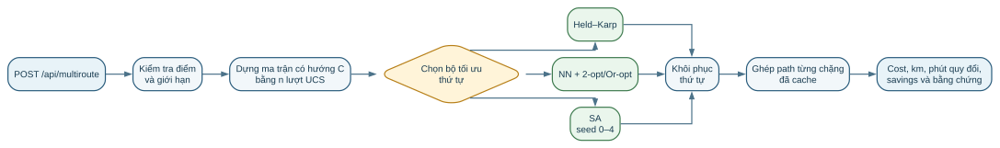
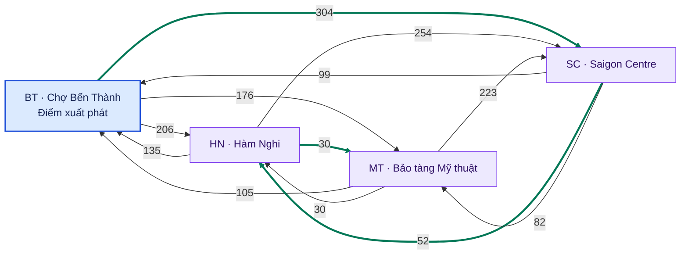

# h. Tối ưu hóa tuyến đường đa điểm bằng ba thuật toán ATSP

Khi một nhân viên giao hàng phải phục vụ nhiều địa điểm trong cùng một chuyến,
bài toán không còn dừng ở việc tìm đường giữa một cặp điểm. Hệ thống phải giải
hai tầng tối ưu hóa liên kết: trước hết tìm đường có chi phí nhỏ nhất cho từng
cặp địa điểm có thứ tự, sau đó lựa chọn thứ tự ghé làm nhỏ nhất tổng chi phí của
toàn hành trình. Do mạng đường TP.HCM có nhiều đoạn một chiều và trọng số phụ
thuộc hướng di chuyển, chi phí từ A đến B nói chung khác chi phí từ B đến A.
Bài toán thứ tự ghé vì vậy được mô hình hóa dưới dạng **bài toán người bán hàng
bất đối xứng** (*Asymmetric Traveling Salesman Problem* — ATSP).

Đóng góp kỹ thuật nổi bật của phương án là bảo toàn tính bất đối xứng xuyên suốt
chuỗi xử lý. Mỗi phần tử ngoài đường chéo của ma trận chi phí không được ước
lượng bằng khoảng cách đường thẳng, mà được tính từ đường đi tối ưu trên đồ thị
có hướng theo cùng khung giờ và hàm mục tiêu. Thứ tự do bộ giải ATSP tạo ra sau
đó được khôi phục thành các chặng đường thực trên mạng. Nhờ vậy, hệ thống tối
ưu đồng thời lựa chọn đường đi và thứ tự phục vụ, đồng thời vẫn phân biệt minh
bạch giữa nghiệm được chứng minh tối ưu và nghiệm heuristic.

Phương án được lựa chọn là một bộ ba phương pháp có vai trò bổ sung:
**Held–Karp** cung cấp nghiệm chính xác và chuẩn đối chứng cho bài toán nhỏ;
**Nearest Neighbor kết hợp 2-opt/Or-opt** cung cấp nghiệm xác định với thời gian
phản hồi thấp; **Simulated Annealing** mở rộng phạm vi khám phá bằng khả năng
tạm chấp nhận bước làm tăng chi phí. Sự kết hợp này cho phép đánh giá trực tiếp
sự đánh đổi giữa chứng chỉ tối ưu, chất lượng nghiệm và chi phí tính toán trên
cùng một đầu vào.

Trong Thí nghiệm 7, hệ thống xử lý một điểm xuất phát và chín điểm giao bằng hàm
mục tiêu `balanced` tại khung giờ 07:30, với hành trình hở. Held–Karp giảm chi
phí từ 4.320,1 xuống 2.494,9 giây quy đổi; NN + 2-opt/Or-opt đạt 2.534,2 giây;
nghiệm tốt nhất trong năm lần chạy SA đạt 2.494,9 giây. Đây là các kết quả quan
sát trên một cấu hình thí nghiệm cụ thể; chúng không tạo ra bảo đảm chất lượng
tổng quát cho hai phương pháp heuristic.

## h.1. Mô tả bài toán định tuyến đa điểm

### h.1.1. Đồ thị đường phố và ma trận chi phí bất đối xứng

Đồ thị đường phố được ký hiệu là $G=(V,E)$, trong đó $V$ là tập nút giao/địa điểm và $E$ là tập đoạn đường có hướng. Tập điểm cần ghé là

$$
P=\{p_0,p_1,\ldots,p_{n-1}\}\subseteq V,
$$

với $p_0$ là điểm xuất phát cố định. Với mỗi cặp có thứ tự $(p_i,p_j)$, hệ thống chạy Uniform Cost Search (UCS) theo đúng hàm mục tiêu và khung giờ đã chọn để lấy đường đi chi phí thấp nhất. Chi phí của đường đó được ký hiệu là $c_{ij}$. Các giá trị tạo thành ma trận

$$
C=[c_{ij}]_{n\times n}.
$$

Do đường một chiều, cấu trúc kết nối có hướng và trọng số theo chiều di chuyển, nhìn chung $c_{ij}\ne c_{ji}$. Vì vậy, mọi bộ giải phải đọc đúng cạnh có hướng; không được thay $c_{ij}$ bằng $c_{ji}$, đối xứng hóa ma trận hoặc dùng công thức chênh lệch chi phí chỉ đúng cho TSP đối xứng.

Hành trình mặc định là **lộ trình hở (hành trình mở)**, nghĩa là nhân viên giao hàng kết thúc tại điểm giao cuối:

$$
\min_{\pi}\ C_{\mathrm{open}}(\pi)
=\min_{\pi}\sum_{k=0}^{n-2}c_{\pi_k,\pi_{k+1}},
\qquad \pi_0=p_0,
$$

trong đó $\pi$ là một hoán vị của $P$. Khi bật `return_to_start=true`, hàm mục tiêu trở thành chu trình đóng:

$$
C_{\mathrm{closed}}(\pi)
=\sum_{k=0}^{n-2}c_{\pi_k,\pi_{k+1}}
+c_{\pi_{n-1},p_0}.
$$

Trên giao diện, công tắc **Quay về điểm xuất phát sau điểm giao cuối** mặc định ở trạng thái tắt. Khi tắt, UI gửi `return_to_start=false` để tạo lộ trình hở; khi người dùng bật công tắc, UI gửi `return_to_start=true` và hệ thống thêm đúng một chặng từ điểm giao cuối về điểm xuất phát. Như vậy, `false` chỉ là **giá trị mặc định**, không phải giá trị UI luôn gửi. Trong phản hồi của hành trình đóng, `order` vẫn không lặp lại $p_0$ ở cuối; chặng quay về được biểu diễn riêng trong `legs` [P2], [P6].

### h.1.2. Hàm chi phí và đơn vị

Với đoạn đường $e$ và khung giờ $h$, dự án định nghĩa các thành phần chi phí như sau [P2]:

$$
t_{\mathrm{free}}(e)
=\frac{\mathrm{length\_m}(e)}
       {\mathrm{free\_speed\_kmh}(e)/3.6}
\quad\text{(giây)},
$$

$$
f_{\mathrm{cong}}(e,h)
=1+1.5\frac{\mathrm{congestion}(e,h)-1}{4},
$$

$$
\mathrm{penalty}(e)
=60\,\mathrm{flood}
+90\,\mathrm{construction}
+30\,\mathrm{narrow\_alley}
+25\,\mathrm{traffic\_light}
\quad\text{(giây)}.
$$

Các cờ rủi ro trong công thức khoản phạt nhận giá trị 0 hoặc 1. Trọng số cạnh theo ba chế độ được trình bày trong Bảng h.1.

*Bảng h.1. Hàm trọng số và đơn vị của ba chế độ chi phí.*

| `mode` | Trọng số cạnh | Đơn vị của `total_cost` |
|---|---|---|
| `distance` | $\mathrm{length\_m}$ | mét |
| `time` | $t_{\mathrm{free}}f_{\mathrm{cong}}$ | giây |
| `balanced` | $t_{\mathrm{free}}f_{\mathrm{cong}}+\mathrm{penalty}$ | giây quy đổi |

Hàm mục tiêu `balanced` cộng thời gian điều chỉnh ùn tắc với khoản phạt rủi ro đã quy về giây. Vì vậy, số phút suy ra từ `balanced` chỉ là **phút chi phí quy đổi**, không phải thời gian đến dự kiến (ETA) được đo ngoài thực địa. Theo hợp đồng hiện hành, `total_time_s` luôn là tổng trọng số `balanced` trên đường đi, kể cả khi người dùng chọn `distance` hoặc `time`; còn `total_cost` mới mang đơn vị của hàm mục tiêu đang chạy [P2].

### h.1.3. Đầu vào, đầu ra và điều kiện hợp lệ

*Bảng h.2. Hợp đồng đầu vào, đầu ra và các điều kiện hợp lệ của bài toán đa điểm.*

| Thành phần | Hợp đồng hiện hành |
|---|---|
| Đầu vào chính | `start`; danh sách `stops` khác nhau và khác `start`; `method`; `mode`; `time_slot`; `graph`; `return_to_start` |
| Ba phương pháp | `held_karp`, `nn_2opt`, `sa` |
| Số điểm | Tối đa 16 điểm tính cả `start`; Held–Karp tối đa 15 điểm |
| Đầu ra thành công | Thứ tự `order`, từng chặng `legs`, tổng chi phí/khoảng cách, tổng theo thứ tự nhập, phần trăm tiết kiệm, thống kê bộ giải và cờ bảo đảm tối ưu |
| Không tới được | Nếu bất kỳ cặp có thứ tự nào trong tập điểm được chọn không tới được, hệ thống trả `found=false`, không tạo hành trình giả |
| Dạng hành trình trên UI | Hỗ trợ cả lộ trình hở và lộ trình quay về điểm xuất phát; mặc định là hở (`return_to_start=false`) |

### h.1.4. Luồng chương trình và ánh xạ vào mã nguồn

Cả ba phương pháp dùng chung một luồng xử lý. Việc dùng cùng một ma trận chi phí và cùng cơ chế ghép đường đi bảo đảm các bộ giải được so sánh trên cùng dữ liệu, cùng hàm mục tiêu và cùng dạng hành trình.



*Hình h.1. Luồng xử lý của API đa điểm: kiểm tra yêu cầu, dựng ma trận chi phí có hướng bằng $n$ lượt UCS đa đích, chạy bộ giải được chọn, khôi phục thứ tự và ghép các đường đi đã lưu đệm thành tuyến hoàn chỉnh.*

*Bảng h.3. Ánh xạ các bước của luồng xử lý vào mã nguồn dự án.*

| Bước | Hàm/nguồn hiện hành | Vai trò |
|---|---|---|
| Kiểm tra và điều phối | `solve_multiroute` trong [P1] | Kiểm tra số điểm, tính duy nhất, giới hạn phương pháp và tạo phản hồi |
| Dựng ma trận | `build_matrix` trong [P1] | Chạy một UCS đa đích từ mỗi điểm nguồn, lưu $c_{ij}$ và đường đi tương ứng |
| Bộ giải chính xác | `held_karp` trong [P1] | Quy hoạch động bitmask và lưu điểm tiền nhiệm |
| Heuristic xác định | `nearest_neighbour`, `two_opt_or_opt`, `nn_2opt` trong [P1] | Tạo hành trình tham lam rồi cải thiện bằng hai lân cận an toàn cho ATSP |
| Metaheuristic | `simulated_annealing` trong [P1] | Chạy năm quỹ đạo với hạt giống ngẫu nhiên cố định và lấy nghiệm tốt nhất |
| Bằng chứng tối ưu hóa | Vết tối ưu hóa và phản hồi đa điểm [P2] | Ghi sự kiện quy hoạch động, tìm kiếm cục bộ hoặc SA tách biệt với vết tìm đường |

Trên giao diện, người dùng chọn điểm, hàm mục tiêu, khung giờ, phương pháp và có quay về điểm xuất phát hay không. Lớp giao diện chụp giá trị hiện thời của công tắc thành `return_to_start` và gửi cùng một bộ tham số đầu vào tới `POST /api/multiroute` khi so sánh nhiều phương pháp. Phía máy chủ là nguồn có thẩm quyền tính ma trận, thứ tự và chi phí; giao diện chỉ cấu hình, gọi API và trình bày kết quả [P2], [P6].

Với hàng đợi ưu tiên dạng heap và trọng số không âm, một lượt UCS có độ phức tạp xấp xỉ $O((E+V)\log V)$. Trong trường hợp xấu nhất, dựng ma trận từ $n$ nguồn có độ phức tạp

$$
O(n(E+V)\log V).
$$

Ma trận chi phí cần $O(n^2)$ bộ nhớ. Bộ nhớ đệm đường đi cần thêm dung lượng phụ thuộc tổng chiều dài của tối đa $n(n-1)$ đường đi đã lưu; phần này không được gộp vào bộ nhớ phụ trợ của riêng bộ giải. Thời gian trong Thí nghiệm 7 chỉ đo **bộ giải sau khi ma trận đã được dựng**, nhờ đó không tính lặp lại chi phí chung này.

### h.1.5. Ví dụ minh họa chung trên bốn điểm

Nhân viên giao hàng xuất phát tại **BT** (Chợ Bến Thành), giao tại **HN** (Điểm trung chuyển Hàm Nghi), **MT** (Bảo tàng Mỹ thuật TP.HCM) và **SC** (Saigon Centre/Takashimaya), không quay về BT. Bảng h.4 là ma trận `balanced` tại khung giờ 07:30; mỗi ô là chi phí UCS giữa hai điểm và đã được làm tròn đến giây [P5].

*Bảng h.4. Ma trận chi phí bất đối xứng của ví dụ bốn điểm (đơn vị: giây quy đổi).*

| Từ / Đến | BT | HN | MT | SC |
|---|---:|---:|---:|---:|
| **BT** | — | 206 | 176 | 304 |
| **HN** | 135 | — | 30 | 254 |
| **MT** | 105 | 30 | — | 223 |
| **SC** | 99 | 52 | 82 | — |



*Hình h.2. Đồ thị chi phí có hướng của ví dụ bốn điểm. Nhãn trên mỗi cung là chi phí `balanced` đã làm tròn, đơn vị giây quy đổi. Ba cung nét đậm tạo thành hành trình tối ưu `BT → SC → HN → MT`.*

Tính bất đối xứng thể hiện trực tiếp qua $c_{\mathrm{BT,SC}}=304$ nhưng $c_{\mathrm{SC,BT}}=99$. Bảng h.4 và Hình h.2 cung cấp cùng một bộ dữ liệu đầu vào và được sử dụng xuyên suốt ba ví dụ thuật toán sau:

- Held–Karp tìm được `BT → SC → HN → MT` với $304+52+30=386$ giây.
- NN ban đầu chọn `BT → MT → HN → SC` với $176+30+254=460$ giây.
- Tìm kiếm cục bộ có thể đảo đoạn `[MT,HN,SC]` để chuyển hành trình NN thành hành trình 386 giây.
- SA có thể tạm chấp nhận hành trình đắt hơn nhằm thoát khỏi vùng nghiệm hiện tại.

Các phép cộng trên dùng các ô đã làm tròn trong bảng. Trong thí nghiệm, hệ thống ra quyết định và cộng chi phí trên số thực chưa làm tròn.

## h.2. Phương pháp tiếp cận và ba bộ giải được lựa chọn

Nhóm lựa chọn một kiến trúc ba tầng thay vì xem một bộ giải là phù hợp cho mọi
quy mô và mục tiêu. Held–Karp trả lời câu hỏi “nghiệm tốt nhất có thể đạt là
bao nhiêu?”; NN + 2-opt/Or-opt trả lời câu hỏi “có thể thu được một nghiệm tốt,
ổn định với chi phí tính toán thấp hay không?”; SA khảo sát khả năng vượt qua
cực tiểu cục bộ khi cho phép thêm ngân sách tìm kiếm. Ba phương pháp được trình
bày theo cùng một khung: nguyên lý, mã giả, ví dụ minh họa, tính hợp lệ, điều
kiện dừng, bảo đảm, độ phức tạp và giới hạn. Cấu trúc này tách rõ thuộc tính lý
thuyết của thuật toán khỏi kết quả quan sát trên một kịch bản cụ thể.

### h.2.1. Held–Karp — quy hoạch động chính xác

**Ý tưởng và truy hồi quy hoạch động.**

Để đo chất lượng của heuristic và phục vụ trường hợp cần một thứ tự được chứng minh là tốt nhất, dự án dùng Held–Karp làm bộ giải chính xác đối chứng. Thuật toán áp dụng quy hoạch động trên tập con (Held & Karp, 1962). Đặt $D[S,j]$ là chi phí nhỏ nhất để xuất phát từ $p_0$, thăm đúng các điểm trong $S$ và kết thúc tại $p_j$. Tập $S$ được mã hóa bằng bitmask.

$$
D[\{p_0\},p_0]=0,
$$

$$
D[S,p_j]
=\min_{p_i\in S\setminus\{p_j\}}
\left(D[S\setminus\{p_j\},p_i]+c_{ij}\right).
$$

Với đường đi mở:

$$
C^*=\min_{j\ne0}D[P,p_j].
$$

Với chu trình đóng, mỗi trạng thái cuối được cộng thêm $c_{j0}$. Mỗi trạng thái quy hoạch động lưu điểm tiền nhiệm để truy vết lại thứ tự ghé tối ưu. Truy hồi sử dụng trực tiếp $c_{ij}$ nên không giả định ma trận đối xứng.

**Mã giả.**

```text
HELD_KARP(C, points, return_to_start)
    dp[{start}, start] <- (0, none)

    for mỗi mask có chứa start:
        for mỗi endpoint i tồn tại trong dp[mask]:
            for mỗi điểm j chưa có trong mask:
                candidate <- dp[mask, i] + C[i, j]
                nếu candidate tốt hơn dp[mask ∪ {j}, j]:
                    lưu candidate và predecessor i

    full <- mask chứa toàn bộ điểm
    nếu return_to_start:
        endpoint <- argmin_{i != start} (dp[full, i] + C[i, start])
        total_cost <- dp[full, endpoint] + C[endpoint, start]
    ngược lại:
        endpoint <- argmin_{i != start} dp[full, i]
        total_cost <- dp[full, endpoint]
    truy predecessor để khôi phục order
    return order, total_cost
```

**Ví dụ minh họa trên cùng bộ dữ liệu bốn điểm.**

Các trạng thái thuộc chuỗi tối ưu gồm:

*Bảng h.5. Một số trạng thái quy hoạch động trên chuỗi tối ưu của ví dụ bốn điểm.*

| Trạng thái | Chi phí tốt nhất (s) | Điểm tiền nhiệm |
|---|---:|---|
| $D[\{BT,SC\},SC]$ | 304 | BT |
| $D[\{BT,SC,HN\},HN]$ | $304+52=356$ | SC |
| $D[\{BT,SC,HN,MT\},MT]$ | $356+30=386$ | HN |

Sau khi so sánh tất cả điểm kết thúc, thuật toán trả `BT → SC → HN → MT`. Chặng đầu 304 giây không phải cạnh rẻ nhất rời BT, nhưng hai chặng sau chỉ tốn 52 và 30 giây. Đây là khác biệt cốt lõi giữa quyết định toàn cục của quy hoạch động và quyết định tham lam theo cạnh kế tiếp.

Với ba điểm giao, có đúng $3!=6$ thứ tự cần xét. Bảng h.6 liệt kê toàn bộ không gian nghiệm của ví dụ sau khi cố định BT ở vị trí đầu; vì vậy, kết luận tối ưu có thể được kiểm tra trực tiếp bằng phép cộng trên ma trận.

*Bảng h.6. Toàn bộ sáu hành trình hở của ví dụ bốn điểm.*

| Thứ tự ghé | Phân rã chi phí (s quy đổi) | Tổng chi phí (s quy đổi) |
|---|---:|---:|
| `BT → HN → MT → SC` | $206+30+223$ | 459 |
| `BT → HN → SC → MT` | $206+254+82$ | 542 |
| `BT → MT → HN → SC` | $176+30+254$ | 460 |
| `BT → MT → SC → HN` | $176+223+52$ | 451 |
| **`BT → SC → HN → MT`** | **$304+52+30$** | **386** |
| `BT → SC → MT → HN` | $304+82+30$ | 416 |

Kết quả 386 giây là nhỏ nhất trong sáu hành trình. Trên ví dụ nhỏ này, phép liệt kê làm rõ điều mà truy hồi Held–Karp thực hiện có hệ thống ở quy mô lớn hơn: thuật toán không chọn cạnh đầu tiên rẻ nhất, mà tối ưu tổng chi phí của toàn thứ tự ghé.

**Tính đúng, điều kiện dừng và bảo đảm.**

- **Tính đúng của truy hồi:** một hành trình tối ưu kết thúc tại $(S,j)$ phải có một điểm ngay trước $j$. Nếu phần hành trình đến điểm trước đó không tối ưu, thay nó bằng phần rẻ hơn sẽ tạo hành trình đến $(S,j)$ rẻ hơn, mâu thuẫn với giả thiết tối ưu.
- **Dừng:** số bitmask và điểm kết thúc là hữu hạn; ba vòng lặp kết thúc sau khi xét hết các trạng thái được phép.
- **Bảo đảm trả nghiệm hợp lệ:** có điều kiện. Khi ma trận có chi phí hữu hạn cho mọi cặp có thứ tự và $n\le15$, phiên bản cài đặt trả một hành trình hợp lệ. Cặp không tới được bị phát hiện ở bước dựng ma trận trước khi chạy bộ giải.
- **Bảo đảm tối ưu toàn cục:** có. Thuật toán xét đầy đủ các trạng thái tập con–điểm kết thúc và trả nghiệm tối ưu của đúng ma trận, hàm mục tiêu và dạng hành trình mở/đóng đã cung cấp.

**Độ phức tạp, giới hạn và trường hợp sử dụng.**

- Thời gian của bộ giải: $O(n^2 2^n)$.
- Bộ nhớ phụ trợ của bộ giải: $O(n2^n)$ cho chi phí và điểm tiền nhiệm.
- Phiên bản cài đặt cảnh báo từ $n\ge13$ và từ chối $n>15$; giới hạn thực tế chủ yếu đến từ bộ nhớ tăng theo hàm mũ [P1].
- Vết tối ưu hóa có thể được lấy mẫu để giới hạn dung lượng phản hồi, nhưng việc lấy mẫu không cắt các trạng thái quy hoạch động và không thay đổi nghiệm [P2].

Held–Karp vì vậy thích hợp khi số điểm nhỏ và yêu cầu chứng minh tối ưu quan trọng hơn độ trễ/bộ nhớ.

### h.2.2. Nearest Neighbor + 2-opt/Or-opt — heuristic xác định

**Ý tưởng tham lam và tìm kiếm cục bộ.**

Held–Karp cho nghiệm chính xác nhưng thời gian và bộ nhớ tăng theo hàm mũ, nên dự án cần một phương pháp phản hồi nhanh hơn khi không bắt buộc chứng minh tối ưu. NN dựng hành trình khả thi với chi phí thấp; 2-opt/Or-opt sau đó sửa các quyết định tham lam “rẻ trước mắt, đắt về sau”. Phương pháp gồm hai giai đoạn:

1. **Nearest Neighbor (NN):** tại điểm hiện tại $p_i$, chọn điểm chưa thăm $p_j$ có $c_{ij}$ nhỏ nhất. Các ứng viên được sắp theo ID nút để phá hòa ổn định.
2. **Tìm kiếm cục bộ:** liên tục thử hai loại nước đi cho đến khi một lượt duyệt không còn cải thiện:
   - **2-opt:** đảo một đoạn của thứ tự, nhưng giữ điểm xuất phát ở vị trí đầu;
   - **Or-opt:** lấy một đoạn dài 1–3 điểm và chèn sang vị trí khác, giữ nguyên hướng nội bộ của đoạn.

2-opt có nguồn gốc từ phương pháp cải thiện hành trình của Croes (1958). Tuy nhiên, trên ATSP, đảo một đoạn cũng đảo hướng nhiều cạnh bên trong. Phiên bản cài đặt vì vậy **tính lại toàn bộ chi phí của từng hành trình ứng viên**; không dùng công thức chênh lệch bốn cạnh dành cho TSP đối xứng. Or-opt bổ sung khả năng dời cụm mà không đảo hướng, phù hợp hơn khi đường một chiều làm chi phí theo hướng khác nhau [P1].

**Mã giả.**

```text
NN_2OPT_OROPT(C, points, return_to_start)
    order <- [start]
    while còn điểm chưa thăm:
        sắp ứng viên theo node ID để phá hòa ổn định
        chọn j có C[current, j] nhỏ nhất
        thêm j vào order

    repeat
        improved <- false

        xét mọi phép đảo đoạn 2-opt không làm đổi vị trí start
        tính lại đầy đủ cost của mỗi tour ứng viên
        nếu cost giảm nghiêm ngặt:
            nhận tour và đặt improved <- true

        xét mọi phép dời đoạn Or-opt dài 1..3
        tính lại đầy đủ cost của mỗi tour ứng viên
        nếu cost giảm nghiêm ngặt:
            nhận tour và đặt improved <- true
    until improved = false

    return order, total_cost
```

**Ví dụ minh họa trên cùng bộ dữ liệu bốn điểm.**

NN hình thành hành trình qua ba quyết định cụ thể:

1. Tại BT, tập ứng viên là HN (206), MT (176) và SC (304); NN chọn MT vì 176 là giá trị nhỏ nhất. Thứ tự tạm thời là `BT → MT`.
2. Tại MT, hai ứng viên còn lại là HN (30) và SC (223); NN chọn HN. Thứ tự tạm thời trở thành `BT → MT → HN`.
3. Chỉ còn SC, nên thuật toán thêm chặng HN → SC có chi phí 254.

Hành trình NN ban đầu là:

$$
BT\rightarrow MT\rightarrow HN\rightarrow SC,
\qquad C=176+30+254=460.
$$

Phiên bản cài đặt quét các cặp chỉ số theo thứ tự ổn định và nhận ngay mỗi cải thiện nghiêm ngặt. Vì vậy, vết 2-opt thực tế trên ví dụ là:

$$
\begin{aligned}
BT\rightarrow MT\rightarrow HN\rightarrow SC &: 460,\\
BT\rightarrow HN\rightarrow MT\rightarrow SC &: 459,\\
BT\rightarrow SC\rightarrow MT\rightarrow HN &: 416,\\
BT\rightarrow SC\rightarrow HN\rightarrow MT &: 386.
\end{aligned}
$$

Mỗi chuyển tiếp trên giảm chi phí nên đều được nhận. Việc hành trình cuối trùng Held–Karp trong ví dụ này là một quan sát trên bộ thử nhỏ, không phải bảo đảm lý thuyết.

Kết luận từ ví dụ là tìm kiếm cục bộ đã sửa được quyết định tham lam ban đầu, giảm chi phí từ 460 xuống 386 giây. Tuy nhiên, thuật toán chỉ biết rằng không còn nước đi cải thiện trong hai lân cận đã cài đặt; nó không tự tạo ra chứng chỉ tối ưu toàn cục.

**Tính hợp lệ, điều kiện dừng và bảo đảm.**

- **Tính hợp lệ:** NN thêm mỗi điểm giao đúng một lần; 2-opt/Or-opt chỉ hoán vị phần sau điểm xuất phát nên không làm mất, lặp hoặc đổi điểm đầu.
- **Dừng:** tìm kiếm cục bộ chỉ nhận cải thiện nghiêm ngặt trên tập hữu hạn các hoán vị, do đó không thể lặp vô hạn.
- **Bảo đảm trả nghiệm hợp lệ:** có điều kiện. Với ma trận đầy đủ, đầu vào hợp lệ và $n\le16$, phương pháp luôn dựng và trả một hành trình hợp lệ.
- **Bảo đảm tối ưu toàn cục:** không. Khi dừng, hành trình chỉ là cực tiểu cục bộ theo các lân cận 2-opt và Or-opt dài 1–3. Phiên bản cài đặt không có cận bảo đảm chất lượng tổng quát.

**Độ phức tạp, giới hạn và trường hợp sử dụng.**

NN trong phiên bản cài đặt gọi `sorted(left)` trước khi chọn phần tử nhỏ nhất, nên thời gian là $O(n^2\log n)$, không chỉ $O(n^2)$. Trong mỗi lượt tìm kiếm cục bộ, số ứng viên là $\Theta(n^2)$; mỗi ứng viên được tính lại toàn bộ chi phí trong $\Theta(n)$, nên một lượt tốn $O(n^3)$. Với $L$ lượt:

$$
T_{\mathrm{NN+local}}
=O(n^2\log n+Ln^3).
$$

Bộ nhớ phụ trợ của riêng bộ giải là $O(n)$ cho thứ tự và ứng viên; nếu tính cả ma trận chung thì là $O(n^2)$, chưa kể bộ nhớ đệm đường đi.

Phương pháp này phù hợp khi cần kết quả nhanh, ổn định và dễ giải thích, nhưng chấp nhận không có chứng minh tối ưu.

### h.2.3. Simulated Annealing — metaheuristic với nhiều hạt giống ngẫu nhiên

**Ý tưởng nhiệt độ và xác suất chấp nhận.**

Simulated Annealing (SA) mô phỏng quá trình ủ nhiệt (Kirkpatrick et al., 1983). Khác với tìm kiếm cục bộ chỉ nhận bước tốt hơn, SA có thể nhận một bước làm tăng chi phí để thoát cực tiểu cục bộ. Với bài toán tối thiểu hóa:

$$
\Delta=C_{\mathrm{candidate}}-C_{\mathrm{current}}.
$$

Nếu $\Delta\le0$, ứng viên được nhận. Nếu $\Delta>0$, ứng viên được nhận với xác suất

$$
P(\mathrm{accept})
=\exp(-\Delta/T).
$$

Khi $T$ cao, xác suất nhận bước xấu còn đáng kể; khi $T$ giảm, thuật toán dần tập trung quanh các vùng nghiệm tốt. Trong phần này, **hạt giống ngẫu nhiên** (*seed*) là giá trị khởi tạo bộ sinh số giả ngẫu nhiên; cố định hạt giống giúp tái lập chuỗi quyết định của mỗi quỹ đạo.

Các tham số của phiên bản cài đặt được cố định để có thể tái lập [P1]:

*Bảng h.7. Cấu hình Simulated Annealing trong dự án.*

| Tham số | Giá trị | Vai trò |
|---|---:|---|
| Hành trình khởi tạo | Nearest Neighbor | Cung cấp nghiệm khả thi cho mỗi hạt giống |
| Nước đi | Đổi chỗ (`swap`) hoặc lấy–chèn (`remove-and-insert`) | Khám phá hai kiểu thay đổi thứ tự; `start` luôn cố định |
| Nhiệt độ đầu | $T_0=\max(0.2C_{\mathrm{initial}},10^{-9})$ | Cho phép khám phá mạnh hơn ở đầu quỹ đạo |
| Làm nguội | $T_{k+1}=0.995T_k$ | Giảm dần khả năng nhận bước xấu |
| Ngân sách | 2.000 vòng lặp/hạt giống | Giới hạn thời gian tìm kiếm |
| Hạt giống ngẫu nhiên | $0,1,2,3,4$ | Năm quỹ đạo tái lập; trả nghiệm tốt nhất, trung bình và độ lệch chuẩn mẫu |

**Mã giả.**

```text
SIMULATED_ANNEALING(C, points, seeds = 0..4)
    global_best <- infinity

    for mỗi seed:
        rng <- Random(seed)
        current <- NearestNeighbor(C, points)
        local_best <- current
        T <- max(0.2 * cost(current), 1e-9)

        repeat 2000 lần:
            candidate <- swap hoặc remove-and-insert bằng rng
            delta <- cost(candidate) - cost(current)

            nếu delta <= 0 hoặc rng.random() < exp(-delta / T):
                current <- candidate
                nếu current tốt hơn local_best:
                    local_best <- current

            T <- 0.995 * T

        cập nhật global_best bằng local_best

    return global_best và thống kê năm seed
```

**Ví dụ minh họa trên cùng bộ dữ liệu bốn điểm.**

Hành trình NN có chi phí 460 giây nên $T_0=0.2\times460=92$. Giả sử một nước đi tạo hành trình `BT → HN → SC → MT` với chi phí $206+254+82=542$. Khi đó $\Delta=82$, và tại nhiệt độ đầu:

$$
P(\mathrm{accept})
=e^{-82/92}\approx0.41.
$$

SA có khoảng 41,0% khả năng tạm nhận bước xấu này ở đầu quỹ đạo. Với cùng mức tăng $\Delta=82$, sau 500 vòng lặp, nhiệt độ chỉ còn xấp xỉ $7{,}50$ và xác suất chấp nhận giảm còn khoảng $1{,}8\times10^{-5}$; sau 1.000 vòng, nhiệt độ xấp xỉ $0{,}61$ và xác suất chỉ còn khoảng $6{,}7\times10^{-59}$. Các giá trị này làm rõ cơ chế chuyển từ khám phá sang khai thác của lịch làm nguội hình học.

Ngược lại, ứng viên `BT → SC → HN → MT` có chi phí 386, tức $\Delta=-74$ so với hành trình NN, nên luôn được nhận và cập nhật nghiệm tốt nhất đã gặp. Phép tính trên minh họa quy tắc chấp nhận; nó không khẳng định rằng ứng viên 542 giây xuất hiện tại một vòng lặp cụ thể, vì chuỗi ứng viên phụ thuộc vào hạt giống số giả ngẫu nhiên.

**Tính hợp lệ, điều kiện dừng và bảo đảm.**

- **Tính hợp lệ:** phép đổi chỗ và lấy–chèn chỉ hoán vị các điểm giao sau điểm xuất phát; mọi trạng thái vẫn là một hành trình hợp lệ.
- **Dừng:** cấu hình hữu hạn luôn dừng sau tối đa $S\times I$ vòng lặp, với $S=5$ và $I=2.000$.
- **Bảo đảm trả nghiệm hợp lệ:** có điều kiện. Nếu ma trận đầy đủ, đầu vào hợp lệ và $n\le16$, hành trình NN khởi tạo hợp lệ nên bộ giải luôn kết thúc với một hành trình hợp lệ.
- **Bảo đảm tối ưu toàn cục:** không. Hội tụ lý thuyết của SA đòi hỏi những lịch làm nguội chậm đáp ứng điều kiện cụ thể (Hajek, 1988); phiên bản này dùng lịch hình học hữu hạn, nên năm lần chạy chỉ tăng cơ hội tìm nghiệm tốt chứ không tạo chứng minh tối ưu.
- **Tái lập:** cùng mã nguồn, dữ liệu, tham số và bộ hạt giống $0..4$ cho cùng chuỗi quyết định giả ngẫu nhiên và cùng kết quả; thay hạt giống hoặc tham số có thể cho kết quả khác.

**Độ phức tạp, giới hạn và trường hợp sử dụng.**

Gọi $S$ là số hạt giống, $I$ là số vòng lặp trên mỗi hạt giống. Mỗi hạt giống dựng NN trong $O(n^2\log n)$; mỗi ứng viên SA được tạo và tính lại toàn bộ chi phí trong $O(n)$:

$$
T_{\mathrm{SA}}
=O(S(n^2\log n+In)).
$$

Phiên bản cài đặt lưu thứ tự tốt nhất và thống kê cho từng hạt giống nên bộ nhớ phụ trợ là $O(Sn)$. Tính cả ma trận chung, bộ nhớ là $O(n^2+Sn)$, chưa kể bộ nhớ đệm đường đi. SA phù hợp khi chấp nhận thêm thời gian để khám phá ngoài vùng cực tiểu cục bộ của một lần tìm kiếm xác định.

### h.2.4. So sánh lý thuyết ba phương pháp

Bảng h.8 chỉ so sánh các bộ giải trên ma trận $C$ đã dựng; chi phí UCS chung đã được tách ở phần luồng chương trình.

*Bảng h.8. So sánh lý thuyết và phạm vi bảo đảm của ba phương pháp.*

| Phương pháp | Nhãn API | Phân loại | Thời gian bộ giải | Bộ nhớ phụ trợ | Bảo đảm trả nghiệm hợp lệ | Bảo đảm tối ưu toàn cục | Giới hạn chính |
|---|---|---|---|---|---|---|---|
| Held–Karp | `held_karp` | Quy hoạch động chính xác | $O(n^2 2^n)$ | $O(n2^n)$ | Có, khi mọi cặp có hướng đều có chi phí hữu hạn và $n\le15$ | **Có** | Tăng theo hàm mũ; tối đa 15 điểm |
| NN + 2-opt/Or-opt | `nn_2opt` | Heuristic xác định và tìm kiếm cục bộ | $O(n^2\log n+Ln^3)$ | $O(n)$ | Có, khi mọi cặp có hướng đều có chi phí hữu hạn và $n\le16$ | **Không** | Không có cận chất lượng; có thể dừng ở cực tiểu cục bộ |
| SA, năm hạt giống | `sa` | Metaheuristic giả ngẫu nhiên có hạt giống cố định | $O(S(n^2\log n+In))$ | $O(Sn)$ | Có, khi mọi cặp có hướng đều có chi phí hữu hạn và $n\le16$ | **Không** | Không có cận chất lượng; phụ thuộc tham số và ngân sách tìm kiếm |

Trong Bảng h.8, $L$ là số lượt tìm kiếm cục bộ, $S$ là số hạt giống ngẫu nhiên và $I$ là số vòng lặp trên mỗi hạt giống; cấu hình hiện hành có $S=5$, $I=2.000$. “Trả nghiệm hợp lệ” chỉ nói rằng bộ giải tạo đủ thứ tự ghé theo hợp đồng, không đồng nghĩa với tìm được hành trình tốt nhất.

## h.3. So sánh thứ tự ban đầu và thứ tự sau tối ưu

### h.3.1. Câu hỏi và thiết kế thí nghiệm

Câu hỏi của Thí nghiệm 7 là: **trên cùng một bài giao hàng 10 điểm, ba bộ giải giảm bao nhiêu chi phí so với thứ tự nhập, các heuristic cách nghiệm chính xác bao xa và cần bao nhiêu thời gian xử lý?**

*Bảng h.9. Thiết lập của thí nghiệm so sánh thứ tự ghé.*

| Thành phần | Thiết lập |
|---|---|
| Đồ thị | `G_demo` hiện hành: 51 nút, 298 cạnh có hướng, trong đó 60 cạnh một chiều |
| Điểm | Bưu điện Thành phố và chín địa điểm giao nhận thực tế được ánh xạ vào `G_demo` |
| Hàm mục tiêu | `balanced`, đơn vị giây quy đổi |
| Khung giờ | 07:30 |
| Dạng hành trình | Mở, `return_to_start=false` |
| Đối chứng | Đi đúng thứ tự người dùng nhập |
| Chuẩn chính xác | Held–Karp trên cùng ma trận |
| SA | Năm hạt giống $0..4$, 2.000 vòng lặp/hạt giống; báo nghiệm tốt nhất, trung bình và độ lệch chuẩn mẫu |
| Thời gian | Một phép đo thời gian thực bằng đồng hồ hệ thống của riêng bộ giải sau khi dựng ma trận |
| Dữ liệu giao thông | Cấu hình `tomtom+synthetic`; ảnh chụp đại diện, không phải dữ liệu thời gian thực |
| Nguồn kết quả | `results/exp7_tsp.csv` và hồ sơ nguồn gốc ngày 11/08/2026 [P4] |

Phép đo được thực hiện trên Windows 11 build 26200, Python 3.14.0 và AMD Ryzen 7 6800H (8 nhân, 16 luồng). Vì mỗi phương pháp chỉ có một phép đo thời gian và phép đo không gồm bước dựng ma trận, số liệu thời gian chỉ có giá trị mô tả Thí nghiệm 7, không phải đánh giá hiệu năng tổng quát [P4]. Tất cả phương pháp sử dụng cùng đồ thị, cùng tập điểm, cùng ma trận chi phí, cùng hàm mục tiêu và cùng dạng hành trình; biến độc lập duy nhất trong phép so sánh là phương pháp tối ưu hóa thứ tự ghé.

Hai chỉ số chính là:

$$
\mathrm{Savings}(\%)
=\frac{C_{\mathrm{input}}-C_{\mathrm{method}}}
       {C_{\mathrm{input}}}\times100,
$$

$$
\mathrm{Gap}_{\mathrm{HK}}(\%)
=\frac{C_{\mathrm{method}}-C_{\mathrm{HK}}}
       {C_{\mathrm{HK}}}\times100.
$$

Độ lệch 0% chỉ nói rằng hai giá trị bằng nhau trong kịch bản này; với heuristic, nó không phải một bảo đảm cho đầu vào khác.

### h.3.2. Kết quả chi phí, chất lượng và thời gian chạy

*Bảng h.10. So sánh kết quả cuối cùng của ba phương pháp trong Thí nghiệm 7.*

| Phương án đánh giá | Chi phí `balanced` (s quy đổi) | Tiết kiệm so với thứ tự nhập (%) | Sai lệch so với Held–Karp (%) | Thời gian bộ giải (ms) | Phân loại kết quả |
|---|---:|---:|---:|---:|---|
| Thứ tự nhập | 4.320,1 | 0,0 | +73,2 | — | Mốc đối chứng; không phải kết quả của bộ giải |
| Held–Karp | **2.494,9** | **42,2** | 0,0 | 3,9 | Nghiệm được bảo đảm tối ưu trong mô hình thí nghiệm |
| NN + 2-opt/Or-opt | 2.534,2 | 41,3 | +1,6 | **1,5** | Nghiệm heuristic, không có cận bảo đảm xấp xỉ |
| SA, nghiệm tốt nhất trong năm hạt giống | **2.494,9** | **42,2** | 0,0 | 40,5 | Nghiệm heuristic; được xác minh hậu nghiệm là tối ưu trong trường hợp này |

Các số trong Bảng h.10 được làm tròn để trình bày. Từ số liệu chưa làm tròn, NN cao hơn Held–Karp khoảng 39,3 giây, tương đương 1,58%. Thống kê giữa năm lần chạy SA được trình bày riêng vì đây là một đại lượng tổng hợp, không phải “phương pháp thứ tư”: trung bình chi phí tốt nhất là $2.584{,}6\pm66{,}0$ giây quy đổi, cao hơn Held–Karp trung bình khoảng 89,8 giây, tương đương 3,60%. Mốc 40,5 ms bao gồm toàn bộ năm hạt giống, không phải một lần chạy đơn lẻ [P4].

### h.3.3. Nỗ lực tìm kiếm theo từng phương pháp

Ba bộ giải không cùng dùng khái niệm “nút được mở rộng”: Held–Karp giải trạng thái quy hoạch động, tìm kiếm cục bộ đánh giá hành trình ứng viên, còn SA lấy mẫu các nước đi giả ngẫu nhiên. Vì vậy, Bảng h.11 ghi các bộ đếm do phiên bản cài đặt [P1] xuất ra trên cùng đầu vào Thí nghiệm 7 [P4], theo đúng đơn vị của từng phương pháp thay vì gộp chúng thành một chỉ số không đồng nhất.

*Bảng h.11. Nỗ lực tìm kiếm ghi nhận trên đầu vào Thí nghiệm 7.*

| Thành phần | Nỗ lực được ghi nhận |
|---|---|
| Dựng ma trận chung | 10 lượt UCS đa đích; 461 lần mở rộng nút đồ thị |
| Held–Karp | 2.305 trạng thái quy hoạch động; 9.225 phép chuyển trạng thái được đánh giá |
| NN + 2-opt/Or-opt | 663 phép đánh giá ứng viên: 45 điểm ứng viên của NN, 108 hành trình 2-opt và 510 hành trình Or-opt; chấp nhận sáu bước cải thiện |
| SA, năm hạt giống | 10.000 nước đi được đề xuất; chấp nhận 1.424 bước, gồm 441 tốt hơn, 568 bằng chi phí và 415 xấu hơn |

Các đơn vị trong Bảng h.11 không tương đương về chi phí CPU, nên không thể so sánh trực tiếp chỉ bằng số đếm. Chúng chỉ giải thích hành vi: tìm kiếm cục bộ cải thiện hữu hạn quanh hành trình ban đầu; SA chủ động nhận 415 bước xấu để khám phá; Held–Karp bao phủ không gian trạng thái một cách có hệ thống.

### h.3.4. Thứ tự ghé trước và sau tối ưu

- **Thứ tự nhập:** Bưu điện Thành phố → Chợ Bến Thành → Nhà thờ Đức Bà → Bitexco Financial Tower → Chợ Tân Định → Thảo Cầm Viên → BV Từ Dũ → Phố đi bộ Bùi Viện → Chùa Vĩnh Nghiêm → Công viên Lê Văn Tám.
- **Held–Karp:** Bưu điện Thành phố → Bitexco Financial Tower → BV Từ Dũ → Phố đi bộ Bùi Viện → Chợ Bến Thành → Nhà thờ Đức Bà → Thảo Cầm Viên → Công viên Lê Văn Tám → Chợ Tân Định → Chùa Vĩnh Nghiêm.
- **NN + 2-opt/Or-opt:** Bưu điện Thành phố → Thảo Cầm Viên → Nhà thờ Đức Bà → Bitexco Financial Tower → BV Từ Dũ → Phố đi bộ Bùi Viện → Chợ Bến Thành → Công viên Lê Văn Tám → Chợ Tân Định → Chùa Vĩnh Nghiêm.
- **Simulated Annealing, nghiệm tốt nhất trong năm hạt giống:** Bưu điện Thành phố → Bitexco Financial Tower → BV Từ Dũ → Phố đi bộ Bùi Viện → Chợ Bến Thành → Nhà thờ Đức Bà → Thảo Cầm Viên → Công viên Lê Văn Tám → Chợ Tân Định → Chùa Vĩnh Nghiêm.

Cả ba phương pháp đều thay đổi đáng kể thứ tự nhập ban đầu. Held–Karp và nghiệm
tốt nhất của SA hội tụ về cùng một thứ tự trong trường hợp này, còn NN +
2-opt/Or-opt tạo một thứ tự khác với chi phí cao hơn chuẩn 1,58%. Việc trình
bày riêng từng kết quả giúp phân biệt rõ thứ tự mà mỗi phương pháp thực sự trả
về, ngay cả khi hai phương pháp tình cờ cho cùng một hành trình.

Hình h.3 biểu diễn nghiệm Held–Karp trong cùng kịch bản; hướng di chuyển được đọc theo thứ tự các nhãn 1–9 trên tuyến.


*Hình h.3. Hành trình Held–Karp trên `G_demo` với cấu hình 07:30. “Đi” là Bưu điện Thành phố; các nhãn 1–9 là thứ tự ghé chín điểm giao. Dòng “41,6 phút” là 2.494,9 giây `balanced` đổi sang phút quy đổi, không phải thời gian hành trình đo ngoài thực địa. Nguồn: Thí nghiệm 7 của dự án [P4].*

### h.3.5. Phân tích kết quả

Held–Karp giảm 1.825,2 giây chi phí `balanced` so với thứ tự nhập, tương đương 30,4 phút quy đổi và 42,2%. Điều này chứng minh thứ tự nhập có thể kém đáng kể ngay cả khi từng chặng giữa hai điểm đã được UCS tối ưu.

NN + 2-opt/Or-opt chỉ lệch 1,6% trong phép đo và có thời gian bộ giải thấp nhất. Kết quả phù hợp với vai trò “phản hồi nhanh”, nhưng một trường hợp thử nghiệm không đủ để xem 1,6% là cận bảo đảm. Trên đầu vào khác, quyết định tham lam ban đầu và cực tiểu cục bộ có thể làm độ lệch lớn hơn.

Nghiệm tốt nhất trong năm hạt giống của SA chạm đúng chi phí Held–Karp, nhưng trung bình $2.584{,}6\pm66{,}0$ giây cho thấy các hạt giống không cho chất lượng giống nhau. Vì vậy, báo cáo cả độ phân tán và chính sách hạt giống phản ánh đầy đủ hơn việc chỉ nêu lần chạy tốt nhất. Thời gian thực thi quan sát của SA cao hơn NN và Held–Karp trong Thí nghiệm 7; kết quả này phù hợp với việc SA đánh giá 10.000 ứng viên qua năm hạt giống, nhưng một phép đo trên một trường hợp chưa đủ để khẳng định quan hệ nhân quả hoặc hiệu năng tổng quát.

### h.3.6. Ảnh hưởng của ùn tắc

Ùn tắc đi vào $f_{\mathrm{cong}}(e,h)$, nên đổi `time_slot` sẽ làm thay đổi trọng số cạnh, các đường đi UCS giữa từng cặp và cuối cùng là ma trận $C$. Về cơ chế, thứ tự ATSP tối ưu có thể thay đổi ngay cả khi danh sách điểm không đổi.

Tuy nhiên, Thí nghiệm 7 chỉ chạy tại khung giờ 07:30 nên **không phải** thí nghiệm nhân quả so sánh nhiều mức ùn tắc cho ATSP. Bằng chứng độc lập ở Thí nghiệm 4 cho thấy 149/200 cặp điểm đầu–cuối trên `G_real` đổi đường đi giữa 07:30 và 22:00 [P4]; kết quả đó hỗ trợ nhận định rằng các chặng đầu vào của ATSP nhạy với cấu hình giao thông, nhưng không cho phép tuyên bố “74,5% hành trình ATSP đổi thứ tự”. Muốn đo trực tiếp ảnh hưởng đến thứ tự ghé, cần giữ nguyên bộ điểm và lặp Thí nghiệm 7 ở cả bốn khung giờ.

## h.4. Thảo luận tính tối ưu và tính gần đúng của kết quả

Held–Karp là phương pháp duy nhất trong bộ ba bảo đảm **tối ưu toàn cục đối với ma trận, hàm mục tiêu và dạng hành trình đã cho**, với điều kiện đầu vào nằm trong giới hạn $n\le15$. NN + 2-opt/Or-opt và SA là các heuristic không có cận bảo đảm chất lượng: toàn bộ phương pháp NN + 2-opt/Or-opt kết thúc ở cực tiểu cục bộ theo các lân cận 2-opt và Or-opt được cài đặt, còn SA thực hiện tìm kiếm giả ngẫu nhiên hữu hạn để tăng khả năng thoát cực tiểu cục bộ. Mức gần tối ưu của hai phương pháp chỉ được đánh giá thực nghiệm bằng độ lệch so với Held–Karp; việc chúng chạm hoặc gần nghiệm Held–Karp trong Thí nghiệm 7 không làm thay đổi phạm vi bảo đảm của thuật toán.

### h.4.1. Phân loại kết quả theo từng phương pháp

Việc đánh giá một kết quả là tối ưu hay gần đúng cần phân biệt hai tầng kết
luận. Thứ nhất, **bảo đảm của phương pháp** cho biết thuật toán có luôn trả
nghiệm tối ưu khi các tiền đề được thỏa mãn hay không. Thứ hai, **chất lượng của
nghiệm quan sát** cho biết nghiệm cụ thể có trùng với chuẩn chính xác trong thí
nghiệm hay không. Hai tầng này không được đồng nhất: một heuristic có thể tìm
đúng nghiệm tối ưu ở một trường hợp nhưng vẫn không có bảo đảm tối ưu trên đầu
vào khác.

Trong phần này, “nghiệm gần đúng” hoặc “nghiệm xấp xỉ” được dùng theo nghĩa nghiệm khả thi không kèm chứng chỉ tối ưu. NN + 2-opt/Or-opt và SA **không phải** là các thuật toán xấp xỉ có tỷ lệ bảo đảm (*approximation ratio*), vì dự án không chứng minh một cận sai số áp dụng cho mọi đầu vào.

*Bảng h.12. Phân loại tính tối ưu của kết quả trong Thí nghiệm 7.*

| Phương pháp | Chi phí trả về (s quy đổi) | Bằng chứng đánh giá | Bảo đảm của phương pháp | Kết luận đúng phạm vi |
|---|---:|---|---|---|
| Held–Karp | **2.494,9** | Quy hoạch động xét đầy đủ các trạng thái tập con–điểm kết thúc trên cùng ma trận | **Có**, khi ma trận đầy đủ và $n\le15$ | Nghiệm tối ưu toàn cục của mô hình trong Thí nghiệm 7 |
| NN + 2-opt/Or-opt | 2.534,2 | Cao hơn Held–Karp 39,3 giây, tương đương 1,58% | **Không**; không có cận sai số tổng quát | Nghiệm gần tối ưu theo quan sát, nhưng vẫn là nghiệm heuristic |
| SA, tốt nhất trong năm hạt giống | **2.494,9** | Cùng thứ tự và cùng chi phí với Held–Karp trong sai số số học | **Không**; lịch làm nguội hữu hạn không tạo chứng chỉ tối ưu | Nghiệm cụ thể được xác minh hậu nghiệm là tối ưu trong trường hợp này; SA vẫn là heuristic |

**Held–Karp — nghiệm chính xác.** Kết quả 2.494,9 giây là tối ưu toàn cục đối
với ma trận chi phí, hàm `balanced`, khung giờ và dạng hành trình của Thí nghiệm
7. Tính tối ưu đến từ truy hồi quy hoạch động xét đầy đủ các trạng thái cần
thiết, không phải từ việc thuật toán có giá trị thấp nhất trong một bảng thực
nghiệm duy nhất.

**NN + 2-opt/Or-opt — nghiệm gần đúng.** Kết quả 2.534,2 giây thấp hơn đáng kể
thứ tự nhập nhưng vẫn cao hơn chuẩn chính xác 39,3 giây, tương đương 1,58%.
Thuật toán chỉ chứng minh được rằng không còn cải thiện trong các lân cận đã cài
đặt; nó không cung cấp tỷ lệ xấp xỉ hoặc chứng chỉ tối ưu toàn cục.

**Simulated Annealing — phương pháp gần đúng, nghiệm cụ thể được xác minh tối
ưu.** Nghiệm tốt nhất trong năm hạt giống trùng thứ tự và chi phí Held–Karp, nên
có thể kết luận hậu nghiệm rằng nghiệm cụ thể này là tối ưu trong Thí nghiệm 7.
Tuy nhiên, chi phí tốt nhất trung bình giữa năm hạt giống là
$2.584{,}6\pm66{,}0$ giây, cho thấy chất lượng còn phụ thuộc quỹ đạo tìm kiếm;
lịch làm nguội hữu hạn không biến SA thành một thuật toán chính xác.

Kết luận tổng hợp là: kết quả Held–Karp **tối ưu theo bảo đảm thuật toán**; kết
quả NN + 2-opt/Or-opt **gần đúng và cao hơn tối ưu 1,58%** trong trường hợp đã
đo; kết quả tốt nhất của SA **trùng nghiệm tối ưu theo đối chứng hậu nghiệm**,
nhưng không thể từ đó kết luận SA luôn tối ưu. Phạm vi “tối ưu” ở đây chỉ thuộc
mô hình đã xác định—đồ thị, hồ sơ giao thông, hàm `balanced`, khung giờ 07:30 và
hành trình hở—không phải tối ưu tuyệt đối đối với giao thông thực tế ngoài hiện
trường.

### h.4.2. Kiểm thử và khả năng tái lập

Các kiểm thử trong [P3] xác minh những thuộc tính trực tiếp quyết định tính hợp
lệ của kết quả.

*Bảng h.13. Các nhóm kiểm thử ATSP và thuộc tính được xác minh.*

| Nhóm kiểm tra | Bằng chứng |
|---|---|
| Bất đối xứng | Ma trận kiểm thử được xác nhận có $c_{ij}\ne c_{ji}$ |
| Đúng đắn của bộ giải chính xác | Held–Karp khớp vét cạn trên ma trận kiểm thử và nhiều ma trận bất đối xứng có hạt giống cố định |
| Đúng đắn của ma trận | `build_matrix` khớp đối chứng NetworkX cho mọi `mode` và bốn khung giờ trên `G_demo` |
| Heuristic | Phương pháp NN + 2-opt/Or-opt kết thúc tại cực tiểu cục bộ theo các lân cận được kiểm; các heuristic không cho chi phí thấp hơn chuẩn chính xác trong các ca kiểm thử |
| SA | Cùng hạt giống cho kết quả tái lập; hành trình hợp lệ ở dạng hở và khép kín; nghiệm tốt nhất cùng thống kê nhất quán |
| Hợp đồng và lỗi biên | Phản hồi tổng/chặng nhất quán; quay về điểm xuất phát đúng; giới hạn kích thước và nút không tồn tại được kiểm |

Trên phiên bản dùng cho báo cáo, **17/17 ca kiểm thử ATSP mục tiêu đạt**. Số liệu Thí nghiệm 7 được liên kết với tệp kết quả, môi trường chạy và mã SHA-256 của mã nguồn/dữ liệu trong hồ sơ nguồn gốc [P4]; nhờ đó người đọc có thể xác định đúng bộ tạo ra các con số được báo cáo mà không phụ thuộc vào mô tả thủ công.

### h.4.3. Hạn chế và nguy cơ đối với tính hợp lệ

Các giới hạn dưới đây xác định chính xác phạm vi của kết luận, thay vì phủ nhận giá trị của thí nghiệm.

1. **Độ bao phủ thí nghiệm còn hẹp.** Thí nghiệm 7 chỉ so sánh sâu một tập 10 điểm, một khung giờ 07:30, một hàm mục tiêu `balanced` và hành trình hở. Kết quả chưa mô tả phân bố chất lượng, khả năng thất bại hoặc thời gian chạy trên nhiều tập điểm, nhiều giá trị $n$, ba chế độ chi phí, bốn khung giờ và cả hai dạng hành trình hở/khép kín.
2. **Đồ thị demo và hồ sơ giao thông chỉ là mô hình đại diện.** Thí nghiệm 7 dùng `G_demo` gồm 51 nút được co từ `G_real`, cùng hồ sơ `tomtom+synthetic`. TomTom chỉ bao phủ một phần cạnh; phần còn lại sử dụng dữ liệu tổng hợp tái lập bằng hạt giống cố định. Bốn ảnh chụp giao thông được thu trong hai ngày thứ Hai khác nhau, không phải chuỗi đo liên tục trong cùng ngày. Vì vậy, kết quả không đại diện đầy đủ cho mọi tuyến đường hoặc trạng thái giao thông TP.HCM.
3. **Hàm `balanced` không phải ETA đã hiệu chuẩn.** Các hệ số ùn tắc và khoản phạt rủi ro là tham số mô hình do nhóm chọn. “Giây/phút quy đổi” phản ánh giá trị hàm mục tiêu theo mô hình, không chứng minh thời gian giao hàng, độ an toàn hoặc mức rủi ro thực tế ngoài hiện trường.
4. **Ma trận chi phí là một ảnh chụp tĩnh.** Mọi chặng của một hành trình dùng cùng `time_slot`; hệ thống chưa cập nhật trọng số theo thời điểm nhân viên giao hàng thực sự bắt đầu từng chặng. Một hành trình kéo dài qua giờ cao điểm vì vậy có thể được đánh giá bằng hồ sơ giao thông không còn phù hợp ở các chặng sau.
5. **Mô hình đường đi chưa chứa mọi ràng buộc vận hành.** Graph hiện chưa mô hình hóa cấm rẽ/chi phí rẽ theo trạng thái cạnh, đóng đường tức thời, giới hạn phương tiện, thời gian phục vụ tại điểm giao hoặc tọa độ cửa giao nhận. Một thứ tự tối ưu trên ma trận hiện hành có thể chưa tối ưu khi các ràng buộc đó được bổ sung.
6. **Đo hiệu năng chưa đủ để kết luận khả năng mở rộng.** Mỗi mốc thời gian trong Thí nghiệm 7 là một phép đo bằng đồng hồ hệ thống của riêng bộ giải trên một máy, không gồm dựng ma trận, không có giai đoạn làm nóng, phép đo lặp, phân vị hoặc bộ nhớ đỉnh. Do đó, thứ hạng thời gian trong Bảng h.10 chỉ mô tả lần chạy này.
7. **Heuristic không có cận chất lượng và SA còn phụ thuộc cấu hình.** Việc NN lệch 1,6% và hạt giống tốt nhất của SA chạm Held–Karp trong Thí nghiệm 7 không tạo ra cận bảo đảm xấp xỉ. SA hiện dùng cố định năm hạt giống và 2.000 vòng lặp/hạt giống; báo cáo chưa khảo sát độ nhạy theo nhiệt độ đầu, tốc độ làm nguội, cấu trúc lân cận và ngân sách vòng lặp.
8. **Giới hạn quy mô và bài toán nghiệp vụ.** API hiện hỗ trợ tối đa 16 điểm; Held–Karp tối đa 15 điểm. Hệ thống chỉ tối ưu cho một nhân viên giao hàng, chưa mô hình hóa tải trọng, cửa sổ thời gian, thời gian phục vụ, nhiều kho xuất phát, quan hệ lấy–giao hàng hoặc nhiều phương tiện; vì vậy đây chưa phải bài toán định tuyến phương tiện (*Vehicle Routing Problem* — VRP) hoàn chỉnh.

### h.4.4. Khi nào sử dụng phương pháp nào?

*Bảng h.14. Khuyến nghị lựa chọn phương pháp theo nhu cầu sử dụng.*

| Nhu cầu | Phương pháp mặc định | Lý do |
|---|---|---|
| Cần nghiệm được chứng minh tối ưu, $n\le15$ | Held–Karp | Là bộ giải chính xác, phù hợp cho bài nhỏ |
| Cần phản hồi nhanh, ổn định và dễ giải thích, $n\le16$ | NN + 2-opt/Or-opt | Xác định; đạt kết quả tốt với thời gian thấp trong Thí nghiệm 7 |
| Muốn khám phá vượt cực tiểu cục bộ và chấp nhận thêm thời gian, $n\le16$ | SA | Nhiều hạt giống, có thể tìm vùng nghiệm tốt hơn tìm kiếm cục bộ |
| $n>16$ | Ngoài phạm vi phiên bản hiện hành | Cần thiết kế và đánh giá bộ giải cùng hợp đồng mới; không nên tự suy rộng |

### h.4.5. Hướng cải tiến

Hướng phát triển được ưu tiên theo mức độ trực tiếp mà nó khắc phục các giới hạn trên. Mỗi hướng đi kèm tiêu chí kiểm chứng để tránh biến “future work” thành danh sách tính năng không đo được.

*Bảng h.15. Lộ trình cải tiến ATSP và bằng chứng cần đạt.*

| Ưu tiên | Hướng cải tiến | Thay đổi đề xuất | Bằng chứng hoàn thành tối thiểu |
|---:|---|---|---|
| 1 | Mở rộng ma trận thí nghiệm | Sinh nhiều tập điểm cho các kích thước $n\in\{5,8,10,12,15,16\}$; chạy ba chế độ chi phí, bốn khung giờ và hành trình hở/khép kín. Lặp phép đo, tách thời gian dựng ma trận khỏi thời gian bộ giải và đo bộ nhớ đỉnh. | Công bố số trường hợp, hạt giống và quy tắc xử lý ca không tìm được nghiệm; báo trung vị, phân vị 95 (p95) hoặc phân bố phù hợp, độ lệch tối ưu khi có Held–Karp và độ phân tán giữa các hạt giống SA. |
| 2 | Hiệu chuẩn hàm chi phí và dữ liệu giao thông | Đối chiếu thời gian thông thoáng, hệ số ùn tắc và khoản phạt với thời gian quan sát; thu mẫu cùng ngày qua nhiều tuần, tăng độ phủ cạnh và lưu mức tin cậy cùng nguồn gốc của từng cạnh–khung giờ. | Báo sai số dự đoán trên tập đối chứng, tỷ lệ cạnh có nguồn đo trực tiếp hoặc dữ liệu tổng hợp và khoảng bất định; không gọi `balanced` là ETA nếu chưa đạt tiêu chí hiệu chuẩn. |
| 3 | ATSP phụ thuộc thời gian | Thay ma trận tĩnh $C$ bằng chi phí phụ thuộc thời điểm rời mỗi điểm; cập nhật thời gian tích lũy sau từng chặng và chọn hồ sơ giao thông tương ứng. | Ca kiểm thử chứng minh cùng một tập điểm có thể đổi thứ tự khi giờ khởi hành thay đổi; mọi chặng vẫn hợp lệ trên đồ thị có hướng và tổng chi phí tái tính khớp kết quả trả về. |
| 4 | Bộ giải tiếp diễn cho quy mô lớn hơn | Giữ Held–Karp làm chuẩn chính xác ở bài nhỏ; với bài lớn hơn, đánh giá nhánh–cận hoặc quy hoạch tuyến tính nguyên hỗn hợp (MILP) làm chuẩn có giới hạn thời gian, đồng thời thử các heuristic/metaheuristic hỗ trợ ATSP như ALNS, LKH, Genetic Algorithm hoặc Ant Colony. Mọi nước đi phải tính đúng chiều. | Báo chi phí tốt nhất đã biết, cận dưới và độ lệch khi có, ngân sách thời gian và đường cong chất lượng theo thời gian; không tuyên bố tối ưu nếu bộ giải chưa cung cấp chứng chỉ. |
| 5 | Tái sử dụng và tăng tốc ma trận | Lưu đệm ma trận và đường đi theo dấu vân tay của đồ thị, hồ sơ giao thông, kịch bản, chế độ chi phí, khung giờ và tập điểm; cân nhắc chạy song song các lượt UCS đa đích độc lập trong giới hạn tài nguyên. | Kết quả tái sử dụng phải tương đương ở mọi trường xác định; thay đổi dấu vân tay phải làm mất hiệu lực dữ liệu lưu đệm; thí nghiệm đầu-cuối phải bao gồm thời gian dựng ma trận và xác nhận tuyến không thay đổi. |
| 6 | Từ ATSP sang VRP/VRPTW | Bổ sung nhiều nhân viên giao hàng, tải trọng, cửa sổ thời gian, thời gian phục vụ, kho xuất phát, quan hệ lấy–giao hàng và quy tắc quay về; tách rõ hàm mục tiêu chi phí khỏi ràng buộc khả thi. | Trình xác thực chấp nhận và từ chối đúng các trường hợp biên; mọi đơn được phục vụ đúng một lần, không vượt tải hoặc cửa sổ thời gian; đối chiếu với nghiệm chính xác trên trường hợp nhỏ. |
| 7 | Tăng độ trung thực của mạng đường | Bổ sung cấm rẽ và chi phí rẽ, đóng đường, giới hạn phương tiện, hình học tuyến và điểm vào thực tế của địa điểm giao; tái dựng ma trận khi cấu trúc liên kết thay đổi. | Kiểm thử hồi quy cho tuyến có cấm rẽ và cạnh một chiều; hình học tuyến được hiển thị đúng; mọi chặng qua kiểm tra đường đi có hướng và không sử dụng cạnh bị cấm. |
| 8 | Tối ưu bền vững trước bất định | Tối ưu trên nhiều kịch bản ùn tắc và rủi ro thay vì một ảnh chụp duy nhất, với hàm mục tiêu kỳ vọng hoặc phương án bền vững có mức đánh đổi được công bố. | Báo chi phí theo từng kịch bản, chi phí trường hợp xấu nhất, độ hối tiếc và độ ổn định của thứ tự; giữ riêng kết quả quan sát với suy luận, không biến giả định thành dữ liệu thời gian thực. |

Trình tự hợp lý là hoàn thành Ưu tiên 1 trước: bộ thí nghiệm mở rộng sẽ cho biết nút thắt thực sự nằm ở bước dựng ma trận, Held–Karp hay chất lượng heuristic. Sau đó mới lựa chọn giữa hướng tăng tốc, bộ giải mới, mô hình phụ thuộc thời gian hoặc VRP. Cách làm này giữ mỗi mở rộng gắn với một câu hỏi đánh giá và một tiêu chí chấp nhận cụ thể.

### h.4.6. Kết luận phần tối ưu đa điểm

Ba phương pháp tạo thành một bộ công cụ có phân tầng rõ ràng. Held–Karp cung cấp nghiệm tối ưu và chuẩn so sánh đáng tin cậy cho bài nhỏ; NN + 2-opt/Or-opt cung cấp nghiệm nhanh, xác định và an toàn với ma trận bất đối xứng nhờ tính lại toàn bộ chi phí; SA mở rộng khả năng khám phá bằng cơ chế nhận bước xấu có kiểm soát và năm hạt giống tái lập.

Trong Thí nghiệm 7, tối ưu thứ tự giảm 42,2% chi phí `balanced` so với thứ tự nhập. NN chỉ cao hơn Held–Karp 1,6%; nghiệm tốt nhất trong năm hạt giống của SA chạm Held–Karp nhưng có phân tán giữa các hạt giống và cần nhiều thời gian hơn. Kết luận đúng phạm vi là: hệ thống đã triển khai, kiểm thử và so sánh một bộ giải chính xác với hai heuristic trên ATSP có hướng; chất lượng quan sát tốt trên Thí nghiệm 7, nhưng bảo đảm tối ưu chỉ thuộc Held–Karp, còn các kết luận về ùn tắc, tốc độ và khả năng mở rộng phải giữ những giới hạn thí nghiệm đã nêu.

## Tài liệu tham khảo

Croes, G. A. (1958). A method for solving traveling-salesman problems. *Operations Research, 6*(6), 791–812. https://doi.org/10.1287/opre.6.6.791

Hajek, B. (1988). Cooling schedules for optimal annealing. *Mathematics of Operations Research, 13*(2), 311–329. https://doi.org/10.1287/moor.13.2.311

Held, M., & Karp, R. M. (1962). A dynamic programming approach to sequencing problems. *Journal of the Society for Industrial and Applied Mathematics, 10*(1), 196–210. https://doi.org/10.1137/0110015

Kirkpatrick, S., Gelatt, C. D., Jr., & Vecchi, M. P. (1983). Optimization by simulated annealing. *Science, 220*(4598), 671–680. https://doi.org/10.1126/science.220.4598.671

## Nguồn mã, dữ liệu và bằng chứng thực nghiệm của dự án

Các đường dẫn dưới đây là bằng chứng nội bộ của dự án, được tách khỏi danh mục tài liệu học thuật theo APA 7.

- [P1] [`backend/app/tsp.py`](../../backend/app/tsp.py): dựng ma trận, Held–Karp, NN + 2-opt/Or-opt, SA và hàm điều phối đa điểm.
- [P2] [`docs/SCHEMA.md`](../../docs/SCHEMA.md): hợp đồng chi phí, `POST /api/multiroute` và vết tối ưu hóa.
- [P3] [`backend/tests/test_tsp.py`](../../backend/tests/test_tsp.py): kiểm thử ATSP mục tiêu.
- [P4] [`results/exp7_tsp.csv`](../../results/exp7_tsp.csv), [`results/exp4_congestion.csv`](../../results/exp4_congestion.csv), [`results/README.md`](../../results/README.md) và [`results/figs/exp7_tsp_map.png`](../../results/figs/exp7_tsp_map.png): kết quả Thí nghiệm 7, bằng chứng độ nhạy tuyến đường ở Thí nghiệm 4, môi trường chạy, mã SHA-256 và hình tuyến đường.
- [P5] [`docs/GIAI-THICH-THUAT-TOAN.md`](../../docs/GIAI-THICH-THUAT-TOAN.md): ví dụ bốn điểm được sinh từ mã nguồn và dữ liệu dự án.
- [P6] [`frontend/components/control-panel.tsx`](../../frontend/components/control-panel.tsx), [`frontend/components/atsp/atsp-setup.tsx`](../../frontend/components/atsp/atsp-setup.tsx), [`frontend/lib/store.ts`](../../frontend/lib/store.ts), [`frontend/lib/run-orchestrator.ts`](../../frontend/lib/run-orchestrator.ts) và [`frontend/components/atsp/atsp-compare.tsx`](../../frontend/components/atsp/atsp-compare.tsx): công tắc hành trình hở/khép kín, bản chụp cấu hình, ánh xạ chính xác `return_to_start` vào yêu cầu API và trình bày kết quả ATSP.
