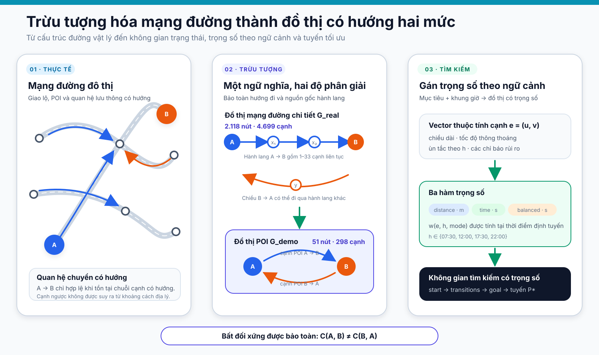
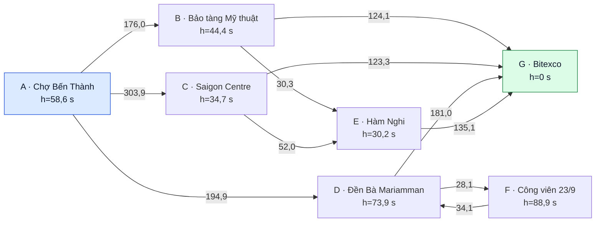
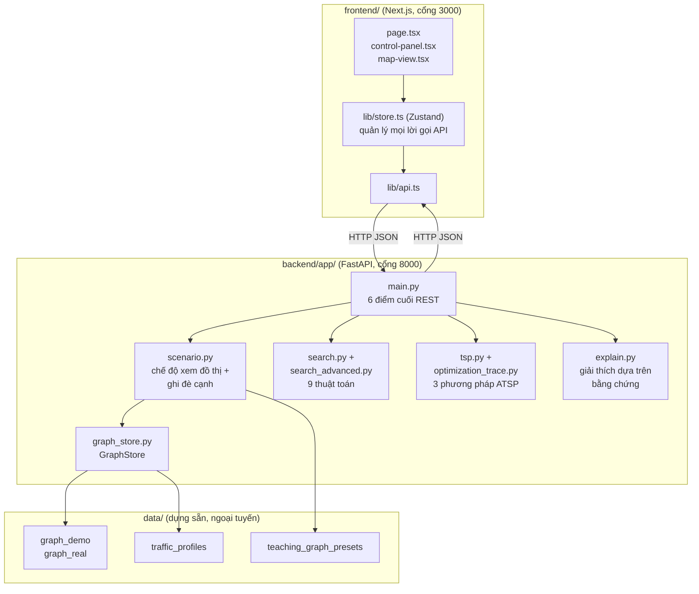
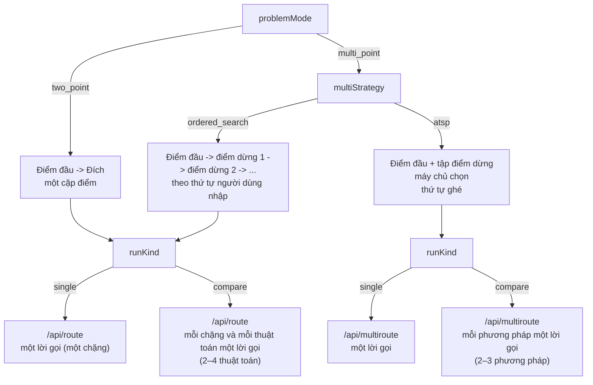
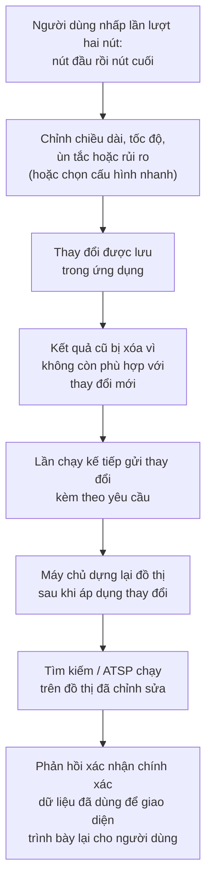
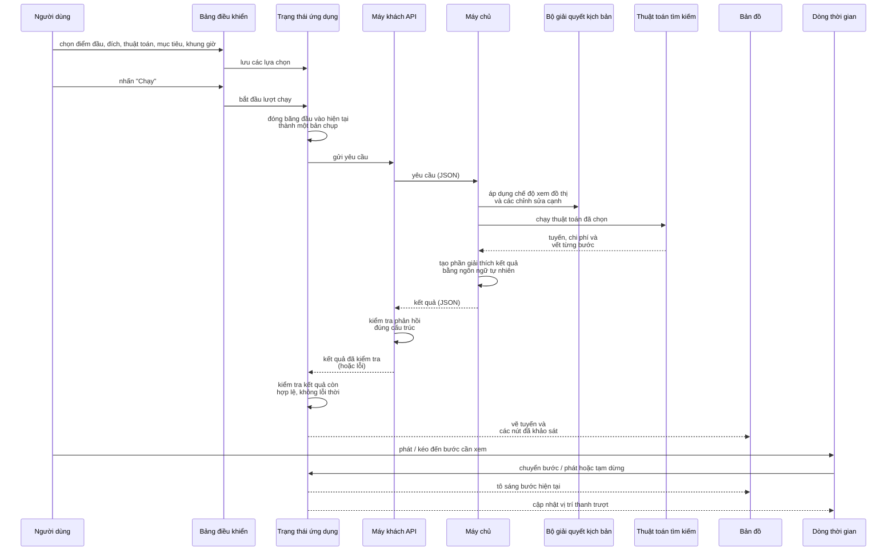
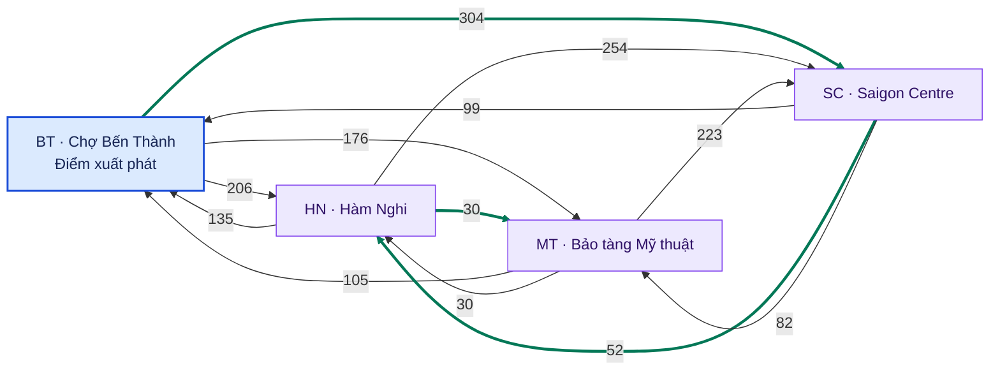

# Báo cáo kỹ thuật — Bài thực hành 1: Tìm kiếm

## a. Giới thiệu nhóm

### a.1. Thông tin nhóm

- **Tên nhóm:** Nhóm 2 (mã nhóm 2)
- **Lớp:** 24C03
- **Môn học:** Cơ sở Trí tuệ nhân tạo
- **Đề tài:** Tìm đường tối ưu cho người giao hàng qua nhiều địa điểm tại Thành phố Hồ Chí Minh
- **Số thành viên:** 5

### a.2. Đóng góp cụ thể của từng thành viên

| Thành viên | MSSV | Lĩnh vực phụ trách | Đóng góp chính | Mức độ hoàn thành |
|---|---:|---|---|---|
| **Nguyễn Hữu Gia Minh** | 24127078 | Dữ liệu và kiến trúc hệ thống | Xây dựng, kiểm chứng bộ dữ liệu và mô hình đồ thị; thiết kế hàm chi phí; chuẩn hóa luồng dữ liệu giữa máy chủ và giao diện; kiểm thử tính nhất quán của hệ thống. | **100%** |
| **Thái Quang Huy** | 24127177 | Tối ưu đa điểm và tích hợp hệ thống | Phát triển các phương pháp tối ưu thứ tự giao hàng; tích hợp các thành phần chính; kiểm chứng kết quả thực nghiệm; hoàn thiện giao diện song ngữ và nội dung báo cáo liên quan. | **100%** |
| **Nguyễn Văn Minh** | 24127205 | Thuật toán tìm đường và đánh giá thực nghiệm | Phát triển các thuật toán tìm đường giữa hai điểm; thực hiện so sánh và đánh giá hiệu năng; xây dựng nội dung lý thuyết và hỗ trợ trực quan hóa kết quả. | **100%** |
| **Mai Phương Thùy** | 24127249 | Thiết kế giao diện và kiểm thử trải nghiệm | Xây dựng hệ thống giao diện và chủ đề hiển thị; phát triển trải nghiệm so sánh phương pháp; kiểm thử giao diện; đóng góp nội dung về bối cảnh, hạn chế và hướng phát triển. | **100%** |
| **Trần Hoàng Phúc** | 24127505 | Luồng chương trình, so sánh tuyến và báo cáo | Xây dựng luồng hoạt động của chương trình; phát triển chức năng so sánh và đối chiếu tuyến; tổ chức nội dung, hình ảnh và cấu trúc của báo cáo kỹ thuật. | **100%** |

### a.3. Mức độ đáp ứng tổng thể đối với từng yêu cầu của đồ án

Bảng dưới đây tổng hợp kết quả của nhóm theo chín tiêu chí trong mục **Tiêu chí đánh giá** của đề bài. Cột điểm thể hiện mức tự đánh giá theo tiến độ và sản phẩm hiện có, không thay thế kết quả chấm chính thức của giảng viên.

| Tiêu chí đánh giá theo đề bài | Kết quả thực hiện của nhóm | Điểm tối đa | Điểm đã làm |
|---|---|---:|---:|
| 1. Bối cảnh giao thông Việt Nam và kịch bản thực tế | Xây dựng bài toán giao hàng đa điểm trong bối cảnh giao thông đô thị Thành phố Hồ Chí Minh, có xét đường một chiều, ùn tắc theo thời điểm và các yếu tố rủi ro trên đường. | 10 | **10/10** |
| 2. Mô hình hóa đồ thị, thiết kế bộ dữ liệu và hàm chi phí | Mô hình hóa mạng đường bằng đồ thị có hướng; xây dựng bộ dữ liệu hai quy mô; thiết kế thuộc tính giao thông, hàm chi phí theo khoảng cách, thời gian và mức độ phù hợp của tuyến. | 15 | **15/15** |
| 3. Cài đặt chính xác các thuật toán tìm kiếm bắt buộc | Cài đặt và kiểm thử bốn thuật toán bắt buộc: BFS, DFS, UCS và A\*; thống nhất kết quả đầu ra để phục vụ đánh giá và trực quan hóa. | 20 | **20/20** |
| 4. Cài đặt các thuật toán tìm kiếm hoặc tối ưu bổ sung | Bổ sung năm thuật toán: IDDFS, tìm kiếm tham lam tốt nhất trước, Dijkstra hai chiều, IDA\* và tìm kiếm chùm; phân tích đặc điểm và chất lượng lời giải của từng phương pháp. | 10 | **10/10** |
| 5. Tối ưu hóa tuyến đường qua nhiều địa điểm | Xây dựng chức năng tối ưu thứ tự giao hàng bằng Held–Karp, láng giềng gần nhất kết hợp tìm kiếm cục bộ và ủ mô phỏng; hỗ trợ hành trình mở và khép kín. | 10 | **10/10** |
| 6. Giao diện đồ họa và trực quan hóa quá trình tìm kiếm | Phát triển giao diện web tương tác gồm bản đồ, hoạt ảnh quá trình tìm kiếm, dòng thời gian, chỉ số đánh giá và chế độ so sánh nhiều thuật toán. | 10 | **10/10** |
| 7. Giải thích tuyến đường và so sánh các phương án | Cung cấp phần giải thích lựa chọn tuyến, phân rã chi phí, thông tin về bảo đảm thuật toán và đối chiếu với các tuyến tham chiếu. | 10 | **10/10** |
| 8. Chất lượng báo cáo kỹ thuật | Xây dựng đầy đủ các phần nội dung kỹ thuật theo cấu trúc yêu cầu; đang thống nhất cách trình bày, hình minh họa, tài liệu tham khảo và định dạng bản cuối. | 10 | **8/10** |
| 9. Chất lượng video minh họa | Xây dựng kịch bản thuyết minh và trình tự trình diễn hệ thống; phần ghi hình, biên tập và kiểm tra chất lượng video được thực hiện ở bước bàn giao cuối. | 5 | **2/5** |
| **Tổng cộng** | **Các chức năng và nội dung kỹ thuật chính đã được xây dựng; báo cáo và video đang được hoàn thiện để nộp.** | **100** | **95/100** |

## b. Bối cảnh bài toán

### b.1. Kịch bản giao thông được lựa chọn

Đề tài lựa chọn kịch bản **hỗ trợ một người giao hàng lập hành trình qua nhiều địa điểm tại khu vực trung tâm Thành phố Hồ Chí Minh**. Trong mỗi chuyến đi, người giao hàng xuất phát từ một điểm tập kết, cần ghé các địa điểm giao hàng và phải quyết định đồng thời tuyến đường cho từng chặng cũng như thứ tự phục vụ các điểm đến. Đây là một bài toán tiêu biểu của giao hàng chặng cuối, nơi chất lượng của quyết định định tuyến ảnh hưởng trực tiếp đến tổng quãng đường, thời gian di chuyển và khả năng duy trì tiến độ giao hàng.

Bối cảnh này có ý nghĩa thực tiễn rõ rệt tại Thành phố Hồ Chí Minh. Theo TomTom Traffic Index, trong năm 2025, mức ùn tắc trung bình của khu vực thành phố đạt **46,9%**; một hành trình 10 km mất trung bình **31 phút 55 giây**. Trong giờ cao điểm buổi tối, cùng quãng đường này mất trung bình **40 phút 32 giây**, với tốc độ trung bình chỉ **14,8 km/h**; tổng thời gian mất thêm do ùn tắc trong các giờ cao điểm được ước tính là **127 giờ trong năm** (TomTom, n.d.-b). Các số liệu này là chỉ báo ở quy mô thành phố, không phải số đo trực tiếp cho từng đoạn đường trong mô hình, nhưng cho thấy thời gian di chuyển có thể biến động đáng kể theo thời điểm.

Ở phạm vi rộng hơn, báo cáo *Viet Nam Rising: Pathways to a High-Income Future* nhận định ùn tắc tại Hà Nội và Thành phố Hồ Chí Minh đang làm suy giảm lợi ích kinh tế từ tập trung đô thị và hạn chế khả năng kết nối lao động trong vùng đô thị (Coppola Suriani et al., 2025). Đối với hoạt động giao hàng, tác động này được thể hiện ở quy mô nhỏ hơn nhưng diễn ra lặp lại hằng ngày: mỗi lần đi vòng, chọn nhầm tuyến trong giờ đông xe hoặc sắp xếp thứ tự giao hàng chưa hợp lý đều có thể cộng dồn thành thời gian chậm trễ đáng kể trong toàn bộ hành trình.

Nghiên cứu về giao hàng chặng cuối cũng chỉ ra rằng sự gia tăng nhu cầu giao nhận trong đô thị tạo thêm áp lực lên hạ tầng đường bộ, trong khi bài toán định tuyến phải xử lý đồng thời nhiều điều kiện vận hành như ùn tắc, thời gian phục vụ và sự biến động của môi trường giao hàng (Boysen et al., 2021; Jazemi et al., 2023). Vì vậy, kịch bản người giao hàng tại Thành phố Hồ Chí Minh vừa phù hợp với yêu cầu của đề tài, vừa đại diện cho một nhu cầu ra quyết định có cơ sở thực tế.

### b.2. Vấn đề thực tế cần giải quyết

Trong mạng lưới đường đô thị, **tuyến ngắn nhất về khoảng cách không nhất thiết là tuyến có thời gian di chuyển thấp nhất hoặc phù hợp nhất**. Một tuyến ngắn có thể đi qua đoạn đường ùn tắc, giao lộ có độ trễ lớn, khu vực ngập hoặc thi công; trong khi một tuyến dài hơn đôi chút có thể giúp hành trình ổn định hơn. Đường một chiều còn làm cho chi phí di chuyển giữa hai địa điểm phụ thuộc vào hướng đi: tuyến từ A đến B có thể khác đáng kể so với tuyến từ B về A. Do đó, khoảng cách đường chim bay hoặc một thứ tự ghé dựa đơn thuần trên vị trí địa lý không đủ để đại diện cho chi phí vận hành thực tế.

Với một điểm đến, người giao hàng cần lựa chọn một đường đi hợp lệ theo mục tiêu đang ưu tiên, chẳng hạn quãng đường, thời gian ước tính hoặc mức độ phù hợp tổng hợp có xét điều kiện bất lợi trên đường. Với nhiều điểm giao, bài toán xuất hiện thêm một tầng quyết định: **nên ghé các điểm theo thứ tự nào**. Một thứ tự không hợp lý có thể khiến người giao hàng quay lại khu vực vừa đi qua hoặc thực hiện nhiều chặng có chi phí cao, ngay cả khi mỗi chặng riêng lẻ đã sử dụng một tuyến tốt.

Vì vậy, vấn đề được phân thành hai nhiệm vụ liên kết:

1. **Tối ưu tuyến giữa hai địa điểm:** tìm đường đi phù hợp trên mạng đường có hướng theo tiêu chí được lựa chọn.
2. **Tối ưu hành trình qua nhiều địa điểm:** xác định thứ tự ghé thăm và ghép các tuyến giữa từng cặp điểm thành một hành trình nhất quán.

Cách phân tách này giúp thể hiện đúng bản chất của quyết định giao hàng: tối ưu từng chặng không tự động bảo đảm tối ưu toàn bộ chuyến đi, còn một thứ tự ghé tốt chỉ có ý nghĩa khi chi phí giữa các điểm được tính từ các tuyến đường thực sự có thể di chuyển. Trong phạm vi đồ án, hệ thống tập trung vào một người giao hàng và một hành trình tại một thời điểm; các ràng buộc của bài toán vận tải quy mô lớn như nhiều phương tiện, tải trọng hoặc khung giờ giao hàng chưa được đưa vào. Việc xác định rõ giới hạn này giúp kết quả được diễn giải đúng như một mô hình hỗ trợ học tập và ra quyết định, thay vì một hệ thống điều phối thương mại hoàn chỉnh.

### b.3. Ý nghĩa của việc tối ưu tuyến đường

Tối ưu tuyến đường mang lại ba nhóm giá trị chính trong kịch bản đã chọn.

Thứ nhất, về **hiệu quả hành trình**, hệ thống giúp hạn chế các chặng vòng không cần thiết, giảm chi phí di chuyển theo mục tiêu đã chọn và sắp xếp thứ tự giao hàng hợp lý hơn. Trong điều kiện ùn tắc thay đổi theo thời điểm, khả năng đánh giá nhiều phương án cho phép tránh việc mặc định rằng tuyến ngắn nhất luôn là lựa chọn tốt nhất.

Thứ hai, về **tính ổn định của quyết định**, việc xem xét đồng thời hướng đường, thời gian ước tính, mức độ ùn tắc và yếu tố rủi ro tạo ra một cơ sở lựa chọn sát với bối cảnh đô thị hơn so với tối ưu khoảng cách đơn thuần. Điều này không biến kết quả thành dự báo thời gian thực, nhưng giúp người dùng quan sát rõ vì sao cùng một cặp địa điểm có thể cần tuyến khác nhau khi mục tiêu hoặc điều kiện giao thông thay đổi.

Thứ ba, về **khả năng giải thích và so sánh**, hệ thống không chỉ trả về một đường đi. Mỗi phương án còn được trình bày cùng chi phí, quãng đường, thời gian ước tính, các yếu tố ảnh hưởng và mức bảo đảm của phương pháp tìm kiếm. Nhờ đó, người dùng có thể hiểu sự đánh đổi giữa các lựa chọn thay vì tiếp nhận một kết quả như một “hộp đen”. Đây cũng là cơ sở để đánh giá công bằng nhiều thuật toán trên cùng dữ liệu và cùng điều kiện giao thông.

Giá trị cốt lõi của đề tài vì thế nằm ở việc kết nối **ba lớp quyết định** trong một quy trình thống nhất: lựa chọn tuyến cho từng chặng, tối ưu thứ tự giao nhiều điểm và giải thích cơ sở của phương án được chọn. Sự kết hợp này tạo ra một mô hình có tính ứng dụng và giá trị minh họa cao hơn bài toán đường đi ngắn nhất thuần túy, nhưng vẫn giữ phạm vi phù hợp với mục tiêu nghiên cứu thuật toán tìm kiếm của môn học.

### b.4. Điểm nhấn của bài toán

Đề tài không đặt mục tiêu đề xuất một thuật toán hoàn toàn mới. Điểm nhấn nằm ở cách **đưa các thuật toán tìm kiếm và tối ưu vào một bối cảnh giao thông Việt Nam có nhiều yếu tố tương tác**, thay vì đánh giá chúng trên một đồ thị trừu tượng chỉ có một loại trọng số. Mạng đường có hướng làm nổi bật ảnh hưởng của đường một chiều; hồ sơ ùn tắc theo thời điểm cho phép quan sát sự thay đổi của tuyến; các yếu tố rủi ro tạo ra sự đánh đổi giữa “ngắn”, “nhanh” và “phù hợp”; còn bài toán nhiều điểm cho thấy khác biệt giữa tối ưu cục bộ từng chặng và tối ưu toàn bộ hành trình.

Nhờ đó, sản phẩm vừa giải quyết đúng hai yêu cầu tìm đường và giao hàng đa điểm, vừa tạo điều kiện để người học quan sát, so sánh và giải thích hành vi của các phương pháp khác nhau. Đây là đóng góp thực tiễn và sư phạm của bài toán trong phạm vi đồ án.

## c. Mô hình hóa bài toán

### c.1. Mô hình đồ thị có hướng

Theo cách biểu diễn bài toán tìm kiếm trên không gian trạng thái (Russell &
Norvig, 2021), mạng giao thông được mô hình hóa bằng đồ thị có hướng:

\[
G=(V,E),
\]

trong đó \(V\) là tập nút và \(E\) là tập cạnh có hướng. Một nút biểu diễn
trạng thái vị trí hiện tại của người giao hàng. Một cạnh \(e=(u,v)\) biểu diễn
khả năng đi trực tiếp từ nút \(u\) đến nút \(v\) theo cấu trúc liên kết đã
xây dựng. Chi phí nằm trên cạnh; nút không có trọng số riêng.

Đề tài sử dụng hai mức đồ thị có cùng cách biểu diễn nhưng phục vụ hai mục đích:

- \(G_{\text{real}}\) là **đồ thị mạng đường chi tiết**, được xử lý từ dữ liệu
  OpenStreetMap trong một vùng trung tâm Thành phố Hồ Chí Minh. Đồ thị này giữ
  cấu trúc mạng đường để đánh giá thuật toán ở quy mô lớn.
- \(G_{\text{demo}}\) là **đồ thị POI**, gồm 51 địa điểm có tên và các hành
  lang có hướng được co từ \(G_{\text{real}}\). Đồ thị này phục vụ trực quan
  hóa, giải thích quá trình tìm kiếm và minh họa bài toán giao hàng.

\(G_{\text{demo}}\) không phải một đồ thị vẽ tay độc lập. Mỗi cạnh trên đồ thị
POI đại diện cho một đường đi liên tục gồm từ 1 đến 33 cạnh của
\(G_{\text{real}}\). Chiều dài, thời gian thông thoáng, loại đường và biến chỉ
báo rủi ro của cạnh này được tổng hợp từ hành lang tương ứng.

#### c.1.1. Lý do lựa chọn mô hình hai độ phân giải

Điểm đáng chú ý của thiết kế là **một ngữ nghĩa đồ thị có hướng được duy trì ở
hai độ phân giải**. Đồ thị mạng đường chi tiết hỗ trợ đánh giá hiệu năng trên
không gian trạng thái lớn, trong khi đồ thị POI giúp quan sát và giải thích từng
bước tìm kiếm. Do mỗi cạnh POI vẫn truy vết được về một hành lang liên tục trên
\(G_{\text{real}}\), hai đồ thị sử dụng cùng cách diễn giải về hướng đi, chiều
dài, thời gian, ùn tắc và rủi ro thay vì hình thành hai mô hình tách biệt.

Thiết kế này tạo ra sự cân bằng giữa **độ trung thực cấu trúc**, **khả năng đánh
giá thực nghiệm** và **khả năng giải thích**. Giá trị của mô hình không nằm ở việc thay
thế bản đồ điều hướng thương mại, mà ở khả năng kiểm chứng thuật toán trên một
mạng được dẫn xuất từ dữ liệu bản đồ mở và trình bày kết quả trên một đồ thị đủ
gọn để người đọc theo dõi.

### c.2. Nút, cạnh, hướng và tính liên thông

Trong \(G_{\text{real}}\), 2.118 nút biểu diễn các đỉnh mạng đường, chủ yếu
tương ứng với giao lộ hoặc đầu mút của đoạn đường sau quá trình đơn giản hóa.
Trong \(G_{\text{demo}}\), 51 nút mang vai trò địa điểm: 40 địa danh, 7
trường học, 3 bệnh viện và 1 điểm được quy ước làm kho. Mỗi nút có mã định danh,
tọa độ vĩ độ–kinh độ, tên hiển thị và loại địa điểm; tên của các nút mạng đường
trong \(G_{\text{real}}\) không được gán.

Hướng di chuyển được biểu diễn trực tiếp bằng cấu trúc đồ thị. Người giao hàng
đi trực tiếp từ \(A\) đến \(B\) khi và chỉ khi đồ thị có cạnh
\(A\rightarrow B\). Nếu
không có cạnh \(A\rightarrow C\), việc hai nút gần nhau hoặc nằm trên cùng một
tuyến đường không tự tạo ra một phép chuyển trực tiếp; muốn tới \(C\), thuật
toán phải tìm một chuỗi cạnh có hướng trung gian. Chiều \(B\rightarrow A\) chỉ
hợp lệ khi cạnh ngược đó cũng tồn tại.

Vì vậy, đường hai chiều được biểu diễn bằng hai cạnh đối hướng. Một cạnh được
đánh dấu một chiều khi cặp có thứ tự ngược không tồn tại trong đồ thị sau xử lý.
Đây là thuộc tính cấu trúc của bản dữ liệu, không phải bản sao trực tiếp của
thuộc tính một chiều hay bằng chứng biển báo ngoài thực địa. Với cạnh trên
\(G_{\text{demo}}\), nhãn một chiều còn có thể phát sinh do hành lang ngược
không được chọn trong quá trình co đồ thị; không nên hiểu mỗi cạnh POI là đúng
một đoạn đường vật lý có biển một chiều.

Hai đồ thị nền đều liên thông mạnh. Điều đó có nghĩa là giữa mọi cặp nút có thứ
tự đều tồn tại ít nhất một đường đi có hướng, nhưng không có nghĩa mọi cặp nút
đều nối trực tiếp. Dữ liệu hiện tại có 1.433 cạnh một chiều trong
\(G_{\text{real}}\) và 60 cạnh một chiều trong \(G_{\text{demo}}\). Tính bất đối
xứng này cũng làm cho chi phí đi từ \(A\) đến \(B\) có thể khác chi phí đi từ
\(B\) về \(A\).

Mô hình tìm kiếm cuối cùng là đồ thị có hướng đơn: mỗi cặp nút có thứ tự có tối
đa một cạnh, còn hai chiều di chuyển được xem là hai quan hệ chuyển trạng thái
độc lập. Quy trình chuyển từ đa đồ thị nguồn sang đồ thị này được trình bày tại
phần Bộ dữ liệu.

#### c.2.1. Sơ đồ trừu tượng hóa bài toán

Sơ đồ dưới đây minh họa cách mạng đường vật lý được chuyển thành hai mức đồ thị,
sau đó kết hợp với thuộc tính cạnh và bối cảnh thời gian để hình thành bài toán
tìm kiếm có trọng số.



*Hình c.1. Trừu tượng hóa mạng đường thành đồ thị có hướng hai mức và cơ chế
gán trọng số theo mục tiêu. Mỗi cạnh trên \(G_{\text{demo}}\) đại diện cho một
hành lang liên tục trên \(G_{\text{real}}\); chiều đi và chiều về được đánh
giá độc lập. Nguồn: nhóm thực hiện.*

### c.3. Trạng thái, trạng thái đầu, đích và quy tắc chuyển

Đối với tìm đường hai điểm:

- **Không gian trạng thái:** tập các nút của đồ thị đang xét.
- **Trạng thái hiện tại:** nút mà người giao hàng đang đứng.
- **Trạng thái đầu:** nút xuất phát do người dùng chọn.
- **Trạng thái đích:** nút đích do người dùng chọn.
- **Quy tắc chuyển:** từ \(u\), có thể chuyển sang \(v\) nếu tồn tại cạnh có hướng
  \(u\rightarrow v\).
- **Chi phí bước:** trọng số của cạnh \(u\rightarrow v\) theo mục tiêu và khung
  giờ đã chọn.
- **Lời giải:** một dãy nút
  \(P=(v_0,v_1,\ldots,v_k)\), với \(v_0\) là trạng thái đầu, \(v_k\) là đích và
  \((v_i,v_{i+1})\in E\) cho mọi \(i\).

Chi phí của một đường đi là tổng các chi phí bước:

\[
\operatorname{Cost}(P)=\sum_{i=0}^{k-1}w(v_i,v_{i+1}).
\]

Đối với bài toán nhiều địa điểm, điểm xuất phát vẫn được cố định. Với mỗi cặp có
thứ tự trong tập gồm điểm xuất phát và các điểm cần ghé, hệ thống tính chi phí
đường đi ngắn nhất theo cùng đồ thị, khung giờ và mục tiêu. Các giá trị này tạo
thành ma trận chi phí có hướng:

\[
C(a,b)=\min_{P:a\leadsto b}\sum_{e\in P}w(e).
\]

Do đồ thị có hướng, \(C(a,b)\) không được giả định bằng \(C(b,a)\). Các phương
pháp tối ưu đa điểm sử dụng ma trận này để tối thiểu hóa tổng chi phí của thứ tự
ghé; phần nguyên lý và bảo đảm tối ưu của từng phương pháp được trình bày riêng
trong mục Tối ưu hóa tuyến đường đa điểm của báo cáo.

Với thứ tự ghé \((p_0,p_1,\ldots,p_k)\), trong đó \(p_0\) là điểm xuất phát, đặt
\(\rho=1\) nếu hành trình phải quay về điểm đầu và \(\rho=0\) nếu không. Mục tiêu
được tối thiểu hóa là:

\[
J=\sum_{i=0}^{k-1}C(p_i,p_{i+1})
  +\rho C(p_k,p_0).
\]

Mặc định, hành trình là đường đi mở và kết thúc tại địa điểm cuối cùng. Khi người
dùng yêu cầu quay lại điểm xuất phát, số hạng cuối được cộng vào mục tiêu.

### c.4. Thuộc tính của nút, cạnh và hồ sơ giao thông

Các thuộc tính phục vụ mô hình được tóm tắt trong bảng dưới đây.

| Thành phần | Thuộc tính | Ý nghĩa và đơn vị |
|---|---|---|
| Nút | Mã, tên, loại, vĩ độ, kinh độ | Xác định trạng thái và vị trí địa lý; tọa độ dùng cho hiển thị và hàm heuristic |
| Cạnh | Mã cạnh | Định danh duy nhất một cạnh trong bản dữ liệu |
| Cạnh | Nút đầu và nút cuối | Xác định phép chuyển có hướng |
| Cạnh | Tên đường và loại đường | Mô tả tuyến; loại đường còn được dùng để gán tốc độ mô hình và tạo dữ liệu ùn tắc dự phòng |
| Cạnh | Chiều dài | Độ dài đoạn đường hoặc hành lang, tính bằng mét |
| Cạnh | Quan hệ đối hướng | Cho biết cạnh ngược có tồn tại trong bản dữ liệu hay không |
| Cạnh | Tốc độ thông thoáng | Tốc độ mô hình theo loại đường, tính bằng km/h |
| Cạnh | Thời gian thông thoáng | Chiều dài chia cho tốc độ thông thoáng, tính bằng giây |
| Cạnh | Bốn biến chỉ báo rủi ro | Ngập, thi công, đường hẹp và đèn tín hiệu; mỗi biến nhận 0 hoặc 1 |
| Hồ sơ giao thông | Mức ùn tắc theo cạnh và khung giờ | Số nguyên từ 1 đến 5 tại 07:30, 12:00, 17:30 và 22:00 |

Hồ sơ giao thông được lưu tách khỏi đồ thị vì cấu trúc liên kết và thuộc tính
đường không đổi theo từng khung giờ, còn mức ùn tắc thay đổi theo thời điểm. Mỗi
cạnh của mỗi đồ thị có đúng một mức ùn tắc ở từng khung giờ. Trọng số hiệu dụng
không được lưu cố định trong bộ dữ liệu mà được tính tại thời điểm định tuyến từ
chiều dài, tốc độ, mức ùn tắc và các biến chỉ báo rủi ro.

### c.5. Hàm chi phí

#### c.5.1. Các thành phần

Với cạnh \(e\), gọi:

- \(l_e\) là chiều dài cạnh, đơn vị mét;
- \(v_e\) là tốc độ thông thoáng mô hình, đơn vị km/h;
- \(c_e(h)\in\{1,2,3,4,5\}\) là mức ùn tắc tại khung giờ \(h\);
- \(r_f,r_c,r_n,r_l\in\{0,1\}\) lần lượt là các biến chỉ báo nhị phân cho
  ngập, thi công, đường hẹp và đèn tín hiệu.

Thời gian thông thoáng của cạnh là:

\[
t_e^0=\frac{l_e}{v_e/3.6}\quad[\text{giây}].
\]

Mức ùn tắc được chuyển thành hệ số nhân thời gian:

\[
f_e(h)=1+\gamma\frac{c_e(h)-1}{4},\qquad \gamma=1{,}5.
\]

Do đó, năm mức ùn tắc tương ứng với các hệ số \(1\), \(1{,}375\),
\(1{,}75\), \(2{,}125\) và \(2{,}5\). Mức 1 biểu diễn trạng thái gần thông
thoáng; ở mức 5, phần thời gian di chuyển của cạnh bằng 2,5 lần thời gian thông
thoáng.

Chi phí phạt rủi ro được quy đổi về giây:

\[
P_e=60r_f+90r_c+30r_n+25r_l\quad[\text{giây}].
\]

Trong đó, cạnh có chỉ báo ngập cộng 60 giây, cạnh có chỉ báo thi công cộng 90
giây, cạnh có chỉ báo đường hẹp cộng 30 giây và cạnh đi vào nút có đèn tín hiệu
cộng 25 giây. Với ngập và thi công, chỉ báo được đặt trên cạnh đi từ ngoài vào
vùng mô hình; nhờ vậy chi phí được tính một lần khi đi vào vùng thay vì bị cộng
trên mọi đoạn đường nằm bên trong.

#### c.5.2. Ba mục tiêu tối ưu

Đề tài không dùng khoảng cách làm tiêu chí duy nhất. Ba trọng số cạnh được định
nghĩa như sau:

\[
w_{\text{distance}}(e)=l_e\quad[\text{mét}],
\]

\[
w_{\text{time}}(e,h)=t_e^0 f_e(h)\quad[\text{giây}],
\]

\[
w_{\text{balanced}}(e,h)=t_e^0 f_e(h)+P_e\quad[\text{giây}].
\]

Chế độ khoảng cách tạo một tuyến tham chiếu ngắn nhất theo mét. Chế độ thời gian
tối ưu thời gian sau khi điều chỉnh theo ùn tắc nhưng chưa cộng rủi ro. Chế độ cân
bằng bổ sung chi phí phạt để ưu tiên những tuyến có tổng thời gian và chi phí
rủi ro thấp hơn. Chi phí phạt được cộng sau khi nhân hệ số ùn tắc; nó
không bị nhân thêm bởi hệ số này.

Cách thiết kế này tránh cộng trực tiếp những đại lượng khác đơn vị. Ở chế độ
cân bằng, thời gian di chuyển và phần phạt rủi ro đều được biểu diễn bằng giây
tương đương nên tổng chi phí có cách diễn giải nhất quán. Tuy nhiên, đây vẫn là
chi phí mô hình, không phải thời gian đến dự kiến (ETA) đã được hiệu chuẩn ngoài
thực địa.

#### c.5.3. Nguồn và ý nghĩa của các trọng số

Tốc độ thông thoáng, \(\gamma=1{,}5\) và bốn mức phạt 60/90/30/25 giây là các
tham số do nhóm thiết kế, không phải tốc độ pháp lý hay hệ số đã học từ một bộ
dữ liệu kiểm chứng độc lập. Với cấu hình \(\gamma=1{,}5\), mô hình tạo một thang
tuyến tính dễ giải thích: mức ùn tắc cao nhất làm thời gian gấp 2,5 lần mức thông
thoáng. Không có dữ liệu độc lập chứng minh đây là giá trị tối ưu.

Thứ tự các mức phạt thể hiện ưu tiên mô hình của nhóm: thi công được gán độ trễ
lớn nhất, tiếp theo là ngập, đường hẹp và đèn tín hiệu. Các độ lớn đưa biến chỉ
báo rủi ro vào cùng đơn vị với thời gian để chúng có thể ảnh hưởng đến lựa chọn
tuyến, nhưng chưa được suy ra từ số đo thực địa hoặc khảo sát hành vi người giao
hàng.

Một phân tích hậu nghiệm trên 160 bản ghi TomTom đã lưu cho
\(\hat{\gamma}=1{,}238\), chênh khoảng 17,5% so với giá trị thiết kế. Tuy nhiên,
mức ùn tắc trong phép tính này được rời rạc hóa từ chính tỷ lệ tốc độ của các
bản ghi đó. Vì vậy, kết quả chỉ cho biết mức độ nhất quán nội bộ giữa quy tắc
chia mức và hàm nhân thời gian; nó không phải hiệu chuẩn độc lập bằng thời gian
di chuyển đầu-cuối. Hệ thống vẫn sử dụng \(\gamma=1{,}5\), còn các mức phạt chưa
có dữ liệu hiệu chuẩn tương ứng.

#### c.5.4. Ảnh hưởng của ùn tắc đến tuyến đường

Ùn tắc không tác động đến trọng số khoảng cách, nên với cùng cấu trúc đồ thị và
quy tắc phân xử giữa các trạng thái đồng hạng, tuyến tối ưu theo khoảng cách
không đổi giữa các khung giờ. Ngược lại, trong chế độ thời gian và cân bằng, mỗi
cạnh có hệ số phụ thuộc khung giờ.
Khi mức của các cạnh thay đổi không đồng đều, tương quan chi phí giữa các tuyến
cũng thay đổi; một hành lang dài hơn nhưng ít ùn tắc có thể được chọn thay cho
hành lang ngắn hơn đang ở mức cao. Trong chế độ cân bằng, quyết định này còn
chịu thêm chi phí phạt rủi ro. Cơ chế đó đáp ứng yêu cầu bài toán rằng giao thông theo
thời điểm phải có khả năng làm thay đổi tuyến cuối cùng.

### c.6. Hàm heuristic và điều kiện hợp lệ

Phần chứng minh chi tiết được trình bày trong mục Nguyên lý thuật toán. Việc sử
dụng một cận dưới không vượt quá chi phí tối ưu còn lại phù hợp với cơ sở lý
thuyết của tìm kiếm heuristic tối ưu (Hart et al., 1968).

Trong mô hình hiện tại, heuristic khoảng cách sử dụng khoảng cách Haversine từ
nút hiện tại đến đích. Với chế độ thời gian và cân bằng, khoảng cách này được
chia cho tốc độ lớn nhất của đồ thị đang xét; ở hai đồ thị nền hiện tại, tốc độ lớn
nhất là 45 km/h. Heuristic chỉ sử dụng tọa độ nút và cận tốc độ, không sử dụng
ùn tắc, rủi ro hoặc tên đường.

Heuristic này không vượt quá chi phí tối ưu còn lại và có tính nhất quán dưới
các điều kiện mà bộ dữ liệu duy trì: chiều dài mỗi cạnh không nhỏ hơn khoảng
cách Haversine giữa hai đầu cạnh, tốc độ cạnh không vượt quá tốc độ lớn nhất
dùng trong heuristic, hệ số ùn tắc không
nhỏ hơn 1 và phần phạt không âm. Kết luận này áp dụng cho đồ thị thỏa các điều
kiện trên, không phải cho mọi đồ thị tùy ý.

## d. Bộ dữ liệu

### d.1. Phương pháp thiết kế và phạm vi dữ liệu

Đề tài sử dụng **chiến lược tích hợp dữ liệu hỗn hợp (hybrid data
integration)**, kết hợp dữ liệu bản đồ mở đã qua tiền xử lý, các mẫu giao thông
quan sát được, dữ liệu do nhóm xây dựng và thành phần mô phỏng có khả năng tái
lập. Cách tiếp cận này giữ được cấu trúc liên kết có hướng của mạng đường đô
thị, đồng thời tạo ra một bộ dữ liệu phù hợp cho cả đánh giá thuật toán và trực
quan hóa quá trình tìm kiếm.

Đặc điểm quan trọng của bộ dữ liệu không nằm ở việc mô phỏng toàn bộ trạng thái
giao thông thực tế, mà ở **khả năng truy vết nguồn** và **tính nhất quán giữa
hai độ phân giải đồ thị**. Mỗi cạnh trên đồ thị POI được liên kết với một hành
lang có hướng trên đồ thị mạng đường chi tiết; vì vậy, khoảng cách, thời gian,
ùn tắc và rủi ro được tổng hợp từ cùng một chuỗi cạnh thay vì được gán độc lập.

Bộ dữ liệu gồm hai đồ thị và hai hồ sơ giao thông tương ứng. Thông tin chính
được tóm tắt trong bảng dưới đây.

| Thuộc tính | \(G_{\text{real}}\) | \(G_{\text{demo}}\) |
|---|---:|---:|
| Mục đích | Đánh giá thuật toán trên không gian trạng thái lớn | Trực quan hóa, giải thích và định tuyến giữa các POI |
| Nút | 2.118 đỉnh mạng đường | 51 POI |
| Cạnh có hướng | 4.699 | 298 |
| Cạnh một chiều theo cấu trúc | 1.433 | 60 |
| Cạnh có chỉ báo ngập | 54 | 24 |
| Cạnh có chỉ báo thi công | 19 | 24 |
| Cạnh có chỉ báo đường hẹp | 8 | 0 |
| Cạnh đi vào nút đèn tín hiệu | 185 | 130 |
| Khoảng chiều dài cạnh | 1,1–1.682,3 m | 23,0–2.775,6 m |
| Khoảng tốc độ có trong bản dữ liệu | 25–45 km/h | 30–45 km/h |
| Khoảng thời gian thông thoáng đã làm tròn | 0,1–134,6 s | 1,8–270,8 s |
| Số khung giờ | 4 | 4 |
| Tính liên thông | Liên thông mạnh | Liên thông mạnh |

Hai đồ thị dùng hệ tọa độ WGS 84 (EPSG:4326) và cùng giới hạn địa lý
\([106{,}68;10{,}76;106{,}72;10{,}80]\), theo thứ tự kinh độ trái, vĩ độ dưới,
kinh độ phải, vĩ độ trên. Phạm vi này bao phủ một phần khu vực trung tâm, không
đại diện cho toàn bộ Thành phố Hồ Chí Minh.

### d.2. Danh sách địa điểm của đồ thị POI

Các nút mạng đường trong \(G_{\text{real}}\) không có tên địa điểm, nên không
được trình bày như một danh mục POI. Danh sách tương tác gồm 51 POI của
\(G_{\text{demo}}\). Tên dưới đây được giữ nhất quán với bản dữ liệu.

| Nhóm địa điểm | Số lượng | Địa điểm |
|---|---:|---|
| Điểm được quy ước làm kho | 1 | Bưu điện Thành phố |
| Bệnh viện | 3 | BV Nhi Đồng 2; BV Mắt TP.HCM; BV Từ Dũ |
| Trường học | 7 | ĐH Kiến trúc TP.HCM; ĐH Kinh tế TP.HCM; THPT Lê Quý Đôn; Trường Marie Curie; THPT Nguyễn Thị Minh Khai; ĐH Mở TP.HCM; ĐH Khoa học Tự nhiên (Nguyễn Văn Cừ) |

Bốn mươi địa danh còn lại được trình bày thành hai cột để bảo đảm khả năng tra
cứu khi báo cáo được xuất sang PDF.

| STT | Địa danh | STT | Địa danh |
|---:|---|---:|---|
| 1 | Chợ Bến Thành | 21 | Chùa Ngọc Hoàng |
| 2 | Nhà thờ Đức Bà | 22 | Công viên Lê Văn Tám |
| 3 | Dinh Độc Lập | 23 | Chợ Tân Định |
| 4 | Hồ Con Rùa | 24 | Nhà thờ Tân Định |
| 5 | Công viên Tao Đàn | 25 | Cầu Kiệu |
| 6 | Bitexco Financial Tower | 26 | Chùa Vĩnh Nghiêm |
| 7 | Nhà hát Thành phố | 27 | Chùa Xá Lợi |
| 8 | UBND TP.HCM | 28 | Bảo tàng Chứng tích Chiến tranh |
| 9 | Saigon Centre (Takashimaya) | 29 | Vòng xoay Dân Chủ |
| 10 | Công trường Mê Linh | 30 | Cung Văn hoá Lao Động |
| 11 | Bến Bạch Đằng | 31 | Bảo tàng TP.HCM |
| 12 | Cầu Mống | 32 | Bảo tàng Mỹ thuật TP.HCM |
| 13 | Bảo tàng Hồ Chí Minh (Bến Nhà Rồng) | 33 | Điểm trung chuyển Hàm Nghi |
| 14 | Cầu Ba Son | 34 | Công viên 23/9 |
| 15 | Thảo Cầm Viên | 35 | Đền Bà Mariamman |
| 16 | Bảo tàng Lịch sử TP.HCM | 36 | Phố đi bộ Bùi Viện |
| 17 | Đài truyền hình HTV | 37 | Chợ Thái Bình |
| 18 | Sân vận động Hoa Lư | 38 | Cầu Ông Lãnh |
| 19 | Nhà văn hoá Thanh Niên | 39 | Cầu Calmette |
| 20 | Chợ Đa Kao | 40 | Chợ Nancy |

Tên, loại và tọa độ đầu vào của các POI do nhóm chọn lọc thủ công. Mỗi POI được
đối sánh với một nút \(G_{\text{real}}\) khác nhau để trở thành vị trí định
tuyến. Khoảng cách từ tọa độ đầu vào đến nút được chọn có giá trị nhỏ nhất 2,70 m, trung vị
46,14 m và lớn nhất 185,74 m. Năm POI có khoảng cách gắn nút lớn hơn 100 m là Dinh
Độc Lập (185,74 m), Công viên Tao Đàn (154,2 m), Cầu Ba Son (139,9 m), Cung Văn
hoá Lao Động (116,7 m) và Bảo tàng Hồ Chí Minh – Bến Nhà Rồng (105,8 m). Nhà
thờ Tân Định là trường hợp duy nhất dùng nút gần thứ hai, cách 72,46 m, để tránh
trùng nút trong ngưỡng 120 m. Các khoảng cách này đánh giá phép đối sánh
POI–nút, không xác nhận tọa độ POI đầu vào hoặc cổng ra vào là chính xác ngoài
thực địa.

### d.3. Nguồn dữ liệu và xuất xứ dữ liệu

#### d.3.1. Phân loại nguồn

| Nhóm dữ liệu | Nguồn và quy mô/độ phủ | Bản chất và vai trò trong mô hình |
|---|---|---|
| Cấu trúc liên kết, tọa độ, chiều dài, loại và tên đường | OpenStreetMap qua OSMnx; 2.118 nút và 4.699 cạnh sau xử lý | Dữ liệu bản đồ mở được dẫn xuất và đơn giản hóa |
| Đèn tín hiệu | Thẻ nút OpenStreetMap; dẫn xuất thành 185 cạnh trên \(G_{\text{real}}\) và 130 cạnh trên \(G_{\text{demo}}\) | Biến chỉ báo khi cạnh đi vào nút tín hiệu |
| Ùn tắc tại các điểm mẫu | TomTom Flow Segment Data; 4 khung giờ × 40 bản ghi, gán cho 635 cạnh mỗi khung giờ | Thành phần giao thông quan sát được |
| Ùn tắc trên phần mạng không được mẫu phủ | Quy tắc mô phỏng với hạt giống giả ngẫu nhiên 42; 4.064 cạnh mỗi khung giờ | Thành phần dự phòng mô phỏng, có khả năng tái lập |
| Địa điểm giao hàng | Nhóm chọn lọc và nhập tọa độ; 51 POI | Dữ liệu thủ công, sau đó đối sánh với nút \(G_{\text{real}}\) |
| Vùng ngập và thi công | Tám vùng tròn do nhóm mô hình hóa: 5 vùng ngập và 3 vùng thi công | Kịch bản rủi ro; nguồn ngoài chỉ hỗ trợ bối cảnh lịch sử |
| Tốc độ theo loại đường, hệ số ùn tắc và chi phí phạt | Tham số do nhóm thiết kế, áp dụng cho toàn bộ cạnh | Cấu hình mô hình, không phải số đo hoặc giới hạn pháp lý |
| Cạnh POI và thuộc tính tổng hợp | Phép co 298 hành lang có hướng; mỗi hành lang gồm 1–33 cạnh mạng đường | Dữ liệu dẫn xuất từ \(G_{\text{real}}\) |

OpenStreetMap là dữ liệu mở theo giấy phép ODbL (OpenStreetMap contributors,
n.d.). OSMnx 2.1.1 được dùng để tải, đơn giản hóa và chuyển dữ liệu đường thành
đồ thị mạng lưới; cách tiếp cận này phù hợp với phương pháp mô hình hóa mạng
đường bằng OSMnx (Boeing, 2025). Các trường tốc độ của mẫu giao thông được diễn
giải theo đặc tả Flow Segment Data (TomTom, n.d.-a).

#### d.3.2. OpenStreetMap và quá trình xây dựng \(G_{\text{real}}\)

Nguồn gần dữ liệu OSM nguyên bản nhất được lưu là phản hồi Overpass có
mốc thời gian nền 2026-07-26T11:45:05Z, gồm 19.864 phần tử: 15.959 nút và 3.905
đường (way). Từ phản hồi này, OSMnx tạo mạng đường cho phương tiện cơ giới trong
vùng địa lý đã nêu, đơn giản hóa cấu trúc liên kết và giữ thành phần liên thông
mạnh có hướng lớn nhất.

Đồ thị trung gian sau bước OSMnx là một đa đồ thị có hướng gồm 2.118 nút và
4.721 cạnh. Nó đã qua đơn giản hóa và lọc thành phần liên thông nên không phải
dữ liệu OSM nguyên bản. Quá trình chuẩn hóa tiếp theo loại hai cạnh tự nối, gộp
các cạnh song song cùng cặp có thứ tự và gán mã ổn định, tạo \(G_{\text{real}}\)
có 4.699 cạnh. Tọa độ nút, chiều dài cạnh, loại đường, tên đường và thông tin
nút đèn tín hiệu có nguồn từ OSM. Ngược lại, tốc độ thông thoáng không lấy từ
trường giới hạn tốc độ của OSM; nó được gán theo bảng cấu hình của nhóm.

Quá trình rút gọn giúp đồ thị phù hợp với thuật toán tìm kiếm, nhưng làm mất một
số thông tin gốc như mã OSM, hình học đường, số làn, hạn chế tiếp cận, hạn chế rẽ
và các lựa chọn đường song song đã bị gộp. Vì vậy \(G_{\text{real}}\) nên được
mô tả là đồ thị có hướng đã xử lý từ OSM, không phải dữ liệu OSM nguyên bản.

#### d.3.3. TomTom và hồ sơ giao thông hỗn hợp

Đề tài có bốn bản trích xuất TomTom chỉ lưu các trường đã chọn, mỗi bản gồm 40
bản ghi hợp lệ. Dữ liệu chỉ giữ tọa độ truy vấn, tốc độ hiện tại, tốc độ thông
thoáng, phân hạng chức năng của đường và thời điểm bắt đầu đợt thu thập; đây
không phải bản sao đầy đủ của phản hồi API.

Bốn mươi điểm truy vấn được chọn ngoại tuyến từ các cạnh đường chính của
\(G_{\text{real}}\): các cạnh được sắp giảm dần theo chiều dài, lấy tọa độ nút
đầu và loại trùng theo lưới tọa độ làm tròn ba chữ số. Vì vậy, tọa độ được lưu là
điểm gửi truy vấn, không phải tọa độ đoạn đường do TomTom trả về.

Bốn đợt được ghi nhận như sau:

| Khung giờ đại diện | Thời điểm bắt đầu đợt thu thập được lưu | Số bản ghi |
|---|---:|---:|
| 07:30 | 2026-07-27 07:40:03 | 40 |
| 12:00 | 2026-07-27 12:49:57 | 40 |
| 17:30 | 2026-08-03 17:30:01 | 40 |
| 22:00 | 2026-08-03 22:27:52 | 40 |

Hai bản trích xuất đầu và hai bản sau được lấy vào hai ngày thứ Hai cách nhau
bảy ngày. Chúng là các quan sát đại diện theo khung giờ, không phải chuỗi thời
gian trong cùng một ngày và không phải nguồn cấp thời gian thực. Mốc thời gian
được tạo một lần cho cả đợt và không lưu múi giờ, nên không được hiểu là thời
điểm riêng của từng truy vấn.

Tỷ lệ giữa tốc độ hiện tại và tốc độ thông thoáng được chuyển thành mức ùn tắc:

| Tỷ lệ tốc độ \(r\) | Mức ùn tắc |
|---:|---:|
| \(r\geq0{,}85\) | 1 |
| \(0{,}70\leq r<0{,}85\) | 2 |
| \(0{,}55\leq r<0{,}70\) | 3 |
| \(0{,}40\leq r<0{,}55\) | 4 |
| \(r<0{,}40\) | 5 |

Sau phép quy đổi, hồ sơ chỉ lưu mức 1–5 theo cạnh. Các tốc độ TomTom không thay
thế tốc độ thông thoáng cấu hình của từng cạnh khi hệ thống tính chi phí.

Mẫu TomTom chỉ được gán cho cạnh thuộc nhóm đường chính khi nút đầu cạnh cách
điểm truy vấn gần nhất không quá 250 m. Phép gán không đối sánh theo tên đường,
phân hạng chức năng của đường, hướng chạy hoặc hình học đoạn đường. Trường phân
hạng được lưu để mô tả nhưng không tham gia phép gán hoặc hàm chi phí. Với mỗi
khung giờ, 635/4.699 cạnh \(G_{\text{real}}\), tương đương khoảng 13,51%, nhận
mức ùn tắc từ mẫu TomTom; 4.064 cạnh còn lại, tương đương 86,49%, dùng dữ liệu
dự phòng mô phỏng.

Dữ liệu dự phòng sử dụng **hạt giống giả ngẫu nhiên 42** để có thể tái lập. Ở
07:30 và 17:30, các nhóm đường *primary*/*trunk* nhận mức cơ sở 4–5,
*secondary* nhận 3–4, *tertiary* nhận 2–4 và nhóm còn lại nhận 2–3. Trên mỗi
cạnh, mỗi giờ cao điểm độc lập có xác suất 10% tăng thêm một mức, tối đa 5, để
mô phỏng sự cố cục bộ. Trong phần dự phòng, mức
12:00 bằng mức dự phòng 07:30 trừ 1 với sàn 1, còn mức 22:00 được sinh trong
khoảng 1–2. Vì vậy hồ sơ giao thông là dữ liệu
**TomTom kết hợp dữ liệu dự phòng mô phỏng**, không phải dữ liệu giao thông
được quan sát trên toàn bộ mạng.

Mức ùn tắc của \(G_{\text{demo}}\) không được sinh ngẫu nhiên lần nữa. Với từng
cạnh POI và từng khung giờ, mức này là trung bình mức của các cạnh
\(G_{\text{real}}\) trong hành lang, có trọng số theo thời gian thông thoáng và
được làm tròn theo quy tắc 0,5 làm tròn lên về số nguyên 1–5. Nhờ đó hai tầng đồ
thị có dữ liệu giao thông nhất quán với nhau.

#### d.3.4. Dữ liệu rủi ro

Mô hình có năm vùng ngập và ba vùng thi công. Tâm và bán kính trong bảng dưới
là hình học mô hình do nhóm đặt. Các nguồn công khai chỉ ghi nhận bối cảnh lịch
sử của tuyến hoặc khu vực; chúng không xác nhận chính xác tâm, bán kính, mức phạt
hay tình trạng hiện tại.

| Loại | Khu vực; tâm (vĩ độ; kinh độ); bán kính mô hình | Nguồn bối cảnh lịch sử |
|---|---|---|
| Ngập | Nguyễn Hữu Cảnh; (10,7925; 106,7190); 400 m | (Ủy ban nhân dân Thành phố Hồ Chí Minh, 2016) |
| Ngập | Đinh Tiên Hoàng gần Cầu Bông; (10,7955; 106,6985); 250 m | (Báo Nhân Dân, 2005) |
| Ngập | Cống Quỳnh gần BV Từ Dũ; (10,7680; 106,6870); 250 m | (Báo Tin tức, 2024) |
| Ngập | Calmette–Bến Chương Dương/Võ Văn Kiệt; (10,7648; 106,6975); 250 m | (Báo Tin tức, 2025) |
| Ngập | Trần Hưng Đạo, khu vực Bùi Viện; (10,7625; 106,6890); 300 m | (Báo Tiền Phong, 2025) |
| Thi công | Lê Thánh Tôn trước chợ Bến Thành; (10,7730; 106,6990); 150 m | (VnExpress, 2024) |
| Thi công | Hai Bà Trưng/Tân Định; (10,7890; 106,6905); 200 m | (Trần, 2013) |
| Thi công | Võ Thị Sáu–Pasteur; (10,7860; 106,6890); 200 m | (Công ty Cổ phần Cấp nước Bến Thành, 2021) |

Trên \(G_{\text{real}}\), biến chỉ báo ngập hoặc thi công được tạo khi một
cạnh đi từ ngoài vào trong vùng tròn. Nếu tuyến bắt đầu sẵn trong vùng, mô hình
không cộng chi phí đi vào vùng cho trạng thái ban đầu. Chỉ báo đường hẹp không dùng số đo
chiều rộng thực tế mà được suy ra từ loại đường; chỉ báo đèn tín hiệu được dẫn
xuất từ nút OSM có thẻ đèn tín hiệu. Trên \(G_{\text{demo}}\), chỉ báo ngập,
thi công hoặc đèn tín hiệu bằng 1 nếu ít nhất một cạnh trong hành lang có chỉ
báo tương ứng; chỉ báo đường hẹp bằng 1 khi hơn 30% chiều dài hành lang đã được
đánh dấu hẹp.

### d.4. Quy trình tạo dữ liệu

Quy trình dữ liệu được tổ chức thành bốn giai đoạn:

1. **Xây dựng \(G_{\text{real}}\).** Dữ liệu OpenStreetMap trong vùng địa lý
   được tải qua OSMnx, đơn giản hóa, giữ thành phần liên thông mạnh lớn nhất,
   loại cạnh tự nối, gộp cạnh song song, chuẩn hóa thuộc tính và bổ sung các
   biến chỉ báo rủi ro.
2. **Tạo hồ sơ ùn tắc cho \(G_{\text{real}}\).** Tỷ lệ tốc độ từ bốn bản trích
   xuất TomTom được đổi thành mức ùn tắc rồi gán cho một phần cạnh đường chính.
   Những cạnh không được phủ nhận mức từ quy tắc dự phòng có hạt giống giả
   ngẫu nhiên 42.
3. **Tạo \(G_{\text{demo}}\).** 51 POI thủ công được đối sánh với
   \(G_{\text{real}}\). Các đường đi có hướng giữa POI lân cận được co thành
   cạnh POI, đồng thời kế thừa chiều dài, tốc độ tương đương, loại đường chiếm
   ưu thế và các biến chỉ báo rủi ro.
4. **Tạo hồ sơ ùn tắc cho \(G_{\text{demo}}\) và sử dụng.** Mức ùn tắc của mỗi
   hành lang POI được tổng hợp từ hồ sơ \(G_{\text{real}}\). Khi định tuyến, hệ
   thống đọc đồ thị và hồ sơ đã lưu rồi tính trọng số hiệu dụng; không gọi
   lại OpenStreetMap hoặc TomTom.

Quy trình tách bước thu thập dữ liệu khỏi bước định tuyến. Điều này giúp thí
nghiệm và minh họa hoạt động với dữ liệu cố định, có khả năng tái lập, nhưng
cũng có nghĩa thông tin giao thông không tự cập nhật theo thời gian thực.

Sơ đồ dưới đây tổng hợp mối liên hệ giữa nguồn dữ liệu, quá trình xây dựng
\(G_{\text{real}}\) và \(G_{\text{demo}}\), hồ sơ giao thông, mô hình cạnh có
hướng và ba hàm chi phí được sử dụng trong đề tài.


*Hình d.1. Quy trình tích hợp nguồn dữ liệu, xây dựng hai độ phân giải đồ thị và
tính trọng số phục vụ định tuyến. Nguồn: nhóm thực hiện.*

### d.5. Khoảng cách, thời gian, ùn tắc, loại đường và rủi ro

#### d.5.1. Loại đường và tốc độ mô hình

Loại đường bắt nguồn từ thuộc tính *highway* trong hệ phân loại của OSM. Bảng
tốc độ sau do nhóm cấu hình để chuyển chiều dài thành thời gian thông thoáng.

| Nhóm loại đường | Tốc độ mô hình |
|---|---:|
| `motorway` và `motorway_link` | 60 km/h |
| `trunk`, `primary` và các lớp `_link` tương ứng | 45 km/h |
| `secondary` và `secondary_link` | 40 km/h |
| `tertiary` và `tertiary_link` | 35 km/h |
| `unclassified`, `residential`, `road` hoặc loại mặc định | 30 km/h |
| `living_street`, `service`, `alley`, `track` | 25 km/h |

Trên \(G_{\text{real}}\), tốc độ được gán trực tiếp theo bảng cấu hình. Trên
\(G_{\text{demo}}\), tốc độ tương đương được tính từ tổng chiều dài chia cho
tổng thời gian thông thoáng của hành lang; nó không được gán lại từ loại đường
chiếm ưu thế và được lưu sau khi làm tròn đến 0,1 km/h.

Dữ liệu hiện tại không có cạnh thuộc nhóm *motorway*, nên tốc độ thực sự xuất
hiện trong \(G_{\text{real}}\) chỉ từ 25 đến 45 km/h. Phân bố cạnh theo loại
đường được thể hiện trong bảng dưới đây.

| Loại đường | \(G_{\text{real}}\) | \(G_{\text{demo}}\) |
|---|---:|---:|
| `residential` | 2.220 | 27 |
| `tertiary` và `tertiary_link` | 975 | 84 |
| `primary` và `primary_link` | 985 | 121 |
| `secondary` và `secondary_link` | 478 | 66 |
| `trunk` và `trunk_link` | 33 | 0 |
| `living_street` | 8 | 0 |

Ở cạnh POI, loại đường là loại chiếm tổng chiều dài lớn nhất trong hành lang,
không nhất thiết mô tả từng đoạn đường con.

#### d.5.2. Ý nghĩa các giá trị

- **Khoảng cách** là chiều dài đường hoặc tổng chiều dài hành lang, tính bằng mét;
  nó không phải khoảng cách thẳng giữa hai POI.
- **Thời gian thông thoáng** được suy ra từ chiều dài và tốc độ cấu hình. Giá
  trị lưu để mô tả được làm tròn 0,1 giây; phép tính chi phí sử dụng tỷ lệ chính
  xác từ chiều dài và tốc độ.
- **Ùn tắc** là mức rời rạc 1–5 theo bốn khung giờ, không phải tốc độ km/h hoặc
  xác suất. Nó làm thay đổi chi phí thời gian và cân bằng nhưng không thay đổi
  khoảng cách.
- **Loại đường** mô tả lớp đường đã chuẩn hóa. Nó được dùng để gán tốc độ và tạo
  dữ liệu dự phòng, nhưng không được cộng trực tiếp như một số hạng chi phí.
- **Rủi ro** gồm bốn biến chỉ báo nhị phân. Chúng chỉ tác động đến chi phí cân
  bằng; không biểu diễn xác suất, mức độ nghiêm trọng hoặc tình trạng sự cố hiện
  hành.

### d.6. Đánh giá tính nhất quán nội bộ của bộ dữ liệu

Bộ dữ liệu cuối được kiểm tra theo các nhóm tiêu chí cấu trúc, độ phủ và quan hệ
giữa hai độ phân giải. Kết quả được tóm tắt trong bảng dưới đây.

| Tiêu chí kiểm chứng | Kết quả trên dữ liệu cuối |
|---|---|
| Số lượng và định danh | Số nút/cạnh khai báo khớp dữ liệu; mã cạnh và cặp nút có thứ tự không trùng |
| Tính hợp lệ của cạnh | Không có cạnh tự nối; mọi nút đầu và nút cuối đều tồn tại |
| Khả năng tiếp cận | Cả \(G_{\text{real}}\) và \(G_{\text{demo}}\) đều liên thông mạnh |
| Độ phủ hồ sơ giao thông | 100% cạnh được gán đúng một mức ở cả bốn khung giờ; không thiếu hoặc thừa mã cạnh |
| Nguồn gốc hành lang POI | 298/298 cạnh trên \(G_{\text{demo}}\) ánh xạ tới hành lang \(G_{\text{real}}\) liên tục và không rỗng |
| Độ kéo giãn khoảng cách | Giá trị lớn nhất giữa hai độ phân giải là 1,57, thấp hơn ngưỡng kiểm tra 1,8 |
| Độ kéo giãn thời gian và chi phí cân bằng | Giá trị lớn nhất ở bốn khung giờ là 1,50, không vượt ngưỡng kiểm tra 1,5 |
| Điều kiện hình học cho heuristic | Chiều dài mọi cạnh không nhỏ hơn khoảng cách Haversine giữa hai đầu cạnh |

Các kiểm tra này xác nhận tính nhất quán nội bộ. Cùng với quy trình cố định và
hạt giống đã xác định, chúng hỗ trợ khả năng tái lập của bộ dữ liệu. Chúng không
chứng minh rằng mọi giá trị phản ánh chính xác trạng thái giao thông ngoài đời
tại thời điểm sử dụng.

### d.7. Các giả định mô hình hóa

Các giả định chính của nhóm được trình bày rõ để phân biệt với dữ liệu quan sát.

1. **Phạm vi địa lý:** vùng giới hạn ở trung tâm được xem là đủ để minh họa bài
   toán; các khu vực ngoài phạm vi không được mô hình hóa.
2. **Loại mạng đường:** mạng OSM dành cho xe cơ giới được dùng làm nền. Những
   hẻm nhỏ dành cho xe máy có thể không xuất hiện đầy đủ.
3. **Tính liên thông:** chỉ thành phần liên thông mạnh có hướng lớn nhất được giữ
   để mọi điểm trong bản dữ liệu đều có thể tiếp cận lẫn nhau.
4. **Trạng thái và phép chuyển:** trạng thái chỉ là nút hiện tại; mô hình không
   mang theo hướng đến, cạnh trước hoặc trạng thái rẽ.
5. **Tốc độ thông thoáng:** tốc độ theo loại đường là cấu hình đại diện, không
   phải giới hạn tốc độ pháp lý hoặc tốc độ đo riêng cho từng cạnh.
6. **Giao thông:** bốn khung giờ được xem là các bản dữ liệu đại diện và cố định
   trong một truy vấn. Cạnh không có mẫu được giả lập bằng quy tắc có hạt giống
   giả ngẫu nhiên cố định.
7. **Đối sánh bản đồ:** một mẫu gần nút đầu cạnh trong bán kính 250 m trên nhóm
   đường chính được xem là đại diện cho cạnh.
8. **POI:** tên, loại và tọa độ đầu vào được chọn lọc thủ công; nút giao thông
   sau phép gắn được xem là đại diện cho địa điểm giao hàng.
9. **Rủi ro:** vùng ngập/thi công được mô hình bằng hình tròn và rủi ro là biến
   chỉ báo nhị phân. Bốn mức phạt là độ trễ tương đương do nhóm quy ước và chưa
   được hiệu chuẩn.
10. **Đồ thị POI:** một hành lang ngắn nhất theo thời gian thông thoáng được
    xem là đủ đại diện cho kết nối giữa hai POI; tên và loại đường chiếm ưu thế
    được dùng để mô tả cả hành lang.
11. **Chi phí:** chi phí là tổng các chi phí cạnh và không thay đổi trong khi một
    truy vấn đang chạy. Không có tương tác dòng xe, hàng chờ lan ngược hoặc thời
    gian đến từng cạnh.
12. **Bài toán nhiều điểm:** chiều đi và chiều về được tính độc lập; điểm xuất
    phát cố định và hành trình mặc định không bắt buộc quay lại kho.

## e. Nguyên lý các thuật toán tìm đường hai điểm

Phần này trình bày cơ sở lý thuyết của chín thuật toán tìm đường hai điểm được
hiện thực trong hệ thống: tìm kiếm theo chiều rộng (BFS), tìm kiếm theo chiều
sâu (DFS), tìm kiếm sâu dần (IDDFS), tìm kiếm chi phí đồng nhất (UCS), tìm kiếm
tham lam tốt nhất trước, A*, Dijkstra hai chiều, A* sâu dần (IDA*) và tìm kiếm
chùm. Mỗi thuật toán được phân tích theo cùng một cấu trúc gồm nguyên lý hoạt
động, cấu trúc dữ liệu, giả mã, độ phức tạp, ví dụ minh họa và điều kiện về tính
đầy đủ cũng như tính tối ưu.

Phạm vi của phần này chỉ giới hạn ở truy vấn tìm đường giữa một điểm xuất phát
và một điểm đích. Bài toán tối ưu thứ tự ghé nhiều địa điểm được trình bày riêng
trong phần Tối ưu hóa tuyến đường đa điểm.

### e.1. Phát biểu bài toán và ký hiệu

Mạng lưới đường bộ được mô hình hóa bằng đồ thị có hướng
\(G=(V,E)\), trong đó mỗi đỉnh \(v\in V\) biểu diễn một địa điểm hoặc nút giao
thông và mỗi cạnh có hướng \(e=(u,v)\in E\) biểu diễn khả năng di chuyển hợp lệ
từ \(u\) đến \(v\). Sự tồn tại của \((u,v)\) không kéo theo sự tồn tại của
\((v,u)\); vì vậy, mô hình bảo toàn ngữ nghĩa đường một chiều và chi phí bất đối
xứng của mạng đường đô thị.

Với điểm xuất phát \(s\), điểm đích \(t\) và hàm trọng số \(w\), một đường đi
hợp lệ được viết dưới dạng

\[
P=(s=v_0,v_1,\ldots,v_k=t),
\]

với \((v_i,v_{i+1})\in E\) cho mọi \(0\le i<k\). Chi phí của đường đi là

\[
C(P)=\sum_{i=0}^{k-1}w(v_i,v_{i+1}).
\]

Đối với các thuật toán tối ưu theo chi phí, mục tiêu là tìm

\[
P^*=\underset{P:s\leadsto t}{\arg\min}\;C(P),
\qquad C^*=C(P^*).
\]

Ba đại lượng được sử dụng trong các thuật toán tìm kiếm có thông tin là:

- \(g(n)\): chi phí thực đã tích lũy từ \(s\) đến đỉnh \(n\);
- \(h(n)\): cận dưới ước lượng chi phí còn lại từ \(n\) đến \(t\);
- \(f(n)=g(n)+h(n)\): ước lượng tổng chi phí của một lời giải đi qua \(n\).

Trong phân tích độ phức tạp, \(|V|\) và \(|E|\) lần lượt là số đỉnh và số cạnh;
\(b\) là hệ số phân nhánh; \(d\) là độ sâu của nghiệm nông nhất; \(k\) là độ
rộng chùm; và \(Q\) là số trạng thái chờ lớn nhất trong ngăn xếp tường minh.
Các cận nêu dưới đây mô tả công việc tìm kiếm; chi phí ghi và tuần tự hóa toàn
bộ diễn tiến trực quan có thể làm tăng thời gian và bộ nhớ thực tế.

#### e.1.1. Hàm chi phí được tối ưu

Với cạnh \(e\), gọi \(\ell(e)\) là chiều dài tính bằng mét, \(v(e)\) là vận tốc
thông thoáng tính bằng m/s, và \(c(e,h)\in\{1,2,3,4,5\}\) là mức ùn tắc tại
khung giờ đại diện \(h\). Thời gian thông thoáng và hệ số ùn tắc lần lượt là

\[
t_{\mathrm{free}}(e)=\frac{\ell(e)}{v(e)},
\qquad
f_{\mathrm{cong}}(e,h)=1+1{,}5\frac{c(e,h)-1}{4}.
\]

Phần phạt rủi ro không âm được mô hình hóa bởi

\[
p(e)=60I_{\mathrm{ngập}}+90I_{\mathrm{thi\ công}}
     +30I_{\mathrm{đường\ hẹp}}+25I_{\mathrm{đèn\ tín\ hiệu}}.
\]

Ba chế độ tối ưu sử dụng các trọng số:

\[
\begin{aligned}
w_{\mathrm{distance}}(e)&=\ell(e) &&[\mathrm{m}],\\
w_{\mathrm{time}}(e,h)&=t_{\mathrm{free}}(e)f_{\mathrm{cong}}(e,h)
&&[\mathrm{s}],\\
w_{\mathrm{balanced}}(e,h)&=t_{\mathrm{free}}(e)f_{\mathrm{cong}}(e,h)+p(e)
&&[\mathrm{s}].
\end{aligned}
\]

Như vậy, chế độ `distance` tối ưu quãng đường; chế độ `time` tối ưu thời gian đã
điều chỉnh theo ùn tắc; và chế độ `balanced` đồng thời xét thời gian, ùn tắc và
các yếu tố rủi ro. Mọi trọng số đều dương trên bộ dữ liệu hiện tại. Đây là tiền
đề quan trọng cho các bảo đảm của UCS, A* và Dijkstra hai chiều.

### e.2. Đồ thị minh họa dùng xuyên suốt

Để bảo đảm các thuật toán được so sánh trên cùng điều kiện, toàn bộ ví dụ trong
phần này sử dụng một tiểu đồ thị có hướng gồm bảy địa điểm tại trung tâm Thành
phố Hồ Chí Minh. Điểm xuất phát là Chợ Bến Thành (A), điểm đích là Bitexco (G),
chế độ chi phí là `balanced` và hồ sơ giao thông đại diện là 07:30. Đây không
phải dữ liệu giao thông trực tiếp tại thời điểm chạy.

| Ký hiệu | Địa điểm | \(h(n)\) đến G (giây) |
|---|---|---:|
| A | Chợ Bến Thành | 58,6 |
| B | Bảo tàng Mỹ thuật Thành phố Hồ Chí Minh | 44,4 |
| C | Saigon Centre | 34,7 |
| D | Đền Bà Mariamman | 73,9 |
| E | Điểm trung chuyển Hàm Nghi | 30,2 |
| F | Công viên 23/9 | 88,9 |
| G | Bitexco Financial Tower | 0,0 |

Sơ đồ sau lược giữ những cung quyết định trực tiếp đến các diễn tiến minh họa.
Danh sách kề đầy đủ được cung cấp ngay sau sơ đồ.



**Hình e.1.** Tiểu đồ thị minh họa rút gọn; nhãn cạnh là chi phí cân bằng tính
bằng giây. Mũi tên biểu diễn chiều di chuyển hợp lệ.

| Đỉnh | Các cạnh đi ra và chi phí cân bằng (giây) |
|---|---|
| A | B: 176,0; C: 303,9; D: 194,9 |
| B | A: 104,6; C: 223,2; D: 155,5; E: 30,3; G: 124,1 |
| C | A: 99,2; D: 122,8; E: 52,0; G: 123,3 |
| D | A: 100,3; B: 91,6; C: 230,0; F: 28,1; G: 181,0 |
| E | B: 30,3; G: 135,1 |
| F | D: 34,1 |
| G | A: 136,9; C: 227,2; D: 160,5; E: 89,7 |

Các cạnh B→C, B→G, C→E và G→A chỉ tồn tại theo một chiều trong tiểu đồ
thị. Nghiệm tối ưu theo chi phí cân bằng là

\[
A\rightarrow B\rightarrow G,
\qquad C^*=176{,}0+124{,}1=300{,}1\ \mathrm{s}.
\]

Các giá trị trình bày đã được làm tròn đến 0,1 giây; hệ thống sử dụng số thực
đầy đủ khi so sánh và ra quyết định.

### e.3. Hàm heuristic theo không gian địa lý

#### e.3.1. Mục tiêu thiết kế

Một heuristic phù hợp cho bài toán phải đồng thời đáp ứng bốn yêu cầu:

1. sử dụng được trực tiếp với tọa độ vĩ độ–kinh độ của các đỉnh;
2. cùng đơn vị với hàm chi phí đang tối ưu;
3. không ước lượng vượt chi phí tối ưu còn lại;
4. vẫn hợp lệ khi đồ thị có đường một chiều, ùn tắc và phần phạt rủi ro.

Haversine được chọn vì nó đo độ dài cung tròn lớn giữa hai tọa độ trên bề mặt
Trái Đất. Với vĩ độ \(\varphi\), kinh độ \(\lambda\), bán kính Trái Đất
\(R=6.371.000\ \mathrm{m}\), đặt

\[
\begin{aligned}
\Delta\varphi &= \varphi_t-\varphi_n,\\
\Delta\lambda &= \lambda_t-\lambda_n,\\
a &= \sin^2\!\left(\frac{\Delta\varphi}{2}\right)
   +\cos\varphi_n\cos\varphi_t
    \sin^2\!\left(\frac{\Delta\lambda}{2}\right).
\end{aligned}
\]

Khoảng cách Haversine là

\[
d_H(n,t)=2R\arcsin(\sqrt{a}).
\]

Heuristic được chuyển đổi theo từng chế độ:

\[
h(n)=
\begin{cases}
d_H(n,t), & \text{nếu tối ưu khoảng cách},\\[4pt]
\dfrac{d_H(n,t)}{v_{\max}}, & \text{nếu tối ưu thời gian hoặc cân bằng},
\end{cases}
\]

trong đó \(v_{\max}=\max_{e\in E}v(e)\) được tính trên chính đồ thị hiệu lực
đang tìm kiếm. Trên hai đồ thị nền hiện tại, \(v_{\max}=45\ \mathrm{km/h}\);
trên tiểu đồ thị bảy đỉnh, giá trị lớn nhất là khoảng
\(43\ \mathrm{km/h}\). Việc tính lại \(v_{\max}\) theo đồ thị hiệu lực giúp
heuristic giữ đúng đơn vị và cận dưới khi phạm vi đồ thị thay đổi.

#### e.3.2. Vì sao chọn Haversine thay cho các khoảng cách khác?

| Lựa chọn | Đánh giá đối với bài toán |
|---|---|
| Haversine | Là khoảng cách địa lý trực tiếp giữa hai tọa độ; không cần chiếu bản đồ; thỏa bất đẳng thức tam giác; tạo cận dưới tự nhiên cho chiều dài đường thực. |
| Euclidean trên vĩ độ–kinh độ thô | Trộn hai đại lượng góc như tọa độ phẳng, không cho kết quả theo mét và làm sai tỷ lệ kinh độ theo vĩ độ. Vì vậy không phù hợp nếu không có phép chiếu và phân tích sai số riêng. |
| Euclidean sau phép chiếu | Có thể sử dụng trên một vùng nhỏ nếu chọn hệ quy chiếu phù hợp và chứng minh sai số không phá cận dưới. Tuy nhiên, cách này thêm phụ thuộc vào phép chiếu trong khi Haversine hoạt động trực tiếp trên dữ liệu hiện có. |
| Manhattan | Phù hợp hơn với lưới trực giao có các trục chuyển động cố định. Mạng đường trung tâm Thành phố Hồ Chí Minh không phải lưới đều; khoảng cách \(L_1\) còn có thể lớn hơn khoảng cách địa lý, nên dùng trực tiếp có nguy cơ ước lượng vượt. |
| Khoảng cách đường bộ hoặc bảng đường ngắn nhất tiền xử lý | Có thể chặt hơn, nhưng đòi hỏi bộ nhớ và tiền xử lý đáng kể; tính hợp lệ còn phải được duy trì khi trọng số, khung giờ hoặc kịch bản giao thông thay đổi. |

Do đó, Haversine không được chọn vì giả định xe chạy theo đường thẳng, mà vì
nó cung cấp **cận dưới hình học** độc lập với hướng đường, ùn tắc và rủi ro.
Đường thẳng địa lý luôn là một mục tiêu lạc quan hơn hoặc bằng bất kỳ tuyến
đường bộ hợp lệ nào.

#### e.3.3. Chứng minh tính nhất quán

Một heuristic là **nhất quán** nếu \(h(t)=0\) và, với mọi cạnh
\((u,v)\),

\[
h(u)\le w(u,v)+h(v).
\]

Chứng minh dựa trên ba bổ đề.

**Bổ đề 1 — chiều dài đường không nhỏ hơn khoảng cách địa lý.** Với mọi cạnh
\(e=(u,v)\),

\[
\ell(e)\ge d_H(u,v).
\]

Thật vậy, \(d_H(u,v)\) là độ dài cung tròn lớn ngắn nhất nối hai tọa độ, trong
khi \(\ell(e)\) là chiều dài của một hành lang đường thực cụ thể nối chúng.

**Bổ đề 2 — bất đẳng thức tam giác.** Khoảng cách Haversine là một metric trên
mặt cầu, do đó

\[
d_H(u,t)\le d_H(u,v)+d_H(v,t).
\]

**Bổ đề 3 — cận dưới của trọng số thời gian.** Vì
\(v(e)\le v_{\max}\), \(f_{\mathrm{cong}}(e,h)\ge1\) và \(p(e)\ge0\), ta có

\[
\begin{aligned}
w_{\mathrm{balanced}}(e,h)
&\ge w_{\mathrm{time}}(e,h)
\ge t_{\mathrm{free}}(e)\\
&=\frac{\ell(e)}{v(e)}
\ge\frac{\ell(e)}{v_{\max}}
\ge\frac{d_H(u,v)}{v_{\max}}.
\end{aligned}
\]

**Trường hợp tối ưu khoảng cách.** Từ Bổ đề 1 và 2:

\[
\begin{aligned}
h(u)&=d_H(u,t)\\
&\le d_H(u,v)+d_H(v,t)\\
&\le \ell(u,v)+h(v)
=w_{\mathrm{distance}}(u,v)+h(v).
\end{aligned}
\]

**Trường hợp tối ưu thời gian hoặc cân bằng.** Chia bất đẳng thức tam giác cho
\(v_{\max}>0\), sau đó áp dụng Bổ đề 3:

\[
\begin{aligned}
h(u)&=\frac{d_H(u,t)}{v_{\max}}\\
&\le\frac{d_H(u,v)}{v_{\max}}
  +\frac{d_H(v,t)}{v_{\max}}\\
&\le w(u,v)+h(v).
\end{aligned}
\]

Ngoài ra, \(h(t)=d_H(t,t)=0\). Vì vậy, heuristic nhất quán trong cả ba chế
độ chi phí.

#### e.3.4. Chứng minh tính chấp nhận được

Một heuristic là **chấp nhận được** nếu

\[
0\le h(n)\le h^*(n)
\]

với mọi \(n\), trong đó \(h^*(n)\) là chi phí tối ưu thật từ \(n\) đến đích.
Xét một đường tối ưu
\(n=v_0\rightarrow v_1\rightarrow\cdots\rightarrow v_m=t\). Áp dụng tính
nhất quán liên tiếp trên từng cạnh:

\[
\begin{aligned}
h(v_0)&\le w(v_0,v_1)+h(v_1)\\
&\le w(v_0,v_1)+w(v_1,v_2)+h(v_2)\\
&\le\cdots\le\sum_{i=0}^{m-1}w(v_i,v_{i+1})+h(t)\\
&=h^*(v_0).
\end{aligned}
\]

Do đó, tính nhất quán kéo theo tính chấp nhận được. Nếu một đỉnh không thể đi
đến đích thì \(h^*(n)=+\infty\), nên bất đẳng thức vẫn đúng.

#### e.3.5. Ý nghĩa đối với A*, tìm kiếm tham lam và IDA*

- A* dùng cả \(g\) và \(h\). Tính nhất quán bảo đảm khi một đỉnh được lấy ra
  với \(f\) nhỏ nhất, chi phí \(g\) của nó đã tối ưu; vì vậy tập đóng an toàn
  và nghiệm trả về là tối ưu (Hart et al., 1968).
- Tìm kiếm tham lam dùng cùng \(h\) nhưng bỏ qua \(g\). Một heuristic chấp nhận được không
  thể biến phương pháp này thành thuật toán tối ưu vì quy tắc lựa chọn không
  đánh giá tổng chi phí lời giải.
- IDA* dùng \(f=g+h\) làm ngưỡng cắt. Heuristic chấp nhận được bảo đảm các nhánh
  có khả năng chứa nghiệm tốt không bị loại bởi một cận dưới sai; cấu hình tăng
  ngưỡng theo \(\varepsilon\) tạo biên chất lượng cộng được thảo luận ở mục
  e.11.

#### e.3.6. Ví dụ tính \(g\), \(h\) và \(f\)

Sau khi mở rộng A, ba ứng viên đầu tiên có các giá trị:

| Ứng viên | \(g(n)\) (s) | \(h(n)\) (s) | \(f(n)=g(n)+h(n)\) (s) |
|---|---:|---:|---:|
| B | 176,0 | 44,4 | 220,4 |
| C | 303,9 | 34,7 | 338,6 |
| D | 194,9 | 73,9 | 268,8 |

Tìm kiếm tham lam chọn C vì \(h(C)=34{,}7\) nhỏ nhất. Ngược lại, A* chọn B vì
\(f(B)=220{,}4\) nhỏ nhất. Từ B, A* tìm được E với
\(g(E)=206{,}3\), \(h(E)=30{,}2\), \(f(E)=236{,}5\), đồng thời đã biết một
đường đến G với \(g(G)=300{,}1\). Ví dụ này cho thấy vai trò khác nhau của
\(g\), \(h\) và \(f\): \(h\) tạo định hướng địa lý, còn \(g\) ngăn thuật
toán bỏ qua chi phí đã thực sự phát sinh.

#### e.3.7. Điểm đáng chú ý của thiết kế heuristic

Haversine/vận tốc cực đại là một cận dưới kinh điển, không được tuyên bố là một
heuristic mới về mặt toán học. Đóng góp đáng chú ý của hệ thống nằm ở cách tích
hợp cận dưới này với bài toán giao thông cụ thể: heuristic được chuẩn hóa theo
đơn vị của từng mục tiêu, \(v_{\max}\) được lấy từ đúng đồ thị hiệu lực, phần
phạt luôn không âm, và chiều dài cạnh được bảo toàn sao cho không nhỏ hơn khoảng
cách Haversine sau bước làm tròn dữ liệu. Sự kết hợp giữa chứng minh lý thuyết
và các bất biến dữ liệu giúp bảo đảm của A* không chỉ đúng trên giấy mà còn phù
hợp với số học của mô hình thực thi.

### e.4. Tìm kiếm theo chiều rộng (BFS)

#### e.4.1. Nguyên lý hoạt động

BFS mở rộng không gian trạng thái theo từng lớp độ sâu. Hàng đợi FIFO bảo đảm
mọi đỉnh cách \(s\) một cạnh được xét trước các đỉnh cách hai cạnh, rồi tiếp tục
tương tự. Thuật toán không đọc trọng số khi quyết định thứ tự mở rộng; mục tiêu
nội tại của nó là giảm số cạnh trên đường đi (Russell & Norvig, 2021).

**Cấu trúc dữ liệu:** hàng đợi FIFO, tập đã thăm và ánh xạ cha để dựng lại đường.

```text
BFS(s, t):
    hàng_đợi ← [s]; đã_thăm ← {s}
    trong khi hàng_đợi không rỗng:
        u ← lấy phần tử đầu hàng_đợi
        nếu u = t: trả về đường dựng từ ánh_xạ_cha
        với mỗi v kề u theo thứ tự ổn định:
            nếu v chưa được thăm:
                đã_thăm ← đã_thăm ∪ {v}
                ánh_xạ_cha[v] ← u
                đưa v vào cuối hàng_đợi
    trả về không có đường
```

**Độ phức tạp:** thời gian \(O(|V|+|E|)\), vì mỗi đỉnh được mở rộng tối đa một
lần và mỗi cạnh được quét tối đa một lần; bộ nhớ \(O(|V|)\) cho hàng đợi, tập
đã thăm và ánh xạ cha.

#### e.4.2. Ví dụ minh họa

| Bước | Đỉnh mở rộng | Biên sau khi mở rộng |
|---:|---|---|
| 1 | A | B, C, D |
| 2 | B | C, D, E, G |
| 3 | C | D, E, G |
| 4 | D | E, F, G |
| 5 | E | F, G |
| 6 | G | F |

BFS trả về A→B→G, gồm hai cạnh và có chi phí 300,1 giây. Việc tuyến này đồng
thời là tuyến tối ưu theo chi phí chỉ là kết quả của ví dụ cụ thể, không phải
bảo đảm tổng quát của BFS.

#### e.4.3. Tính đầy đủ và tối ưu

**Đầy đủ:** có trên đồ thị hữu hạn vì tập đã thăm ngăn lặp vô hạn; nếu đích có
thể đạt được, BFS cuối cùng sẽ mở rộng lớp chứa đích.

**Tối ưu:** tối ưu theo số cạnh vì đích được gặp lần đầu ở độ sâu nhỏ nhất. BFS
chỉ tối ưu theo chi phí khi mọi cạnh có cùng trọng số. Trên mạng đường có chiều
dài, vận tốc và ùn tắc khác nhau, ít cạnh hơn không đồng nghĩa với chi phí thấp
hơn; do đó BFS không có bảo đảm tối ưu theo ba hàm chi phí của hệ thống.

### e.5. Tìm kiếm theo chiều sâu (DFS)

#### e.5.1. Nguyên lý hoạt động

DFS sử dụng ngăn xếp LIFO để đi sâu theo một nhánh trước khi quay lui. Thứ tự
kề ổn định làm cho kết quả có thể tái lập, nhưng đường tìm được vẫn phụ thuộc
mạnh vào thứ tự này.

**Cấu trúc dữ liệu:** ngăn xếp, tập đã thăm và ánh xạ cha.

```text
DFS(s, t):
    ngăn_xếp ← [s]
    trong khi ngăn_xếp không rỗng:
        u ← lấy phần tử trên cùng
        nếu u đã được thăm: tiếp tục
        đánh dấu u đã thăm
        nếu u = t: trả về đường dựng từ ánh_xạ_cha
        đưa các đỉnh kề chưa thăm vào ngăn_xếp theo thứ tự đảo
    trả về không có đường
```

**Độ phức tạp:** thời gian \(O(|V|+|E|)\). Trong cách hiện thực bằng ngăn xếp
tường minh, nhiều bản ghi đang chờ có thể cùng tham chiếu một đỉnh trước khi
đỉnh đó được mở rộng; vì vậy cận bộ nhớ trường hợp xấu là \(O(|V|+|E|)\), thay
vì chỉ phụ thuộc vào độ sâu của cây tìm kiếm.

#### e.5.2. Ví dụ minh họa

Với thứ tự kề đã cố định, DFS mở rộng A, B, E và G:

```text
A → B → E → G
```

Chi phí tuyến là
\(176{,}0+30{,}3+135{,}1=341{,}4\) giây, xấp xỉ 341,5 giây theo số thực đầy
đủ. Tuyến này cao hơn nghiệm tối ưu khoảng 41,4 giây mặc dù DFS chỉ mở rộng bốn
đỉnh.

#### e.5.3. Tính đầy đủ và tối ưu

**Đầy đủ:** có trên đồ thị hữu hạn khi sử dụng tập đã thăm. Nếu không có cơ chế
đánh dấu, DFS có thể lặp vô hạn trên chu trình và không còn đầy đủ.

**Tối ưu:** không. DFS dừng tại đường đầu tiên chạm đích, trong khi thứ tự duyệt
không phản ánh số cạnh hoặc chi phí. Một nhánh được xét sớm có thể dài và đắt
hơn nhiều so với nhánh chưa được khám phá.

### e.6. Tìm kiếm sâu dần (IDDFS)

#### e.6.1. Nguyên lý hoạt động

IDDFS lặp lại DFS giới hạn độ sâu với các ngưỡng
\(L=0,1,2,\ldots\). Mỗi vòng chỉ mở rộng trạng thái có độ sâu không vượt quá
\(L\). Cách tiếp cận này kết hợp thứ tự tìm nghiệm nông của BFS với tổ chức tìm
kiếm theo chiều sâu của DFS.

**Cấu trúc dữ liệu:** ngăn xếp giới hạn độ sâu, ánh xạ độ sâu tốt nhất và ánh
xạ cha của từng vòng. Hệ thống sử dụng giới hạn an toàn tối đa 100 cạnh.

```text
IDDFS(s, t, Lmax):
    với mỗi L từ 0 đến Lmax:
        kết_quả ← DepthLimitedDFS(s, t, L)
        nếu kết_quả tìm thấy: trả về kết_quả
        nếu kết_quả chứng minh không còn trạng thái sâu hơn: trả về không có đường
    trả về thất bại chưa kết luận do chạm giới hạn
```

**Độ phức tạp:** cận thường dùng là \(O(b^d)\) thời gian; các đỉnh gần gốc bị
mở rộng lại qua nhiều vòng. Cách hiện thực giữ ánh xạ theo đỉnh và một ngăn xếp
tường minh, nên bộ nhớ được mô tả bởi \(O(|V|+Q)\) trong mỗi vòng.

#### e.6.2. Ví dụ minh họa

| Giới hạn độ sâu | Thứ tự mở rộng | Kết quả vòng |
|---:|---|---|
| 0 | A | Chưa đạt đích |
| 1 | A, B, C, D | Chưa đạt đích |
| 2 | A, B, E, G | Tìm thấy A→B→G |

Tổng cộng IDDFS thực hiện chín lượt mở rộng và trả tuyến A→B→G với chi phí
300,1 giây. Các lần mở rộng lặp của A và B minh họa chi phí thời gian đổi lấy
khả năng tìm theo độ sâu tăng dần.

#### e.6.3. Tính đầy đủ và tối ưu

**Đầy đủ có điều kiện:** nếu một nghiệm tồn tại ở độ sâu không vượt quá giới
hạn 100, IDDFS cuối cùng sẽ chạy vòng đủ sâu để tìm thấy nó. Nếu chạm giới hạn
trong khi vẫn còn trạng thái sâu hơn, kết quả chỉ là *chưa kết luận*, không phải
chứng minh rằng không có đường.

**Tối ưu:** đường đầu tiên được tìm thấy có số cạnh nhỏ nhất trong phạm vi độ
sâu đã duyệt. Tuy nhiên, giống BFS, IDDFS không tối ưu chi phí trên đồ thị có
trọng số không đồng nhất.

### e.7. Tìm kiếm chi phí đồng nhất (UCS)

#### e.7.1. Nguyên lý hoạt động

UCS luôn mở rộng đỉnh có chi phí tích lũy \(g(n)\) nhỏ nhất. Khi tìm thấy một
đường rẻ hơn đến một đỉnh đang chờ, thuật toán cập nhật \(g\) và cha của đỉnh
đó. Kiểm tra đích được thực hiện khi đích được lấy ra khỏi hàng đợi ưu tiên,
không phải ngay khi đích vừa được sinh ra. Về nguyên lý, UCS là cách diễn đạt
theo tìm kiếm trí tuệ nhân tạo của thuật toán đường đi ngắn nhất Dijkstra
(Dijkstra, 1959).

**Cấu trúc dữ liệu:** hàng đợi ưu tiên dạng đống cực tiểu theo \(g\), bảng chi phí tốt
nhất, tập đóng và ánh xạ cha.

```text
UCS(s, t):
    g[s] ← 0; hàng_đợi_ưu_tiên ← [(0, s)]
    trong khi hàng_đợi_ưu_tiên không rỗng:
        u ← đỉnh có g nhỏ nhất
        nếu bản ghi của u đã lỗi thời: tiếp tục
        nếu u = t: trả về đường dựng từ ánh_xạ_cha
        với mỗi cạnh (u, v):
            new_g ← g[u] + w(u, v)
            nếu new_g < g[v]:
                g[v] ← new_g; ánh_xạ_cha[v] ← u
                cập nhật v trong hàng_đợi_ưu_tiên
    trả về không có đường
```

**Độ phức tạp:** với đống cực tiểu, thời gian
\(O((|V|+|E|)\log |V|)\); cận bộ nhớ trường hợp xấu là
\(O(|V|+|E|)\) vì đống có thể chứa các bản ghi cũ chờ được loại bỏ
(Cormen et al., 2022).

#### e.7.2. Ví dụ minh họa

| Bước | Mở rộng | Một số giá trị \(g\) đang chờ (giây) |
|---:|---|---|
| 1 | A | B=176,0; D=194,9; C=303,9 |
| 2 | B | D=194,9; E=206,3; G=300,1; C=303,9 |
| 3 | D | E=206,3; F=223,0; G=300,1; C=303,9 |
| 4 | E | F=223,0; G=300,1; C=303,9 |
| 5 | F | G=300,1; C=303,9 |
| 6 | G | Dừng |

Khi G được lấy ra, không có trạng thái chưa mở rộng nào có \(g<300{,}1\). UCS
trả A→B→G với chi phí tối ưu 300,1 giây.

#### e.7.3. Tính đầy đủ và tối ưu

**Đầy đủ:** có trên đồ thị hữu hạn với trọng số cạnh dương. Nói rộng hơn, UCS
đầy đủ khi tồn tại một cận dương cho chi phí bước; điều kiện này ngăn thuật toán
mở rộng vô hạn nhiều đường có chi phí vẫn thấp hơn nghiệm.

**Tối ưu:** có với trọng số không âm. Khi đỉnh \(u\) có \(g\) nhỏ nhất được lấy
ra, mọi đường chưa xét đến \(u\) phải đi qua một trạng thái có chi phí không nhỏ
hơn \(g(u)\), nên không thể tạo đường rẻ hơn. Do đó, khi \(t\) được lấy ra,
\(g(t)=C^*\).

### e.8. Tìm kiếm tham lam tốt nhất trước

#### e.8.1. Nguyên lý hoạt động

Tìm kiếm tham lam tốt nhất trước chọn đỉnh có \(h(n)\) nhỏ nhất, tức đỉnh có vẻ gần
đích nhất theo ước lượng địa lý. Thuật toán có khả năng hướng nhanh về đích,
nhưng không đưa chi phí đã đi \(g(n)\) vào tiêu chí lựa chọn.

**Cấu trúc dữ liệu:** hàng đợi ưu tiên dạng đống cực tiểu theo \(h\), tập mở, tập đóng và
ánh xạ cha.

```text
Greedy(s, t):
    hàng_đợi_ưu_tiên ← [(h(s), s)]
    trong khi hàng_đợi_ưu_tiên không rỗng:
        u ← đỉnh có h nhỏ nhất
        nếu u = t: trả về đường dựng từ ánh_xạ_cha
        với mỗi v kề u chưa được xét:
            ánh_xạ_cha[v] ← u
            đưa v vào hàng_đợi_ưu_tiên theo h(v)
    trả về không có đường
```

**Độ phức tạp:** trường hợp xấu cần quét toàn bộ đồ thị, với thời gian
\(O((|V|+|E|)\log |V|)\) và bộ nhớ \(O(|V|)\). Chất lượng heuristic có thể
giảm đáng kể số đỉnh mở rộng trong trường hợp thuận lợi nhưng không thay đổi
cận xấu nhất.

#### e.8.2. Ví dụ minh họa

| Bước | Mở rộng | Biên và giá trị \(h\) (giây) |
|---:|---|---|
| 1 | A | C=34,7; B=44,4; D=73,9 |
| 2 | C | G=0,0; E=30,2; B=44,4; D=73,9 |
| 3 | G | Dừng |

Tìm kiếm tham lam trả A→C→G với chi phí
\(303{,}9+123{,}3=427{,}2\) giây, xấp xỉ 427,3 giây theo số thực đầy đủ.
Tuyến này cao hơn nghiệm tối ưu khoảng 42,4%, dù chỉ cần mở rộng ba đỉnh.

#### e.8.3. Tính đầy đủ và tối ưu

**Đầy đủ:** có trên đồ thị hữu hạn với cách đánh dấu đã xét đang sử dụng, vì
nếu chưa gặp đích, thuật toán cuối cùng sẽ lấy hết các đỉnh có thể đạt được ra
khỏi hàng đợi. Kết luận này không áp dụng cho không gian trạng thái vô hạn.

**Tối ưu:** không. Heuristic chấp nhận được chỉ là cận dưới của phần chi phí còn
lại; tìm kiếm tham lam bỏ qua \(g\), nên có thể ưu tiên một trạng thái trông gần đích dù
đường đã đi hoặc cạnh kế tiếp rất đắt. Ví dụ A→C→G là một phản chứng cụ thể.

### e.9. Tìm kiếm A*

#### e.9.1. Nguyên lý hoạt động

A* mở rộng đỉnh có \(f(n)=g(n)+h(n)\) nhỏ nhất. Thành phần \(g\) phản ánh chi
phí đã biết, còn \(h\) định hướng tìm kiếm về đích. Khi hai ứng viên có cùng
\(f\), ứng viên có \(h\) nhỏ hơn được ưu tiên; quy tắc phá hòa này chỉ thay đổi
thứ tự mở rộng, không thay đổi bảo đảm tối ưu.

**Cấu trúc dữ liệu:** hàng đợi ưu tiên theo bộ \((f,h)\), bảng \(g\) tốt nhất,
tập đóng và ánh xạ cha.

```text
AStar(s, t):
    g[s] ← 0; hàng_đợi_ưu_tiên ← [(h(s), h(s), s)]
    trong khi hàng_đợi_ưu_tiên không rỗng:
        u ← đỉnh có (f, h) nhỏ nhất
        nếu bản ghi của u đã lỗi thời: tiếp tục
        nếu u = t: trả về đường dựng từ ánh_xạ_cha
        với mỗi cạnh (u, v):
            new_g ← g[u] + w(u, v)
            nếu new_g < g[v]:
                g[v] ← new_g; ánh_xạ_cha[v] ← u
                f[v] ← g[v] + h(v)
                cập nhật v trong hàng_đợi_ưu_tiên
    trả về không có đường
```

**Độ phức tạp:** trường hợp xấu
\(O((|V|+|E|)\log |V|)\) thời gian và
\(O(|V|+|E|)\) bộ nhớ đối với cách hiện thực đống có loại bỏ bản ghi cũ. Trong
thực tế, một heuristic giàu thông tin có thể giúp A* mở rộng ít đỉnh hơn UCS;
tuy nhiên, cận xấu nhất vẫn có thể tương đương UCS.

#### e.9.2. Ví dụ minh họa

| Bước | Mở rộng | Lý do lựa chọn |
|---:|---|---|
| 1 | A | Trạng thái xuất phát, \(f=58{,}6\) |
| 2 | B | \(f(B)=220{,}4\) nhỏ hơn \(f(D)=268{,}8\) và \(f(C)=338{,}6\) |
| 3 | E | Sau B, \(f(E)=236{,}5\) là nhỏ nhất |
| 4 | D | \(f(D)=268{,}8\) vẫn nhỏ hơn \(f(G)=300{,}1\) |
| 5 | G | \(f(G)=g(G)=300{,}1\); dừng với nghiệm tối ưu |

A* trả A→B→G, cùng chi phí với UCS nhưng mở rộng năm thay vì sáu đỉnh trong ví
dụ này.

#### e.9.3. Tính đầy đủ và tối ưu

**Đầy đủ:** có trên đồ thị hữu hạn với trọng số dương. Nếu nghiệm tồn tại, số
trạng thái có \(f\) thấp hơn chi phí nghiệm là hữu hạn và A* cuối cùng sẽ lấy
đích ra khỏi hàng đợi.

**Tối ưu:** có trong hệ thống vì heuristic đã được chứng minh nhất quán và chấp
nhận được. Khi đích được lấy ra, \(h(t)=0\), nên \(f(t)=g(t)\). Nếu tồn tại một
đường rẻ hơn chưa hoàn thành, trên đường đó phải có một trạng thái biên
\(n\) với \(f(n)\le C^*<g(t)\); trạng thái này lẽ ra phải được mở rộng trước
đích, tạo mâu thuẫn. Do đó \(g(t)=C^*\) (Hart et al., 1968).
Kết luận này cũng phù hợp với phân tích tổng quát về điều kiện tối ưu của các
chiến lược ưu tiên ứng viên tốt nhất (Dechter & Pearl, 1985).

### e.10. Dijkstra hai chiều

#### e.10.1. Nguyên lý hoạt động

Dijkstra hai chiều chạy hai quá trình tìm kiếm theo chi phí:

- tìm kiếm thuận từ \(s\) trên các cạnh gốc;
- tìm kiếm ngược từ \(t\) trên danh sách kề đảo.

Danh sách kề đảo chỉ là công cụ toán học để tìm các đỉnh có thể đi đến đích;
nó không cho phép phương tiện đi ngược chiều. Gọi \(g_F(n)\) là chi phí từ
\(s\) đến \(n\), \(g_B(n)\) là chi phí từ \(n\) đến \(t\), và \(\mu\) là
chi phí nhỏ nhất của một đường hoàn chỉnh đã nối được hai phía. Thuật toán dừng
khi

\[
\min Q_F+\min Q_B\ge\mu.
\]

**Cấu trúc dữ liệu:** hai đống cực tiểu, hai bảng khoảng cách, hai tập đóng và hai
hệ thống liên kết để ghép đường tại điểm gặp.

```text
BidirectionalDijkstra(s, t):
    khởi tạo tìm kiếm thuận từ s và tìm kiếm ngược từ t
    mu ← +∞; điểm_gặp ← rỗng
    trong khi ít nhất một phía còn trạng thái hiệu lực:
        nếu min(QF) + min(QB) ≥ mu: dừng
        mở rộng phía có khóa nhỏ hơn
        nới lỏng các cạnh theo đúng hướng của phía đó
        nếu một đỉnh đã được biết từ cả hai phía:
            cập nhật mu và điểm_gặp
    nếu điểm_gặp tồn tại: ghép hai nửa đường và trả về
    trả về không có đường
```

**Độ phức tạp:** cận xấu nhất vẫn là
\(O((|V|+|E|)\log |V|)\) thời gian và \(O(|V|+|E|)\) bộ nhớ. Tìm kiếm hai
chiều có thể giảm vùng tìm kiếm trên nhiều trường hợp, nhưng không có bảo đảm
luôn nhanh hơn UCS trong trường hợp xấu (Pohl, 1971).

#### e.10.2. Ví dụ minh họa

1. Phía thuận mở rộng A và ghi nhận B=176,0; D=194,9; C=303,9.
2. Phía ngược mở rộng G. Từ các cạnh đi vào G, phía ngược thu được
   C=123,3; B=124,1; E=135,1; D=181,0.
3. Hai phía đã biết B nên có một đường hoàn chỉnh với
   \(\mu=176{,}0+124{,}1=300{,}1\).
4. Phía ngược mở rộng C vì 123,3 là khóa nhỏ nhất.
5. Khi đó \(\min Q_F=176{,}0\), \(\min Q_B=124{,}1\), và
   \(176{,}0+124{,}1\ge300{,}1\); thuật toán dừng và ghép A→B→G.

Điểm gặp đầu tiên không tự động tạo bảo đảm tối ưu; chính cận
\(\min Q_F+\min Q_B\ge\mu\) mới chứng minh rằng không còn đường chưa xét nào
rẻ hơn.

#### e.10.3. Tính đầy đủ và tối ưu

**Đầy đủ:** có trên đồ thị hữu hạn với trọng số dương, với điều kiện phía ngược
dùng đúng danh sách kề đảo. Nếu dùng cạnh thuận từ đích trên đồ thị có hướng,
thuật toán có thể bỏ qua các đường hợp lệ đi vào đích.

**Tối ưu:** có với trọng số không âm và luật dừng nêu trên. Mọi đường chưa hoàn
thiện phải có chi phí ít nhất bằng tổng hai khóa nhỏ nhất. Khi tổng này không
nhỏ hơn \(\mu\), không đường chưa xét nào có thể cải thiện lời giải hiện tại;
do đó \(\mu=C^*\).

### e.11. Tìm kiếm A* sâu dần (IDA*)

#### e.11.1. Nguyên lý hoạt động

IDA* thực hiện nhiều vòng tìm kiếm theo chiều sâu, nhưng chỉ mở rộng trạng thái
có \(f(n)=g(n)+h(n)\) không vượt ngưỡng \(T\). Ngưỡng đầu tiên là \(h(s)\).
Sau mỗi vòng, ngưỡng được cập nhật bằng

\[
T_{i+1}=\max\left(
\min_{f(n)>T_i}f(n),\;T_i+\varepsilon
\right).
\]

Trong hệ thống, \(\varepsilon=5\) đơn vị chi phí theo mặc định: 5 mét với
`distance`, và 5 giây với `time` hoặc `balanced`. Số vòng được giới hạn ở 1.000
để tránh thời gian chạy không kiểm soát.

**Cấu trúc dữ liệu:** ngăn xếp DFS tường minh, bảng \(g\) tốt nhất trong từng
vòng, bảng heuristic và ánh xạ cha.

```text
IDAStar(s, t, epsilon):
    ngưỡng ← h(s)
    lặp trong giới hạn số vòng:
        chạy DFS từ s
        bỏ qua trạng thái có g + h > ngưỡng
        nếu gặp t: trả về đường đi
        vượt_ngưỡng_nhỏ_nhất ← f nhỏ nhất đã vượt ngưỡng
        nếu không có vượt_ngưỡng_nhỏ_nhất: trả về chứng minh không có đường
        ngưỡng ← max(vượt_ngưỡng_nhỏ_nhất, ngưỡng + epsilon)
    trả về thất bại chưa kết luận do chạm giới hạn vòng
```

**Độ phức tạp:** cận xấu thường được mô tả bởi \(O(b^d)\) thời gian, nhưng số
lần mở rộng có thể lớn do các vòng lặp lại từ gốc. Cách hiện thực hiện tại không
phải IDA* đệ quy chỉ giữ một đường duy nhất; nó duy trì các ánh xạ theo đỉnh và
ngăn xếp trạng thái chờ, nên bộ nhớ phù hợp hơn với cận \(O(|V|+Q)\).

#### e.11.2. Ví dụ minh họa

| Vòng | Ngưỡng \(T\) (s) | Các diễn tiến chính |
|---:|---:|---|
| 1 | 58,6 | Chỉ A nằm trong ngưỡng; B có \(f=220{,}4\) bị hoãn |
| 2 | 220,4 | Mở rộng A và B; E có \(f=236{,}5\) bị hoãn |
| 3 | 236,5 | Mở rộng đến E; ngưỡng chưa đủ cho các ứng viên tiếp theo |
| 4 | 268,9 | Mở rộng thêm D; G với \(f=300{,}1\) chưa được nhận |
| 5 | 300,1 | G nằm trong ngưỡng; trả A→B→G |

IDA* thực hiện tổng cộng 14 lượt mở rộng, nhiều hơn A* và UCS do phải duyệt lại
các trạng thái ở mỗi vòng.

#### e.11.3. Tính đầy đủ và chất lượng nghiệm

**Đầy đủ có điều kiện:** nếu có đủ số vòng và chi phí bước dương, ngưỡng tiếp
tục tăng cho đến khi bao phủ một lời giải. Tuy nhiên, khi chạm giới hạn 1.000
vòng trước thời điểm đó, kết quả là thất bại chưa kết luận; không được diễn giải
như chứng minh không có đường.

**Tối ưu/chất lượng nghiệm:** với \(\varepsilon=0\) và heuristic chấp nhận được,
IDA* chuẩn có thể trả nghiệm tối ưu (Korf, 1985). Cấu hình của hệ thống dùng
\(\varepsilon>0\), nên tuyên bố chính xác là

\[
C_{\mathrm{IDA*}}\le C^*+\varepsilon,
\]

nếu tìm thấy nghiệm trước giới hạn vòng. Lý do là trước vòng tìm thấy đầu tiên,
ngưỡng vẫn nhỏ hơn \(C^*\); bước tăng ít nhất \(\varepsilon\) có thể vượt
\(C^*\), nhưng không vượt quá \(C^*+\varepsilon\). Khi gặp đích,
\(h(t)=0\), nên chi phí nghiệm không vượt ngưỡng hiện tại. Đây là bảo đảm sai
số cộng, không phải bảo đảm tối ưu chính xác.

### e.12. Tìm kiếm chùm

#### e.12.1. Nguyên lý hoạt động

Tìm kiếm chùm duyệt theo lớp như BFS, nhưng sau khi tạo tập ứng viên cho lớp kế
tiếp, thuật toán chỉ giữ \(k\) ứng viên có \(f=g+h\) nhỏ nhất. Giá trị mặc định
là \(k=5\) trên đồ thị minh họa và \(k=50\) trên đồ thị thực nghiệm. Tham số
\(k\) điều khiển trực tiếp sự đánh đổi giữa tài nguyên và khả năng giữ lại nhánh
tốt.

**Cấu trúc dữ liệu:** danh sách lớp hiện tại, tập ứng viên lớp kế tiếp, bảng
\(g\), tập đã thăm và ánh xạ cha.

```text
BeamSearch(s, t, k):
    lớp_hiện_tại ← [s]
    trong khi lớp_hiện_tại không rỗng:
        tập_ứng_viên ← rỗng
        với mỗi u trong lớp_hiện_tại:
            nếu u = t: trả về đường dựng từ ánh_xạ_cha
            sinh và cập nhật các ứng viên kề của u trong tập_ứng_viên
        sắp tập_ứng_viên theo f = g + h
        lớp_hiện_tại ← k ứng viên tốt nhất
    trả về không tìm thấy đường
```

**Độ phức tạp:** nếu mỗi lớp có tối đa \(k\) trạng thái và mỗi trạng thái sinh
trung bình \(b\) ứng viên, thời gian xấp xỉ
\(O(dkb\log(kb))\). Bộ nhớ là \(O(|V|+kb)\) vì, ngoài lớp được giữ lại, cách
hiện thực còn duy trì tập đã thăm, chi phí và liên kết cha.

#### e.12.2. Ví dụ minh họa

Với \(k=5\), thuật toán mở rộng theo thứ tự A, B, D, C, E và G. Sau mỗi lớp,
chỉ tối đa năm ứng viên tốt nhất theo \(f\) được chuyển sang lớp kế tiếp. Trong
ví dụ nhỏ, nhánh A→B→G được giữ lại và tìm kiếm chùm trả chi phí 300,1 giây.

Để thấy giới hạn của phương pháp, giả sử tại một lớp có sáu ứng viên và đỉnh
duy nhất dẫn đến G đứng thứ sáu theo \(f\). Với \(k=5\), đỉnh đó bị loại vĩnh
viễn; thuật toán có thể kết thúc mà không tìm thấy đường dù đường hợp lệ tồn
tại.

#### e.12.3. Tính đầy đủ và tối ưu

**Đầy đủ:** không. Phép cắt top-\(k\) có thể loại mọi nhánh dẫn đến đích. Tăng
\(k\) làm giảm rủi ro nhưng không tạo bảo đảm tổng quát nếu \(k\) vẫn hữu hạn
so với toàn bộ biên.

**Tối ưu:** không. Ngay cả khi tìm được đường, một nhánh có chi phí tối ưu có
thể đã bị loại ở lớp trước vì giá trị \(f\) tạm thời không nằm trong top-\(k\).
Heuristic chấp nhận được không khắc phục được mất mát thông tin do cắt tỉa.

### e.13. Thảo luận tổng hợp về tính đầy đủ và tối ưu

Tính đầy đủ trả lời câu hỏi “nếu một đường hợp lệ tồn tại, thuật toán có bảo đảm
tìm thấy hay không?”. Tính tối ưu trả lời câu hỏi khác: “đường được tìm thấy có
bảo đảm đạt mục tiêu chi phí nhỏ nhất hay không?”. Hai thuộc tính này phải được
đánh giá độc lập và luôn kèm điều kiện áp dụng.

| Thuật toán | Tính đầy đủ | Tính tối ưu/chất lượng | Cơ sở hoặc điều kiện quyết định |
|---|---|---|---|
| BFS | Có trên đồ thị hữu hạn | Tối ưu số cạnh; không tối ưu chi phí có trọng số | FIFO mở rộng theo lớp độ sâu |
| DFS | Có trên đồ thị hữu hạn khi có tập đã thăm | Không | Dừng tại nhánh đầu tiên chạm đích |
| IDDFS | Có nếu độ sâu nghiệm không vượt giới hạn; có thể chưa kết luận khi chạm giới hạn | Tối ưu số cạnh trong phạm vi; không tối ưu chi phí | Tăng dần giới hạn độ sâu |
| UCS | Có với chi phí bước dương | Tối ưu chính xác | Luôn mở rộng \(g\) nhỏ nhất; trọng số không âm |
| Tìm kiếm tham lam tốt nhất trước | Có trên đồ thị hữu hạn với tập đã thăm | Không | Chỉ sử dụng \(h\), bỏ qua \(g\) |
| A* | Có với đồ thị hữu hạn và trọng số dương | Tối ưu chính xác | \(h\) chấp nhận được và nhất quán; ưu tiên \(g+h\) |
| Dijkstra hai chiều | Có với trọng số dương và chiều ngược chính xác | Tối ưu chính xác | Hai lượt tìm kiếm theo cực tiểu \(g\), dừng theo cận \(\mu\) |
| IDA* | Có nếu đủ số vòng; chưa kết luận khi chạm giới hạn | Trong \(C^*+\varepsilon\) khi tìm thấy trước giới hạn | Heuristic chấp nhận được và ngưỡng \(f\) tăng theo \(\varepsilon\) |
| Tìm kiếm chùm | Không | Không | Cắt tỉa theo $k$ ứng viên tốt nhất có thể loại nhánh cần thiết |

Ví dụ chung cũng cho thấy “mở rộng ít đỉnh” không đồng nghĩa với “tìm được
tuyến tốt nhất”. Tìm kiếm tham lam chỉ mở rộng ba đỉnh nhưng trả tuyến đắt nhất; A*, UCS và
Dijkstra hai chiều có bảo đảm tối ưu nhờ quy tắc chọn trạng thái và các tiền
đề toán học tương ứng. IDA* giảm nhu cầu giữ một biên lớn nhưng đánh đổi bằng
việc mở rộng lặp, còn tìm kiếm chùm kiểm soát tài nguyên bằng cách từ bỏ cả tính
đầy đủ lẫn tối ưu.

### e.14. Tổng hợp ví dụ trên đồ thị bảy đỉnh

| Thuật toán | Thứ tự mở rộng rút gọn | Tuyến trả về | Chi phí (s) | Số lượt mở rộng | Bảo đảm trên lần chạy |
|---|---|---|---:|---:|---|
| BFS | A, B, C, D, E, G | A→B→G | 300,1 | 6 | Ít cạnh nhất |
| DFS | A, B, E, G | A→B→E→G | 341,5 | 4 | Không tối ưu |
| IDDFS | A; A,B,C,D; A,B,E,G | A→B→G | 300,1 | 9 | Ít cạnh nhất trong giới hạn |
| UCS | A, B, D, E, F, G | A→B→G | 300,1 | 6 | Tối ưu chính xác |
| Tìm kiếm tham lam tốt nhất trước | A, C, G | A→C→G | 427,3 | 3 | Không tối ưu |
| A* | A, B, E, D, G | A→B→G | 300,1 | 5 | Tối ưu chính xác |
| Dijkstra hai chiều | A thuận; G, C ngược | A→B→G | 300,1 | 3 | Tối ưu chính xác |
| IDA* | Năm vòng ngưỡng | A→B→G | 300,1 | 14 | Trong \(C^*+5\) giây |
| Tìm kiếm chùm (\(k=5\)) | A, B, D, C, E, G | A→B→G | 300,1 | 6 | Không tối ưu |

Kết quả của một ví dụ không thay thế chứng minh tổng quát. Chẳng hạn, BFS và
Tìm kiếm chùm cùng tìm được nghiệm tối ưu ở đây nhưng vẫn không có bảo đảm tối ưu
trên một đồ thị có trọng số bất kỳ. Ngược lại, các kết luận về UCS, A* và
Dijkstra hai chiều dựa trên điều kiện trọng số và lập luận lý thuyết, không
dựa vào việc chúng tình cờ cho cùng một tuyến trong ví dụ.

## f. Luồng hoạt động của chương trình

### f.1. Tổng quan hệ thống

Sản phẩm là một ứng dụng web theo kiến trúc máy khách–máy chủ: giao diện đơn
trang Next.js hoạt động trên máy chủ FastAPI phi trạng thái, nơi thực thi toàn
bộ logic tìm kiếm và TSP. Trong thời gian xử lý yêu cầu, máy chủ không truy cập
mạng; dữ liệu đồ thị và giao thông được dựng sẵn dưới dạng JSON, nạp một lần vào
bộ nhớ và phục vụ trực tiếp từ đó.



### f.2. Hai trục quyết định yêu cầu do giao diện gửi đi

Mỗi lần chạy trên giao diện được xác định bởi hai lựa chọn độc lập lưu trong
kho trạng thái: **chế độ bài toán** (số lượng điểm dừng) và **kiểu chạy** (một
thuật toán hoặc so sánh song song). Tổ hợp của hai lựa chọn này quyết định điểm
cuối máy chủ được gọi và số lần gọi.



- **`two_point`** (mặc định): tìm đường trực tiếp từ điểm đầu đến đích bằng một
  trong chín thuật toán tìm đường hai điểm.
- **`multi_point` + `ordered_search`**: các điểm dừng được ghé theo đúng thứ tự
  người dùng nhập; giao diện nối tiếp nhiều lượt tìm kiếm hai điểm (điểm
  đầu→điểm dừng 1, điểm dừng 1→điểm dừng 2, ...) rồi ghép các chặng thành một
  tuyến hoàn chỉnh.
- **`multi_point` + `atsp`**: máy chủ xác định thứ tự ghé các điểm dừng bằng một
  trong ba phương pháp ATSP (`held_karp` / `nn_2opt` / `sa`). Chỉ `held_karp`
  bảo đảm thứ tự tối ưu nhờ tìm kiếm chính xác; `nn_2opt` và `sa` là các
  heuristic nên không có bảo đảm tương tự, kể cả khi kết quả quan sát trùng với
  nghiệm tối ưu chính xác.
- **`runKind: compare`** chạy lại cùng một hành trình với 2–4 thuật toán tìm
  đường hoặc 2–3 phương pháp ATSP trên một bản chụp đầu vào bất biến, nhờ đó mọi
  kết quả được đánh giá trong điều kiện đồng nhất.

### f.3. Môi trường thử nghiệm kịch bản

Một thẻ trong ngăn kết quả cho phép người dùng chỉnh sửa chiều dài, tốc độ thông
thoáng, mức ùn tắc theo khung giờ hoặc các cờ rủi ro của một cạnh trước khi tìm
kiếm mà không tác động đến đồ thị trên đĩa. Cạnh được chọn bằng cách nhấp lần
lượt hai nút (nút đầu rồi nút cuối), thay vì nhấp trực tiếp lên đoạn đường. Do
đồ thị có hướng, hai chiều đi giữa cùng một cặp nút là hai cạnh riêng biệt và có
thể được vẽ trùng lên cùng một đường trên màn hình; chỉ thao tác chọn hai nút
mới phân biệt chúng một cách rõ ràng. Kịch bản được giải quyết **ở phía máy
chủ**, đúng một lần trước khi thuật toán chạy, nên trình chỉnh sửa trên giao
diện và các hàm tìm kiếm luôn sử dụng cùng một đồ thị nhất quán.



Chính cơ chế này cũng hỗ trợ **các chế độ xem đồ thị**. Trên đồ thị minh họa,
người dùng có thể thu gọn xuống một đồ thị con phục vụ giảng dạy với tối thiểu
ba nút để dễ theo dõi từng bước, hoặc trở về đồ thị đầy đủ vào bất kỳ lúc nào.
Đồ thị thực nghiệm luôn giữ nguyên kích thước đầy đủ và không thể thu gọn theo
cách này.

### f.4. Các mô-đun chính của máy chủ

| Mô-đun | Trách nhiệm | Hàm quan trọng |
|---|---|---|
| `main.py` | Ứng dụng FastAPI, sáu điểm cuối REST, điều phối yêu cầu và cấu trúc lỗi thống nhất | `post_route(req)` xử lý `POST /api/route`: giải quyết kịch bản, chạy thuật toán đã chọn và gắn phần giải thích. `post_multiroute(req)` thực hiện tương tự cho `POST /api/multiroute` (ATSP/đa điểm). `get_graph`/`get_traffic` phục vụ chế độ xem đồ thị và lớp ùn tắc tương ứng. `ALL_ALGORITHMS` ánh xạ chuỗi tên thuật toán tới hàm, nhờ đó việc điều phối chỉ cần một phép tra cứu. |
| `graph_store.py` | Nạp và kiểm tra JSON đồ thị cùng giao thông một lần cho mỗi mức; dựng danh sách kề; tính trước trọng số cạnh cho mọi cặp chế độ–khung giờ và heuristic tại nút | `GraphStore.load(level)` nạp và lưu đệm một mức đồ thị (`demo`/`real`). `weights(mode, slot)` trả về ánh xạ mã cạnh → chi phí đã tính trước, không phải tính lại ở mỗi bước tìm kiếm. `heuristic(node, goal, mode)` ước lượng khoảng cách hoặc thời gian đường thẳng từ nút hiện tại đến đích cho A*/IDA*/tìm kiếm chùm. |
| `scenario.py` | Chuyển chế độ xem (`full`/`teach_N`) và các ghi đè cạnh thành một `GraphStore` bất biến trong phạm vi yêu cầu; không sửa đồ thị cơ sở đã lưu đệm | `resolve_scenario(base, config)` áp dụng chế độ xem và ghi đè lên `base`, trả về `GraphStore` độc lập cùng `applied_scenario` được phản hồi lại. `resolve_view_store(base, view)` dựng đồ thị con cảm sinh `full`/`teach_N`. `graph_response` tạo dữ liệu mà `/api/graph` trả về cho chế độ xem đã giải quyết. |
| `costs.py` | Tính trọng số cạnh và heuristic cho các chế độ khoảng cách, thời gian và cân bằng | `congestion_factor(level)` chuyển mức ùn tắc 1–5 thành hệ số thời gian. `edge_weight(edge, congestion, mode)` là chi phí cạnh thực tế được cộng vào $g$. `heuristic_m`/`heuristic_s` là cận dưới đường thẳng tới đích theo mét hoặc giây. |
| `search.py` | Năm thuật toán cốt lõi BFS, DFS, IDDFS, UCS, A* cùng bộ ghi vết và quyết định dùng chung | `ALGORITHMS` ánh xạ năm hàm. Mỗi hàm `bfs`/`dfs`/`iddfs`/`ucs`/`astar(store, start, goal, mode, time_slot, ...)` thực thi tìm kiếm và trả về một `Trace` gồm đường đi, chỉ số và vết từng bước; cả năm có cùng chữ ký và dạng kết quả. |
| `search_advanced.py` | Bốn thuật toán bổ sung: tìm kiếm tham lam tốt nhất trước, Dijkstra hai chiều, IDA* và tìm kiếm chùm | `ADVANCED_ALGORITHMS` ánh xạ bốn hàm và được hợp nhất với `ALGORITHMS` trong `main.py`. Các hàm `greedy`/`bidijkstra`/`idastar`/`beam(store, start, goal, mode, time_slot, ...)` có cùng chữ ký và dạng kết quả với năm thuật toán cốt lõi. |
| `tsp.py` | Dựng ma trận chi phí cặp bất đối xứng bằng UCS nội bộ từ từng điểm, triển khai ba bộ giải ATSP và điều phối hành trình đa điểm | `build_matrix(store, points, mode, slot)` chạy một lượt UCS từ mỗi điểm và trả về ma trận chi phí đầy đủ; do có hướng, nhìn chung `cost[a,b]` ≠ `cost[b,a]`. `held_karp(cost, points)` là quy hoạch động bằng mặt nạ bit chính xác, phù hợp thực tế tới 15 điểm. `nn_2opt(cost, points)` là heuristic láng giềng gần nhất kết hợp tìm kiếm cục bộ 2-opt/Or-opt. `simulated_annealing(cost, points)` dùng phép đổi chỗ/chèn trên năm hạt giống cố định. `solve_multiroute(store, start, stops, method, ...)` điều phối dựng ma trận và bộ giải thành phản hồi `/api/multiroute`. |
| `optimization_trace.py` | Ghi vết tối ưu ATSP có giới hạn và xác định, gồm cập nhật quy hoạch động, quyết định NN, bước 2-opt/Or-opt và vòng lặp SA; chỉ lấy mẫu sự kiện, không chi phối bộ giải | Các bộ giải gọi `OptimizationTraceRecorder.emit(event)` tại mỗi quyết định ứng viên. Bộ ghi dùng chính sách lấy mẫu cố định để quyết định giữ sự kiện, nên bật vết không thể làm thay đổi nghiệm. |
| `explain.py` | Tạo phần giải thích dựa trên bằng chứng: tóm tắt, phân rã chi phí, yếu tố ùn tắc/rủi ro và tuyến tham chiếu (nghiệm tối ưu UCS, phản thực tránh cạnh) để đánh giá độ lệch của nghiệm heuristic | `build_explanation(store, trace)` điền `Trace.explanation` sau khi chạy xong, gồm phân rã chi phí, các yếu tố thực sự tác động tới hàm mục tiêu và tối đa hai tuyến tham chiếu do UCS tính. |
| `models.py` | Các hợp đồng Pydantic dùng chung giữa API và giao diện (`Trace`, `RouteRequest`, `MultirouteRequest`, `ScenarioConfig`, ...), là dạng thực thi của `docs/SCHEMA.md` | — |
| `benchmark.py` | Trình chạy bảy thí nghiệm ngoại tuyến và ghi vào `results/`; `/api/benchmark` chỉ phục vụ kết quả để đọc, không chạy tìm kiếm trực tiếp | Mỗi hàm từ `exp1` đến `exp7` thực hiện một thí nghiệm và ghi tập CSV/hình tương ứng vào `results/`. |

### f.5. Các mô-đun chính của giao diện

| Khu vực | Tệp | Trách nhiệm |
|---|---|---|
| Trang | `app/page.tsx`, `app/benchmark/page.tsx` | Không gian lập tuyến và trang xem kết quả thí nghiệm chỉ đọc |
| Khung ứng dụng | `components/app-shell.tsx`, `control-panel.tsx` | Bố cục đáp ứng; lựa chọn chế độ bài toán/kiểu chạy; điều khiển thuật toán, mục tiêu, khung giờ và điểm dừng |
| Bản đồ chạy đơn | `components/map-view.tsx` | Lớp bao có truy cập kho trạng thái, quản lý chỉnh sửa/chọn điểm, dòng thời gian, chú giải và thông báo của màn hình chạy đơn |
| Khung vẽ tái sử dụng | `components/route-map-canvas.tsx` | Khung MapLibre + deck.gl nhận dữ liệu qua thuộc tính, không truy cập kho; được dùng lại cho bản đồ chạy đơn và mọi ô so sánh |
| So sánh | `components/comparison/route-comparison-workspace.tsx`, `atsp-comparison-workspace.tsx` | Kết xuất $N$ ô `RouteMapCanvas`, mỗi ô tương ứng một thuật toán/phương pháp, cùng bảng so sánh |
| ATSP | `components/atsp/*` | Thiết lập đa điểm, chọn phương pháp, bảng kết quả và giao diện phát lại vết tối ưu |
| Dòng thời gian | `components/timeline.tsx`, `lib/use-animation.ts` | Phát lại từng bước vết tìm kiếm hoặc vết tối ưu ATSP, phím tắt và điều khiển tốc độ |
| Ngăn kết quả | `components/drawer/{drawer,metrics-tab,explain-tab,compare-tab,scenario-tab}.tsx` | Bảng kết quả bên phải với bốn thẻ: Chỉ số (g/h/f và bảng quyết định), Giải thích, So sánh và Thử nghiệm kịch bản |
| Giải thích | `components/explanation/*` | Phân rã chi phí, so sánh tuyến tham chiếu và các lớp phủ theo yếu tố dùng cho thẻ Giải thích và phần tô sáng trên bản đồ |
| Trạng thái | `lib/store.ts` (Zustand) | Một kho toàn cục quản lý đầu vào hành trình, vòng đời chạy, kết quả (`trace`/`multi`/phiên so sánh) và trạng thái hoạt ảnh. Các thao tác chính gồm `runRoute()` cho lượt chạy hai điểm/theo thứ tự; `runRouteComparison(algorithms)` và `runAtspComparison(methods)` cho so sánh $N$ phương án; `runMulti(method)` cho một lượt ATSP; `cancelActiveRun()` để hủy tác vụ đang chạy. Mọi lời gọi API và thông báo đều nằm trong các thao tác này. |
| Chính sách/điều phối | `lib/journey-mode-policy.ts`, `run-orchestrator.ts`, `comparison-policy.ts`, `sequential-route.ts`, `scenario.ts` | Các hàm thuần được kho trạng thái kết hợp. `createRunSnapshot(input)` tạo `RunSnapshot` bất biến. `routeRequestFromSnapshot`/`multirouteRequestFromSnapshot` chuyển bản chụp thành nội dung yêu cầu chính xác cho `api.ts`. `buildScenario(view, overrides)` chuyển chỉnh sửa thử nghiệm thành trường `scenario`. `mergeSequentialRouteTraces` ghép các `Trace` theo chặng thành một tuyến đa điểm liên tục. |
| Máy khách API | `lib/api.ts`, `lib/contract-guards.ts` | `api.route(body)`/`api.multiroute(body)` là các lớp bọc mỏng quanh lời gọi tới năm điểm cuối ngoài kiểm tra sức khỏe. `parseTraceResponse`/`parseMultirouteResponse` trong `contract-guards.ts` phân tích và kiểm tra mọi phản hồi theo hợp đồng đã khóa trước khi đưa vào kho, nhờ đó phản hồi sai dạng gây lỗi rõ ràng thay vì làm hỏng trạng thái giao diện. |

### f.6. Cách giao diện điều khiển các thuật toán tìm kiếm

Giao diện không tự cài đặt logic tìm kiếm. Nó chỉ thu thập tham số, đóng băng
chúng thành một bản chụp, gọi máy chủ và trực quan hóa `Trace` được trả về.



Các điểm chính:

- **Một hợp đồng cho chín thuật toán.** Giao diện gửi chuỗi `algorithm` (`bfs`,
  `astar`, `idastar`, ...); máy chủ tra cứu chuỗi này trong `ALL_ALGORITHMS` và
  luôn trả về cùng cấu trúc `Trace`, nên giao diện không cần kiểu yêu cầu hay
  phản hồi riêng cho từng thuật toán. Lớp trình bày chỉ phân nhánh khi thật sự
  cần thiết: `bidijkstra` có bảng và chú giải biên tìm kiếm xuôi/ngược riêng vì
  tìm kiếm hai hướng không có cấu trúc tương đương ở tám thuật toán còn lại.
- **Tuyến đa điểm theo thứ tự nhập** tái sử dụng `/api/route`: kho trạng thái
  nối một yêu cầu cho mỗi chặng (điểm đầu→điểm dừng 1, điểm dừng 1→điểm dừng 2,
  ...) và hợp nhất các chặng thành một `Trace` liên tục cho bản đồ và dòng thời
  gian.
- **Tuyến đa điểm ATSP** sử dụng `/api/multiroute`: máy chủ dựng ma trận chi phí
  bằng các lượt UCS nội bộ, giải thứ tự ghé bằng `held_karp` / `nn_2opt` / `sa`
  và có thể trả về `optimization_trace` có giới hạn để dòng thời gian phát lại
  tương tự vết tìm kiếm.
- **Chế độ so sánh** chạy lại cùng cấu trúc yêu cầu 2–4 lần với thuật toán tìm
  đường hoặc 2–3 lần với phương pháp ATSP trên một bản chụp bất biến, rồi kết
  xuất một ô bản đồ và một hàng bảng so sánh cho mỗi phương án.
- **Trực quan hóa dựa trên vết.** Máy chủ thực hiện tìm kiếm đồ thị; hành vi duy
  nhất phụ thuộc thuật toán ở giao diện là phát lại mảng `trace` gồm nút mở rộng,
  biên, các giá trị g/h/f và bản ghi quyết định chọn ở từng bước. Thuật toán tìm
  kiếm không chạy trong trình duyệt.
- **Nhận biết kịch bản ngay từ thiết kế.** Chế độ xem đồ thị và các chỉnh sửa
  cạnh được chụp cùng những tham số khác trong yêu cầu; máy chủ luôn phản hồi
  chính xác kịch bản đã dùng. Nếu phản hồi không khớp trạng thái thử nghiệm mà
  người dùng đang xem, giao diện nhận biết và loại bỏ phản hồi đó.
- **Mỗi thời điểm chỉ có một lượt chạy đang hoạt động** và có cơ chế hủy tường
  minh. Các trạng thái `running` / `comparing` / `multiRunning` chặn lượt chạy
  tuyến, ATSP hoặc so sánh mới khi một tác vụ còn đang thực thi;
  `cancelActiveRun()` hủy tác vụ qua `AbortController`. Cơ chế bảo vệ này chỉ
  áp dụng cho lượt chạy. Việc nạp đồ thị hoặc lớp giao thông có kiểm tra lỗi thời
  riêng và có thể diễn ra độc lập.
- **Nhất quán qua nhiều lời gọi.** Hành trình đa điểm hoặc phép so sánh cần nhiều
  lời gọi máy chủ, tương ứng từng chặng hoặc từng thuật toán/phương pháp. Mỗi
  phản hồi mang chữ ký của đúng dữ liệu đã dùng; nếu một phản hồi sau không khớp
  với phản hồi đầu, toàn bộ kết quả bị loại thay vì bị ghép ngầm từ hai trạng
  thái dữ liệu khác nhau.

## g. So sánh các thuật toán tìm đường hai điểm

Phần này so sánh chín thuật toán tìm đường hai điểm theo hai lớp bằng chứng.
Lớp thứ nhất là phân tích lý thuyết về độ phức tạp, nhu cầu bộ nhớ, tính đầy đủ
và tính tối ưu. Lớp thứ hai là thực nghiệm ghép
cặp trên cùng bộ dữ liệu giao thông, cùng tập truy vấn và cùng cấu hình chi phí.
Cách tiếp cận này tránh hai suy luận không hợp lệ: một cận độ phức tạp tốt không
tự động bảo đảm hiệu năng tốt trên dữ liệu cụ thể, và một kết quả thực nghiệm
tốt không thay thế chứng minh lý thuyết.

Các câu hỏi đánh giá chính gồm:

1. Thuật toán nào có bảo đảm tìm thấy và bảo đảm chất lượng lời giải?
2. Chất lượng tuyến thực tế chênh bao nhiêu so với nghiệm tối ưu?
3. Mỗi thuật toán phải mở rộng bao nhiêu đỉnh, giữ biên lớn đến đâu và cần bao
   nhiêu thời gian xử lý?
4. Khi hồ sơ ùn tắc thay đổi, tuyến tối ưu có thực sự thay đổi hay chỉ thay đổi
   giá trị chi phí?

### g.1. Ma trận so sánh lý thuyết

#### g.1.1. Quy ước phân tích

Gọi \(|V|\) và \(|E|\) lần lượt là số đỉnh và số cạnh; \(b\) là hệ số phân
nhánh; \(d\) là độ sâu của nghiệm nông nhất; \(m\) là độ sâu tìm kiếm lớn nhất;
\(L\) là giới hạn độ sâu của IDDFS; \(k\) là độ rộng chùm; và \(Q\) là số trạng
thái chờ lớn nhất trong ngăn xếp tường minh. Với IDA*, \(R\) là số vòng ngưỡng
và không vượt quá 1.000 trong cấu hình hiện tại.

Không tồn tại một “độ phức tạp trung bình” duy nhất cho mọi đồ thị và mọi phân
phối truy vấn. Vì vậy, cột trung bình/điển hình trong Bảng g.1 chỉ đưa ra cận
tham khảo khi có giả định rõ ràng. Đối với các thuật toán phụ thuộc mạnh vào
heuristic hoặc phân bố trọng số, bảng ghi “phụ thuộc dữ liệu” thay vì áp đặt một
cận trung bình không có cơ sở xác suất. Trường hợp tốt nhất chung
\(\Theta(1)\) xảy ra khi điểm xuất phát trùng điểm đích và được phát hiện trước
khi bắt đầu mở rộng đồ thị.

#### g.1.2. Bảng so sánh tổng hợp

**Bảng g.1. So sánh thời gian, bộ nhớ, tính đầy đủ và tính tối ưu**

| Thuật toán | Quy tắc quyết định | Tốt nhất | Trung bình/điển hình có điều kiện | Tệ nhất | Bộ nhớ của cách hiện thực | Đầy đủ | Tối ưu |
|---|---|---:|---|---|---|---|---|
| BFS | FIFO, theo lớp độ sâu | \(\Theta(1)\) | \(O(b^d)\) trên cây phân nhánh đều | \(O(\lvert V\rvert+\lvert E\rvert)\) | \(O(\lvert V\rvert)\) | Có trên đồ thị hữu hạn | Chỉ tối ưu số cạnh; không tối ưu chi phí có trọng số |
| DFS | LIFO, đi sâu trước | \(\Theta(1)\) | Phụ thuộc mạnh vào thứ tự kề; có thể tiến gần \(O(b^m)\) | \(O(\lvert V\rvert+\lvert E\rvert)\) | \(O(\lvert V\rvert+\lvert E\rvert)\) trong trường hợp xấu do ngăn xếp có ứng viên trùng | Có trên đồ thị hữu hạn khi có tập đã thăm | Không |
| IDDFS | DFS với giới hạn sâu tăng dần | \(\Theta(1)\) | \(O(b^d)\); mở rộng lặp các tầng gần gốc | \(O(b^L)\) nếu phải đi đến giới hạn \(L\) | \(O(\lvert V\rvert+Q)\) | Có nếu độ sâu nghiệm không vượt \(L=100\); chạm giới hạn có thể chưa kết luận | Tối ưu số cạnh trong giới hạn; không tối ưu chi phí có trọng số |
| UCS | Hàng đợi ưu tiên theo \(g\) | \(\Theta(1)\) | Phụ thuộc phân bố trọng số | \(O((\lvert V\rvert+\lvert E\rvert)\log\lvert V\rvert)\) | \(O(\lvert V\rvert+\lvert E\rvert)\) do có thể tồn tại bản ghi cũ trong hàng đợi ưu tiên | Có với chi phí bước dương | Có với trọng số không âm |
| Tìm kiếm tham lam tốt nhất trước | Đống cực tiểu theo \(h\) | \(\Theta(1)\) | Phụ thuộc chất lượng heuristic | \(O((\lvert V\rvert+\lvert E\rvert)\log\lvert V\rvert)\) | \(O(\lvert V\rvert)\) | Có trên đồ thị hữu hạn với tập đã thăm | Không; bỏ qua \(g\) |
| A* | Hàng đợi ưu tiên theo \(f=g+h\), phá hòa bằng \(h\) | \(\Theta(1)\) | Phụ thuộc độ chặt của heuristic; thường xét ít đỉnh hơn UCS khi \(h\) hữu ích | \(O((\lvert V\rvert+\lvert E\rvert)\log\lvert V\rvert)\) | \(O(\lvert V\rvert+\lvert E\rvert)\) do có thể tồn tại bản ghi cũ trong hàng đợi ưu tiên | Có với đồ thị hữu hạn và trọng số dương | Có khi \(h\) chấp nhận được và nhất quán |
| Dijkstra hai chiều | Cực tiểu \(g\) từ hai phía, dừng theo \(\mu\) | \(\Theta(1)\) | Khoảng \(O(b^{d/2})\) chỉ trong mô hình cây cân bằng thuận lợi | \(O((\lvert V\rvert+\lvert E\rvert)\log\lvert V\rvert)\) | \(O(\lvert V\rvert+\lvert E\rvert)\) cho hai phía | Có với trọng số dương và danh sách kề đảo đúng | Có với trọng số không âm và luật dừng đúng |
| IDA* | DFS dưới ngưỡng \(f\), tăng ngưỡng theo \(\varepsilon\) | \(\Theta(1)\) | Thường mô tả bởi \(O(b^d)\), nhưng có thể tái mở rộng rất nhiều | \(O(Rb^m)\) theo mô hình cây, với \(R\le1.000\) | \(O(\lvert V\rvert+Q)\) cho các ánh xạ và ngăn xếp tường minh | Có nếu đủ số vòng; chạm giới hạn có thể chưa kết luận | Trong \(C^*+\varepsilon\) khi tìm thấy trước giới hạn; không tối ưu chính xác |
| Tìm kiếm chùm | Mỗi lớp chỉ giữ \(k\) ứng viên tốt nhất theo \(f\) | \(\Theta(1)\) | \(O(dkb\log(kb))\) | Cùng dạng theo số lớp đã duyệt, nhưng có thể kết thúc không tìm thấy | \(O(\lvert V\rvert+kb)\) | Không; cắt tỉa có thể loại mọi nhánh đến đích | Không |

Các cận trên theo phân tích tìm kiếm và thuật toán đồ thị chuẩn (Cormen et al.,
2022; Russell & Norvig, 2021), nhưng đã được điều chỉnh để phản ánh cấu trúc dữ
liệu thực tế của hệ thống. Chúng không bao gồm chi phí lưu, sắp xếp và
tuần tự hóa toàn bộ diễn tiến trực quan. “Biên lớn nhất” trong thực nghiệm là
một chỉ báo về cấu trúc tìm kiếm, không phải số byte RAM đo trực tiếp. Các kết
quả về UCS và Dijkstra dựa trên trọng số không âm (Dijkstra, 1959); bảo đảm của
A* dựa trên heuristic chấp nhận được và nhất quán (Hart et al., 1968; Dechter &
Pearl, 1985); còn IDA* trong hệ thống sử dụng biến thể ngưỡng có
\(\varepsilon\), vì vậy không được đồng nhất với IDA* tối ưu chính xác trong cấu hình lý
thuyết cổ điển (Korf, 1985).

#### g.1.3. Nhận xét lý thuyết

Không có một thuật toán thống trị tất cả tiêu chí:

- **UCS, A* và Dijkstra hai chiều** là nhóm có bảo đảm tối ưu chính xác.
  UCS đơn giản và phù hợp làm mốc chuẩn; A* có thể giảm vùng tìm nhờ heuristic;
  Dijkstra hai chiều có thể giảm độ sâu tìm kiếm hiệu dụng nhưng phải quản
  lý hai phía và đồ thị đảo.
- **IDA*** cung cấp biên chất lượng cộng \(C^*+\varepsilon\) và giữ biên nhỏ,
  nhưng phải trả giá bằng tái mở rộng và giới hạn số vòng.
- **BFS và IDDFS** phù hợp khi mục tiêu là số cạnh, không phải chi phí giao
  thông. DFS ưu tiên độ sâu nên không tạo bảo đảm về chất lượng tuyến.
- **Tìm kiếm tham lam** ưu tiên tốc độ định hướng nhưng có thể chọn tuyến đắt vì bỏ qua chi
  phí đã đi. **Tìm kiếm chùm** kiểm soát kích thước biên bằng cách chấp nhận mất
  cả tính đầy đủ lẫn tối ưu.

Vì vậy, “tốt nhất” chỉ có nghĩa khi gắn với mục tiêu. Nếu yêu cầu bắt buộc là
chi phí tối ưu, chỉ ba thuật toán tối ưu chính xác đáp ứng. Nếu ưu tiên tuyệt đối thời gian
xử lý và chấp nhận tuyến xấp xỉ, tìm kiếm tham lam có thể phù hợp hơn. Nếu tài nguyên biên
là ràng buộc chính, IDA* hoặc tìm kiếm chùm tạo đánh đổi khác, nhưng cần công bố rõ giới
hạn chất lượng và khả năng thất bại.

### g.2. Thiết kế thực nghiệm trên bộ dữ liệu giao thông

#### g.2.1. Bộ dữ liệu và cách lấy mẫu

Thực nghiệm sử dụng đồ thị đường bộ thực nghiệm gồm **2.118 đỉnh**, **4.699 cạnh
có hướng** và **1.433 cạnh một chiều**. Đồ thị đại diện cho mạng đường tại khu
vực nghiên cứu và duy trì đầy đủ chiều di chuyển, chiều dài, vận tốc thông
thoáng, thuộc tính đường và hồ sơ ùn tắc theo khung giờ.

Hai trăm cặp xuất phát–đích có thứ tự được lấy mẫu bằng hạt giống cố định 42.
Mỗi cặp có khoảng cách Haversine tối thiểu 1.000 m nhằm tránh để các truy vấn quá
ngắn chi phối kết quả. Cùng một tập 200 cặp được sử dụng cho cả chín thuật toán.
Mỗi cặp được chạy ở hai hồ sơ đại diện, 07:30 và 22:00, với chế độ chi phí
`balanced`. Tổng kích thước thí nghiệm là

\[
9\ \text{thuật toán}\times200\ \text{cặp}\times2\ \text{khung giờ}
=3.600\ \text{lượt}.
\]

#### g.2.2. Điều kiện bảo đảm so sánh công bằng

**Bảng g.2. Các yếu tố được kiểm soát trong thực nghiệm**

| Yếu tố | Cấu hình chung | Ý nghĩa đối với tính công bằng |
|---|---|---|
| Đồ thị | Cùng một bản chụp đồ thị có hướng | Mọi thuật toán nhận cùng cấu trúc liên kết và thuộc tính cạnh |
| Cặp OD | Cùng 200 cặp có thứ tự | Cho phép so sánh ghép cặp trên đúng cùng truy vấn |
| Khung giờ | 07:30 và 22:00 | Mỗi thuật toán nhận đúng cùng hai bộ trọng số |
| Mục tiêu | `balanced` | Chi phí đều tính bằng giây, gồm thời gian ùn tắc và phạt rủi ro |
| Tham số ngẫu nhiên | Hạt giống 42 | Tập cặp có thể tái lập; các thuật toán hai điểm trong thí nghiệm là xác định |
| Diễn tiến trực quan | Tắt khi đo hiệu năng | Tránh chi phí ghi diễn tiến làm sai lệch thời gian tìm kiếm |
| Thứ tự kề và phá hòa | Cố định | Đường đi và số đỉnh mở rộng tái lập trên cùng đầu vào |
| Mốc chất lượng | UCS trên từng cặp và khung giờ | Mọi độ chênh được đo so với cùng chi phí tối ưu \(C^*\) |

Sự công bằng ở đây có nghĩa các thuật toán giải đúng cùng một tập bài toán,
không có cơ chế thay thế âm thầm và không thay kết quả thất bại bằng kết quả từ
thuật toán khác. Tuy nhiên, “cùng đầu vào” không có nghĩa các thuật toán thực hiện
cùng loại công việc: BFS, DFS và IDDFS chủ đích không dùng trọng số để sắp biên;
Tìm kiếm tham lam chỉ dùng \(h\); còn UCS, A*, Dijkstra hai chiều, IDA* và tìm kiếm chùm sử
dụng trọng số theo các quy tắc riêng. Những khác biệt này chính là đối tượng
cần đánh giá.

#### g.2.3. Mốc chuẩn và chỉ số đo

UCS được dùng để lấy chi phí tối ưu \(C^*\) cho từng truy vấn. Với một tuyến
tìm thấy \(P\), độ chênh chi phí tương đối được tính bằng

\[
\Delta(P)
=100\times\frac{C(P)-C^*}{C^*}\%.
\]

Độ đúng của UCS và A* còn được đối chiếu độc lập với một thư viện đồ thị chuẩn
trên 800 trường hợp, tương ứng
\(2\) thuật toán × \(200\) cặp × \(2\) khung giờ. Kết quả đạt 800/800, với sai
số tuyệt đối không vượt \(10^{-6}\). Đây là bằng chứng thực nghiệm trên tập
đánh giá; các bảo đảm tổng quát vẫn đến từ điều kiện lý thuyết.

| Chỉ số | Câu hỏi được trả lời | Giới hạn diễn giải |
|---|---|---|
| Tỷ lệ tìm thấy | Thuật toán trả đường hợp lệ trong bao nhiêu truy vấn? | Không phản ánh đường tốt hay xấu |
| Độ chênh chi phí | Tuyến cao hơn mốc tối ưu bao nhiêu phần trăm? | Chỉ tính trên các lượt tìm thấy |
| Số đỉnh mở rộng | Thuật toán thực sự xét bao nhiêu trạng thái? | Không đồng nhất với số lệnh CPU |
| Biên lớn nhất | Cấu trúc biên lớn nhất là bao nhiêu? | Không phải phép đo trực tiếp dung lượng RAM |
| Thời gian chạy | Truy vấn cần bao nhiêu mili giây trên môi trường đo? | Nhạy với phần cứng, môi trường thực thi, bộ nhớ đệm và tải nền |

Phân phối số đỉnh mở rộng và thời gian lệch phải mạnh, nên báo cáo sử dụng trung
vị để mô tả trường hợp điển hình và phân vị 95 (P95) để mô tả phần đuôi khó.
Đối với độ chênh, giá trị trung bình vẫn được giữ để phản ánh tác động của các tuyến
rất xấu; đồng thời báo cáo thêm trung vị, P95 và giá trị lớn nhất.

#### g.2.4. Môi trường và khả năng tái lập

Các chỉ số xác định—trạng thái tìm thấy, chi phí, độ chênh, số đỉnh mở rộng và biên
lớn nhất—được tái kiểm trên cùng đồ thị, hồ sơ, mã thuật toán, hạt giống và cặp OD;
không phát hiện khác biệt trên 3.600 hàng. Các số liệu thời gian trong phần này
đến từ lượt đo kiểm soát ngày 15/08/2026 trên cấu hình:

| Thành phần | Cấu hình đo |
|---|---|
| Bộ xử lý | AMD Ryzen 7 7735HS, 8 nhân/16 luồng |
| Bộ nhớ | 15,25 GiB RAM |
| Hệ điều hành | Microsoft Windows 11 Home Single Language, bản dựng 26100 |
| Môi trường thực thi | Python 3.14.7 |
| Điều kiện | Không chạy đồng thời máy chủ giao diện hoặc dịch vụ |
| Thời lượng toàn lượt | 609,118 giây |

Thời gian chạy là thời gian thực đo theo đồng hồ hệ thống, không phải đại lượng có thể tái lập từng
byte như đường đi hoặc số đỉnh mở rộng. Thuật toán được chạy theo một thứ tự cố
định; vì vậy không thể loại trừ hoàn toàn ảnh hưởng của giai đoạn khởi động, bộ nhớ đệm hoặc tải
nền. Các kết luận về mili giây chỉ áp dụng cho môi trường trên và nên được đọc
cùng số đỉnh mở rộng, thay vì được khái quát thành tốc độ tuyệt đối trên mọi
máy.

### g.3. Hiệu năng thực tế trên bộ dữ liệu đã chọn

#### g.3.1. Chất lượng tuyến và tỷ lệ tìm thấy

**Bảng g.3. Tỷ lệ tìm thấy và độ chênh chi phí trên 400 lượt mỗi thuật toán**

| Thuật toán | Tìm thấy | Tỷ lệ | Độ chênh trung bình | Độ chênh trung vị | Độ chênh P95 | Độ chênh lớn nhất |
|---|---:|---:|---:|---:|---:|---:|
| BFS | 400/400 | 100,0% | 26,163% | 21,762% | 65,804% | 116,903% |
| DFS | 400/400 | 100,0% | 1.192,689% | 980,228% | 2.899,089% | 6.169,801% |
| IDDFS | 400/400 | 100,0% | 26,163% | 21,762% | 65,804% | 116,903% |
| UCS | 400/400 | 100,0% | 0,000% | 0,000% | 0,000% | 0,000% |
| Tìm kiếm tham lam tốt nhất trước | 400/400 | 100,0% | 33,678% | 28,981% | 79,546% | 157,447% |
| A* | 400/400 | 100,0% | 0,000% | 0,000% | 0,000% | 0,000% |
| Dijkstra hai chiều | 400/400 | 100,0% | 0,000% | 0,000% | 0,000% | 0,000% |
| IDA* | 400/400 | 100,0% | 0,174% | 0,000% | 0,797% | 2,120% |
| Tìm kiếm chùm | 396/400 | 99,0% | 20,118% | 16,846% | 52,846% | 104,173% |

UCS, A* và Dijkstra hai chiều đạt độ chênh bằng 0 trong toàn bộ 400 lượt, phù
hợp với bảo đảm tối ưu của ba thuật toán. IDA* đạt chất lượng gần tối ưu: độ chênh
trung bình 0,174%, trung vị 0% và lớn nhất 2,120%. Khi chuyển về đơn vị tuyệt
đối từ các giá trị đã làm tròn trong dữ liệu, sai lệch trung bình xấp xỉ
0,849 giây, P95 khoảng
3,750 giây và lớn nhất khoảng 4,845 giây; toàn bộ quan sát nằm trong biên cộng
5 giây của cấu hình thí nghiệm.

BFS và IDDFS có cùng thống kê độ chênh vì cả hai ưu tiên nghiệm nông theo số cạnh
trên tập truy vấn này. Điều đó không chứng minh chúng luôn trả cùng tuyến khi
có nhiều nghiệm đồng độ sâu. Tìm kiếm tham lam tìm thấy đủ 400 tuyến nhưng độ chênh trung bình
33,678%, cho thấy định hướng địa lý mạnh không bù được việc bỏ qua chi phí đã
đi. DFS có chất lượng thấp nhất: độ chênh trung vị 980,228% và cực đại 6.169,801%.
Tìm kiếm chùm có độ chênh trung bình thấp hơn BFS và tìm kiếm tham lam trên các lượt thành công,
nhưng bỏ lỡ 4/400 truy vấn; vì vậy không thể đánh giá tìm kiếm chùm chỉ dựa trên chất
lượng của 396 kết quả còn lại.


*Hình g.1. Chất lượng lời giải và tỷ lệ tìm thấy. Màu lam biểu diễn nhóm duyệt
không thông tin, màu tím biểu diễn nhóm tối ưu chính xác, và màu cam biểu diễn
nhóm heuristic hoặc có cắt tỉa/biên sai số.*

#### g.3.2. Số đỉnh mở rộng, biên và thời gian xử lý

**Bảng g.4. Khối lượng tìm kiếm và thời gian chạy**

| Thuật toán | Đỉnh mở rộng trung vị | Đỉnh mở rộng P95 | Biên trung vị | Biên P95 | Thời gian trung vị (ms) | Thời gian P95 (ms) |
|---|---:|---:|---:|---:|---:|---:|
| BFS | 1.240,0 | 2.021,95 | 80,0 | 117,00 | 1,381 | 2,384 |
| DFS | 971,0 | 1.908,65 | 193,5 | 259,00 | 37,293 | 102,089 |
| IDDFS | 67.970,0 | 388.666,05 | 29,0 | 41,00 | 552,871 | 3.466,554 |
| UCS | 1.279,0 | 2.035,15 | 69,0 | 91,05 | 4,622 | 7,937 |
| Tìm kiếm tham lam tốt nhất trước | 55,0 | 122,15 | 37,0 | 60,00 | 0,295 | 0,753 |
| A* | 649,5 | 1.587,85 | 62,5 | 101,05 | 3,862 | 9,825 |
| Dijkstra hai chiều | 698,5 | 1.387,00 | 78,0 | 108,10 | 3,906 | 9,224 |
| IDA* | 83.931,0 | 1.108.857,05 | 29,0 | 47,00 | 124,213 | 1.607,135 |
| Tìm kiếm chùm | 1.025,0 | 1.836,10 | 50,0 | 50,00 | 3,717 | 6,743 |


*Hình g.2. Số đỉnh mở rộng; trục tung sử dụng thang logarit để thể hiện đồng
thời tìm kiếm tham lam với vài chục đỉnh và IDDFS/IDA* với hàng chục nghìn đến hơn một
triệu lượt mở rộng.*


*Hình g.3. Thời gian chạy; trục tung sử dụng thang logarit. Số liệu chỉ đại diện
cho môi trường đo đã mô tả.*

#### g.3.3. Phân tích quan hệ giữa chất lượng, tìm kiếm và thời gian

**Tìm kiếm tham lam nhanh nhất nhưng đánh đổi chất lượng.** Phương pháp này chỉ mở rộng trung vị 55
đỉnh và có thời gian trung vị 0,295 ms, tốt nhất trong chín thuật toán. Tuy
nhiên, độ chênh trung bình 33,678% và P95 79,546% khiến nó không phù hợp khi chi phí
tuyến là yêu cầu vận hành quan trọng. Kết quả này minh họa rằng số đỉnh mở rộng
thấp chỉ có ý nghĩa khi được đọc cùng chất lượng lời giải.

**A* tạo cân bằng tốt nhất trên bộ dữ liệu đã chọn.** So với UCS, A* giảm trung
vị số đỉnh mở rộng từ 1.279 xuống 649,5, tương đương **49,2%**, trong khi vẫn
giữ độ chênh bằng 0. Thời gian trung vị giảm từ 4,622 xuống 3,862 ms. Tuy nhiên, P95
của A* là 9,825 ms, cao hơn UCS 7,937 ms; ở các truy vấn khó, chi phí tính
heuristic và quản lý đống có thể bù mất lợi ích từ việc mở rộng ít đỉnh hơn.
Do đó, kết luận hợp lý là A* có cân bằng thực nghiệm tốt nhất, không phải A*
luôn nhanh hơn UCS trên mọi truy vấn.

**Dijkstra hai chiều là phương án tối ưu chính xác có tính cạnh tranh.** Thuật toán mở rộng
trung vị 698,5 đỉnh, giảm **45,4%** so với UCS, và có thời gian trung vị 3,906
ms. Hiệu quả gần A* nhưng cần duy trì hai đống, hai bảng khoảng cách và điều kiện
dừng \(\mu\). Kết quả củng cố giá trị của tìm kiếm hai phía trên đồ thị có
hướng, nhưng không chứng minh lợi thế trong trường hợp xấu nhất so với UCS.

**BFS có thao tác rẻ nhưng không tối ưu chi phí.** BFS mở rộng trung vị 1.240
đỉnh—gần UCS—nhưng thời gian chỉ 1,381 ms nhờ FIFO và không tính độ ưu tiên theo
trọng số. Đổi lại, độ chênh trung bình 26,163%. Vì vậy thời gian thấp của BFS không
nên được diễn giải là hiệu quả định tuyến tốt hơn.

**DFS cho tuyến kém nhất dù số đỉnh mở rộng không lớn nhất.** DFS mở rộng trung
vị 971 đỉnh, nhưng chi phí tuyến trung vị gần 10,8 lần chi phí tối ưu và thời gian trung vị
37,293 ms. Ngăn xếp có ứng viên trùng cùng thứ tự duyệt theo chiều sâu làm chi
phí thao tác cao hơn BFS, trong khi quy tắc lựa chọn không hỗ trợ chất lượng
tuyến.

**IDDFS và IDA* giữ biên nhỏ nhưng tái mở rộng rất lớn.** Cả hai có biên trung
vị 29 đỉnh. IDDFS mở rộng trung vị 67.970 đỉnh và IDA* 83.931 đỉnh; P95 của
IDA* vượt 1,1 triệu lượt. IDA* đạt chất lượng gần tối ưu, còn IDDFS vẫn chỉ tối
ưu số cạnh. Đuôi thời gian dài cho thấy hai thuật toán không phù hợp làm lựa
chọn mặc định trên đồ thị này, dù đặc tính biên nhỏ vẫn có giá trị khi nghiên
cứu sự đánh đổi bộ nhớ.

**Tìm kiếm chùm kiểm soát biên đúng cấu hình nhưng hy sinh độ tin cậy.** Biên P95 đúng
bằng 50, phản ánh trực tiếp độ rộng chùm trên đồ thị thực nghiệm. Thời gian
trung vị 3,717 ms tương đối thấp, nhưng tỷ lệ tìm thấy 99,0% và độ chênh trung bình
20,118% cho thấy lợi ích tài nguyên phải được đánh đổi bằng cả chất lượng lẫn
khả năng thất bại.

#### g.3.4. Ma trận lựa chọn theo mục tiêu

| Mục tiêu sử dụng | Lựa chọn phù hợp nhất trên tập đánh giá | Lý do | Cảnh báo |
|---|---|---|---|
| Mốc chuẩn tối ưu, dễ kiểm chứng | UCS | Tối ưu chính xác, cơ chế đơn giản, độ chênh bằng 0 | Mở rộng nhiều đỉnh hơn A* và Dijkstra hai chiều |
| Cân bằng giữa chất lượng và hiệu năng | A* | Tối ưu chính xác; giảm 49,2% số đỉnh mở rộng trung vị so với UCS | P95 thời gian chạy không luôn tốt hơn UCS |
| Tìm kiếm chính xác từ hai phía | Dijkstra hai chiều | Độ lệch bằng 0; giảm 45,4% số đỉnh mở rộng trung vị | Hai cấu trúc tìm kiếm; lợi ích phụ thuộc cặp OD |
| Ưu tiên độ trễ cực thấp, chấp nhận tuyến xấu | Tìm kiếm tham lam | Thời gian chạy và số đỉnh mở rộng trung vị thấp nhất | Độ chênh lớn; không có bảo đảm tối ưu |
| Chất lượng gần tối ưu với biên nhỏ | IDA* | Độ chênh trung bình 0,174%; biên trung vị 29 | Tái mở rộng và đuôi thời gian rất lớn; có giới hạn vòng |
| Giới hạn biên cứng | Tìm kiếm chùm | Phân vị P95 của biên bằng 50 | Có thể không tìm thấy dù tồn tại đường |
| Minh họa chiến lược không trọng số | BFS, DFS, IDDFS | Làm rõ FIFO, LIFO và tìm kiếm sâu dần | Không thích hợp để tối ưu chi phí giao thông có trọng số |

### g.4. Ảnh hưởng của khung giờ đến hiệu năng

**Bảng g.5. Kết quả theo hồ sơ 07:30 và 22:00**

| Thuật toán | Khung giờ | Tìm thấy | Độ chênh trung bình | Đỉnh mở rộng trung vị | Thời gian trung vị (ms) |
|---|---:|---:|---:|---:|---:|
| BFS | 07:30 | 200/200 | 24,073% | 1.240,0 | 1,322 |
| BFS | 22:00 | 200/200 | 28,253% | 1.240,0 | 1,407 |
| DFS | 07:30 | 200/200 | 1.183,227% | 971,0 | 37,181 |
| DFS | 22:00 | 200/200 | 1.202,152% | 971,0 | 37,539 |
| IDDFS | 07:30 | 200/200 | 24,073% | 67.970,0 | 542,357 |
| IDDFS | 22:00 | 200/200 | 28,253% | 67.970,0 | 560,181 |
| UCS | 07:30 | 200/200 | 0,000% | 1.278,5 | 4,550 |
| UCS | 22:00 | 200/200 | 0,000% | 1.285,5 | 4,647 |
| Tìm kiếm tham lam tốt nhất trước | 07:30 | 200/200 | 31,949% | 55,0 | 0,298 |
| Tìm kiếm tham lam tốt nhất trước | 22:00 | 200/200 | 35,407% | 55,0 | 0,290 |
| A* | 07:30 | 200/200 | 0,000% | 761,0 | 4,535 |
| A* | 22:00 | 200/200 | 0,000% | 571,0 | 3,378 |
| Dijkstra hai chiều | 07:30 | 200/200 | 0,000% | 713,5 | 3,923 |
| Dijkstra hai chiều | 22:00 | 200/200 | 0,000% | 688,0 | 3,887 |
| IDA* | 07:30 | 200/200 | 0,124% | 138.948,5 | 191,381 |
| IDA* | 22:00 | 200/200 | 0,223% | 43.769,0 | 66,124 |
| Tìm kiếm chùm | 07:30 | 197/200 | 17,769% | 1.025,5 | 3,844 |
| Tìm kiếm chùm | 22:00 | 199/200 | 22,444% | 1.019,0 | 3,511 |

BFS, DFS, IDDFS và tìm kiếm tham lam có cùng số đỉnh mở rộng trung vị ở hai khung giờ vì
trật tự tìm kiếm của chúng không phụ thuộc vào trọng số giao thông: ba thuật
toán đầu chỉ dùng cấu trúc kề/độ sâu, còn tìm kiếm tham lam chỉ dùng heuristic địa lý.
Tuyến của chúng giữ nguyên trên cùng cặp OD, nhưng độ chênh thay đổi vì trọng số của
tuyến và mốc tối ưu thay đổi theo hồ sơ.

A* thể hiện thay đổi rõ nhất trong nhóm tối ưu chính xác: số đỉnh mở rộng trung vị giảm từ
761 ở 07:30 xuống 571 ở 22:00; thời gian trung vị giảm khoảng 25,5%. IDA* cũng
giảm mạnh số lượt mở rộng ở hồ sơ 22:00. Kết quả không có nghĩa mọi truy vấn ban
đêm đều dễ hơn; nó chỉ mô tả hai hồ sơ đại diện và tập 200 cặp đã chọn. Tìm kiếm
chùm thất bại ba lượt ở 07:30 và một lượt ở 22:00, cho thấy thay đổi trọng số có
thể làm thay đổi cả các nhánh được giữ lại sau cắt tỉa.

### g.5. Ùn tắc làm thay đổi tuyến được chọn

#### g.5.1. Kiểm tra trên toàn bộ mẫu

Để tách ảnh hưởng của giao thông khỏi khác biệt giữa thuật toán, A* được chạy
trên cùng 200 cặp OD, cùng đồ thị và cùng chế độ `balanced`; yếu tố duy nhất được
thay đổi là hồ sơ từ 07:30 sang 22:00. Kết quả có **149/200 cặp thay đổi chuỗi
đỉnh**, tương đương **74,5%**.

Đây là bằng chứng trực tiếp rằng hồ sơ ùn tắc không chỉ thay đổi tổng thời gian
mà còn có khả năng thay đổi chính tuyến được chọn. Tuy vậy, tỷ lệ 74,5% chỉ áp
dụng cho mẫu và hai hồ sơ này; nó không phải xác suất đổi tuyến tổng quát cho
mọi ngày hoặc mọi khu vực.

#### g.5.2. Phân tích trường hợp OD-000

Cặp minh họa đi từ `n0457` đến `n0103`. Tuyến được chọn ở 07:30 được ký hiệu
R07, tuyến được chọn ở 22:00 được ký hiệu R22. Hai tuyến sử dụng các tiền tố
khác nhau, nhập lại tại `n0490`, sau đó dùng chung hậu tố đến đích.

**Bảng g.6. Hai tuyến được chấm chéo dưới cả hai hồ sơ giao thông**

| Tuyến | Quãng đường (m) | Chi phí 07:30 (s) | Chi phí 22:00 (s) | Trễ do ùn tắc 07:30 / 22:00 (s) | Phạt rủi ro (s) |
|---|---:|---:|---:|---:|---:|
| R07 — được chọn ở 07:30 | 2.685,2 | **565,2** | 376,1 | 249,0 / 60,0 | 75,0 |
| R22 — được chọn ở 22:00 | 2.656,1 | 596,1 | **357,7** | 283,6 / 45,2 | 100,0 |

Tại 07:30, R07 rẻ hơn R22 khoảng 30,9 giây. Đến 22:00, thứ tự đảo lại và R22
rẻ hơn R07 khoảng 18,4 giây. Điều đáng chú ý là R07 dài hơn R22 29,1 m nhưng
vẫn được chọn vào buổi sáng; do đó, quyết định không thể được giải thích bằng
khoảng cách đơn thuần.

Phần tiền tố của R22 gồm 13 cạnh. Ở hồ sơ 07:30, toàn bộ các cạnh này có mức ùn
tắc 4 hoặc 5, làm chi phí tiền tố đạt 276,6 giây. Ở hồ sơ 22:00, chúng giảm
xuống mức 1 hoặc 2 và chi phí tiền tố còn 169,4 giây. Tiền tố của R07 có chi
phí lần lượt 245,7 và 187,8 giây. Vì vậy:

\[
\begin{aligned}
07{:}30:&\quad C(R07)=565{,}2<C(R22)=596{,}1,\\
22{:}00:&\quad C(R22)=357{,}7<C(R07)=376{,}1.
\end{aligned}
\]

**Bảng g.7. Một số cạnh thay đổi mạnh trên nhánh R22**

| Cạnh có hướng | Mức ùn tắc | Chi phí cạnh 07:30 (s) | Chi phí cạnh 22:00 (s) | Mức giảm |
|---|---|---:|---:|---:|
| `n0460→n0456` | 5→1 | 61,8 | 39,7 | 22,1 s |
| `n0990→n0080` | 5→2 | 36,0 | 19,8 | 16,2 s |
| `n1436→n0511` | 5→2 | 17,7 | 9,7 | 8,0 s |
| `n0511→n0460` | 5→2 | 38,1 | 20,9 | 17,2 s |


*Hình g.4. Hai tuyến khác nhau ở phần tiền tố và nhập lại tại `n0490`; phần hậu
tố đến đích được dùng chung.*

#### g.5.3. Ý nghĩa đối với bài toán định tuyến

Trường hợp OD-000 cho thấy mô hình phản ứng theo ba lớp thông tin. Khoảng cách
xác định chiều dài vật lý; hồ sơ ùn tắc thay đổi thành phần thời gian theo từng
cạnh; phần phạt rủi ro tiếp tục tạo khác biệt giữa các tuyến trong chế độ cân
bằng. Một tuyến ngắn hơn không mặc nhiên tốt hơn nếu các cạnh trên tuyến chịu
ùn tắc cao hoặc mức phạt lớn.

Kết quả cũng giải thích vì sao một thuật toán tối ưu chính xác vẫn có thể trả hai tuyến
khác nhau cho cùng một cặp OD: A* không thay đổi nguyên lý tối ưu, nhưng hàm
trọng số đầu vào đã thay đổi theo hồ sơ. Ở mỗi khung giờ, A* vẫn tối ưu đúng
hàm chi phí tương ứng. Sự thay đổi tuyến vì vậy là phản ứng hợp lý của mô hình,
không phải tính thiếu ổn định của thuật toán.

Các hồ sơ 07:30 và 22:00 là các bản chụp đại diện, không phải luồng giao thông trực
tiếp hoặc một chuỗi quan sát liên tục trong cùng ngày. Do đó, kết quả chỉ chứng
minh khả năng phản ứng của hệ thống đối với hai cấu hình đã mô hình hóa; nó
không xác nhận tình trạng hiện thời trên các đoạn đường ngoài thực địa.

### g.6. Giới hạn của phép so sánh

1. Hai trăm cặp OD là một mẫu tất định trên một khu vực nghiên cứu; kết quả
   không tự động khái quát cho mọi thành phố, mật độ đồ thị hoặc độ dài tuyến.
2. Hai khung giờ là hồ sơ đại diện. Tỷ lệ đổi tuyến 74,5% không phải tỷ lệ dự
   báo cho một ngày giao thông bất kỳ.
3. Thời gian chạy phụ thuộc phần cứng, phiên bản Python, bộ nhớ đệm và tải nền.
   Thứ tự chạy cố định cũng có thể tạo ảnh hưởng nhỏ do giai đoạn khởi động hoặc
   bộ nhớ đệm.
4. Kích thước biên là đại lượng thuật toán, không phải phép đo số byte RAM; một
   hàng đợi ưu tiên, tập hợp và bảng ánh xạ có phần chiếm dụng phụ khác nhau.
5. Độ chênh của tìm kiếm chùm được tính trên các lượt thành công. Bốn truy vấn thất bại phải
   được đọc cùng bảng chất lượng để tránh thiên lệch do chỉ quan sát kết quả có
   đường.
6. Heuristic Haversine phụ thuộc các bất biến đã chứng minh: chiều dài cạnh
   không nhỏ hơn khoảng cách địa lý, vận tốc không vượt \(v_{\max}\), hệ số ùn
   tắc không nhỏ hơn 1 và phần phạt không âm. Nếu mô hình chi phí thay đổi, bảo
   đảm của A* và IDA* phải được đánh giá lại.

### g.7. Kết luận

Kết quả lý thuyết và thực nghiệm cùng chỉ ra rằng không có một thuật toán thắng
trên mọi tiêu chí. UCS, A* và Dijkstra hai chiều là ba lựa chọn tối ưu chính xác; trên
bộ dữ liệu đã chọn, **A*** đạt cân bằng tốt nhất giữa chất lượng và khối lượng
tìm kiếm, với độ chênh bằng 0 và số đỉnh mở rộng trung vị thấp hơn UCS 49,2%.
Dijkstra hai chiều đạt hiệu quả gần tương đương và giảm 45,4% số đỉnh mở
rộng trung vị so với UCS.

Tìm kiếm tham lam là lựa chọn nhanh nhất nhưng tạo độ chênh trung bình 33,678%. DFS cho chất
lượng tuyến thấp nhất. IDDFS và IDA* giữ biên nhỏ nhưng chịu chi phí tái mở rộng
rất lớn; trong đó IDA* đổi lại chất lượng nằm trong biên cộng đã công bố. Tìm
kiếm chùm giới hạn biên rõ ràng nhưng không bảo đảm tìm thấy hoặc tối ưu.

Cuối cùng, 149/200 cặp OD đổi tuyến giữa hai hồ sơ cho thấy ùn tắc có ảnh hưởng
đến chính quyết định định tuyến, không chỉ đến con số thời gian. Trường hợp
OD-000 minh họa rõ cơ chế đảo thứ tự hai tuyến khi các cạnh trên nhánh R22 giảm
từ mức ùn tắc 4–5 xuống 1–2. Vì vậy, lựa chọn thuật toán cho giao thông đô thị
cần được đánh giá đồng thời theo bảo đảm lời giải, chất lượng tuyến, khối lượng
tìm kiếm, tài nguyên, thời gian xử lý và độ nhạy với hồ sơ giao thông.

## h. Tối ưu hóa tuyến đường đa điểm bằng ba thuật toán ATSP

Khi một nhân viên giao hàng phải phục vụ nhiều địa điểm trong cùng một chuyến,
bài toán không còn dừng ở việc tìm đường giữa một cặp điểm. Hệ thống phải giải
hai tầng tối ưu hóa liên kết: trước hết tìm đường có chi phí nhỏ nhất cho từng
cặp địa điểm có thứ tự, sau đó lựa chọn thứ tự ghé làm nhỏ nhất tổng chi phí của
toàn hành trình. Do mạng đường TP.HCM có nhiều đoạn một chiều và trọng số phụ
thuộc hướng di chuyển, chi phí từ A đến B nói chung khác chi phí từ B đến A.
Bài toán thứ tự ghé vì vậy được mô hình hóa dưới dạng **bài toán người bán hàng
bất đối xứng (ATSP)**.

Đóng góp kỹ thuật nổi bật của phương án là bảo toàn tính bất đối xứng xuyên suốt
chuỗi xử lý. Mỗi phần tử ngoài đường chéo của ma trận chi phí không được ước
lượng bằng khoảng cách đường thẳng, mà được tính từ đường đi tối ưu trên đồ thị
có hướng theo cùng khung giờ và hàm mục tiêu. Thứ tự do bộ giải ATSP tạo ra sau
đó được khôi phục thành các chặng đường thực trên mạng. Nhờ vậy, hệ thống tối
ưu đồng thời lựa chọn đường đi và thứ tự phục vụ, đồng thời vẫn phân biệt minh
bạch giữa nghiệm được chứng minh tối ưu và nghiệm heuristic.

Phương án được lựa chọn là một bộ ba phương pháp có vai trò bổ sung:
**Held–Karp** cung cấp nghiệm chính xác và chuẩn đối chứng cho bài toán nhỏ;
**Láng giềng gần nhất kết hợp 2-opt/Or-opt** cung cấp nghiệm xác định với thời gian
phản hồi thấp; **ủ mô phỏng** mở rộng phạm vi khám phá bằng khả năng
tạm chấp nhận bước làm tăng chi phí. Sự kết hợp này cho phép đánh giá trực tiếp
sự đánh đổi giữa chứng chỉ tối ưu, chất lượng nghiệm và chi phí tính toán trên
cùng một đầu vào.

Trong Thí nghiệm 7, hệ thống xử lý một điểm xuất phát và chín điểm giao bằng hàm
mục tiêu `balanced` tại khung giờ 07:30, với hành trình hở. Held–Karp giảm chi
phí từ 4.320,1 xuống 2.494,9 giây quy đổi; NN + 2-opt/Or-opt đạt 2.534,2 giây;
nghiệm tốt nhất trong năm lần chạy SA đạt 2.494,9 giây. Đây là các kết quả quan
sát trên một cấu hình thí nghiệm cụ thể; chúng không tạo ra bảo đảm chất lượng
tổng quát cho hai phương pháp heuristic.

### h.1. Mô tả bài toán định tuyến đa điểm

#### h.1.1. Đồ thị đường phố và ma trận chi phí bất đối xứng

Đồ thị đường phố được ký hiệu là $G=(V,E)$, trong đó $V$ là tập nút giao/địa điểm và $E$ là tập đoạn đường có hướng. Tập điểm cần ghé là

$$
P=\{p_0,p_1,\ldots,p_{n-1}\}\subseteq V,
$$

với $p_0$ là điểm xuất phát cố định. Với mỗi cặp có thứ tự $(p_i,p_j)$, hệ thống chạy tìm kiếm chi phí đồng nhất (UCS) theo đúng hàm mục tiêu và khung giờ đã chọn để lấy đường đi chi phí thấp nhất. Chi phí của đường đó được ký hiệu là $c_{ij}$. Các giá trị tạo thành ma trận

$$
C=[c_{ij}]_{n\times n}.
$$

Do đường một chiều, cấu trúc kết nối có hướng và trọng số theo chiều di chuyển, nhìn chung $c_{ij}\ne c_{ji}$. Vì vậy, mọi bộ giải phải đọc đúng cạnh có hướng; không được thay $c_{ij}$ bằng $c_{ji}$, đối xứng hóa ma trận hoặc dùng công thức chênh lệch chi phí chỉ đúng cho TSP đối xứng.

Hành trình mặc định là **lộ trình hở (hành trình mở)**, nghĩa là nhân viên giao hàng kết thúc tại điểm giao cuối:

$$
\min_{\pi}\ C_{\mathrm{open}}(\pi)
=\min_{\pi}\sum_{k=0}^{n-2}c_{\pi_k,\pi_{k+1}},
\qquad \pi_0=p_0,
$$

trong đó $\pi$ là một hoán vị của $P$. Khi bật `return_to_start=true`, hàm mục tiêu trở thành chu trình đóng:

$$
C_{\mathrm{closed}}(\pi)
=\sum_{k=0}^{n-2}c_{\pi_k,\pi_{k+1}}
+c_{\pi_{n-1},p_0}.
$$

Trên giao diện, công tắc **Quay về điểm xuất phát sau điểm giao cuối** mặc định ở trạng thái tắt. Khi tắt, giao diện gửi `return_to_start=false` để tạo lộ trình hở; khi người dùng bật công tắc, giao diện gửi `return_to_start=true` và hệ thống thêm đúng một chặng từ điểm giao cuối về điểm xuất phát. Như vậy, `false` chỉ là **giá trị mặc định**, không phải giá trị giao diện luôn gửi. Trong phản hồi của hành trình đóng, `order` vẫn không lặp lại $p_0$ ở cuối; chặng quay về được biểu diễn riêng trong `legs` [P2], [P6].

#### h.1.2. Hàm chi phí và đơn vị

Với đoạn đường $e$ và khung giờ $h$, dự án định nghĩa các thành phần chi phí như sau [P2]:

$$
t_{\mathrm{free}}(e)
=\frac{\mathrm{length\_m}(e)}
       {\mathrm{free\_speed\_kmh}(e)/3.6}
\quad\text{(giây)},
$$

$$
f_{\mathrm{cong}}(e,h)
=1+1.5\frac{\mathrm{congestion}(e,h)-1}{4},
$$

$$
\mathrm{penalty}(e)
=60\,\mathrm{flood}
+90\,\mathrm{construction}
+30\,\mathrm{narrow\_alley}
+25\,\mathrm{traffic\_light}
\quad\text{(giây)}.
$$

Các cờ rủi ro trong công thức khoản phạt nhận giá trị 0 hoặc 1. Trọng số cạnh theo ba chế độ được trình bày trong Bảng h.1.

*Bảng h.1. Hàm trọng số và đơn vị của ba chế độ chi phí.*

| `mode` | Trọng số cạnh | Đơn vị của `total_cost` |
|---|---|---|
| `distance` | $\mathrm{length\_m}$ | mét |
| `time` | $t_{\mathrm{free}}f_{\mathrm{cong}}$ | giây |
| `balanced` | $t_{\mathrm{free}}f_{\mathrm{cong}}+\mathrm{penalty}$ | giây quy đổi |

Hàm mục tiêu `balanced` cộng thời gian điều chỉnh ùn tắc với khoản phạt rủi ro đã quy về giây. Vì vậy, số phút suy ra từ `balanced` chỉ là **phút chi phí quy đổi**, không phải thời gian đến dự kiến (ETA) được đo ngoài thực địa. Theo hợp đồng hiện hành, `total_time_s` luôn là tổng trọng số `balanced` trên đường đi, kể cả khi người dùng chọn `distance` hoặc `time`; còn `total_cost` mới mang đơn vị của hàm mục tiêu đang chạy [P2].

#### h.1.3. Đầu vào, đầu ra và điều kiện hợp lệ

*Bảng h.2. Hợp đồng đầu vào, đầu ra và các điều kiện hợp lệ của bài toán đa điểm.*

| Thành phần | Hợp đồng hiện hành |
|---|---|
| Đầu vào chính | `start`; danh sách `stops` khác nhau và khác `start`; `method`; `mode`; `time_slot`; `graph`; `return_to_start` |
| Ba phương pháp | `held_karp`, `nn_2opt`, `sa` |
| Số điểm | Tối đa 16 điểm tính cả `start`; Held–Karp tối đa 15 điểm |
| Đầu ra thành công | Thứ tự `order`, từng chặng `legs`, tổng chi phí/khoảng cách, tổng theo thứ tự nhập, phần trăm tiết kiệm, thống kê bộ giải và cờ bảo đảm tối ưu |
| Không tới được | Nếu bất kỳ cặp có thứ tự nào trong tập điểm được chọn không tới được, hệ thống trả `found=false`, không tạo hành trình giả |
| Dạng hành trình trên giao diện | Hỗ trợ cả lộ trình hở và lộ trình quay về điểm xuất phát; mặc định là hở (`return_to_start=false`) |

#### h.1.4. Luồng chương trình và ánh xạ vào mã nguồn

Cả ba phương pháp dùng chung một luồng xử lý. Việc dùng cùng một ma trận chi phí và cùng cơ chế ghép đường đi bảo đảm các bộ giải được so sánh trên cùng dữ liệu, cùng hàm mục tiêu và cùng dạng hành trình.


*Hình h.1. Luồng xử lý của API đa điểm: kiểm tra yêu cầu, dựng ma trận chi phí có hướng bằng $n$ lượt UCS đa đích, chạy bộ giải được chọn, khôi phục thứ tự và ghép các đường đi đã lưu đệm thành tuyến hoàn chỉnh.*

*Bảng h.3. Ánh xạ các bước của luồng xử lý vào mã nguồn dự án.*

| Bước | Hàm/nguồn hiện hành | Vai trò |
|---|---|---|
| Kiểm tra và điều phối | `solve_multiroute` trong [P1] | Kiểm tra số điểm, tính duy nhất, giới hạn phương pháp và tạo phản hồi |
| Dựng ma trận | `build_matrix` trong [P1] | Chạy một UCS đa đích từ mỗi điểm nguồn, lưu $c_{ij}$ và đường đi tương ứng |
| Bộ giải chính xác | `held_karp` trong [P1] | Quy hoạch động bằng mặt nạ bit và lưu điểm tiền nhiệm |
| Heuristic xác định | `nearest_neighbour`, `two_opt_or_opt`, `nn_2opt` trong [P1] | Tạo hành trình tham lam rồi cải thiện bằng hai lân cận an toàn cho ATSP |
| Metaheuristic | `simulated_annealing` trong [P1] | Chạy năm quỹ đạo với hạt giống ngẫu nhiên cố định và lấy nghiệm tốt nhất |
| Bằng chứng tối ưu hóa | Vết tối ưu hóa và phản hồi đa điểm [P2] | Ghi sự kiện quy hoạch động, tìm kiếm cục bộ hoặc SA tách biệt với vết tìm đường |

Trên giao diện, người dùng chọn điểm, hàm mục tiêu, khung giờ, phương pháp và có quay về điểm xuất phát hay không. Lớp giao diện chụp giá trị hiện thời của công tắc thành `return_to_start` và gửi cùng một bộ tham số đầu vào tới `POST /api/multiroute` khi so sánh nhiều phương pháp. Phía máy chủ là nguồn có thẩm quyền tính ma trận, thứ tự và chi phí; giao diện chỉ cấu hình, gọi API và trình bày kết quả [P2], [P6].

Với hàng đợi ưu tiên dạng đống và trọng số không âm, một lượt UCS có độ phức tạp xấp xỉ $O((E+V)\log V)$. Trong trường hợp xấu nhất, dựng ma trận từ $n$ nguồn có độ phức tạp

$$
O(n(E+V)\log V).
$$

Ma trận chi phí cần $O(n^2)$ bộ nhớ. Bộ nhớ đệm đường đi cần thêm dung lượng phụ thuộc tổng chiều dài của tối đa $n(n-1)$ đường đi đã lưu; phần này không được gộp vào bộ nhớ phụ trợ của riêng bộ giải. Thời gian trong Thí nghiệm 7 chỉ đo **bộ giải sau khi ma trận đã được dựng**, nhờ đó không tính lặp lại chi phí chung này.

#### h.1.5. Ví dụ minh họa chung trên bốn điểm

Nhân viên giao hàng xuất phát tại **BT** (Chợ Bến Thành), giao tại **HN** (Điểm trung chuyển Hàm Nghi), **MT** (Bảo tàng Mỹ thuật TP.HCM) và **SC** (Saigon Centre/Takashimaya), không quay về BT. Bảng h.4 là ma trận `balanced` tại khung giờ 07:30; mỗi ô là chi phí UCS giữa hai điểm và đã được làm tròn đến giây [P5].

*Bảng h.4. Ma trận chi phí bất đối xứng của ví dụ bốn điểm (đơn vị: giây quy đổi).*

| Từ / Đến | BT | HN | MT | SC |
|---|---:|---:|---:|---:|
| **BT** | — | 206 | 176 | 304 |
| **HN** | 135 | — | 30 | 254 |
| **MT** | 105 | 30 | — | 223 |
| **SC** | 99 | 52 | 82 | — |



*Hình h.2. Đồ thị chi phí có hướng của ví dụ bốn điểm. Nhãn trên mỗi cung là chi phí `balanced` đã làm tròn, đơn vị giây quy đổi. Ba cung nét đậm tạo thành hành trình tối ưu `BT → SC → HN → MT`.*

Tính bất đối xứng thể hiện trực tiếp qua $c_{\mathrm{BT,SC}}=304$ nhưng $c_{\mathrm{SC,BT}}=99$. Bảng h.4 và Hình h.2 cung cấp cùng một bộ dữ liệu đầu vào và được sử dụng xuyên suốt ba ví dụ thuật toán sau:

- Held–Karp tìm được `BT → SC → HN → MT` với $304+52+30=386$ giây.
- NN ban đầu chọn `BT → MT → HN → SC` với $176+30+254=460$ giây.
- Tìm kiếm cục bộ có thể đảo đoạn `[MT,HN,SC]` để chuyển hành trình NN thành hành trình 386 giây.
- SA có thể tạm chấp nhận hành trình đắt hơn nhằm thoát khỏi vùng nghiệm hiện tại.

Các phép cộng trên dùng các ô đã làm tròn trong bảng. Trong thí nghiệm, hệ thống ra quyết định và cộng chi phí trên số thực chưa làm tròn.

### h.2. Phương pháp tiếp cận và ba bộ giải được lựa chọn

Nhóm lựa chọn một kiến trúc ba tầng thay vì xem một bộ giải là phù hợp cho mọi
quy mô và mục tiêu. Held–Karp trả lời câu hỏi “nghiệm tốt nhất có thể đạt là
bao nhiêu?”; NN + 2-opt/Or-opt trả lời câu hỏi “có thể thu được một nghiệm tốt,
ổn định với chi phí tính toán thấp hay không?”; SA khảo sát khả năng vượt qua
cực tiểu cục bộ khi cho phép thêm ngân sách tìm kiếm. Ba phương pháp được trình
bày theo cùng một khung: nguyên lý, mã giả, ví dụ minh họa, tính hợp lệ, điều
kiện dừng, bảo đảm, độ phức tạp và giới hạn. Cấu trúc này tách rõ thuộc tính lý
thuyết của thuật toán khỏi kết quả quan sát trên một kịch bản cụ thể.

#### h.2.1. Held–Karp — quy hoạch động chính xác

**Ý tưởng và truy hồi quy hoạch động.**

Để đo chất lượng của heuristic và phục vụ trường hợp cần một thứ tự được chứng minh là tốt nhất, dự án dùng Held–Karp làm bộ giải chính xác đối chứng. Thuật toán áp dụng quy hoạch động trên tập con (Held & Karp, 1962). Đặt $D[S,j]$ là chi phí nhỏ nhất để xuất phát từ $p_0$, thăm đúng các điểm trong $S$ và kết thúc tại $p_j$. Tập $S$ được mã hóa bằng mặt nạ bit.

$$
D[\{p_0\},p_0]=0,
$$

$$
D[S,p_j]
=\min_{p_i\in S\setminus\{p_j\}}
\left(D[S\setminus\{p_j\},p_i]+c_{ij}\right).
$$

Với đường đi mở:

$$
C^*=\min_{j\ne0}D[P,p_j].
$$

Với chu trình đóng, mỗi trạng thái cuối được cộng thêm $c_{j0}$. Mỗi trạng thái quy hoạch động lưu điểm tiền nhiệm để truy vết lại thứ tự ghé tối ưu. Truy hồi sử dụng trực tiếp $c_{ij}$ nên không giả định ma trận đối xứng.

**Mã giả.**

```text
HELD_KARP(C, các_điểm, return_to_start)
    dp[{điểm_đầu}, điểm_đầu] <- (0, rỗng)

    với mỗi tập_con có chứa điểm_đầu:
        với mỗi điểm_cuối i tồn tại trong dp[tập_con]:
            với mỗi điểm j chưa có trong tập_con:
                ứng_viên <- dp[tập_con, i] + C[i, j]
                nếu ứng_viên tốt hơn dp[tập_con ∪ {j}, j]:
                    lưu ứng_viên và điểm_tiền_nhiệm i

    tập_đầy_đủ <- tập_con chứa toàn bộ điểm
    nếu return_to_start:
        điểm_cuối <- argmin_{i != điểm_đầu} (dp[tập_đầy_đủ, i] + C[i, điểm_đầu])
        tổng_chi_phí <- dp[tập_đầy_đủ, điểm_cuối] + C[điểm_cuối, điểm_đầu]
    ngược lại:
        điểm_cuối <- argmin_{i != điểm_đầu} dp[tập_đầy_đủ, i]
        tổng_chi_phí <- dp[tập_đầy_đủ, điểm_cuối]
    truy điểm_tiền_nhiệm để khôi phục thứ_tự
    trả về thứ_tự, tổng_chi_phí
```

**Ví dụ minh họa trên cùng bộ dữ liệu bốn điểm.**

Các trạng thái thuộc chuỗi tối ưu gồm:

*Bảng h.5. Một số trạng thái quy hoạch động trên chuỗi tối ưu của ví dụ bốn điểm.*

| Trạng thái | Chi phí tốt nhất (s) | Điểm tiền nhiệm |
|---|---:|---|
| $D[\{BT,SC\},SC]$ | 304 | BT |
| $D[\{BT,SC,HN\},HN]$ | $304+52=356$ | SC |
| $D[\{BT,SC,HN,MT\},MT]$ | $356+30=386$ | HN |

Sau khi so sánh tất cả điểm kết thúc, thuật toán trả `BT → SC → HN → MT`. Chặng đầu 304 giây không phải cạnh rẻ nhất rời BT, nhưng hai chặng sau chỉ tốn 52 và 30 giây. Đây là khác biệt cốt lõi giữa quyết định toàn cục của quy hoạch động và quyết định tham lam theo cạnh kế tiếp.

Với ba điểm giao, có đúng $3!=6$ thứ tự cần xét. Bảng h.6 liệt kê toàn bộ không gian nghiệm của ví dụ sau khi cố định BT ở vị trí đầu; vì vậy, kết luận tối ưu có thể được kiểm tra trực tiếp bằng phép cộng trên ma trận.

*Bảng h.6. Toàn bộ sáu hành trình hở của ví dụ bốn điểm.*

| Thứ tự ghé | Phân rã chi phí (s quy đổi) | Tổng chi phí (s quy đổi) |
|---|---:|---:|
| `BT → HN → MT → SC` | $206+30+223$ | 459 |
| `BT → HN → SC → MT` | $206+254+82$ | 542 |
| `BT → MT → HN → SC` | $176+30+254$ | 460 |
| `BT → MT → SC → HN` | $176+223+52$ | 451 |
| **`BT → SC → HN → MT`** | **$304+52+30$** | **386** |
| `BT → SC → MT → HN` | $304+82+30$ | 416 |

Kết quả 386 giây là nhỏ nhất trong sáu hành trình. Trên ví dụ nhỏ này, phép liệt kê làm rõ điều mà truy hồi Held–Karp thực hiện có hệ thống ở quy mô lớn hơn: thuật toán không chọn cạnh đầu tiên rẻ nhất, mà tối ưu tổng chi phí của toàn thứ tự ghé.

**Tính đúng, điều kiện dừng và bảo đảm.**

- **Tính đúng của truy hồi:** một hành trình tối ưu kết thúc tại $(S,j)$ phải có một điểm ngay trước $j$. Nếu phần hành trình đến điểm trước đó không tối ưu, thay nó bằng phần rẻ hơn sẽ tạo hành trình đến $(S,j)$ rẻ hơn, mâu thuẫn với giả thiết tối ưu.
- **Dừng:** số mặt nạ bit và điểm kết thúc là hữu hạn; ba vòng lặp kết thúc sau khi xét hết các trạng thái được phép.
- **Bảo đảm trả nghiệm hợp lệ:** có điều kiện. Khi ma trận có chi phí hữu hạn cho mọi cặp có thứ tự và $n\le15$, phiên bản cài đặt trả một hành trình hợp lệ. Cặp không tới được bị phát hiện ở bước dựng ma trận trước khi chạy bộ giải.
- **Bảo đảm tối ưu toàn cục:** có. Thuật toán xét đầy đủ các trạng thái tập con–điểm kết thúc và trả nghiệm tối ưu của đúng ma trận, hàm mục tiêu và dạng hành trình mở/đóng đã cung cấp.

**Độ phức tạp, giới hạn và trường hợp sử dụng.**

- Thời gian của bộ giải: $O(n^2 2^n)$.
- Bộ nhớ phụ trợ của bộ giải: $O(n2^n)$ cho chi phí và điểm tiền nhiệm.
- Phiên bản cài đặt cảnh báo từ $n\ge13$ và từ chối $n>15$; giới hạn thực tế chủ yếu đến từ bộ nhớ tăng theo hàm mũ [P1].
- Vết tối ưu hóa có thể được lấy mẫu để giới hạn dung lượng phản hồi, nhưng việc lấy mẫu không cắt các trạng thái quy hoạch động và không thay đổi nghiệm [P2].

Held–Karp vì vậy thích hợp khi số điểm nhỏ và yêu cầu chứng minh tối ưu quan trọng hơn độ trễ/bộ nhớ.

#### h.2.2. Láng giềng gần nhất + 2-opt/Or-opt — heuristic xác định

**Ý tưởng tham lam và tìm kiếm cục bộ.**

Held–Karp cho nghiệm chính xác nhưng thời gian và bộ nhớ tăng theo hàm mũ, nên dự án cần một phương pháp phản hồi nhanh hơn khi không bắt buộc chứng minh tối ưu. NN dựng hành trình khả thi với chi phí thấp; 2-opt/Or-opt sau đó sửa các quyết định tham lam “rẻ trước mắt, đắt về sau”. Phương pháp gồm hai giai đoạn:

1. **Láng giềng gần nhất (NN):** tại điểm hiện tại $p_i$, chọn điểm chưa thăm $p_j$ có $c_{ij}$ nhỏ nhất. Các ứng viên được sắp theo mã nút để phá hòa ổn định.
2. **Tìm kiếm cục bộ:** liên tục thử hai loại nước đi cho đến khi một lượt duyệt không còn cải thiện:
   - **2-opt:** đảo một đoạn của thứ tự, nhưng giữ điểm xuất phát ở vị trí đầu;
   - **Or-opt:** lấy một đoạn dài 1–3 điểm và chèn sang vị trí khác, giữ nguyên hướng nội bộ của đoạn.

2-opt có nguồn gốc từ phương pháp cải thiện hành trình của Croes (1958). Tuy nhiên, trên ATSP, đảo một đoạn cũng đảo hướng nhiều cạnh bên trong. Phiên bản cài đặt vì vậy **tính lại toàn bộ chi phí của từng hành trình ứng viên**; không dùng công thức chênh lệch bốn cạnh dành cho TSP đối xứng. Or-opt bổ sung khả năng dời cụm mà không đảo hướng, phù hợp hơn khi đường một chiều làm chi phí theo hướng khác nhau [P1].

**Mã giả.**

```text
NN_2OPT_OROPT(C, các_điểm, return_to_start)
    thứ_tự <- [điểm_đầu]
    trong khi còn điểm chưa thăm:
        sắp ứng viên theo mã nút để phá hòa ổn định
        chọn j có C[hiện_tại, j] nhỏ nhất
        thêm j vào thứ_tự

    lặp
        đã_cải_thiện <- sai

        xét mọi phép đảo đoạn 2-opt không làm đổi vị trí điểm_đầu
        tính lại đầy đủ chi phí của mỗi hành trình ứng viên
        nếu chi phí giảm nghiêm ngặt:
            nhận hành_trình và đặt đã_cải_thiện <- đúng

        xét mọi phép dời đoạn Or-opt dài 1..3
        tính lại đầy đủ chi phí của mỗi hành trình ứng viên
        nếu chi phí giảm nghiêm ngặt:
            nhận hành_trình và đặt đã_cải_thiện <- đúng
    đến khi đã_cải_thiện = sai

    trả về thứ_tự, tổng_chi_phí
```

**Ví dụ minh họa trên cùng bộ dữ liệu bốn điểm.**

NN hình thành hành trình qua ba quyết định cụ thể:

1. Tại BT, tập ứng viên là HN (206), MT (176) và SC (304); NN chọn MT vì 176 là giá trị nhỏ nhất. Thứ tự tạm thời là `BT → MT`.
2. Tại MT, hai ứng viên còn lại là HN (30) và SC (223); NN chọn HN. Thứ tự tạm thời trở thành `BT → MT → HN`.
3. Chỉ còn SC, nên thuật toán thêm chặng HN → SC có chi phí 254.

Hành trình NN ban đầu là:

$$
BT\rightarrow MT\rightarrow HN\rightarrow SC,
\qquad C=176+30+254=460.
$$

Phiên bản cài đặt quét các cặp chỉ số theo thứ tự ổn định và nhận ngay mỗi cải thiện nghiêm ngặt. Vì vậy, vết 2-opt thực tế trên ví dụ là:

$$
\begin{aligned}
BT\rightarrow MT\rightarrow HN\rightarrow SC &: 460,\\
BT\rightarrow HN\rightarrow MT\rightarrow SC &: 459,\\
BT\rightarrow SC\rightarrow MT\rightarrow HN &: 416,\\
BT\rightarrow SC\rightarrow HN\rightarrow MT &: 386.
\end{aligned}
$$

Mỗi chuyển tiếp trên giảm chi phí nên đều được nhận. Việc hành trình cuối trùng Held–Karp trong ví dụ này là một quan sát trên bộ thử nhỏ, không phải bảo đảm lý thuyết.

Kết luận từ ví dụ là tìm kiếm cục bộ đã sửa được quyết định tham lam ban đầu, giảm chi phí từ 460 xuống 386 giây. Tuy nhiên, thuật toán chỉ biết rằng không còn nước đi cải thiện trong hai lân cận đã cài đặt; nó không tự tạo ra chứng chỉ tối ưu toàn cục.

**Tính hợp lệ, điều kiện dừng và bảo đảm.**

- **Tính hợp lệ:** NN thêm mỗi điểm giao đúng một lần; 2-opt/Or-opt chỉ hoán vị phần sau điểm xuất phát nên không làm mất, lặp hoặc đổi điểm đầu.
- **Dừng:** tìm kiếm cục bộ chỉ nhận cải thiện nghiêm ngặt trên tập hữu hạn các hoán vị, do đó không thể lặp vô hạn.
- **Bảo đảm trả nghiệm hợp lệ:** có điều kiện. Với ma trận đầy đủ, đầu vào hợp lệ và $n\le16$, phương pháp luôn dựng và trả một hành trình hợp lệ.
- **Bảo đảm tối ưu toàn cục:** không. Khi dừng, hành trình chỉ là cực tiểu cục bộ theo các lân cận 2-opt và Or-opt dài 1–3. Phiên bản cài đặt không có cận bảo đảm chất lượng tổng quát.

**Độ phức tạp, giới hạn và trường hợp sử dụng.**

NN trong phiên bản cài đặt gọi `sorted(left)` trước khi chọn phần tử nhỏ nhất, nên thời gian là $O(n^2\log n)$, không chỉ $O(n^2)$. Trong mỗi lượt tìm kiếm cục bộ, số ứng viên là $\Theta(n^2)$; mỗi ứng viên được tính lại toàn bộ chi phí trong $\Theta(n)$, nên một lượt tốn $O(n^3)$. Với $L$ lượt:

$$
T_{\mathrm{NN+local}}
=O(n^2\log n+Ln^3).
$$

Bộ nhớ phụ trợ của riêng bộ giải là $O(n)$ cho thứ tự và ứng viên; nếu tính cả ma trận chung thì là $O(n^2)$, chưa kể bộ nhớ đệm đường đi.

Phương pháp này phù hợp khi cần kết quả nhanh, ổn định và dễ giải thích, nhưng chấp nhận không có chứng minh tối ưu.

#### h.2.3. Ủ mô phỏng — metaheuristic với nhiều hạt giống ngẫu nhiên

**Ý tưởng nhiệt độ và xác suất chấp nhận.**

Ủ mô phỏng (SA) mô phỏng quá trình ủ nhiệt (Kirkpatrick et al., 1983). Khác với tìm kiếm cục bộ chỉ nhận bước tốt hơn, SA có thể nhận một bước làm tăng chi phí để thoát cực tiểu cục bộ. Với bài toán tối thiểu hóa:

$$
\Delta=C_{\mathrm{candidate}}-C_{\mathrm{current}}.
$$

Nếu $\Delta\le0$, ứng viên được nhận. Nếu $\Delta>0$, ứng viên được nhận với xác suất

$$
P(\mathrm{accept})
=\exp(-\Delta/T).
$$

Khi $T$ cao, xác suất nhận bước xấu còn đáng kể; khi $T$ giảm, thuật toán dần tập trung quanh các vùng nghiệm tốt. Trong phần này, **hạt giống ngẫu nhiên** là giá trị khởi tạo bộ sinh số giả ngẫu nhiên; cố định hạt giống giúp tái lập chuỗi quyết định của mỗi quỹ đạo.

Các tham số của phiên bản cài đặt được cố định để có thể tái lập [P1]:

*Bảng h.7. Cấu hình ủ mô phỏng trong dự án.*

| Tham số | Giá trị | Vai trò |
|---|---:|---|
| Hành trình khởi tạo | Láng giềng gần nhất | Cung cấp nghiệm khả thi cho mỗi hạt giống |
| Nước đi | Đổi chỗ (`swap`) hoặc lấy–chèn (`remove-and-insert`) | Khám phá hai kiểu thay đổi thứ tự; `start` luôn cố định |
| Nhiệt độ đầu | $T_0=\max(0.2C_{\mathrm{initial}},10^{-9})$ | Cho phép khám phá mạnh hơn ở đầu quỹ đạo |
| Làm nguội | $T_{k+1}=0.995T_k$ | Giảm dần khả năng nhận bước xấu |
| Ngân sách | 2.000 vòng lặp/hạt giống | Giới hạn thời gian tìm kiếm |
| Hạt giống ngẫu nhiên | $0,1,2,3,4$ | Năm quỹ đạo tái lập; trả nghiệm tốt nhất, trung bình và độ lệch chuẩn mẫu |

**Mã giả.**

```text
SIMULATED_ANNEALING(C, các_điểm, các_hạt_giống = 0..4)
    tốt_nhất_toàn_cục <- vô_cùng

    với mỗi hạt_giống:
        bộ_sinh_ngẫu_nhiên <- Random(hạt_giống)
        hiện_tại <- NearestNeighbor(C, các_điểm)
        tốt_nhất_cục_bộ <- hiện_tại
        T <- max(0.2 * chi_phí(hiện_tại), 1e-9)

        lặp 2000 lần:
            ứng_viên <- đổi_chỗ hoặc lấy_và_chèn bằng bộ_sinh_ngẫu_nhiên
            delta <- chi_phí(ứng_viên) - chi_phí(hiện_tại)

            nếu delta <= 0 hoặc bộ_sinh_ngẫu_nhiên.random() < exp(-delta / T):
                hiện_tại <- ứng_viên
                nếu hiện_tại tốt hơn tốt_nhất_cục_bộ:
                    tốt_nhất_cục_bộ <- hiện_tại

            T <- 0.995 * T

        cập nhật tốt_nhất_toàn_cục bằng tốt_nhất_cục_bộ

    trả về tốt_nhất_toàn_cục và thống kê năm hạt_giống
```

**Ví dụ minh họa trên cùng bộ dữ liệu bốn điểm.**

Hành trình NN có chi phí 460 giây nên $T_0=0.2\times460=92$. Giả sử một nước đi tạo hành trình `BT → HN → SC → MT` với chi phí $206+254+82=542$. Khi đó $\Delta=82$, và tại nhiệt độ đầu:

$$
P(\mathrm{accept})
=e^{-82/92}\approx0.41.
$$

SA có khoảng 41,0% khả năng tạm nhận bước xấu này ở đầu quỹ đạo. Với cùng mức tăng $\Delta=82$, sau 500 vòng lặp, nhiệt độ chỉ còn xấp xỉ $7{,}50$ và xác suất chấp nhận giảm còn khoảng $1{,}8\times10^{-5}$; sau 1.000 vòng, nhiệt độ xấp xỉ $0{,}61$ và xác suất chỉ còn khoảng $6{,}7\times10^{-59}$. Các giá trị này làm rõ cơ chế chuyển từ khám phá sang khai thác của lịch làm nguội hình học.

Ngược lại, ứng viên `BT → SC → HN → MT` có chi phí 386, tức $\Delta=-74$ so với hành trình NN, nên luôn được nhận và cập nhật nghiệm tốt nhất đã gặp. Phép tính trên minh họa quy tắc chấp nhận; nó không khẳng định rằng ứng viên 542 giây xuất hiện tại một vòng lặp cụ thể, vì chuỗi ứng viên phụ thuộc vào hạt giống số giả ngẫu nhiên.

**Tính hợp lệ, điều kiện dừng và bảo đảm.**

- **Tính hợp lệ:** phép đổi chỗ và lấy–chèn chỉ hoán vị các điểm giao sau điểm xuất phát; mọi trạng thái vẫn là một hành trình hợp lệ.
- **Dừng:** cấu hình hữu hạn luôn dừng sau tối đa $S\times I$ vòng lặp, với $S=5$ và $I=2.000$.
- **Bảo đảm trả nghiệm hợp lệ:** có điều kiện. Nếu ma trận đầy đủ, đầu vào hợp lệ và $n\le16$, hành trình NN khởi tạo hợp lệ nên bộ giải luôn kết thúc với một hành trình hợp lệ.
- **Bảo đảm tối ưu toàn cục:** không. Hội tụ lý thuyết của SA đòi hỏi những lịch làm nguội chậm đáp ứng điều kiện cụ thể (Hajek, 1988); phiên bản này dùng lịch hình học hữu hạn, nên năm lần chạy chỉ tăng cơ hội tìm nghiệm tốt chứ không tạo chứng minh tối ưu.
- **Tái lập:** cùng mã nguồn, dữ liệu, tham số và bộ hạt giống $0..4$ cho cùng chuỗi quyết định giả ngẫu nhiên và cùng kết quả; thay hạt giống hoặc tham số có thể cho kết quả khác.

**Độ phức tạp, giới hạn và trường hợp sử dụng.**

Gọi $S$ là số hạt giống, $I$ là số vòng lặp trên mỗi hạt giống. Mỗi hạt giống dựng NN trong $O(n^2\log n)$; mỗi ứng viên SA được tạo và tính lại toàn bộ chi phí trong $O(n)$:

$$
T_{\mathrm{SA}}
=O(S(n^2\log n+In)).
$$

Phiên bản cài đặt lưu thứ tự tốt nhất và thống kê cho từng hạt giống nên bộ nhớ phụ trợ là $O(Sn)$. Tính cả ma trận chung, bộ nhớ là $O(n^2+Sn)$, chưa kể bộ nhớ đệm đường đi. SA phù hợp khi chấp nhận thêm thời gian để khám phá ngoài vùng cực tiểu cục bộ của một lần tìm kiếm xác định.

#### h.2.4. So sánh lý thuyết ba phương pháp

Bảng h.8 chỉ so sánh các bộ giải trên ma trận $C$ đã dựng; chi phí UCS chung đã được tách ở phần luồng chương trình.

*Bảng h.8. So sánh lý thuyết và phạm vi bảo đảm của ba phương pháp.*

| Phương pháp | Nhãn API | Phân loại | Thời gian bộ giải | Bộ nhớ phụ trợ | Bảo đảm trả nghiệm hợp lệ | Bảo đảm tối ưu toàn cục | Giới hạn chính |
|---|---|---|---|---|---|---|---|
| Held–Karp | `held_karp` | Quy hoạch động chính xác | $O(n^2 2^n)$ | $O(n2^n)$ | Có, khi mọi cặp có hướng đều có chi phí hữu hạn và $n\le15$ | **Có** | Tăng theo hàm mũ; tối đa 15 điểm |
| NN + 2-opt/Or-opt | `nn_2opt` | Heuristic xác định và tìm kiếm cục bộ | $O(n^2\log n+Ln^3)$ | $O(n)$ | Có, khi mọi cặp có hướng đều có chi phí hữu hạn và $n\le16$ | **Không** | Không có cận chất lượng; có thể dừng ở cực tiểu cục bộ |
| SA, năm hạt giống | `sa` | Metaheuristic giả ngẫu nhiên có hạt giống cố định | $O(S(n^2\log n+In))$ | $O(Sn)$ | Có, khi mọi cặp có hướng đều có chi phí hữu hạn và $n\le16$ | **Không** | Không có cận chất lượng; phụ thuộc tham số và ngân sách tìm kiếm |

Trong Bảng h.8, $L$ là số lượt tìm kiếm cục bộ, $S$ là số hạt giống ngẫu nhiên và $I$ là số vòng lặp trên mỗi hạt giống; cấu hình hiện hành có $S=5$, $I=2.000$. “Trả nghiệm hợp lệ” chỉ nói rằng bộ giải tạo đủ thứ tự ghé theo hợp đồng, không đồng nghĩa với tìm được hành trình tốt nhất.

### h.3. So sánh thứ tự ban đầu và thứ tự sau tối ưu

#### h.3.1. Câu hỏi và thiết kế thí nghiệm

Câu hỏi của Thí nghiệm 7 là: **trên cùng một bài giao hàng 10 điểm, ba bộ giải giảm bao nhiêu chi phí so với thứ tự nhập, các heuristic cách nghiệm chính xác bao xa và cần bao nhiêu thời gian xử lý?**

*Bảng h.9. Thiết lập của thí nghiệm so sánh thứ tự ghé.*

| Thành phần | Thiết lập |
|---|---|
| Đồ thị | `G_demo` hiện hành: 51 nút, 298 cạnh có hướng, trong đó 60 cạnh một chiều |
| Điểm | Bưu điện Thành phố và chín địa điểm giao nhận thực tế được ánh xạ vào `G_demo` |
| Hàm mục tiêu | `balanced`, đơn vị giây quy đổi |
| Khung giờ | 07:30 |
| Dạng hành trình | Mở, `return_to_start=false` |
| Đối chứng | Đi đúng thứ tự người dùng nhập |
| Chuẩn chính xác | Held–Karp trên cùng ma trận |
| SA | Năm hạt giống $0..4$, 2.000 vòng lặp/hạt giống; báo nghiệm tốt nhất, trung bình và độ lệch chuẩn mẫu |
| Thời gian | Một phép đo thời gian thực bằng đồng hồ hệ thống của riêng bộ giải sau khi dựng ma trận |
| Dữ liệu giao thông | Cấu hình `tomtom+synthetic`; ảnh chụp đại diện, không phải dữ liệu thời gian thực |
| Nguồn kết quả | `results/exp7_tsp.csv` và hồ sơ nguồn gốc ngày 11/08/2026 [P4] |

Phép đo được thực hiện trên Windows 11 bản dựng 26200, Python 3.14.0 và AMD Ryzen 7 6800H (8 nhân, 16 luồng). Vì mỗi phương pháp chỉ có một phép đo thời gian và phép đo không gồm bước dựng ma trận, số liệu thời gian chỉ có giá trị mô tả Thí nghiệm 7, không phải đánh giá hiệu năng tổng quát [P4]. Tất cả phương pháp sử dụng cùng đồ thị, cùng tập điểm, cùng ma trận chi phí, cùng hàm mục tiêu và cùng dạng hành trình; biến độc lập duy nhất trong phép so sánh là phương pháp tối ưu hóa thứ tự ghé.

Hai chỉ số chính là:

$$
\mathrm{Savings}(\%)
=\frac{C_{\mathrm{input}}-C_{\mathrm{method}}}
       {C_{\mathrm{input}}}\times100,
$$

$$
\mathrm{Gap}_{\mathrm{HK}}(\%)
=\frac{C_{\mathrm{method}}-C_{\mathrm{HK}}}
       {C_{\mathrm{HK}}}\times100.
$$

Độ lệch 0% chỉ nói rằng hai giá trị bằng nhau trong kịch bản này; với heuristic, nó không phải một bảo đảm cho đầu vào khác.

#### h.3.2. Kết quả chi phí, chất lượng và thời gian chạy

*Bảng h.10. So sánh kết quả cuối cùng của ba phương pháp trong Thí nghiệm 7.*

| Phương án đánh giá | Chi phí `balanced` (s quy đổi) | Tiết kiệm so với thứ tự nhập (%) | Sai lệch so với Held–Karp (%) | Thời gian bộ giải (ms) | Phân loại kết quả |
|---|---:|---:|---:|---:|---|
| Thứ tự nhập | 4.320,1 | 0,0 | +73,2 | — | Mốc đối chứng; không phải kết quả của bộ giải |
| Held–Karp | **2.494,9** | **42,2** | 0,0 | 3,9 | Nghiệm được bảo đảm tối ưu trong mô hình thí nghiệm |
| NN + 2-opt/Or-opt | 2.534,2 | 41,3 | +1,6 | **1,5** | Nghiệm heuristic, không có cận bảo đảm xấp xỉ |
| SA, nghiệm tốt nhất trong năm hạt giống | **2.494,9** | **42,2** | 0,0 | 40,5 | Nghiệm heuristic; được xác minh hậu nghiệm là tối ưu trong trường hợp này |

Các số trong Bảng h.10 được làm tròn để trình bày. Từ số liệu chưa làm tròn, NN cao hơn Held–Karp khoảng 39,3 giây, tương đương 1,58%. Thống kê giữa năm lần chạy SA được trình bày riêng vì đây là một đại lượng tổng hợp, không phải “phương pháp thứ tư”: trung bình chi phí tốt nhất là $2.584{,}6\pm66{,}0$ giây quy đổi, cao hơn Held–Karp trung bình khoảng 89,8 giây, tương đương 3,60%. Mốc 40,5 ms bao gồm toàn bộ năm hạt giống, không phải một lần chạy đơn lẻ [P4].

#### h.3.3. Nỗ lực tìm kiếm theo từng phương pháp

Ba bộ giải không cùng dùng khái niệm “nút được mở rộng”: Held–Karp giải trạng thái quy hoạch động, tìm kiếm cục bộ đánh giá hành trình ứng viên, còn SA lấy mẫu các nước đi giả ngẫu nhiên. Vì vậy, Bảng h.11 ghi các bộ đếm do phiên bản cài đặt [P1] xuất ra trên cùng đầu vào Thí nghiệm 7 [P4], theo đúng đơn vị của từng phương pháp thay vì gộp chúng thành một chỉ số không đồng nhất.

*Bảng h.11. Nỗ lực tìm kiếm ghi nhận trên đầu vào Thí nghiệm 7.*

| Thành phần | Nỗ lực được ghi nhận |
|---|---|
| Dựng ma trận chung | 10 lượt UCS đa đích; 461 lần mở rộng nút đồ thị |
| Held–Karp | 2.305 trạng thái quy hoạch động; 9.225 phép chuyển trạng thái được đánh giá |
| NN + 2-opt/Or-opt | 663 phép đánh giá ứng viên: 45 điểm ứng viên của NN, 108 hành trình 2-opt và 510 hành trình Or-opt; chấp nhận sáu bước cải thiện |
| SA, năm hạt giống | 10.000 nước đi được đề xuất; chấp nhận 1.424 bước, gồm 441 tốt hơn, 568 bằng chi phí và 415 xấu hơn |

Các đơn vị trong Bảng h.11 không tương đương về chi phí CPU, nên không thể so sánh trực tiếp chỉ bằng số đếm. Chúng chỉ giải thích hành vi: tìm kiếm cục bộ cải thiện hữu hạn quanh hành trình ban đầu; SA chủ động nhận 415 bước xấu để khám phá; Held–Karp bao phủ không gian trạng thái một cách có hệ thống.

#### h.3.4. Thứ tự ghé trước và sau tối ưu

- **Thứ tự nhập:** Bưu điện Thành phố → Chợ Bến Thành → Nhà thờ Đức Bà → Bitexco Financial Tower → Chợ Tân Định → Thảo Cầm Viên → BV Từ Dũ → Phố đi bộ Bùi Viện → Chùa Vĩnh Nghiêm → Công viên Lê Văn Tám.
- **Held–Karp:** Bưu điện Thành phố → Bitexco Financial Tower → BV Từ Dũ → Phố đi bộ Bùi Viện → Chợ Bến Thành → Nhà thờ Đức Bà → Thảo Cầm Viên → Công viên Lê Văn Tám → Chợ Tân Định → Chùa Vĩnh Nghiêm.
- **NN + 2-opt/Or-opt:** Bưu điện Thành phố → Thảo Cầm Viên → Nhà thờ Đức Bà → Bitexco Financial Tower → BV Từ Dũ → Phố đi bộ Bùi Viện → Chợ Bến Thành → Công viên Lê Văn Tám → Chợ Tân Định → Chùa Vĩnh Nghiêm.
- **Ủ mô phỏng, nghiệm tốt nhất trong năm hạt giống:** Bưu điện Thành phố → Bitexco Financial Tower → BV Từ Dũ → Phố đi bộ Bùi Viện → Chợ Bến Thành → Nhà thờ Đức Bà → Thảo Cầm Viên → Công viên Lê Văn Tám → Chợ Tân Định → Chùa Vĩnh Nghiêm.

Cả ba phương pháp đều thay đổi đáng kể thứ tự nhập ban đầu. Held–Karp và nghiệm
tốt nhất của SA hội tụ về cùng một thứ tự trong trường hợp này, còn NN +
2-opt/Or-opt tạo một thứ tự khác với chi phí cao hơn chuẩn 1,58%. Việc trình
bày riêng từng kết quả giúp phân biệt rõ thứ tự mà mỗi phương pháp thực sự trả
về, ngay cả khi hai phương pháp tình cờ cho cùng một hành trình.

Hình h.3 biểu diễn nghiệm Held–Karp trong cùng kịch bản; hướng di chuyển được đọc theo thứ tự các nhãn 1–9 trên tuyến.


*Hình h.3. Hành trình Held–Karp trên `G_demo` với cấu hình 07:30. “Đi” là Bưu điện Thành phố; các nhãn 1–9 là thứ tự ghé chín điểm giao. Dòng “41,6 phút” là 2.494,9 giây `balanced` đổi sang phút quy đổi, không phải thời gian hành trình đo ngoài thực địa. Nguồn: Thí nghiệm 7 của dự án [P4].*

#### h.3.5. Phân tích kết quả

Held–Karp giảm 1.825,2 giây chi phí `balanced` so với thứ tự nhập, tương đương 30,4 phút quy đổi và 42,2%. Điều này chứng minh thứ tự nhập có thể kém đáng kể ngay cả khi từng chặng giữa hai điểm đã được UCS tối ưu.

NN + 2-opt/Or-opt chỉ lệch 1,6% trong phép đo và có thời gian bộ giải thấp nhất. Kết quả phù hợp với vai trò “phản hồi nhanh”, nhưng một trường hợp thử nghiệm không đủ để xem 1,6% là cận bảo đảm. Trên đầu vào khác, quyết định tham lam ban đầu và cực tiểu cục bộ có thể làm độ lệch lớn hơn.

Nghiệm tốt nhất trong năm hạt giống của SA chạm đúng chi phí Held–Karp, nhưng trung bình $2.584{,}6\pm66{,}0$ giây cho thấy các hạt giống không cho chất lượng giống nhau. Vì vậy, báo cáo cả độ phân tán và chính sách hạt giống phản ánh đầy đủ hơn việc chỉ nêu lần chạy tốt nhất. Thời gian thực thi quan sát của SA cao hơn NN và Held–Karp trong Thí nghiệm 7; kết quả này phù hợp với việc SA đánh giá 10.000 ứng viên qua năm hạt giống, nhưng một phép đo trên một trường hợp chưa đủ để khẳng định quan hệ nhân quả hoặc hiệu năng tổng quát.

#### h.3.6. Ảnh hưởng của ùn tắc

Ùn tắc đi vào $f_{\mathrm{cong}}(e,h)$, nên đổi `time_slot` sẽ làm thay đổi trọng số cạnh, các đường đi UCS giữa từng cặp và cuối cùng là ma trận $C$. Về cơ chế, thứ tự ATSP tối ưu có thể thay đổi ngay cả khi danh sách điểm không đổi.

Tuy nhiên, Thí nghiệm 7 chỉ chạy tại khung giờ 07:30 nên **không phải** thí nghiệm nhân quả so sánh nhiều mức ùn tắc cho ATSP. Bằng chứng độc lập ở Thí nghiệm 4 cho thấy 149/200 cặp điểm đầu–cuối trên `G_real` đổi đường đi giữa 07:30 và 22:00 [P4]; kết quả đó hỗ trợ nhận định rằng các chặng đầu vào của ATSP nhạy với cấu hình giao thông, nhưng không cho phép tuyên bố “74,5% hành trình ATSP đổi thứ tự”. Muốn đo trực tiếp ảnh hưởng đến thứ tự ghé, cần giữ nguyên bộ điểm và lặp Thí nghiệm 7 ở cả bốn khung giờ.

### h.4. Thảo luận tính tối ưu và tính gần đúng của kết quả

Held–Karp là phương pháp duy nhất trong bộ ba bảo đảm **tối ưu toàn cục đối với ma trận, hàm mục tiêu và dạng hành trình đã cho**, với điều kiện đầu vào nằm trong giới hạn $n\le15$. NN + 2-opt/Or-opt và SA là các heuristic không có cận bảo đảm chất lượng: toàn bộ phương pháp NN + 2-opt/Or-opt kết thúc ở cực tiểu cục bộ theo các lân cận 2-opt và Or-opt được cài đặt, còn SA thực hiện tìm kiếm giả ngẫu nhiên hữu hạn để tăng khả năng thoát cực tiểu cục bộ. Mức gần tối ưu của hai phương pháp chỉ được đánh giá thực nghiệm bằng độ lệch so với Held–Karp; việc chúng chạm hoặc gần nghiệm Held–Karp trong Thí nghiệm 7 không làm thay đổi phạm vi bảo đảm của thuật toán.

#### h.4.1. Phân loại kết quả theo từng phương pháp

Việc đánh giá một kết quả là tối ưu hay gần đúng cần phân biệt hai tầng kết
luận. Thứ nhất, **bảo đảm của phương pháp** cho biết thuật toán có luôn trả
nghiệm tối ưu khi các tiền đề được thỏa mãn hay không. Thứ hai, **chất lượng của
nghiệm quan sát** cho biết nghiệm cụ thể có trùng với chuẩn chính xác trong thí
nghiệm hay không. Hai tầng này không được đồng nhất: một heuristic có thể tìm
đúng nghiệm tối ưu ở một trường hợp nhưng vẫn không có bảo đảm tối ưu trên đầu
vào khác.

Trong phần này, “nghiệm gần đúng” hoặc “nghiệm xấp xỉ” được dùng theo nghĩa nghiệm khả thi không kèm chứng chỉ tối ưu. NN + 2-opt/Or-opt và SA **không phải** là các thuật toán xấp xỉ có tỷ lệ bảo đảm, vì dự án không chứng minh một cận sai số áp dụng cho mọi đầu vào.

*Bảng h.12. Phân loại tính tối ưu của kết quả trong Thí nghiệm 7.*

| Phương pháp | Chi phí trả về (s quy đổi) | Bằng chứng đánh giá | Bảo đảm của phương pháp | Kết luận đúng phạm vi |
|---|---:|---|---|---|
| Held–Karp | **2.494,9** | Quy hoạch động xét đầy đủ các trạng thái tập con–điểm kết thúc trên cùng ma trận | **Có**, khi ma trận đầy đủ và $n\le15$ | Nghiệm tối ưu toàn cục của mô hình trong Thí nghiệm 7 |
| NN + 2-opt/Or-opt | 2.534,2 | Cao hơn Held–Karp 39,3 giây, tương đương 1,58% | **Không**; không có cận sai số tổng quát | Nghiệm gần tối ưu theo quan sát, nhưng vẫn là nghiệm heuristic |
| SA, tốt nhất trong năm hạt giống | **2.494,9** | Cùng thứ tự và cùng chi phí với Held–Karp trong sai số số học | **Không**; lịch làm nguội hữu hạn không tạo chứng chỉ tối ưu | Nghiệm cụ thể được xác minh hậu nghiệm là tối ưu trong trường hợp này; SA vẫn là heuristic |

**Held–Karp — nghiệm chính xác.** Kết quả 2.494,9 giây là tối ưu toàn cục đối
với ma trận chi phí, hàm `balanced`, khung giờ và dạng hành trình của Thí nghiệm
7. Tính tối ưu đến từ truy hồi quy hoạch động xét đầy đủ các trạng thái cần
thiết, không phải từ việc thuật toán có giá trị thấp nhất trong một bảng thực
nghiệm duy nhất.

**NN + 2-opt/Or-opt — nghiệm gần đúng.** Kết quả 2.534,2 giây thấp hơn đáng kể
thứ tự nhập nhưng vẫn cao hơn chuẩn chính xác 39,3 giây, tương đương 1,58%.
Thuật toán chỉ chứng minh được rằng không còn cải thiện trong các lân cận đã cài
đặt; nó không cung cấp tỷ lệ xấp xỉ hoặc chứng chỉ tối ưu toàn cục.

**Ủ mô phỏng — phương pháp gần đúng, nghiệm cụ thể được xác minh tối
ưu.** Nghiệm tốt nhất trong năm hạt giống trùng thứ tự và chi phí Held–Karp, nên
có thể kết luận hậu nghiệm rằng nghiệm cụ thể này là tối ưu trong Thí nghiệm 7.
Tuy nhiên, chi phí tốt nhất trung bình giữa năm hạt giống là
$2.584{,}6\pm66{,}0$ giây, cho thấy chất lượng còn phụ thuộc quỹ đạo tìm kiếm;
lịch làm nguội hữu hạn không biến SA thành một thuật toán chính xác.

Kết luận tổng hợp là: kết quả Held–Karp **tối ưu theo bảo đảm thuật toán**; kết
quả NN + 2-opt/Or-opt **gần đúng và cao hơn tối ưu 1,58%** trong trường hợp đã
đo; kết quả tốt nhất của SA **trùng nghiệm tối ưu theo đối chứng hậu nghiệm**,
nhưng không thể từ đó kết luận SA luôn tối ưu. Phạm vi “tối ưu” ở đây chỉ thuộc
mô hình đã xác định—đồ thị, hồ sơ giao thông, hàm `balanced`, khung giờ 07:30 và
hành trình hở—không phải tối ưu tuyệt đối đối với giao thông thực tế ngoài hiện
trường.

#### h.4.2. Kiểm thử và khả năng tái lập

Các kiểm thử trong [P3] xác minh những thuộc tính trực tiếp quyết định tính hợp
lệ của kết quả.

*Bảng h.13. Các nhóm kiểm thử ATSP và thuộc tính được xác minh.*

| Nhóm kiểm tra | Bằng chứng |
|---|---|
| Bất đối xứng | Ma trận kiểm thử được xác nhận có $c_{ij}\ne c_{ji}$ |
| Đúng đắn của bộ giải chính xác | Held–Karp khớp vét cạn trên ma trận kiểm thử và nhiều ma trận bất đối xứng có hạt giống cố định |
| Đúng đắn của ma trận | `build_matrix` khớp đối chứng NetworkX cho mọi `mode` và bốn khung giờ trên `G_demo` |
| Heuristic | Phương pháp NN + 2-opt/Or-opt kết thúc tại cực tiểu cục bộ theo các lân cận được kiểm; các heuristic không cho chi phí thấp hơn chuẩn chính xác trong các ca kiểm thử |
| SA | Cùng hạt giống cho kết quả tái lập; hành trình hợp lệ ở dạng hở và khép kín; nghiệm tốt nhất cùng thống kê nhất quán |
| Hợp đồng và lỗi biên | Phản hồi tổng/chặng nhất quán; quay về điểm xuất phát đúng; giới hạn kích thước và nút không tồn tại được kiểm |

Trên phiên bản dùng cho báo cáo, **17/17 ca kiểm thử ATSP mục tiêu đạt**. Số liệu Thí nghiệm 7 được liên kết với tệp kết quả, môi trường chạy và mã SHA-256 của mã nguồn/dữ liệu trong hồ sơ nguồn gốc [P4]; nhờ đó người đọc có thể xác định đúng bộ tạo ra các con số được báo cáo mà không phụ thuộc vào mô tả thủ công.

#### h.4.3. Hạn chế và nguy cơ đối với tính hợp lệ

Các giới hạn dưới đây xác định chính xác phạm vi của kết luận, thay vì phủ nhận giá trị của thí nghiệm.

1. **Độ bao phủ thí nghiệm còn hẹp.** Thí nghiệm 7 chỉ so sánh sâu một tập 10 điểm, một khung giờ 07:30, một hàm mục tiêu `balanced` và hành trình hở. Kết quả chưa mô tả phân bố chất lượng, khả năng thất bại hoặc thời gian chạy trên nhiều tập điểm, nhiều giá trị $n$, ba chế độ chi phí, bốn khung giờ và cả hai dạng hành trình hở/khép kín.
2. **Đồ thị demo và hồ sơ giao thông chỉ là mô hình đại diện.** Thí nghiệm 7 dùng `G_demo` gồm 51 nút được co từ `G_real`, cùng hồ sơ `tomtom+synthetic`. TomTom chỉ bao phủ một phần cạnh; phần còn lại sử dụng dữ liệu tổng hợp tái lập bằng hạt giống cố định. Bốn ảnh chụp giao thông được thu trong hai ngày thứ Hai khác nhau, không phải chuỗi đo liên tục trong cùng ngày. Vì vậy, kết quả không đại diện đầy đủ cho mọi tuyến đường hoặc trạng thái giao thông TP.HCM.
3. **Hàm `balanced` không phải ETA đã hiệu chuẩn.** Các hệ số ùn tắc và khoản phạt rủi ro là tham số mô hình do nhóm chọn. “Giây/phút quy đổi” phản ánh giá trị hàm mục tiêu theo mô hình, không chứng minh thời gian giao hàng, độ an toàn hoặc mức rủi ro thực tế ngoài hiện trường.
4. **Ma trận chi phí là một ảnh chụp tĩnh.** Mọi chặng của một hành trình dùng cùng `time_slot`; hệ thống chưa cập nhật trọng số theo thời điểm nhân viên giao hàng thực sự bắt đầu từng chặng. Một hành trình kéo dài qua giờ cao điểm vì vậy có thể được đánh giá bằng hồ sơ giao thông không còn phù hợp ở các chặng sau.
5. **Mô hình đường đi chưa chứa mọi ràng buộc vận hành.** Đồ thị hiện chưa mô hình hóa cấm rẽ/chi phí rẽ theo trạng thái cạnh, đóng đường tức thời, giới hạn phương tiện, thời gian phục vụ tại điểm giao hoặc tọa độ cửa giao nhận. Một thứ tự tối ưu trên ma trận hiện hành có thể chưa tối ưu khi các ràng buộc đó được bổ sung.
6. **Đo hiệu năng chưa đủ để kết luận khả năng mở rộng.** Mỗi mốc thời gian trong Thí nghiệm 7 là một phép đo bằng đồng hồ hệ thống của riêng bộ giải trên một máy, không gồm dựng ma trận, không có giai đoạn làm nóng, phép đo lặp, phân vị hoặc bộ nhớ đỉnh. Do đó, thứ hạng thời gian trong Bảng h.10 chỉ mô tả lần chạy này.
7. **Heuristic không có cận chất lượng và SA còn phụ thuộc cấu hình.** Việc NN lệch 1,6% và hạt giống tốt nhất của SA chạm Held–Karp trong Thí nghiệm 7 không tạo ra cận bảo đảm xấp xỉ. SA hiện dùng cố định năm hạt giống và 2.000 vòng lặp/hạt giống; báo cáo chưa khảo sát độ nhạy theo nhiệt độ đầu, tốc độ làm nguội, cấu trúc lân cận và ngân sách vòng lặp.
8. **Giới hạn quy mô và bài toán nghiệp vụ.** API hiện hỗ trợ tối đa 16 điểm; Held–Karp tối đa 15 điểm. Hệ thống chỉ tối ưu cho một nhân viên giao hàng, chưa mô hình hóa tải trọng, cửa sổ thời gian, thời gian phục vụ, nhiều kho xuất phát, quan hệ lấy–giao hàng hoặc nhiều phương tiện; vì vậy đây chưa phải bài toán định tuyến phương tiện (VRP) hoàn chỉnh.

#### h.4.4. Khi nào sử dụng phương pháp nào?

*Bảng h.14. Khuyến nghị lựa chọn phương pháp theo nhu cầu sử dụng.*

| Nhu cầu | Phương pháp mặc định | Lý do |
|---|---|---|
| Cần nghiệm được chứng minh tối ưu, $n\le15$ | Held–Karp | Là bộ giải chính xác, phù hợp cho bài nhỏ |
| Cần phản hồi nhanh, ổn định và dễ giải thích, $n\le16$ | NN + 2-opt/Or-opt | Xác định; đạt kết quả tốt với thời gian thấp trong Thí nghiệm 7 |
| Muốn khám phá vượt cực tiểu cục bộ và chấp nhận thêm thời gian, $n\le16$ | SA | Nhiều hạt giống, có thể tìm vùng nghiệm tốt hơn tìm kiếm cục bộ |
| $n>16$ | Ngoài phạm vi phiên bản hiện hành | Cần thiết kế và đánh giá bộ giải cùng hợp đồng mới; không nên tự suy rộng |

#### h.4.5. Hướng cải tiến

Hướng phát triển được ưu tiên theo mức độ trực tiếp mà nó khắc phục các giới hạn trên. Mỗi hướng đi kèm tiêu chí kiểm chứng để tránh biến phần định hướng tương lai thành danh sách tính năng không đo được.

*Bảng h.15. Lộ trình cải tiến ATSP và bằng chứng cần đạt.*

| Ưu tiên | Hướng cải tiến | Thay đổi đề xuất | Bằng chứng hoàn thành tối thiểu |
|---:|---|---|---|
| 1 | Mở rộng ma trận thí nghiệm | Sinh nhiều tập điểm cho các kích thước $n\in\{5,8,10,12,15,16\}$; chạy ba chế độ chi phí, bốn khung giờ và hành trình hở/khép kín. Lặp phép đo, tách thời gian dựng ma trận khỏi thời gian bộ giải và đo bộ nhớ đỉnh. | Công bố số trường hợp, hạt giống và quy tắc xử lý ca không tìm được nghiệm; báo trung vị, phân vị 95 (p95) hoặc phân bố phù hợp, độ lệch tối ưu khi có Held–Karp và độ phân tán giữa các hạt giống SA. |
| 2 | Hiệu chuẩn hàm chi phí và dữ liệu giao thông | Đối chiếu thời gian thông thoáng, hệ số ùn tắc và khoản phạt với thời gian quan sát; thu mẫu cùng ngày qua nhiều tuần, tăng độ phủ cạnh và lưu mức tin cậy cùng nguồn gốc của từng cạnh–khung giờ. | Báo sai số dự đoán trên tập đối chứng, tỷ lệ cạnh có nguồn đo trực tiếp hoặc dữ liệu tổng hợp và khoảng bất định; không gọi `balanced` là ETA nếu chưa đạt tiêu chí hiệu chuẩn. |
| 3 | ATSP phụ thuộc thời gian | Thay ma trận tĩnh $C$ bằng chi phí phụ thuộc thời điểm rời mỗi điểm; cập nhật thời gian tích lũy sau từng chặng và chọn hồ sơ giao thông tương ứng. | Ca kiểm thử chứng minh cùng một tập điểm có thể đổi thứ tự khi giờ khởi hành thay đổi; mọi chặng vẫn hợp lệ trên đồ thị có hướng và tổng chi phí tái tính khớp kết quả trả về. |
| 4 | Bộ giải tiếp diễn cho quy mô lớn hơn | Giữ Held–Karp làm chuẩn chính xác ở bài nhỏ; với bài lớn hơn, đánh giá nhánh–cận hoặc quy hoạch tuyến tính nguyên hỗn hợp (MILP) làm chuẩn có giới hạn thời gian, đồng thời thử các heuristic/metaheuristic hỗ trợ ATSP như ALNS, LKH, thuật toán di truyền hoặc tối ưu đàn kiến. Mọi nước đi phải tính đúng chiều. | Báo chi phí tốt nhất đã biết, cận dưới và độ lệch khi có, ngân sách thời gian và đường cong chất lượng theo thời gian; không tuyên bố tối ưu nếu bộ giải chưa cung cấp chứng chỉ. |
| 5 | Tái sử dụng và tăng tốc ma trận | Lưu đệm ma trận và đường đi theo dấu vân tay của đồ thị, hồ sơ giao thông, kịch bản, chế độ chi phí, khung giờ và tập điểm; cân nhắc chạy song song các lượt UCS đa đích độc lập trong giới hạn tài nguyên. | Kết quả tái sử dụng phải tương đương ở mọi trường xác định; thay đổi dấu vân tay phải làm mất hiệu lực dữ liệu lưu đệm; thí nghiệm đầu-cuối phải bao gồm thời gian dựng ma trận và xác nhận tuyến không thay đổi. |
| 6 | Từ ATSP sang VRP/VRPTW | Bổ sung nhiều nhân viên giao hàng, tải trọng, cửa sổ thời gian, thời gian phục vụ, kho xuất phát, quan hệ lấy–giao hàng và quy tắc quay về; tách rõ hàm mục tiêu chi phí khỏi ràng buộc khả thi. | Trình xác thực chấp nhận và từ chối đúng các trường hợp biên; mọi đơn được phục vụ đúng một lần, không vượt tải hoặc cửa sổ thời gian; đối chiếu với nghiệm chính xác trên trường hợp nhỏ. |
| 7 | Tăng độ trung thực của mạng đường | Bổ sung cấm rẽ và chi phí rẽ, đóng đường, giới hạn phương tiện, hình học tuyến và điểm vào thực tế của địa điểm giao; tái dựng ma trận khi cấu trúc liên kết thay đổi. | Kiểm thử hồi quy cho tuyến có cấm rẽ và cạnh một chiều; hình học tuyến được hiển thị đúng; mọi chặng qua kiểm tra đường đi có hướng và không sử dụng cạnh bị cấm. |
| 8 | Tối ưu bền vững trước bất định | Tối ưu trên nhiều kịch bản ùn tắc và rủi ro thay vì một ảnh chụp duy nhất, với hàm mục tiêu kỳ vọng hoặc phương án bền vững có mức đánh đổi được công bố. | Báo chi phí theo từng kịch bản, chi phí trường hợp xấu nhất, độ hối tiếc và độ ổn định của thứ tự; giữ riêng kết quả quan sát với suy luận, không biến giả định thành dữ liệu thời gian thực. |

Trình tự hợp lý là hoàn thành Ưu tiên 1 trước: bộ thí nghiệm mở rộng sẽ cho biết nút thắt thực sự nằm ở bước dựng ma trận, Held–Karp hay chất lượng heuristic. Sau đó mới lựa chọn giữa hướng tăng tốc, bộ giải mới, mô hình phụ thuộc thời gian hoặc VRP. Cách làm này giữ mỗi mở rộng gắn với một câu hỏi đánh giá và một tiêu chí chấp nhận cụ thể.

#### h.4.6. Kết luận phần tối ưu đa điểm

Ba phương pháp tạo thành một bộ công cụ có phân tầng rõ ràng. Held–Karp cung cấp nghiệm tối ưu và chuẩn so sánh đáng tin cậy cho bài nhỏ; NN + 2-opt/Or-opt cung cấp nghiệm nhanh, xác định và an toàn với ma trận bất đối xứng nhờ tính lại toàn bộ chi phí; SA mở rộng khả năng khám phá bằng cơ chế nhận bước xấu có kiểm soát và năm hạt giống tái lập.

Trong Thí nghiệm 7, tối ưu thứ tự giảm 42,2% chi phí `balanced` so với thứ tự nhập. NN chỉ cao hơn Held–Karp 1,6%; nghiệm tốt nhất trong năm hạt giống của SA chạm Held–Karp nhưng có phân tán giữa các hạt giống và cần nhiều thời gian hơn. Kết luận đúng phạm vi là: hệ thống đã triển khai, kiểm thử và so sánh một bộ giải chính xác với hai heuristic trên ATSP có hướng; chất lượng quan sát tốt trên Thí nghiệm 7, nhưng bảo đảm tối ưu chỉ thuộc Held–Karp, còn các kết luận về ùn tắc, tốc độ và khả năng mở rộng phải giữ những giới hạn thí nghiệm đã nêu.

## i. Hướng dẫn cài đặt và sử dụng chương trình

### i.1. Cài đặt và thiết lập

#### i.1.1. Yêu cầu môi trường

| Thành phần | Phiên bản đã kiểm chứng |
|---|---|
| Hệ điều hành | Windows 11 + PowerShell |
| Python | 3.14.0 |
| Node.js / npm | 24.14.1 / 11.11.0 |
| Máy chủ | FastAPI 0.140.0, Pydantic 2.13.4 |
| Giao diện | Next.js 15.5.22, React 19.2.8, TypeScript 5.9.3 |

Các phụ thuộc Python được cố định trong `backend/requirements.txt`; các phụ
thuộc giao diện được khóa trong `frontend/package-lock.json`.

#### i.1.2. Cài đặt phụ thuộc (thực hiện một lần)

Từ thư mục gốc của repository, chạy các lệnh sau trong PowerShell:

```powershell
# 1) Tạo môi trường ảo Python và cài đặt phụ thuộc máy chủ
py -3.14 -m venv .venv
.\.venv\Scripts\python.exe -m pip install -r backend\requirements.txt

# 2) Cài đặt phụ thuộc giao diện
Set-Location frontend
npm ci
Set-Location ..
```

Chương trình minh họa không yêu cầu khóa API hoặc kết nối mạng khi chạy: dữ liệu
đồ thị và giao thông đã được dựng sẵn và lưu trong thư mục `data/`.

#### i.1.3. Khởi chạy ứng dụng bằng hai cửa sổ dòng lệnh

**Cửa sổ 1 — máy chủ (FastAPI, cổng 8000):**

```powershell
Set-Location backend
..\.venv\Scripts\python.exe -m uvicorn app.main:app --port 8000
```

**Cửa sổ 2 — giao diện (Next.js, cổng 3000):**

```powershell
Set-Location frontend
npm run dev
```

#### i.1.4. Truy cập ứng dụng

| Thành phần | Địa chỉ |
|---|---|
| Giao diện chính | <http://localhost:3000> |
| Trang xem kết quả thí nghiệm (chỉ đọc) | <http://localhost:3000/benchmark> |
| Tài liệu API máy chủ (Swagger) | <http://localhost:8000/docs> |


---

### i.2. Hướng dẫn sử dụng giao diện

#### i.2.1. Bố cục tổng thể

Ứng dụng mặc định mở bằng tiếng Việt. Thanh trên cùng có **bộ chuyển đổi ngôn
ngữ** với biểu tượng quả địa cầu; người dùng có thể chuyển giữa “Tiếng Việt” và
“English”. Toàn bộ nhãn, nút, chú giải và thông báo được cập nhật ngay khi đổi
ngôn ngữ. Tên địa điểm trên bản đồ và trong danh sách chọn điểm đầu, đích hoặc
điểm dừng là dữ liệu thực nên luôn được giữ bằng tiếng Việt.

Màn hình chính gồm ba khu vực:

1. **Bảng thiết lập bên trái:** đồ thị, khung giờ, hàm mục tiêu, loại bài toán,
   điểm đầu/đích hoặc danh sách điểm dừng, chế độ chạy và thuật toán.
2. **Bản đồ ở trung tâm:** đồ thị, bộ điều khiển dòng thời gian và các tuyến kết
   quả. Lượt chạy đơn sử dụng một bản đồ lớn; chế độ so sánh hiển thị song song
   một bản đồ cho mỗi thuật toán.
3. **Ngăn kết quả bên phải:** bốn thẻ **Chỉ số**, **Giải thích**, **So sánh** và
   **Thử nghiệm**.


#### i.2.1.1. Phân biệt `G_demo` và `G_real`, và lý do hướng dẫn sử dụng `G_demo`

Trường **Đồ thị** ở đầu bảng thiết lập cho phép chuyển giữa hai bộ dữ liệu đi
kèm ứng dụng:

- **`G_demo`** gồm 51 điểm quan tâm được tuyển chọn (40 địa danh, 7 trường học,
  3 bệnh viện và 1 kho hàng) cùng 298 cạnh có hướng. Quy mô này đủ nhỏ để từng
  nút mở rộng hoặc nút biên trong vết tìm kiếm vẫn đọc được trên màn hình, nên
  điểm đầu và đích có thể được chọn từ danh sách (§2.2.1, bước 5).
- **`G_real`** là mạng đường dẫn xuất và đã xử lý từ OpenStreetMap trong khu vực
  nghiên cứu của Thành phố Hồ Chí Minh, gồm 2.118 nút và 4.699 cạnh có hướng.
  Quy mô sát với thực nghiệm nhưng quá dày để theo dõi từng bước bằng mắt;
  người dùng chọn điểm đầu và đích trực tiếp trên bản đồ thay vì qua danh sách.

Các ví dụ, ảnh chụp và hướng dẫn từng bước còn lại đều dùng **`G_demo`** để hành
vi thuật toán và vết tìm kiếm được trình bày rõ ràng.

`G_real`:


`G_demo`:


#### i.2.1.2. Điều chỉnh số nút hiển thị của `G_demo`

Khi sử dụng `G_demo`, trường **Số nút hiển thị** trong bảng thiết lập có giá trị
mặc định 51, tương ứng toàn bộ đồ thị giảng dạy. Người dùng có thể nhập một số
từ 3 đến 51 rồi nhấn **Áp dụng** để thu gọn thành một đồ thị con *liên thông*.
Thao tác này nạp lại đồ thị con `G_demo` và xóa hành trình hoặc kết quả hiện có.
Trường bị vô hiệu hóa khi dùng `G_real`, vì đồ thị này luôn giữ đủ 2.118 nút.
Đồ thị con khoảng 7–20 nút đặc biệt phù hợp khi trình chiếu: mỗi nút mở rộng và
nút biên vẫn có thể quan sát từ xa, đổi lại số địa điểm có thể định tuyến giảm.


*`G_demo` với số nút hiển thị được đặt thành 20.*

#### i.2.1.3. Tùy chọn hiển thị lớp ùn tắc và chế độ ngoại tuyến

Hai công tắc trong nhóm **Hiển thị** chỉ điều khiển các lớp phủ bản đồ; chúng
không thay đổi tuyến được tính mà chỉ thay đổi nội dung trực quan:

- **Lớp ùn tắc** tô màu từng cạnh theo mức ùn tắc 1–5 của khung giờ đang chọn,
  từ xanh lá (mức 1, thông thoáng), qua vàng/cam, tới đỏ (mức 5, ùn tắc nhất).
  Lớp này hỗ trợ kiểm tra trực quan vì sao mục tiêu cân bằng hoặc nhanh nhất ưu
  tiên một tuyến thay vì phương án nhìn có vẻ ngắn hơn.
- **Chế độ ngoại tuyến** tắt lớp bản đồ nền MapLibre/Carto vốn cần kết nối mạng
  và chỉ vẽ đồ thị gồm nút, cạnh trên nền trống. Chế độ này phục vụ trình bày khi
  không có Internet; nó không tác động đến định tuyến hoặc hành vi tìm kiếm.


*`G_demo` khi bật lớp ùn tắc và chế độ ngoại tuyến.*

#### i.2.1.4. Bộ chọn chủ đề giao diện

Danh sách bảng màu trên thanh đầu trang, nằm cạnh bộ chuyển đổi ngôn ngữ, thay
đổi bảng màu của toàn bộ giao diện gồm bản đồ, bảng điều khiển, huy hiệu và văn
bản. Ứng dụng cung cấp bảy chủ đề: **Mặc định** (xanh lam, tím và hổ phách),
**Trắng** (sáng và trung tính), **Đen** (đen sâu với điểm nhấn xanh điện),
**Hồng phấn** (hồng phấn kết hợp xanh nhạt), **Oải hương** (tím oải hương kết
hợp hồng quả mọng), **Xanh xô thơm và kem**, và **Chanh** (vàng chanh kết hợp
xanh nhạt). Đây chỉ là lựa chọn thẩm mỹ, không tác động đến định tuyến, hành vi
tìm kiếm hoặc các số liệu trên màn hình.


*Thanh đầu trang hiển thị mẫu màu, tên và mô tả của bảy chủ đề; chủ đề Mặc định
đang được chọn.*

#### i.2.1.5. Trang xem kết quả thí nghiệm

Liên kết **Thí nghiệm** trên thanh đầu trang mở `/benchmark`, nơi trực quan hóa
bảy thí nghiệm ngoại tuyến chính thức của dự án: số nút mở rộng và thời gian
chạy theo thuật toán, thống kê ùn tắc và đổi tuyến, độ nhạy theo trọng số gamma,
so sánh ATSP, v.v. Trang chỉ đọc các tệp kết quả dựng sẵn trong `results/`, không
chạy lại thí nghiệm hoặc ghi dữ liệu, nên việc mở trang không ảnh hưởng phần còn
lại của ứng dụng.


*Trang thí nghiệm hiển thị biểu đồ cột về số nút mở rộng và thời gian chạy theo
thuật toán, cùng đường biểu diễn độ nhạy gamma và bảng dữ liệu tương ứng.*

#### i.2.2. Tìm đường giữa hai điểm

##### i.2.2.1. Các bước chạy một thuật toán

1. **Đồ thị:** chọn `G_demo`, đồ thị giảng dạy nhỏ có đầy đủ vết, hoặc `G_real`,
   mạng thực nghiệm đầy đủ gồm 2.118 nút.
2. **Khung giờ:** chọn `07:30`, `12:00`, `17:30` hoặc `22:00`; mỗi khung giờ có
   một hồ sơ ùn tắc riêng.
3. **Hàm mục tiêu** (`balanced` / `time` / `distance`):
   - **Cân bằng:** thời gian di chuyển cộng khoản phạt cho các yếu tố rủi ro như
     ngập, thi công, hẻm hẹp và đèn tín hiệu.
   - **Nhanh nhất:** thời gian ước tính dưới mức ùn tắc của khung giờ đã chọn,
     không cộng khoản phạt rủi ro.
   - **Ngắn nhất:** khoảng cách thuần; ùn tắc và rủi ro chỉ cung cấp bối cảnh,
     không làm thay đổi tuyến được chọn.
4. **Loại bài toán:** chọn **Hai điểm**.
5. **Điểm đầu / Đích:** cách chọn phụ thuộc đồ thị:
   - Với **`G_demo`** gồm 51 nút có tên, chọn điểm đầu và đích từ danh sách.
   - Với **`G_real`** gồm 2.118 nút, danh sách sẽ quá dài; nhấn **Chọn trên bản
     đồ**, sau đó nhấp trực tiếp hai nút trên bản đồ.
6. **Chế độ chạy:** chọn **Chạy đơn**.
7. **Thuật toán:** chọn một trong chín thuật toán: BFS, DFS, IDDFS, UCS, A*,
   tìm kiếm tham lam tốt nhất trước, Dijkstra hai chiều, IDA* hoặc tìm kiếm chùm. Tìm kiếm chùm
   và IDA\* cung cấp thêm trường số để thay đổi độ rộng chùm hoặc epsilon so với
   giá trị mặc định.
8. Nhấn nút chạy. Nhãn nút có dạng **“Chạy {thuật toán}: Điểm đầu → Đích”**;
   nút chỉ hiển thị vai trò điểm, không in tên địa điểm cụ thể.

Khi xử lý hoàn tất, bản đồ vẽ tuyến cuối cùng và ngăn kết quả bên phải tự động
mở.


*Bảng bên trái với cấu hình của ví dụ: `G_demo`, khung giờ 17:30, mục tiêu cân
bằng, bài toán hai điểm, điểm đầu là Chợ Bến Thành, đích là Dinh Độc Lập, chế độ
chạy đơn và thuật toán A\*. Ảnh được chụp trước khi nhấn Chạy để hiển thị đầy đủ
các trường lựa chọn.*

##### i.2.2.2. Đọc kết quả: chỉ số, giải thích và dòng thời gian

- **Thẻ Chỉ số** tách *kết quả hành trình* (khoảng cách, thời gian và chi phí
  theo mục tiêu đã chọn) khỏi *nỗ lực tìm kiếm* (số nút mở rộng, kích thước biên
  lớn nhất và thời gian chạy theo mili giây). Thẻ đồng thời hiển thị một trong
  ba huy hiệu: **Bảo đảm tối ưu**, **Bảo đảm cận cộng ε** chỉ dành cho IDA\*,
  hoặc **Không bảo đảm tối ưu — chấp nhận đánh đổi** đối với tìm kiếm tham lam,
  tìm kiếm chùm, v.v.
- **Dòng thời gian** là thanh nổi dưới bản đồ, cho phép lùi/tiến một bước,
  phát/tạm dừng, kéo thanh trượt và đổi tốc độ. Nút đang tô sáng, biên và tập nút
  đã mở rộng trên bản đồ luôn đồng bộ với bước hiện tại.
- **Thẻ Giải thích** trình bày kết quả cụ thể bằng ngôn ngữ tự nhiên theo thứ tự:
  - **Kết luận:** nhận định chính cùng các huy hiệu về tính tối ưu hoặc độ lệch,
    chẳng hạn nghiệm tối ưu chính xác, tổng chi phí cân bằng và độ lệch so với
    nghiệm tối ưu.
  - **Vì sao tuyến này được chọn?** Chỉ xuất hiện trong lượt chạy đơn hai điểm.
    Người dùng chọn tối đa một trong hai tuyến tham chiếu được UCS tính sau lượt
    chạy, nhấn **Hiển thị trên bản đồ** để vẽ đường nét đứt cạnh tuyến kết quả
    nét liền, rồi xem bảng đối chiếu khoảng cách, thời gian có xét ùn tắc, độ trễ
    ùn tắc, tổng phạt rủi ro và chi phí cân bằng. Huy hiệu **Được tính** đánh dấu
    các hàng tham gia mục tiêu hiện hành; một nhận định ngắn cho biết tuyến kết
    quả tốt hơn hoặc kém hơn bao nhiêu.
  - **Chi phí được phân rã như thế nào?** Liệt kê khoảng cách, thời gian thông
    thoáng, thời gian có xét ùn tắc, độ trễ ùn tắc, phạt rủi ro và chi phí cân
    bằng; mỗi thành phần được gắn nhãn **Chỉ cung cấp bối cảnh** hoặc **Được tính
    vào mục tiêu**.
  - **Vì sao tổng chi phí có giá trị này?** Trình bày lại các thành phần dưới
    dạng thẻ giải thích, chẳng hạn độ trễ ùn tắc hoặc phạt đèn tín hiệu, cùng
    phần chi phí tăng thêm và ghi chú **Nguồn dữ liệu** có thể mở rộng. Nếu một
    đoạn của tuyến kết quả có mức ùn tắc 4–5 ở khung giờ đã chọn, phần này cho
    biết đoạn đó được tô **đỏ trên bản đồ**. Màu đỏ là bằng chứng của kết quả,
    không phải vị trí hiện tại trên dòng thời gian.
  - **Thuật toán đang làm gì? · Bước N/N:** giải thích ngắn bằng ngôn ngữ tự
    nhiên về bước đang chọn, đồng bộ với dòng thời gian. Chi tiết kỹ thuật có thể
    mở rộng gồm nút đang được mở rộng, quy tắc chọn chính xác, bằng chứng ngay
    trước bước và ảnh hưởng ngay sau bước.


*Kết quả A\* từ §2.2.1: ngăn bên phải mở ở thẻ Chỉ số; dòng thời gian đang phát
ở một bước trung gian nên bản đồ hiển thị các nút đã mở rộng, nút biên và nút
hiện tại được tô sáng.*


*Cùng kết quả trên khi chuyển sang thẻ Giải thích. Sau khi chọn hiển thị tuyến
tham chiếu, bản đồ vẽ tuyến này bằng nét đứt cạnh tuyến kết quả nét liền; bên
dưới là kết luận, phần lý do chọn tuyến và bảng so sánh khoảng cách, thời gian,
độ trễ, rủi ro và chi phí cân bằng.*


*Phần dưới của cùng thẻ Giải thích trình bày phân rã chi phí, nguyên nhân tạo ra
tổng chi phí, nguồn dữ liệu theo từng yếu tố và bước hiện tại của thuật toán.
Đoạn màu đỏ trên bản đồ biểu thị mức ùn tắc 4–5 của tuyến kết quả trong khung
giờ đã chọn.*

##### i.2.2.3. Các bước so sánh từ hai đến bốn thuật toán

1. Giữ nguyên cặp điểm đầu–đích hoặc chuỗi điểm dừng cần so sánh.
2. Trong **Chế độ chạy**, chọn **So sánh nhiều phương pháp**.
3. Thêm từ hai đến bốn thuật toán vào danh sách; muốn thêm thuật toán thứ năm
   phải loại một thuật toán đã chọn.
4. Nhấn nút **So sánh {N} thuật toán**, trong đó $N$ là số thuật toán đã chọn.

Bản đồ được chia thành $N$ ô độc lập, mỗi ô dành cho một thuật toán; thao tác
di chuyển hoặc thu phóng trên một ô không ảnh hưởng các ô còn lại. Thẻ **So
sánh** hiển thị bảng $N$ phương án gồm trạng thái, thứ hạng chi phí mục tiêu,
các chỉ số kết quả theo chế độ hiện hành, số nút mở rộng, kích thước biên lớn
nhất, thời gian chạy và bảo đảm kết quả. Giá trị thấp nhất ở mỗi hàng được tô
sáng. Một thuật toán thất bại hoặc không tìm thấy đường không chặn các thuật
toán khác và có thể được chạy lại riêng.

Dưới bảng, mỗi thuật toán có nút **Giải thích** để chuyển ngăn bên phải sang kết
quả tương ứng. So với lượt chạy đơn, chế độ so sánh không có dòng thời gian nên
phần **Thuật toán đang làm gì?** được cố định tại một bước. Bảng tương tác **Vì
sao tuyến này được chọn?**, gồm danh sách tuyến tham chiếu và nút hiển thị trên
bản đồ, chỉ có ở lượt chạy đơn nên không xuất hiện tại đây.


*Chế độ so sánh A\*, DFS, BFS và tìm kiếm tham lam tốt nhất trước trên cùng cặp Chợ Bến Thành
→ Dinh Độc Lập ngay sau khi nhấn nút so sánh; bốn ô bản đồ được hiển thị song
song.*


*Thẻ So sánh trong ngăn bên phải gồm bảng trạng thái, thứ hạng chi phí mục tiêu,
chi phí cân bằng, khoảng cách, số nút mở rộng, kích thước biên lớn nhất, thời
gian chạy, bảo đảm kết quả và danh sách trạng thái/giải thích của từng thuật
toán.*

#### i.2.3. Hành trình qua nhiều địa điểm (ATSP)

##### i.2.3.1. Các bước chạy một hành trình đa điểm

Trong **Loại bài toán**, chọn **Nhiều điểm dừng**, nhập **Điểm đầu** là kho và
thêm các **điểm dừng** giao hàng, sau đó chọn một trong hai chiến lược:

- **Ghé điểm dừng theo thứ tự đã chọn:** giữ nguyên đúng thứ tự người dùng nhập
  và dùng thuật toán tìm đường đã chọn (§2.2.1). Hệ thống nối một lượt tìm kiếm
  hai điểm cho mỗi chặng (điểm đầu→điểm dừng 1, điểm dừng 1→điểm dừng 2, ...)
  rồi ghép thành tuyến liên tục. Chọn **Chạy đơn**; nút thực thi có dạng **Chạy
  {thuật toán} theo thứ tự đã chọn**.
- **Tối ưu thứ tự ghé bằng ATSP:** người dùng chỉ chọn *tập* điểm dừng; máy chủ
  xác định *thứ tự* ghé tốt nhất. Chọn một trong ba phương pháp, giữ chế độ
  **Chạy đơn**, rồi nhấn **Tối ưu bằng {phương pháp}**:
  - **Held–Karp:** nghiệm tối ưu chính xác, bảo đảm thứ tự tốt nhất và phù hợp
    thực tế tới tổng cộng 15 điểm.
  - **NN + 2-opt/Or-opt:** heuristic láng giềng gần nhất nhanh, sau đó cải thiện
    cục bộ.
  - **Ủ mô phỏng:** heuristic tìm kiếm trên năm hạt giống ngẫu nhiên cố
    định.

Bảng thiết lập còn có hai điều khiển bên cạnh danh sách điểm dừng:

- **Quay về điểm đầu sau điểm dừng cuối** mặc định tắt và áp dụng cho cả hai
  chiến lược. Khi bật, hệ thống thêm đúng một chặng khép kín từ điểm cuối về
  điểm đầu; điểm đầu không trở thành một điểm giao hàng mới. Khi tắt, hành trình
  là đường mở và kết thúc tại điểm giao cuối.
- **Hiển thị vết tối ưu** chỉ dành cho một lượt ATSP và mặc định tắt. Khi bật,
  hệ thống ghi quyết định từng bước của bộ tối ưu để phát lại trên dòng thời gian
  sau lượt chạy; cách đọc được trình bày tại §2.3.2. Chức năng này không khả dụng
  trong chế độ so sánh.

Sau khi hoàn tất, bản đồ vẽ tuyến tối ưu gồm nhiều chặng và ngăn kết quả bên
phải tự động mở, tương tự lượt chạy hai điểm.


*Thiết lập ví dụ ATSP: điểm đầu là Điểm trung chuyển Hàm Nghi; các điểm dừng gồm
Nhà thờ Đức Bà, Bitexco Financial Tower, Dinh Độc Lập và Bảo tàng Mỹ thuật
Thành phố Hồ Chí Minh; chiến lược tối ưu thứ tự bằng ATSP; phương pháp
Held–Karp. Ảnh được chụp ngay trước khi chạy.*

##### i.2.3.2. Đọc kết quả ATSP: chỉ số và giải thích

- **Thẻ Chỉ số** hiển thị huy hiệu tối ưu: **được bảo đảm** với Held–Karp và
  **xấp xỉ** với NN + 2-opt/Or-opt hoặc ủ mô phỏng. Thẻ đối chiếu chi
  phí thứ tự nhập với thứ tự tối ưu, phần trăm tiết kiệm và toàn bộ thứ tự ghé
  dưới dạng danh sách đánh số (điểm đầu → điểm dừng 1 → điểm dừng 2 → ...). Nếu
  đã bật **Hiển thị vết tối ưu**, thẻ **Quá trình tối ưu** cũng xuất hiện. Người
  dùng có thể phát dòng thời gian để theo dõi các quyết định như cập nhật tập con
  quy hoạch động Held–Karp, lựa chọn láng giềng gần nhất của NN hoặc bước SA
  được chấp nhận/từ chối. Mỗi bước hiển thị thứ tự hay tập con đang xét và chi
  tiết kỹ thuật có thể mở rộng, gồm chính sách lấy mẫu và JSON sự kiện gốc.
  Trong khi phát, bản đồ vẽ thứ tự ứng viên bằng **nét đứt** để minh họa quá
  trình tìm kiếm, không phải tuyến giao hàng thực; tại bước cuối, bản đồ chuyển
  sang các chặng thực tế.
- **Thẻ Giải thích** trình bày lần lượt: **Kết luận** cùng huy hiệu tối ưu/độ
  lệch; **Thứ tự nhập và kết quả** đặt hai thứ tự cạnh nhau; **Tóm tắt** chi phí
  và mức tiết kiệm; **Phân rã chi phí** với nhãn chỉ cung cấp bối cảnh hoặc được
  tính vào mục tiêu như lượt chạy hai điểm; bằng chứng từ **ma trận chi phí có
  hướng**, gồm ví dụ cặp bất đối xứng và thời gian dựng ma trận/bộ tối ưu; cùng
  **thống kê riêng của phương pháp** như số trạng thái quy hoạch động của
  Held–Karp, số ứng viên và bước được nhận của NN + 2-opt/Or-opt, hoặc chi phí
  tốt nhất và số bước được nhận theo từng hạt giống của ủ mô phỏng.


*Kết quả từ §2.3.1: bản đồ hiển thị toàn bộ các chặng của tuyến đa điểm tối ưu;
thẻ Chỉ số ở ngăn bên phải hiển thị thứ tự tối ưu và tỷ lệ tiết kiệm so với thứ
tự nhập.*


*Cùng kết quả khi chuyển sang thẻ Giải thích, gồm nhận định bằng ngôn ngữ tự
nhiên và thống kê tìm kiếm quy hoạch động của Held–Karp.*

##### i.2.3.3. Các bước so sánh từ hai đến ba phương pháp ATSP

1. Giữ nguyên điểm đầu và các điểm dừng như §2.3.1.
2. Chọn chế độ **So sánh nhiều phương pháp**.
3. Chọn hai hoặc ba phương pháp, chẳng hạn Held–Karp, NN + 2-opt/Or-opt và ủ mô
   phỏng.
4. Nhấn nút **So sánh {N} phương pháp ATSP**.

Tương tự so sánh hai điểm, giao diện mở $N$ ô bản đồ độc lập, mỗi ô cho một
phương pháp. Thẻ **So sánh** trước hết hiển thị thẻ **Mốc đối chứng: thứ tự
nhập**. Đây không phải phương pháp ATSP nên không có bản đồ riêng. Bảng $N$
phương án gồm trạng thái, thứ hạng chi phí mục tiêu, số điểm dừng/chặng, thứ tự
ghé tối ưu, các chỉ số theo mục tiêu hiện hành, nỗ lực dựng ma trận, thời gian bộ
tối ưu/máy chủ, mức tiết kiệm so với mốc thứ tự nhập và, khi Held–Karp được chọn
và thành công, độ lệch chính xác so với Held–Karp. Giá trị thấp nhất ở mỗi hàng
được tô sáng. Dưới bảng, mỗi phương pháp có nút **Giải thích** (§2.3.2). Chế độ
so sánh không ghi vết tối ưu nên không có thẻ **Quá trình tối ưu**.


*Ba phương pháp ATSP được so sánh trên cùng một kho và bốn điểm dừng như
§2.3.1; ba ô bản đồ được hiển thị song song.*


*Thẻ So sánh gồm mốc thứ tự nhập, bảng Held–Karp/NN + 2-opt/SA về chi phí,
khoảng cách, nỗ lực dựng ma trận và tối ưu, mức tiết kiệm, độ lệch so với nghiệm
Held–Karp chính xác, bảo đảm và chi tiết riêng của phương pháp; bên dưới là danh
sách trạng thái/giải thích của từng phương pháp.*

#### i.2.4. Môi trường thử nghiệm kịch bản (thẻ “Thử nghiệm”)

Chức năng chỉnh sửa chỉ xuất hiện ở chế độ **Chạy đơn** và áp dụng cho cả bài
toán hai điểm lẫn nhiều điểm dừng:

1. Bật chế độ chỉnh sửa cạnh, sau đó nhấp **theo thứ tự** hai nút trên bản đồ:
   nút đầu rồi nút cuối.
2. Trong thẻ **Thử nghiệm**, chọn một **Cấu hình nhanh**, chẳng hạn thêm ngập,
   hoặc chỉnh thủ công chiều dài, tốc độ thông thoáng, mức ùn tắc theo khung giờ
   hay cờ rủi ro trong phần **Chỉnh sửa chi tiết**.
3. Thẻ hiển thị đối chiếu song song chi phí cạnh **Gốc / Thử nghiệm**.
4. Chạy hoặc chạy lại thuật toán. Lượt mới sử dụng cạnh đã chỉnh; dữ liệu trên
   đĩa không thay đổi và chỉ phiên trình duyệt hiện tại nhìn thấy chỉnh sửa.

**Lý do phải nhấp hai lần.** Đồ thị có hướng nên hai chiều di chuyển giữa cùng
một cặp nút là hai cạnh riêng, thường khác tên và chiều dài. Chẳng hạn, một
chiều có thể thuộc đường Nam Kỳ Khởi Nghĩa còn chiều ngược lại thuộc đường
Pasteur; cả hai vẫn có thể được vẽ trùng lên cùng một đường trên màn hình. Một
lần nhấp không thể phân biệt đáng tin cậy hai chiều. Vì vậy, chế độ chỉnh cạnh
yêu cầu chọn nút đầu rồi nút cuối theo đúng hướng di chuyển. Nếu chỉ tồn tại
cạnh ngược, ứng dụng thông báo và cho phép chọn lại theo thứ tự khác thay vì âm
thầm chỉnh một cạnh mà tuyến không sử dụng.

Chỉnh sửa không bị ràng buộc vào một kiểu chạy. Nó được lưu ngay khi áp dụng,
trước khi người dùng nhấn chạy hoặc so sánh. Vì vậy, có thể chỉnh cạnh ở chế độ
**Chạy đơn**, sau đó chuyển sang **So sánh nhiều phương pháp**; mọi thuật toán
hoặc phương pháp đã chọn sẽ chạy trên cùng kịch bản đã chỉnh. Hạn chế duy nhất
là điểm khởi tạo chỉnh sửa bị ẩn trong chế độ so sánh: muốn tạo chỉnh sửa mới
hoặc thay đổi chỉnh sửa hiện có phải trở về chế độ chạy đơn. Chế độ so sánh có
thể áp dụng chỉnh sửa đã có nhưng không tạo chỉnh sửa.


*Chế độ chạy đơn trên cùng cặp Chợ Bến Thành → Dinh Độc Lập và khung giờ 17:30
như §2.2.1; chiều dài đoạn Pasteur trên tuyến được nhân đôi. Tuyến chuyển sang
đường đi khác vì chi phí của đường cũ đã tăng.*

---

### i.3. Ví dụ về đầu vào và đầu ra

Bốn ví dụ dưới đây sử dụng cùng một cặp địa điểm cho bài toán hai điểm hoặc
cùng một kho và danh sách điểm dừng cho bài toán đa điểm, giúp người đọc theo
dõi nhất quán toàn bộ phần hướng dẫn.

- **Cặp hai điểm:** điểm đầu là **Chợ Bến Thành**, đích là **Dinh Độc Lập**.
- **Tập đa điểm:** điểm đầu là **Điểm trung chuyển Hàm Nghi**; các điểm dừng gồm
  **Nhà thờ Đức Bà**, **Bitexco Financial Tower**, **Dinh Độc Lập** và **Bảo
  tàng Mỹ thuật Thành phố Hồ Chí Minh**.
- **Cấu hình chung:** đồ thị `G_demo`, khung giờ `17:30`, mục tiêu `balanced`.

#### i.3.1. Chạy đơn thuật toán A*

- **Đầu vào:** điểm đầu Chợ Bến Thành, đích Dinh Độc Lập, thuật toán A*, chế độ
  cân bằng và khung giờ 17:30.
- **Đầu ra:** tuyến tìm thấy được vẽ bằng nét liền trên bản đồ; vết từng bước có
  thể phát lại trên dòng thời gian với nút mở rộng, biên và các giá trị g/h/f;
  thẻ Chỉ số hiển thị tổng chi phí, khoảng cách, thời gian di chuyển, số nút mở
  rộng, thời gian chạy và huy hiệu **Bảo đảm tối ưu**. Với heuristic chấp nhận
  được, A* tìm tuyến tối ưu trên đồ thị này.

Các ảnh tương ứng được trình bày tại §2.2.1–§2.2.2.

#### i.3.2. Chạy đơn phương pháp ATSP Held–Karp

- **Đầu vào:** kho là Điểm trung chuyển Hàm Nghi; bốn điểm dừng gồm Nhà thờ Đức
  Bà, Bitexco Financial Tower, Dinh Độc Lập và Bảo tàng Mỹ thuật Thành phố Hồ
  Chí Minh; tổng cộng năm điểm; phương pháp Held–Karp; chế độ cân bằng và khung
  giờ 17:30.
- **Đầu ra:** thứ tự ghé tối ưu chính xác và được bảo đảm vì năm điểm nằm trong
  giới hạn giải chính xác của Held–Karp; toàn bộ tuyến nhiều chặng trên bản đồ;
  thẻ Chỉ số đối chiếu tổng chi phí của thứ tự tối ưu với thứ tự nhập và phần
  trăm tiết kiệm.

Các ảnh tương ứng được trình bày tại §2.3.1–§2.3.2.

#### i.3.3. So sánh hai điểm: A*, DFS, BFS và tìm kiếm tham lam tốt nhất trước

- **Đầu vào:** cùng cặp Chợ Bến Thành → Dinh Độc Lập như §3.1; chọn bốn thuật
  toán A*, DFS, BFS và tìm kiếm tham lam tốt nhất trước.
- **Đầu ra:** bốn ô bản đồ, mỗi ô biểu diễn tuyến của một thuật toán, cùng một
  bảng so sánh bốn phương án.

Ảnh tương ứng được trình bày tại §2.2.3.

#### i.3.4. So sánh đa điểm: Held–Karp, NN + 2-opt và ủ mô phỏng

- **Đầu vào:** cùng kho và bốn điểm dừng như §3.2; chọn ba phương pháp ATSP
  Held–Karp, NN + 2-opt/Or-opt và ủ mô phỏng.
- **Đầu ra:** ba ô bản đồ, mỗi ô thể hiện thứ tự ghé của một phương pháp, cùng
  bảng so sánh tổng chi phí, tỷ lệ tiết kiệm so với thứ tự nhập và, đối với
  Held–Karp, nghiệm tối ưu chính xác dùng làm mốc đánh giá hai phương pháp còn
  lại.

Ảnh tương ứng được trình bày tại §2.3.3.

## j. Hạn chế và hướng phát triển

Phần này phân biệt ba lớp nội dung: khó khăn phát sinh trong quá trình phát
triển, các giới hạn ảnh hưởng đến phạm vi diễn giải kết quả hiện tại và những
hướng mở rộng có thể kiểm chứng trong tương lai. Sự phân biệt này giúp tránh
đồng nhất một quyết định thiết kế có chủ đích với lỗi hệ thống, đồng thời giữ
các đề xuất phát triển gắn với đúng giới hạn mà chúng cần khắc phục.

### j.1. Khó khăn và thách thức trong quá trình phát triển

Thách thức đầu tiên là xây dựng một bộ dữ liệu vừa giữ được cấu trúc có hướng của
mạng đường đô thị, vừa đủ ổn định để tái lập thí nghiệm. Dữ liệu bản đồ, mẫu giao
thông, địa điểm giao hàng và thông tin rủi ro có nguồn gốc và độ phân giải khác
nhau; vì vậy, nhóm phải chuẩn hóa chúng về cùng hệ tọa độ, cấu trúc cạnh và bốn
khung giờ trước khi tính chi phí.

Thách thức thứ hai là cân bằng giữa quy mô đánh giá và khả năng trực quan hóa.
Đồ thị \(G_{\text{real}}\) giữ mạng đường chi tiết để đánh giá ở quy mô lớn,
trong khi \(G_{\text{demo}}\) co các hành lang nhiều cạnh thành 51 địa điểm có
tên để quan sát quá trình tìm kiếm. Việc co hành lang phải bảo toàn hướng đi và
tổng hợp nhất quán chiều dài, thời gian, loại đường, ùn tắc và cờ rủi ro; nếu
không, hai tầng đồ thị sẽ biểu diễn hai bài toán khác nhau.

Thách thức thứ ba là đưa chín thuật toán tìm đường về cùng một mô hình đầu vào
và cùng nhóm chỉ số so sánh, mặc dù cơ chế mở rộng nút, cấu trúc tập biên,
điều kiện dừng và bảo đảm lý thuyết của chúng khác nhau. Với bài
toán nhiều địa điểm, đường một chiều làm ma trận chi phí bất đối xứng, nên chiều đi và chiều về phải
được tính độc lập; không thể áp dụng các phép cải thiện thứ tự vốn chỉ đúng cho
chi phí đối xứng.

Cuối cùng, các lớp dữ liệu, thuật toán, dịch vụ và giao diện phải sử dụng nhất
quán cùng đồ thị, khung giờ, mục tiêu chi phí và tham số. Đây là điều kiện quan
trọng để kết quả đơn tuyến, so sánh nhiều thuật toán, hành trình nhiều điểm và
phần giải thích đều mô tả đúng một phiên thí nghiệm.

### j.2. Giới hạn của dữ liệu, hàm chi phí, thuật toán và hệ thống

Sản phẩm hiện tại là một nguyên mẫu học thuật phục vụ mô hình hóa và so sánh
thuật toán; chưa phải hệ thống điều hướng hoặc điều phối giao hàng thương mại.
Các hạn chế dưới đây xác định phạm vi mà kết quả có thể được diễn giải.

#### j.2.1. Dữ liệu giao thông và xuất xứ dữ liệu

| Hạn chế | Ảnh hưởng |
|---|---|
| Phạm vi chỉ bao phủ một vùng trung tâm Thành phố Hồ Chí Minh và chỉ giữ thành phần liên thông mạnh có hướng lớn nhất | Kết quả không đại diện cho toàn thành phố hoặc các vùng mạng đã bị loại khi lọc liên thông |
| Chỉ có bốn đợt thu thập giao thông, mỗi đợt 40 điểm, trên hai ngày thứ Hai cách nhau bảy ngày | Không phản ánh đầy đủ biến thiên theo ngày, tuần, mùa, mưa hoặc sự kiện; bốn khung giờ chỉ là các quan sát đại diện |
| Mỗi khung giờ có 4.064/4.699 cạnh \(G_{\text{real}}\) dùng dữ liệu dự phòng mô phỏng | Chi phí thời gian và cân bằng phụ thuộc đáng kể vào quy tắc mô phỏng trên phần mạng không được mẫu TomTom phủ |
| Phép gán mẫu giao thông chủ yếu dựa vào khoảng cách từ điểm truy vấn đến nút đầu của cạnh đường chính | Một mẫu có thể được gán cho cạnh gần về tọa độ nhưng khác hướng hoặc khác đoạn đường thực |
| Bản trích xuất TomTom chỉ giữ một số trường đã chọn | Thiếu hình học đoạn đường, mã đoạn, độ tin cậy và siêu dữ liệu đầy đủ để kiểm chứng độc lập từng phép gán |
| Năm vùng ngập và ba vùng thi công là vùng tròn do nhóm mô hình hóa từ nguồn bối cảnh lịch sử | Cờ rủi ro không xác nhận sự cố hiện hành, tâm/bán kính thực tế, mức độ nghiêm trọng hay thời hạn hiệu lực |

#### j.2.2. Mô hình đồ thị và địa điểm

| Hạn chế | Ảnh hưởng |
|---|---|
| Cạnh song song cùng chiều bị gộp và mô hình không giữ hạn chế rẽ | Có thể mất lựa chọn nhánh/làn và cho phép một chuỗi cạnh không phù hợp với luật rẽ ngoài thực địa |
| Đồ thị định tuyến không lưu hình học đường chi tiết | Đường nối hiển thị giữa hai đầu mút không tái hiện đầy đủ độ cong của tuyến thực |
| Các địa điểm quan tâm (POI) được nhập thủ công và gắn vào nút mạng đường | Nút đại diện có thể không trùng cổng giao nhận; năm POI hiện cách tọa độ đầu vào hơn 100 m |
| Cờ đường hẹp được suy ra từ loại đường thay vì chiều rộng đo được | Mô hình có thể phân loại chưa đúng điều kiện lưu thông của xe máy; mạng nền cho xe cơ giới cũng có thể bỏ sót hẻm nhỏ |
| \(G_{\text{demo}}\) biểu diễn cả hành lang bằng một cạnh và các cờ rủi ro nhị phân | Một tên hoặc loại đường không mô tả mọi đoạn thành phần; mức độ và số lần gặp cùng một loại rủi ro có thể bị giản lược |

#### j.2.3. Hàm chi phí và mô hình thời gian

| Hạn chế | Ảnh hưởng |
|---|---|
| Tốc độ theo loại đường, \(\gamma=1{,}5\) và các mức phạt 60/90/30/25 giây là tham số do nhóm thiết kế | Chi phí có thể dùng để so sánh trong mô hình nhưng chưa phải thời gian đến dự kiến (ETA) đã được hiệu chuẩn bằng hành trình thực tế |
| Mức ùn tắc được rời rạc hóa thành năm cấp | Một phần thông tin liên tục của tỷ lệ tốc độ bị mất và các quan sát gần ngưỡng có thể rơi vào hai cấp khác nhau |
| Chi phí được giữ cố định trong một truy vấn và cộng theo cạnh | Chưa mô hình hóa thay đổi giao thông theo thời điểm xe đến từng cạnh, hàng chờ lan truyền, độ trễ khi rẽ hoặc tương tác giữa các đoạn đường |
| Rủi ro là cờ nhị phân với độ trễ cố định | Chưa biểu diễn xác suất, mức độ nghiêm trọng, hướng ảnh hưởng hoặc quan hệ giữa rủi ro và điều kiện thời tiết |

#### j.2.4. Thuật toán và phạm vi tối ưu hóa

##### j.2.4.1. Tìm đường giữa hai địa điểm

| Hạn chế | Ảnh hưởng |
|---|---|
| BFS, DFS, tìm kiếm tham lam và tìm kiếm chùm không bảo đảm chi phí tối ưu trên đồ thị có trọng số | Một tuyến được tìm thấy không mặc nhiên là tuyến có chi phí nhỏ nhất; kết quả phải được diễn giải cùng loại bảo đảm của thuật toán thay vì chỉ dựa vào trạng thái tìm thấy |
| IDDFS dừng ở độ sâu tối đa 100; IDA* dùng bước ngưỡng mặc định 5 đơn vị chi phí và giới hạn 1.000 vòng; tìm kiếm chùm chỉ giữ 50 ứng viên mỗi lớp trên đồ thị thực nghiệm | IDDFS và IDA* có thể kết thúc ở trạng thái chưa đủ cơ sở kết luận khi chạm giới hạn, còn tìm kiếm chùm có thể loại nhánh duy nhất dẫn đến đích; các tham số này tạo sự đánh đổi giữa tài nguyên, độ trễ, tính đầy đủ và chất lượng nghiệm |
| Heuristic Haversine của A*, tìm kiếm tham lam và IDA* chỉ sử dụng cận dưới địa lý; đối với mục tiêu thời gian và cân bằng, cận này không đưa ùn tắc hoặc mức phạt rủi ro vào giá trị ước lượng | Cách thiết kế bảo toàn tính chấp nhận được và nhất quán cho A*/IDA* dưới các bất biến hiện tại, nhưng heuristic có thể còn lỏng và không làm giảm mạnh không gian tìm kiếm trên mọi truy vấn |
| Bảo đảm của A* và IDA* phụ thuộc vào chiều dài cạnh không nhỏ hơn khoảng cách Haversine, vận tốc không vượt \(v_{\max}\), hệ số ùn tắc không nhỏ hơn 1 và mọi mức phạt không âm | Nếu quy trình dữ liệu, phép làm tròn hoặc hàm chi phí vi phạm một bất biến, chứng minh heuristic không còn tự động áp dụng và chất lượng kết quả phải được kiểm chứng lại |
| Đánh giá chính sử dụng 200 cặp xuất phát–đích, hai hồ sơ 07:30 và 22:00, cùng chế độ `balanced`; thời gian được đo theo một thứ tự chạy cố định trên một môi trường | Các kết luận thực nghiệm—bao gồm lợi thế trung vị của A*, tỷ lệ đổi tuyến 74,5% và thứ hạng thời gian—không tự động khái quát sang mọi chế độ chi phí, bốn khung giờ, phần cứng hoặc mạng đường khác |
| Đồ thị đánh giá được giới hạn ở một thành phần liên thông mạnh có hướng | Mọi cặp mẫu đều có đường về mặt cấu trúc; thí nghiệm đánh giá chưa đại diện đầy đủ cho trường hợp không có đường do mạng bị chia cắt, trong khi bốn thất bại của tìm kiếm chùm xuất phát từ cắt tỉa chứ không phải mất liên thông |
| Kích thước biên được ghi theo số trạng thái, không phải dung lượng bộ nhớ thực tế | Không thể suy trực tiếp số byte RAM hoặc chi phí quản lý của hàng đợi, đống, tập đã thăm và ánh xạ cha chỉ từ chỉ số biên lớn nhất |

Các giới hạn trên giải thích vì sao không có một thuật toán hai điểm thắng trên
mọi tiêu chí. UCS, A* và Dijkstra hai chiều cung cấp mốc tối ưu chính xác dưới
các điều kiện đã nêu; tuy nhiên, lợi thế thực thi còn phụ thuộc đặc điểm truy
vấn. IDA* và IDDFS giảm kích thước biên nhưng phải tái mở rộng nhiều trạng thái,
trong khi tìm kiếm tham lam và tìm kiếm chùm đạt tốc độ hoặc giới hạn biên bằng cách chấp
nhận rủi ro về chất lượng hay khả năng tìm thấy đường.

##### j.2.4.2. Tối ưu nhiều địa điểm và phạm vi vận hành

| Hạn chế | Ảnh hưởng |
|---|---|
| Held–Karp có thời gian $O(n^2 2^n)$ và bộ nhớ $O(n2^n)$; phiên bản hiện hành giới hạn 15 điểm, trong khi hai heuristic hỗ trợ tối đa 16 điểm | Chuẩn tối ưu chính xác chỉ áp dụng cho tập điểm nhỏ; hệ thống chưa cung cấp bộ giải hoặc cơ chế thực thi được kiểm chứng cho trường hợp lớn hơn 16 điểm |
| NN + 2-opt/Or-opt chỉ đạt cực tiểu cục bộ theo hai lân cận đã cài đặt; ủ mô phỏng dùng lịch làm nguội hữu hạn | Cả hai phương pháp đều không có tỷ lệ xấp xỉ hoặc chứng chỉ tối ưu; nghiệm tốt trên một trường hợp không tạo ra cận chất lượng tổng quát |
| Ủ mô phỏng dùng cố định năm hạt giống và 2.000 vòng lặp cho mỗi hạt giống | Chất lượng phụ thuộc ngân sách, nhiệt độ, tốc độ làm nguội, cấu trúc lân cận và hạt giống; chưa có phân tích độ nhạy để xác định cấu hình phù hợp theo quy mô |
| Thí nghiệm chính chỉ khảo sát một tập gồm một điểm xuất phát và chín điểm giao, tại 07:30, với chế độ cân bằng (`balanced`) và hành trình hở | Mức tiết kiệm 42,2%, độ lệch 1,58% của NN và việc nghiệm SA tốt nhất trùng Held–Karp chỉ mô tả kịch bản này; chưa khái quát cho kích thước, khung giờ, chế độ chi phí hoặc hành trình khép kín khác |
| Thời gian Thí nghiệm 7 chỉ đo một lần cho riêng bộ giải sau khi ma trận đã được dựng | Chưa đánh giá đầy đủ độ trễ đầu–cuối, chi phí của các lượt UCS dựng ma trận, ảnh hưởng khởi động, phân vị thời gian hoặc bộ nhớ đỉnh |
| Ma trận chi phí yêu cầu đường đi cho mọi cặp có thứ tự trong tập điểm | Một cặp không tới được làm ma trận không đầy đủ và toàn truy vấn thất bại; thiết kế hiện chưa tìm kiếm riêng một thứ tự khả thi trên ma trận chỉ liên thông một phần |
| Mỗi hành trình dùng một hồ sơ chi phí cố định cho toàn bộ các chặng | Chưa phản ánh việc thời điểm khởi hành của từng chặng thay đổi trong chuyến đi hoặc hỗ trợ tái tối ưu thứ tự khi giao thông cập nhật |
| Bài toán hiện chỉ xét một nhân viên giao hàng, một hành trình và điểm xuất phát cố định | Chưa mô hình hóa nhiều phương tiện, tải trọng, nhiều kho, thời gian phục vụ, cửa sổ giao hàng hoặc quan hệ lấy–giao hàng |

Trong phạm vi đã đánh giá, Held–Karp cung cấp chứng chỉ tối ưu trên ma trận hiện
hành; NN + 2-opt/Or-opt trả nghiệm cao hơn chuẩn 1,58%; nghiệm tốt nhất của SA
trùng chuẩn nhưng chi phí tốt nhất trung bình giữa năm hạt giống là
$2.584{,}6\pm66{,}0$ giây quy đổi. Sự khác biệt này cho thấy cần tách rõ
**bảo đảm của phương pháp** khỏi **chất lượng của một nghiệm quan sát**: một
heuristic có thể tìm đúng nghiệm tối ưu trong một lần thử mà vẫn không trở thành
thuật toán chính xác.

#### j.2.5. Ứng dụng và đánh giá thực nghiệm

| Hạn chế | Ảnh hưởng |
|---|---|
| Ứng dụng hiện là nguyên mẫu trình diễn trên môi trường web cục bộ, chưa tích hợp GPS, chỉ dẫn từng chặng hoặc đồng bộ đơn hàng | Chưa thể sử dụng như một công cụ điều hướng và điều phối giao hàng thực tế |
| Đánh giá hiện dựa trên bộ kiểm thử, bộ kiểm tra dữ liệu và thí nghiệm của dự án | Chưa có nghiên cứu người dùng hoặc thử nghiệm giao hàng nhiều ngày để đo sai số thời gian, chất lượng tuyến và khả năng sử dụng ngoài thực địa |
| Kết quả thí nghiệm gắn với bản chụp dữ liệu và cấu hình hiện tại | Khi dữ liệu, chi phí hoặc thuật toán thay đổi, kết quả phải được tạo lại theo cùng quy trình trước khi tiếp tục dùng làm bằng chứng |

### j.3. Đề xuất mở rộng trong tương lai

#### j.3.1. Dữ liệu giao thông thời gian thực và nâng chất lượng dữ liệu

Thu thập mẫu giao thông dày hơn theo không gian và thời gian, ưu tiên các đợt
cùng ngày và nhiều ngày liên tiếp; lưu thời gian hiệu lực và độ bất định của
quan sát. Một lớp tích hợp dữ liệu có thể tiếp nhận giao thông, ngập, tai nạn và
đóng đường được cập nhật định kỳ hoặc theo thời gian thực. Mỗi bản cập nhật cần
đi kèm thời điểm hiệu lực, nguồn, độ tin cậy và quy tắc làm mất hiệu lực dữ liệu
cũ trước khi được đưa vào hàm chi phí.

Phép đối sánh bản đồ nên sử dụng hình học đoạn đường, mã đoạn, khoảng cách,
phương vị, chiều lưu thông, phân hạng chức năng và tên đường thay vì chỉ dùng
khoảng cách đến nút. Mỗi phép gán cũng nên lưu điểm tin cậy để hỗ trợ kiểm toán
dữ liệu.

#### j.3.2. Hoàn thiện đồ thị và địa điểm giao hàng

Mô hình tương lai có thể bảo toàn cạnh song song khi cần, giữ hình học và mã
nguồn, đồng thời bổ sung hạn chế rẽ, độ trễ khi rẽ, số làn, hạn chế tiếp cận và
trạng thái đóng đường. POI nên được lấy từ nguồn mã hóa địa lý có xuất xứ rõ
ràng và gắn vào cổng giao nhận thay vì chỉ dùng một tọa độ đại diện. Dữ liệu
hẻm phù hợp với xe máy cũng cần được khảo sát riêng trước khi mở rộng phạm vi.

#### j.3.3. Hiệu chuẩn chi phí và định tuyến phụ thuộc thời gian

Thời gian di chuyển đầu–cuối đo được trên nhiều hành trình có thể dùng để hiệu
chuẩn tốc độ, hệ số ùn tắc và mức phạt rủi ro; kết quả nên báo cáo sai số và
khoảng bất định thay vì xem chi phí cân bằng là ETA. Sau đó, mô hình có thể cập
nhật chi phí theo thời điểm dự kiến đến từng cạnh và hỗ trợ tái định tuyến khi
hồ sơ giao thông thay đổi.

#### j.3.4. Mở rộng thuật toán và khả năng mở rộng

##### j.3.4.1. Tìm đường giữa hai địa điểm

Đối với tìm đường hai điểm, đánh giá tiếp theo nên mở rộng có kiểm soát sang cả
ba mục tiêu chi phí, bốn khung giờ và các nhóm truy vấn được phân tầng theo độ
dài, mật độ mạng và tỷ lệ đường một chiều. Thời gian nên được đo qua nhiều lượt
chạy xen kẽ hoặc ngẫu nhiên hóa thứ tự, kèm khoảng biến thiên; bộ nhớ cần được
đo trực tiếp theo byte thay vì chỉ suy từ kích thước biên. Một tập kiểm chứng
riêng trên đồ thị bị chia cắt hoặc có cạnh bị vô hiệu hóa cũng cần thiết để
phân biệt đúng ba trường hợp: thực sự không có đường, thất bại do cắt tỉa và
chưa kết luận do chạm giới hạn.

Cần thực hiện phân tích độ nhạy cho giới hạn sâu của IDDFS, bước ngưỡng và số
vòng của IDA*, cũng như độ rộng của tìm kiếm chùm. Kết quả nên được trình bày dưới
dạng đường biên đánh đổi giữa chất lượng tuyến, tỷ lệ tìm thấy, số đỉnh mở rộng,
bộ nhớ và thời gian thay vì lựa chọn một tham số từ một lần chạy. Với nhóm tìm
kiếm tối ưu, có thể nghiên cứu các cận dưới địa lý chặt hơn, tìm kiếm A* hai
chiều hoặc kỹ thuật tiền xử lý mạng đường. Tuy nhiên, mọi heuristic hoặc dữ liệu
tiền xử lý mới phải được kiểm chứng lại về tính chấp nhận được, tính nhất quán
và khả năng áp dụng khi đồ thị hay hồ sơ chi phí thay đổi; không được đánh
đổi bảo đảm đúng đắn chỉ để giảm thời gian thực thi.

##### j.3.4.2. Tối ưu thứ tự ghé nhiều địa điểm

Ưu tiên đầu tiên là mở rộng thiết kế thực nghiệm theo nhiều tập điểm và các kích
thước 5, 8, 10, 12, 15 và 16; chạy đủ ba chế độ chi phí, bốn khung giờ và cả
hành trình hở lẫn khép kín. Phép đo cần lặp lại, báo trung vị và phân vị 95,
đồng thời tách thời gian dựng ma trận, thời gian bộ giải, độ trễ đầu–cuối và bộ
nhớ đỉnh. Khi Held–Karp còn chạy được, chất lượng heuristic phải được báo bằng
độ lệch so với chuẩn; với SA cần công bố cả phân bố giữa các hạt giống thay vì
chỉ chọn nghiệm tốt nhất.

Đối với tập địa điểm lớn hơn, Held–Karp nên tiếp tục được giữ làm chuẩn chính
xác ở bài nhỏ. Nhánh–cận hoặc quy hoạch tuyến tính nguyên hỗn hợp có thể cung
cấp cận dưới hay chứng chỉ trong một ngân sách thời gian; các heuristic và
metaheuristic mới cần tính lại chi phí đúng chiều và được đánh giá bằng đường
cong chất lượng theo thời gian. Mọi kết quả không có chứng chỉ phải được ghi là
nghiệm tốt nhất đã biết hoặc nghiệm gần đúng, không được suy thành tối ưu.

Ma trận và các đường đi có thể được lưu đệm theo dấu vân tay của đồ thị, hồ sơ
giao thông, kịch bản, chế độ chi phí, khung giờ và tập điểm; thay đổi bất kỳ
thành phần nào phải làm mất hiệu lực dữ liệu cũ. Ở bước tiếp theo, ATSP phụ thuộc
thời gian cần cập nhật chi phí theo thời điểm dự kiến rời từng điểm thay vì dùng
một hồ sơ cố định cho toàn chuyến. Một hướng bổ sung là tối ưu bền vững trên nhiều
kịch bản ùn tắc và rủi ro, báo đồng thời chi phí kỳ vọng, trường hợp xấu nhất,
độ hối tiếc và độ ổn định của thứ tự ghé.

#### j.3.5. Mở rộng sang bài toán định tuyến nhiều phương tiện

Bước mở rộng tự nhiên là bài toán định tuyến phương tiện và bài toán định tuyến
phương tiện có cửa sổ thời gian, bổ sung nhiều nhân viên giao hàng hoặc phương tiện, sức chứa,
nhiều kho, thời gian phục vụ và khung giờ giao hàng. Đây là nhóm bài toán phù hợp với bối cảnh giao hàng chặng
cuối nhưng phức tạp hơn đáng kể so với việc tối ưu thứ tự ghé của một phương
tiện hiện tại (Jazemi et al., 2023).

Khi mở rộng, hàm mục tiêu chi phí cần được tách rõ khỏi các ràng buộc khả thi.
Bộ kiểm chứng tối thiểu phải xác nhận mỗi đơn được phục vụ đúng một lần, không
vượt tải trọng hoặc cửa sổ thời gian và xử lý đúng quy tắc xuất phát–quay về.
Các trường hợp nhỏ nên được đối chiếu với nghiệm chính xác trước khi đánh giá
heuristic trên quy mô lớn.

#### j.3.6. Tích hợp API bản đồ, triển khai và kiểm chứng ngoài thực địa

Một lớp tích hợp API bản đồ có thể cung cấp mã hóa địa lý, hình học đường, đối
sánh vị trí, sự kiện giao thông và chỉ dẫn từng chặng. Dữ liệu từ nhà cung cấp
không nên thay thế trực tiếp mô hình hiện tại như một kết quả hộp đen; chúng cần
được chuẩn hóa về đồ thị có hướng, gắn nguồn và phiên bản, rồi kiểm tra lại tính
liên thông, đơn vị và hàm chi phí trước khi định tuyến. Thiết kế triển khai cũng
cần xử lý hạn mức truy cập, điều khoản sử dụng dữ liệu, chính sách lưu đệm, khả
năng hoạt động khi dịch vụ ngoài gián đoạn và bảo vệ khóa truy cập ở phía máy
chủ.

Một phiên bản triển khai có thể tích hợp GPS, chỉ dẫn từng chặng và quản lý đơn
hàng, sau đó được thử nghiệm theo nhiều khung giờ với người giao hàng. Đánh giá
nên đo đồng thời chất lượng tuyến, sai số thời gian, độ ổn định khi dữ liệu thay
đổi, khả năng sử dụng, khả năng tiếp cận và hiệu năng trên thiết bị mục tiêu. Chỉ
sau bước kiểm chứng này mới có cơ sở đánh giá mức độ phù hợp của mô hình cho ứng
dụng thực tế.

### j.4. Thứ tự ưu tiên đề xuất

| Giai đoạn | Công việc ưu tiên | Kết quả mong đợi |
|---|---|---|
| Ngắn hạn | Mở rộng ca kiểm thử dữ liệu và tình huống không có đường; phân tích độ nhạy tham số của IDDFS, IDA* và tìm kiếm chùm; mở rộng thí nghiệm ATSP theo kích thước, chế độ, khung giờ và dạng hành trình; lưu độ tin cậy của phép gán | Phân biệt đúng trạng thái thất bại, lượng hóa đánh đổi thuật toán và tạo phân bố chất lượng đa điểm thay vì dựa vào một trường hợp |
| Trung hạn | Đo bộ nhớ và độ trễ đầu–cuối; đánh giá bộ giải ATSP có cận/chứng chỉ; lưu đệm ma trận có kiểm soát; tích hợp API bản đồ ở mức thử nghiệm; tăng độ phủ giao thông, cải thiện đối sánh bản đồ và hiệu chuẩn chi phí | Mở rộng quy mô trong khi giữ khả năng kiểm chứng, đồng thời làm tuyến và chi phí mô hình gần điều kiện thực hơn |
| Dài hạn | Định tuyến và ATSP phụ thuộc thời gian; tối ưu bền vững; VRP/VRPTW; tích hợp GPS, đơn hàng và thử nghiệm thực địa | Chuyển từ nguyên mẫu tối ưu một hành trình sang hệ thống hỗ trợ điều phối nhiều phương tiện có bằng chứng sử dụng |

Các hướng phát triển trên ưu tiên nâng chất lượng dữ liệu và kiểm chứng mô hình
trước khi mở rộng số lượng thuật toán. Cách tiếp cận này duy trì khả năng giải
thích và tái lập, đồng thời xử lý trực tiếp các giới hạn hiện tại.

## Tài liệu tham khảo

Báo Nhân Dân. (2005, ngày 19 tháng 8). *Mưa to, triều cường gây ngập úng tại TP Hồ Chí Minh*. https://nhandan.vn/mua-to-trieu-cuong-gay-ngap-ung-tai-tp-ho-chi-minh-post410945.html

Báo Tiền Phong. (2025, ngày 5 tháng 11). *Phố Tây Bùi Viện ngập sau mưa lớn ở TP.HCM*. https://tienphong.vn/pho-tay-bui-vien-ngap-sau-mua-lon-o-tphcm-post1793541.tpo

Báo Tin tức. (2024, ngày 27 tháng 5). *TP Hồ Chí Minh: Ngập nặng nhiều tuyến đường sau cơn mưa như trút nước*. https://baotintuc.vn/xa-hoi/tp-ho-chi-minh-ngap-nang-nhieu-tuyen-duong-sau-con-mua-nhu-trut-nuoc-20240527215404154.htm

Báo Tin tức. (2025, ngày 5 tháng 11). *TP Hồ Chí Minh: Triều cường dâng cao, nhiều tuyến đường ngập sâu*. https://baotintuc.vn/anh/tp-ho-chi-minh-trieu-cuong-dang-cao-nhieu-tuyen-duong-ngap-sau-20251105181405682.htm

Boeing, G. (2025). Modeling and analyzing urban networks and amenities with OSMnx. *Geographical Analysis, 57*(4), 567–577. https://doi.org/10.1111/gean.70009

Boysen, N., Fedtke, S., & Schwerdfeger, S. (2021). Last-mile delivery concepts: A survey from an operational research perspective. *OR Spectrum, 43*, 1–58. https://doi.org/10.1007/s00291-020-00607-8

Công ty Cổ phần Cấp nước Bến Thành. (2021). *Thông báo về việc gián đoạn cung cấp nước để phục vụ công tác tại các giao lộ Võ Thị Sáu–Pasteur, Võ Văn Tần–Trương Định và đường Trần Quốc Thảo*. https://benthanh.sawaco.com.vn/tin-tuc/hoat-dong-san-xuat-kinh-doanh/thong-bao-ve-viec-gian-doan-cung-cap-nuoc-de-phuc-vu-cong-tac.-vi-tri-thi-cong-giao-lo-vo-thi-sau-pasteur-giao-lo-vo-van-tan-truong-dinh-va-198-tran-quoc-thao-thuoc-phuong-vo-thi-sau-va-phuong-9-quan-3..html

Coppola Suriani, A., Wai-Poi, M., Dray, S. S. J., Sosa, M. E., Nguyen, T.-H. T., & Nguyen, H. T. T. (2025). *Viet Nam rising: Pathways to a high-income future*. World Bank. https://documents.worldbank.org/en/publication/documents-reports/documentdetail/099072225231030509

Cormen, T. H., Leiserson, C. E., Rivest, R. L., & Stein, C. (2022). *Introduction to algorithms* (4th ed.). MIT Press.

Croes, G. A. (1958). A method for solving traveling-salesman problems. *Operations Research, 6*(6), 791–812. https://doi.org/10.1287/opre.6.6.791

Dechter, R., & Pearl, J. (1985). Generalized best-first search strategies and the optimality of A*. *Journal of the ACM, 32*(3), 505–536. https://doi.org/10.1145/3828.3830

Dijkstra, E. W. (1959). A note on two problems in connexion with graphs. *Numerische Mathematik, 1*, 269–271. https://doi.org/10.1007/BF01386390

Hajek, B. (1988). Cooling schedules for optimal annealing. *Mathematics of Operations Research, 13*(2), 311–329. https://doi.org/10.1287/moor.13.2.311

Hart, P. E., Nilsson, N. J., & Raphael, B. (1968). A formal basis for the heuristic determination of minimum cost paths. *IEEE Transactions on Systems Science and Cybernetics, 4*(2), 100–107. https://doi.org/10.1109/TSSC.1968.300136

Held, M., & Karp, R. M. (1962). A dynamic programming approach to sequencing problems. *Journal of the Society for Industrial and Applied Mathematics, 10*(1), 196–210. https://doi.org/10.1137/0110015

Jazemi, R., Alidadiani, E., Ahn, K., & Jang, J. (2023). A review of literature on vehicle routing problems of last-mile delivery in urban areas. *Applied Sciences, 13*(24), 13015. https://doi.org/10.3390/app132413015

Kirkpatrick, S., Gelatt, C. D., Jr., & Vecchi, M. P. (1983). Optimization by simulated annealing. *Science, 220*(4598), 671–680. https://doi.org/10.1126/science.220.4598.671

Korf, R. E. (1985). Depth-first iterative-deepening: An optimal admissible tree search. *Artificial Intelligence, 27*(1), 97–109. https://doi.org/10.1016/0004-3702(85)90084-0

OpenStreetMap contributors. (n.d.). *Copyright and license*. OpenStreetMap. Truy cập ngày 16 tháng 8 năm 2026, từ https://www.openstreetmap.org/copyright

Pohl, I. (1971). Bi-directional search. In B. Meltzer & D. Michie (Eds.), *Machine intelligence 6* (pp. 127–140). Edinburgh University Press.

Russell, S. J., & Norvig, P. (2021). *Artificial intelligence: A modern approach* (4th ed.). Pearson. https://www.pearson.com/en-us/subject-catalog/p/artificial-intelligence-a-modernapproach/P200000003500/9780137505135

TomTom. (n.d.-a). *Flow segment data*. TomTom Traffic API documentation. Truy cập ngày 16 tháng 8 năm 2026, từ https://docs.tomtom.com/traffic-api/documentation/tomtom-maps/v1/traffic-flow/flow-segment-data

TomTom. (n.d.-b). *Ho Chi Minh traffic report*. TomTom Traffic Index. Truy cập ngày 16 tháng 8 năm 2026, từ https://www.tomtom.com/traffic-index/city/ho-chi-minh/

Trần, T. (2013, ngày 19 tháng 9). *TPHCM: “Hố tử thần” bất ngờ xuất hiện giữa đường*. Dân Trí. https://dantri.com.vn/thoi-su/tphcm-ho-tu-than-bat-ngo-xuat-hien-giua-duong-1380068305.htm

Ủy ban nhân dân Thành phố Hồ Chí Minh. (2016, ngày 30 tháng 11). *Quyết định số 6261/QĐ-UBND ban hành Kế hoạch thực hiện Nghị quyết Đại hội Đảng bộ Thành phố lần thứ X về Chương trình Giảm ngập nước giai đoạn 2016–2020*. Công báo Thành phố Hồ Chí Minh. https://congbao.hochiminhcity.gov.vn/cong-bao/van-ban/quyet-dinh/so/6261-qd-ubnd/ngay/30-11-2016/tai-ve/42090

VnExpress. (2024, ngày 15 tháng 6). *TP HCM chỉnh trang quảng trường trước chợ Bến Thành từ tháng 10*. https://vnexpress.net/tp-hcm-chinh-trang-quang-truong-truoc-cho-ben-thanh-tu-thang-10-4758459.html

## Nguồn mã, dữ liệu và bằng chứng thực nghiệm của dự án

Các đường dẫn dưới đây là bằng chứng nội bộ của dự án, được tách khỏi danh mục tài liệu học thuật theo APA 7.

- [P1] [`backend/app/tsp.py`](../../backend/app/tsp.py): dựng ma trận, Held–Karp, NN + 2-opt/Or-opt, SA và hàm điều phối đa điểm.
- [P2] [`docs/SCHEMA.md`](../../docs/SCHEMA.md): hợp đồng chi phí, `POST /api/multiroute` và vết tối ưu hóa.
- [P3] [`backend/tests/test_tsp.py`](../../backend/tests/test_tsp.py): kiểm thử ATSP mục tiêu.
- [P4] [`results/exp7_tsp.csv`](../../results/exp7_tsp.csv), [`results/exp4_congestion.csv`](../../results/exp4_congestion.csv), [`results/README.md`](../../results/README.md) và [`results/figs/exp7_tsp_map.png`](../../results/figs/exp7_tsp_map.png): kết quả Thí nghiệm 7, bằng chứng độ nhạy tuyến đường ở Thí nghiệm 4, môi trường chạy, mã SHA-256 và hình tuyến đường.
- [P5] [`docs/GIAI-THICH-THUAT-TOAN.md`](../../docs/GIAI-THICH-THUAT-TOAN.md): ví dụ bốn điểm được sinh từ mã nguồn và dữ liệu dự án.
- [P6] [`frontend/components/control-panel.tsx`](../../frontend/components/control-panel.tsx), [`frontend/components/atsp/atsp-setup.tsx`](../../frontend/components/atsp/atsp-setup.tsx), [`frontend/lib/store.ts`](../../frontend/lib/store.ts), [`frontend/lib/run-orchestrator.ts`](../../frontend/lib/run-orchestrator.ts) và [`frontend/components/atsp/atsp-compare.tsx`](../../frontend/components/atsp/atsp-compare.tsx): công tắc hành trình hở/khép kín, bản chụp cấu hình, ánh xạ chính xác `return_to_start` vào yêu cầu API và trình bày kết quả ATSP.
