# Technical Report — Lab 1: Searching

## a. Group Introduction

### a.1. Group Information

- **Group:** Group 2
- **Class:** 24C03
- **Course:** Foundations of Artificial Intelligence
- **Topic:** Optimal multi-stop route planning for a courier in Ho Chi Minh City
- **Number of members:** 5

### a.2. Specific Contributions of Each Member

| Member | Student ID | Area of responsibility | Key contributions | Completion level |
|---|---:|---|---|---|
| **Nguyễn Hữu Gia Minh** | 24127078 | Data and system architecture | Constructed and validated the dataset and graph model; designed the cost function; standardized the data flow between the backend and frontend; verified system consistency. | **100%** |
| **Thái Quang Huy** | 24127177 | Multi-stop optimization and system integration | Developed methods for optimizing delivery order; integrated core components; verified experimental results; improved the bilingual interface and the corresponding report content. | **100%** |
| **Nguyễn Văn Minh** | 24127205 | Route-search algorithms and experimental evaluation | Developed point-to-point route-search algorithms; conducted performance comparisons and evaluations; prepared the theoretical analysis; supported result visualization. | **100%** |
| **Mai Phương Thùy** | 24127249 | Interface design and user-experience testing | Developed the interface system and visual themes; designed algorithm-comparison interactions; tested the interface; contributed to the problem-context, limitations, and future-work sections. | **100%** |
| **Trần Hoàng Phúc** | 24127505 | Program flow, route comparison, and reporting | Designed the program flow; developed route-comparison functionality; organized the content, figures, and structure of the technical report. | **100%** |

### a.3. Overall Fulfilment of Project Requirements

The following table summarizes the group's outcomes against the nine criteria in the assignment's **Evaluation Criteria** section. The score column is the group's self-assessment based on current progress and deliverables; it does not replace the lecturer's official evaluation.

| Assignment evaluation criterion | Evidence of fulfilment | Maximum score | Self-assessed score |
|---|---|---:|---:|
| 1. Vietnamese traffic context and scenario | Formulated a multi-stop delivery problem in the context of urban traffic in Ho Chi Minh City, incorporating one-way roads, time-dependent congestion, and road-risk factors. | 10 | **10/10** |
| 2. Graph modeling, dataset design, and cost function | Modeled the road network as a directed graph; constructed a two-resolution dataset; defined traffic attributes and cost functions for distance, time, and overall route suitability. | 15 | **15/15** |
| 3. Correct implementation of the required search algorithms | Implemented and tested the four required algorithms—BFS, DFS, UCS, and A\*—with a unified output contract for evaluation and visualization. | 20 | **20/20** |
| 4. Additional search or optimization algorithms | Added five algorithms—IDDFS, Greedy Best-First Search, Bidirectional Dijkstra, IDA\*, and Beam Search—and analyzed the characteristics and solution quality of each method. | 10 | **10/10** |
| 5. Route optimization through multiple locations | Implemented delivery-order optimization using Held–Karp, Nearest Neighbor combined with local search, and Simulated Annealing; supported both open and closed tours. | 10 | **10/10** |
| 6. Graphical interface and search-process visualization | Developed an interactive web interface with maps, search animation, a timeline, evaluation metrics, and multi-algorithm comparison mode. | 10 | **10/10** |
| 7. Route explanation and option comparison | Provided explanations of route selection, cost breakdowns, algorithm-guarantee information, and comparisons with reference routes. | 10 | **10/10** |
| 8. Technical-report quality | Prepared all required technical sections and standardized the presentation, illustrations, references, and final-report format. | 10 | **8/10** |
| 9. Demonstration-video quality | Prepared the narration script and system-demonstration sequence; recording, editing, and quality assurance remain part of the final handover. | 5 | **2/5** |
| **Total** | **The core technical functions and report content have been developed; the report and video are being finalized for submission.** | **100** | **95/100** |

## b. Problem Context

### b.1. Selected Traffic Scenario

This project considers the scenario of **assisting a courier in planning a multi-stop delivery trip through central Ho Chi Minh City**. On each trip, the courier departs from a collection point, visits a set of delivery stops, and must decide both the route for each leg and the order in which the destinations should be served. This is a representative last-mile delivery problem in which routing decisions directly affect total distance, travel time, and schedule adherence.

The scenario is particularly relevant in Ho Chi Minh City. According to the TomTom Traffic Index, the city's average congestion level reached **46.9%** in 2025, and a 10-km trip took **31 minutes and 55 seconds** on average. During the evening rush hour, the same distance took an average of **40 minutes and 32 seconds**, at an average speed of only **14.8 km/h**; the additional time lost in rush-hour congestion was estimated at **127 hours per year** (TomTom, n.d.-b). These city-level indicators are not direct observations of every road segment in the model, but they demonstrate that travel time may vary substantially across time periods.

At a broader scale, *Viet Nam Rising: Pathways to a High-Income Future* reports that congestion in Hanoi and Ho Chi Minh City is eroding the economic benefits of urban concentration and limiting urban workers' access to opportunities (Coppola Suriani et al., 2025). For delivery operations, the same effect occurs on a smaller scale but recurs daily: selecting an unsuitable route during peak periods or arranging stops inefficiently can accumulate substantial delay over an entire trip.

Studies of last-mile delivery further show that growing urban delivery demand places additional pressure on road infrastructure, while routing must account for operating conditions such as congestion, service times, and a variable delivery environment (Boysen et al., 2021; Jazemi et al., 2023). The Ho Chi Minh City courier scenario therefore both satisfies the assignment requirements and represents a genuine practical decision problem.

### b.2. Real-World Problem Addressed

In an urban road network, **the shortest route by distance is not necessarily the fastest or most suitable route**. A short path may traverse congestion, high-delay intersections, flood-prone areas, or construction zones, whereas a slightly longer alternative may yield more stable travel. One-way streets also make travel cost direction-dependent: a route from A to B may differ substantially from the route from B to A. Consequently, great-circle distance or a simple geographically determined visiting order cannot adequately represent operational cost.

For a single destination, the courier must select a valid path according to the prioritized objective: distance, estimated time, or an aggregate measure of suitability that accounts for adverse road conditions. With multiple destinations, an additional decision layer emerges: **in what order should the stops be visited?** An inefficient order may force the courier to revisit a recently traversed area or incur several expensive legs, even if each individual leg follows a good route.

The project therefore decomposes the problem into two connected tasks:

1. **Route optimization between two locations:** find a suitable path through the directed road network under the selected objective.
2. **Trip optimization through multiple locations:** determine the visiting order and join the pairwise routes into a coherent trip.

This distinction reflects the actual structure of delivery decisions: individually optimal legs do not automatically produce an optimal complete trip, while a good visiting order is meaningful only when the inter-stop costs come from physically traversable routes. Within the project scope, the system considers one courier and one trip at a time; large-scale vehicle-routing constraints such as multiple vehicles, capacities, and delivery time windows are not included. Stating this boundary positions the result as an instructional and decision-support model rather than a complete commercial dispatch platform.

### b.3. Value of Route Optimization

Route optimization provides three principal forms of value in the selected scenario.

First, in terms of **trip efficiency**, the system can reduce unnecessary backtracking, minimize travel cost under the selected objective, and arrange delivery stops more rationally. When congestion varies by time period, evaluating multiple alternatives avoids the simplistic assumption that the shortest route is always the best route.

Second, in terms of **decision robustness**, jointly considering road direction, estimated travel time, congestion level, and road-risk factors yields a basis for selection that is more faithful to an urban setting than distance-only optimization. This does not turn the output into a real-time forecast; rather, it allows users to observe clearly why the same origin–destination pair may require a different route when the objective or traffic conditions change.

Third, in terms of **interpretability and comparability**, the system returns more than a path. Each option is presented with its cost, distance, estimated time, contributing factors, and the guarantee offered by its search method. Users can therefore examine the trade-offs among alternatives instead of receiving a “black-box” answer. This common presentation also supports fair evaluation of multiple algorithms under the same data and traffic conditions.

The central value of the project lies in integrating **three decision layers** into one workflow: selecting a route for each leg, optimizing the visiting order across multiple stops, and explaining the basis of the selected solution. This combination is more practically meaningful and instructive than a conventional shortest-path task, while remaining aligned with the course objective of studying search algorithms.

### b.4. Distinctive Aspects of the Problem

The project does not claim to introduce an entirely new algorithm. Its distinctive contribution is the **application of search and optimization algorithms to an interactive Vietnamese traffic setting**, rather than their evaluation solely on an abstract graph with a single edge weight. A directed road network exposes the effects of one-way streets; time-slot traffic profiles make route changes observable; risk factors create an explicit trade-off among routes that are “short,” “fast,” and “suitable”; and the multi-stop formulation reveals the difference between optimizing individual legs and optimizing the trip as a whole.

The resulting system addresses both point-to-point routing and multi-stop delivery while enabling learners to observe, compare, and explain the behavior of different methods. Within the assignment scope, this constitutes both a practical and a pedagogical contribution.

## c. Problem Modeling

### c.1. Directed Graph Model

Following the state-space search framework (Russell & Norvig, 2021), the transportation network is modeled as a directed graph:

\[
G=(V,E),
\]

where \(V\) is the set of nodes and \(E\) is the set of directed edges. A node represents the courier's current-position state. An edge \(e=(u,v)\) indicates that the courier can travel directly from node \(u\) to node \(v\) under the stored topology. Costs are assigned to edges; nodes have no intrinsic weight.

The project uses two graph resolutions with the same representation but different purposes:

- \(G_{\text{real}}\) is a **detailed road-network graph** processed from OpenStreetMap data for a central area of Ho Chi Minh City. It preserves the road-network structure needed to evaluate algorithms at scale.
- \(G_{\text{demo}}\) is a **point-of-interest (POI) graph** comprising 51 named locations and directed corridors derived from \(G_{\text{real}}\). It supports visualization, step-by-step explanation of search, and illustration of the delivery problem.

\(G_{\text{demo}}\) is not an independently hand-drawn graph. Each POI-graph edge represents a continuous path of 1–33 edges in \(G_{\text{real}}\). Its length, free-flow travel time, road class, and risk flags are aggregated from the corresponding corridor.

#### c.1.1. Rationale for the Two-Resolution Model

The design is centered on **one semantic directed graph represented at two resolutions**. The detailed road-network graph supports performance evaluation over a large state space, whereas the POI graph makes the search process observable and interpretable step by step. Because every POI edge traces a continuous corridor in \(G_{\text{real}}\), both graphs share the same semantics for direction, length, time, congestion, and risk rather than forming unrelated models.

This design balances **structural fidelity**, **experimental evaluability**, and **interpretability**. The model is not intended to replace a commercial navigation map; its value lies in evaluating algorithms on a network derived from open map data while presenting results on a graph compact enough for readers to follow.

### c.2. Nodes, Edges, Directionality, and Connectivity

In \(G_{\text{real}}\), 2,118 nodes represent road-network vertices, primarily intersections or road-segment endpoints after simplification. In \(G_{\text{demo}}\), the 51 nodes are locations: 40 landmarks, 7 schools, 3 hospitals, and 1 designated depot. Each node has an identifier, latitude–longitude coordinates, a display name, and a location type; road-network nodes in \(G_{\text{real}}\) are unnamed.

Travel direction is encoded directly in the graph structure. A courier can move directly from \(A\) to \(B\) if and only if the graph contains an edge \(A\rightarrow B\). If no edge \(A\rightarrow C\) exists, geographical proximity or membership in the same road does not create an implicit transition; reaching \(C\) requires a valid sequence of intermediate directed edges. Travel from \(B\) to \(A\) is valid only when the reverse edge also exists.

Accordingly, a two-way road is represented by two oppositely directed edges. An edge is marked as one-way when its reverse ordered pair is absent from the post-processed graph. This is a structural property of the snapshot, not a direct copy of an OSM one-way attribute or evidence of physical signage. For \(G_{\text{demo}}\), a one-way label may also arise because the reverse corridor was not selected during graph contraction; an individual POI edge should therefore not be interpreted as a single physical segment bearing a one-way sign.

Both base graphs are strongly connected. Thus, at least one directed path exists for every ordered pair of nodes, although not every pair is joined by a direct edge. The current data contain 1,433 structurally one-way edges in \(G_{\text{real}}\) and 60 in \(G_{\text{demo}}\). This asymmetry also permits the cost from \(A\) to \(B\) to differ from the cost from \(B\) to \(A\).

The final search representation is a simple directed graph: each ordered node pair has at most one edge, and two-way travel is modeled as two independent state-transition relations. The transformation from source data to this graph is described in the Dataset section.

#### c.2.1. Problem-Abstraction Diagram

The following diagram illustrates how the physical road network is transformed into two graph resolutions and then combined with edge attributes and a time context to form a weighted search problem.

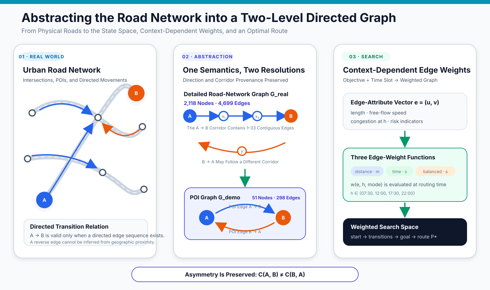

*Figure c.1. Abstraction of the road network into a two-resolution directed graph and objective-specific weighting mechanism. Each edge in \(G_{\text{demo}}\) represents a continuous corridor in \(G_{\text{real}}\); outbound and reverse directions are evaluated independently. Source: project team.*

### c.3. States, Initial State, Goal State, and Transition Rules

For point-to-point routing:

- **State space:** the node set of the selected graph.
- **Current state:** the node at which the courier is located.
- **Initial state:** the departure node selected by the user.
- **Goal state:** the destination node selected by the user.
- **Transition rule:** from \(u\), a transition to \(v\) is permitted if a directed edge \(u\rightarrow v\) exists.
- **Step cost:** the weight of edge \(u\rightarrow v\) under the selected objective and time slot.
- **Solution:** a node sequence \(P=(v_0,v_1,\ldots,v_k)\), where \(v_0\) is the initial state, \(v_k\) is the goal, and \((v_i,v_{i+1})\in E\) for every \(i\).

The cost of a path is the sum of its step costs:

\[
\operatorname{Cost}(P)=\sum_{i=0}^{k-1}w(v_i,v_{i+1}).
\]

For the multi-stop problem, the starting point remains fixed. For every ordered pair in the set containing the start and all required stops, the system computes the shortest-path cost under the same graph, time slot, and objective. These values form a directed cost matrix:

\[
C(a,b)=\min_{P:a\leadsto b}\sum_{e\in P}w(e).
\]

Because the graph is directed, \(C(a,b)\) is not assumed to equal \(C(b,a)\). Multi-stop optimization methods use this matrix to minimize the total cost of the visiting order; the operating principles and guarantees of those methods are presented separately in the Multi-Location Optimization section.

For an order \((p_0,p_1,\ldots,p_k)\), where \(p_0\) is the start, let \(\rho=1\) when the trip must return to the start and \(\rho=0\) otherwise. The objective is to minimize:

\[
J=\sum_{i=0}^{k-1}C(p_i,p_{i+1})
  +\rho C(p_k,p_0).
\]

By default, the trip is an open path that ends at the last stop. When the user requests a return to the start, the final term is included in the objective.

### c.4. Node, Edge, and Traffic-Profile Attributes

The attributes used by the model are summarized below.

| Entity | Attribute | Meaning and unit |
|---|---|---|
| Node | Identifier, name, type, latitude, longitude | Defines a state and geographic location; coordinates support display and heuristic computation |
| Edge | Edge identifier | Uniquely identifies an edge in the dataset |
| Edge | Tail and head nodes | Defines a directed transition |
| Edge | Road name and class | Describes the road; the class is also used to assign model speed and generate fallback congestion data |
| Edge | Length | Length of the road segment or corridor, in meters |
| Edge | Directionality relation | Indicates whether a reverse edge exists in the dataset |
| Edge | Free-flow speed | Model speed assigned by road class, in km/h |
| Edge | Free-flow travel time | Length divided by free-flow speed, in seconds |
| Edge | Four binary risk flags | Flooding, construction, narrow road, and traffic signal; each takes the value 0 or 1 |
| Traffic profile | Congestion level by edge and time slot | Integer from 1 to 5 at 07:30, 12:00, 17:30, and 22:00 |

The traffic profile is stored separately from the graph because topology and road attributes remain fixed across time slots whereas congestion changes over time. Every edge in each graph has exactly one congestion level for every time slot. Its effective weight is not stored as a fixed value; it is computed at routing time from length, speed, congestion level, and risk flags.

### c.5. Cost Function

#### c.5.1. Components

For an edge \(e\), let:

- \(l_e\) denote edge length, in meters;
- \(v_e\) denote the modeled free-flow speed, in km/h;
- \(c_e(h)\in\{1,2,3,4,5\}\) denote the congestion level in time slot \(h\); and
- \(r_f,r_c,r_n,r_l\in\{0,1\}\) denote the binary indicators for flooding, construction, narrow roads, and traffic signals, respectively.

The free-flow travel time of the edge is:

\[
t_e^0=\frac{l_e}{v_e/3.6}\quad[\text{seconds}].
\]

The congestion level is converted to a time multiplier:

\[
f_e(h)=1+\gamma\frac{c_e(h)-1}{4},\qquad \gamma=1.5.
\]

The five congestion levels therefore correspond to multipliers of \(1\), \(1.375\), \(1.75\), \(2.125\), and \(2.5\). Level 1 represents near-free-flow conditions; at level 5, the travel-time component of an edge is 2.5 times its free-flow travel time.

The risk penalty is expressed in seconds:

\[
P_e=60r_f+90r_c+30r_n+25r_l\quad[\text{seconds}].
\]

Specifically, a flooding flag adds 60 seconds, a construction flag adds 90 seconds, a narrow-road flag adds 30 seconds, and an edge entering a traffic-signal node adds 25 seconds. For flooding and construction zones, the flag is attached to an edge that crosses from outside into the modeled region. The cost is therefore charged once upon entry rather than on every segment within the region.

#### c.5.2. Three Optimization Objectives

The project does not treat distance as the sole criterion. It defines three edge-weight functions:

\[
w_{\text{distance}}(e)=l_e\quad[\text{meters}],
\]

\[
w_{\text{time}}(e,h)=t_e^0 f_e(h)\quad[\text{seconds}],
\]

\[
w_{\text{balanced}}(e,h)=t_e^0 f_e(h)+P_e\quad[\text{seconds}].
\]

Distance mode produces a reference route that is shortest in meters. Time mode minimizes congestion-adjusted travel time without adding risk penalties. Balanced mode adds those penalties, thereby favoring routes with a lower combined travel-time and risk cost. The penalty is added after the congestion multiplier is applied and is not itself multiplied by that factor.

This design avoids directly summing quantities with incompatible units. In balanced mode, travel time and risk penalties are both expressed in equivalent seconds, giving the total cost a consistent interpretation. Nevertheless, it remains a modeled cost rather than a field-calibrated estimated time of arrival (ETA).

#### c.5.3. Sources and Interpretation of Weights

Free-flow speeds, \(\gamma=1.5\), and the four penalties of 60/90/30/25 seconds are parameters designed by the team; they are neither statutory speed limits nor coefficients learned from an independently validated dataset. With \(\gamma=1.5\), the model provides an interpretable scale in which the highest congestion level makes the travel-time component 2.5 times its free-flow value. No independent evidence establishes this parameter as optimal.

The penalty ordering reflects the group's modeling priorities: construction receives the largest delay, followed by flooding, narrow roads, and traffic signals. Their magnitudes place risk indicators in the same unit as travel time so that they can affect route selection, but they have not been estimated from field observations or surveys of courier behavior.

A post hoc analysis of the 160 stored TomTom records yielded \(\hat{\gamma}=1.238\), approximately 17.5% below the design value. However, the congestion levels in that calculation were themselves discretized from the same records' speed ratios. The result therefore indicates only internal consistency between the discretization rule and the time multiplier; it is not an independent calibration against end-to-end travel time. The system continues to use \(\gamma=1.5\), and no corresponding calibration data exist for the risk penalties.

#### c.5.4. Effect of Congestion on Route Choice

Congestion does not affect distance weights. Given the same graph structure and tie-breaking rules, the distance-optimal route therefore remains unchanged across time slots. In time and balanced modes, by contrast, every edge has a time-slot-dependent multiplier. When congestion changes unevenly across edges, the relative costs of candidate paths also change; a longer but less congested corridor may be selected instead of a shorter, heavily congested one. Balanced mode additionally incorporates risk penalties. This mechanism satisfies the requirement that traffic conditions at a given time can alter the final route.

### c.6. Heuristic Function and Validity Conditions

A detailed proof appears in the Algorithm Principles section. Using a lower bound that does not exceed the remaining optimal cost is consistent with the theoretical foundation of optimal heuristic search (Hart et al., 1968).

In the current model, the distance heuristic is the Haversine distance from the current node to the goal. In time and balanced modes, this distance is divided by the maximum speed of the selected graph; the maximum is 45 km/h in both current base graphs. The heuristic uses only node coordinates and the speed upper bound, not congestion, risk, or road names.

The heuristic is admissible and consistent under the conditions maintained by the dataset: every edge length is at least the Haversine distance between its endpoints, no edge speed exceeds the maximum used by the heuristic, every congestion multiplier is at least 1, and all penalties are non-negative. This conclusion applies to graphs satisfying those conditions, not to an arbitrary graph.

## d. Dataset

### d.1. Design Method and Data Scope

The study adopts a **hybrid data-integration strategy** that combines pre-processed open-map data, observed traffic samples, team-developed data, and reproducible simulation components. This approach preserves the directed connectivity of the urban road network while producing a dataset suitable for both algorithmic evaluation and search-process visualization.

The dataset's defining feature is not a claim to reproduce the complete real-world traffic state, but its **source traceability** and **consistency across two graph resolutions**. Each POI-graph edge is linked to a directed corridor in the detailed road-network graph; distance, time, congestion, and risk are therefore aggregated from the same edge sequence rather than assigned independently.

The dataset comprises two graphs and their corresponding traffic profiles. Its principal characteristics are summarized below.

| Attribute | \(G_{\text{real}}\) | \(G_{\text{demo}}\) |
|---|---:|---:|
| Purpose | Algorithm evaluation over a large state space | Visualization, explanation, and routing between POIs |
| Nodes | 2,118 road-network nodes | 51 POIs |
| Directed edges | 4,699 | 298 |
| Structurally one-way edges | 1,433 | 60 |
| Edges with a flooding flag | 54 | 24 |
| Edges with a construction flag | 19 | 24 |
| Edges with a narrow-road flag | 8 | 0 |
| Edges entering a traffic-signal node | 185 | 130 |
| Edge-length range | 1.1–1,682.3 m | 23.0–2,775.6 m |
| Speed range present in the data | 25–45 km/h | 30–45 km/h |
| Rounded free-flow travel-time range | 0.1–134.6 s | 1.8–270.8 s |
| Number of time slots | 4 | 4 |
| Connectivity | Strongly connected | Strongly connected |

Both graphs use the WGS 84 coordinate reference system (EPSG:4326) and the same geographic bounding box, \([106.68;10.76;106.72;10.80]\), ordered as western longitude, southern latitude, eastern longitude, and northern latitude. This extent covers part of the central area and does not represent the whole of Ho Chi Minh City.

### d.2. Locations in the POI Graph

Road-network nodes in \(G_{\text{real}}\) have no location names and are therefore not presented as a POI catalog. \(G_{\text{demo}}\) contains an interactive list of 51 POIs. The names below correspond to the locations represented in the dataset.

| Location group | Count | Locations |
|---|---:|---|
| Designated depot | 1 | Saigon Central Post Office |
| Hospitals | 3 | Children's Hospital 2; Ho Chi Minh City Eye Hospital; Tu Du Hospital |
| Educational institutions | 7 | University of Architecture Ho Chi Minh City; University of Economics Ho Chi Minh City; Le Quy Don High School; Marie Curie High School; Nguyen Thi Minh Khai High School; Ho Chi Minh City Open University; University of Science (Nguyen Van Cu campus) |

The remaining forty landmarks are arranged in two columns to remain easy to locate when the report is exported to PDF.

| No. | Landmark | No. | Landmark |
|---:|---|---:|---|
| 1 | Ben Thanh Market | 21 | Jade Emperor Pagoda |
| 2 | Notre-Dame Cathedral Basilica of Saigon | 22 | Le Van Tam Park |
| 3 | Independence Palace | 23 | Tan Dinh Market |
| 4 | Turtle Lake | 24 | Tan Dinh Church |
| 5 | Tao Dan Park | 25 | Kieu Bridge |
| 6 | Bitexco Financial Tower | 26 | Vinh Nghiem Pagoda |
| 7 | Saigon Opera House | 27 | Xa Loi Pagoda |
| 8 | Ho Chi Minh City People's Committee Headquarters | 28 | War Remnants Museum |
| 9 | Saigon Centre (Takashimaya) | 29 | Democracy Roundabout |
| 10 | Me Linh Square | 30 | Labor Culture Palace |
| 11 | Bach Dang Wharf | 31 | Ho Chi Minh City Museum |
| 12 | Mong Bridge | 32 | Ho Chi Minh City Museum of Fine Arts |
| 13 | Ho Chi Minh Museum (Nha Rong Wharf) | 33 | Ham Nghi Transfer Point |
| 14 | Ba Son Bridge | 34 | 23/9 Park |
| 15 | Saigon Zoo and Botanical Gardens | 35 | Mariamman Hindu Temple |
| 16 | Ho Chi Minh City Museum of History | 36 | Bui Vien Walking Street |
| 17 | HTV Television Station | 37 | Thai Binh Market |
| 18 | Hoa Lu Stadium | 38 | Ong Lanh Bridge |
| 19 | Youth Cultural House | 39 | Calmette Bridge |
| 20 | Da Kao Market | 40 | Nancy Market |

The POI names, types, and input coordinates were selected manually by the team. Each POI was matched to a distinct node in \(G_{\text{real}}\) to create a routable location. The distance from an input coordinate to its selected node ranges from 2.70 m to 185.74 m, with a median of 46.14 m. Five POIs have a snapping distance greater than 100 m: Independence Palace (185.74 m), Tao Dan Park (154.2 m), Ba Son Bridge (139.9 m), Labor Culture Palace (116.7 m), and Ho Chi Minh Museum–Nha Rong Wharf (105.8 m). Tan Dinh Church is the only case assigned to the second-nearest node, 72.46 m away, to prevent two POIs from sharing a node within the 120-m threshold. These distances evaluate POI-to-node matching; they do not establish that the input coordinates or physical entrances are field-accurate.

### d.3. Data Sources and Provenance

#### d.3.1. Source Classification

| Data group | Source and scale/coverage | Nature and role in the model |
|---|---|---|
| Connectivity, coordinates, road length, class, and name | OpenStreetMap via OSMnx; 2,118 nodes and 4,699 edges after processing | Derived and simplified open-map data |
| Traffic signals | OpenStreetMap node tags; propagated to 185 edges in \(G_{\text{real}}\) and 130 in \(G_{\text{demo}}\) | Binary flag for an edge entering a traffic-signal node |
| Congestion at sampled points | TomTom Flow Segment Data; 4 time slots × 40 records, assigned to 635 edges per time slot | Observed traffic component |
| Congestion on portions of the network not covered by samples | Simulation rules with fixed pseudorandom seed 42; 4,064 edges per time slot | Reproducible simulated fallback component |
| Delivery stops | Team-selected and entered coordinates; 51 POIs | Manual data subsequently matched to nodes in \(G_{\text{real}}\) |
| Flooding and construction zones | Eight circular regions modeled by the team: 5 flooding and 3 construction zones | Risk scenarios; external sources support historical context only |
| Speeds by road class, congestion coefficient, and risk penalties | Team-designed parameters applied across the edge set | Model configuration, not measurements or statutory limits |
| POI edges and aggregated attributes | 298 directed corridors; each comprises 1–33 road-network edges | Data derived from \(G_{\text{real}}\) |

OpenStreetMap is open data licensed under the ODbL (OpenStreetMap contributors, n.d.). OSMnx 2.1.1 was used to load, simplify, and transform road data into a network graph, following established OSMnx road-network modeling practice (Boeing, 2025). Traffic-sample speed fields were interpreted according to the Flow Segment Data specification (TomTom, n.d.-a).

#### d.3.2. OpenStreetMap and Construction of \(G_{\text{real}}\)

The source closest to the original OSM data is an Overpass response with base timestamp 2026-07-26T11:45:05Z. It contains 19,864 elements: 15,959 nodes and 3,905 ways. From this response, OSMnx constructs the drivable road network within the specified geographic area, simplifies its topology, and retains the largest strongly connected component.

After OSMnx processing, the intermediate representation is a directed multigraph with 2,118 nodes and 4,721 edges. Because it has already been simplified and filtered to a connectivity component, it is not raw OSM data. Standardization removes two self-loops, consolidates parallel edges sharing the same ordered endpoints, and assigns stable identifiers, producing \(G_{\text{real}}\) with 4,699 edges. Node coordinates, edge lengths, road classes, road names, and traffic-signal information are derived from OSM. Free-flow speed, by contrast, does not use OSM's speed-limit field; it is assigned from the team's configuration table.

This reduction makes the graph compatible with the search algorithms but discards some source information, including OSM identifiers, detailed road geometry, lane counts, access and turn restrictions, and alternatives among merged parallel roads. \(G_{\text{real}}\) must therefore be described as a directed graph processed from OSM rather than as raw OSM data.

#### d.3.3. TomTom and the Hybrid Traffic Profile

The project contains four TomTom extracts, each with 40 valid records and only a selected subset of fields. The retained data comprise query coordinates, current speed, free-flow speed, functional road class, and the batch collection timestamp; they are not complete copies of the API responses.

Forty query points were selected offline from major-road edges in \(G_{\text{real}}\): edges were sorted by decreasing length, the tail-node coordinate was used, and duplicates were removed on a coordinate grid rounded to three decimal places. The stored coordinates are therefore the query points sent to TomTom, not coordinates of road segments returned by TomTom.

The four batches were recorded as follows:

| Representative time slot | Stored batch collection timestamp | Records |
|---|---:|---:|
| 07:30 | 2026-07-27 07:40:03 | 40 |
| 12:00 | 2026-07-27 12:49:57 | 40 |
| 17:30 | 2026-08-03 17:30:01 | 40 |
| 22:00 | 2026-08-03 22:27:52 | 40 |

The first two and final two extracts were collected on Mondays seven days apart. They are representative time-slot observations, not a same-day time series and not a real-time feed. Each timestamp was recorded once for an entire batch without timezone information and should not be interpreted as an individual timestamp for every query.

The ratio of current speed to free-flow speed is converted into a congestion level:

| Speed ratio \(r\) | Congestion level |
|---:|---:|
| \(r\geq0.85\) | 1 |
| \(0.70\leq r<0.85\) | 2 |
| \(0.55\leq r<0.70\) | 3 |
| \(0.40\leq r<0.55\) | 4 |
| \(r<0.40\) | 5 |

After conversion, only the resulting level from 1 to 5 is stored. TomTom speeds do not replace the configured free-flow speed of an edge in cost calculations.

TomTom samples are assigned only to edges in the major-road group whose tail node lies within 250 m of the nearest query point. Assignment does not match road name, functional road class, travel direction, or road geometry. The functional-class field is retained for documentation but does not participate in assignment or cost computation. In each time slot, 635 of 4,699 edges in \(G_{\text{real}}\)—approximately 13.51%—receive congestion levels from TomTom samples; the remaining 4,064 edges, or 86.49%, use simulated fallback data.

The fallback data use **pseudorandom seed 42** for reproducibility. At 07:30 and 17:30, *primary*/*trunk* roads receive a base level of 4–5, *secondary* roads 3–4, *tertiary* roads 2–4, and other roads 2–3. Independently for each edge and peak period, there is a 10% probability of increasing the level by one, capped at 5, to simulate a local disruption. In the fallback component, the 12:00 level is the 07:30 fallback level minus 1, floored at 1; the 22:00 level is drawn from 1–2. The resulting traffic profile is therefore **TomTom plus simulated fallback data**, not traffic observed over the entire network.

Congestion levels for \(G_{\text{demo}}\) are not generated independently. For every POI edge and time slot, the level is the free-flow-travel-time-weighted average of the \(G_{\text{real}}\) edge levels in that corridor, rounded to an integer from 1 to 5 under the rule that a fractional part of 0.5 rounds up. The traffic data are therefore consistent across the two graph resolutions.

#### d.3.4. Risk Data

The model contains five flooding zones and three construction zones. The centers and radii below are modeling geometries defined by the team. Public sources document only the historical context of each road or area; they do not validate the exact center, radius, penalty, or current condition.

| Type | Area; center (latitude; longitude); model radius | Historical-context source |
|---|---|---|
| Flooding | Nguyen Huu Canh Street; (10.7925; 106.7190); 400 m | (Ho Chi Minh City People's Committee, 2016) |
| Flooding | Dinh Tien Hoang Street near Bong Bridge; (10.7955; 106.6985); 250 m | (Nhan Dan Newspaper, 2005) |
| Flooding | Cong Quynh Street near Tu Du Hospital; (10.7680; 106.6870); 250 m | (Vietnam News Agency, 2024) |
| Flooding | Calmette–Ben Chuong Duong/Vo Van Kiet area; (10.7648; 106.6975); 250 m | (Vietnam News Agency, 2025) |
| Flooding | Tran Hung Dao Street, Bui Vien area; (10.7625; 106.6890); 300 m | (Tien Phong Newspaper, 2025) |
| Construction | Le Thanh Ton Street in front of Ben Thanh Market; (10.7730; 106.6990); 150 m | (VnExpress, 2024) |
| Construction | Hai Ba Trung/Tan Dinh area; (10.7890; 106.6905); 200 m | (Tran, 2013) |
| Construction | Vo Thi Sau–Pasteur intersection; (10.7860; 106.6890); 200 m | (Ben Thanh Water Supply Joint Stock Company, 2021) |

In \(G_{\text{real}}\), a flooding or construction flag is created when an edge crosses from outside into the corresponding circle. If a route begins inside the circle, the model does not charge an entry penalty at the initial state. The narrow-road flag is inferred from road class rather than an observed width, while the traffic-signal flag is derived from an OSM node bearing a traffic-signal tag. In \(G_{\text{demo}}\), the flooding, construction, or traffic-signal flag is 1 if at least one edge in the corridor has the corresponding flag; the narrow-road flag is 1 when more than 30% of the corridor length is marked as narrow.

### d.4. Data-Creation Pipeline

The data pipeline consists of four stages:

1. **Construct \(G_{\text{real}}\).** OpenStreetMap data for the geographic region are loaded through OSMnx and simplified; the largest strongly connected component is retained; self-loops are removed; parallel edges are consolidated; attributes are normalized; and risk flags are added.
2. **Create the congestion profile for \(G_{\text{real}}\).** Speed ratios from the four TomTom extracts are converted to congestion levels and assigned to major-road edges. Edges that do not receive an observed level are populated by the fallback rules using pseudorandom seed 42.
3. **Construct \(G_{\text{demo}}\).** The 51 manually selected POIs are matched to \(G_{\text{real}}\). Directed paths between neighboring POIs are contracted into POI edges that inherit aggregated length, equivalent speed, dominant road class, and risk flags.
4. **Create the congestion profile for \(G_{\text{demo}}\) and use the snapshots.** The level for each POI corridor is aggregated from the \(G_{\text{real}}\) profile. At routing time, the system reads the stored graph and profile and computes effective weights; it makes no OpenStreetMap or TomTom request.

The pipeline separates data collection from route computation. This makes experiments and demonstrations on fixed data reproducible, but also means that traffic information is not updated in real time.

The following diagram summarizes the relationship among the data sources, construction of \(G_{\text{real}}\) and \(G_{\text{demo}}\), traffic profiles, the directed-edge model, and the three cost functions used in the study.

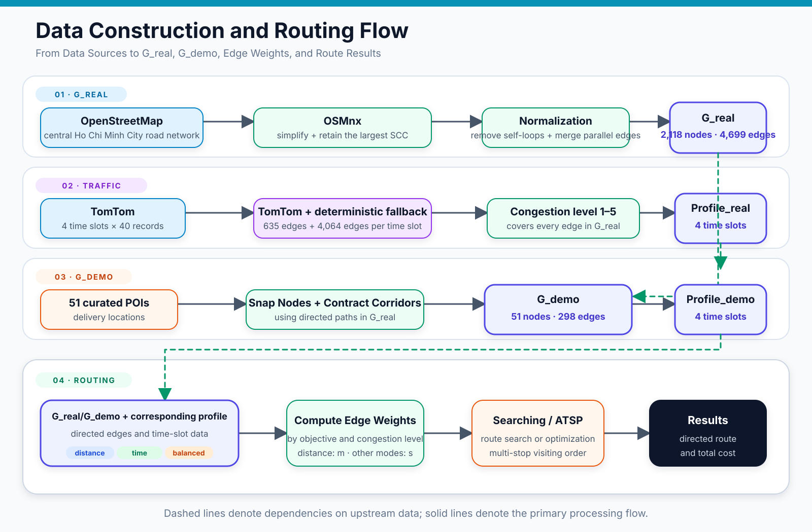

*Figure d.1. Integration of data sources, construction of two graph resolutions, and computation of routing weights. Source: project team.*

### d.5. Distance, Time, Congestion, Road Class, and Risk Values

#### d.5.1. Road Class and Modeled Speed

Road class originates from the *highway* attribute in the OSM classification system. The team configured the following speeds to convert length into free-flow travel time.

| Road-class group | Modeled speed |
|---|---:|
| `motorway` and `motorway_link` | 60 km/h |
| `trunk`, `primary` and corresponding `_link` grades | 45 km/h |
| `secondary` and `secondary_link` | 40 km/h |
| `tertiary` and `tertiary_link` | 35 km/h |
| `unclassified`, `residential`, `road` or default type | 30 km/h |
| `living_street`, `service`, `alley`, `track` | 25 km/h |

In \(G_{\text{real}}\), speed is assigned directly from the configuration table. In \(G_{\text{demo}}\), equivalent speed is computed as total corridor length divided by total corridor free-flow travel time; it is not reassigned from the dominant road class and is stored after rounding to 0.1 km/h.

The current dataset contains no edges in the *motorway* group, so the speeds actually present in \(G_{\text{real}}\) range from 25 to 45 km/h. The distribution of edges by road class is shown below.

| Road class | \(G_{\text{real}}\) | \(G_{\text{demo}}\) |
|---|---:|---:|
| `residential` | 2,220 | 27 |
| `tertiary` and `tertiary_link` | 975 | 84 |
| `primary` and `primary_link` | 985 | 121 |
| `secondary` and `secondary_link` | 478 | 66 |
| `trunk` and `trunk_link` | 33 | 0 |
| `living_street` | 8 | 0 |

For a POI edge, the recorded road class is the class occupying the greatest total length in the corridor; it does not necessarily describe every constituent segment.

#### d.5.2. Interpretation of Values

- **Distance** is the length of a road segment or the aggregate length of a corridor, in meters; it is not the straight-line distance between two POIs.
- **Free-flow travel time** is derived from configured length and speed. The descriptive stored value is rounded to 0.1 seconds, whereas cost computation uses the exact length-to-speed ratio.
- **Congestion** is a discrete level from 1 to 5 in each of four time slots, not a speed in km/h or a probability. It changes time and balanced costs but not distance cost.
- **Road class** describes the standardized road layer. It is used to assign speed and generate fallback data but is not added directly as an independent cost term.
- **Risk** comprises four binary flags. These affect only balanced cost; they do not represent the probability, severity, or current status of an incident.

### d.6. Internal-Consistency Evaluation

The final dataset was tested for structural validity, coverage, and consistency between the two resolutions. The results are summarized below.

| Validation criterion | Result on the final dataset |
|---|---|
| Counts and identifiers | Declared node/edge counts match the data; edge identifiers and ordered endpoint pairs are unique |
| Edge validity | No self-loops; every tail and head node exists |
| Reachability | Both \(G_{\text{real}}\) and \(G_{\text{demo}}\) are strongly connected |
| Traffic-profile coverage | 100% of edges have exactly one level in every time slot; no edge identifier is missing or extraneous |
| POI-corridor provenance | All 298/298 edges in \(G_{\text{demo}}\) map to non-empty, continuous corridors in \(G_{\text{real}}\) |
| Distance stretch | Maximum ratio across the two resolutions is 1.57, below the test threshold of 1.8 |
| Time and balanced-cost stretch | Maximum ratio across the four time slots is 1.50, not exceeding the test threshold of 1.5 |
| Geometric condition for the heuristic | Every edge length is at least the Haversine distance between its endpoints |

These checks establish internal consistency. Together with the fixed pipeline and defined seed, they support dataset reproducibility. They do not prove that every value accurately represents real-world traffic at the time of use.

### d.7. Modeling Assumptions

The principal modeling assumptions are stated explicitly to distinguish them from observed data.

1. **Geographic scope:** the bounded central area is sufficient to illustrate the problem; locations outside it are not modeled.
2. **Road-network type:** the OSM network for motor vehicles is used as the base. Small motorcycle-accessible alleys may not be fully represented.
3. **Connectivity:** the largest strongly connected directed component is retained so that every point in the dataset is reachable from every other point.
4. **State and transition:** a state contains only the current node; the model does not retain the incoming edge, heading, or turn state.
5. **Free-flow speed:** speed by road class is a representative configuration, not a statutory speed limit or an edge-specific observation.
6. **Traffic:** the four time slots are treated as representative fixed snapshots within a query. Edges without samples are assigned levels by rules with a fixed pseudorandom seed.
7. **Map matching:** for major-road edges, a sample within 250 m of the edge's tail node is assumed to represent that edge.
8. **POIs:** input names, types, and coordinates are manually selected; the snapped road-network node is assumed to represent the delivery stop.
9. **Risk:** flooding and construction are modeled as circular regions and risk is represented by binary flags. The four penalty values are conventional, uncalibrated equivalent delays defined by the team.
10. **POI graph:** the shortest corridor by free-flow travel time is assumed to represent the connection between two POIs; the dominant road name and class describe the entire corridor.
11. **Cost:** path cost is the sum of edge costs, which remain fixed while a query runs. The model includes no interaction among vehicles, spillback queues, or time-dependent entry into each edge.
12. **Multi-stop problem:** outbound and return travel are independent; the start is fixed, and the default open trip need not return to the depot.

## e. Principles of Point-to-Point Route-Search Algorithms

This section presents the theoretical foundations of the nine point-to-point route-search algorithms implemented in the system: Breadth-First Search (BFS), Depth-First Search (DFS), Iterative Deepening Depth-First Search (IDDFS), Uniform-Cost Search (UCS), Greedy Best-First Search, A*, Bidirectional Dijkstra, Iterative Deepening A* (IDA*), and Beam Search. Each algorithm is analyzed using the same structure: operating principle, data structure, pseudocode, complexity, an illustrative example, and the conditions for completeness and optimality.

This section is limited to routing queries between one start and one goal. Optimization of the visiting order across multiple locations is addressed separately in the Multi-Location Optimization section.

### e.1. Problem Statement and Notation

The road network is modeled as a directed graph \(G=(V,E)\), where each node \(v\in V\) represents a location or road-network vertex and each directed edge \(e=(u,v)\in E\) represents a valid movement from \(u\) to \(v\). The existence of \((u,v)\) does not imply the existence of \((v,u)\); the model therefore preserves one-way-road semantics and the asymmetric costs of an urban road network.

Given a start \(s\), a goal \(t\), and a weight function \(w\), a valid path is written as

\[
P=(s=v_0,v_1,\ldots,v_k=t),
\]

with \((v_i,v_{i+1})\in E\) for all \(0\le i<k\). The cost of the path is

\[
C(P)=\sum_{i=0}^{k-1}w(v_i,v_{i+1}).
\]

For cost-optimized algorithms, the goal is to find

\[
P^*=\underset{P:s\leadsto t}{\arg\min}\;C(P),
\qquad C^*=C(P^*).
\]

The three quantities used by informed search algorithms are:

- \(g(n)\): the actual cost accumulated from \(s\) to node \(n\);
- \(h(n)\): a lower-bound estimate of the remaining cost from \(n\) to \(t\); and
- \(f(n)=g(n)+h(n)\): an estimate of the total cost of a solution passing through \(n\).

In the complexity analysis, \(|V|\) and \(|E|\) denote the numbers of nodes and edges, respectively; \(b\) is the branching factor; \(d\) is the depth of the shallowest solution; \(k\) is the beam width; and \(Q\) is the maximum number of pending state records in an explicit stack. The bounds below characterize search work; recording and serializing the complete visualization trace may increase actual time and memory consumption.

#### e.1.1. Optimized Cost Function

For an edge \(e\), let \(\ell(e)\) be its length in meters, \(v(e)\) its free-flow speed in m/s, and \(c(e,h)\in\{1,2,3,4,5\}\) its congestion level in representative time slot \(h\). Free-flow travel time and the congestion multiplier are, respectively,

\[
t_{\mathrm{free}}(e)=\frac{\ell(e)}{v(e)},
\qquad
f_{\mathrm{cong}}(e,h)=1+1.5\frac{c(e,h)-1}{4}.
\]

The non-negative risk penalty is modeled as

\[
p(e)=60I_{\mathrm{flood}}+90I_{\mathrm{construction}}
     +30I_{\mathrm{narrow}}+25I_{\mathrm{traffic\ signal}}.
\]

The three optimization modes use the following weights:

\[
\begin{aligned}
w_{\mathrm{distance}}(e)&=\ell(e) &&[\mathrm{m}],\\
w_{\mathrm{time}}(e,h)&=t_{\mathrm{free}}(e)f_{\mathrm{cong}}(e,h)
&&[\mathrm{s}],\\
w_{\mathrm{balanced}}(e,h)&=t_{\mathrm{free}}(e)f_{\mathrm{cong}}(e,h)+p(e)
&&[\mathrm{s}].
\end{aligned}
\]

Thus, `distance` minimizes distance; `time` minimizes congestion-adjusted travel time; and `balanced` jointly accounts for travel time, congestion, and risk factors. All weights in the current dataset are positive, an essential premise for the guarantees provided by UCS, A*, and Bidirectional Dijkstra.

### e.2. Common Illustrative Graph

To compare all algorithms under identical conditions, every worked example in this section uses the same directed subgraph of seven locations in central Ho Chi Minh City. The start is Ben Thanh Market (A), the goal is Bitexco Financial Tower (G), the cost mode is `balanced`, and the representative traffic slot is 07:30. These values are not live traffic measurements at execution time.

| Symbol | Location | \(h(n)\) to G (seconds) |
|---|---|---:|
| A | Ben Thanh Market | 58.6 |
| B | Ho Chi Minh City Museum of Fine Arts | 44.4 |
| C | Saigon Centre | 34.7 |
| D | Mariamman Hindu Temple | 73.9 |
| E | Ham Nghi Transfer Point | 30.2 |
| F | 23/9 Park | 88.9 |
| G | Bitexco Financial Tower | 0.0 |

The following diagram contains the arcs that directly determine the illustrated expansion sequences. The complete adjacency list follows it.

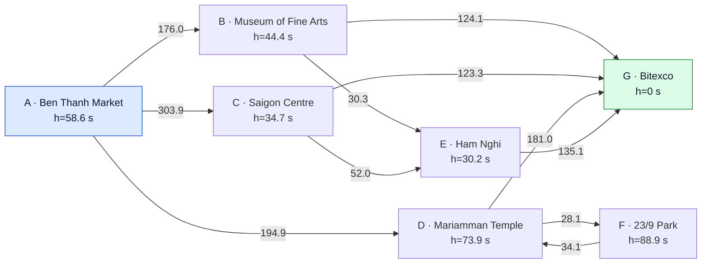
```mermaid
flowchart LR
    A["A · Ben Thanh Market<br/>h=58.6 s"]
    B["B · Museum of Fine Arts<br/>h=44.4 s"]
    C["C · Saigon Centre<br/>h=34.7 s"]
    D["D · Mariamman Temple<br/>h=73.9 s"]
    E["E · Ham Nghi<br/>h=30.2 s"]
    F["F · 23/9 Park<br/>h=88.9 s"]
    G["G · Bitexco<br/>h=0 s"]

    A -->|176.0| B
    A -->|303.9| C
    A -->|194.9| D
    B -->|30.3| E
    B -->|124.1| G
    C -->|52.0| E
    C -->|123.3| G
    D -->|28.1| F
    D -->|181.0| G
    E -->|135.1| G
    F -->|34.1| D

    classDef start fill:#dbeafe,stroke:#1d4ed8,color:#0f172a;
    classDef goal fill:#dcfce7,stroke:#15803d,color:#0f172a;
    class A start;
    class G goal;
```

**Figure e.1.** Compact illustrative graph; each edge label is a balanced cost in seconds. Arrows denote valid travel directions.

| Node | Outgoing edges and balanced costs (seconds) |
|---|---|
| A | B: 176.0; C: 303.9; D: 194.9 |
| B | A: 104.6; C: 223.2; D: 155.5; E: 30.3; G: 124.1 |
| C | A: 99.2; D: 122.8; E: 52.0; G: 123.3 |
| D | A: 100.3; B: 91.6; C: 230.0; F: 28.1; G: 181.0 |
| E | B: 30.3; G: 135.1 |
| F | D: 34.1 |
| G | A: 136.9; C: 227.2; D: 160.5; E: 89.7 |

Within this subgraph, edges B→C, B→G, C→E, and G→A exist in only one direction. The optimal balanced-cost solution is

\[
A\rightarrow B\rightarrow G,
\qquad C^*=176.0+124.1=300.1\ \mathrm{s}.
\]

The displayed values are rounded to 0.1 seconds; the system uses full-precision floating-point values for comparisons and decisions.

### e.3. Geospatial Heuristic Function

#### e.3.1. Design Objectives

A suitable heuristic for this problem must satisfy four requirements:

1. operate directly on node latitude–longitude coordinates;
2. use the same unit as the optimized cost function;
3. never overestimate the remaining optimal cost; and
4. remain valid in the presence of one-way roads, congestion, and risk penalties.

The Haversine formula was chosen because it measures the great-circle distance between two coordinates on the Earth's surface. For latitude \(\varphi\), longitude \(\lambda\), and Earth radius \(R=6{,}371{,}000\ \mathrm{m}\), define

\[
\begin{aligned}
\Delta\varphi &= \varphi_t-\varphi_n,\\
\Delta\lambda &= \lambda_t-\lambda_n,\\
a &= \sin^2\!\left(\frac{\Delta\varphi}{2}\right)
   +\cos\varphi_n\cos\varphi_t
    \sin^2\!\left(\frac{\Delta\lambda}{2}\right).
\end{aligned}
\]

The Haversine distance is

\[
d_H(n,t)=2R\arcsin(\sqrt{a}).
\]

The heuristic is then defined for each mode as

\[
h(n)=
\begin{cases}
d_H(n,t), & \text{if distance optimization},\\[4pt]
\dfrac{d_H(n,t)}{v_{\max}}, & \text{if time optimization or balance},
\end{cases}
\]

where \(v_{\max}=\max_{e\in E}v(e)\) is computed on the exact graph view being searched. In both current base graphs, \(v_{\max}=45\ \mathrm{km/h}\); in the seven-node subgraph, it is approximately \(43\ \mathrm{km/h}\). Recomputing \(v_{\max}\) for the active graph view preserves the heuristic's unit and lower-bound property as graph scope changes.

#### e.3.2. Why Use Haversine Rather Than Other Distance Measures?

| Candidate | Assessment for this problem |
|---|---|
| Haversine | Direct geographic distance between two coordinates; requires no projection; satisfies the triangle inequality; provides a natural lower bound on actual road length. |
| Euclidean distance on raw latitude–longitude | Treats two angular quantities as planar coordinates, does not produce meters, and misrepresents the longitude-to-latitude scale; it is unsuitable without an appropriate projection and error analysis. |
| Euclidean distance after projection | Can be used over a small region if a suitable coordinate reference system is selected and the lower-bound error is established. It introduces projection dependence, whereas Haversine operates directly on the stored coordinates. |
| Manhattan distance | Better suited to an orthogonal grid with fixed travel axes. Ho Chi Minh City's road network is irregular, and \(L_1\) distance may exceed geographic distance; direct use therefore risks overestimation. |
| Precomputed road distance or all-pairs shortest-path table | May provide a tighter bound but requires substantial preprocessing and memory; validity must also be maintained whenever the weight mode, time slot, or traffic scenario changes. |

Haversine is therefore not used on the assumption that a vehicle travels in a straight line. It is used because it provides a **geometric lower bound** independent of road direction, congestion, and risk: geographic straight-line distance is no greater than the length of any valid road path between the same endpoints.

#### e.3.3. Proof of Consistency

A heuristic is **consistent** if \(h(t)=0\) and, for every edge \((u,v)\),

\[
h(u)\le w(u,v)+h(v).
\]

The proof uses three lemmas.

**Lemma 1—road length is no less than geographic distance.** For every edge \(e=(u,v)\),

\[
\ell(e)\ge d_H(u,v).
\]

Here, \(d_H(u,v)\) is the shortest great-circle distance between the two coordinates, whereas \(\ell(e)\) is the length of a particular real-road corridor connecting them.

**Lemma 2—triangle inequality.** Haversine distance is a metric on the sphere, so

\[
d_H(u,t)\le d_H(u,v)+d_H(v,t).
\]

**Lemma 3—lower bound on time-based weights.** Because \(v(e)\le v_{\max}\), \(f_{\mathrm{cong}}(e,h)\ge1\), and \(p(e)\ge0\),

\[
\begin{aligned}
w_{\mathrm{balanced}}(e,h)
&\ge w_{\mathrm{time}}(e,h)
\ge t_{\mathrm{free}}(e)\\
&=\frac{\ell(e)}{v(e)}
\ge\frac{\ell(e)}{v_{\max}}
\ge\frac{d_H(u,v)}{v_{\max}}.
\end{aligned}
\]

**Distance objective.** From Lemmas 1 and 2,

\[
\begin{aligned}
h(u)&=d_H(u,t)\\
&\le d_H(u,v)+d_H(v,t)\\
&\le \ell(u,v)+h(v)
=w_{\mathrm{distance}}(u,v)+h(v).
\end{aligned}
\]

**Time or balanced objective.** Divide the triangle inequality by \(v_{\max}>0\), then apply Lemma 3:

\[
\begin{aligned}
h(u)&=\frac{d_H(u,t)}{v_{\max}}\\
&\le\frac{d_H(u,v)}{v_{\max}}
  +\frac{d_H(v,t)}{v_{\max}}\\
&\le w(u,v)+h(v).
\end{aligned}
\]

Furthermore, \(h(t)=d_H(t,t)=0\). The heuristic is therefore consistent in all three cost modes.

#### e.3.4. Proof of Admissibility

A heuristic is **admissible** if

\[
0\le h(n)\le h^*(n)
\]

for every \(n\), where \(h^*(n)\) is the true optimal cost from \(n\) to the goal. Consider an optimal path \(n=v_0\rightarrow v_1\rightarrow\cdots\rightarrow v_m=t\). Applying consistency successively along its edges gives

\[
\begin{aligned}
h(v_0)&\le w(v_0,v_1)+h(v_1)\\
&\le w(v_0,v_1)+w(v_1,v_2)+h(v_2)\\
&\le\cdots\le\sum_{i=0}^{m-1}w(v_i,v_{i+1})+h(t)\\
&=h^*(v_0).
\end{aligned}
\]

Consequently, consistency implies admissibility. If a node cannot reach the goal, then \(h^*(n)=+\infty\), and the inequality remains valid.

#### e.3.5. Implications for A*, Greedy Best-First Search, and IDA*

- A* uses both \(g\) and \(h\). Consistency ensures that when a node is removed with minimum \(f\), its \(g\)-cost is optimal; closed-set handling and the goal-removal test are therefore sound for optimal search (Hart et al., 1968).
- Greedy Best-First Search uses the same \(h\) but ignores \(g\). An admissible heuristic cannot make this method optimal because its selection rule does not evaluate total solution cost.
- IDA* uses \(f=g+h\) as a cutoff. Admissibility ensures that a branch capable of containing a good solution is not pruned by an overestimated lower bound; the configured \(\varepsilon\)-increment and its additive quality bound are discussed in Section e.11.

#### e.3.6. Worked Example for \(g\), \(h\), and \(f\)

After expanding A, the first three candidates have the following values:

| Candidate | \(g(n)\) (s) | \(h(n)\) (s) | \(f(n)=g(n)+h(n)\) (s) |
|---|---:|---:|---:|
| B | 176.0 | 44.4 | 220.4 |
| C | 303.9 | 34.7 | 338.6 |
| D | 194.9 | 73.9 | 268.8 |

Greedy Best-First Search selects C because \(h(C)=34.7\) is smallest. A*, by contrast, selects B because \(f(B)=220.4\) is smallest. From B, A* discovers E with \(g(E)=206.3\), \(h(E)=30.2\), and \(f(E)=236.5\), while also obtaining a path to G with \(g(G)=300.1\). The example illustrates the distinct roles of \(g\), \(h\), and \(f\): \(h\) provides geographic guidance, whereas \(g\) prevents the algorithm from disregarding cost already incurred.

#### e.3.7. Notable Aspects of the Heuristic Design

Haversine distance divided by a speed upper bound is a classical lower bound and is not claimed as a mathematically novel heuristic. The noteworthy contribution is its integration with this traffic model: the heuristic is normalized to the unit of each objective, \(v_{\max}\) is derived from the active graph view, penalties remain non-negative, and edge lengths are preserved so that they do not fall below Haversine distance after data rounding. Combining a theoretical proof with executable data invariants helps ensure that A*'s guarantee holds not only abstractly but also under the arithmetic of the implemented model.

### e.4. Breadth-First Search (BFS)

#### e.4.1. Operating Principle

BFS expands the state space level by level. A first-in, first-out (FIFO) queue ensures that all nodes one edge from \(s\) are considered before nodes two edges away, and so forth. Edge weights do not influence the expansion order; the algorithm intrinsically minimizes the number of edges in a path (Russell & Norvig, 2021).

**Data structures:** a FIFO queue, a visited set, and a parent map for path reconstruction.

```text
BFS(s, t):
    queue ← [s]; visited ← {s}
    while queue is not empty:
        u ← remove the front element of queue
        if u = t: return the path reconstructed from parent
        for each neighbor v in stable order:
            if v is not visited:
                visited ← visited ∪ {v}
                parent[v] ← u
                append v to queue
    return no path
```

**Complexity:** \(O(|V|+|E|)\) time because each node is expanded at most once and each edge is scanned at most once; \(O(|V|)\) memory for the queue, visited set, and parent map.

#### e.4.2. Worked Example

| Step | Expanded node | Frontier after expansion |
|---:|---|---|
| 1 | A | B, C, D |
| 2 | B | C, D, E, G |
| 3 | C | D, E, G |
| 4 | D | E, F, G |
| 5 | E | F, G |
| 6 | G | F |

BFS returns A→B→G, a two-edge path costing 300.1 seconds. That path also happens to be cost-optimal in this example; this coincidence is not a general guarantee of BFS.

#### e.4.3. Completeness and Optimality

**Completeness:** BFS is complete on a finite graph because the visited set prevents infinite repetition; if the goal is reachable, BFS eventually expands the level containing it.

**Optimality:** BFS is optimal with respect to edge count because the goal is first encountered at minimum depth. It is cost-optimal only when all edges have equal weight. In a road network with heterogeneous lengths, speeds, and congestion, fewer edges do not imply lower cost; BFS therefore provides no optimality guarantee under the system's three cost functions.

### e.5. Depth-First Search (DFS)

#### e.5.1. Operating Principle

DFS uses a last-in, first-out (LIFO) stack to follow one branch deeply before backtracking. A stable neighbor order makes the result reproducible, although the returned path remains highly dependent on that order.

**Data structures:** a stack, a visited set, and a parent map.

```text
DFS(s, t):
    stack ← [s]
    while stack is not empty:
        u ← pop the top element
        if u is visited: continue
        mark u as visited
        if u = t: return the path reconstructed from parent
        push unvisited neighbors in reverse stable order
    return no path
```

**Complexity:** \(O(|V|+|E|)\) time. In this explicit-stack implementation, multiple pending records may refer to the same node before it is expanded; worst-case memory is therefore \(O(|V|+|E|)\), rather than depending only on search-tree depth.

#### e.5.2. Worked Example

Under the fixed neighbor order, DFS expands A, B, E, and G:

```text
A → B → E → G
```

The rounded route cost is \(176.0+30.3+135.1=341.4\) seconds, or approximately 341.5 seconds using full-precision values. This is about 41.4 seconds above the optimum, even though DFS expands only four nodes.

#### e.5.3. Completeness and Optimality

**Completeness:** DFS is complete on a finite graph when a visited set is used. Without this mechanism, it may traverse a cycle indefinitely and is no longer complete.

**Optimality:** DFS is not optimal. It stops at the first branch reaching the goal, while traversal order reflects neither edge count nor cost. A branch considered early may be substantially longer and more expensive than an unexplored alternative.

### e.6. Iterative Deepening Depth-First Search (IDDFS)

#### e.6.1. Operating Principle

IDDFS repeats depth-limited DFS with limits \(L=0,1,2,\ldots\). Each iteration expands only states whose depth does not exceed \(L\). This approach combines BFS's shallowest-first solution order with DFS's depth-first organization.

**Data structures:** a depth-limited stack, a best-depth map, and a parent map for each iteration. The system enforces a safety limit of 100 edges.

```text
IDDFS(s, t, Lmax):
    for L from 0 to Lmax:
        result ← DepthLimitedDFS(s, t, L)
        if result is found: return result
        if result proves that no deeper state exists: return no path
    return inconclusive failure because the limit was reached
```

**Complexity:** the conventional worst-case time bound is \(O(b^d)\); nodes near the root are re-expanded across multiple iterations. Because the implementation retains node-indexed maps and an explicit stack, memory is characterized as \(O(|V|+Q)\) per iteration.

#### e.6.2. Worked Example

| Depth limit | Expansion order | Iteration result |
|---:|---|---|
| 0 | A | No target reached |
| 1 | A, B, C, D | No target reached |
| 2 | A, B, E, G | Find A→B→G |

IDDFS performs nine expansions in total and returns A→B→G at a cost of 300.1 seconds. Re-expanding A and B illustrates the time cost exchanged for depth-first memory behavior and shallowest-solution discovery.

#### e.6.3. Completeness and Optimality

**Conditional completeness:** if a solution exists at depth no greater than the limit of 100, IDDFS eventually executes a sufficiently deep iteration to find it. If the limit is reached while deeper states remain, the outcome is *inconclusive* rather than proof that no path exists.

**Optimality:** the first path found has the minimum number of edges within the permitted depth range. Like BFS, however, IDDFS does not minimize cost on a graph with heterogeneous edge weights.

### e.7. Uniform-Cost Search (UCS)

#### e.7.1. Operating Principle

UCS always expands the node with the smallest accumulated cost \(g(n)\). When it discovers a cheaper path to a pending node, it updates that node's \(g\)-value and parent. The goal test is performed when the goal is removed from the priority queue, not merely when it is first generated. In this sense, UCS is the artificial-intelligence search formulation of Dijkstra's shortest-path algorithm (Dijkstra, 1959).

**Data structures:** a min-priority queue ordered by \(g\), a best-cost table, a closed set, and a parent map.

```text
UCS(s, t):
    g[s] ← 0; priority_queue ← [(0, s)]
    while priority_queue is not empty:
        u ← node with smallest g
        if the queue entry for u is stale: continue
        if u = t: return the path reconstructed from parent
        for each edge (u, v):
            new_g ← g[u] + w(u, v)
            if new_g < g[v]:
                g[v] ← new_g; parent[v] ← u
                update v in priority_queue
    return no path
```

**Complexity:** with a binary min-heap, time is \(O((|V|+|E|)\log |V|)\). Worst-case memory is \(O(|V|+|E|)\) because the heap may retain stale entries until they are removed (Cormen et al., 2022).

#### e.7.2. Worked Example

| Step | Expanded node | Selected pending \(g\)-values (seconds) |
|---:|---|---|
| 1 | A | B=176.0; D=194.9; C=303.9 |
| 2 | B | D=194.9; E=206.3; G=300.1; C=303.9 |
| 3 | D | E=206.3; F=223.0; G=300.1; C=303.9 |
| 4 | E | F=223.0; G=300.1; C=303.9 |
| 5 | F | G=300.1; C=303.9 |
| 6 | G | Stop |

When G is removed, no unexpanded state has \(g<300.1\). UCS returns A→B→G with the optimal cost of 300.1 seconds.

#### e.7.3. Completeness and Optimality

**Completeness:** UCS is complete on a finite graph with positive edge weights. More generally, completeness holds when step costs have a positive lower bound, preventing infinitely many paths from being expanded while their costs remain below that of a solution.

**Optimality:** with non-negative weights, when node \(u\) is removed with minimum \(g\), any unconsidered path to \(u\) must pass through a state whose cost is no less than \(g(u)\); it cannot yield a cheaper route. Therefore, when \(t\) is removed, \(g(t)=C^*\).

### e.8. Greedy Best-First Search

#### e.8.1. Operating Principle

Greedy Best-First Search selects the node with the smallest \(h(n)\)—the node that appears geographically closest to the goal. This can direct the search rapidly toward the destination, but the selection criterion ignores the accumulated cost \(g(n)\).

**Data structures:** a min-priority queue ordered by \(h\), open and closed sets, and a parent map.

```text
Greedy(s, t):
    priority_queue ← [(h(s), s)]
    while priority_queue is not empty:
        u ← node with the smallest h
        if u = t: return the path reconstructed from parent
        for each undiscovered neighbor v:
            parent[v] ← u
            insert v into priority_queue with key h(v)
    return no path
```

**Complexity:** in the worst case, the entire graph must be examined, requiring \(O((|V|+|E|)\log |V|)\) time and \(O(|V|)\) memory. A useful heuristic may substantially reduce expansions in favorable cases but does not change the worst-case bound.

#### e.8.2. Worked Example

| Step | Expanded node | Frontier and \(h\)-values (seconds) |
|---:|---|---|
| 1 | A | C=34.7; B=44.4; D=73.9 |
| 2 | C | G=0.0; E=30.2; B=44.4; D=73.9 |
| 3 | G | Stop |

Greedy Best-First Search returns A→C→G with a rounded cost of \(303.9+123.3=427.2\) seconds, or approximately 427.3 seconds using full-precision values. This route is about 42.4% more expensive than the optimum even though only three nodes are expanded.

#### e.8.3. Completeness and Optimality

**Completeness:** with the implemented visited marking, the method is complete on a finite graph: if it does not encounter the goal earlier, it eventually removes every reachable node from the queue. This conclusion does not extend to an infinite state space.

**Optimality:** the method is not optimal. An admissible heuristic is only a lower bound on remaining cost; because Greedy Best-First Search ignores \(g\), it may prioritize a state that appears close to the goal even when the cost already incurred or the next edge is very large. A→C→G is a concrete counterexample.

### e.9. A* Search

#### e.9.1. Operating Principle

A* expands the node with the smallest \(f(n)=g(n)+h(n)\). The \(g\)-component captures known cost, while \(h\) guides the search toward the goal. When two candidates have equal \(f\), the candidate with smaller \(h\) is preferred; this tie-breaker changes only expansion order, not the optimality guarantee.

**Data structures:** a priority queue ordered by \((f,h)\), a best-\(g\) table, a closed set, and a parent map.

```text
AStar(s, t):
    g[s] ← 0; priority_queue ← [(h(s), h(s), s)]
    while priority_queue is not empty:
        u ← node with the smallest (f, h)
        if the queue entry for u is stale: continue
        if u = t: return the path reconstructed from parent
        for each edge (u, v):
            new_g ← g[u] + w(u, v)
            if new_g < g[v]:
                g[v] ← new_g; parent[v] ← u
                f[v] ← g[v] + h(v)
                update v in priority_queue
    return no path
```

**Complexity:** worst-case time is \(O((|V|+|E|)\log |V|)\) and memory is \(O(|V|+|E|)\) for a heap implementation that lazily discards stale entries. An informative heuristic can make A* expand fewer nodes than UCS in practice, although its worst-case behavior may still approach that of UCS.

#### e.9.2. Worked Example

| Step | Expanded node | Selection rationale |
|---:|---|---|
| 1 | A | Initial state, \(f=58.6\) |
| 2 | B | \(f(B)=220.4\) is less than \(f(D)=268.8\) and \(f(C)=338.6\) |
| 3 | E | After B, \(f(E)=236.5\) is smallest |
| 4 | D | \(f(D)=268.8\) remains less than \(f(G)=300.1\) |
| 5 | G | \(f(G)=g(G)=300.1\); terminate with an optimal solution |

A* returns A→B→G at the same cost as UCS but expands five rather than six nodes in this example.

#### e.9.3. Completeness and Optimality

**Completeness:** A* is complete on a finite graph with positive weights. If a solution exists, only finitely many states can have \(f\) below the solution cost, so A* eventually removes the goal from the queue.

**Optimality:** the system's heuristic is both consistent and admissible. When the goal is removed, \(h(t)=0\), so \(f(t)=g(t)\). If a cheaper unfinished path existed, that path would contain a frontier node \(n\) with \(f(n)\le C^*<g(t)\), which should have been expanded before the goal—a contradiction. Hence \(g(t)=C^*\) (Hart et al., 1968). This result is also consistent with the broader analysis of optimal best-first search conditions by Dechter and Pearl (1985).

### e.10. Bidirectional Dijkstra

#### e.10.1. Operating Principle

Bidirectional Dijkstra runs two cost-ordered searches:

- a forward search from \(s\) over the original edges; and
- a backward search from \(t\) over the reverse-adjacency list.

Reverse adjacency is only a mathematical device for identifying nodes that can reach the goal; it does not permit a vehicle to traverse a road in the prohibited direction. Let \(g_F(n)\) be the cost from \(s\) to \(n\), \(g_B(n)\) the cost from \(n\) to \(t\), and \(\mu\) the smallest complete path cost found by joining the two searches. The algorithm terminates when

\[
\min Q_F+\min Q_B\ge\mu.
\]

**Data structures:** two min-heaps, two distance tables, two closed sets, and two parent-link systems for joining the path at a meeting node.

```text
BidirectionalDijkstra(s, t):
    initialize forward search from s and backward search from t
    mu ← +∞; meeting_node ← empty
    while at least one side has valid state:
        if min(QF) + min(QB) ≥ mu: stop
        expand the side with the smaller queue key
        relax edges in the appropriate direction for that side
        if a node is already known from both sides:
            update mu and meeting_node
    if meeting_node exists: join the two halves and return
    return no path
```

**Complexity:** worst-case time remains \(O((|V|+|E|)\log |V|)\), with \(O(|V|+|E|)\) memory. Bidirectional search can reduce the explored region in many instances, but it is not guaranteed to outperform UCS in every worst case (Pohl, 1971).

#### e.10.2. Worked Example

1. The forward search expands A and obtains B=176.0, D=194.9, and C=303.9.
2. The backward search expands G. From edges entering G, it obtains C=123.3, B=124.1, E=135.1, and D=181.0.
3. Both searches now know B, yielding a complete candidate with \(\mu=176.0+124.1=300.1\).
4. The backward search expands C because 123.3 is its smallest queue key.
5. Then \(\min Q_F=176.0\), \(\min Q_B=124.1\), and \(176.0+124.1\ge300.1\); the algorithm terminates and joins A→B→G.

The first contact between the two searches does not by itself guarantee optimality. The condition \(\min Q_F+\min Q_B\ge\mu\) establishes that no cheaper unexamined path remains.

#### e.10.3. Completeness and Optimality

**Completeness:** the algorithm is complete on a finite graph with positive weights, provided that the backward search uses the correct reverse-adjacency list. If it were to follow the goal's outgoing edges in the original directed graph, it could miss valid paths that enter the goal.

**Optimality:** with non-negative weights and the stated stopping rule, any unfinished path has a lower bound equal to at least the sum of the two minimum queue keys. Once this sum is no less than \(\mu\), no unfinished path can improve the incumbent; therefore \(\mu=C^*\).

### e.11. Iterative Deepening A* (IDA*)

#### e.11.1. Operating Principle

IDA* performs repeated depth-first search iterations, expanding only states whose \(f(n)=g(n)+h(n)\) does not exceed threshold \(T\). The initial threshold is \(h(s)\). After each iteration, the threshold is updated as

\[
T_{i+1}=\max\left(
\min_{f(n)>T_i}f(n),\;T_i+\varepsilon
\right).
\]

In the system, the default is \(\varepsilon=5\) objective units: 5 meters in `distance` mode and 5 seconds in `time` or `balanced` mode. The number of iterations is capped at 1,000 to prevent uncontrolled runtime.

**Data structures:** an explicit DFS stack, a best-\(g\) table for each iteration, a heuristic table, and a parent map.

```text
IDAStar(s, t, epsilon):
    threshold ← h(s)
    repeat up to the iteration limit:
        run DFS from s
        prune a state when g + h > threshold
        if t is found: return the path
        min_exceeded ← smallest f-value above the threshold
        if no min_exceeded exists: return proof of no path
        threshold ← max(min_exceeded, threshold + epsilon)
    return inconclusive failure because the iteration limit was reached
```

**Complexity:** the conventional worst-case time bound is \(O(b^d)\), although repeated search from the root can produce many expansions. The current implementation is not the recursive, path-only form of IDA*: it maintains node-indexed maps and a pending-state stack, so memory is more accurately bounded by \(O(|V|+Q)\).

#### e.11.2. Worked Example

| Iteration | Threshold \(T\) (s) | Key events |
|---:|---:|---|
| 1 | 58.6 | Only A is within the threshold; B with \(f=220.4\) is deferred |
| 2 | 220.4 | A and B are expanded; E with \(f=236.5\) is deferred |
| 3 | 236.5 | Search reaches E; the threshold remains insufficient for the next candidates |
| 4 | 268.9 | D is expanded; G with \(f=300.1\) is not yet admitted |
| 5 | 300.1 | G lies within the threshold; return A→B→G |

IDA* performs 14 expansions in total—more than A* and UCS because states are revisited in successive iterations.

#### e.11.3. Completeness and Solution Quality

**Conditional completeness:** with positive step costs and sufficiently many iterations, the threshold continues increasing until it admits a solution. If the 1,000-iteration cap is reached first, the result is an inconclusive failure, not proof that no path exists.

**Optimality/solution quality:** with \(\varepsilon=0\) and an admissible heuristic, standard IDA* can return an optimal solution (Korf, 1985). For the system's configuration with \(\varepsilon>0\), the precise guarantee is

\[
C_{\mathrm{IDA*}}\le C^*+\varepsilon,
\]

if a solution is found before the iteration cap. Before the first successful iteration, the threshold is below \(C^*\); an increment of at least \(\varepsilon\) may cross \(C^*\), but cannot exceed \(C^*+\varepsilon\). At the goal, \(h(t)=0\), so the returned solution cost is no greater than the current threshold. This is an additive-error guarantee, not an exact optimality guarantee.

### e.12. Beam Search

#### e.12.1. Operating Principle

Beam Search proceeds level by level like BFS, but after generating the candidate set for the next level, it retains only the \(k\) candidates with the smallest \(f=g+h\) values. The defaults are \(k=5\) on the illustrative graph and \(k=50\) on the experimental graph. Parameter \(k\) directly controls the trade-off between resource use and the ability to retain a promising branch.

**Data structures:** the current-level list, the next-level candidate set, a \(g\)-table, a visited set, and a parent map.

```text
BeamSearch(s, t, k):
    current_level ← [s]
    while current_level is not empty:
        candidates ← empty set
        for each u in current_level:
            if u = t: return the path reconstructed from parent
            generate and update neighbors of u in candidates
        sort candidates by f = g + h
        current_level ← the k best candidates
    return no path found
```

**Complexity:** if each level retains at most \(k\) states and each state generates an average of \(b\) candidates, approximate time is \(O(dkb\log(kb))\). Memory is \(O(|V|+kb)\) because the implementation retains the visited set, cost table, and parent links in addition to the current beam.

#### e.12.2. Worked Example

With \(k=5\), the algorithm expands A, B, D, C, E, and G in that order. After each level, only the five best candidates by \(f\) advance to the next level. In this small example, the A→B→G branch survives pruning, and Beam Search returns a cost of 300.1 seconds.

To illustrate the method's limitation, suppose a level has six candidates and the only node leading to G ranks sixth by \(f\). With \(k=5\), that node is permanently pruned; the algorithm may fail even though a valid path exists.

#### e.12.3. Completeness and Optimality

**Completeness:** no. Retaining only the best \(k\) candidates can remove every branch leading to the goal. Increasing \(k\) reduces this risk but provides no general guarantee while \(k\) remains smaller than the full frontier.

**Optimality:** no. Even when a path is found, the optimal branch may have been discarded at an earlier level because its temporary \(f\)-value did not rank among the best \(k\). An admissible heuristic cannot recover information lost through pruning.

### e.13. Consolidated Discussion of Completeness and Optimality

Completeness answers, “If a valid path exists, is the algorithm guaranteed to find one?” Optimality answers a different question: “Is the returned path guaranteed to attain the minimum objective cost?” The two properties must be assessed independently and stated together with their applicable conditions.

| Algorithm | Completeness | Optimality/quality | Basis or condition |
|---|---|---|---|
| BFS | Complete on a finite graph | Optimal in edge count; not in weighted cost | FIFO expansion by depth |
| DFS | Complete on a finite graph with a visited set | No guarantee | Stops at the first branch reaching the goal |
| IDDFS | Complete if solution depth does not exceed the cap; inconclusive at the cap | Optimal in edge count within the limit; not in weighted cost | Increasing depth limit |
| UCS | Complete with positive step costs | Exactly optimal | Always expands minimum \(g\); weights are non-negative |
| Greedy Best-First Search | Complete on a finite graph with a visited set | No guarantee | Uses \(h\) and ignores \(g\) |
| A* | Complete on a finite graph with positive weights | Exactly optimal | \(h\) is admissible and consistent; priority is \(g+h\) |
| Bidirectional Dijkstra | Complete with positive weights and correct reverse adjacency | Exactly optimal | Two minimum-\(g\) searches and the \(\mu\)-based stopping rule |
| IDA* | Complete given enough iterations; inconclusive at the iteration cap | Within \(C^*+\varepsilon\) if found before the cap | Admissible heuristic and \(f\)-threshold increments of \(\varepsilon\) |
| Beam Search | Not complete | No guarantee | Keeping only the best \(k\) candidates may prune a necessary branch |

The common example also demonstrates that “expanding fewer nodes” is not synonymous with “finding the best route.” Greedy Best-First Search expands only three nodes but returns the most expensive route; A*, UCS, and Bidirectional Dijkstra provide optimality guarantees because of their selection rules and mathematical premises. IDA* reduces the need to retain a large frontier but pays for repeated expansions, whereas Beam Search controls resources by relinquishing both completeness and optimality.

### e.14. Summary of the Seven-Node Example

| Algorithm | Abbreviated expansion order | Returned route | Cost (s) | Expanded nodes | Guarantee for the returned route |
|---|---|---|---:|---:|---|
| BFS | A, B, C, D, E, G | A→B→G | 300.1 | 6 | Minimum edge count |
| DFS | A, B, E, G | A→B→E→G | 341.5 | 4 | Not optimal |
| IDDFS | A; A,B,C,D; A,B,E,G | A→B→G | 300.1 | 9 | Minimum edge count within the limit |
| UCS | A, B, D, E, F, G | A→B→G | 300.1 | 6 | Exactly optimal |
| Greedy Best-First Search | A, C, G | A→C→G | 427.3 | 3 | Not optimal |
| A* | A, B, E, D, G | A→B→G | 300.1 | 5 | Exactly optimal |
| Bidirectional Dijkstra | Forward: A; backward: G, C | A→B→G | 300.1 | 3 | Exactly optimal |
| IDA* | Five threshold iterations | A→B→G | 300.1 | 14 | Within \(C^*+5\) seconds |
| Beam Search (\(k=5\)) | A, B, D, C, E, G | A→B→G | 300.1 | 6 | Not optimal |

Example results do not replace general proofs. BFS and Beam Search both happen to find the optimal route here, yet neither is guaranteed to minimize cost on an arbitrarily weighted graph. Conversely, the conclusions for UCS, A*, and Bidirectional Dijkstra follow from their weight conditions and theoretical arguments, not merely from the fact that all three return the same route in this example.

## f. Program Flow

### f.1. System Overview

The project is a client/server web application comprising a Next.js
single-page GUI and a stateless FastAPI backend that executes all search and
TSP logic. The backend does not access the network at request time; graph and
traffic data are prebuilt JSON files loaded once into memory and served from
there.

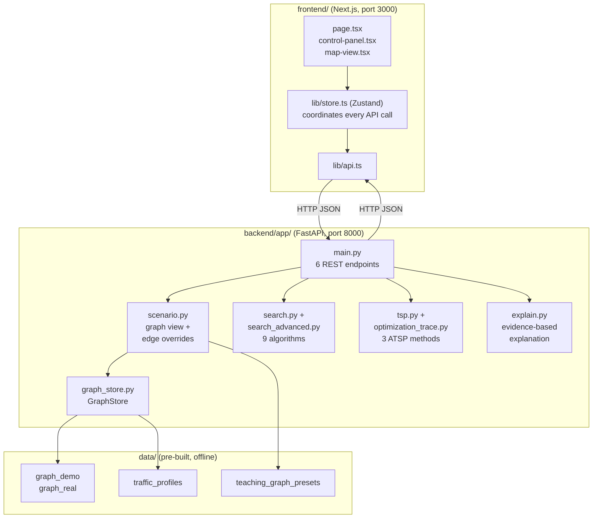
```mermaid
flowchart TD
    subgraph Frontend ["frontend/ (Next.js, port 3000)"]
        direction TB
        UI["page.tsx<br/>control-panel.tsx<br/>map-view.tsx"]
        Store["lib/store.ts (Zustand)<br/>coordinates every API call"]
        API["lib/api.ts"]
        UI --> Store --> API
    end

    subgraph Backend ["backend/app/ (FastAPI, port 8000)"]
        direction TB
        Main["main.py<br/>6 REST endpoints"]
        Scenario["scenario.py<br/>graph view +<br/>edge overrides"]
        GS["graph_store.py<br/>GraphStore"]
        Search["search.py +<br/>search_advanced.py<br/>9 algorithms"]
        TSP["tsp.py +<br/>optimization_trace.py<br/>3 ATSP methods"]
        Explain["explain.py<br/>evidence-based<br/>explanation"]
        Main --> Scenario --> GS
        Main --> Search
        Main --> TSP
        Main --> Explain
    end

    subgraph Data ["data/ (pre-built, offline)"]
        direction TB
        Graph["graph_demo<br/>graph_real"]
        Traffic["traffic_profiles"]
        Presets["teaching_graph_presets"]
    end

    API -- "HTTP JSON" --> Main
    Main -- "HTTP JSON" --> API
    GS --> Graph
    GS --> Traffic
    Scenario --> Presets
```

### f.2. GUI Request-Selection Axes

Each GUI execution is determined by two independent selections stored in the
application state: **problem mode** (the number of stops) and **run kind** (a
single algorithm or a parallel comparison). Their combination determines the
backend endpoint and the number of requests.

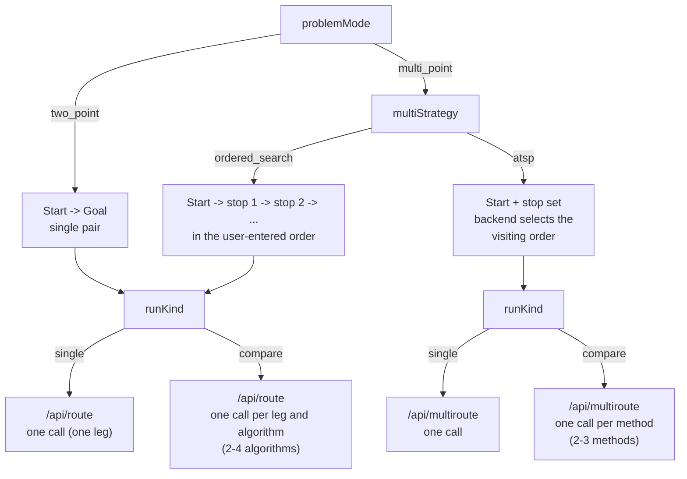
```mermaid
flowchart TD
    A["problemMode"] -->|two_point| B["Start -> Goal<br/>single pair"]
    A -->|multi_point| C["multiStrategy"]
    C -->|ordered_search| D["Start -> stop 1 -> stop 2 -> ...<br/>in the user-entered order"]
    C -->|atsp| E["Start + stop set<br/>backend selects the<br/>visiting order"]

    B --> F["runKind"]
    D --> F
    E --> G["runKind"]

    F -->|single| H["/api/route<br/>one call (one leg)"]
    F -->|compare| I["/api/route<br/>one call per leg and algorithm<br/>(2-4 algorithms)"]

    G -->|single| J["/api/multiroute<br/>one call"]
    G -->|compare| K["/api/multiroute<br/>one call per method<br/>(2-3 methods)"]
```

- **`two_point`** (default): a direct Start→Goal search using one of the nine
  point-to-point algorithms.
- **`multi_point` + `ordered_search`**: the stops are visited in the order the
  user entered them; the GUI chains several point-to-point searches
  (Start→stop1, stop1→stop2, ...) and stitches the legs into one route.
- **`multi_point` + `atsp`**: the backend determines the visiting order using
  one of three ATSP methods (`held_karp` / `nn_2opt` / `sa`). Only
  `held_karp` guarantees an optimal order through exact search; `nn_2opt` and
  `sa` are heuristics and provide no equivalent guarantee, even when an
  observed result matches the exact optimum.
- **`runKind: compare`** repeats the same journey with 2–4 route-search
  algorithms or 2–3 ATSP methods against one immutable input snapshot, so all
  results are evaluated under identical conditions.

### f.3. Scenario Sandbox

The Scenario tab allows the user to edit an edge's length, free-flow speed,
time-slot congestion, or risk flags before running a search, without modifying
the graph stored on disk. An edge is selected by clicking its tail and head
nodes in sequence rather than by clicking a rendered road line. Because the
graph is directed, opposite travel directions are separate edges that may be
drawn on the same screen line; the ordered pair of node selections identifies
the intended direction unambiguously. The server resolves the scenario once
before the algorithm runs, so the GUI editor and the search functions operate
on the same consistent graph.

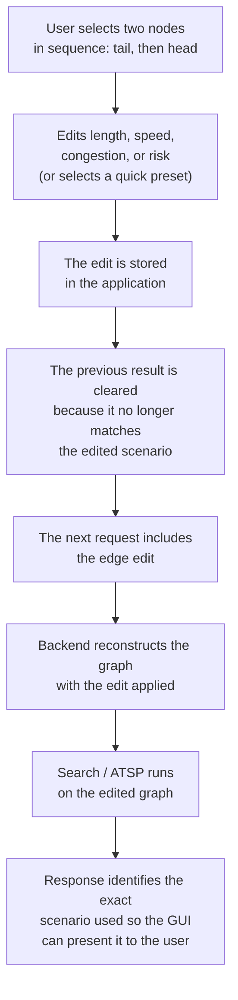
```mermaid
flowchart TD
    A["User selects two nodes<br/>in sequence: tail, then head"] --> B["Edits length, speed,<br/>congestion, or risk<br/>(or selects a quick preset)"]
    B --> C["The edit is stored<br/>in the application"]
    C --> D["The previous result is cleared<br/>because it no longer matches<br/>the edited scenario"]
    D --> E["The next request includes<br/>the edge edit"]
    E --> F["Backend reconstructs the graph<br/>with the edit applied"]
    F --> G["Search / ATSP runs<br/>on the edited graph"]
    G --> H["Response identifies the exact<br/>scenario used so the GUI<br/>can present it to the user"]
```

The same mechanism also supports **graph views**. On the demo graph, the user
may select a smaller teaching subgraph containing as few as three nodes to
make a step-by-step demonstration easier to follow, or return to the full
view. The real graph always remains at full size.

### f.4. Main Backend Modules

| Module | Responsibility | Key functions |
|---|---|---|
| `main.py` | FastAPI application, six REST endpoints, request dispatch, and a unified error envelope | `post_route(req)` handles `POST /api/route`: it resolves the scenario, runs the selected algorithm, and attaches the explanation. `post_multiroute(req)` performs the corresponding operation for `POST /api/multiroute` (ATSP/multi-stop). `get_graph`/`get_traffic` serve the resolved graph view and congestion layer. `ALL_ALGORITHMS` maps algorithm-name strings to functions, enabling dispatch through one lookup. |
| `graph_store.py` | Loads and validates graph and traffic JSON once per level; builds adjacency lists; precomputes edge weights for every mode–time-slot pair and node heuristics | `GraphStore.load(level)` loads and caches one graph level (`demo`/`real`). `weights(mode, slot)` returns the precomputed edge-ID-to-cost map without recomputation at each search step. `heuristic(node, goal, mode)` estimates straight-line distance or time from a node to the goal for A*, IDA*, and Beam Search. |
| `scenario.py` | Resolves graph views (`full`/`teach_N`) and edge overrides into a request-scoped immutable `GraphStore` without mutating the cached base graph | `resolve_scenario(base, config)` applies the view and overrides to `base`, returning an isolated `GraphStore` and the echoed `applied_scenario`. `resolve_view_store(base, view)` constructs the induced `full`/`teach_N` subgraph. `graph_response` creates the `/api/graph` payload for the resolved view. |
| `costs.py` | Computes edge weights and heuristics for distance, time, and balanced modes | `congestion_factor(level)` converts a congestion level from 1 to 5 into a time multiplier. `edge_weight(edge, congestion, mode)` is the edge cost added to $g$. `heuristic_m`/`heuristic_s` provide straight-line lower bounds to the goal in meters or seconds. |
| `search.py` | Five core algorithms—BFS, DFS, IDDFS, UCS, and A*—with a shared trace and decision recorder | `ALGORITHMS` maps the five functions. Each of `bfs`/`dfs`/`iddfs`/`ucs`/`astar(store, start, goal, mode, time_slot, ...)` executes a search and returns one `Trace` containing the path, metrics, and step-by-step trace; all five share the same signature and result form. |
| `search_advanced.py` | Four additional algorithms: Greedy Best-First Search, Bidirectional Dijkstra, IDA*, and Beam Search | `ADVANCED_ALGORITHMS` maps the four functions and is merged with `ALGORITHMS` in `main.py`. The functions `greedy`/`bidijkstra`/`idastar`/`beam(store, start, goal, mode, time_slot, ...)` share the signature and result form of the five core algorithms. |
| `tsp.py` | Builds an asymmetric pairwise cost matrix through internal UCS runs from every point; implements three ATSP solvers; orchestrates multi-stop trips | `build_matrix(store, points, mode, slot)` runs one UCS search from each point and returns the full cost matrix; because the graph is directed, `cost[a,b]` ≠ `cost[b,a]` in general. `held_karp(cost, points)` is exact bitmask dynamic programming, practical for up to 15 points. `nn_2opt(cost, points)` combines Nearest Neighbor with 2-opt/Or-opt local search. `simulated_annealing(cost, points)` uses swap/insert moves over five fixed seeds. `solve_multiroute(store, start, stops, method, ...)` coordinates matrix construction and the selected solver into the `/api/multiroute` response. |
| `optimization_trace.py` | Records a bounded, deterministic ATSP optimization trace comprising dynamic-programming updates, NN decisions, 2-opt/Or-opt moves, and SA iterations; samples events without influencing the solver | Solvers call `OptimizationTraceRecorder.emit(event)` for each candidate decision. A fixed sampling policy determines whether an event is retained, so enabling the trace cannot alter the solution. |
| `explain.py` | Produces an evidence-based explanation comprising the summary, cost breakdown, congestion/risk factors, and reference routes (UCS optimum and avoid-edge counterfactual) used to evaluate a heuristic result | `build_explanation(store, trace)` populates `Trace.explanation` after a run with the cost breakdown, factors that actually affected the objective, and at most two UCS-computed reference routes. |
| `models.py` | Pydantic contracts shared by the API and frontend (`Trace`, `RouteRequest`, `MultirouteRequest`, `ScenarioConfig`, ...); executable form of `docs/SCHEMA.md` | — |
| `benchmark.py` | Offline runner for seven experiments that writes to `results/`; `/api/benchmark` serves the results read-only and never initiates live search | Functions `exp1` through `exp7` each execute one experiment and write the corresponding CSV and figure set under `results/`. |

### f.5. Main Frontend Modules

| Area | Files | Responsibility |
|---|---|---|
| Page | `app/page.tsx`, `app/benchmark/page.tsx` | Route-planning workspace; read-only benchmark results viewer |
| Shell | `components/app-shell.tsx`, `control-panel.tsx` | Responsive layout; problem-mode/run-kind switches, algorithm/mode/time-slot/stop controls |
| Single-run map | `components/map-view.tsx` | Store-aware wrapper: owns editing/picking, timeline, legend, and toast copy for the single-run screen |
| Reusable canvas | `components/route-map-canvas.tsx` | Property-driven MapLibre and deck.gl canvas without direct store access; reused by the single-run map and every comparison pane |
| Comparison | `components/comparison/route-comparison-workspace.tsx`, `atsp-comparison-workspace.tsx` | Render N `RouteMapCanvas` panes (one per algorithm/method) plus the comparison table |
| ATSP | `components/atsp/*` | Multi-stop setup, method picker, result panel, and optimization-trace playback UI |
| Timeline | `components/timeline.tsx`, `lib/use-animation.ts` | Step-by-step playback of either the search trace or the ATSP optimization trace, keyboard shortcuts, speed control |
| Drawer | `components/drawer/{drawer,metrics-tab,explain-tab,compare-tab,scenario-tab}.tsx` | Right-hand results panel with four tabs: Metrics ($g/h/f$ values and decision table), Explanation (evidence-based summary), Compare, and Experiment (edge sandbox) |
| Explanation | `components/explanation/*` | Cost breakdown, reference-route comparison, per-factor overlays driving the Explain tab and map highlight |
| State | `lib/store.ts` (Zustand) | Single global store for journey inputs, run lifecycle, results (`trace`/`multi`/comparison sessions), and animation state. Key actions include `runRoute()` for a single point-to-point or ordered run; `runRouteComparison(algorithms)` / `runAtspComparison(methods)` for the \(N\)-way comparison loops; `runMulti(method)` for one ATSP run; and `cancelActiveRun()` for aborting the active run. Every API call and notification is coordinated by one of these actions. |
| Policy/orchestration | `lib/journey-mode-policy.ts`, `run-orchestrator.ts`, `comparison-policy.ts`, `sequential-route.ts`, `scenario.ts` | Pure functions composed by the store. `createRunSnapshot(input)` constructs the immutable `RunSnapshot` used to freeze a run. `routeRequestFromSnapshot`/`multirouteRequestFromSnapshot` convert a snapshot into the exact request body sent by `api.ts`. `buildScenario(view, overrides)` converts sandbox edits into the request's `scenario` field. `mergeSequentialRouteTraces` combines per-leg `Trace` objects into one continuous ordered multi-stop route. |
| API client | `lib/api.ts`, `lib/contract-guards.ts` | `api.route(body)`/`api.multiroute(body)` provide thin fetch wrappers for the five non-health endpoints. `parseTraceResponse`/`parseMultirouteResponse` in `contract-guards.ts` parse and validate every response against the locked contract before it reaches the store, so a malformed backend response fails explicitly rather than corrupting the UI. |

### f.6. How the GUI Drives the Search Algorithms

The GUI does not implement search logic; it collects parameters,
freezes them into a snapshot, calls the backend, and visualizes the returned
`Trace`.

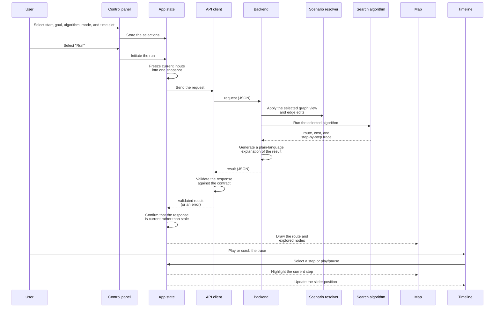
```mermaid
sequenceDiagram
    participant User
    participant ControlPanel as Control panel
    participant Store as App state
    participant API as API client
    participant Backend
    participant Scenario as Scenario resolver
    participant Algo as Search algorithm
    participant Map
    participant Timeline

    User->>ControlPanel: Select start, goal, algorithm, mode, and time slot
    ControlPanel->>Store: Store the selections
    User->>ControlPanel: Select "Run"
    ControlPanel->>Store: Initiate the run
    Store->>Store: Freeze current inputs<br/>into one snapshot
    Store->>API: Send the request
    API->>Backend: request (JSON)
    Backend->>Scenario: Apply the selected graph view<br/>and edge edits
    Backend->>Algo: Run the selected algorithm
    Algo-->>Backend: route, cost, and<br/>step-by-step trace
    Backend->>Backend: Generate a plain-language<br/>explanation of the result
    Backend-->>API: result (JSON)
    API->>API: Validate the response<br/>against the contract
    API-->>Store: validated result<br/>(or an error)
    Store->>Store: Confirm that the response<br/>is current rather than stale
    Store-->>Map: Draw the route and<br/>explored nodes
    User->>Timeline: Play or scrub the trace
    Timeline->>Store: Select a step or play/pause
    Store-->>Map: Highlight the current step
    Store-->>Timeline: Update the slider position
```

Key points:

- **One contract, nine algorithms.** The GUI sends an `algorithm` string
  (`bfs`, `astar`, `idastar`, ...); the backend looks it up in
  `ALL_ALGORITHMS` and always returns the same `Trace` shape, so the
  frontend never needs a different request or response type per algorithm.
  The *presentation* still branches for a couple of algorithms where it
  genuinely requires it: `bidijkstra` has its own forward/backward frontier
  table and legend, since a two-directional search has no equivalent in
  the other eight algorithms.
- **Ordered multi-stop routes** reuse `/api/route`: the store chains one
  request per leg (Start→stop1, stop1→stop2, ...) and
  merges the legs into one continuous `Trace` for the map and timeline.
- **ATSP multi-stop routes** go through `/api/multiroute`: the
  backend builds a cost matrix from internal UCS searches, solves the
  visiting order with `held_karp` / `nn_2opt` / `sa`, and optionally returns
  a bounded `optimization_trace` that the timeline can replay in the same
  manner as a search trace.
- **Comparison mode** reruns the same request shape 2-4 (route) or 2-3
  (ATSP) times against one frozen snapshot, rendering one map pane and one
  comparison-table row per item.
- **Trace-driven visualization.** The backend does the actual graph search;
  the frontend's only algorithm-aware behavior is replaying the `trace`
  array (expanded node, frontier, g/h/f values, and the selection-decision
  record per step) on the map and in the metrics tab; the search itself
  never runs in the browser.
- **Scenario-aware by construction.** The scenario (graph view + edge edits)
  is captured in the same frozen snapshot as the rest of the request, and the
  backend always echoes back exactly which scenario it used. If a response
  ever turns out not to match the sandbox state the user was looking at, the
  GUI detects the mismatch and discards the response.
- **One active run at a time**, with explicit cancellation. `running` /
  `comparing` / `multiRunning` block a new route/ATSP run or comparison
  while one is already in flight, and `cancelActiveRun()` aborts it through
  `AbortController`. This guard is scoped specifically to runs; loading
  the graph or the traffic layer uses its own separate staleness check and
  can happen independently of whatever run is in progress.
- **Consistent across multiple calls.** A multi-stop journey or a comparison
  needs several backend calls (one per leg, or one per algorithm/method).
  Each response carries back a signature of the exact data it was computed
  against; if a later call turns out to disagree with the first one, the
  whole result is discarded rather than silently stitched together from two
  different data states.

## g. Comparison of Point-to-Point Route-Search Algorithms

This section compares nine point-to-point route-search algorithms using two complementary forms of evidence. The first is a theoretical analysis of complexity, memory requirements, completeness, and optimality. The second is a paired experiment in which every algorithm uses the same traffic dataset, query set, and cost configuration. This design avoids two invalid inferences: favorable asymptotic complexity does not automatically imply strong performance on a particular dataset, and favorable experimental results do not replace theoretical proof.

The evaluation addresses four questions:

1. Which algorithms guarantee that a solution will be found, and which guarantee solution quality?
2. How far does actual route quality deviate from the optimum?
3. How many nodes does each algorithm expand, how large is its frontier, and how much processing time does it require?
4. When the congestion profile changes, does the selected optimal route change, or does only its cost change?

### g.1. Theoretical Comparison Matrix

#### g.1.1. Analysis Conventions

Let \(|V|\) and \(|E|\) denote the numbers of nodes and edges, respectively; \(b\) the branching factor; \(d\) the depth of the shallowest solution; \(m\) the maximum search depth; \(L\) the IDDFS depth limit; \(k\) the beam width; and \(Q\) the maximum number of pending state records in an explicit stack. For IDA*, \(R\) is the number of threshold iterations and satisfies \(R\le1{,}000\) under the current configuration.

No single “average-case complexity” applies to every graph and query distribution. The typical/conditional column in Table g.1 therefore gives a parametric bound only when its assumptions are explicit. For methods that depend strongly on heuristic quality or weight distribution, the table states “data-dependent” rather than inventing a probabilistic bound without a probability model. The common best case, \(\Theta(1)\), occurs when the start equals the goal and this condition is detected before graph expansion.

#### g.1.2. Consolidated Comparison Table

**Table g.1. Comparison of time complexity, memory, completeness, and optimality**

| Algorithm | Selection rule | Best case | Typical/conditional | Worst case | Implementation memory | Complete | Optimal |
|---|---|---:|---|---|---|---|---|
| BFS | FIFO; increasing depth | \(\Theta(1)\) | \(O(b^d)\) on a uniformly branching tree | \(O(\lvert V\rvert+\lvert E\rvert)\) | \(O(\lvert V\rvert)\) | Yes, on a finite graph | Only by edge count; not by weighted cost |
| DFS | LIFO; deepest first | \(\Theta(1)\) | Strongly dependent on neighbor order; may approach \(O(b^m)\) | \(O(\lvert V\rvert+\lvert E\rvert)\) | \(O(\lvert V\rvert+\lvert E\rvert)\) in the worst case because the stack may contain duplicate pending entries | Yes, on a finite graph with a visited set | No |
| IDDFS | DFS with increasing depth limits | \(\Theta(1)\) | \(O(b^d)\); repeatedly expands levels near the root | \(O(b^L)\) if the search reaches limit \(L\) | \(O(\lvert V\rvert+Q)\) | Yes if solution depth is at most \(L=100\); reaching the cap may be inconclusive | Only by edge count within the limit; not by weighted cost |
| UCS | Priority queue ordered by \(g\) | \(\Theta(1)\) | Data-dependent weight distribution | \(O((\lvert V\rvert+\lvert E\rvert)\log\lvert V\rvert)\) | \(O(\lvert V\rvert+\lvert E\rvert)\) because stale queue entries may remain | Yes, with positive step costs | Yes, with non-negative weights |
| Greedy Best-First Search | Min-heap ordered by \(h\) | \(\Theta(1)\) | Data-dependent heuristic quality | \(O((\lvert V\rvert+\lvert E\rvert)\log\lvert V\rvert)\) | \(O(\lvert V\rvert)\) | Yes, on a finite graph with a visited set | No; ignores \(g\) |
| A* | Priority queue ordered by \(f=g+h\), tie-broken by \(h\) | \(\Theta(1)\) | Depends on heuristic tightness; often examines fewer nodes than UCS when \(h\) is informative | \(O((\lvert V\rvert+\lvert E\rvert)\log\lvert V\rvert)\) | \(O(\lvert V\rvert+\lvert E\rvert)\) because stale queue entries may remain | Yes, on a finite graph with positive weights | Yes, if \(h\) is admissible and consistent |
| Bidirectional Dijkstra | Minimum \(g\) from two directions; stop using \(\mu\) | \(\Theta(1)\) | Approximately \(O(b^{d/2})\) only under a favorable, balanced tree model | \(O((\lvert V\rvert+\lvert E\rvert)\log\lvert V\rvert)\) | \(O(\lvert V\rvert+\lvert E\rvert)\) across both directions | Yes, with positive weights and correct reverse adjacency | Yes, with non-negative weights and the correct stopping rule |
| IDA* | DFS under an \(f\)-threshold; increase threshold by \(\varepsilon\) | \(\Theta(1)\) | Commonly described as \(O(b^d)\), but may re-expand extensively | \(O(Rb^m)\) under a tree model, with \(R\le1{,}000\) | \(O(\lvert V\rvert+Q)\) for node-indexed maps and the explicit stack | Yes given enough iterations; reaching the cap may be inconclusive | Within \(C^*+\varepsilon\) if found before the cap; not exactly optimal |
| Beam Search | Retain only the best \(k\) candidates by \(f\) at each level | \(\Theta(1)\) | \(O(dkb\log(kb))\) | Same form as the number of visited levels, but may terminate without a solution | \(O(\lvert V\rvert+kb)\) | No; pruning may remove every branch to the goal | No |

These bounds follow standard analyses of search and graph algorithms (Cormen et al., 2022; Russell & Norvig, 2021) but are adapted to the system's actual data structures. They exclude the cost of storing, sorting, and serializing the complete visualization trace. The experimental “maximum frontier” is a search-structure metric, not a direct measurement of RAM in bytes. UCS and Dijkstra rely on non-negative weights (Dijkstra, 1959); A* relies on an admissible, consistent heuristic (Hart et al., 1968; Dechter & Pearl, 1985); and the system's IDA* uses an \(\varepsilon\)-incremented threshold, so it is not identical to the classical exactly optimal configuration (Korf, 1985).

#### g.1.3. Theoretical Interpretation

No single algorithm dominates every criterion:

- **UCS, A*, and Bidirectional Dijkstra** provide exact optimality guarantees. UCS is simple and suitable as a reference baseline; A* can reduce the explored region through its heuristic; Bidirectional Dijkstra may reduce effective search depth but must maintain two search directions and reverse adjacency.
- **IDA*** provides an additive \(C^*+\varepsilon\) quality bound and keeps its frontier small, at the cost of repeated expansion and a finite iteration cap.
- **BFS and IDDFS** are appropriate when the objective is edge count rather than weighted traffic cost. DFS prioritizes depth and consequently offers no route-quality guarantee.
- **Greedy Best-First Search** prioritizes rapid guidance but may select expensive routes because it ignores accumulated cost. **Beam Search** constrains frontier size by sacrificing both completeness and optimality.

The term “best” is therefore meaningful only relative to an objective. If exact minimum cost is mandatory, only the three exactly optimal methods qualify. If extremely low latency takes priority and approximate routes are acceptable, Greedy Best-First Search may be preferable. If frontier resources are the primary constraint, IDA* or Beam Search offers a different trade-off, but its quality limits and potential for inconclusive or failed search must be stated explicitly.

### g.2. Experimental Design on the Traffic Dataset

#### g.2.1. Dataset and Sampling

The experimental road graph contains **2,118 nodes**, **4,699 directed edges**, and **1,433 structurally one-way edges**. It represents the road network in the study area while preserving travel direction, length, free-flow speed, road attributes, and time-slot congestion profiles.

Two hundred ordered origin–destination (OD) pairs were sampled using fixed seed 42. Every pair had a minimum Haversine separation of 1,000 m so that very short queries would not dominate the results. All nine algorithms used the same 200 pairs. Each pair was evaluated under two representative profiles, 07:30 and 22:00, in `balanced` mode. The resulting experiment comprised

\[
9\ \text{algorithms}\times200\ \text{pairs}\times2\ \text{time slots}
=3{,}600\ \text{runs}.
\]

#### g.2.2. Conditions for a Fair Comparison

**Table g.2. Controlled experimental factors**

| Factor | Common configuration | Role in fairness |
|---|---|---|
| Graph | Same directed graph snapshot | Every algorithm receives identical topology and edge attributes |
| OD pairs | Same 200 ordered pairs | Enables paired comparisons on identical queries |
| Time slots | 07:30 and 22:00 | Every algorithm receives the same two weight configurations |
| Objective | `balanced` | Cost is measured in seconds and includes congestion-adjusted time and risk penalties |
| Randomness | Seed 42 | The OD sample is reproducible; the tested point-to-point algorithms are deterministic |
| Visualization trace | Disabled for performance measurement | Avoids trace-recording overhead that would distort search time |
| Neighbor and tie-breaking order | Fixed | Routes and expansion counts are reproducible for the same input |
| Quality baseline | UCS for every pair and time slot | Every gap is measured against the same optimal cost \(C^*\) |

Fairness here means that every algorithm solves the same problem set directly, with no silent substitution and no replacement of failed results by another algorithm's output. “Same input” does not imply identical work: BFS, DFS, and IDDFS deliberately ignore weights when ordering expansions; Greedy Best-First Search uses only \(h\); and UCS, A*, Bidirectional Dijkstra, IDA*, and Beam Search use weights according to their respective rules. These differences are precisely what the experiment evaluates.

#### g.2.3. Baseline and Metrics

UCS supplies the optimal cost \(C^*\) for each query. For a returned path \(P\), the relative cost gap is

\[
\Delta(P)
=100\times\frac{C(P)-C^*}{C^*}\%.
\]

UCS and A* were also checked independently against a standard graph library on 800 cases—\(2\) algorithms × \(200\) pairs × \(2\) time slots. The result was 800/800 matches, with absolute error no greater than \(10^{-6}\). This is empirical evidence for the evaluation set; the general guarantees still derive from the theoretical conditions.

| Metric | Question answered | Interpretation limit |
|---|---|---|
| Success rate | For how many queries does the algorithm return a valid path? | Does not indicate route quality |
| Cost gap | How much more expensive is the route than the optimal baseline? | Computed only for successful runs |
| Expanded nodes | How many states does the algorithm actually examine? | Not equivalent to CPU instruction count |
| Maximum frontier | How large does the frontier data structure become? | Not a direct measurement of RAM usage |
| Runtime | How many milliseconds does a query require in the measured environment? | Depends on hardware, runtime environment, caching, and background load |

Expanded-node and runtime distributions are strongly skewed, so the report uses the median for a typical case and the 95th percentile (P95) for the difficult tail. For cost gap, the mean is retained to expose the influence of very poor routes, supplemented by the median, P95, and maximum.

#### g.2.4. Environment and Reproducibility

Deterministic outputs—found status, cost, gap, expanded nodes, and maximum frontier—were rechecked under the same graph, profile, algorithm code, seed, and OD pairs; no differences were found across the 3,600 rows. Runtime metrics in this section come from a controlled measurement on August 15, 2026, using the following configuration:

| Component | Measurement configuration |
|---|---|
| Processor | AMD Ryzen 7 7735HS, 8 cores/16 threads |
| Memory | 15.25 GiB RAM |
| Operating system | Microsoft Windows 11 Home Single Language, build 26100 |
| Runtime | Python 3.14.7 |
| Measurement condition | No frontend/backend server or unrelated service running concurrently |
| Total elapsed time | 609.118 seconds |

Runtime is wall-clock time, not a byte-reproducible quantity like a route or expansion count. Algorithms were executed in a fixed order, so warm-up, caching, and background-load effects cannot be excluded entirely. Millisecond-level conclusions apply only to the stated environment and should be interpreted alongside expansion counts rather than generalized as absolute speed on every machine.

### g.3. Actual Performance on the Selected Dataset

#### g.3.1. Route Quality and Success Rate

**Table g.3. Success rate and cost gap over 400 runs per algorithm**

| Algorithm | Found | Success rate | Mean gap | Median gap | P95 gap | Maximum gap |
|---|---:|---:|---:|---:|---:|---:|
| BFS | 400/400 | 100.0% | 26.163% | 21.762% | 65.804% | 116.903% |
| DFS | 400/400 | 100.0% | 1,192.689% | 980.228% | 2,899.089% | 6,169.801% |
| IDDFS | 400/400 | 100.0% | 26.163% | 21.762% | 65.804% | 116.903% |
| UCS | 400/400 | 100.0% | 0.000% | 0.000% | 0.000% | 0.000% |
| Greedy Best-First Search | 400/400 | 100.0% | 33.678% | 28.981% | 79.546% | 157.447% |
| A* | 400/400 | 100.0% | 0.000% | 0.000% | 0.000% | 0.000% |
| Bidirectional Dijkstra | 400/400 | 100.0% | 0.000% | 0.000% | 0.000% | 0.000% |
| IDA* | 400/400 | 100.0% | 0.174% | 0.000% | 0.797% | 2.120% |
| Beam Search | 396/400 | 99.0% | 20.118% | 16.846% | 52.846% | 104.173% |

UCS, A*, and Bidirectional Dijkstra achieved a cost gap of 0 in all 400 runs, consistent with their optimality guarantees. IDA* was near-optimal: its mean gap was 0.174%, median 0%, and maximum 2.120%. Converting the rounded data to absolute units gives an average excess of approximately 0.849 seconds, a P95 of about 3.750 seconds, and a maximum of about 4.845 seconds; every observation lies within the experimental configuration's 5-second additive bound.

BFS and IDDFS have identical gap statistics because both favor shallow solutions by edge count on this query set. This does not prove that they always return the same path when several solutions share the minimum depth. Greedy Best-First Search finds all 400 routes but has a mean gap of 33.678%, showing that strong geographic guidance does not compensate for ignoring accumulated travel cost. DFS produces the poorest quality, with a median gap of 980.228% and a maximum of 6,169.801%. On successful runs, Beam Search has a lower mean gap than BFS and Greedy Best-First Search, but it fails on 4 of 400 queries; judging it only by the remaining 396 solutions would therefore be misleading.

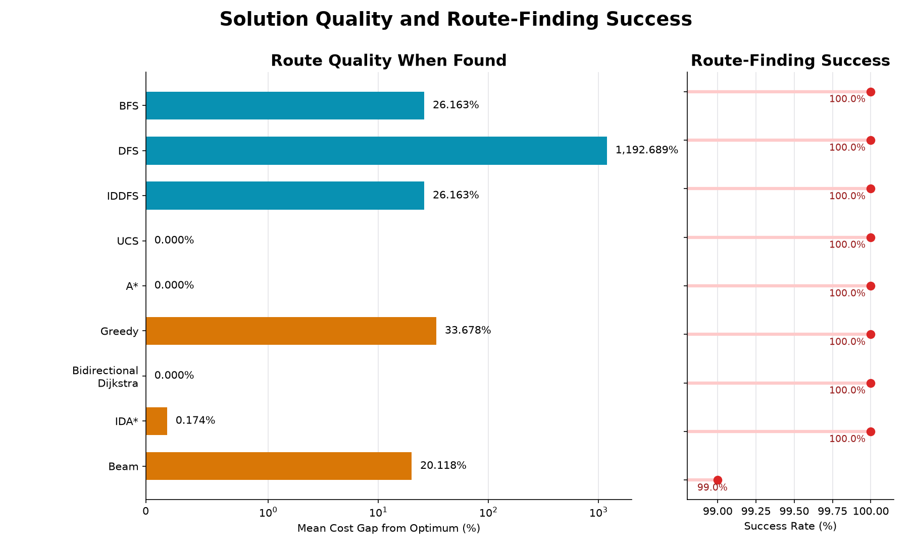

*Figure g.1. Solution quality and success rate. Blue denotes uninformed search, purple denotes the exactly optimal group, and orange denotes heuristic, pruned, or bounded-error methods.*

#### g.3.2. Expanded Nodes, Frontier Size, and Processing Time

**Table g.4. Search effort and runtime**

| Algorithm | Median expanded nodes | P95 expanded nodes | Median frontier | P95 frontier | Median runtime (ms) | P95 runtime (ms) |
|---|---:|---:|---:|---:|---:|---:|
| BFS | 1,240.0 | 2,021.95 | 80.0 | 117.00 | 1.381 | 2.384 |
| DFS | 971.0 | 1,908.65 | 193.5 | 259.00 | 37.293 | 102.089 |
| IDDFS | 67,970.0 | 388,666.05 | 29.0 | 41.00 | 552.871 | 3,466.554 |
| UCS | 1,279.0 | 2,035.15 | 69.0 | 91.05 | 4.622 | 7.937 |
| Greedy Best-First Search | 55.0 | 122.15 | 37.0 | 60.00 | 0.295 | 0.753 |
| A* | 649.5 | 1,587.85 | 62.5 | 101.05 | 3.862 | 9.825 |
| Bidirectional Dijkstra | 698.5 | 1,387.00 | 78.0 | 108.10 | 3.906 | 9.224 |
| IDA* | 83,931.0 | 1,108,857.05 | 29.0 | 47.00 | 124.213 | 1,607.135 |
| Beam Search | 1,025.0 | 1,836.10 | 50.0 | 50.00 | 3.717 | 6.743 |

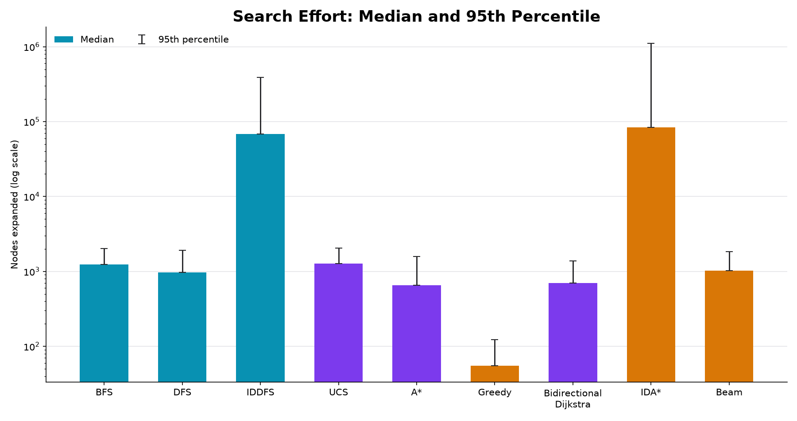

*Figure g.2. Expanded nodes. The vertical axis is logarithmic so that Greedy Best-First Search with tens of nodes and IDDFS/IDA* with tens of thousands to more than one million expansions remain visible together.*

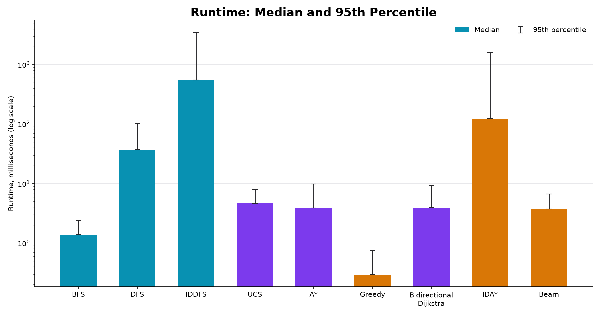

*Figure g.3. Runtime. The vertical axis is logarithmic; the values apply only to the stated measurement environment.*

#### g.3.3. Relationship Among Quality, Search Effort, and Runtime

**Greedy Best-First Search is fastest but sacrifices quality.** It expands a median of only 55 nodes and records the lowest median runtime, 0.295 ms. Its mean gap of 33.678% and P95 gap of 79.546%, however, make it unsuitable when route cost is operationally important. A low expansion count is meaningful only when interpreted together with solution quality.

**A* provides the strongest balance on the selected dataset.** Relative to UCS, A* reduces median expanded nodes from 1,279 to 649.5—**49.2%**—while retaining a cost gap of 0. Median runtime falls from 4.622 to 3.862 ms. A* nevertheless has a higher P95 runtime than UCS, 9.825 versus 7.937 ms; on difficult queries, heuristic computation and heap management may offset the benefit of fewer expansions. The warranted conclusion is that A* offers the best experimental balance, not that it is faster than UCS on every query.

**Bidirectional Dijkstra is an exactly optimal and competitive alternative.** It expands a median of 698.5 nodes—**45.4%** fewer than UCS—and has a median runtime of 3.906 ms. Its performance is close to A*, but it must maintain two heaps, two distance tables, and the \(\mu\)-based stopping condition. The result supports bidirectional search on this directed graph but does not establish a worst-case advantage over UCS.

**BFS is computationally inexpensive but does not minimize traffic cost.** It expands a median of 1,240 nodes, close to UCS, yet takes only 1.381 ms because FIFO operations require no weighted priority calculation. In exchange, its mean gap is 26.163%. BFS's low runtime must not be interpreted as superior routing efficiency.

**DFS returns the poorest routes even though its expansion count is not the largest.** It expands a median of 971 nodes, but its median route cost is approximately 10.8 times the optimum and its median runtime is 37.293 ms. Duplicate pending stack entries and depth-first traversal make it more expensive to execute than BFS, while its selection rule provides no route-quality guarantee.

**IDDFS and IDA* retain small frontiers but perform extensive re-expansion.** Both have a median frontier of 29 nodes. IDDFS expands a median of 67,970 nodes and IDA* 83,931; IDA* exceeds 1.1 million expansions at P95. IDA* attains near-optimal quality, whereas IDDFS still optimizes only edge count. Their long runtime tails make both unsuitable as the default on this graph, although their small frontiers remain instructive for studying memory trade-offs.

**Beam Search controls frontier size but sacrifices reliability.** Its P95 frontier is exactly 50, directly reflecting the experimental beam width. Median runtime is a relatively low 3.717 ms, but a 99.0% success rate and 20.118% mean gap show that its resource advantage is exchanged for both lower quality and a risk of failure.

#### g.3.4. Objective-Based Selection Matrix

| Intended use | Most suitable choice on the evaluation set | Rationale | Caution |
|---|---|---|---|
| Easily verified optimal baseline | UCS | Exact optimality, simple mechanism, cost gap of 0 | Expands more nodes than A* and Bidirectional Dijkstra |
| Balance of quality and performance | A* | Exact optimality; 49.2% lower median expansion count than UCS | P95 runtime is not always lower than UCS |
| Search from both directions | Bidirectional Dijkstra | Cost gap of 0; 45.4% lower median expansion count than UCS | Maintains two search structures; benefit depends on the OD pair |
| Extremely low latency with approximate routes accepted | Greedy Best-First Search | Lowest median runtime and expansion count | Large gaps; no optimality guarantee |
| Near-optimal quality with a small frontier | IDA* | Mean gap 0.174%; median frontier 29 | Extensive re-expansion and a long runtime tail; finite iteration cap |
| Hard frontier limit | Beam Search | P95 frontier equals 50 | May fail despite the existence of a path |
| Illustration of weight-agnostic strategies | BFS, DFS, IDDFS | Clearly demonstrates FIFO, LIFO, and iterative deepening | Unsuitable for minimizing weighted traffic cost |

### g.4. Effect of Time Slot on Performance

**Table g.5. Results by time slot: 07:30 and 22:00**

| Algorithm | Time slot | Found | Mean gap | Median expanded nodes | Median runtime (ms) |
|---|---:|---:|---:|---:|---:|
| BFS | 07:30 | 200/200 | 24.073% | 1,240.0 | 1.322 |
| BFS | 22:00 | 200/200 | 28.253% | 1,240.0 | 1.407 |
| DFS | 07:30 | 200/200 | 1,183.227% | 971.0 | 37.181 |
| DFS | 22:00 | 200/200 | 1,202.152% | 971.0 | 37.539 |
| IDDFS | 07:30 | 200/200 | 24.073% | 67,970.0 | 542.357 |
| IDDFS | 22:00 | 200/200 | 28.253% | 67,970.0 | 560.181 |
| UCS | 07:30 | 200/200 | 0.000% | 1,278.5 | 4.550 |
| UCS | 22:00 | 200/200 | 0.000% | 1,285.5 | 4.647 |
| Greedy Best-First Search | 07:30 | 200/200 | 31.949% | 55.0 | 0.298 |
| Greedy Best-First Search | 22:00 | 200/200 | 35.407% | 55.0 | 0.290 |
| A* | 07:30 | 200/200 | 0.000% | 761.0 | 4.535 |
| A* | 22:00 | 200/200 | 0.000% | 571.0 | 3.378 |
| Bidirectional Dijkstra | 07:30 | 200/200 | 0.000% | 713.5 | 3.923 |
| Bidirectional Dijkstra | 22:00 | 200/200 | 0.000% | 688.0 | 3.887 |
| IDA* | 07:30 | 200/200 | 0.124% | 138,948.5 | 191.381 |
| IDA* | 22:00 | 200/200 | 0.223% | 43,769.0 | 66.124 |
| Beam Search | 07:30 | 197/200 | 17.769% | 1,025.5 | 3.844 |
| Beam Search | 22:00 | 199/200 | 22.444% | 1,019.0 | 3.511 |

BFS, DFS, IDDFS, and Greedy Best-First Search have the same median expansion counts in both time slots because their search order does not depend on traffic weights: the first three use only neighbor/depth structure, and Greedy Best-First Search uses only the geographic heuristic. For a given OD pair, their routes remain unchanged, but their gaps vary because both route weights and the optimal baseline change with the profile.

A* shows the most visible change among the exactly optimal methods: median expanded nodes fall from 761 at 07:30 to 571 at 22:00, while median runtime decreases by approximately 25.5%. IDA* also expands substantially fewer nodes under the 22:00 profile. These results do not imply that every nighttime query is easier; they describe only two representative profiles and the selected 200-pair sample. Beam Search fails on three runs at 07:30 and one at 22:00, indicating that weight changes can alter which branches survive pruning.

### g.5. How Congestion Changes the Selected Route

#### g.5.1. Evaluation Across the Full Sample

To isolate the effect of traffic from algorithm choice, A* was run on the same 200 OD pairs, graph, and `balanced` objective; the only changed factor was the profile, from 07:30 to 22:00. The node sequence changed for **149 of 200 pairs**, or **74.5%**.

This directly demonstrates that the congestion profile can change not only total cost but also the selected path itself. The 74.5% rate, however, applies only to this sample and these two profiles; it is not a general probability of route change across all days or regions.

#### g.5.2. Case Study: OD-000

This pair runs from `n0457` to `n0103`. Let R07 denote the path selected at 07:30 and R22 the path selected at 22:00. The routes use different prefixes, reconverge at `n0490`, and share the remaining suffix to the goal.

**Table g.6. Cross-evaluation of both routes under both traffic profiles**

| Route | Distance (m) | Cost at 07:30 (s) | Cost at 22:00 (s) | Congestion delay at 07:30 / 22:00 (s) | Risk penalty (s) |
|---|---:|---:|---:|---:|---:|
| R07 — selected at 07:30 | 2,685.2 | **565.2** | 376.1 | 249.0 / 60.0 | 75.0 |
| R22 — selected at 22:00 | 2,656.1 | 596.1 | **357.7** | 283.6 / 45.2 | 100.0 |

At 07:30, R07 is approximately 30.9 seconds cheaper than R22. At 22:00, the ordering reverses and R22 becomes approximately 18.4 seconds cheaper than R07. Notably, R07 is 29.1 m longer than R22 yet is selected in the morning; distance alone therefore cannot explain the decision.

R22's prefix contains 13 edges. Under the 07:30 profile, every one of these edges has congestion level 4 or 5, giving the prefix a cost of 276.6 seconds. At 22:00, their levels fall to 1 or 2 and the prefix cost falls to 169.4 seconds. The R07 prefix costs 245.7 and 187.8 seconds under the two profiles, respectively. Hence,

\[
\begin{aligned}
07{:}30:&\quad C(R07)=565.2<C(R22)=596.1,\\
22{:}00:&\quad C(R22)=357.7<C(R07)=376.1.
\end{aligned}
\]

**Table g.7. Selected edge-level changes on the R22 branch**

| Directed edge | Congestion level | Edge cost at 07:30 (s) | Edge cost at 22:00 (s) | Reduction |
|---|---|---:|---:|---:|
| `n0460→n0456` | 5→1 | 61.8 | 39.7 | 22.1 s |
| `n0990→n0080` | 5→2 | 36.0 | 19.8 | 16.2 s |
| `n1436→n0511` | 5→2 | 17.7 | 9.7 | 8.0 s |
| `n0511→n0460` | 5→2 | 38.1 | 20.9 | 17.2 s |

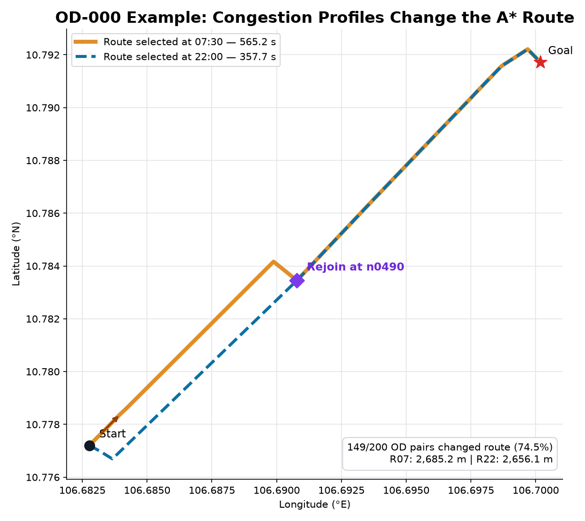

*Figure g.4. The routes differ in their prefixes, reconverge at `n0490`, and share the suffix to the goal.*

#### g.5.3. Implications for Route Selection

The OD-000 case shows the model responding to three information layers. Distance determines physical length; the congestion profile changes the time component edge by edge; and risk penalties further distinguish routes in balanced mode. A shorter route is not automatically preferable when its edges carry severe congestion or larger penalties.

The result also explains why an optimal algorithm can return different routes for the same OD pair. A* has not changed its optimality principle; the input weight function has changed with the profile. At each time slot, A* still minimizes the corresponding cost function. The route change is therefore a coherent response by the model, not algorithmic instability.

The 07:30 and 22:00 records are representative snapshots, not a live traffic feed or a continuous same-day observation series. The result demonstrates only that the system reacts to the two modeled configurations; it does not establish current field conditions on those road segments.

### g.6. Limitations of the Comparison

1. The two hundred OD pairs form a deterministic sample within the study area; results do not automatically generalize to every city, graph density, or route length.
2. The two time slots are representative profiles. The 74.5% route-change rate is not a forecast for an arbitrary traffic day.
3. Runtime depends on hardware, Python version, caching, and background load. Fixed execution order may also introduce minor warm-up or cache effects.
4. Frontier size is an algorithmic count, not RAM usage in bytes; priority queues, sets, and maps have different per-entry overheads.
5. Beam Search gaps are computed only on successful runs. Its four failures must be considered alongside the quality table to avoid survivorship bias.
6. The Haversine heuristic relies on verified invariants: edge length is no less than geographic distance, speed does not exceed \(v_{\max}\), congestion multipliers are at least 1, and penalties are non-negative. If the cost model changes, the guarantees of A* and IDA* must be reassessed.

### g.7. Conclusion

The theoretical and experimental results show that no algorithm dominates every criterion. UCS, A*, and Bidirectional Dijkstra are the exactly optimal choices. On the selected dataset, **A*** offers the strongest balance between quality and search effort, with a cost gap of 0 and 49.2% fewer median expanded nodes than UCS. Bidirectional Dijkstra is similarly competitive, reducing median expanded nodes by 45.4% relative to UCS.

Greedy Best-First Search is the fastest option but incurs a 33.678% mean gap. DFS yields the poorest route quality. IDDFS and IDA* retain small frontiers but incur extensive re-expansion; IDA* exchanges this cost for solution quality within its stated bound. Beam Search constrains the frontier explicitly but guarantees neither success nor optimality.

Finally, route changes for 149 of 200 OD pairs demonstrate that congestion affects route choice, not merely travel-time values. OD-000 illustrates the mechanism: the relative ordering of two routes reverses when congestion levels on the R22 branch fall from 4–5 to 1–2. Algorithm selection for urban routing should therefore consider solution guarantees, route quality, search effort, resource use, processing time, and sensitivity to traffic profiles together.

## h. Multi-Location Route Optimization with Three ATSP Algorithms

When a courier must serve multiple locations on one trip, the task extends beyond finding a route between a single pair of points. The system must solve two coupled optimization layers: first, determine the minimum-cost path for every ordered pair of locations; second, choose a visiting order that minimizes the total trip cost. Because Ho Chi Minh City's road network contains many one-way segments and direction-dependent weights, the cost from A to B generally differs from the cost from B to A. The visiting-order problem is therefore modeled as an **Asymmetric Traveling Salesman Problem (ATSP)**.

The principal technical contribution of this approach is the preservation of asymmetry throughout the pipeline. Each off-diagonal cost-matrix entry is computed from an optimal path on the directed graph under the same time slot and objective; it is not estimated from straight-line distance. The order produced by an ATSP solver is then reconstructed as actual route legs on the network. The system consequently couples path selection with service-order optimization while clearly distinguishing solutions with a proof of optimality from heuristic solutions.

Three complementary methods were selected: **Held–Karp** provides an exact reference for small instances; **Nearest Neighbor combined with 2-opt/Or-opt** provides a deterministic solution at low latency; and **Simulated Annealing** broadens exploration by temporarily accepting cost-increasing moves. This combination permits direct evaluation of the trade-off among an optimality certificate, observed solution quality, and computational cost on the same input.

In Experiment 7, the system processed one start and nine stops under the `balanced` objective at 07:30 with an open trip. Held–Karp reduced modeled cost from 4,320.1 to 2,494.9 seconds; NN + 2-opt/Or-opt achieved 2,534.2 seconds; and the best of five SA runs achieved 2,494.9 seconds. These are observations from one experimental configuration and do not establish a general quality guarantee for either heuristic.

### h.1. Description of the Multi-Location Routing Problem

#### h.1.1. Street Graph and Asymmetric Cost Matrix

Let the street graph be $G=(V,E)$, where $V$ is the set of intersections or locations and $E$ is the set of directed road segments. The set of points to visit is

$$ P=\{p_0,p_1,\ldots,p_{n-1}\}\subseteq V, $$

where $p_0$ is the fixed start. For each ordered pair $(p_i,p_j)$, the system runs Uniform-Cost Search (UCS) under the selected objective and time slot to obtain a minimum-cost path. Denote the cost of that path by $c_{ij}$. These values form the matrix

$$ C=[c_{ij}]_{n\times n}. $$

Because the graph contains one-way roads and direction-dependent weights, $c_{ij}\ne c_{ji}$ in general. Every solver must therefore use the correct directed entry: it must not replace $c_{ij}$ with $c_{ji}$, symmetrize the matrix, or apply cost-difference formulas valid only for symmetric TSP.

The default is an **open route**, in which the courier finishes at the final delivery stop:

$$ \min_{\pi}\ C_{\mathrm{open}}(\pi) =\min_{\pi}\sum_{k=0}^{n-2}c_{\pi_k,\pi_{k+1}}, \qquad \pi_0=p_0, $$

where $\pi$ is a permutation of $P$. When `return_to_start=true` is turned on, the target function becomes a closed cycle:

$$ C_{\mathrm{closed}}(\pi) =\sum_{k=0}^{n-2}c_{\pi_k,\pi_{k+1}} +c_{\pi_{n-1},p_0}. $$

In the interface, **Return to start after the final stop** is off by default. When it is off, the frontend sends `return_to_start=false` and requests an open route; when the user turns it on, the frontend sends `return_to_start=true`, and the system adds exactly one leg from the final stop back to the start. Thus, `false` is merely the **default**, not a hard-coded request value. In a closed-trip response, `order` still does not repeat $p_0$ at the end; the return leg appears separately in `legs` [P2], [P6].

#### h.1.2. Cost Function and Units

For road segment $e$ and time slot $h$, the project defines the cost components as follows [P2]:

$$ t_{\mathrm{free}}(e) =\frac{\mathrm{length\_m}(e)} {\mathrm{free\_speed\_kmh}(e)/3.6} \quad\text{(seconds)}, $$

$$ f_{\mathrm{cong}}(e,h) =1+1.5\frac{\mathrm{congestion}(e,h)-1}{4}, $$

$$ \mathrm{penalty}(e) =60\,\mathrm{flood} +90\,\mathrm{construction} +30\,\mathrm{narrow\_alley} +25\,\mathrm{traffic\_light} \quad\text{(seconds)}. $$

Each risk flag in the penalty formula is either 0 or 1. Table h.1 gives the edge weight for each mode.

*Table h.1. Weight functions and units for the three cost modes.*

| `mode` | Edge weight | Unit of `total_cost` |
|---|---|---|
| `distance` | $\mathrm{length\_m}$ | meters |
| `time` | $t_{\mathrm{free}}f_{\mathrm{cong}}$ | seconds |
| `balanced` | $t_{\mathrm{free}}f_{\mathrm{cong}}+\mathrm{penalty}$ | equivalent seconds |

The `balanced` objective adds congestion-adjusted travel time to risk penalties expressed in seconds. A minute value derived from `balanced` is therefore only a **conversion of modeled cost to minutes**, not a field-measured estimated time of arrival (ETA). Under the current contract, `total_time_s` always reports the total `balanced` weight of a path, even when the user selects `distance` or `time`; `total_cost` carries the unit of the active objective [P2].

#### h.1.3. Inputs, Outputs, and Validity Conditions

*Table h.2. Input/output contract and validity conditions for the multi-stop problem.*

| Component | Current contract |
|---|---|
| Principal inputs | `start`; a list of distinct `stops`, all different from `start`; `method`; `mode`; `time_slot`; `graph`; `return_to_start` |
| Three methods | `held_karp`, `nn_2opt`, `sa` |
| Number of points | Max 16 points including `start`; Held – Karp max 15 points |
| Successful output | Visiting `order`, individual `legs`, total cost/distance, total cost of the entered order, percentage savings, solver statistics, and optimality-guarantee flags |
| Unreachable case | If any required ordered pair in the selected point set is unreachable, the system returns `found=false` and does not fabricate a trip |
| Frontend trip type | Supports both open trips and return-to-start trips; the default is open (`return_to_start=false`) |

#### h.1.4. Program Flow and Mapping to Source Code

All three methods share one processing pipeline. By using the same cost matrix and path-reconstruction mechanism, the solvers are compared under the same data, objective, and trip form.


*Figure h.1. Multi-stop API pipeline: validate the request, build a directed cost matrix through $n$ multi-target UCS runs, execute the selected solver, reconstruct the order, and join cached paths into a complete route.*

*Table h.3. Mapping from pipeline stages to project source code.*

| Stage | Current function/source | Responsibility |
|---|---|---|
| Validation and orchestration | `solve_multiroute` in [P1] | Validate node existence, uniqueness, and method limits; construct the response |
| Matrix construction | `build_matrix` in [P1] | Run multi-target UCS from each source point; cache each $c_{ij}$ and its path |
| Exact solver | `held_karp` in [P1] | Perform bitmask dynamic programming and store predecessor points |
| Deterministic heuristic | `nearest_neighbour`, `two_opt_or_opt`, `nn_2opt` in [P1] | Build a greedy trip and improve it with two ATSP-safe neighborhoods |
| Metaheuristic | `simulated_annealing` in [P1] | Execute five trajectories with fixed random seeds and retain the best solution |
| Optimization evidence | Optimization trace and multi-stop response in [P2] | Record dynamic-programming, local-search, or SA events separately from route-search traces |

In the interface, the user selects the points, objective, time slot, method, and whether to return to the start. The frontend captures the current `return_to_start` setting and sends the same input parameters to `POST /api/multiroute` when comparing methods. The backend is authoritative for matrix, order, and cost computation; the frontend only configures the request, calls the API, and presents the response [P2], [P6].

With heap-based priority queues and non-negative weights, one UCS run has approximate complexity $O((E+V)\log V)$. In the worst case, constructing the matrix from $n$ source points costs

$$ O(n(E+V)\log V). $$

The cost matrix requires $O(n^2)$ memory. The path cache additionally stores up to $n(n-1)$ paths, with capacity depending on their total length; this storage is not included in each solver's auxiliary-memory bound. Experiment 7 measures only **solver time after matrix construction**, so this shared cost is not counted repeatedly.

#### h.1.5. Common Four-Point Example

The courier starts at **BT** (Ben Thanh Market), serves **HN** (Ham Nghi Transfer Point), **MT** (Ho Chi Minh City Museum of Fine Arts), and **SC** (Saigon Centre/Takashimaya), and does not return to BT. Table h.4 gives the `balanced` matrix at 07:30; each cell is the UCS cost between an ordered pair, rounded to the nearest second [P5].

*Table h.4. Asymmetric cost matrix for the four-point example (unit: equivalent seconds).*

| From / To | BT | HN | MT | SC |
|---|---:|---:|---:|---:|
| **BT** | — | 206 | 176 | 304 |
| **HN** | 135 | — | 30 | 254 |
| **MT** | 105 | 30 | — | 223 |
| **SC** | 99 | 52 | 82 | — |

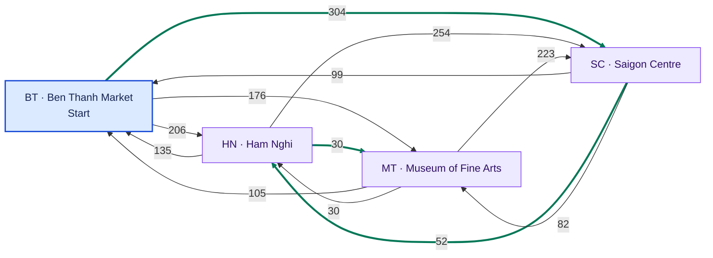
```mermaid
flowchart LR
    BT["BT · Ben Thanh Market<br/>Start"]:::start
    HN["HN · Ham Nghi"]:::stop
    MT["MT · Museum of Fine Arts"]:::stop
    SC["SC · Saigon Centre"]:::stop

    BT -->|"206"| HN
    HN -->|"135"| BT
    BT -->|"176"| MT
    MT -->|"105"| BT
    BT -->|"304"| SC
    SC -->|"99"| BT
    HN -->|"30"| MT
    MT -->|"30"| HN
    HN -->|"254"| SC
    SC -->|"52"| HN
    MT -->|"223"| SC
    SC -->|"82"| MT

    classDef start fill:#dbeafe,stroke:#1d4ed8,color:#172554,stroke-width:2px;
    classDef stop fill:#ede9fe,stroke:#7c3aed,color:#2e1065;
    linkStyle 4,6,9 stroke:#047857,stroke-width:3px;
```

*Figure h.2. Directed cost graph for the four-point example. Each arc label is a rounded `balanced` cost in equivalent seconds. The three bold arcs form the optimal trip `BT → SC → HN → MT`.*

Asymmetry is explicit: $c_{\mathrm{BT,SC}}=304$, whereas $c_{\mathrm{SC,BT}}=99$. Table h.4 and Figure h.2 represent the same input and are used throughout the three algorithm examples that follow:

- Held–Karp finds `BT → SC → HN → MT` with $304+52+30=386$ seconds.
- NN initially chose `BT → MT → HN → SC` with $176+30+254=460$ seconds.
- Local search can reverse `[MT,HN,SC]`, transforming the NN trip into the 386-second trip.
- SA can temporarily accept more expensive trips to escape the current region of the solution space.

The calculations above use rounded table entries. In execution, the system compares and sums full-precision values.

### h.2. Approach and the Three Selected Solvers

The team selected a three-tier solver architecture rather than treating one method as universally suitable for every scale and objective. Held–Karp answers, “What is the optimal solution?”; NN + 2-opt/Or-opt asks, “Can a good, deterministic solution be obtained at low computational cost?”; and SA investigates whether a larger search budget can escape local minima. Each method is presented under the same framework: principle, pseudocode, example, validity, stopping condition, guarantee, complexity, and limitation. This structure separates theoretical properties from observations on a particular scenario.

#### h.2.1. Held–Karp—Exact Dynamic Programming

**Core idea and dynamic-programming recurrence.**

The project uses Held–Karp as the exact reference solver, both to evaluate heuristic quality and to produce a provably optimal order when required. The algorithm applies dynamic programming over subsets (Held & Karp, 1962). Let $D[S,j]$ be the minimum cost of starting at $p_0$, visiting exactly the points in $S$, and ending at $p_j$. Set $S$ is encoded as a bitmask.

$$ D[\{p_0\},p_0]=0, $$

$$ D[S,p_j] =\min_{p_i\in S\setminus\{p_j\}} \left(D[S\setminus\{p_j\},p_i]+c_{ij}\right). $$

For an open route,

$$ C^*=\min_{j\ne0}D[P,p_j]. $$

For a closed cycle, $c_{j0}$ is added to each terminal state. Every dynamic-programming state stores its predecessor so that the optimal visiting order can be reconstructed. The recurrence uses $c_{ij}$ directly and makes no symmetry assumption.

**Pseudocode.**

```text
HELD_KARP(C, points, return_to_start)
    dp[{start}, start] <- (0, none)

    for each subset S containing start:
        for each endpoint i represented in dp[S]:
            for each point j not in S:
                candidate <- dp[S, i] + C[i, j]
                if candidate is better than dp[S ∪ {j}, j]:
                    store candidate and predecessor i

    full_set <- the set of all points
    if return_to_start:
        endpoint <- argmin_{i != start} (dp[full_set, i] + C[i, start])
        total_cost <- dp[full_set, endpoint] + C[endpoint, start]
    else:
        endpoint <- argmin_{i != start} dp[full_set, i]
        total_cost <- dp[full_set, endpoint]
    follow predecessors to reconstruct the order
    return order, total_cost
```

**Worked example on the common four-point dataset.**

The states along the optimal sequence are:

*Table h.5. Selected dynamic-programming states along the optimal sequence in the four-point example.*

| State | Best cost (s) | Predecessor |
|---|---:|---|
| $D[\{BT,SC\},SC]$ | 304 | BT |
| $D[\{BT,SC,HN\},HN]$ | $304+52=356$ | SC |
| $D[\{BT,SC,HN,MT\},MT]$ | $356+30=386$ | HN |

After comparing all terminal states, the algorithm returns `BT → SC → HN → MT`. The first leg, 304 seconds, is not the cheapest edge leaving BT, but the next two legs cost only 52 and 30 seconds. This illustrates the central distinction between global dynamic programming and the greedy choice of the cheapest next edge.

With three stops, exactly $3!=6$ orders must be considered. Table h.6 lists the complete solution space after fixing BT in the first position, allowing the optimal result to be checked directly from the matrix.

*Table h.6. All six trips in the four-point example.*

| Visiting order | Leg-cost decomposition (equivalent s) | Total cost (equivalent s) |
|---|---:|---:|
| `BT → HN → MT → SC` | $206+30+223$ | 459 |
| `BT → HN → SC → MT` | $206+254+82$ | 542 |
| `BT → MT → HN → SC` | $176+30+254$ | 460 |
| `BT → MT → SC → HN` | $176+223+52$ | 451 |
| **`BT → SC → HN → MT`** | **$304+52+30$** | **386** |
| `BT → SC → MT → HN` | $304+82+30$ | 416 |

The 386-second result is the minimum among all six trips. On this small instance, enumeration makes explicit what Held–Karp performs systematically at larger scale: it does not choose the cheapest first edge, but minimizes the total cost of the complete visiting order.

**Correctness, termination, and guarantees.**

- **Recurrence correctness:** an optimal trip ending at state $(S,j)$ has an immediate predecessor of $j$. If the subtrip to that predecessor were not optimal, replacing it with a cheaper subtrip would produce a cheaper trip to $(S,j)$, contradicting optimality.
- **Termination:** the numbers of bitmasks and endpoints are finite; the nested loops terminate after exhausting all admissible states.
- **Valid-solution guarantee:** conditional. When every ordered pair has finite cost and $n\le15$, the implementation returns a valid trip. Unreachable pairs are detected during matrix construction before the solver runs.
- **Global-optimality guarantee:** yes. The algorithm considers every subset–endpoint state and returns an optimum for the supplied matrix, objective, and open/closed trip form.

**Complexity, limitations, and use case.**

- Solver time: $O(n^2 2^n)$.
- Solver auxiliary memory: $O(n2^n)$ for costs and predecessors.
- The implementation warns at $n\ge13$ and rejects $n>15$; exponentially growing memory is the principal practical constraint [P1].
- The optimization trace may be sampled to bound response size, but sampling does not prune dynamic-programming states or change the solution [P2].

Held–Karp is therefore appropriate for small point sets when a proof of optimality is more important than latency or memory consumption.

#### h.2.2. Nearest Neighbor + 2-opt/Or-opt—Deterministic Heuristic

**Greedy construction and local search.**

Held–Karp is exact, but its time and memory grow exponentially. The project therefore requires a faster method when a proof of optimality is unnecessary. NN constructs a feasible trip at low computational cost; 2-opt/Or-opt then corrects greedy choices that are “cheap now but expensive later.” The method has two stages:

1. **Nearest Neighbor (NN):** at current point $p_i$, select the unvisited point $p_j$ with minimum $c_{ij}$. Candidates are sorted by node identifier for stable tie-breaking.
2. **Local search:** repeatedly test two move types until a complete pass produces no improvement:
   - **2-opt:** reverse a segment of the order while keeping the start in the first position;
   - **Or-opt:** remove a segment of length 1–3 and reinsert it elsewhere while preserving the segment's internal direction.

The 2-opt improvement method originates with Croes (1958). In ATSP, however, reversing a segment also reverses several internal directed edges. The implementation therefore **recomputes the full cost of every candidate trip** and does not use the four-edge delta formula for symmetric TSP. Or-opt additionally relocates a block without reversing its direction, which is valuable when opposite travel directions have different costs [P1].

**Pseudocode.**

```text
NN_2OPT_OROPT(C, points, return_to_start)
    order <- [start]
    while unvisited points:
        sort candidates by node identifier for stable tie-breaking
        select j with minimum C[current, j]
        append j to order

    repeat
        improved <- false

        consider every 2-opt reversal that preserves start in the first position
        recompute the full cost of every candidate trip
        if a candidate strictly reduces cost:
            accept it and set improved <- true

        consider every Or-opt relocation of length 1..3
        recompute the full cost of every candidate trip
        if a candidate strictly reduces cost:
            accept it and set improved <- true
    until improved = false

    return order, total_cost
```

**Worked example on the common four-point dataset.**

NN constructs the trip through three decisions:

1. At BT, the candidates are HN (206), MT (176), and SC (304); NN selects MT because 176 is smallest. The partial order is `BT → MT`.
2. At MT, the remaining candidates are HN (30) and SC (223); NN selects HN. The partial order becomes `BT → MT → HN`.
3. Only SC remains, so the algorithm adds HN → SC at a cost of 254.

The initial NN trip is

$$ BT\rightarrow MT\rightarrow HN\rightarrow SC, \qquad C=176+30+254=460. $$

The implementation scans index pairs in stable order and immediately accepts each strict improvement. Its actual 2-opt sequence on this example is

$$ \begin{aligned} BT\rightarrow MT\rightarrow HN\rightarrow SC &: 460,\\ BT\rightarrow HN\rightarrow MT\rightarrow SC &: 459,\\ BT\rightarrow SC\rightarrow MT\rightarrow HN &: 416,\\ BT\rightarrow SC\rightarrow HN\rightarrow MT &: 386. \end{aligned} $$

Every transition is accepted because it reduces cost. The final trip coincides with Held–Karp in this small example, an observation rather than a theoretical guarantee.

Local search corrects the initial greedy choice and reduces cost from 460 to 386 seconds. It establishes only that no improving move remains in the two implemented neighborhoods; it does not produce a certificate of global optimality.

**Validity, termination, and guarantees.**

- **Validity:** NN adds every stop exactly once; 2-opt and Or-opt permute only positions after the start, so no stop is lost or duplicated and the start remains fixed.
- **Termination:** local search accepts only strict improvements over a finite permutation set, so it cannot iterate indefinitely.
- **Valid-solution guarantee:** conditional. Given a complete matrix, valid input, and $n\le16$, the method always constructs and returns a valid trip.
- **Global-optimality guarantee:** no. At termination, the trip is only a local minimum under the implemented 2-opt and length-1–3 Or-opt neighborhoods. The implementation has no general approximation-quality bound.

**Complexity, limitations, and use case.**

The implemented NN calls `sorted(remaining)` before each minimum selection, giving $O(n^2\log n)$ time rather than $O(n^2)$. Each local-search pass considers $\Theta(n^2)$ candidates, and each candidate's complete cost is recomputed in $\Theta(n)$; one pass therefore costs $O(n^3)$. With $L$ passes,

$$ T_{\mathrm{NN+local}} =O(n^2\log n+Ln^3). $$

The solver itself uses $O(n)$ auxiliary memory for an order and a candidate. Including the shared matrix gives $O(n^2)$, excluding the path cache.

This method is appropriate when a fast, deterministic, and interpretable response is required without a proof of optimality.

#### h.2.3. Simulated Annealing—Metaheuristic with Multiple Random Seeds

**Temperature and acceptance probability.**

Simulated Annealing (SA) emulates physical annealing (Kirkpatrick et al., 1983). Unlike local search, which accepts only improving moves, SA may accept a cost-increasing move in order to escape a local minimum. For a minimization problem, let

$$ \Delta=C_{\mathrm{candidate}}-C_{\mathrm{current}}. $$

If $\Delta\le0$, the candidate is accepted. If $\Delta>0$, it is accepted with probability

$$ P(\mathrm{accept}) =\exp(-\Delta/T). $$

At high $T$, the probability of accepting a worse move is substantial; as $T$ falls, the algorithm increasingly concentrates near good regions of the solution space. A **random seed** initializes the pseudorandom number generator. Fixing the seed makes each trajectory's decision sequence reproducible.

The implementation fixes the following parameters for reproducibility [P1]:

*Table h.7. Simulated Annealing configuration in the project.*

| Parameter | Value | Role |
|---|---:|---|
| Trip initialization | Nearest Neighbor | Supplies a feasible initial solution for each seed |
| Moves | Swap (`swap`) or remove-and-insert (`remove-and-insert`) | Explores two types of order change while always fixing `start` |
| Initial temperature | $T_0=\max(0.2C_{\mathrm{initial}},10^{-9})$ | Permits broader exploration early in a trajectory |
| Cooling | $T_{k+1}=0.995T_k$ | Gradually reduces the probability of accepting a worse move |
| Budget | 2,000 iterations per seed | Bounds search time |
| Random seeds | $0,1,2,3,4$ | Five reproducible trajectories; report best, mean, and standard deviation |

**Pseudocode.**

```text
SIMULATED_ANNEALING(C, points, seeds = 0..4)
    global_best <- none

    for each seed:
        rng <- Random(seed)
        current <- NearestNeighbor(C, points)
        seed_best <- current
        T <- max(0.2 * cost(current), 1e-9)

        repeat 2000 times:
            candidate <- swap or remove-and-insert using rng
            delta <- cost(candidate) - cost(current)

            if delta <=0 or random() < exp(-delta/T):
                current <- candidate
                if current is better than seed_best:
                    seed_best <- current

            T <- 0.995 * T

        update global_best using seed_best

    return global_best and statistics across the five seeds
```

**Worked example on the common four-point dataset.**

The NN trip costs 460 seconds, so $T_0=0.2\times460=92$. Suppose a move creates `BT → HN → SC → MT`, with cost $206+254+82=542$. Then $\Delta=82$, and at the initial temperature,

$$ P(\mathrm{accept}) =e^{-82/92}\approx0.41. $$

SA has a 41.0% probability of accepting this worse move at the beginning of a trajectory. For the same $\Delta=82$, after 500 iterations the temperature is approximately $7.50$ and the acceptance probability falls to about $1.8\times10^{-5}$; after 1,000 iterations the temperature is approximately $0.61$ and the probability is approximately $6.7\times10^{-59}$. These values illustrate the transition from exploration to exploitation under geometric cooling.

By contrast, candidate `BT → SC → HN → MT` costs 386, giving $\Delta=-74$ relative to the NN trip, so it is always accepted and becomes the best solution seen. The calculation illustrates the acceptance rule; it does not claim that the 542-second candidate occurs at a particular iteration, because the candidate sequence depends on the pseudorandom seed.

**Validity, termination, and guarantees.**

- **Validity:** swap and remove-and-insert moves permute only the stops after the start; every state remains a valid trip.
- **Termination under the finite configuration:** the method always stops after at most $S\times I$ iterations, with $S=5$ and $I=2{,}000$.
- **Valid-solution guarantee:** conditional. Given a complete matrix, valid input, and $n\le16$, NN provides a valid initial trip, so the solver always finishes with a valid trip.
- **Global-optimality guarantee:** no. Theoretical convergence of SA requires sufficiently slow cooling schedules under specific conditions (Hajek, 1988). This implementation uses a finite geometric schedule; five runs increase the chance of finding a good solution but do not constitute a proof of optimality.
- **Reproducibility:** identical source, data, parameters, and seed set $0..4$ produce the same pseudorandom decision sequences and result; changing seeds or parameters may change the result.

**Complexity, limitations, and use case.**

Let $S$ be the number of seeds and $I$ the iterations per seed. For each seed, NN initialization costs $O(n^2\log n)$; creating an SA candidate and recomputing its full cost costs $O(n)$:

$$ T_{\mathrm{SA}} =O(S(n^2\log n+In)). $$

The implementation stores the best order and statistics for every seed, so auxiliary memory is $O(Sn)$. Including the shared matrix gives $O(n^2+Sn)$, excluding the path cache. SA is suitable when additional runtime is acceptable in exchange for exploration beyond the local minimum of a deterministic local search.

#### h.2.4. Theoretical Comparison of the Three Methods

Table h.8 compares only the solvers operating on an already constructed matrix $C$; the shared UCS cost was separated in the program-flow discussion.

*Table h.8. Theoretical comparison and guarantee scope of the three methods.*

| Method | API label | Category | Solver time | Auxiliary memory | Valid-solution guarantee | Global-optimality guarantee | Principal limitation |
|---|---|---|---|---|---|---|---|
| Held–Karp | `held_karp` | Exact dynamic programming | $O(n^2 2^n)$ | $O(n2^n)$ | Yes, when every directed pair has finite cost and $n\le15$ | **Yes** | Exponential growth; maximum 15 points |
| NN + 2-opt/Or-opt | `nn_2opt` | Deterministic heuristic and local search | $O(n^2\log n+Ln^3)$ | $O(n)$ | Yes, when every directed pair has finite cost and $n\le16$ | **No** | No quality bound; may stop at a local minimum |
| SA, five seeds | `sa` | Seeded stochastic metaheuristic | $O(S(n^2\log n+In))$ | $O(Sn)$ | Yes, when every directed pair has finite cost and $n\le16$ | **No** | No quality bound; depends on parameters and search budget |

In Table h.8, $L$ is the number of local-search passes, $S$ the number of random seeds, and $I$ the iterations per seed; the current configuration uses $S=5$ and $I=2{,}000$. A “valid solution” guarantee means only that the solver returns a complete order satisfying the contract, not that it returns the best trip.

### h.3. Comparison of the Original and Optimized Visiting Orders

#### h.3.1. Research Question and Experimental Design

Experiment 7 asks: **for the same 10-point delivery instance, how much cost does each solver save relative to the entered order, how far are the heuristic solutions from the exact reference, and how much processing time does each method require?**

*Table h.9. Configuration of the visiting-order comparison experiment.*

| Component | Configuration |
|---|---|
| Graph | Current `G_demo`: 51 nodes and 298 directed edges, including 60 structurally one-way edges |
| Points | Saigon Central Post Office and nine delivery locations mapped to `G_demo` |
| Objective | `balanced`, in equivalent seconds |
| Time slot | 07:30 |
| Trip form | Open, `return_to_start=false` |
| Baseline | Visit points in the user's entered order |
| Exact reference | Held–Karp on the same matrix |
| SA | Five seeds $0..4$, 2,000 iterations per seed; report best, mean, and standard deviation |
| Runtime | Wall-clock solver measurement after matrix construction |
| Traffic data | `tomtom+synthetic`; a profile snapshot, not real-time data |
| Result source | `results/exp7_tsp.csv` and its provenance record dated August 11, 2026 [P4] |

Measurements were obtained on Windows 11 build 26200, Python 3.14.0, and an AMD Ryzen 7 6800H (8 cores, 16 threads). Because each method has only one timing observation and matrix construction is excluded, runtime describes Experiment 7 only and cannot establish general performance [P4]. All methods use the same graph, point set, cost matrix, objective, and trip form; the visiting-order solver is the only independent variable.

The two main indicators are:

$$ \mathrm{Savings}(\%) =\frac{C_{\mathrm{input}}-C_{\mathrm{method}}} {C_{\mathrm{input}}}\times100, $$

$$ \mathrm{Gap}_{\mathrm{HK}}(\%) =\frac{C_{\mathrm{method}}-C_{\mathrm{HK}}} {C_{\mathrm{HK}}}\times100. $$

A gap of 0% indicates only that the two values are equal in this scenario; for a heuristic, it is not a guarantee for other inputs.

A zero-percent gap means only that two values coincide in this scenario; for a heuristic, it provides no guarantee on other inputs.

#### h.3.2. Cost, Quality, and Runtime Results

*Table h.10. Final comparison of the three methods in Experiment 7.*

| Evaluated order/method | `balanced` cost (s) | Savings vs. entered order (%) | Gap from Held–Karp (%) | Solver time (ms) | Result classification |
|---|---:|---:|---:|---:|---|
| Entered order | 4,320.1 | 0.0 | +73.2 | — | Control baseline; not a solver output |
| Held–Karp | **2,494.9** | **42.2** | 0.0 | 3.9 | Solution guaranteed optimal within the experimental model |
| NN + 2-opt/Or-opt | 2,534.2 | 41.3 | +1.6 | **1.5** | Heuristic solution with no approximation guarantee |
| SA, best of five seeds | **2,494.9** | **42.2** | 0.0 | 40.5 | Heuristic solution; verified as optimal in this instance |

Values in Table h.10 are rounded for presentation. Using unrounded values, NN is approximately 39.3 seconds, or 1.58%, above Held–Karp. Statistics across the five SA trajectories are reported separately because they are an aggregate, not a “fourth method”: the mean best cost is $2{,}584.6\pm66.0$ equivalent seconds, approximately 89.8 seconds or 3.60% above Held–Karp on average. The 40.5-ms timing covers all five seeds, not one trajectory [P4].

#### h.3.3. Search Effort by Method

The three solvers do not share a meaningful “expanded nodes” metric: Held–Karp processes dynamic-programming states, local search evaluates candidate trips, and SA samples pseudorandom moves. Table h.11 therefore reports the method-specific counters produced by implementation [P1] on the Experiment 7 input [P4], rather than combining incomparable units into one index.

*Table h.11. Search-effort records for the Experiment 7 input.*

| Component | Recorded effort |
|---|---|
| Shared matrix construction | 10 multi-target UCS runs; 461 graph-node expansions |
| Held–Karp | 2,305 dynamic-programming states; 9,225 feasible state transitions evaluated |
| NN + 2-opt/Or-opt | 663 candidate evaluations: 45 NN candidate scores, 108 2-opt trips, and 510 Or-opt trips; six improving moves accepted |
| SA, five seeds | 10,000 proposed moves; 1,424 accepted, comprising 441 improving, 568 equal-cost, and 415 worsening moves |

The units in Table h.11 do not have equivalent CPU costs and cannot be compared directly by count alone. They explain behavior instead: local search performs a finite improvement search around the initial trip; SA deliberately accepts 415 worsening moves to explore; and Held–Karp systematically covers its state space.

#### h.3.4. Visiting Orders Before and After Optimization

- **Entered order:** Saigon Central Post Office → Ben Thanh Market → Notre-Dame Cathedral Basilica of Saigon → Bitexco Financial Tower → Tan Dinh Market → Saigon Zoo and Botanical Gardens → Tu Du Hospital → Bui Vien Walking Street → Vinh Nghiem Pagoda → Le Van Tam Park.
- **Held–Karp:** Saigon Central Post Office → Bitexco Financial Tower → Tu Du Hospital → Bui Vien Walking Street → Ben Thanh Market → Notre-Dame Cathedral Basilica of Saigon → Saigon Zoo and Botanical Gardens → Le Van Tam Park → Tan Dinh Market → Vinh Nghiem Pagoda.
- **NN + 2-opt/Or-opt:** Saigon Central Post Office → Saigon Zoo and Botanical Gardens → Notre-Dame Cathedral Basilica of Saigon → Bitexco Financial Tower → Tu Du Hospital → Bui Vien Walking Street → Ben Thanh Market → Le Van Tam Park → Tan Dinh Market → Vinh Nghiem Pagoda.
- **Simulated Annealing, best of five seeds:** Saigon Central Post Office → Bitexco Financial Tower → Tu Du Hospital → Bui Vien Walking Street → Ben Thanh Market → Notre-Dame Cathedral Basilica of Saigon → Saigon Zoo and Botanical Gardens → Le Van Tam Park → Tan Dinh Market → Vinh Nghiem Pagoda.

All three methods substantially alter the entered order. Held–Karp and the best SA trajectory converge to the same order in this instance, whereas NN + 2-opt/Or-opt returns a different order whose cost is 1.58% above the exact baseline. Listing every result separately makes the order returned by each method explicit, even when two methods happen to produce the same trip.

Figure h.3 shows the Held–Karp solution for the same scenario; travel direction follows route labels 1–9.

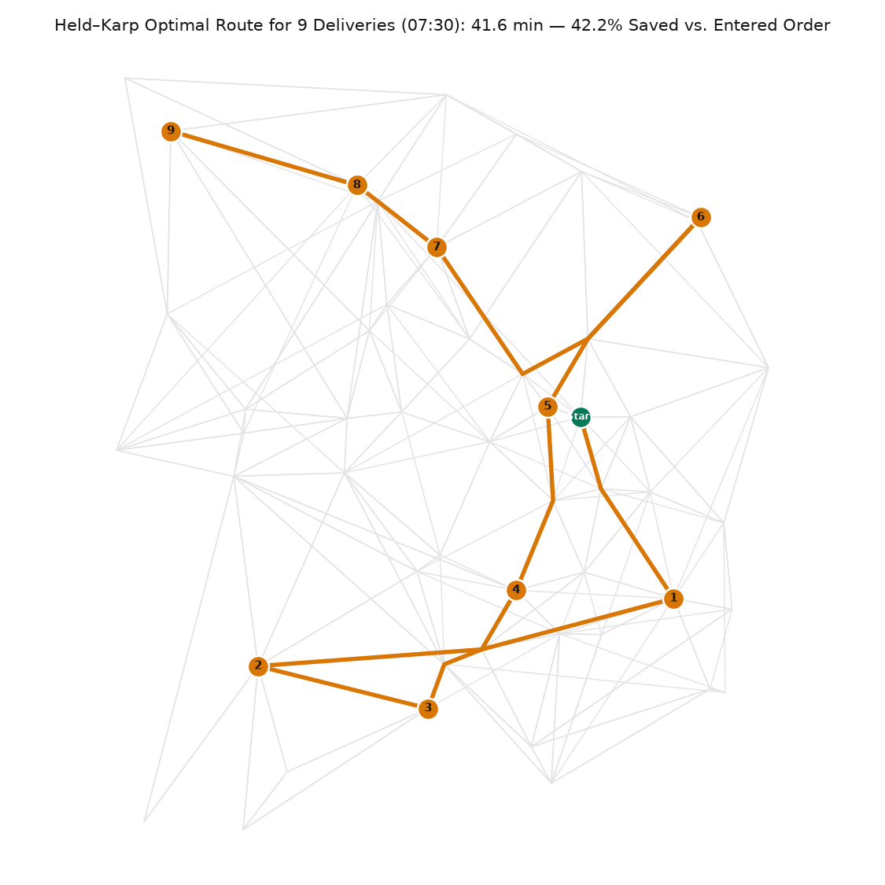

*Figure h.3. Held–Karp trip on `G_demo` under the 07:30 configuration. “Start” is Saigon Central Post Office, and labels 1–9 indicate the nine-stop visiting order. “41.6 min” is the conversion of 2,494.9 `balanced` seconds to minutes, not field-measured travel time. Source: Project Experiment 7 [P4].*

#### h.3.5. Interpretation of Results

Held–Karp reduces `balanced` cost by 1,825.2 seconds relative to the entered order, equivalent to 30.4 converted minutes or 42.2%. This demonstrates that an entered order can be substantially inferior even when UCS optimizes every pairwise leg.

NN is only 1.6% above the exact reference in this experiment and has the lowest solver time. This is consistent with its role as a fast-response method, but one instance cannot turn 1.6% into an approximation guarantee. Other inputs may amplify the effects of the initial greedy choices and local minima.

The best of five SA trajectories matches Held–Karp, but the mean of $2{,}584.6\pm66.0$ seconds shows that the seeds do not yield identical quality. Reporting dispersion and seed policy is therefore more informative than reporting only the best run. SA's observed runtime exceeds those of NN + 2-opt/Or-opt and Held–Karp in Experiment 7, consistent with its evaluation of 10,000 candidates across five seeds; one instance, however, is insufficient to establish causality or general performance.

#### h.3.6. Effect of Congestion

Congestion enters $f_{\mathrm{cong}}(e,h)$; changing `time_slot` can therefore change edge weights, pairwise UCS paths, and ultimately matrix $C$. The optimal ATSP order can consequently change even when the point set remains fixed.

Experiment 7, however, runs only at 07:30 and therefore **does not** provide a causal comparison of multiple congestion levels for ATSP. Independent evidence from Experiment 4 shows that 149 of 200 point-to-point pairs on `G_real` change path between 07:30 and 22:00 [P4]. This supports the premise that ATSP's input legs are sensitive to traffic configuration, but it does not justify the claim that “74.5% of ATSP trips change order.” A direct evaluation of visiting-order effects would hold the point set fixed and repeat Experiment 7 across all four time slots.

### h.4. Optimality and Approximation of the Results

Held–Karp is the only one of the three methods that guarantees a **global optimum for the given matrix, objective, and trip form**, provided $n\le15$. NN + 2-opt/Or-opt and SA are heuristics without approximation-quality guarantees: NN + 2-opt/Or-opt terminates at a local minimum under the implemented 2-opt and Or-opt neighborhoods, whereas SA performs a finite stochastic search intended to escape local minima. Their proximity to the optimum is assessed experimentally against Held–Karp; matching or approaching Held–Karp in Experiment 7 does not alter either method's theoretical guarantee.

#### h.4.1. Classification by Method

Classifying a result as optimal or approximate requires two distinct levels of conclusion. A **method guarantee** states whether the algorithm always returns an optimum when its premises hold. **Observed quality** states whether a particular experimental solution coincides with the exact reference. The two are not equivalent: a heuristic may find the optimum in one instance while offering no guarantee on another input.

In this section, an “approximate solution” means a feasible solution without an optimality certificate. NN + 2-opt/Or-opt and SA are **not** approximation algorithms with a guaranteed ratio, because the project proves no bound applicable to all inputs.

*Table h.12. Optimality classification of Experiment 7 results.*

| Method | Returned cost (equivalent s) | Evaluation evidence | Method guarantee | Scope-appropriate conclusion |
|---|---:|---|---|---|
| Held–Karp | **2,494.9** | Dynamic programming considers every subset–endpoint state on the same matrix | **Yes**, when the matrix is complete and $n\le15$ | Global optimum of the Experiment 7 model |
| NN + 2-opt/Or-opt | 2,534.2 | 39.3 seconds, or 1.58%, above Held–Karp | **No**; no general approximation bound | Near-optimal by observation, but still a heuristic solution |
| SA, best of five seeds | **2,494.9** | Same order and cost as Held–Karp within numerical tolerance | **No**; a finite cooling schedule provides no optimality certificate | This solution is verified after the fact as optimal for this instance; SA remains heuristic |

**Held–Karp—exact solution.** The 2,494.9-second result is globally optimal for the cost matrix, `balanced` objective, time slot, and trip form used in Experiment 7. Optimality follows from the dynamic-programming recurrence over all required states, not merely from being the lowest value in one experimental table.

**NN + 2-opt/Or-opt—approximate solution.** The 2,534.2-second result is substantially below the entered-order baseline but remains 39.3 seconds (1.58%) above the exact reference. The algorithm establishes only that no further improvement exists in the implemented neighborhoods; it provides neither an approximation ratio nor a certificate of global optimality.

**Simulated Annealing—approximate method with an instance-optimal observed solution.** The best of five seeds matches Held–Karp in both order and cost, so this particular Experiment 7 solution can be verified after the fact as optimal. The mean best cost across seeds is nevertheless $2{,}584.6\pm66.0$ seconds, demonstrating dependence on the stochastic trajectory; a finite cooling schedule does not make SA exact.

In summary, Held–Karp is **optimal by algorithmic guarantee**; NN + 2-opt/Or-opt is **approximate and 1.58% above the optimum** in the measured instance; and the best SA result is **verified as optimal through post hoc comparison**, without implying that SA is always optimal. “Optimal” here applies only to the defined model—graph, traffic profile, `balanced` objective, 07:30 time slot, and open trip—not to real-world traffic in an absolute sense.

#### h.4.2. Testing and Reproducibility

The tests in [P3] verify properties that directly determine result validity.

*Table h.13. ATSP test groups and verified properties.*

| Test group | Verified evidence |
|---|---|
| Asymmetry | Test matrices explicitly satisfy $c_{ij}\ne c_{ji}$ |
| Exact-solver correctness | Held–Karp is cross-checked by exhaustive enumeration on a test matrix and on multiple seeded asymmetric matrices |
| Matrix correctness | `build_matrix` matches a NetworkX reference for every `mode` and all four time slots on `G_demo` |
| Deterministic heuristic | NN + 2-opt/Or-opt terminates at a local minimum in the tested neighborhoods; heuristic cost never falls below the exact reference in test cases |
| SA | Identical seeds reproduce results; both open and closed trips are valid; best solutions and aggregate statistics are consistent |
| Contract and boundary errors | Total and leg fields are consistent; return-to-start behavior, size limits, and nonexistent nodes are validated |

In the version used for this report, **17/17 ATSP test cases pass**. Experiment 7 figures are linked to the result file, execution environment, and source/data SHA-256 values in provenance record [P4], allowing readers to identify the exact inputs that generated the reported values independently of the prose description.

#### h.4.3. Limitations and Threats to Validity

The following limitations delimit the conclusions precisely rather than negating the value of the experiment.

1. **Experimental coverage remains narrow.** Experiment 7 examines one 10-point set, one 07:30 slot, one `balanced` objective, and one open trip. It does not characterize quality distributions, failure probability, or runtime across multiple point sets, values of $n$, all three cost modes, all four time slots, and both open and closed trips.
2. **The demo graph and traffic profile are representative models.** Experiment 7 uses the 51-node `G_demo` contracted from `G_real` and a `tomtom+synthetic` profile. TomTom covers only a subset of edges; the remainder uses reproducible synthetic data with a fixed seed. Four traffic snapshots were collected on two different Mondays rather than as a continuous same-day series. The results therefore do not fully represent every route or traffic condition in Ho Chi Minh City.
3. **The `balanced` function is not a calibrated ETA.** Congestion coefficients and risk penalties are team-selected model parameters. “Equivalent seconds/minutes” express the model's objective value and do not establish actual delivery time, safety, or field risk.
4. **The cost matrix is a static snapshot.** Every leg in a trip uses the same `time_slot`; the system does not update weights according to the time at which the courier actually begins each leg. A trip spanning a peak period may consequently be evaluated with a profile that is no longer appropriate for later legs.
5. **The path model omits some operational constraints.** The graph does not yet model turn restrictions or turn costs through edge-based states, instantaneous closures, vehicle restrictions, service time at a stop, or delivery-entrance coordinates. An order optimal under the current matrix may cease to be optimal after these constraints are introduced.
6. **Performance evidence is insufficient to establish scalability.** Each Experiment 7 timing is one solver-side wall-clock measurement on one machine; it excludes matrix construction and includes no warm-up, repeated trials, percentiles, or peak-memory measurement. The timing order in Table h.10 describes only this run.
7. **The heuristics have no quality bound, and SA depends on its configuration.** NN's 1.6% gap and the best SA seed's match with Held–Karp in Experiment 7 do not create an approximation guarantee. SA currently uses five fixed seeds and 2,000 iterations per seed; the report has not studied sensitivity to initial temperature, cooling rate, neighborhood structure, or iteration budget.
8. **Scale and business-scope limits remain.** The API supports at most 16 points and Held–Karp at most 15. The system optimizes a single courier without capacities, time windows, service times, multiple depots, pickup–delivery relationships, or multiple vehicles; it is therefore not a complete Vehicle Routing Problem (VRP) system.

#### h.4.4. When Should Each Method Be Used?

*Table h.14. Method-selection recommendations by requirement.*

| Requirement | Recommended method | Rationale |
|---|---|---|
| Provably optimal result, $n\le15$ | Held–Karp | Exact solver suitable for small instances |
| Fast, deterministic, and readily explained response, $n\le16$ | NN + 2-opt/Or-opt | Deterministic; produced a good result at low runtime in Experiment 7 |
| Exploration beyond local minima with additional runtime accepted, $n\le16$ | SA | Multiple seeded trajectories may discover regions missed by local search |
| $n>16$ | Outside the current implementation scope | Requires a newly designed, evaluated solver and contract; current capability must not be overstated |

#### h.4.5. Future Improvements

Future work is prioritized by how directly it addresses the preceding limitations. Each item includes verification criteria so that future work remains measurable rather than becoming an untestable feature list.

*Table h.15. ATSP improvement roadmap and required evidence.*

| Priority | Improvement area | Proposed change | Minimum evidence of completion |
|---:|---|---|---|
| 1 | Expand the experimental matrix | Generate multiple point sets for $n\in\{5,8,10,12,15,16\}$; run all three cost modes, four time slots, and open/closed trips. Repeat timings, separate matrix-construction time from solver time, and measure peak memory. | State case counts, seeds, and handling rules for unsolved cases; report medians, the 95th percentile (P95), or another appropriate distribution, gaps from Held–Karp, and dispersion across SA seeds. |
| 2 | Calibrate cost and traffic data | Compare free-flow time, congestion multipliers, and penalties with observed travel time; collect same-day samples over several weeks, increase edge coverage, and store reliability and provenance for each edge–time-slot value. | Report prediction error on a held-out set, the proportion of edges supported by direct observations versus aggregate data, and uncertainty intervals; do not label `balanced` as ETA unless calibration criteria are met. |
| 3 | Time-dependent ATSP | Replace static matrix $C$ with costs that depend on departure time from each point; update accumulated time after each leg and select the corresponding traffic profile. | A test demonstrates that the same point set can change order as departure time changes; every leg remains valid on the directed graph, and recomputed total cost matches the response. |
| 4 | Scalable solvers for larger instances | Retain Held–Karp as an exact baseline for small sets; for larger sets, evaluate branch-and-bound or mixed-integer linear programming (MILP) as time-limited references and ATSP-capable heuristics/metaheuristics such as ALNS, LKH, genetic algorithms, or ant-colony optimization. Every move must be evaluated asymmetrically. | Report the best-known cost, bound and gap where available, time budget, and quality-over-time curve; do not claim optimality without a certificate. |
| 5 | Reuse and accelerate matrix construction | Cache matrices and paths by graph fingerprint, traffic profile, scenario, cost mode, time slot, and point set; consider parallel independent multi-target UCS runs within resource limits. | Reused responses are identical in all specified fields; a changed fingerprint invalidates the cache; end-to-end experiments include matrix construction and confirm unchanged routes. |
| 6 | Extend ATSP to VRP/VRPTW | Add multiple couriers, capacities, time windows, service times, depots, pickup–delivery relationships, and return rules; separate the cost objective from feasibility constraints. | Validators accept and reject requests correctly; every order is served once, without capacity or time-window violations; small cases match an exact reference. |
| 7 | Increase road-network fidelity | Add turn restrictions and costs, closures, vehicle restrictions, route geometry, and actual delivery entrances; rebuild matrices when topology changes. | Regression tests cover prohibited turns and one-way roads; geometry renders correctly; every leg passes directed-path validation and uses no forbidden edge. |
| 8 | Robust optimization under uncertainty | Optimize across multiple congestion and risk scenarios rather than one snapshot, using an expected-cost or robustness objective with explicit trade-offs. | Report cost by scenario, worst-case cost, regret, and order stability; distinguish observations from inference and never present assumptions as real-time data. |

Priority 1 should be completed first: the expanded experiment will reveal whether the principal bottleneck lies in matrix construction, Held–Karp, or heuristic quality. Evidence can then guide the choice among acceleration, a new solver, a time-dependent model, or VRP. This sequence keeps every extension tied to a specific evaluation question and acceptance criterion.

#### h.4.6. Multi-Location Optimization Conclusion

The three methods form a well-stratified toolkit. Held–Karp supplies a reliable exact reference for small point sets; NN + 2-opt/Or-opt provides fast, deterministic solutions and remains safe for asymmetric matrices by recomputing complete candidate costs; and SA broadens exploration through controlled acceptance of worsening moves over five reproducible seeds.

In Experiment 7, the optimal order reduces `balanced` cost by 42.2% relative to the entered order. NN is only 1.6% above Held–Karp; the best of five SA trajectories matches Held–Karp but exhibits between-seed variation and requires more time. The scope-appropriate conclusion is that the system implements, tests, and compares one exact solver with two heuristics on a directed ATSP. Observed quality is strong in Experiment 7, but only Held–Karp guarantees optimality, and conclusions about congestion, speed, and scalability remain subject to the stated experimental limits.

## i. Program Instructions

### i.1. Installation and Setup Instructions

#### i.1.1. Environment Requirements

| Component | Version verified |
|---|---|
| OS | Windows 11 + PowerShell |
| Python | 3.14.0 |
| Node.js / npm | 24.14.1 / 11.11.0 |
| Backend | FastAPI 0.140.0, Pydantic 2.13.4 |
| Frontend | Next.js 15.5.22, React 19.2.8, TypeScript 5.9.3 |

Python dependencies are pinned in `backend/requirements.txt`; frontend
dependencies are locked in `frontend/package-lock.json`.

#### i.1.2. Install Dependencies

From the repository root, in PowerShell:

```powershell
# 1) Create a Python virtual environment and install backend dependencies
py -3.14 -m venv .venv
.\.venv\Scripts\python.exe -m pip install -r backend\requirements.txt

# 2) Install frontend dependencies
Set-Location frontend
npm ci
Set-Location ..
```

No API key or network access is required to run the demonstration because the
graph and traffic data are prebuilt and committed under `data/`.

#### i.1.3. Run the Application (Two Terminals)

**Terminal 1—backend (FastAPI, port 8000):**

```powershell
Set-Location backend
..\.venv\Scripts\python.exe -m uvicorn app.main:app --port 8000
```

**Terminal 2—frontend (Next.js, port 3000):**

```powershell
Set-Location frontend
npm run dev
```

#### i.1.4. Open the Application

| What | URL |
|---|---|
| Main GUI | <http://localhost:3000> |
| Benchmark viewer (read-only) | <http://localhost:3000/benchmark> |
| Backend API docs (Swagger) | <http://localhost:8000/docs> |

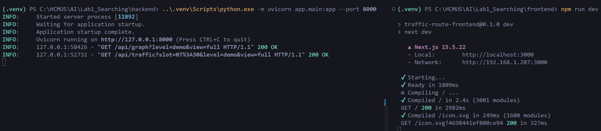

---

### i.2. Guidelines for Using the GUI

#### i.2.1. Overall Layout

The application opens in Vietnamese by default. The top bar contains a
**language switcher** with a globe/languages icon and the options
"Vietnamese" and "English." Selecting **English** immediately renders all
interface labels, buttons, tooltips, and notifications in English. Location
names on the map and in the Start/Goal/stop lists are dataset values and
therefore remain in their original Vietnamese form in either interface
language.

The main screen then has three areas:

1. **Left panel—Setup:** graph, time slot, objective, problem type,
   start/goal (or stop list), run mode, and algorithm.
2. **Center—Map:** the graph, the timeline player, and the resulting
   route(s). A single run uses one large map; comparing algorithms opens
   one map per algorithm side by side.
3. **Right drawer—Results:** four tabs—**Metrics**, **Explanation**,
   **Compare**, **Experiment**.


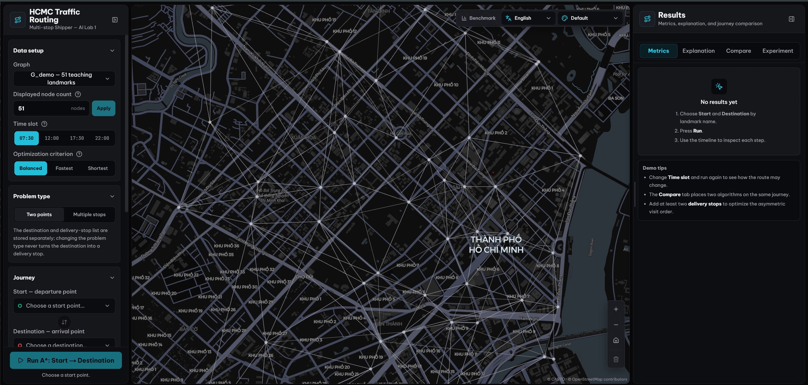

#### i.2.1.1. `G_demo` and `G_real`: Why the Walkthrough Uses `G_demo`

The **Graph** field at the top of the Setup panel switches between the two
datasets included with the application:

- **`G_demo`:** 51 curated points of interest (40 landmarks, 7 schools,
  3 hospitals, and 1 warehouse) connected by 298 directed edges. Its scale
  keeps every expanded or frontier node in a search trace individually
  legible, so Start and Goal can be selected from lists (§2.2.1, step 5).
- **`G_real`:** the processed OpenStreetMap-derived road network for the
  study area in Ho Chi Minh City, with 2,118 nodes and 4,699 directed edges.
  Its experimental scale is too dense for visual inspection of individual
  trace steps; endpoints are therefore selected directly on the map rather
  than from a list.

All subsequent examples, screenshots, and procedures use **`G_demo`** so that
algorithm behavior and search traces remain legible.

`G_real`:
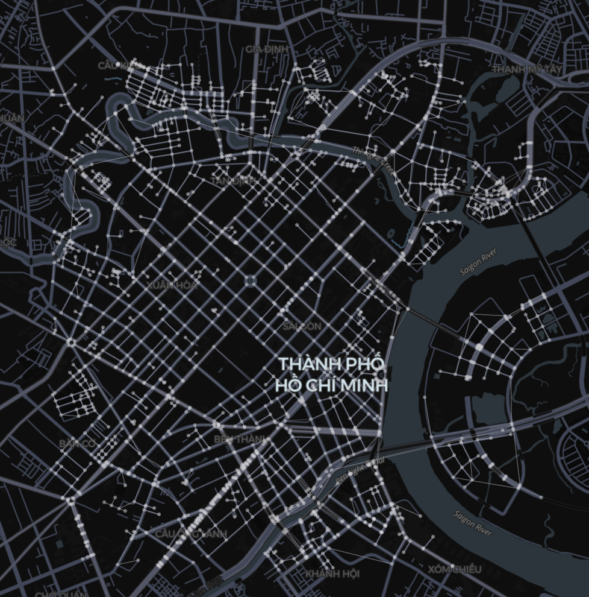

`G_demo`:
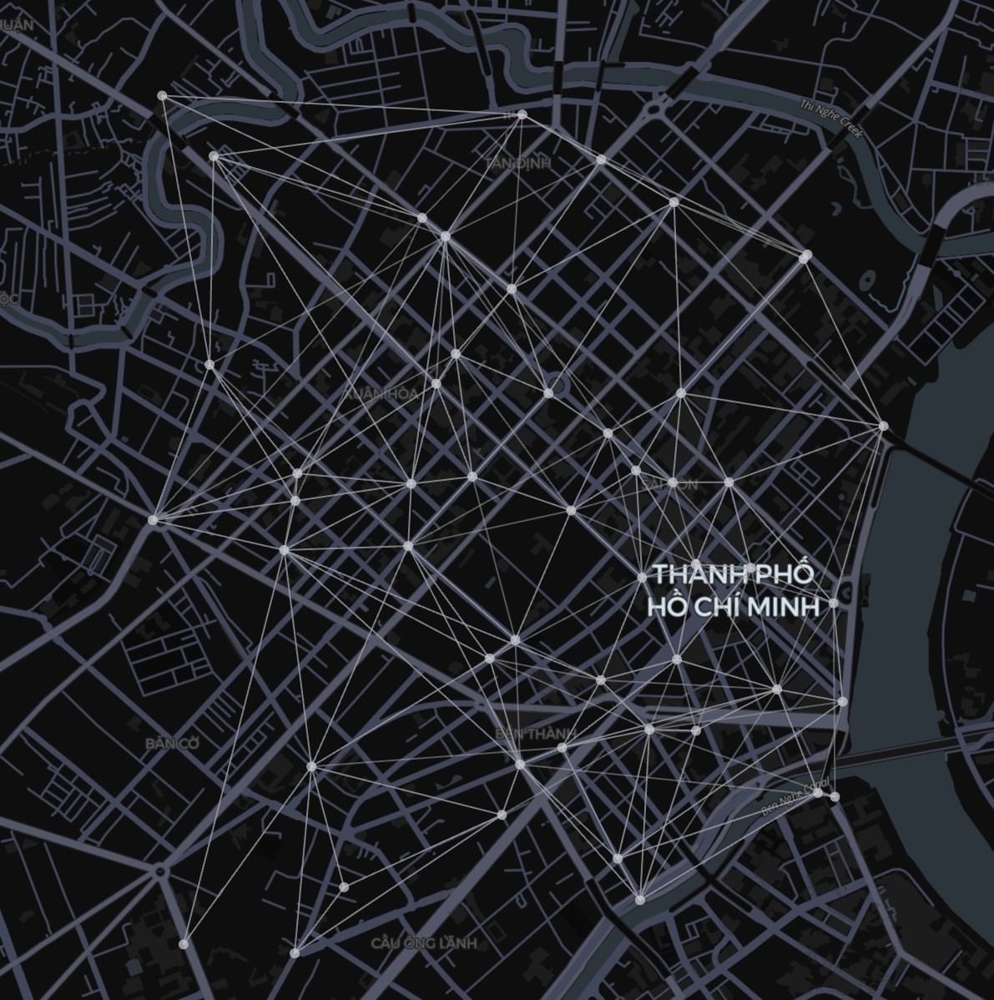

#### i.2.1.2. Adjusting the Node Count in `G_demo`

When `G_demo` is selected, the **Displayed node count** field defaults to 51,
which represents the complete teaching graph. The user may enter a value from
3 to 51 and select **Apply** to load a smaller *connected* subgraph. This
operation reloads the `G_demo` subgraph and clears any existing journey or
result. The field is disabled when `G_real` is selected, because that graph
always retains all 2,118 nodes. A subgraph of approximately 7–20 nodes is
particularly suitable for projection: every expanded or frontier node remains
visible from a distance, at the cost of reducing the number of routable
locations.

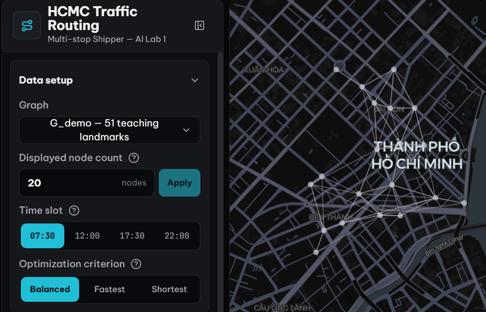

*`G_demo` with Displayed node count set to 20.*

#### i.2.1.3. Display Options: Congestion Layer and Offline Mode

Two switches under **Display** in the Setup panel control map overlays only;
neither changes the computed route.

- **Congestion layer:** colors every edge according to its congestion level
  from 1 to 5 for the selected time slot, ranging from green (level 1,
  free-flowing) through yellow and orange to red (level 5, most congested).
  This overlay supports visual inspection of why the Balanced or Fastest
  objective favors one route over an apparently shorter alternative.
- **Offline mode:** disables MapLibre/Carto basemap tiles, which require
  network access, and displays only graph nodes and edges on a blank
  background. It supports demonstrations without an Internet connection and
  affects only background rendering, not routing or search behavior.

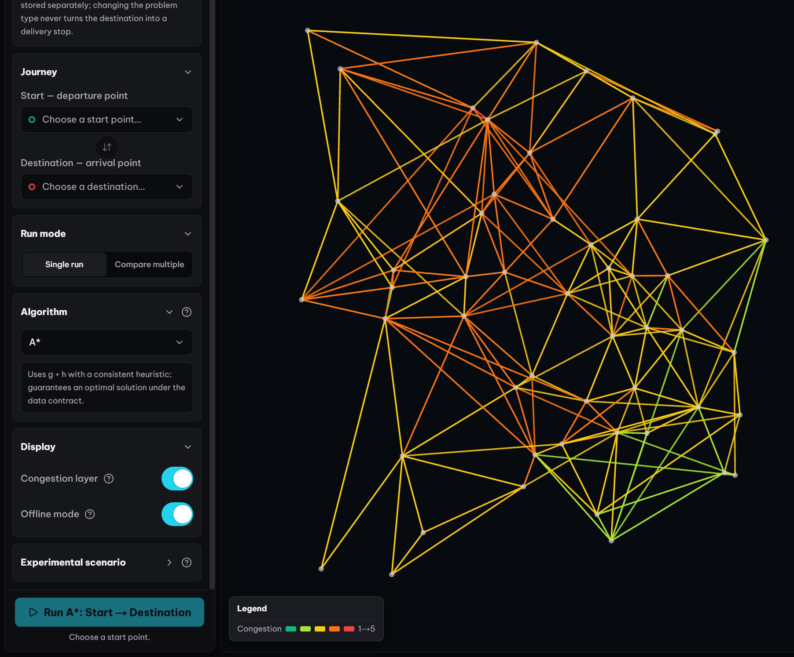

*`G_demo` with Congestion layer and Offline mode enabled.*

#### i.2.1.4. Theme Selector

The **palette selector** in the top bar, adjacent to the language switcher,
displays a palette icon and the current theme name. It changes the color
palette of maps, panels, badges, and text across the interface. Seven themes
are available: **Default** (cyan, violet, and amber control-room palette),
**White** (bright, clean, and neutral), **Black** (deep black with electric-blue
accents), **Pastel pink** (pastel pink and baby blue), **Lavender** (lavender
and berry pink), **Sage & cream**, and **Lemon** (lemon and pale green). This
setting is purely visual and has no effect on routing, search behavior, or
reported values.

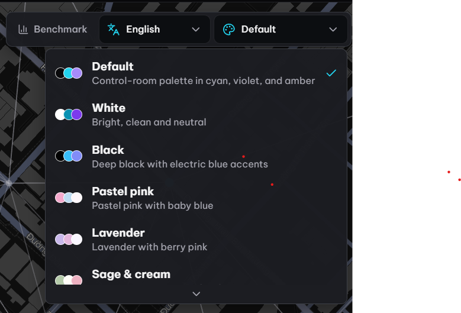

*Top bar with the palette selector open, showing the swatch, name, and
description of each of the seven themes; Default is selected.*

#### i.2.1.5. Benchmark Viewer

The **Benchmark** link in the top bar opens `/benchmark`, a visual overview of
the project's seven official offline experiments, including nodes expanded
and runtime by algorithm, congestion and route-change statistics, gamma-weight
sensitivity, and the ATSP comparison. The page reads only prebuilt files under
`results/`; it neither reruns benchmarks nor writes data, so opening it does
not affect the application state.

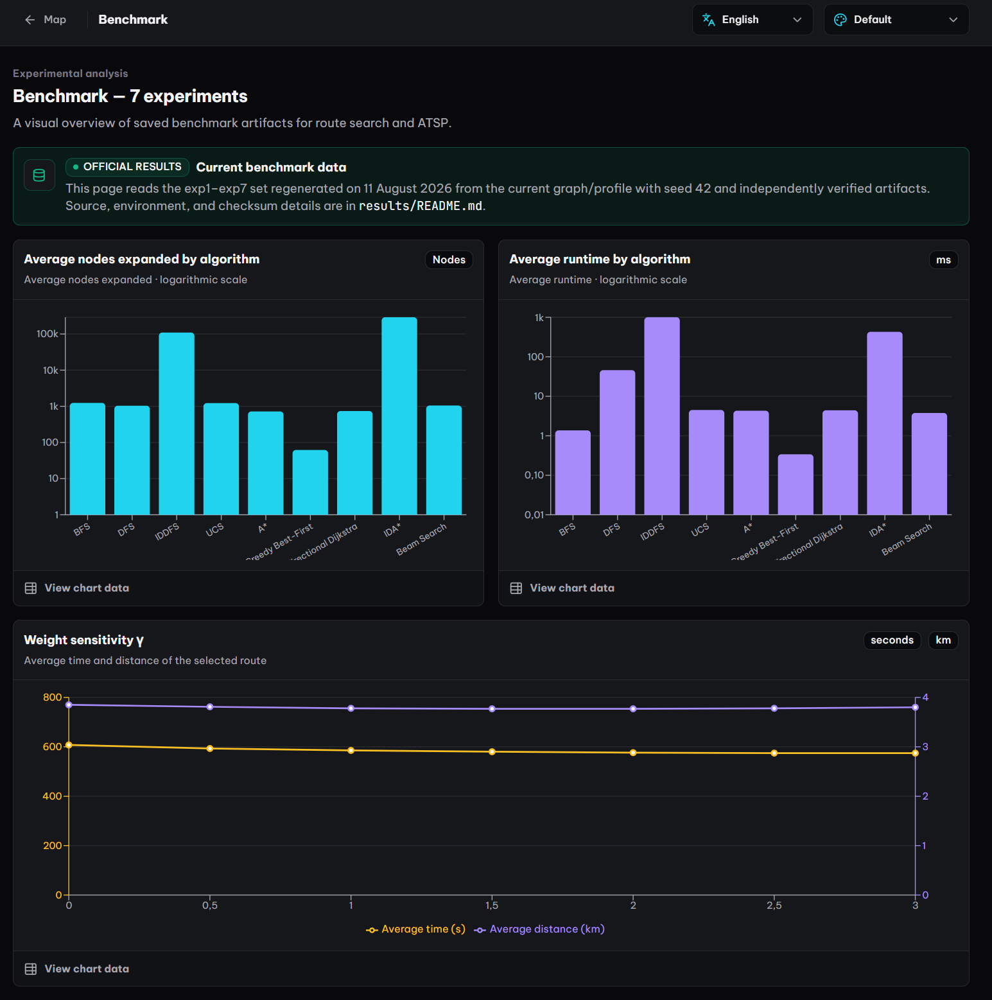

*The Benchmark page: nodes-expanded and runtime bar charts per algorithm,
and the gamma weight-sensitivity line chart with its data table below.*

#### i.2.2. Point-to-Point Search

##### i.2.2.1. Procedure for Running a Single Algorithm

1. **Graph:** select `G_demo`, the small teaching graph that displays the
   complete trace, or `G_real`, the full experimental network with 2,118
   nodes.
2. **Time slot:** select `07:30`, `12:00`, `17:30`, or `22:00`; each time slot
   has a distinct congestion profile.
3. **Objective** (`balanced` / `time` / `distance`):
   - **Balanced:** travel time plus penalties for risk factors (flood,
     construction, narrow alley, and traffic light).
   - **Fastest:** estimated travel time under the selected time slot's
     congestion, without risk penalties.
   - **Shortest:** distance alone; congestion and risk are displayed as
     context but do not change the selected route.
4. **Problem type:** select **Two points**.
5. **Start / Destination:** the selection method depends on the graph:
   - For **`G_demo`**, which contains 51 named nodes, select Start and Goal
     from the lists.
   - For **`G_real`**, which contains 2,118 nodes and is too large for a
     practical list, select **Pick on map** and then click two nodes directly
     on the map.
6. **Run mode:** select **Single run**.
7. **Algorithm:** select one of the nine available algorithms: BFS, DFS,
   IDDFS, UCS, A*, Greedy Best-First Search, Bidirectional Dijkstra, IDA*, or
   Beam Search. Beam Search and IDA\* provide additional numeric fields for
   overriding the default beam width or epsilon.
8. Select the run button. Its label has the form **"Run {algorithm}: Start →
   Destination"**; it displays endpoint roles rather than the actual location
   names.

After processing is complete, the map displays the final route and the result
drawer opens automatically.

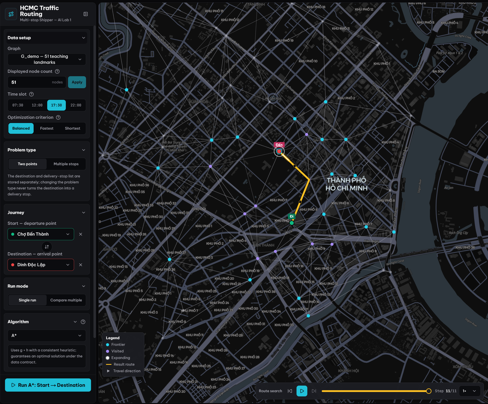

*Left panel configured for the example: `G_demo`, time slot 17:30, Balanced
objective, Two points problem, Start at Chợ Bến Thành, Destination at Dinh Độc
Lập, Single run mode, and A\*. The image was captured before selecting Run so
that all selection fields remain visible.*

##### i.2.2.2. Reading a Result: Metrics, Explanation, and the Timeline

- **Metrics tab:** separates *journey outcome* (distance, time, and cost under
  the selected objective) from *search effort* (nodes expanded, maximum
  frontier size, and runtime in milliseconds). It also displays one of three
  optimality badges:
  **Optimality guaranteed**, **Additive ε-bound guaranteed** (IDA\* only),
  or **No optimality guarantee—trade-off** (for example, Greedy Best-First
  Search and Beam Search).
- **Timeline** (floating bar below the map): supports backward/forward steps,
  play/pause, slider navigation, and speed adjustment. The highlighted node,
  frontier, and expanded set update to match the displayed step.
- **Explanation tab:** presents a plain-language account of the specific
  result in the following order:
  - **Conclusion:** verdict headline plus optimality/gap badges (for example,
    Exact optimum, Total balanced cost, Gap from exact optimum).
  - **"Why was this route selected?"** (single point-to-point run only): select
    one of up to two post-run reference routes (computed after the fact by
    UCS) from the **Compare with** dropdown, click **Show on map** to draw
    it as a dashed line next to the solid result route, and read a
    side-by-side table (Distance / Congestion-adjusted time / Congestion
    delay / Total risk penalty / Balanced cost; an **Included** badge
    marks the rows that count toward the active objective) plus a one-line
    verdict on how much better or worse the result route is.
  - **"How is the cost broken down?":** every cost component (distance,
    free-flow time, congestion-adjusted time, congestion delay, risk
    penalty, balanced cost) as a flat list, each tagged **Context only** or
    **Included in the objective**.
  - **"Why does the total cost have this value?":** the same components
    presented as narrative cards (for example, congestion delay and traffic-light
    penalty) with their added amount and an expandable **Data source** note
    per card. If any segment of the result route has congestion level 4-5
    for the selected time slot, this section also shows a note that those
    segments are drawn in **red on the map**; this red highlight is result
    evidence only, not the algorithm's current timeline position.
  - **"What is the algorithm doing? · Step N/N":** a one-line plain-language
    explanation of the algorithm's current step (tied to the timeline's
    current step), with expandable technical detail: the node being
    expanded, the exact selection rule, the evidence right before the step,
    and the effect right after it.

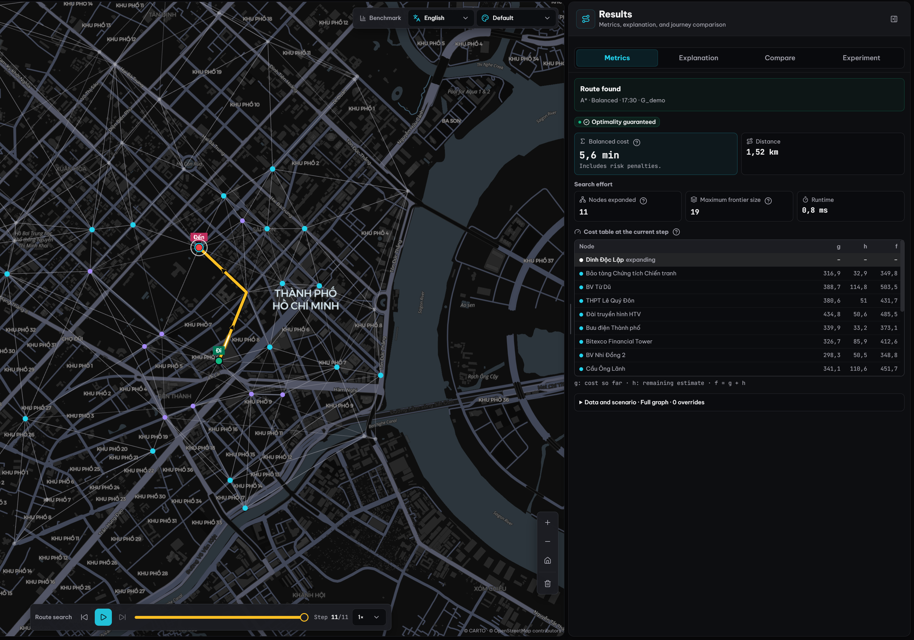

*The A\* result from §2.2.1, with the right drawer open on the Metrics tab and
the timeline partway through playback; expanded and frontier nodes are visible
together with the highlighted current node.*

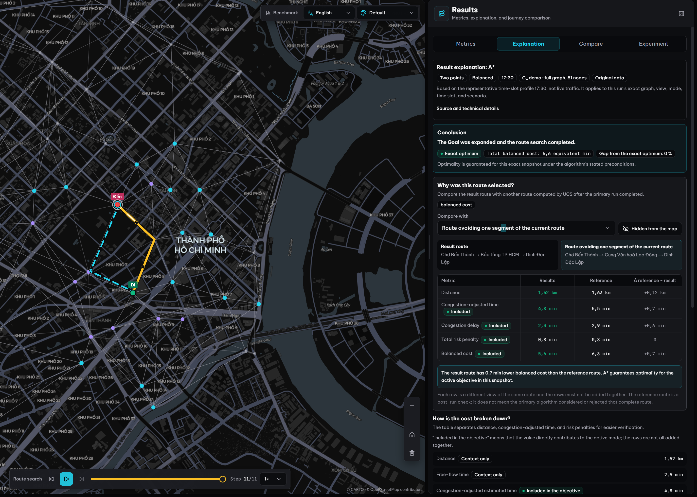

*The same result with the right drawer on the Explanation tab. After Show on
map is selected, the map displays the dashed reference route beside the solid
result route; the drawer contains the Conclusion, the "Why was this route
selected?" panel, the reference-route selector, and the
Distance/Time/Delay/Risk/Balanced comparison table.*

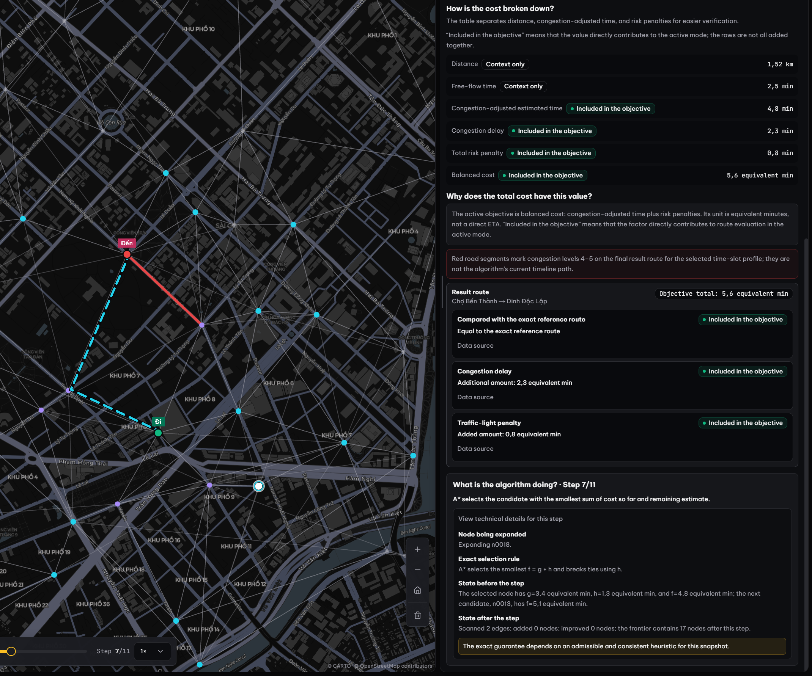

*The same result farther down the Explanation tab: "How is the cost broken
down?", "Why does the total cost have this value?" with per-factor Data source
notes, and "What is the algorithm doing? · Step N/N" with expandable technical
detail. On the map, the red segment of the result route marks a congestion
level 4–5 section for the selected time slot.*

##### i.2.2.3. Procedure for Comparing Two to Four Algorithms

1. Retain the Start/Goal pair or stop sequence to be compared.
2. Under **Run mode**, select **Compare multiple**.
3. Add between two and four algorithms to the comparison list; an existing
   selection must be removed before a fifth can be added.
4. Select **"Compare {N} algorithms,"** where \(N\) is the number of selected
   algorithms.

The map is divided into \(N\) independent panes, one per algorithm; panning or
zooming one pane does not move the others. The **Compare** tab presents an \(N\)-way
table (Status, Objective-cost rank, the outcome metrics for the active
mode, Nodes expanded, Maximum frontier size, Runtime, Result guarantee),
with the lowest value in each row highlighted. A failed or "no path"
algorithm does not block the others and may be retried independently.

Below the table, each algorithm has its own **Explanation** button that
switches the drawer to the Explanation tab bound to that result, with
two differences from a single run's Explanation tab: Compare mode has no
timeline, so the **"What is the algorithm doing?"** section is fixed on
one step instead of scrubbable; and the interactive **"Why was this route
selected?"** reference-route panel (the **Compare with** dropdown plus
**Show on map**) is single-run only and does not appear here.

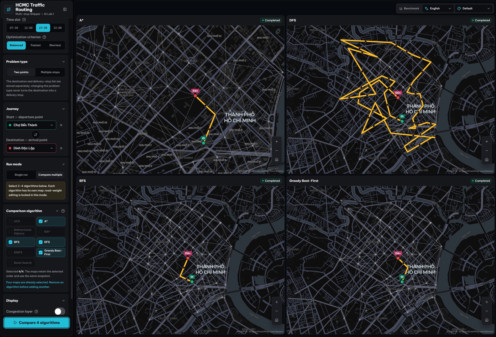

*Comparison mode with A\*, DFS, BFS, and Greedy Best-First Search on the same
Chợ Bến Thành → Dinh Độc Lập pair, immediately after selecting "Compare four
algorithms"; four map panes are visible side by side.*

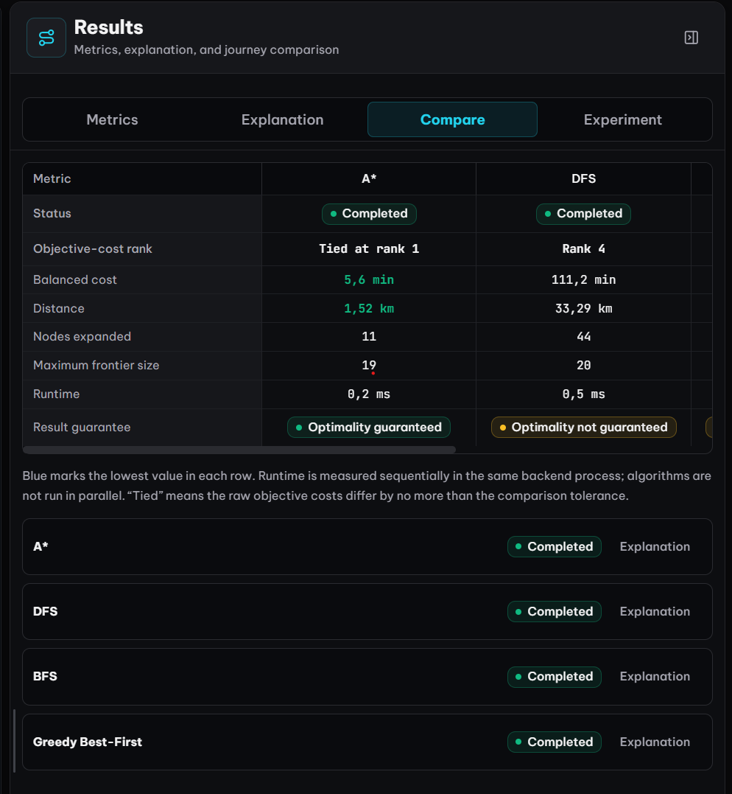

*Right drawer, Compare tab: the metrics table (Status, Objective-cost rank,
Balanced cost, Distance, Nodes expanded, Maximum frontier size, Runtime,
Result guarantee) plus the per-algorithm Status/Explanation row list below
it.*

#### i.2.3. Multi-Point Journey (ATSP)

##### i.2.3.1. Procedure for Running a Multi-Point Journey

Under **Problem type**, select **Multiple stops**, enter the **Start** as the
depot, add the delivery **stops**, and then select one of two
strategies:

- **Visit stops in the selected order:** preserves the exact user-entered
  order and uses the selected route-search algorithm (§2.2.1). The system
  chains one point-to-point search per leg (Start→stop 1, stop 1→stop 2, ...)
  and merges the legs into one continuous route. Select **Single run**; the
  execution button has the form **"Run {algorithm} in the selected order."**
- **Optimize visit order with ATSP:** the user specifies only the *set* of
  stops, and the backend determines the visiting *order*. Select one of three
  methods, retain **Single run**, and then select **"Optimize with {method}":**
  - **Held–Karp:** exact optimum with a guaranteed best order, practical up to
    15 points total.
  - **NN + 2-opt/Or-opt:** fast Nearest Neighbor heuristic followed by local
    improvement.
  - **Simulated Annealing:** heuristic search over five fixed random seeds.

Two additional controls appear beside the stop list in the Setup panel:

- **Return to the start after the last stop** is disabled by default and
  applies to both strategies. When enabled, the system adds exactly one
  closing leg from the final stop to Start; Start does not become an
  additional delivery stop. When disabled, the trip remains open and ends at
  the final delivery stop.
- **Show optimization trace** is available only for a single ATSP run and is
  disabled by default. When enabled, it records the optimizer's step-by-step
  decisions for replay on the timeline after execution; §2.3.2 explains how
  to interpret the trace. The function is unavailable in comparison mode.

After processing is complete, the map displays the optimized multi-leg route
and the result drawer opens automatically, as in a point-to-point run.

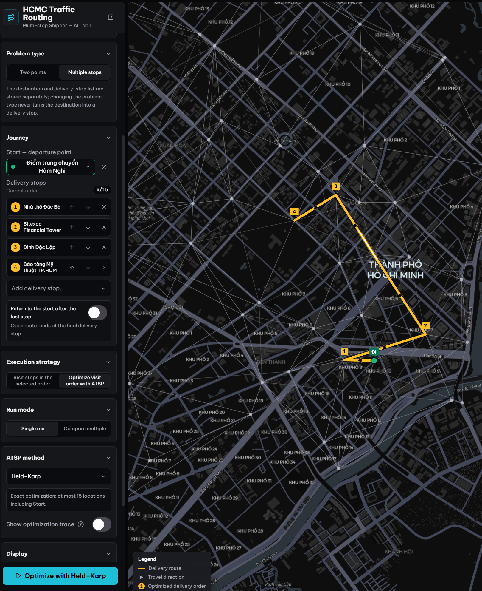

*ATSP example setup: Start at Điểm trung chuyển Hàm Nghi; stops at Nhà thờ Đức
Bà, Bitexco Financial Tower, Dinh Độc Lập, and Bảo tàng Mỹ thuật TP.HCM;
Optimize visit order with ATSP strategy; Held–Karp method. The image was
captured immediately before execution.*

##### i.2.3.2. Reading an ATSP Result: Metrics and Explanation

- **Metrics tab:** displays an optimality badge (**guaranteed** for
  Held–Karp, **approximate** for NN + 2-opt/Or-opt and Simulated Annealing),
  a before/after comparison (cost of the order as typed in vs the optimized
  order) with the percentage saved, and the full optimized visiting order as
  a numbered list (Start → stop 1 → stop 2 → ...). If **Show optimization
  trace** was enabled before execution, it also displays an **"Optimization process"**
  card: play it on the timeline to step through the optimizer's own
  decisions (for example, a Held–Karp dynamic-programming subset update, an
  NN selection, or an SA accepted/rejected move), with the order or subset being
  considered at that step and an expandable technical detail (sampling
  policy and raw event JSON). During playback, the map draws that candidate
  order as a **dashed** line—a visualization of the search rather than the
  actual delivery route—until the final step, when it switches to the
  real legs.
- **Explanation tab:** presents a plain-language account in the following order:
  **Conclusion** (verdict plus optimality/gap badges), **Entered order and
  result** (user-entered order vs. optimizer result order, side by side),
  a cost/savings **summary**, a **cost breakdown** (same Context
  only / Included in the objective rows as a two-point run), **directed
  cost matrix** evidence (asymmetric-pair example, matrix/optimizer
  runtime), and **method-specific statistics**: DP states solved for
  Held–Karp, candidate/accepted-move counts for NN + 2-opt/Or-opt, and
  per-seed best-cost/accepted-move counts for Simulated Annealing.

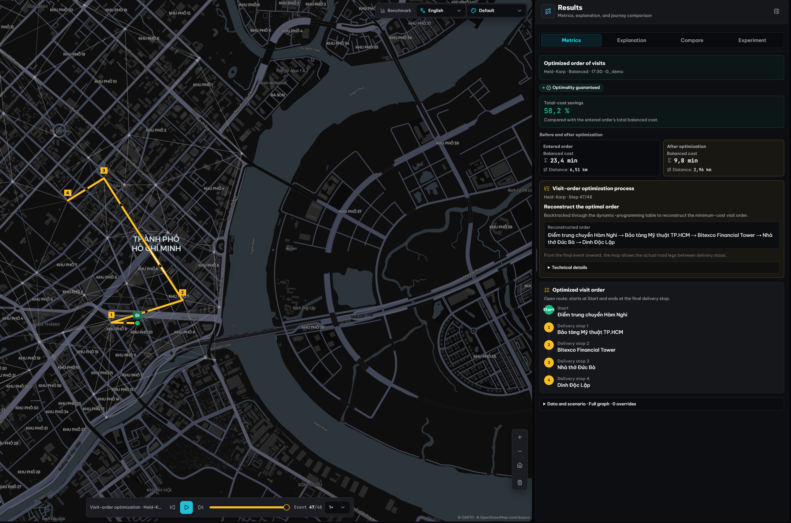

*Result from §2.3.1: the map displays all legs of the optimized multi-stop
route, while the Metrics tab in the right drawer presents the optimized order
and percentage saved relative to the entered order.*

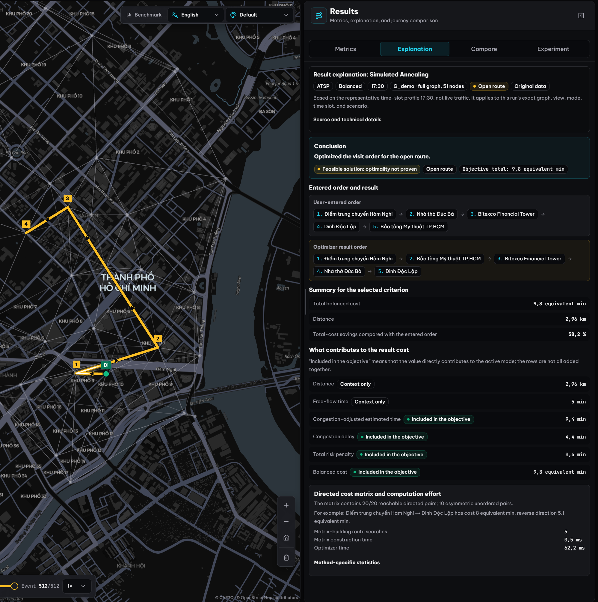

*The same result with the right drawer on the Explanation tab, showing the
plain-language verdict and Held–Karp dynamic-programming statistics.*

##### i.2.3.3. Procedure for Comparing Two to Three ATSP Methods

1. Retain the same Start and stops as in §2.3.1.
2. Under **Run mode**, select **Compare multiple**.
3. Select two or three methods, such as Held–Karp, NN + 2-opt/Or-opt, and
   Simulated Annealing.
4. Select **"Compare {N} ATSP methods."**

As in the point-to-point comparison, this opens \(N\) independent map panes,
one per method. The **Compare** tab first displays a **Baseline: entered
order** card representing the entered order rather than an ATSP method, so it
has no map pane. An \(N\)-way table then presents Status, Objective-cost rank,
Stops/legs, Optimized visit order, the outcome metrics for the active mode,
matrix-build effort, optimizer/backend runtime, savings relative to the
entered-order baseline, and—only when Held–Karp is selected and succeeds—the
exact gap from Held–Karp, with the lowest value in each row highlighted. Below
the table, each method has its own **Explanation** button (§2.3.2), except
comparison mode never records an optimization trace, so its "Optimization
process" card is not available here.

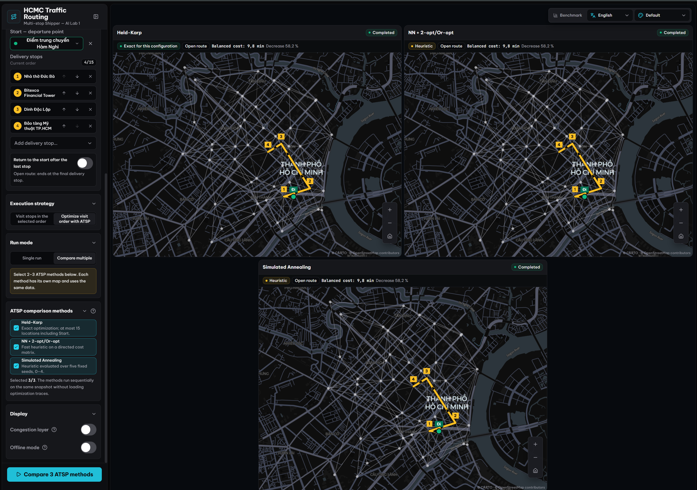

*All three ATSP methods compared on the same depot and four stops as in
§2.3.1, with three map panes displayed side by side.*

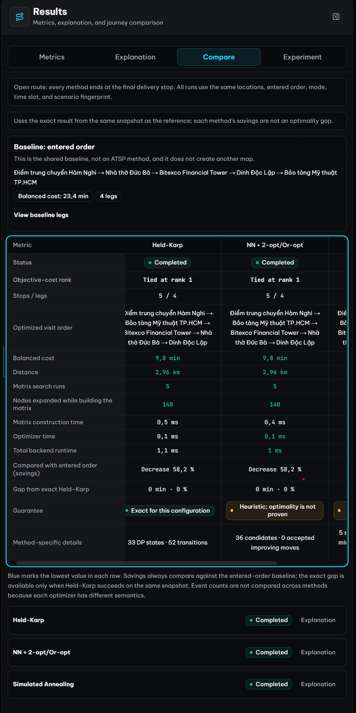

*The Compare tab in the right drawer: the Baseline: entered order card; the
Held–Karp/NN+2-opt/SA table covering cost, distance, matrix and optimizer
effort, savings, exact Held–Karp gap, guarantee, and method-specific details;
and the per-method Status/Explanation rows below.*

#### i.2.4. Scenario Sandbox ("Experiment" Tab)

Edge editing is available only in **Single run** mode for either problem type,
Two points or Multiple stops:

1. Enable edge-edit mode, then select two nodes on the map **in sequence—tail
   followed by head**.
2. In the **Experiment** tab, select a **Quick preset**, such as adding a
   flood, or manually edit length, free-flow speed, time-slot congestion, or
   risk flags under **Detailed editing**.
3. The tab shows a side-by-side **Original / Experimental** comparison of
   the edge's cost.
4. Run or rerun the algorithm. The new execution uses the edited edge; no
   on-disk data are modified, and the edit is visible only in the current
   browser session.

**Rationale for two ordered selections.** The graph is directed, so opposite
travel directions between the same node pair are separate edges, often with
different names and lengths. For example, one direction may be named Nam Kỳ
Khởi Nghĩa and the reverse direction Pasteur, while both are rendered on the
same screen line. A single click cannot reliably distinguish them. Edge-edit
mode therefore identifies an edge by selecting its **tail** node followed by
its **head** node in the intended direction of travel. If only the reverse edge
exists, the application reports this condition and permits reselection in the
opposite order rather than silently editing an unused edge.

An edit is stored when applied, before any run or comparison begins, and is
not bound to one run mode. An edge may therefore be edited in **Single run**
mode and then evaluated by every selected algorithm or method after switching
to **Compare multiple**. The restriction concerns only edit creation: the
edge-edit control is hidden in comparison mode, so a new edit or a change to
an existing edit must be made in **Single run** mode. Comparison mode can apply
an existing edit but cannot create one.

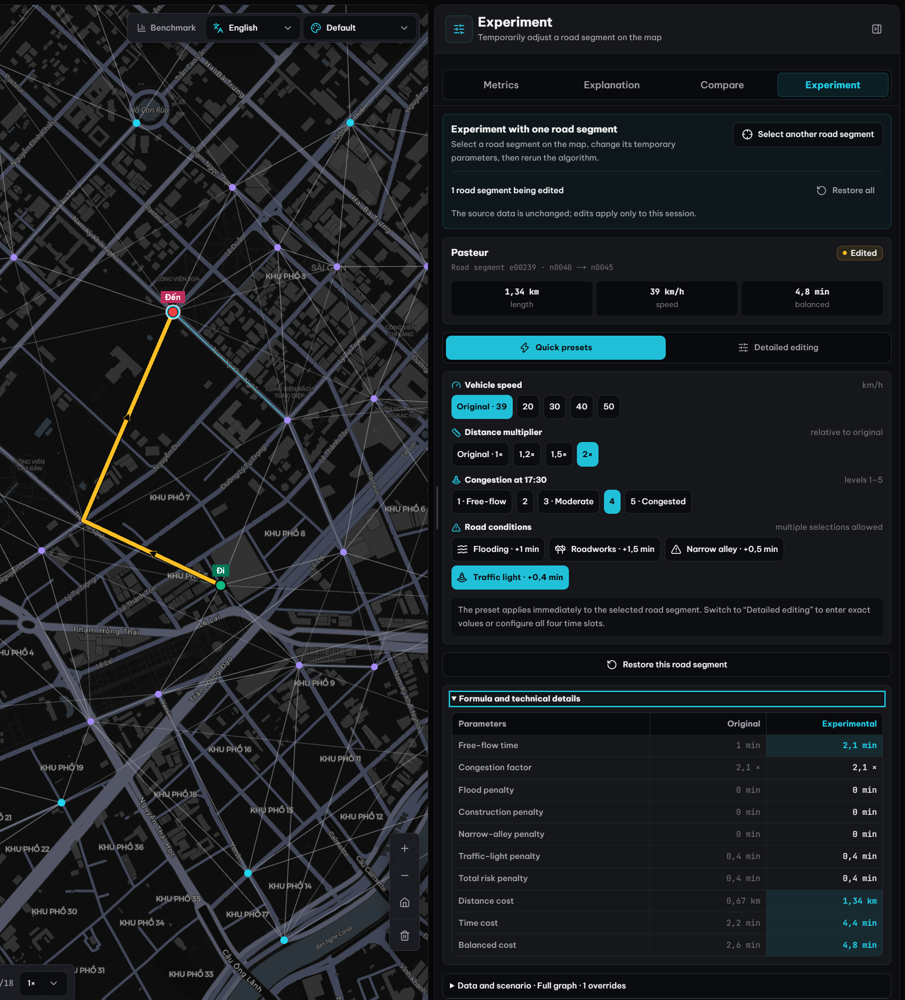

*Single run mode with the same Chợ Bến Thành → Dinh Độc Lập pair and 17:30
time slot as in §2.2.1. The length of the Pasteur segment on that route was
doubled, causing the route to change because the original path became more
costly.*

---

### i.3. Example Inputs and Outputs

All four examples use the same two landmarks for point-to-point cases or the
same depot and stop list for multi-point cases, allowing one configuration to
be followed throughout the section. Landmark names remain in their original
Vietnamese form when the interface is displayed in English, as noted above.

- **Two-point pair:** Start = **Chợ Bến Thành**, Goal = **Dinh Độc Lập**
  (Ben Thanh Market → Independence Palace).
- **Multi-point set:** Start = **Điểm trung chuyển Hàm Nghi**, stops =
  **Nhà thờ Đức Bà**, **Bitexco Financial Tower**, **Dinh Độc Lập**,
  **Bảo tàng Mỹ thuật TP.HCM**.
- **Common settings:** graph `G_demo`, time slot `17:30`, objective
  `Balanced`.

#### i.3.1. Single-Algorithm Run—A*

- **Input:** Start = Chợ Bến Thành, Goal = Dinh Độc Lập, algorithm = A*,
  mode = Balanced, slot = 17:30.
- **Output:** a route drawn on the map as a solid line, a step-by-step
  trace replayable on the timeline (expanded node, frontier, and the g/h/f
  values used at each step), and in the Metrics tab: total cost, distance,
  travel time, nodes expanded, runtime, and an **Optimality guaranteed**
  badge because A* with the documented admissible and consistent heuristic
  returns an optimal route under the graph's stated conditions.

See §2.2.1–§2.2.2 above for the matching screenshots.

#### i.3.2. Single ATSP Method Run—Held–Karp

- **Input:** Start (depot) = Điểm trung chuyển Hàm Nghi, stops = Nhà thờ
  Đức Bà, Bitexco Financial Tower, Dinh Độc Lập, Bảo tàng Mỹ thuật TP.HCM
  (four stops plus the depot, for five points in total), method = Held–Karp,
  mode = Balanced,
  slot = 17:30.
- **Output:** the exact optimal visiting order, guaranteed because five points
  fall within Held–Karp's exact-solution range; the full multi-leg route on
  the map; and, in the Metrics tab, the optimized-order cost, entered-order
  cost, and percentage saved.

See §2.3.1–§2.3.2 above for the matching screenshots.

#### i.3.3. Comparison—Point-to-Point (A* vs. DFS vs. BFS vs. Greedy Best-First)

- **Input:** the same pair as in §3.1 (Chợ Bến Thành → Dinh Độc Lập), with
  four selected algorithms: A*, DFS, BFS, and Greedy Best-First Search.
- **Output:** four map panes, one route per algorithm, and one \(N\)-way table.

See §2.2.3 above for the matching screenshots.

#### i.3.4. Comparison—Multi-Point (Held–Karp vs. NN+2-opt vs. Simulated Annealing)

- **Input:** the same depot and four stops as in §3.2, with three selected
  ATSP methods: Held–Karp, NN + 2-opt/Or-opt, and Simulated Annealing.
- **Output:** three map panes, one visiting order per method, and one
  three-way table containing total cost, percentage saved relative to the
  entered order, and the exact Held–Karp reference used to evaluate the other
  two methods.

See §2.3.3 above for the matching screenshots.

## j. Limitations and Future Work

This section distinguishes three categories: difficulties encountered during development, limitations that constrain interpretation of current results, and verifiable future extensions. This separation prevents deliberate design choices from being misclassified as failures and ties each proposed extension to a limitation it is intended to address.

### j.1. Difficulties and Challenges Encountered During Development

The first challenge was to construct a dataset that preserves the directed structure of the urban road network while remaining stable enough for reproducible experiments. Map data, traffic samples, delivery stops, and risk information came from different sources and resolutions; the team had to standardize them to one coordinate system, edge representation, and set of four time slots before computing costs.

The second challenge was balancing scale with visualization. \(G_{\text{real}}\) preserves a detailed road network for large-scale evaluation, whereas \(G_{\text{demo}}\) contracts multi-edge corridors into 51 named locations so that the search process can be observed. Corridor contraction must preserve direction and consistently aggregate length, time, road class, congestion, and risk flags; otherwise, the two graph resolutions would represent different problems.

The third challenge was bringing all nine route-search algorithms under one input model and one set of comparison metrics despite differences in their expansion mechanisms, frontier structures, stopping conditions, and theoretical guarantees. In the multi-stop problem, one-way roads make the cost matrix asymmetric, so outbound and reverse directions must be computed independently; improvement formulas valid only for symmetric costs cannot be used.

Finally, the data layer, algorithms, services, and interface must use the same graph, time slot, objective, and parameters. This consistency is essential for single routes, algorithm comparisons, multi-stop trips, and explanations to describe the same experimental session.

### j.2. Limitations of the Dataset, Cost Function, Algorithms, and System

The current product is an academic prototype for algorithm modeling and comparison, not a commercial delivery-navigation or dispatch system. The following limitations define the scope within which its results may be interpreted.

#### j.2.1. Traffic Data and Provenance

| Limitation | Effect |
|---|---|
| Coverage is limited to one central area of Ho Chi Minh City and only the largest strongly connected component is retained | Results do not represent the whole city or network regions excluded by connectivity filtering |
| Only four 40-point traffic batches were collected, on two Mondays seven days apart | Day-to-day, weekly, seasonal, rainfall, and event-related variation is not fully represented; the four time slots are representative observations only |
| In every time slot, 4,064 of 4,699 \(G_{\text{real}}\) edges use simulated fallback data | Time and balanced costs depend substantially on simulation rules where TomTom samples provide no coverage |
| Traffic-sample assignment depends primarily on distance between a query point and the tail node of a major-road edge | A sample may be assigned to a nearby edge with a different direction or physical segment |
| TomTom extracts retain only selected fields | Road geometry, segment identifiers, reliability values, and full metadata are unavailable for independent verification of every assignment |
| Five flooding and three construction zones are team-modeled circles based on historical-context sources | A risk flag does not establish a current incident, exact center/radius, severity, or validity period |

#### j.2.2. Graph Model and Locations

| Limitation | Effect |
|---|---|
| Same-direction parallel edges are consolidated, and turn restrictions are not retained | Branch/lane alternatives may be lost, and an edge sequence may violate a real-world turning rule |
| The routing graph does not retain detailed road geometry | The displayed line between edge endpoints does not reproduce the full curvature of the physical route |
| POIs are entered manually and snapped to road-network nodes | A representative node may not coincide with the delivery entrance; five POIs are more than 100 m from their input coordinates |
| The narrow-road flag is inferred from road class rather than measured width | Motorcycle accessibility may be misclassified, and the motor-vehicle base network may omit small alleys |
| \(G_{\text{demo}}\) represents an entire corridor as one edge with binary risk flags | One road name or class cannot describe every constituent segment, and repeated or varying exposure to one risk type may be simplified |

#### j.2.3. Cost Function and Time Model

| Limitation | Effect |
|---|---|
| Speeds by road class, \(\gamma=1.5\), and the 60/90/30/25-second penalties are team-designed parameters | Costs support comparison within the model but are not a field-calibrated estimated time of arrival (ETA) |
| Congestion is discretized into five levels | Continuous speed-loss information is reduced, and observations near a threshold may fall into different levels |
| Costs remain fixed during a query and are additive by edge | The model omits traffic change by edge-arrival time, spillback queues, turn delays, and interactions among segments |
| Risk is represented by binary flags with fixed delays | The model expresses no probability, severity, impact direction, or relationship between risk and weather |

#### j.2.4. Algorithms and Optimization Scope

##### j.2.4.1. Point-to-Point Routing

| Limitation | Effect |
|---|---|
| BFS, DFS, Greedy Best-First Search, and Beam Search do not guarantee minimum cost on a weighted graph | A returned route need not be least-cost; results must be interpreted according to each algorithm's guarantee rather than merely by found status |
| IDDFS caps depth at 100; IDA* uses a default 5-unit threshold increment and a 1,000-iteration cap; Beam Search retains only 50 candidates per level on the experimental graph | IDDFS and IDA* may terminate inconclusively at their caps, while Beam Search may prune the only branch reaching the goal; these parameters trade resources and latency against completeness and solution quality |
| The Haversine heuristic used by A*, Greedy Best-First Search, and IDA* is purely geographic; in time and balanced modes, it excludes congestion and risk penalties | This preserves admissibility and consistency for A*/IDA* under the current invariants, but the heuristic may be loose and need not reduce search substantially on every query |
| A* and IDA* guarantees require edge lengths no shorter than Haversine distance, speeds no greater than \(v_{\max}\), congestion multipliers at least 1, and non-negative penalties | If data processing, rounding, or a new cost function violates an invariant, the proof no longer applies automatically and solution quality must be revalidated |
| The principal evaluation uses 200 OD pairs, only the 07:30 and 22:00 profiles, one `balanced` objective, and a fixed execution order in one environment | Findings—including A*'s median advantage, the 74.5% route-change rate, and runtime rankings—do not automatically generalize across all modes, time slots, hardware, or road networks |
| Evaluation is restricted to a strongly connected directed component | Every sampled pair has a structural path; the experiment does not fully cover true no-path cases caused by disconnected topology, while Beam Search's four failures result from pruning rather than disconnection |
| Frontier size is reported as a state count rather than physical memory | Maximum frontier alone cannot determine RAM in bytes or the overhead of queues, stacks, visited sets, and parent maps |

These limitations explain why no point-to-point method dominates every criterion. UCS, A*, and Bidirectional Dijkstra provide exact optimal references under the stated conditions, but their practical advantage also depends on query characteristics. IDA* and IDDFS reduce frontier size at the cost of extensive re-expansion, while Greedy Best-First Search and Beam Search obtain speed or frontier bounds by risking solution quality or search success.

##### j.2.4.2. Multi-Location Optimization and Operating Scope

| Limitation | Effect |
|---|---|
| Held–Karp requires $O(n^2 2^n)$ time and $O(n2^n)$ memory; the current implementation limits it to 15 points, while the heuristics support at most 16 | The exact reference applies only to small point sets; the system offers no implemented, validated solution for more than 16 points |
| NN + 2-opt/Or-opt reaches only a local minimum under two implemented neighborhoods; SA uses a finite cooling schedule | Neither method provides an approximation ratio or optimality certificate; strong performance on one instance does not establish a general bound |
| SA uses five fixed seeds and 2,000 iterations per seed | Quality depends on budget, temperature, cooling rate, neighborhood, and seed; no sensitivity study identifies an appropriate configuration by scale |
| The main experiment studies one set with one start and nine stops, at 07:30, in `balanced` mode, with an open trip | The 42.2% savings, NN's 1.58% gap, and the best SA trajectory's match with Held–Karp describe this scenario only; they do not generalize across sizes, slots, modes, or closed trips |
| Experiment 7 records only one solver-time measurement after matrix construction | There is no complete evaluation of end-to-end latency, UCS matrix-construction cost, warm-up effects, timing distributions, or peak memory |
| The matrix requires a path for every ordered pair in the point set | One unreachable pair produces an incomplete matrix and fails the whole query; the design does not search for a feasible order on a partially connected matrix |
| A trip uses one fixed cost profile for all legs | The model does not reflect changing leg-departure times or support reoptimization when traffic updates during a trip |
| The problem currently considers one courier, one trip, and one fixed start | Multiple vehicles, capacities, multiple depots, service times, delivery windows, and pickup–delivery relationships are not modeled |

Within the evaluated scope, Held–Karp certifies an optimum on the current matrix; NN + 2-opt/Or-opt is 1.58% above that reference; and the best SA trajectory matches it, although the mean best cost across five seeds is $2{,}584.6\pm66.0$ equivalent seconds. This distinction reinforces the need to separate a **method guarantee** from the **quality of one observation**: a heuristic can find an optimal solution once without becoming an exact algorithm.

#### j.2.5. Application and Experimental Evaluation

| Limitation | Effect |
|---|---|
| The application is currently a demonstration prototype in a local web environment, without GPS integration, turn-by-turn guidance, or order synchronization | It is not yet usable as an operational delivery-navigation and dispatch tool |
| Evaluation currently relies on the project's software tests, data validation, and experiments | No user study or multi-day delivery trial measures time error, route quality, or field usability |
| Experimental results are tied to the current data snapshots and configuration | If data, costs, or algorithms change, results must be regenerated through the same controlled pipeline before being cited as evidence |

### j.3. Proposed Future Extensions

#### j.3.1. Real-Time Traffic and Improved Data Quality

Future collection should provide denser temporal and spatial coverage, prioritizing same-day and multi-day sessions and recording each observation's validity period and uncertainty. A data layer integrating traffic, flooding, incidents, and closures could be updated periodically or in real time. Before entering the cost function, every update should include its validity period, source, reliability, and rules for invalidating stale data.

Map matching should use segment geometry, identifiers, distance, bearing, flow direction, functional road class, and road name rather than node distance alone. Every assignment should also store a confidence score to support data audits.

#### j.3.2. Improving the Graph and Delivery Locations

A future model could preserve parallel edges when necessary, retain geometry and source identifiers, and add turn restrictions, turn delays, lane counts, access restrictions, and closure status. POIs should derive from geocoded sources with explicit provenance and be matched to delivery entrances rather than representative coordinates alone. Motorcycle-accessible alley data should be surveyed separately before geographic expansion.

#### j.3.3. Cost Calibration and Time-Dependent Routing

End-to-end travel times measured over multiple trips could calibrate speed, congestion multipliers, and risk penalties. Evaluation should report errors and uncertainty intervals rather than treating balanced cost as ETA. The model could then update cost at each edge's expected arrival time and reroute when the traffic profile changes.

#### j.3.4. Algorithmic Extensions and Scalability

##### j.3.4.1. Point-to-Point Routing

For point-to-point routing, the next controlled evaluation should cover all three cost objectives, all four time slots, and query strata defined by length, network density, and proportion of one-way edges. Runtime should be measured over repeated runs with alternating or randomized execution order and reported with variability intervals; memory should be measured directly in bytes rather than inferred from frontier size. A separate validation set on disconnected graphs or graphs with disabled edges is also needed to distinguish true no-path outcomes, pruning failures, and inconclusive cap-limited outcomes.

Sensitivity analysis should cover the IDDFS depth cap, the IDA* threshold increment and iteration cap, and Beam Search width. Results should present trade-offs among route quality, success rate, expanded nodes, memory, and runtime rather than select a parameter from one run. For optimal search, future work may study tighter geographic lower bounds, bidirectional A*, or road-network preprocessing. Any new heuristic or preprocessing artifact must be reverified for admissibility, consistency, and validity when the graph or cost profile changes; theoretical guarantees must not be weakened merely to reduce runtime.

##### j.3.4.2. Multi-Stop Visiting-Order Optimization

The first priority is to extend the experiment to multiple point sets of sizes 5, 8, 10, 12, 15, and 16 under all three cost modes, all four time slots, and both open and closed trips. Measurements should be repeated, with medians and 95th percentiles reported, while matrix-construction time, solver time, end-to-end latency, and peak memory are separated. Wherever Held–Karp remains feasible, heuristic quality should be reported as a gap from the exact reference; for SA, the full distribution across seeds should accompany the best solution.

For larger point sets, Held–Karp should remain the exact benchmark on small instances. Branch-and-bound or mixed-integer route models can provide bounds or certificates within a time budget; new heuristics and metaheuristics must evaluate all moves asymmetrically and be assessed through quality-over-time curves. Results without certificates must be described as best-known or approximate solutions, not inferred to be optimal.

Matrices and paths could be cached by graph, traffic-profile, scenario, cost-mode, time-slot, and point-set fingerprints; changing any component must invalidate the cached data. A subsequent time-dependent ATSP model should update cost according to the expected departure time from each stop rather than use one fixed profile for the whole trip. Another direction is robust optimization across multiple congestion and risk scenarios, jointly reporting expected cost, worst-case cost, regret, and visiting-order stability.

#### j.3.5. Extension to Multi-Vehicle Routing

A natural extension is the Vehicle Routing Problem and Vehicle Routing Problem with Time Windows, incorporating multiple couriers or vehicles, capacities, multiple depots, service times, and delivery windows. These problems fit the last-mile delivery context but are substantially more complex than optimizing the visiting order for one existing vehicle (Jazemi et al., 2023).

In such an extension, the cost objective must be separated clearly from feasibility constraints. At minimum, validation should establish that each order is served exactly once, capacity and time-window constraints are respected, and start/return rules are correct. Small instances should be checked against an exact reference before heuristic evaluation at scale.

#### j.3.6. Map-API Integration, Deployment, and Field Validation

A map-API integration layer could provide geocoding, route geometry, map matching, traffic incidents, and turn-by-turn instructions. Provider data should not replace the current model as a black box; it should be normalized into a directed graph with recorded source and version, then checked for interoperability, units, and cost semantics before routing. Deployment design must also address rate limits, data-use terms, cache policy, degraded operation during service outages, and server-side protection of access keys.

A deployable version could integrate GPS, turn-by-turn guidance, and order management, followed by courier trials across multiple time periods. Evaluation should jointly measure route quality, travel-time error, stability under data updates, usability, accessibility, and target-device performance. Only after this validation would there be evidence for judging practical suitability.

### j.4. Proposed Order of Priorities

| Horizon | Priority work | Expected outcome |
|---|---|---|
| Short term | Expand data validation across time slots and no-path cases; analyze IDDFS, IDA*, and Beam Search parameter sensitivity; extend ATSP experiments by size, mode, time slot, and trip form; record assignment confidence | Distinguish failure states correctly, quantify algorithmic trade-offs, and obtain multi-stop quality distributions instead of relying on one instance |
| Medium term | Measure memory and end-to-end latency; evaluate bounded or certified ATSP solvers; introduce controlled matrix caching; integrate a map API experimentally; expand traffic coverage, improve map matching, and calibrate costs | Increase scale while preserving verifiability and make routes and modeled costs more representative of field conditions |
| Long term | Develop time-dependent routing and ATSP; robust optimization; VRP/VRPTW; GPS, order-management, and field-trial integration | Progress from a single-trip optimization prototype to an empirically validated multi-vehicle dispatch-support system |

These priorities place data quality and model validation before increasing the number of algorithms. This order preserves interpretability and reproducibility while directly addressing the present limitations.

## References

Ben Thanh Water Supply Joint Stock Company. (2021). *Notice of water-supply interruption for works at the Vo Thi Sau–Pasteur and Vo Van Tan–Truong Dinh intersections and on Tran Quoc Thao Street* [Notice in Vietnamese]. https://benthanh.sawaco.com.vn/tin-tuc/hoat-dong-san-xuat-kinh-doanh/thong-bao-ve-viec-gian-doan-cung-cap-nuoc-de-phuc-vu-cong-tac.-vi-tri-thi-cong-giao-lo-vo-thi-sau-pasteur-giao-lo-vo-van-tan-truong-dinh-va-198-tran-quoc-thao-thuoc-phuong-vo-thi-sau-va-phuong-9-quan-3..html

Boeing, G. (2025). Modeling and analyzing urban networks and amenities with OSMnx. *Geographical Analysis, 57*(4), 567–577. https://doi.org/10.1111/gean.70009

Boysen, N., Fedtke, S., & Schwerdfeger, S. (2021). Last-mile delivery concepts: A survey from an operational research perspective. *OR Spectrum, 43*, 1–58. https://doi.org/10.1007/s00291-020-00607-8

Coppola Suriani, A., Wai-Poi, M., Dray, S. S. J., Sosa, M. E., Nguyen, T.-H. T., & Nguyen, H. T. T. (2025). *Viet Nam rising: Pathways to a high-income future*. World Bank. https://documents.worldbank.org/en/publication/documents-reports/documentdetail/099072225231030509

Cormen, T. H., Leiserson, C. E., Rivest, R. L., & Stein, C. (2022). *Introduction to algorithms* (4th ed.). MIT Press.

Croes, G. A. (1958). A method for solving traveling-salesman problems. *Operations Research, 6*(6), 791–812. https://doi.org/10.1287/opre.6.6.791

Dechter, R., & Pearl, J. (1985). Generalized best-first search strategies and the optimality of A*. *Journal of the ACM, 32*(3), 505–536. https://doi.org/10.1145/3828.3830

Dijkstra, E. W. (1959). A note on two problems in connexion with graphs. *Numerische Mathematik, 1*, 269–271. https://doi.org/10.1007/BF01386390

Hajek, B. (1988). Cooling schedules for optimal annealing. *Mathematics of Operations Research, 13*(2), 311–329. https://doi.org/10.1287/moor.13.2.311

Hart, P. E., Nilsson, N. J., & Raphael, B. (1968). A formal basis for the heuristic determination of minimum cost paths. *IEEE Transactions on Systems Science and Cybernetics, 4*(2), 100–107. https://doi.org/10.1109/TSSC.1968.300136

Held, M., & Karp, R. M. (1962). A dynamic programming approach to sequencing problems. *Journal of the Society for Industrial and Applied Mathematics, 10*(1), 196–210. https://doi.org/10.1137/0110015

Ho Chi Minh City People's Committee. (2016, November 30). *Decision No. 6261/QD-UBND promulgating the implementation plan for the 10th Ho Chi Minh City Party Congress Resolution on the 2016–2020 Flood Reduction Program* [Decision in Vietnamese]. *Ho Chi Minh City Gazette*. https://congbao.hochiminhcity.gov.vn/cong-bao/van-ban/quyet-dinh/so/6261-qd-ubnd/ngay/30-11-2016/tai-ve/42090

Jazemi, R., Alidadiani, E., Ahn, K., & Jang, J. (2023). A review of literature on vehicle routing problems of last-mile delivery in urban areas. *Applied Sciences, 13*(24), 13015. https://doi.org/10.3390/app132413015

Kirkpatrick, S., Gelatt, C. D., Jr., & Vecchi, M. P. (1983). Optimization by simulated annealing. *Science, 220*(4598), 671–680. https://doi.org/10.1126/science.220.4598.671

Korf, R. E. (1985). Depth-first iterative-deepening: An optimal admissible tree search. *Artificial Intelligence, 27*(1), 97–109. https://doi.org/10.1016/0004-3702(85)90084-0

Nhan Dan Newspaper. (2005, August 19). *Heavy rain and high tides cause flooding in Ho Chi Minh City* [Article in Vietnamese]. https://nhandan.vn/mua-to-trieu-cuong-gay-ngap-ung-tai-tp-ho-chi-minh-post410945.html

OpenStreetMap contributors. (n.d.). *Copyright and license*. OpenStreetMap. Retrieved August 16, 2026, from https://www.openstreetmap.org/copyright

Pohl, I. (1971). Bi-directional search. In B. Meltzer & D. Michie (Eds.), *Machine intelligence 6* (pp. 127–140). Edinburgh University Press.

Russell, S. J., & Norvig, P. (2021). *Artificial intelligence: A modern approach* (4th ed.). Pearson. https://www.pearson.com/en-us/subject-catalog/p/artificial-intelligence-a-modernapproach/P200000003500/9780137505135

Tien Phong Newspaper. (2025, November 5). *Bui Vien backpacker street floods after heavy rain in Ho Chi Minh City* [Article in Vietnamese]. https://tienphong.vn/pho-tay-bui-vien-ngap-sau-mua-lon-o-tphcm-post1793541.tpo

TomTom. (n.d.-a). *Flow segment data*. TomTom Traffic API documentation. Retrieved August 16, 2026, from https://docs.tomtom.com/traffic-api/documentation/tomtom-maps/v1/traffic-flow/flow-segment-data

TomTom. (n.d.-b). *Ho Chi Minh traffic report*. TomTom Traffic Index. Retrieved August 16, 2026, from https://www.tomtom.com/traffic-index/city/ho-chi-minh/

Tran, T. (2013, September 19). *Ho Chi Minh City: A sinkhole suddenly appears in the middle of a road* [Article in Vietnamese]. *Dan Tri*. https://dantri.com.vn/thoi-su/tphcm-ho-tu-than-bat-ngo-xuat-hien-giua-duong-1380068305.htm

Vietnam News Agency. (2024, May 27). *Ho Chi Minh City: Many streets severely flooded after torrential rain* [Article in Vietnamese]. https://baotintuc.vn/xa-hoi/tp-ho-chi-minh-ngap-nang-nhieu-tuyen-duong-sau-con-mua-nhu-trut-nuoc-20240527215404154.htm

Vietnam News Agency. (2025, November 5). *Ho Chi Minh City: Rising tides leave many streets deeply flooded* [Article in Vietnamese]. https://baotintuc.vn/anh/tp-ho-chi-minh-trieu-cuong-dang-cao-nhieu-tuyen-duong-ngap-sau-20251105181405682.htm

VnExpress. (2024, June 15). *Ho Chi Minh City to renovate the square in front of Ben Thanh Market beginning in October* [Article in Vietnamese]. https://vnexpress.net/tp-hcm-chinh-trang-quang-truong-truoc-cho-ben-thanh-tu-thang-10-4758459.html

## Project Source Code, Data, and Empirical Evidence

The following project-internal evidence is listed separately from the APA 7 reference list.

- [P1] [`backend/app/tsp.py`](../../backend/app/tsp.py): matrix construction, Held–Karp, NN + 2-opt/Or-opt, SA, and multi-stop orchestration.
- [P2] [`docs/SCHEMA.md`](../../docs/SCHEMA.md): cost contract, `POST /api/multiroute`, and optimization-trace contract.
- [P3] [`backend/tests/test_tsp.py`](../../backend/tests/test_tsp.py): targeted ATSP tests.
- [P4] [`results/exp7_tsp.csv`](../../results/exp7_tsp.csv), [`results/exp4_congestion.csv`](../../results/exp4_congestion.csv), [`results/README.md`](../../results/README.md), and [`results/figs/exp7_tsp_map.png`](../../results/figs/exp7_tsp_map.png): Experiment 7 results, Experiment 4 route-sensitivity evidence, execution environment, SHA-256 provenance, and the official route figure.
- [P5] [`docs/GIAI-THICH-THUAT-TOAN.md`](../../docs/GIAI-THICH-THUAT-TOAN.md): four-point example generated from project source code and data.
- [P6] [`frontend/components/control-panel.tsx`](../../frontend/components/control-panel.tsx), [`frontend/components/atsp/atsp-setup.tsx`](../../frontend/components/atsp/atsp-setup.tsx), [`frontend/lib/store.ts`](../../frontend/lib/store.ts), [`frontend/lib/run-orchestrator.ts`](../../frontend/lib/run-orchestrator.ts), and [`frontend/components/atsp/atsp-compare.tsx`](../../frontend/components/atsp/atsp-compare.tsx): open/closed-trip control, configuration snapshots, correct `return_to_start` mapping into API requests, and ATSP result presentation.
