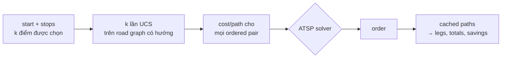
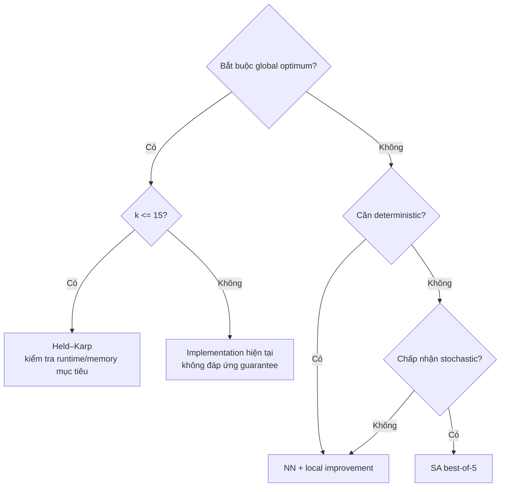

# Ba thuật toán tối ưu thứ tự giao hàng đa điểm

Tài liệu này giải thích ba phương pháp tối ưu thứ tự giao hàng trên directed cost
matrix được tạo từ road graph: **Held–Karp** (exact dynamic programming),
**Nearest Neighbor kết hợp 2-opt/Or-opt** (greedy construction rồi local search),
và **Simulated Annealing** (stochastic metaheuristic). Bài toán thuộc lớp ATSP
(Asymmetric Traveling Salesman Problem).

---

## Mục lục

1. [Mục tiêu và phạm vi](#1-mục-tiêu-và-phạm-vi)
2. [Bài toán giao hàng đa điểm](#2-bài-toán-giao-hàng-đa-điểm)
3. [Cost, mode và cost matrix](#3-cost-mode-và-cost-matrix)
4. [Pipeline của hệ thống](#4-pipeline-của-hệ-thống)
5. [Backend contract và UI behavior](#5-backend-contract-và-ui-behavior)
6. [Ký hiệu và ví dụ chung](#6-ký-hiệu-và-ví-dụ-chung)
7. [Tổng quan ba thuật toán](#7-tổng-quan-ba-thuật-toán)
8. [Held–Karp](#8-heldkarp)
9. [Nearest Neighbor và local improvement](#9-nearest-neighbor-và-local-improvement)
10. [Simulated Annealing](#10-simulated-annealing)
11. [Cách đọc optimization trace trên UI](#11-cách-đọc-optimization-trace-trên-ui)
12. [So sánh ba thuật toán trên cùng một ví dụ](#12-so-sánh-ba-thuật-toán-trên-cùng-một-ví-dụ)
13. [Lựa chọn thuật toán](#13-lựa-chọn-thuật-toán)
14. [Benchmark status](#14-benchmark-status)
15. [Kết luận](#15-kết-luận)
- [Phụ lục A — API/UI contract](#phụ-lục-a--apiui-contract)
- [Phụ lục B — Độ phức tạp end-to-end](#phụ-lục-b--độ-phức-tạp-end-to-end)
- [Phụ lục C — Code/test mapping](#phụ-lục-c--codetest-mapping)
- [Phụ lục D — Full DP table](#phụ-lục-d--full-dp-table)

---

## 1. Mục tiêu và phạm vi

**Phạm vi tài liệu.** Tài liệu ban đầu bám theo implementation tại source snapshot
`2328d5f`; audit 2026-08-08 trên base HEAD `8a78a22` cùng current worktree xác
nhận solver ATSP không đổi semantics. UI presentation đã được đồng bộ theo
`docs/DESIGN.md` §12: bốn tab kết quả và đơn vị nhìn thấy là km/phút. Tài liệu
không viết theo kiến thức thuật toán chung. Mọi claim về
hành vi thuật toán, số lượng iteration, tie-breaking, acceptance condition, v.v. đều
đối chiếu với code thực thi.

Ví dụ trong tài liệu là **dữ liệu tổng hợp**, không phải dữ liệu giao thông thật.
Benchmark trong `results/` hiện là artifact cũ theo `results/README.md` — không được
trích số vào tài liệu chính.

Sau khi đọc xong, người đọc sẽ:

- Hiểu sự khác nhau giữa road graph, delivery points, leg, tour và cost matrix.
- Hiểu UCS tạo matrix còn ba ATSP solver chọn order.
- Hiểu cost đang tối ưu thay đổi theo `mode`.
- Phân biệt exact DP, greedy + local search và stochastic metaheuristic.
- Chạy tay được ba thuật toán trên cùng một ví dụ.
- Giải thích được optimality guarantee.
- Đọc được optimization trace trên UI.
- Biết chọn phương pháp phù hợp.
- Phân biệt theory, backend capability và UI behavior.

---

## 2. Bài toán giao hàng đa điểm

### 2.1. Shipper, depot và delivery points

Một **shipper** (người giao hàng) xuất phát từ một **depot** (kho hàng) và cần giao
hàng tại nhiều **delivery points** (điểm giao). Mỗi delivery point là một node được
chọn trên road graph — không đồng nghĩa với mọi giao lộ mà đường đi có thể đi qua.

### 2.2. Leg, order và tour

Một **leg** (chặng) là shortest path trên road graph từ một điểm được chọn đến điểm
kế tiếp. Một **order** là danh sách các điểm theo thứ tự thăm, chứa mỗi điểm đúng
một lần, với depot nằm ở `order[0]`. Một **tour** là tuyến hoàn chỉnh gồm các leg
nối liền theo order.

### 2.3. Open tour và closed tour

- **Open tour:** bắt đầu tại depot và kết thúc tại delivery point cuối.
- **Closed tour:** bắt đầu tại depot và có thêm closing leg từ delivery point cuối
  trở về depot. Depot không được lặp lại ở cuối `order`; closing leg được tạo riêng
  từ `order[k-1]` về `order[0]`.

Tour cost được tính:

$$
\text{open\_cost} = \sum_{i=0}^{k-2} C[\text{order}[i],\;\text{order}[i+1]]
$$

$$
\text{closed\_cost} = \text{open\_cost} + C[\text{order}[k-1],\;\text{order}[0]]
$$

Open tour có `k - 1` leg; closed tour có `k` leg.

### 2.4. ATSP và directed cost matrix

Vì road graph có hướng (đặc biệt do đường một chiều), cost đi từ A đến B nói chung
khác cost đi từ B đến A: `C[A,B] ≠ C[B,A]`. Đây là **ATSP** (Asymmetric Traveling
Salesman Problem) chứ không phải TSP đối xứng.

**Directed cost matrix** là bảng `k × k` chứa `C[i,j]` — shortest-path cost có hướng
giữa mọi cặp điểm được chọn. Matrix được tạo cho mọi cặp phân biệt có thứ tự.

### 2.5. Input và output

- **Input:** depot, danh sách delivery points, directed cost matrix, open hay closed.
- **Output:** một order khả thi và tour cost tương ứng. Held–Karp bảo đảm global
  minimum; NN + local improvement và SA trả nghiệm tốt nhất mà quá trình tìm kiếm
  của chúng tìm được.

---

## 3. Cost, mode và cost matrix

Trước khi nói về thuật toán, cần hiểu cost đang tối ưu phụ thuộc vào **mode** đang
chọn. Ba ATSP solver nhận cost matrix đã tính sẵn — chúng không biết mode nào được
dùng.

### 3.1. Distance mode

$$
\text{edge cost} = \text{length\_m}
$$

Đơn vị: **mét**. Mỗi cạnh có cost bằng đúng chiều dài vật lý.

### 3.2. Time mode

$$
t_{\text{free}} = \frac{\text{length\_m}}{\text{free\_speed\_kmh} / 3.6}
$$

$$
\text{congestion\_factor} = 1 + 1.5 \times \frac{\text{level} - 1}{4}
$$

$$
\text{edge cost} = t_{\text{free}} \times \text{congestion\_factor}
$$

Đơn vị: **giây**. Mức congestion từ 1 đến 5 làm tăng thời gian di chuyển.

### 3.3. Balanced mode

$$
\text{edge cost} = \text{time cost} + 60 \times \text{flood} + 90 \times \text{construction} + 30 \times \text{narrow\_alley} + 25 \times \text{traffic\_light}
$$

Đơn vị: **giây**. Balanced cộng thêm penalty cho ngập, công trình, hẻm nhỏ và đèn
tín hiệu lên time cost.

### 3.4. Hệ quả cho ATSP

- "Nearest" trong NN nghĩa là **cost nhỏ nhất theo mode đang chọn**, không nhất thiết
  là khoảng cách hình học nhỏ nhất.
- Đường một chiều làm `C[a,b]` có thể khác `C[b,a]`.
- `total_cost` trong response dùng mode đang chọn.
- `total_distance_m` luôn là tổng mét dù mode là gì.
- `total_time_s` luôn là balanced-weight sum theo contract hiện tại, có thể bao gồm
  risk penalties; nó không nhất thiết là travel time thuần túy của time mode.

Ba ATSP solver **không dùng heuristic** `h(n)` — khái niệm admissible/consistent
không áp dụng cho chúng.

---

## 4. Pipeline của hệ thống

Ba solver không chạy trực tiếp trên road graph. Hệ thống chia thành hai giai đoạn:



**Giai đoạn 1 — Tạo cost matrix.** UCS chạy một lần cho mỗi source được chọn,
dùng `store.adj` (adjacency list có hướng), min-heap và trọng số precomputed. Mỗi lần
chạy dừng sau khi settle mọi target. Kết quả: `cost[(a,b)]` và `path[(a,b)]` cho mọi
ordered pair. Với adjacency list và binary heap, upper bound cho một lượt UCS là
`O((M + N) log N)`.

**Giai đoạn 2 — ATSP solver.** Held–Karp, NN + local improvement hoặc SA nhận cost
matrix và trả về order. Solver chỉ làm việc trên `k` điểm (tối đa 16), không duyệt
road graph.

Nếu **bất kỳ** ordered pair nào unreachable trên road graph, matrix builder thất bại
và solver không chạy. Lỗi này là chung cho cả ba method — đổi method không giải quyết
được matrix không đầy đủ.

Khi đánh giá performance, cần phân biệt **solver cost** (chỉ ATSP) và **end-to-end
cost** gồm matrix construction, solver, và path materialization.

---

## 5. Backend contract và UI behavior

| Thuộc tính | Backend | UI hiện tại |
|---|---|---|
| Số stop | 1–15 stop; tổng `k ≤ 16` | Tối đa 15 stop |
| Held–Karp limit | `k ≤ 15` | Disable khi có trên 14 stop |
| `time_slot` | Bắt buộc (không có default trong request) | Chọn từ dropdown |
| `mode` | Default `"balanced"` | Segmented control "Cân bằng" / "Nhanh nhất" / "Ngắn nhất" |
| `return_to_start` | Hỗ trợ open và closed | **Luôn gửi `false`** — workflow UI là open tour |
| `include_trace` | Default `false` | Switch "Hiện quá trình tối ưu" |
| `optimal_guarantee` | `true` chỉ cho Held–Karp | Badge "Tối ưu tuyệt đối" vs "Nghiệm xấp xỉ" |
| `optimizer_stats` | Có trong SA reachable response | Được giữ trong response/type; chưa có bảng per-seed riêng trong `AtspResult` |
| Đơn vị kết quả | Distance raw là mét; time/balanced raw là giây | Hiển thị quãng đường bằng km và thời lượng/cost bằng phút; runtime vẫn là ms |
| Khu vực kết quả | Response route/multiroute/scenario tách theo contract | Bốn tab `Số liệu`, `Giải thích`, `So sánh`, `Thử nghiệm`; editor scenario chỉ ở tab cuối |

UI ghi "nghiệm xấp xỉ" cho NN và SA — đây là nhãn giao diện, không phải tuyên bố
có approximation ratio.

Chi tiết đầy đủ về request/response schema ở [Phụ lục A](#phụ-lục-a--apiui-contract).

---

## 6. Ký hiệu và ví dụ chung

### 6.1. Ký hiệu

| Ký hiệu | Ý nghĩa |
|---|---|
| `k` | Tổng số điểm = depot + số delivery points |
| `C[i,j]` | Shortest-path cost có hướng từ `i` đến `j` |
| `order` | Danh sách điểm theo thứ tự thăm; `order[0]` = depot |
| `current` | Tour đang xét tại bước hiện tại (có thể xấu hơn best) |
| `candidate` | Tour ứng viên được tạo để đánh giá |
| `best-so-far` | Tour tốt nhất đã gặp tính đến hiện tại |
| `mask` | Số nguyên dùng bit biểu diễn tập điểm đã thăm |
| `neighborhood` | Tập tour có thể tạo từ tour hiện tại bằng một phép biến đổi |
| `Δ` | `candidate_cost − current_cost` |
| `T` | Nhiệt độ (SA) |
| `I` | Số sweep local search |
| `s` | Số seed (SA) |
| `L` | Số iteration mỗi seed (SA) |

### 6.2. Ví dụ dùng xuyên suốt

Tất cả ví dụ chạy tay dùng cùng một ma trận tổng hợp. `D` là depot; `A, B, C, E` là
bốn delivery points (`k = 5`). Tour là **open tour**. Các số chỉ là đơn vị cost minh
họa — không phải dữ liệu giao thông thật.

| Từ \ đến | D | A | B | C | E |
|---|---:|---:|---:|---:|---:|
| **D** | - | 20 | 1 | 13 | 5 |
| **A** | 1 | - | 3 | 4 | 5 |
| **B** | 9 | 2 | - | 8 | 18 |
| **C** | 3 | 2 | 17 | - | 19 |
| **E** | 3 | 17 | 18 | 2 | - |

Ma trận bất đối xứng: `C[D,B] = 1` nhưng `C[B,D] = 9`.

---

## 7. Tổng quan ba thuật toán

| Thuật toán | Nhóm | Dữ liệu quyết định | Guarantee | Tính tái lập trong project |
|---|---|---|---|---|
| Held–Karp | Exact DP | Mọi tập con + endpoint | Global optimum với matrix đầy đủ hữu hạn | Deterministic |
| NN + local improvement | Greedy + local search | Cost cạnh hiện tại; neighborhood | Không có global optimality guarantee | Deterministic |
| Simulated Annealing | Stochastic metaheuristic | Cost + RNG | Không có global optimality guarantee | Stochastic về cơ chế; tái lập trong implementation hiện tại vì khóa seed 0–4 |

---

## 8. Held–Karp

### 8.1. Nhớ nhanh

> - **Loại thuật toán:** exact dynamic programming theo tập con (subset DP).
> - **Ý tưởng một câu:** lưu tour con rẻ nhất cho mỗi tập đã thăm và endpoint.
> - **Input:** cost matrix, danh sách `k` điểm (depot ở vị trí 0), open hay closed.
> - **Output:** order tối ưu và tour cost tối ưu.
> - **Optimality guarantee:** có, với matrix đầy đủ hữu hạn.
> - **Time:** `O(k² · 2^k)`.
> - **Space:** `O(k · 2^k)`.
> - **Khi nên dùng:** bắt buộc có global optimum và `k` nằm trong giới hạn.

### 8.2. Vai trò trong pipeline

Held–Karp nhận cost matrix đã tạo ở giai đoạn 1 và trả order tối ưu. Nó không trực
tiếp duyệt road graph.

### 8.3. Bài toán cần giải quyết

Trong mọi thứ tự giao hàng có thể, thứ tự nào có tổng cost nhỏ nhất? Với `k - 1`
delivery points, có `(k - 1)!` thứ tự khả thi. Vét cạn có complexity `O(k!)`.
Held–Karp giải trong `O(k² · 2^k)` bằng quy hoạch động.

### 8.4. Trực giác

Nhiều tour hoàn chỉnh có chung một **phần đầu**. Ví dụ, `D→B→A→C→E` và `D→B→A→E→C`
đều đi qua `{D, B, A}` rồi kết thúc phần chung ở `A`. Chi phí `D` đến `A` qua `B`
giống nhau trong cả hai.

Nếu ta đã biết cách rẻ nhất để thăm một tập điểm và kết thúc ở một endpoint, thì
phần còn lại không phụ thuộc thứ tự đã đi — chỉ phụ thuộc **tập đã thăm** và
**endpoint hiện tại**. Đây là tính chất **optimal substructure**: lời giải tối ưu của
bài toán lớn chứa lời giải tối ưu của các bài toán con.

### 8.5. State và dữ liệu lưu

Mỗi state DP gồm:

- **`mask`:** số nguyên có bit `i` bằng 1 khi điểm `i` đã được thăm. Mask luôn chứa
  depot (bit 0).
- **`j`:** endpoint thuộc mask — điểm cuối cùng trong tour con.

Bảng DP lưu:

$$
dp[\text{mask}][j] = (\text{best\_cost},\;\text{parent})
$$

- `best_cost`: cost nhỏ nhất từ depot, thăm đúng các điểm trong mask, kết thúc ở `j`.
- `parent`: điểm trước `j` trong tour con, dùng để reconstruction.

Implementation dùng dictionary cho mỗi mask, nên chỉ vật hóa các state thực sự
reachable — `k · 2^k` là upper bound của biểu diễn dense.

### 8.6. Quy tắc quyết định

**Base case:**

$$
dp[\{depot\}][0] = (0.0,\;-1)
$$

**Recurrence:** với mỗi state `(mask, i)`, thử mọi điểm `j` (index `1..n-1`) chưa
nằm trong mask:

$$
\text{candidate} = dp[\text{mask}][i].\text{cost} + c[i][j]
$$

$$
\text{nmask} = \text{mask} \;|\; (1 \ll j)
$$

Chỉ cập nhật khi entry chưa tồn tại hoặc `candidate < previous.cost` (strict `<`).
Hệ quả: khi bằng cost, state đến trước theo loop ổn định được giữ.

**Chọn endpoint (tách open/closed):**

- **Open:** `best = min dp[ALL][j].cost` với `j ≠ 0`.
- **Closed:** `best = min (dp[ALL][j].cost + c[j][0])` với `j ≠ 0`.

Trong đó `ALL` là mask có tất cả `k` bit bật.

### 8.7. Các bước hoạt động

1. Từ chối nếu `k > HELD_KARP_MAX` (hiện tại 15).
2. Tạo mảng `c[i][j]` từ cost dictionary.
3. Khởi tạo `dp[1][0] = (0.0, -1)`.
4. Duyệt mọi mask theo thứ tự tăng. Bỏ qua mask không chứa depot hoặc rỗng.
5. Với mỗi `(mask, i)` có entry, thử mọi `j` chưa trong mask.
6. Tính candidate và cập nhật `dp[nmask][j]` nếu rẻ hơn.
7. Tại full mask, chọn endpoint tối ưu theo open hoặc closed.
8. Lần parent ngược từ endpoint, clear bit endpoint mỗi bước, đảo danh sách.
9. Map index về `points[index]` để trả order.

### 8.8. Pseudocode

```text
HELD_KARP(cost, points, return_to_start):
    HELD_KARP_MAX = 15
    n = len(points)
    reject if n > HELD_KARP_MAX

    c[i][j] = cost[(points[i], points[j])]  for all i ≠ j

    full = (1 << n) - 1
    dp = array of empty dicts, size 2^n
    dp[1][0] = (0.0, -1)

    for mask = 0 to full:
        if not (mask & 1) or dp[mask] is empty:
            continue
        for each (i, (cost_i, _)) in dp[mask]:
            for j = 1 to n-1:
                if mask & (1 << j):
                    continue
                nmask = mask | (1 << j)
                cand = cost_i + c[i][j]
                previous = dp[nmask].get(j)
                if previous is None or cand < previous.cost:
                    dp[nmask][j] = (cand, parent=i)

    if return_to_start:
        end = argmin_j (dp[full][j].cost + c[j][0])  for j ≠ 0
        optimum_cost = dp[full][end].cost + c[end][0]
    else:
        end = argmin_j (dp[full][j].cost)  for j ≠ 0
        optimum_cost = dp[full][end].cost

    order_idx = [end]
    current_mask = full
    while order_idx[-1] ≠ 0:
        prev = dp[current_mask][order_idx[-1]].parent
        current_mask ^= 1 << order_idx[-1]
        order_idx.append(prev)
    order_idx.reverse()

    order = [points[i] for i in order_idx]
    return order, optimum_cost
```

### 8.9. Optimization trace trên UI

Held–Karp emit hai loại trace event riêng của phương pháp:

- **`held_karp_update`:** mỗi lần DP cập nhật một state. Event chứa `mask`, `subset`
  (danh sách node trong mask), `endpoint`, `predecessor`, `candidate_cost` và
  `previous_cost`. Trên UI, subset/arrow biểu diễn **DP state**, không phải đường xe
  chạy.
- **`held_karp_reconstruct`:** order và cost cuối cùng sau reconstruction.
- **`optimization_summary`:** summary event chung, luôn nằm cuối trace.

Sampling policy: `all-or-stride-v1`. Trên `k ≤ 8`, trace giữ toàn bộ update. Lớn hơn,
recorder dùng deterministic stride và `trace_truncated=true` có thể xuất hiện.

### 8.10. Chạy tay trên ví dụ chung

Ký hiệu `X:c←P` nghĩa là endpoint `X`, cost `c`, parent `P`.

**Base state.**

$$
dp[\{D\}][D] = (0, -)
$$

**State kích thước 2.** Từ `D`, mở rộng sang từng delivery point:

| Tập | State |
|---|---|
| `{D, A}` | `A:20←D` |
| `{D, B}` | `B:1←D` |
| `{D, C}` | `C:13←D` |
| `{D, E}` | `E:5←D` |

**Một lần relax.** Từ `(mask={D,B}, endpoint=B, cost=1)`, mở rộng sang `A`:

$$
\text{candidate} = 1 + C[B,A] = 1 + 2 = 3
$$

Đường `D→B→A` (cost 3) rẻ hơn `D→A` (cost 20), nên `dp[\{D,A,B\}][A] = (3, B)`.

**State có nhiều predecessor.** `dp[\{D,A,B,C\}][C]` nhận candidate từ hai đường:

- Qua `A`: `dp[\{D,A,B\}][A].cost + C[A,C] = 3 + 4 = 7`.
- Qua `B`: `dp[\{D,A,B\}][B].cost + C[B,C] = 23 + 8 = 31`.

Giữ `C:7←A`.

**Full mask.** Tại `{D,A,B,C,E}`:

| Endpoint | Cost | Parent |
|---|---:|---|
| A | 23 | C |
| B | 12 | A |
| **C** | **10** | **E** |
| E | 16 | A |

**Reconstruction.** Open tour chọn `C:10←E`:

```text
C ← E ← A ← B ← D
reverse => D → B → A → E → C
cost = 1 + 2 + 5 + 2 = 10
```

Bảng DP đầy đủ cho toàn bộ state nằm ở [Phụ lục D](#phụ-lục-d--full-dp-table).

### 8.11. Guarantee và lý do

Held–Karp bảo đảm global optimum vì:

1. **Xét mọi predecessor cần thiết.** Với mỗi state `(S, j)`, recurrence xét mọi
   điểm `i ∈ S` làm predecessor và chọn cái rẻ nhất.
2. **Giữ minimum cho từng state.** `dp[mask][j]` luôn chứa cost nhỏ nhất cho state đó.
3. **Optimal substructure.** Tour tối ưu bất kỳ phải đi qua một chuỗi state trong
   bảng, và phần đầu của nó phải là tour con tối ưu cho state tương ứng.
4. **Full-mask endpoint selection** chọn endpoint tối ưu trên toàn bộ state đầy đủ.

Repository test đối chiếu Held–Karp với brute force trên các case `n = 2..8` với
matrix ngẫu nhiên, xác nhận cost trùng khớp. Tuy nhiên, test hữu hạn không thay thế
lập luận correctness ở trên — chúng là bằng chứng bổ sung.

### 8.12. Độ phức tạp

Có tối đa `2^k` giá trị mask. Mỗi mask có tối đa `k` endpoint. Mỗi state thử tối đa
`k` điểm kế tiếp:

$$
\text{Time} = O(k^2 \cdot 2^k), \qquad \text{Space} = O(k \cdot 2^k)
$$

Đây chỉ là complexity của solver. Chi phí tạo matrix và path materialization tách
riêng ở [Phụ lục B](#phụ-lục-b--độ-phức-tạp-end-to-end).

### 8.13. Edge cases

- `k = 2`: chỉ có depot + 1 delivery point, chỉ 1 order khả thi; DP trả ngay.
- `k > 15`: reject với `ValueError`.
- `k ≥ 13`: in cảnh báo, vẫn chạy.
- Matrix incomplete: solver có thể `KeyError`; API tránh điều này bằng cách không gọi
  solver khi matrix builder thất bại.

### 8.14. Trong project này

- **Hard limit:** `HELD_KARP_MAX = 15`.
- **Base state:** `dp[1][0] = (0.0, -1)`.
- **Tie-breaking:** strict `<` giữ state đến trước. Kết quả deterministic nhưng không
  công bố quy tắc "tour tối ưu nhỏ nhất theo từ điển".
- **Open/closed:** `close(i)` cộng `c[i][0]` khi chọn endpoint cho closed tour.
- **Mảng `c[i][j]`:** bản đánh index của cost dictionary.
- **Hàm:** [`held_karp()`](backend/app/tsp.py) — recurrence, endpoint selection,
  reconstruction.

### 8.15. Khi nên dùng

**Dùng khi:** bắt buộc global optimum và `k ≤ 15`, sau khi kiểm tra runtime/memory
trên môi trường mục tiêu.

**Không dùng khi:** `k > 15`, hoặc tài nguyên không đủ.

---

## 9. Nearest Neighbor và local improvement

### 9.1. Nhớ nhanh

> - **Loại thuật toán:** greedy construction rồi deterministic local search.
> - **Ý tưởng một câu:** dựng tour bằng điểm có cost nhỏ nhất, sau đó thử đảo/di chuyển
>   đoạn để cải thiện.
> - **Input:** cost matrix, danh sách `k` điểm, open hay closed.
> - **Output:** order và tour cost (không có global optimality guarantee).
> - **Time:** NN `O(k² log k)`; local improvement `O(I · k³)`.
> - **Space:** `O(k)` ngoài matrix.
> - **Khi nên dùng:** cần solver có complexity đa thức theo `k` và deterministic;
>   runtime end-to-end vẫn cần đo trên môi trường mục tiêu.

### 9.2. Vai trò trong pipeline

Giống Held–Karp: nhận cost matrix, trả order. Không duyệt road graph.

### 9.3. Bài toán cần giải quyết

Cùng bài toán ATSP, nhưng dùng hai giai đoạn thay vì DP:

1. **Nearest Neighbor** — construction heuristic: dựng một tour khả thi.
2. **2-opt/Or-opt** — deterministic local search: cải thiện tour bằng biến đổi cục bộ.

Greedy output **chưa phải local optimum** — chỉ là kết quả của chuỗi lựa chọn tham
lam.

### 9.4. Trực giác của Nearest Neighbor

Shipper đứng ở điểm hiện tại, nhìn các điểm chưa giao và đi tới **điểm có cost nhỏ
nhất** theo mode đang chọn. Đây là **greedy choice** — tốt nhất ngay lúc này mà chưa
xét hậu quả ở các chặng sau.

### 9.5. Giai đoạn dựng tour greedy

1. `order = [depot]`, `left = set(delivery points)`.
2. Chọn `next` từ `left` có `C[current, next]` nhỏ nhất. Tie-break: `min(sorted(left),
   key=cost)` — cùng cost thì node ID nhỏ hơn theo lexical order thắng.
3. Append `next` vào `order`, xóa `next` khỏi `left`, cập nhật `current = next`.
4. Lặp đến khi `left` rỗng.

### 9.6. Vì sao cần local improvement

Tour do NN tạo chỉ là greedy result — mỗi bước chọn tốt nhất ngay lúc đó nhưng
không xét toàn cục. Ta chưa kiểm tra xem có tour hàng xóm nào tốt hơn hay không.

### 9.7. Neighborhood: 2-opt reversal và Or-opt relocation

**2-opt reversal.** Chọn đoạn `best[i:j+1]` với `i ≥ 1` (giữ depot ở index 0) và đảo
ngược. Vì cost matrix bất đối xứng, đảo đoạn **đổi hướng mọi cạnh nội bộ** — không
thể dùng symmetric 2-opt delta shortcut. Mọi candidate được **full re-cost**: copy
tour rồi tính lại toàn bộ `tour_cost`.

**Or-opt relocation.** Lấy đoạn liên tiếp gồm 1, 2 hoặc 3 điểm, bỏ ra rồi chèn vào
vị trí khác. Hướng đoạn được giữ nguyên. Depot index 0 không bị di chuyển.

### 9.8. Các bước hoạt động — control flow sát code

1. Khởi tạo `best` = NN tour, tính `best_cost`.
2. Đặt `improved = true`.
3. Khi `improved`:
   a. Đặt `improved = false`.
   b. **Quét 2-opt:** duyệt mọi `(i, j)` với `1 ≤ i < j ≤ n-1`. Mỗi candidate là
      `best` với đoạn `[i..j]` đảo ngược. Tính `cc = tour_cost(candidate)`. Nếu
      `cc < best_cost - 1e-12`: cập nhật `best = candidate`, `best_cost = cc`,
      `improved = true` **ngay lập tức** — loop 2-opt không break mà tiếp tục với
      `best` mới.
   c. **Quét Or-opt:** duyệt segment length 1, 2, 3, mọi source `i` và insertion `j`.
      Accept condition giống 2-opt. `best` được cập nhật ngay khi gặp improvement.
   d. Quay lại bước 3 — outer loop lặp nếu đã có ít nhất một improvement.
4. Dừng khi trọn một sweep (2-opt + Or-opt) không cải thiện.

### 9.9. Pseudocode

```text
NEAREST_NEIGHBOR(cost, points):
    order = [points[0]]
    left = set(points[1:])
    while left is not empty:
        current = order[-1]
        next = min(sorted(left), key = p -> cost[(current, p)])
        order.append(next)
        left.remove(next)
    return order

TWO_OPT_OR_OPT(cost, order, return_to_start):
    TOLERANCE = 1e-12
    best = copy(order)
    best_cost = tour_cost(cost, best, return_to_start)
    improved = true
    while improved:
        improved = false
        n = len(best)
        // 2-opt reversal
        for i = 1 to n-2:
            for j = i+1 to n-1:
                cand = best[:i] + reverse(best[i:j+1]) + best[j+1:]
                cc = tour_cost(cost, cand, return_to_start)
                if cc < best_cost - TOLERANCE:
                    best = cand
                    best_cost = cc
                    improved = true
        // Or-opt relocation
        for seg_len in {1, 2, 3}:
            for i = 1 to n-seg_len inclusive:
                seg = best[i:i+seg_len]
                rest = best[:i] + best[i+seg_len:]
                for j = 1 to len(rest) inclusive:
                    if j == i: continue
                    cand = rest[:j] + seg + rest[j:]
                    cc = tour_cost(cost, cand, return_to_start)
                    if cc < best_cost - TOLERANCE:
                        best = cand
                        best_cost = cc
                        improved = true
    return best

NN_2OPT(cost, points, return_to_start):
    order = TWO_OPT_OR_OPT(cost, NEAREST_NEIGHBOR(cost, points), return_to_start)
    return order, tour_cost(cost, order, return_to_start)
```

### 9.10. Optimization trace trên UI

- **`nn_decision`:** mỗi bước chọn NN. Event chứa `current`, `candidates` (danh sách
  đã sort theo `(cost, node_id)`), `selected` và `order` tích lũy.
- **`local_improvement`:** chỉ ghi **accepted moves**. Event chứa `move_type`
  (`"2_opt"` hoặc `"or_opt"`), `before_order`, `after_order`, `before_cost`,
  `after_cost`, và `rejected_candidates_since_previous` — số candidate bị loại giữa
  hai improvement.
- **`optimization_summary`:** summary event chung, luôn nằm cuối trace.

Sampling policy: `chronological-prefix-final-v1`. Trace có cap và là chronological
prefix — không hiển thị mọi rejected candidate riêng lẻ.

### 9.11. Chạy tay trên ví dụ chung

**Giai đoạn NN.**

| Bước | `current` | `left` | Candidate costs | Chọn |
|---:|---|---|---|---:|
| 1 | D | A,B,C,E | A:20, **B:1**, C:13, E:5 | B |
| 2 | B | A,C,E | **A:2**, C:8, E:18 | A |
| 3 | A | C,E | **C:4**, E:5 | C |
| 4 | C | E | **E:19** | E |

NN raw: `D → B → A → C → E`, cost `1 + 2 + 4 + 19 = 26`.

**Accepted 2-opt.** Reversal đảo index `1..4`:

```text
before: D → [B → A → C → E],  cost 26
after:  D → [E → C → A → B]

C[D,E] + C[E,C] + C[C,A] + C[A,B] = 5 + 2 + 2 + 3 = 12
```

Cạnh `A→C` (cost 4) trở thành `C→A` (cost 2) sau khi đảo — hiệu ứng bất đối xứng.

Sau một sweep cuối không có accepted improvement, không còn candidate giảm cost hơn
tolerance. `D → E → C → A → B` (cost 12) là **local optimum** theo combined
neighborhood mà code định nghĩa.

### 9.12. Local optimum và giới hạn chất lượng

Sweep cuối đã xét **toàn bộ combined neighborhood của code** quanh final `best`:
reversal giữ depot cố định; Or-opt relocation length 1–3 giữ orientation; mọi
candidate được full re-cost và chỉ nhận khi cải thiện quá tolerance `1e-12`. Sweep
này không có accepted improvement, nên final tour thỏa mãn:

$$
\forall x \in N_{\text{code}}(\text{best}):
\text{tour\_cost}(x) \geq \text{best\_cost} - 10^{-12}
$$

Đây không phải local optimum cho dạng 2-opt khác, Or-opt dài hơn hay neighborhood khác,
và không suy ra global optimum — global optimum trên ví dụ này có cost 10.

### 9.13. Độ phức tạp

| Giai đoạn | Time | Ghi chú |
|---|---|---|
| NN lý thuyết (chỉ scan) | `O(k²)` | |
| NN implementation | `O(k² log k)` | `sorted(left)` ở mỗi bước để tie-break |
| Một local sweep | `O(k³)` | `O(k²)` candidates × copy + full `tour_cost` `O(k)` |
| Toàn local search | `O(I · k³)` | `I` sweep cho đến khi không cải thiện |

Space: `O(k)` ngoài matrix. `I` không được cap — thuật toán dừng vì mỗi accepted move
giảm cost nghiêm ngặt trên tập permutation hữu hạn.

### 9.14. Edge cases

- `k = 2`: NN chọn delivery point duy nhất; không có 2-opt reversal hoặc Or-opt
  relocation không tầm thường, nên tour được giữ nguyên.

### 9.15. Trong project này

- **Enum API:** `nn_2opt`. UI ghi `NN + 2-opt/Or-opt`.
- **NN tie-break:** `min(sorted(left), key=cost)` — lexical node ID nhỏ hơn thắng.
- **Depot cố định:** mọi biến đổi bắt đầu từ index 1.
- **Accept condition:** `cc < best_cost - 1e-12` (constant `TOLERANCE`).
- **Sweep cap:** không có — dừng khi không cải thiện.
- **Hàm:** [`nearest_neighbour()`](backend/app/tsp.py),
  [`two_opt_or_opt()`](backend/app/tsp.py),
  [`nn_2opt()`](backend/app/tsp.py) (facade).

### 9.16. Khi nên dùng

**Dùng khi:** cần solver deterministic có asymptotic complexity nhẹ hơn Held–Karp và
không bắt buộc exact. Runtime end-to-end vẫn cần đo trên môi trường mục tiêu.

**Không dùng khi:** bắt buộc global optimum.

---

## 10. Simulated Annealing

### 10.1. Nhớ nhanh

> - **Loại thuật toán:** stochastic metaheuristic.
> - **Ý tưởng một câu:** đôi lúc nhận tour xấu hơn để thoát vùng cục bộ, rồi giảm
>   dần mức mạo hiểm.
> - **Input:** cost matrix, danh sách `k` điểm, open hay closed, danh sách seed.
> - **Output:** tour tốt nhất tìm được qua nhiều seed, và tour cost.
> - **Optimality guarantee:** không có trong implementation hữu hạn.
> - **Time:** `O(s · (k² log k + L · k))`.
> - **Space:** `O(s · k)` không tính trace payload.
> - **Khi nên dùng:** chấp nhận stochastic search, muốn khám phá rộng hơn local search.

### 10.2. Vai trò trong pipeline

Giống hai thuật toán trước: nhận cost matrix, trả order.

### 10.3. Bài toán cần giải quyết

Cùng bài toán ATSP. SA dùng cơ chế ngẫu nhiên để khám phá không gian tour rộng hơn
local search deterministic.

### 10.4. Vấn đề của local search chỉ nhận nghiệm tốt hơn

Local search (chương 9) chỉ di chuyển sang tour có cost thấp hơn. Khi dừng, tour là
local optimum — nhưng nếu global optimum nằm "bên kia" vùng tour có cost cao hơn,
local search không thể đến đó.

### 10.5. Trực giác nhiệt độ và năng lượng

SA xem **cost** như **năng lượng**. Khi nhiệt độ `T` cao, thuật toán có thể tạm nhận
tour có cost cao hơn. Khi `T` giảm, hành vi dần giống local search.

Shipper có thể thử đổi thứ tự hai khu vực dù phương án trung gian hơi tệ, vì thay
đổi đó mở đường cho thứ tự tốt hơn sau đó. Đây là mô hình tìm kiếm, không phải yêu
cầu shipper thật phải chạy tour xấu.

### 10.6. Current solution và best-so-far

SA duy trì:

- **`current`:** tour đang xét. **Có thể xấu đi** — cơ chế cho phép khám phá.
- **`local_best`** (per seed): tour tốt nhất đã gặp trong seed đó. **Chỉ cải thiện**
  khi cost nghiêm ngặt nhỏ hơn (strict `<`).
- **`global_best`:** tốt nhất giữa các seed. Output trả `global_best`, không trả
  final `current`.

### 10.7. State và dữ liệu lưu

Mỗi seed:

- Khởi tạo RNG riêng: `random.Random(seed)`.
- Dựng lại cùng NN tour.
- Tính `cur_cost = tour_cost(nn_tour)`.
- Đặt `T₀ = max(0.2 × cur_cost, 10⁻⁹)`.

### 10.8. Neighborhood

Mỗi iteration, SA chọn **một trong hai move** (xác suất bằng nhau, quyết định bằng
RNG):

- **Swap:** hoán đổi hai stop ở index `1..n-1`.
- **Insert:** lấy một stop ở index `i ∈ 1..n-1`, xóa, chèn vào index `j ∈ 1..n-1`.
  Insert có thể chọn cùng source và destination index, tạo **no-op candidate**
  (tour không đổi, delta = 0).

Depot index 0 **không bao giờ bị di chuyển**. Mọi candidate được full re-cost.

### 10.9. Quy tắc chấp nhận

Đặt `Δ = candidate_cost − current_cost`.

- **`Δ ≤ 0`** (candidate tốt bằng hoặc hơn): **luôn nhận** — delta bằng 0 cũng được
  nhận.
- **`Δ > 0`** (candidate xấu hơn): nhận khi `r < exp(−Δ/T)` với `r` ngẫu nhiên
  trong `[0, 1)`.

Giải thích định lượng: khi `Δ = T`, xác suất là `e⁻¹ ≈ 36.8%`. Delta lớn hơn làm
xác suất giảm. `T` thấp hơn cũng làm xác suất giảm.

### 10.10. Cooling schedule và điều kiện dừng

$$
T \leftarrow 0.995 \times T \qquad \text{(sau mỗi iteration)}
$$

Mỗi seed chạy tối đa `L = 2000` iteration. Với `k = 2`, không có move hợp lệ
(chỉ 1 stop) và loop dừng ngay với `iterations = 0`.

Thuật toán chạy `s` seed (mặc định `seeds = 0..4`, tức `s = 5`) và trả tour tốt
nhất. Nếu nhiều seed có cùng best cost, seed xuất hiện sớm nhất trong iterable được
giữ vì global best chỉ cập nhật bằng strict `<`. Với cấu hình mặc định `0..4`, đó là
seed có giá trị nhỏ nhất.

### 10.11. Các bước hoạt động

1. Khởi tạo `global_best`.
2. Với mỗi seed (0, 1, 2, 3, 4):
   a. Khởi tạo RNG riêng.
   b. Dựng lại NN tour.
   c. Gán `current` và `local_best` từ NN tour, rồi tính `T₀`.
   d. Chạy tối đa 2000 iteration:
      - Nếu `n ≤ 2`: break (không có move hợp lệ).
      - Sinh candidate bằng swap hoặc insert ngẫu nhiên.
      - Tính `Δ`.
      - Accept nếu `Δ ≤ 0` hoặc `rng.random() < exp(−Δ/T)`.
      - Nếu accepted: `current = candidate`.
      - Nếu `current_cost < local_best_cost` (strict `<`): cập nhật `local_best`.
      - `T = 0.995 × T`.
   e. Lưu final `current` và `local_best` của seed.
3. Chọn `global_best` giữa các seed theo `local_best_cost` nhỏ nhất.

### 10.12. Pseudocode

```text
SIMULATED_ANNEALING(cost, points, return_to_start, seeds=0..4):
    precondition: seeds is finite and non-empty (public default: 0..4)
    SA_ITERS = 2000
    SA_ALPHA = 0.995
    best_order = None
    best_cost = +infinity
    per_seed_costs = []
    per_seed_stats = []

    for each seed in seeds:
        rng = Random(seed)
        cur = nearest_neighbour(cost, points)
        cur_cost = tour_cost(cost, cur, return_to_start)
        t = max(0.2 * cur_cost, 1e-9)
        loc_best = copy(cur)
        loc_best_cost = cur_cost
        iterations = 0

        for iteration = 1 to SA_ITERS:
            n = len(cur)
            if n > 2 and rng.random() < 0.5:
                // swap two stops
                i, j = rng.sample(range(1, n), 2)
                cand = copy(cur); swap cand[i], cand[j]
            elif n > 2:
                // remove and reinsert one stop
                i = rng.randrange(1, n)
                j = rng.randrange(1, n)
                cand = copy(cur); node = cand.pop(i); cand.insert(j, node)
            else:
                break

            cand_cost = tour_cost(cost, cand, return_to_start)
            delta = cand_cost - cur_cost
            accepted = delta <= 0 or rng.random() < exp(-delta / t)

            if accepted:
                cur = cand
                cur_cost = cand_cost
                if cur_cost < loc_best_cost:
                    loc_best = copy(cur)
                    loc_best_cost = cur_cost

            t = SA_ALPHA * t
            iterations = iteration

        per_seed_costs.append(loc_best_cost)
        per_seed_stats.append({
            seed = seed,
            iterations = iterations,
            final_cost = cur_cost,
            best_cost = loc_best_cost,
            best_order = copy(loc_best)
        })

        if loc_best_cost < best_cost:
            best_order = copy(loc_best)
            best_cost = loc_best_cost

    best_index = first_index_of_minimum(per_seed_costs)
    best_seed = per_seed_stats[best_index].seed
    mean_best_cost = mean(per_seed_costs)
    stddev_best_cost = (sample_stddev(per_seed_costs)
                        if len(per_seed_costs) > 1 else 0.0)
    optimizer_stats = {
        seeds = per_seed_stats,
        best_seed = best_seed,
        best_cost = best_cost,
        mean_best_cost = mean_best_cost,
        stddev_best_cost = stddev_best_cost
    }
    stats = {
        seeds = list(seeds),
        costs = per_seed_costs,
        best = best_cost,
        mean = optimizer_stats.mean_best_cost,
        std = optimizer_stats.stddev_best_cost,
        optimizer_stats = optimizer_stats
    }
    return best_order, best_cost, stats
```

Pseudocode trên bám shape `stats` thực tế của `simulated_annealing()`; response API
giữ phần `stats.optimizer_stats` dưới field `optimizer_stats`.

### 10.13. Optimization trace trên UI

- **`sa_seed_boundary`:** `boundary="start"` và `boundary="end"` cho mỗi seed. Chứa
  `current_order`, `current_cost`, `best_order`, `best_cost`, `temperature`.
- **`sa_iteration`:** chỉ ghi `new_best` (khi local best cải thiện) hoặc `periodic`
  (mỗi 20 iteration). Không ghi mọi iteration.
- **`sa_final_best`:** order và cost cuối cùng.
- **`optimization_summary`:** summary event chung.

Sampling policy: `priority-periodic-20-v1`. Trace ưu tiên boundary/new-best, rồi
periodic, có cap. Trace bị truncated không có nghĩa solver bỏ iteration.

### 10.14. Chạy tay trên ví dụ chung

Tour đầu (từ NN): `D → B → A → C → E`, cost 26. `T₀ = max(0.2 × 26, 10⁻⁹) = 5.2`.

Seed 0, 4 iteration đầu:

| Iter | Move | Candidate | Cost | `Δ` | `T` | `exp(−Δ/T)` | `r` | Accept? | Resulting current | Best-so-far |
|---:|---|---|---:|---:|---:|---:|---:|---|---|---|
| 1 | insert 4→1 | `D→E→B→A→C` | 29 | +3 | 5.200 | 0.5616 | 0.2589 | **Nhận xấu** | cost 29 | cost 26 |
| 2 | insert 4→3 | `D→E→B→C→A` | 33 | +4 | 5.174 | 0.4616 | 0.9678 | **Từ chối** | cost 29 | cost 26 |
| 3 | swap 2,3 | `D→E→A→B→C` | 33 | +4 | 5.148 | 0.4598 | 0.1393 | **Nhận xấu** | cost 33 | cost 26 |
| 4 | swap 1,3 | `D→B→A→E→C` | 10 | −23 | 5.122 | 1 | - | **Nhận tốt** | cost 10 | cost 10 |

**Phân tích:**

- Iteration 1: current trước = cost 26. Candidate cost 29, xấu hơn. `r < exp(-3/5.2)`
  nên nhận. Current thành 29. Best-so-far vẫn 26.
- Iteration 2: current = 29. Candidate cost 33. `r > exp(-4/5.174)` nên từ chối.
  Current vẫn 29.
- Iteration 3: current = 29. Candidate cost 33. Lần này `r < exp(-4/5.148)` nên nhận.
  Current thành 33 — xấu hơn trước. Best-so-far vẫn 26.
- Iteration 4: current = 33. Candidate cost 10. `Δ ≤ 0` nên luôn nhận. Current và
  best-so-far đều thành 10.

Việc nhận tour xấu ở iteration 1 và 3 là cơ chế SA — không phải lỗi. Tuy nhiên, **một
case trùng global optimum không biến SA thành exact algorithm**.

### 10.15. Stochastic và reproducibility

SA là **stochastic algorithm** — quyết định accept phụ thuộc RNG. API hiện không nhận
field seed; implementation khóa seed `0..4`. Cùng input và code hiện tại cho kết quả
tái lập. Đổi seed, config hoặc code có thể đổi trajectory và output.

### 10.16. Guarantee và giới hạn

- Với public configuration hiện tại gồm danh sách seed hữu hạn, không rỗng `0..4`
  và loop hữu hạn, SA luôn kết thúc.
- Với `k = 2`, dừng sớm (không có move hợp lệ).
- **Không bảo đảm local optimum** — `local_best` chỉ là nghiệm tốt nhất đã gặp;
  implementation không thực hiện một lần quét đầy đủ neighborhood quanh `local_best`
  trước khi trả về. Final `current` cũng có thể xấu hơn `local_best`.
- **Không bảo đảm global optimum** — geometric cooling hữu hạn của project không được
  hưởng convergence theorem của idealized SA (cần logarithmic cooling và thời gian rất
  dài).

### 10.17. Độ phức tạp

Mỗi seed dựng NN: `O(k² log k)`. Mỗi iteration copy + full re-cost: `O(k)`. Với
`s` seed:

$$
\text{Time} = O\bigl(s \cdot (k^2 \log k + L \cdot k)\bigr), \qquad \text{Space} = O(s \cdot k)
$$

`O(s · k)` tính cả `seed_details`: mỗi seed giữ một `best_order` dài `O(k)`; working
state của riêng một seed là `O(k)`. Công thức solver không tính trace payload; trace
có thể làm tăng memory theo số event được recorder giữ. SA có fixed search workload —
cần đo end-to-end trước khi kết luận so với NN.

### 10.18. Edge cases

- `k = 2`: loop break ngay, `iterations = 0`. NN tour (duy nhất) được trả.
- Matrix incomplete: giống Held–Karp, API chặn trước.

### 10.19. Trong project này

- **Seed:** luôn `0..4` (`SA_SEEDS = range(5)`). API không nhận seed.
- **Tham số:** `T₀ = max(0.2 × initial_cost, 10⁻⁹)`, `SA_ALPHA = 0.995`,
  `SA_ITERS = 2000`.
- **Equal-cost candidate:** nhận vào current (`Δ ≤ 0`), nhưng `local_best` chỉ đổi
  trên strict `<`.
- **Tied best seed:** seed xuất hiện sớm nhất trong iterable được giữ do dùng strict
  `<`; với cấu hình mặc định `0..4`, đó là seed có giá trị nhỏ nhất.
- **SA không dùng `two_opt_or_opt()`** để polish.
- **Hàm:** [`simulated_annealing()`](backend/app/tsp.py).

### 10.20. Khi nên dùng

**Dùng khi:** không cần exact, chấp nhận stochastic mechanism và fixed search
workload.

**Không dùng khi:** bắt buộc global optimum, hoặc cần method không dùng RNG.

---

## 11. Cách đọc optimization trace trên UI

Optimization trace trên UI khác với route-search trace: nó biểu diễn quá trình ATSP
solver **đổi thứ tự các delivery points**, không phải đường xe chạy trên bản đồ.

### 11.1. Event trung gian

Event trung gian (trước event cuối) biểu diễn **order hoặc DP state** tại một bước
của solver. Nét đứt trên bản đồ là **conceptual order** — nối trực tiếp giữa các
delivery points theo thứ tự solver đang xét. Đây không phải cached road path.

### 11.2. Event cuối

Final events (`held_karp_reconstruct`, `sa_final_best`, `optimization_summary`)
chuyển sang actual delivery legs — đường thực sự trên road graph.

### 11.3. Thông tin trace

- **`recorded_events / total_events`:** cho biết bao nhiêu event được giữ trong trace
  so với tổng số event solver đã phát.
- **`sampling_policy`:** quy tắc lọc event (xem từng thuật toán ở trên).
- **`trace_truncated`:** `true` khi `total_events > recorded_events` — solver đã phát
  nhiều event hơn trace chứa.

### 11.4. Mapping event

| Event kind | Ý nghĩa | Hiển thị trên UI |
|---|---|---|
| `held_karp_update` | DP cập nhật state (subset, endpoint, predecessor) | Subset highlight + arrow |
| `held_karp_reconstruct` | Order tối ưu được reconstruct | Delivery legs |
| `nn_decision` | NN chọn điểm kế tiếp | Order tích lũy dạng nét đứt |
| `local_improvement` | Accepted move (reversal hoặc relocation) | After order dạng nét đứt |
| `sa_seed_boundary` | Seed bắt đầu/kết thúc | Current order |
| `sa_iteration` | New-best hoặc periodic sample | Resulting order |
| `sa_final_best` | Best order toàn cục | Delivery legs |
| `optimization_summary` | Summary chung | Delivery legs |

UI ghi rõ: "đây là diễn biến đổi thứ tự ghé, không phải đường xe chạy."

---

## 12. So sánh ba thuật toán trên cùng một ví dụ

### 12.1. Bảo đảm

| Method | Exact | Global optimum | Local optimum | RNG |
|---|---|---|---|---|
| Held–Karp | Có | Có (matrix đầy đủ hữu hạn) | N/A | Không |
| NN + local improvement | Không | Không | Có (theo neighborhood code) | Không |
| SA | Không | Không | Không bảo đảm | Có (khóa seed) |

### 12.2. Cùng ví dụ

| Thuật toán | Tour ban đầu | Tour cuối | Cost | Guarantee | Lý do kết quả |
|---|---|---|---:|---|---|
| Held–Karp | Không có tour ban đầu; base state `{D}` | `D→B→A→E→C` | 10 | Global optimum | DP bao phủ mọi state, chọn minimum |
| NN + local | `D→B→A→C→E` (26) | `D→E→C→A→B` | 12 | Local optimum | Không có neighbor tốt hơn trong 2-opt + Or-opt |
| SA best-of-5; seed 0 được dùng để minh họa trajectory | `D→B→A→C→E` (26) | `D→B→A→E→C` | 10 | Không | Trùng optimum trên case này; không phải guarantee |

NN + local improvement dừng ở 12 vì local search không tìm được neighbor tốt hơn.
SA trùng optimum 10 nhờ chuỗi trạng thái cụ thể — trên input khác, SA có thể không
đạt global optimum.

Một heuristic trùng Held–Karp trên một case không biến heuristic thành exact algorithm.

### 12.3. Complexity (solver only)

| Thuật toán | Time | Space |
|---|---|---|
| Held–Karp | `O(k² · 2^k)` | `O(k · 2^k)` |
| NN + local | `O(k² log k + I · k³)` | `O(k)` |
| SA | `O(s · (k² log k + L · k))` | `O(s · k)` |

### 12.4. Project behavior

| Method | Max k | Trace policy | Optimizer stats | Reproducibility |
|---|---:|---|---|---|
| Held–Karp | 15 | `all-or-stride-v1` | Không | Deterministic |
| NN + local | 16 | `chronological-prefix-final-v1` | Không | Deterministic |
| SA | 16 | `priority-periodic-20-v1` | Có (`SaOptimizerStats`) | Stochastic, tái lập với seed cố định |

---

## 13. Lựa chọn thuật toán

### 13.1. Decision logic

1. **Bắt buộc global optimum?**
   - **Có** và `k ≤ 15`: Held–Karp, sau khi kiểm tra runtime/memory trên môi trường
     mục tiêu.
   - **Có** và `k > 15`: implementation hiện tại không đáp ứng guarantee.
2. **Không bắt buộc exact:**
   - Cần deterministic method không dùng RNG: NN + local improvement.
   - Chấp nhận stochastic mechanism và fixed search workload: SA.
3. Mọi lựa chọn vẫn chịu chi phí matrix construction (UCS trên road graph).
4. Nếu matrix incomplete, đổi solver không giúp.

### 13.2. Bảng quyết định

| Nhu cầu | Thuật toán phù hợp |
|---|---|
| Bắt buộc global optimum và `k ≤ 15` | Held–Karp |
| Cần solver có complexity đa thức theo `k`, deterministic | NN + local improvement |
| Muốn khám phá rộng hơn, chấp nhận stochastic | SA best-of-5 |

### 13.3. Decision tree



---

## 14. Benchmark status

- `benchmark.py::exp7()` dùng depot + 9 stops trên `G_demo`, mode `balanced`, slot
  `07:30`, open tour.
- So original order, Held–Karp, NN + 2-opt/Or-opt và SA best-of-5. Runtime được đo
  lúc chạy.
- Ratio với Held–Karp là empirical ratio, không phải approximation guarantee.
- Artifact hiện tại trong `results/` là số cũ theo `results/README.md` — thuộc lượt
  chạy congestion synthetic trước data refresh.
- Không trích số vào report chính trước khi chạy lại toàn bộ pipeline được phép.

---

## 15. Kết luận

**Held–Karp** là exact algorithm dùng subset DP. Nó bảo đảm global optimum bằng cách
lưu tour con tối ưu cho mọi tổ hợp tập đã thăm và endpoint. Đánh đổi: time/space
tăng theo hàm mũ.

**Nearest Neighbor + local improvement** dựng tour bằng greedy choice, rồi cải thiện
bằng 2-opt reversal và Or-opt relocation với full re-cost cho ATSP. Solver này
deterministic và nhẹ hơn Held–Karp về asymptotic complexity, nhưng chỉ dừng ở local
optimum; runtime end-to-end cần đo trên môi trường mục tiêu.

**Simulated Annealing** cho phép nhận tour xấu hơn có kiểm soát qua `exp(−Δ/T)`.
Nhiệt độ giảm dần chuyển từ khám phá rộng sang khai thác cục bộ. Stochastic nhưng
tái lập dưới seed cố định.

Chỉ Held–Karp có global optimality guarantee trong các điều kiện đã nêu. Cả ba solver
đều hoạt động trên directed cost matrix được tạo trước bằng UCS trên road graph.

---

## Phụ lục A — API/UI contract

### A.1. MultirouteRequest

| Field | Type | Bắt buộc/default | Ghi chú |
|---|---|---|---|
| `start` | `NodeId` | Bắt buộc | Depot |
| `stops` | `list[NodeId]` | 1–15 phần tử | Phải unique, không chứa `start` |
| `method` | `TspMethod` | Bắt buộc | `"held_karp"`, `"nn_2opt"`, `"sa"` |
| `mode` | `Mode` | `"balanced"` | `"distance"`, `"time"`, `"balanced"` |
| `time_slot` | `TimeSlot` | Bắt buộc | `"07:30"`, `"12:00"`, `"17:30"`, `"22:00"` |
| `graph` | `GraphLevel` | `"demo"` | `"demo"` hoặc `"real"` |
| `scenario` | `ScenarioConfig` | `null` | Graph view + edge overrides |
| `return_to_start` | `bool` | `false` | Open vs closed tour |
| `include_trace` | `bool` | `false` | Optimization trace |

Held–Karp: Pydantic validator reject khi `k > 15` (`1 + len(stops) > 15`).
Tổng `k ≤ 16` cho mọi method.

### A.2. MultirouteResponse

| Field | Type | Ghi chú |
|---|---|---|
| `found` | `bool` | `false` khi unreachable |
| `order` | `list[NodeId]` | Mỗi điểm đúng 1 lần; depot ở đầu |
| `legs` | `list[Leg]` | Open: `k-1` leg; closed: `k` leg |
| `totals` | `LegMetrics` | `total_cost`, `total_distance_m`, `total_time_s` |
| `original_order_totals` | `LegMetrics` | Tour theo thứ tự input |
| `savings_pct` | `float` | % tiết kiệm so với input order |
| `optimal_guarantee` | `bool` | `true` chỉ cho Held–Karp |
| `optimization_trace` | `OptimizationTrace?` | Khi opt-in |
| `optimizer_stats` | `SaOptimizerStats?` | SA only khi `found=true` |

Với NN và SA, `savings_pct` có thể âm nếu tour trả về đắt hơn input order.
Held–Karp không thể đắt hơn input order khi order đó khả thi, dùng cùng directed cost
matrix, cùng open/closed setting và cùng objective.

`total_time_s` luôn là balanced-weight sum. `found=false` ⇒ order/legs rỗng, totals/
trace/stats là `null`.

### A.3. UI behavior

- UI luôn gửi `return_to_start=false` (open tour).
- Backend hỗ trợ `return_to_start=true` (closed tour).
- UI cho tối đa 15 stop. Disable Held–Karp khi `stops.length > 14`.
- Badge: "Tối ưu tuyệt đối" (Held–Karp) / "Nghiệm xấp xỉ" (NN, SA).
- Switch: "Hiện quá trình tối ưu" — UI ghi rõ "diễn biến đổi thứ tự ghé, không phải
  đường xe chạy".

---

## Phụ lục B — Độ phức tạp end-to-end

Ký hiệu: `N, M` cho road graph; `k` cho tổng điểm; `P` là tổng node trong mọi cached
path; `I` là sweep count; `s = 5`, `L = 2000`.

| Giai đoạn | Time | Space bổ sung |
|---|---|---|
| Tạo cost matrix | `O(k · (M + N) log N)` | `O(N+M)` mỗi UCS; `O(k²+P)` stored |
| Held–Karp solver | `O(k² · 2^k)` | `O(k · 2^k + k²)` |
| NN (implementation) | `O(k² log k)` | `O(k)` |
| Một local sweep | `O(k³)` | `O(k)` |
| Toàn local search | `O(I · k³)` | `O(k)` |
| SA | `O(s · (k² log k + L · k))` | `O(s · k)` |

Matrix stage có thể chiếm phần lớn end-to-end cost vì UCS chạy trên road graph
lớn, còn solver chỉ làm việc trên `k ≤ 16`. Bound `O((M + N) log N)` cho mỗi lượt
UCS giả định adjacency list và binary heap.

---

## Phụ lục C — Code/test mapping

| Claim / chức năng | Implementation | Test | Frontend consumer |
|---|---|---|---|
| Matrix builder | [`build_matrix()`](backend/app/tsp.py), [`_ucs_to_targets()`](backend/app/tsp.py) | [`test_build_matrix_matches_networkx_for_every_mode_and_slot`](backend/tests/test_tsp.py) | — |
| Tour cost | [`tour_cost()`](backend/app/tsp.py) | Được kiểm trực tiếp khi đối chiếu cost trong [`test_held_karp_matches_brute_force_on_seeded_asymmetric_matrices`](backend/tests/test_tsp.py) và [`test_sa_preserves_tour_and_reports_consistent_best_so_far`](backend/tests/test_tsp.py) | — |
| Held–Karp | [`held_karp()`](backend/app/tsp.py) | [`test_held_karp_matches_brute_force`](backend/tests/test_tsp.py), [`test_held_karp_matches_brute_force_on_seeded_asymmetric_matrices`](backend/tests/test_tsp.py) | — |
| NN + local optimum | [`nearest_neighbour()`](backend/app/tsp.py), [`two_opt_or_opt()`](backend/app/tsp.py) | [`test_nn_2opt_reaches_local_optimum_on_seeded_asymmetric_matrices`](backend/tests/test_tsp.py) | — |
| NN lexical tie-break | [`min(sorted(left), key=...)`](backend/app/tsp.py) | Suy ra trực tiếp từ code; chưa có dedicated equal-cost tie-break test | — |
| SA determinism | [`simulated_annealing()`](backend/app/tsp.py) | [`test_sa_is_deterministic`](backend/tests/test_tsp.py) | — |
| SA stats invariant | [`simulated_annealing()`](backend/app/tsp.py) | [`test_sa_preserves_tour_and_reports_consistent_best_so_far`](backend/tests/test_tsp.py) | — |
| Held–Karp cost ≤ NN/SA cost | [`held_karp()`](backend/app/tsp.py), [`nn_2opt()`](backend/app/tsp.py), [`simulated_annealing()`](backend/app/tsp.py) | [`test_heuristics_never_beat_held_karp`](backend/tests/test_tsp.py) | — |
| Facade / response | [`solve_multiroute()`](backend/app/tsp.py) | [`test_solve_multiroute_schema_and_consistency`](backend/tests/test_tsp.py) | — |
| Edge weight | [`edge_weight()`](backend/app/costs.py) | [`test_edge_weight_hand_computed`](backend/tests/test_costs.py), [`test_scenario_cost_golden_fixture_matches_product_formula`](backend/tests/test_costs.py) | — |
| Weight cache | [`GraphStore.weights()`](backend/app/graph_store.py) | Xác định trực tiếp từ implementation; chưa có dedicated cache test | — |
| Request/response | [`MultirouteRequest`](backend/app/models.py), [`MultirouteResponse`](backend/app/models.py) | [`test_multiroute_optimization_trace_is_opt_in_and_typed`](backend/tests/test_api.py), [`test_multiroute_openapi_declares_optional_optimization_trace_contract`](backend/tests/test_api.py) | [`runMulti()`](frontend/lib/store.ts) |
| Optimization trace recorder | [`OptimizationTraceRecorder`](backend/app/optimization_trace.py) | [`test_disabled_recorder_never_materializes_an_event_payload`](backend/tests/test_optimization_trace.py), [`test_optimization_event_union_is_strict_and_summary_is_last`](backend/tests/test_optimization_trace.py) | [`AtspTrace`](frontend/components/atsp/atsp-trace.tsx) |
| Held–Karp all/stride sampling | [`OptimizationTraceRecorder`](backend/app/optimization_trace.py) | [`test_held_karp_keeps_every_update_through_eight_points`](backend/tests/test_optimization_trace.py), [`test_held_karp_over_eight_points_uses_deterministic_capped_stride`](backend/tests/test_optimization_trace.py) | [`AtspTrace`](frontend/components/atsp/atsp-trace.tsx) |
| NN chronological prefix + final summary | [`OptimizationTraceRecorder`](backend/app/optimization_trace.py), [`nn_2opt()`](backend/app/tsp.py) | [`test_nn_events_preserve_candidate_order_and_accepted_improvements_decrease_cost`](backend/tests/test_optimization_trace.py) kiểm event/cap; prefix/final do code xác định, chưa có forced cap-overflow test | [`AtspTrace`](frontend/components/atsp/atsp-trace.tsx) |
| SA priority/new-best/periodic sampling | [`OptimizationTraceRecorder`](backend/app/optimization_trace.py), [`simulated_annealing()`](backend/app/tsp.py) | [`test_sa_trace_has_boundaries_periodic_events_and_final_best`](backend/tests/test_optimization_trace.py) kiểm boundary/new-best/periodic/final; priority overflow được xác định trực tiếp bởi recorder | [`AtspTrace`](frontend/components/atsp/atsp-trace.tsx) |
| Trace on/off không đổi solver result | [`solve_multiroute()`](backend/app/tsp.py), [`OptimizationTraceRecorder`](backend/app/optimization_trace.py) | [`test_trace_on_off_preserves_multiroute_semantics`](backend/tests/test_optimization_trace.py), [`test_multiroute_optimization_trace_is_opt_in_and_typed`](backend/tests/test_api.py) | [`runMulti()`](frontend/lib/store.ts) |
| NN label nêu cả hai neighborhood | — | [`atsp-trace-policy.test.mjs`](frontend/tests/atsp-trace-policy.test.mjs) kiểm trực tiếp label/copy NN | [`ATSP_METHOD_LABEL`](frontend/components/atsp/atsp-copy.ts) |
| Frontend ATSP trace panel | [`AtspTrace`](frontend/components/atsp/atsp-trace.tsx) | Chưa có dedicated component render test | [`AtspResult`](frontend/components/atsp/atsp-result.tsx) |
| Conceptual order (không phải road path) | [`conceptualOptimizationOrder()`](frontend/lib/atsp-trace-policy.ts) | [`atsp-trace-policy.test.mjs`](frontend/tests/atsp-trace-policy.test.mjs) phân biệt current với best-so-far | [`AtspTrace`](frontend/components/atsp/atsp-trace.tsx) |
| Setup limits | — | — | [`AtspSetup`](frontend/components/atsp/atsp-setup.tsx) |

---

## Phụ lục D — Full DP table

Bảng DP đầy đủ cho ví dụ chung (open tour). Ký hiệu `X:c←P` = endpoint X, cost c,
parent P.

<details>
<summary>Mở bảng DP đầy đủ</summary>

| Tập đã thăm | Các state `endpoint:cost←parent` |
|---|---|
| `{D}` | `D:0←-` |
| `{D,A}` | `A:20←D` |
| `{D,B}` | `B:1←D` |
| `{D,C}` | `C:13←D` |
| `{D,E}` | `E:5←D` |
| `{D,A,B}` | `A:3←B`, `B:23←A` |
| `{D,A,C}` | `A:15←C`, `C:24←A` |
| `{D,A,E}` | `A:22←E`, `E:25←A` |
| `{D,B,C}` | `B:30←C`, `C:9←B` |
| `{D,B,E}` | `B:23←E`, `E:19←B` |
| `{D,C,E}` | `C:7←E`, `E:32←C` |
| `{D,A,B,C}` | `A:11←C`, `B:18←A`, `C:7←A` |
| `{D,A,B,E}` | `A:25←B`, `B:25←A`, `E:8←A` |
| `{D,A,C,E}` | `A:9←C`, `C:26←A`, `E:20←A` |
| `{D,B,C,E}` | `B:24←C`, `C:21←E`, `E:28←C` |
| `{D,A,B,C,E}` | `A:23←C`, `B:12←A`, **`C:10←E`**, `E:16←A` |

</details>
