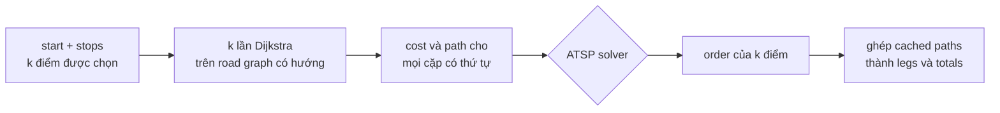
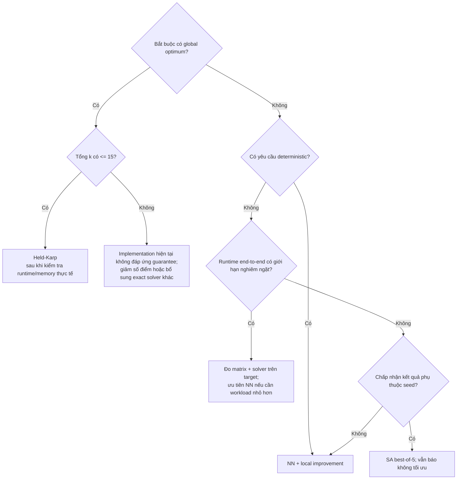

# Ba thuật toán giao hàng đa điểm trong project

> **Phạm vi kiểm định:** code hiện tại ngày 2026-08-06. Tài liệu này mô tả đúng
> implementation, không dùng số trong `results/` làm kết quả hiện hành vì các artifact
> đó được repository đánh dấu là stale. Ví dụ số trong tài liệu là **dữ liệu minh họa
> tổng hợp**, không phải dữ liệu giao thông thật và không phải benchmark.

## Mục lục

1. [Bài toán và thuật ngữ](#1-bài-toán-và-thuật-ngữ)
2. [Hai giai đoạn: shortest path rồi mới ATSP](#2-hai-giai-đoạn-shortest-path-rồi-mới-atsp)
3. [Ví dụ chung đã kiểm tra](#3-ví-dụ-chung-đã-kiểm-tra)
4. [Held-Karp](#4-held-karp)
5. [Nearest Neighbor và local improvement](#5-nearest-neighbor-và-local-improvement)
6. [Simulated Annealing](#6-simulated-annealing)
7. [Local optimum, global optimum, completeness và optimality](#7-local-optimum-global-optimum-completeness-và-optimality)
8. [Độ phức tạp đầy đủ](#8-độ-phức-tạp-đầy-đủ)
9. [Ba thuật toán trên cùng một ví dụ](#9-ba-thuật-toán-trên-cùng-một-ví-dụ)
10. [Decision tree lựa chọn](#10-decision-tree-lựa-chọn)
11. [Các lỗi hiểu sai thường gặp](#11-các-lỗi-hiểu-sai-thường-gặp)
12. [Bản đồ report đến code](#12-bản-đồ-report-đến-code)
13. [Ba cấp độ kiểm tra hiểu bài](#13-ba-cấp-độ-kiểm-tra-hiểu-bài)
14. [Bằng chứng kiểm định và giới hạn](#14-bằng-chứng-kiểm-định-và-giới-hạn)

---

## 1. Bài toán và thuật ngữ

Project hỗ trợ một **shipper** xuất phát từ một **depot** (kho), giao hàng tại nhiều
**điểm giao**, và cần chọn thứ tự thăm các điểm. Một điểm giao là một node được chọn
trên road graph; nó không đồng nghĩa với mọi node giao lộ mà đường đi có thể đi qua.

Một **leg** (chặng) là shortest path trên road graph từ một điểm được chọn đến điểm
được chọn kế tiếp. Một **tour** là thứ tự các điểm được chọn. **Tour cost** là tổng
path cost của các leg. Vì road graph có hướng, nói chung
`C[A,B] != C[B,A]`; đây là **ATSP** (Asymmetric Traveling Salesman Problem), tức TSP
có ma trận chi phí bất đối xứng.

| Thuật ngữ | Định nghĩa dùng xuyên suốt tài liệu |
|---|---|
| `k` | Tổng số điểm được chọn = depot + số điểm giao |
| `N`, `M` | Số node và cạnh của road graph, khác với `k` |
| `C[i,j]` | Cost của shortest path có hướng từ điểm `i` đến điểm `j` |
| Tour mở | Bắt đầu ở depot, kết thúc tại điểm giao cuối; mặc định của API |
| Tour đóng | Sau điểm giao cuối có thêm leg quay về depot |
| Exact algorithm | Thuật toán bảo đảm global optimum dưới các tiền điều kiện đã nêu |
| Heuristic | Quy tắc tìm nghiệm nhanh nhưng không bảo đảm global optimum |
| Greedy heuristic | Heuristic chốt lựa chọn tốt nhất ngay tại bước hiện tại |
| Dynamic programming (DP) | Quy hoạch động: lưu lời giải bài toán con để không tính lại |
| Bitmask | Số nguyên dùng từng bit để biểu diễn một tập điểm |
| Permutation | Hoán vị: một thứ tự chứa mỗi điểm giao đúng một lần |
| Candidate | Tour ứng viên đang được đánh giá để nhận hoặc loại |
| Neighborhood | Tập tour tạo được từ một tour bằng các phép biến đổi được quy định |
| Local search | Quá trình di chuyển sang tour tốt hơn trong neighborhood |
| Local optimum | Tour không có hàng xóm tốt hơn trong **neighborhood đang xét** |
| Global optimum | Tour có cost nhỏ nhất trong toàn bộ không gian tour khả thi |
| Metaheuristic | Khung tìm kiếm cấp cao, thường có ngẫu nhiên, điều khiển cách khám phá |
| Stochastic | Có dùng ngẫu nhiên; đổi seed có thể tạo chuỗi trạng thái khác |
| Deterministic | Cùng input luôn theo cùng chuỗi quyết định mà không phụ thuộc RNG |
| Tái lập bằng seed | Vẫn là stochastic, nhưng cùng seed và input cho lại cùng chuỗi giả ngẫu nhiên |
| Complete | Kết thúc và tìm được nghiệm khi một nghiệm thuộc miền hỗ trợ tồn tại |
| Optimal | Nghiệm trả về được bảo đảm là global optimum |

Public request [`MultirouteRequest`](backend/app/models.py#L413) có contract sau:

| Field | Bắt buộc/default | Ý nghĩa |
|---|---|---|
| `start`, `stops`, `method`, `time_slot` | Bắt buộc | `stops` có 1–15 phần tử; mọi điểm phải khác nhau |
| `mode` | `"balanced"` | Tiêu chí dùng tạo matrix và tối ưu tour |
| `graph` | `"demo"` | Chọn snapshot road graph |
| `scenario` | `null` | Graph view/edge override tùy chọn |
| `return_to_start` | `false` | Mặc định là tour mở |
| `include_trace` | `false` | Chỉ ghi optimization trace khi opt-in |

Tổng `k <= 16`; riêng Held-Karp yêu cầu `k <= 15`. `time_slot` không có
default trong public request. Hàm nội bộ [`solve_multiroute()`](backend/app/tsp.py#L507)
có default `time_slot="07:30"`, nhưng endpoint luôn truyền giá trị đã validate từ request.

`mode` mặc định là `balanced`. Cost `distance` có đơn vị mét; `time` và `balanced`
có đơn vị giây. `total_time_s` trong response luôn là tổng balanced weight để các
tuyến còn so sánh được, kể cả khi mode đang tối ưu là `distance` hoặc `time`.

---

## 2. Hai giai đoạn: shortest path rồi mới ATSP

Ba solver không chạy trực tiếp trên hàng nghìn node của road graph. Pipeline là:



### 2.1. Tạo cost matrix

[`build_matrix()`](backend/app/tsp.py#L97) gọi
[`_dijkstra_to_targets()`](backend/app/tsp.py#L58) một lần cho mỗi source. Dijkstra
dùng `store.adj`, min-heap và trọng số đã precompute bởi
[`GraphStore`](backend/app/graph_store.py#L28). Nó dừng sớm sau khi đã settle mọi
target. Hai dictionary được tạo:

- `cost[(a,b)]`: shortest-path cost theo `mode` và `time_slot`;
- `path[(a,b)]`: chuỗi node của leg đó, dùng lại khi tạo response.

Các cạnh road graph là có hướng. Dijkstra chỉ duyệt cạnh đi ra. Khi hai đường có
cùng cost, counter trong heap và thứ tự adjacency ổn định giúp kết quả tái lập;
bước cập nhật khoảng cách chỉ thay parent khi cost mới nhỏ hơn thật sự.

[`edge_weight()`](backend/app/costs.py#L84) dùng:

- `distance`: `length_m`;
- `time`: `(length_m / (free_speed_kmh / 3.6)) * congestion_factor`;
- `balanced`: cost `time` cộng penalty ngập, công trình, hẻm và đèn tín hiệu.

`congestion_factor = 1 + 1.5 * (level - 1) / 4`. Công thức có ý nghĩa trước hết là:
mức kẹt xe càng cao thì thời gian cạnh càng tăng; mode `balanced` còn tránh các
rủi ro được mô hình hóa bằng penalty giây.

### 2.2. Unreachable không được biểu diễn bằng vô cực

Implementation không đặt `C[i,j] = infinity`. Nếu **bất kỳ** cặp có thứ tự nào
giữa các điểm được chọn không reachable, `build_matrix()` raise
`UnreachableStopError`; [`solve_multiroute()`](backend/app/tsp.py#L507) trả
`found=false`, `order=[]`, `legs=[]` và các total bằng `null`. Vì vậy solver chỉ
nhận ma trận đầy đủ, hữu hạn.

Hệ quả quan trọng: nếu tồn tại một tour mở dùng được một số cặp nhưng một cặp khác
không reachable, API vẫn từ chối toàn bộ trước khi solver chạy. Đây là giới hạn của
matrix builder hiện tại, không phải tính chất bắt buộc của lý thuyết ATSP.

### 2.3. Output API

[`MultirouteResponse`](backend/app/models.py#L652) chứa `found`, `order`, `legs`,
`totals`, `original_order_totals`, `savings_pct`, `optimal_guarantee`, optimization
trace tùy chọn, và SA optimizer stats. `optimal_guarantee` chỉ đúng cho method
`held_karp`. `savings_pct` so tour trả về với đúng thứ tự input; heuristic có thể
cho savings âm nếu thứ tự input tình cờ tốt hơn.

Khi `found=true`, `order` chứa mỗi điểm đúng một lần và không lặp depot
ở cuối. Tour mở có `k-1` leg; tour đóng có thêm closing leg nên có `k`
leg. `applied_scenario` ghi provenance/fingerprint của graph view hay override đã
dùng. Khi `found=false`, `order/legs` rỗng; totals, trace và optimizer stats là `null`.

---

## 3. Ví dụ chung đã kiểm tra

Tất cả ví dụ chạy tay bên dưới dùng cùng một ma trận tổng hợp. `D` là depot;
`A, B, C, E` là bốn điểm giao. Tour là **tour mở**, không quay về `D`. Các số chỉ là
đơn vị cost minh họa.

| Từ \ đến | D | A | B | C | E |
|---|---:|---:|---:|---:|---:|
| **D** | - | 20 | 1 | 13 | 5 |
| **A** | 1 | - | 3 | 4 | 5 |
| **B** | 9 | 2 | - | 8 | 18 |
| **C** | 3 | 2 | 17 | - | 19 |
| **E** | 3 | 17 | 18 | 2 | - |

Ma trận cố ý bất đối xứng: ví dụ `C[D,B]=1` nhưng `C[B,D]=9`. Đã vét cạn cả
`4! = 24` thứ tự: global optimum mở là `D → B → A → E → C`, cost
`1 + 2 + 5 + 2 = 10`.

---

## 4. Held-Karp

> **Nhớ nhanh**
>
> - Loại thuật toán: exact dynamic programming theo tập con.
> - Ý tưởng một câu: lưu tour con rẻ nhất cho mỗi tập đã thăm và điểm kết thúc.
> - Có tối ưu không: có, với ma trận đầy đủ hữu hạn và `k <= 15`.
> - Có thể mắc local optimum không: không; nó không làm local search.
> - Time complexity: `O(k^2 * 2^k)`.
> - Space complexity: `O(k * 2^k)`.
> - Khi nên dùng: bắt buộc có global optimum và nằm trong hard limit.
> - Hàm triển khai trong repo: [`held_karp()`](backend/app/tsp.py#L121).

### 4.1. Bài toán, trực giác và ví dụ shipper

Held-Karp cần trả lời: trong mọi thứ tự giao hàng có thể, thứ tự nào rẻ nhất? Trực
giác là nhiều tour hoàn chỉnh có chung một phần đầu. Ta giải phần đầu một lần và lưu
lại, thay vì tính lại cho từng permutation. Một shipper đã giao cùng tập `{A,B,C}`
và đang ở `C` chỉ cần biết cách rẻ nhất để đạt trạng thái đó; lịch sử đắt hơn không
thể giúp phần còn lại rẻ hơn.

### 4.2. Input, output và cấu trúc dữ liệu

- Input: `cost`, `points` với depot ở `points[0]`, `return_to_start`.
- Output: `(order, best_cost)`; `order[0]` luôn là depot.
- `mask`: integer có bit `i=1` khi điểm `i` đã thăm.
- `dp[mask][j] = (cost, parent)`: cost nhỏ nhất bắt đầu tại depot, thăm đúng các
  điểm trong `mask`, kết thúc ở `j`; `parent` dùng reconstruction.
- Mảng `c[i][j]` là bản đánh index của cost dictionary.

### 4.3. Các bước thuật toán

1. Từ chối `k > 15`; từ `k >= 13` hiện code dùng `print()` để cảnh báo.
2. Khởi tạo `dp[1][0] = (0, -1)`: mới thăm depot.
3. Với mỗi state `(mask,i)`, thử mọi điểm giao `j` chưa có trong mask.
4. Tạo `nmask = mask | (1 << j)` và candidate `dp[mask][i].cost + C[i,j]`.
5. Chỉ cập nhật khi candidate nhỏ hơn cost đang lưu; đồng thời lưu parent `i`.
6. Ở full mask, tour mở chọn endpoint có DP cost nhỏ nhất. Tour đóng cộng thêm
   `C[i,0]` trước khi chọn endpoint.
7. Lần theo parent, xóa bit endpoint sau mỗi bước, rồi đảo danh sách để dựng order.

### 4.4. Pseudocode

```text
HELD_KARP(C, points, return_to_start):
    dp[{depot}, depot] = (0, no_parent)
    for each subset S containing depot:
        for each endpoint i stored in dp[S]:
            for each delivery point j not in S:
                candidate = dp[S,i].cost + C[i,j]
                relax dp[S union {j},j] with (candidate, parent=i)

    end = argmin_i dp[ALL,i].cost + (C[i,depot] if closed else 0)
    follow parent pointers from (ALL,end) back to depot
    reverse reconstructed indices
    return order and optimum cost
```

### 4.5. Chạy tay và parent reconstruction

Ký hiệu `X:c←P` nghĩa là kết thúc ở `X`, cost `c`, parent `P`. Bảng gom các endpoint
của cùng subset trên một dòng nhưng vẫn thể hiện toàn bộ state reachable cần để hiểu
recurrence.

| Tập đã thăm | Các state tốt nhất `endpoint:cost←parent` |
|---|---|
| `{D}` | `D:0←-` |
| `{D,A}` | `A:20←D` |
| `{D,B}` | `B:1←D` |
| `{D,C}` | `C:13←D` |
| `{D,E}` | `E:5←D` |
| `{D,A,B}` | `A:3←B`, `B:23←A` |
| `{D,A,C}` | `A:15←C`, `C:24←A` |
| `{D,A,E}` | `A:22←E`, `E:25←A` |
| `{D,B,C}` | `B:30←C`, `C:9←B` |
| `{D,B,E}` | `B:23←E`, `E:19←B` |
| `{D,C,E}` | `C:7←E`, `E:32←C` |
| `{D,A,B,C}` | `A:11←C`, `B:18←A`, `C:7←A` |
| `{D,A,B,E}` | `A:25←B`, `B:25←A`, `E:8←A` |
| `{D,A,C,E}` | `A:9←C`, `C:26←A`, `E:20←A` |
| `{D,B,C,E}` | `B:24←C`, `C:21←E`, `E:28←C` |
| `{D,A,B,C,E}` | `A:23←C`, `B:12←A`, **`C:10←E`**, `E:16←A` |

Ví dụ một lần cập nhật: để tạo state kết thúc ở `E` trên `{D,A,B,E}`, hai candidate
quan trọng là `D→B→A` có cost 3 rồi cộng `C[A,E]=5`, được 8; đường qua endpoint
khác đắt hơn nên lưu `E:8←A`.

Tour mở chọn `C:10←E`. Reconstruction:

```text
C <- E <- A <- B <- D
reverse => D -> B -> A -> E -> C
cost = 1 + 2 + 5 + 2 = 10
```

Nếu là tour đóng, bước chọn endpoint phải so `dp[ALL,i] + C[i,D]`; không được lấy
cost mở 10 rồi mặc định nó vẫn là tour đóng tốt nhất.

### 4.6. Liên hệ code, complexity và bảo đảm

Code recurrence ở [`held_karp()`](backend/app/tsp.py#L140), chọn endpoint ở
[`held_karp()`](backend/app/tsp.py#L174), reconstruction ở
[`held_karp()`](backend/app/tsp.py#L179). Strict `<` giữ state đầu tiên khi bằng cost;
thứ tự loop ổn định nên kết quả deterministic, nhưng code không công bố quy tắc
"tour tối ưu nhỏ nhất theo từ điển".

Có tối đa `O(k*2^k)` state; mỗi state thử `O(k)` endpoint mới, nên time
`O(k^2*2^k)` và space `O(k*2^k)`. Đây chỉ là solver cost, chưa gồm tạo matrix ở §8.

Với ma trận đầy đủ hữu hạn và `2 <= k <= 15`, loop hữu hạn, DP lưu mọi state cần
thiết, tạo được tour và bảo đảm global optimum. Nếu raw `cost` thiếu cặp, hàm có thể
raise `KeyError`; API tránh điều đó bằng cách không gọi solver khi matrix incomplete.

### 4.7. Ưu, nhược, use case và sai lầm thường gặp

- Ưu: exact, deterministic, dùng làm ground truth đánh giá heuristic.
- Nhược: thời gian và bộ nhớ tăng theo hàm mũ; hard limit 15 điểm.
- Dùng khi: yêu cầu tối ưu là bắt buộc và `k` trong giới hạn.
- Không dùng khi: `k=16`, hoặc giới hạn runtime/bộ nhớ không cho phép sau khi đã đo trên
  môi trường triển khai.
- Sai lầm: gọi Held-Karp là Dijkstra; quên depot nằm trong mask; quên closing edge;
  cho rằng nó tối ưu nhờ heuristic. Nó tối ưu vì bao phủ đầy đủ state DP cần thiết.

---

## 5. Nearest Neighbor và local improvement

> **Nhớ nhanh**
>
> - Loại thuật toán: greedy construction rồi deterministic local search.
> - Ý tưởng một câu: dựng tour bằng điểm gần nhất, sau đó thử đảo/di chuyển đoạn.
> - Có tối ưu không: không bảo đảm global optimum.
> - Có thể mắc local optimum không: có; tour cuối là local optimum của neighborhood code.
> - Time complexity: NN implementation `O(k^2 log k)`; improvement `O(I*k^3)`.
> - Space complexity: `O(k)` ngoài matrix, với candidate tạm thời.
> - Khi nên dùng: cần nhanh, ổn định, chấp nhận không có optimality guarantee.
> - Hàm triển khai trong repo: [`nn_2opt()`](backend/app/tsp.py#L324).

### 5.1. Bài toán, trực giác và ví dụ shipper

Nearest Neighbor (NN) cần dựng nhanh một tour khả thi. Shipper đứng ở điểm hiện tại,
nhìn các điểm chưa giao và đi tới điểm có cost thấp nhất. Đây là **greedy choice**:
tốt nhất ngay lúc này, chưa xét hậu quả ở các chặng sau.

Greedy choice chưa phải local optimum. Sau khi NN tạo xong tour, local search mới
thử các tour hàng xóm. Enum API vẫn là `nn_2opt`, còn report và UI ghi rõ
`NN + 2-opt/Or-opt` vì improvement thực tế gồm cả asymmetric-safe 2-opt
reversal và Or-opt relocation.

### 5.2. Input, output và cấu trúc dữ liệu

- `nearest_neighbour(cost, points)` trả order bắt đầu tại depot.
- `two_opt_or_opt(cost, order, return_to_start)` trả order đã cải thiện.
- `nn_2opt(...)` trả `(order, total_cost)`.
- `left` là set điểm chưa thăm; `best` là tour tốt nhất hiện tại; `cand` là bản copy
  đã biến đổi; `best_cost` là cost của `best`.

### 5.3. Các bước thuật toán

1. NN bắt đầu `order=[depot]`, `left=set(stops)`.
2. Chọn điểm có `cost[(current,p)]` nhỏ nhất; khi bằng cost, node ID nhỏ hơn theo
   thứ tự từ điển thắng vì code dùng `min(sorted(left), key=...)`.
3. Lặp đến khi `left` rỗng.
4. Local search thử mọi 2-opt: đảo `best[i:j+1]`, giữ depot index 0.
5. Mỗi candidate được copy và **tính lại toàn bộ tour cost**; không dùng delta của
   symmetric TSP.
6. Sau đó thử Or-opt độ dài 1, 2, 3: lấy đoạn ra và chèn vị trí khác, giữ hướng đoạn.
7. Chấp nhận ngay candidate nếu `candidate_cost < best_cost - 1e-12`.
8. Lặp cả hai neighborhood đến một vòng không có cải thiện.

### 5.4. Pseudocode

```text
NEAREST_NEIGHBOR(C, points):
    order = [depot]
    unvisited = all delivery points
    while unvisited is not empty:
        next = minimum by (C[current,node], lexical node id)
        append next; remove it from unvisited
    return order

LOCAL_IMPROVE(C, order, closed):
    best = copy(order)
    repeat:
        improved = false
        for every segment [i..j], i >= 1:
            candidate = copy(best) with that segment reversed
            if full_tour_cost(candidate) is strictly lower: accept immediately
        for segment length in {1,2,3}, every source i and insertion j:
            candidate = copy(best) with segment relocated, orientation preserved
            if full_tour_cost(candidate) is strictly lower: accept immediately
    until a complete pass accepts nothing
    return best
```

### 5.5. Chạy tay: NN

| Bước | `current` | `unvisited` | Candidate cost có hướng | Chọn |
|---:|---|---|---|---|
| 1 | D | A,B,C,E | A:20, **B:1**, C:13, E:5 | B |
| 2 | B | A,C,E | **A:2**, C:8, E:18 | A |
| 3 | A | C,E | **C:4**, E:5 | C |
| 4 | C | E | **E:19** | E |

NN raw: `D → B → A → C → E`, cost `1 + 2 + 4 + 19 = 26`. Việc chọn `B` gần
nhất ở bước đầu không chứng minh tour hoàn chỉnh tốt nhất.

### 5.6. Chạy tay: local improvement bất đối xứng

Code tìm thấy phép 2-opt đảo toàn bộ đoạn index `1..4`:

```text
before: D -> [B -> A -> C -> E], cost 26
after:  D -> [E -> C -> A -> B]
cost after = C[D,E] + C[E,C] + C[C,A] + C[A,B]
           = 5 + 2 + 2 + 3 = 12
```

Không được tính theo shortcut 2-opt đối xứng, vì các cạnh nội bộ đổi hướng. Ví dụ
`C[A,C]=4` nhưng sau đảo dùng `C[C,A]=2`. Sau khi quét lại mọi reversal và relocation
độ dài 1-3, không còn neighbor có cost dưới 12, nên tour này là local optimum của
**neighborhood kết hợp trong code**. Tuy nhiên global optimum có cost 10; local
optimum không đồng nghĩa global optimum.

### 5.7. Liên hệ code, complexity và bảo đảm

NN ở [`nearest_neighbour()`](backend/app/tsp.py#L213); 2-opt/Or-opt ở
[`two_opt_or_opt()`](backend/app/tsp.py#L244). NN chuẩn thường được ghi `O(k^2)`,
nhưng implementation sort `left` ở mỗi bước để tie-break, nên tổng thời gian là
`O(k^2 log k)`; space `O(k)`.

Mỗi sweep local improvement có `O(k^2)` candidates. Mỗi candidate dùng slicing/copy
`O(k)` và `tour_cost()` lại `O(k)`, nên một sweep là `O(k^3)`. Gọi `I` là số sweep
cho đến khi không cải thiện: time `O(I*k^3)`, space làm việc `O(k)`. `I` không được
code cap; thuật toán vẫn kết thúc vì mỗi accepted move giảm cost ít nhất theo
tolerance và chỉ có hữu hạn permutation.

Với matrix đầy đủ hữu hạn, NN luôn thêm đúng một điểm mỗi vòng, local search hữu hạn,
và pipeline trả một tour. Nó không bảo đảm global optimum và cũng không bảo đảm tìm
tour khi chỉ một số cặp reachable, vì matrix builder đã từ chối trước đó.

### 5.8. Ưu, nhược, use case và sai lầm thường gặp

- Ưu: deterministic, dễ giải thích, nhanh trong hard limit `k<=16`, không làm xấu
  nghiệm NN vì chỉ nhận improvement.
- Nhược: phụ thuộc tour NN ban đầu và neighborhood; có thể dừng ở local optimum kém.
- Dùng khi: cần phản hồi ổn định, runtime nghiêm ngặt, không bắt buộc exact.
- Sai lầm: gọi NN là shortest-path algorithm; gọi greedy tour là local optimum trước
  khi quét neighborhood; giả định local improvement chỉ là symmetric 2-opt; tuyên bố
  `nn_2opt` luôn tối ưu vì một vài case trùng Held-Karp.

---

## 6. Simulated Annealing

> **Nhớ nhanh**
>
> - Loại thuật toán: stochastic metaheuristic.
> - Ý tưởng một câu: đôi lúc nhận tour xấu hơn để thoát vùng cục bộ, rồi giảm dần mức mạo hiểm.
> - Có tối ưu không: không có global optimality guarantee trong implementation hữu hạn.
> - Có thể mắc local optimum không: có thể; cơ chế acceptance chỉ giúp thoát, không bảo đảm thoát.
> - Time complexity: `O(s*(k^2 log k + L*k))`, hiện `s=5`, `L=2000`.
> - Space complexity: `O(s*k)` không tính trace payload.
> - Khi nên dùng: chấp nhận seed, muốn khám phá rộng hơn local search deterministic.
> - Hàm triển khai trong repo: [`simulated_annealing()`](backend/app/tsp.py#L351).

### 6.1. Bài toán, trực giác và ví dụ shipper

Local search chỉ đi xuống có thể bị bao quanh bởi các tour hàng xóm đắt hơn. SA xem
cost như "năng lượng": khi nhiệt độ cao, nó có thể tạm nhận một tour xấu để sang vùng
khác; khi nhiệt độ giảm, hành vi dần giống greedy improvement.

Trong đời thực, shipper có thể thử đổi thứ tự hai khu vực dù phương án trung gian hơi
tệ, vì thay đổi đó mở đường cho một thứ tự tiếp theo tốt hơn. Đây là mô hình tìm kiếm,
không phải yêu cầu shipper thật phải chạy một tour xấu trước khi giao.

### 6.2. Input, output, parameter và cấu trúc dữ liệu

- Input: `cost`, `points`, `return_to_start`, mặc định `seeds=range(5)`.
- Output: `(best_order, best_cost, stats)`; facade chuyển stats sang
  [`SaOptimizerStats`](backend/app/models.py#L552).
- Mỗi seed có bộ sinh số ngẫu nhiên (RNG) riêng `random.Random(seed)` và bắt đầu từ
  cùng tour NN.
- `cur/cur_cost`: current solution, có thể xấu đi.
- `loc_best/loc_best_cost`: best-so-far của seed, chỉ cải thiện.
- Global `best_order/best_cost`: tốt nhất giữa năm seed.
- `T0 = max(initial_cost*0.2, 1e-9)`, `alpha=0.995`, `L=2000` iteration/seed.

Public API không nhận field seed: nó luôn chạy seed `0,1,2,3,4`. Vì vậy cùng
input/scenario trên cùng implementation hiện tại cho kết quả tái lập, dù bản
chất thuật toán vẫn stochastic và sẽ nhạy với seed nếu cấu hình đó đổi.

### 6.3. Neighborhood, acceptance và cooling

Mỗi iteration gọi một random value để chọn move:

- xác suất 0.5: swap hai stop ở index `1..k-1`;
- ngược lại: lấy một stop ở index `1..k-1` rồi insert vào index `1..k-1`.

Depot index 0 không bị di chuyển. Sau khi tính lại toàn bộ candidate tour, đặt
`Delta = candidate_cost - current_cost`:

- `Delta <= 0`: luôn nhận, kể cả bằng cost;
- `Delta > 0`: nhận nếu random `r < exp(-Delta/T)`.

Trực giác của công thức: candidate càng xấu (`Delta` lớn), xác suất càng nhỏ; nhiệt
độ `T` càng cao, xác suất càng lớn. Sau mỗi iteration, `T = T*0.995`.

### 6.4. Pseudocode

```text
SIMULATED_ANNEALING(C, points, closed, seeds=0..4):
    for each seed:
        rng = Random(seed)
        current = nearest_neighbor(C, points)
        local_best = current
        T = max(0.2 * cost(current), 1e-9)
        repeat 2000 times:
            candidate = random swap or insert of non-depot positions
            delta = full_tour_cost(candidate) - cost(current)
            accept if delta <= 0 or rng.random() < exp(-delta/T)
            if accepted: current = candidate
            if current improves local_best: local_best = current
            T = 0.995 * T
        record local_best and final current for this seed
    return the first minimum local_best across seeds, plus statistics
```

### 6.5. Chạy tay có accept xấu và reject xấu

Các số dưới đây tái hiện đúng RNG của `seed=0` trên ma trận §3.
Tour đầu `D→B→A→C→E`, current cost 26, best-so-far 26, `T0=5.2`.

| Iteration | Candidate/move | Cost | `Delta` | `T` | `exp(-Delta/T)` | `r` | Kết quả |
|---:|---|---:|---:|---:|---:|---:|---|
| 1 | `D→E→B→A→C`, insert `4→1` | 29 | +3 | 5.200 | 0.561624 | 0.258917 | **Nhận xấu** |
| 2 | `D→E→B→C→A`, insert `4→3` | 33 | +4 | 5.174 | 0.461582 | 0.967800 | **Từ chối xấu** |
| 3 | `D→E→A→B→C`, swap `2,3` | 33 | +4 | 5.14813 | 0.459792 | 0.139274 | Nhận xấu |
| 4 | `D→B→A→E→C`, swap `1,3` | 10 | -23 | 5.122389 | 1 | - | Nhận tốt |

Sau iteration 1, **current** có cost 29 nhưng **best-so-far** vẫn là tour cost 26.
Sau iteration 4, cả current và best-so-far trở thành global optimum cost 10. Việc
nhận tour xấu không phải lỗi; đó là cơ chế giúp chuỗi đi qua vùng trung gian. Tuy
nhiên một lần thoát local optimum không chứng minh mọi lần chạy sẽ đạt global optimum.

### 6.6. Liên hệ code, complexity và bảo đảm

Move generation và Metropolis acceptance ở
[`simulated_annealing()`](backend/app/tsp.py#L387); cooling ở
[`simulated_annealing()`](backend/app/tsp.py#L438). Equal-cost candidate được nhận,
nhưng `loc_best` chỉ đổi khi `<`. Nếu nhiều seed có cùng best cost, seed xuất hiện
đầu tiên thắng do strict `<`; `best_seed` cũng lấy index minimum đầu tiên.

Mỗi seed dựng NN `O(k^2 log k)`. Mỗi trong `L` iteration copy candidate và full
re-cost `O(k)`. Với `s` seed: time `O(s*(k^2 log k + L*k))`; hiện `s=5`, `L=2000`.
Stats giữ order tốt nhất mỗi seed nên space `O(s*k)`; current/candidate là `O(k)`.
Trace opt-in có cap riêng và thêm các bản copy order cho event được ghi, nhưng không
đổi kết quả solver.

Với matrix đầy đủ hữu hạn và danh sách seed không rỗng, SA luôn kết thúc sau số vòng
cố định và trả tour. Nó không bảo đảm local optimum lẫn global optimum. Lý thuyết SA
có các định lý hội tụ dưới lịch cooling khác và thời gian rất dài; không được áp các
định lý đó cho lịch hình học 2000 vòng của repo.

### 6.7. Ưu, nhược, use case và sai lầm thường gặp

- Ưu: có thể vượt rào cost để khám phá ngoài vùng nghiệm cục bộ; seed cố định giúp
  tái lập; best-of-five giảm phụ thuộc vào một chuỗi trạng thái.
- Nhược: tốn công cố định 5×2000 iteration; chất lượng và tour có thể khác khi đổi seed;
  không polish nghiệm cuối bằng `two_opt_or_opt()`.
- Dùng khi: không cần exact, chấp nhận stochastic search và chi phí runtime lớn hơn NN.
- Sai lầm: nhầm current với best-so-far; xem accept xấu là bug; nói seed khác luôn cho
  kết quả khác (chỉ là **có thể** khác); khẳng định SA chắc chắn thoát mọi local optimum.

---

## 7. Local optimum, global optimum, completeness và optimality

### 7.1. Ví dụ số cụ thể

Trên ma trận §3:

- Greedy NN tạo `D→B→A→C→E`, cost 26. Đây chỉ là greedy result, chưa phải local
  optimum vì reversal `1..4` cải thiện xuống 12.
- Local search dừng tại `D→E→C→A→B`, cost 12. Nó là local optimum đối với đúng
  reversal + relocation độ dài 1-3 của code.
- Global optimum là `D→B→A→E→C`, cost 10, tìm được bằng vét cạn/Held-Karp.
- SA seed 0 chấp nhận cost 29 rồi 33 trước khi tới cost 10. Khả năng thoát vùng cục bộ
  không tạo ra optimality guarantee.

Đổi neighborhood có thể đổi kết luận local optimum. Một tour local-optimal theo swap
không nhất thiết local-optimal theo insert, reversal hoặc một move lớn hơn.

### 7.2. Bảo đảm theo đúng miền implementation

| Câu hỏi | Held-Karp | NN + local improvement | Simulated Annealing |
|---|---|---|---|
| Có kết thúc? | Có, finite DP, `k<=15` | Có; NN hữu hạn, mỗi accepted local move giảm cost trên tập permutation hữu hạn | Có, `5×2000` vòng mặc định |
| Tạo tour khi matrix đầy đủ hữu hạn? | Có | Có | Có nếu `seeds` không rỗng; API dùng 0..4 |
| Tự xử lý missing/unreachable entry? | Không; raw solver có thể `KeyError` | Không | Không |
| API làm gì khi một cặp unreachable? | Không chạy solver; `found=false` | Như nhau | Như nhau |
| Nếu chỉ tồn tại một tour mở đi qua mỗi điểm đúng một lần nhưng matrix không đầy đủ? | API không bảo đảm tìm | API không bảo đảm tìm | API không bảo đảm tìm |
| Global optimum? | **Có**, complete finite matrix, `k<=15` | Không | Không |
| Local optimum? | Không áp dụng | Có theo neighborhood code và tolerance | Không bảo đảm |
| Cần admissible/consistent heuristic? | Không | Không | Không |

`Admissible` và `consistent` là điều kiện của heuristic ước lượng trong A*/IDA*, không
phải tiêu chí phải chứng minh cho NN hoặc SA. Ma trận ATSP ở đây đã chứa shortest-path
cost thật; ba solver không dùng hàm `h(node,goal)`.

---

## 8. Độ phức tạp đầy đủ

Phải tách matrix stage khỏi solver stage. Ký hiệu: `N,M` cho road graph; `k` cho tổng
điểm được chọn; `P` là tổng số node chứa trong mọi cached leg path; `I` là số local
search sweep; `s=5`, `L=2000` cho SA hiện tại.

| Giai đoạn | Time | Space bổ sung | Nguồn gốc |
|---|---:|---:|---|
| Tạo matrix | `O(k*(M+N)*log N)` | `O(N+M)` làm việc mỗi Dijkstra; `O(k^2+P)` lưu matrix/path | `k` lần heap Dijkstra; cache mọi path có thứ tự |
| Held-Karp | `O(k^2*2^k)` | `O(k*2^k + k^2)` | subset states × endpoint transitions, cộng mảng `c` |
| NN lý thuyết nếu chỉ scan | `O(k^2)` | `O(k)` | scan unvisited mỗi bước |
| NN đúng code | `O(k^2 log k)` | `O(k)` | `sorted(left)` lại ở mỗi bước để tie-break |
| Một local sweep | `O(k^3)` | `O(k)` | `O(k^2)` candidate × copy và full `tour_cost O(k)` |
| Toàn local search | `O(I*k^3)` | `O(k)` | lặp sweep đến khi không cải thiện; không có cap `I` |
| SA | `O(s*(k^2 log k + L*k))` | `O(s*k)` không trace | mỗi seed dựng NN; mỗi iteration copy + full re-cost |

`P` có worst case `O(k^2*N)` nếu mọi leg path đi qua gần toàn road graph. Trong
thực tế, matrix stage có thể tốn hơn solver heuristic vì Dijkstra chạy trên `N,M`
lớn, còn NN/SA chỉ làm việc trên `k<=16`. Không được nhìn riêng vài millisecond solver
rồi kết luận toàn API nhanh tương ứng.

---

## 9. Ba thuật toán trên cùng một ví dụ

Kết quả dưới đây được tính từ ma trận §3 bằng implementation hiện tại và đối chiếu
brute force. Không phải benchmark dataset.

| Thuật toán | Tour đầu tiên | Tour cuối | Cost | Có optimality guarantee? | Điểm đáng chú ý |
|---|---|---|---:|---|---|
| Held-Karp | Không dựng tour greedy; bắt đầu từ state `{D}` | `D→B→A→E→C` | 10 | Có | DP chọn global optimum và reconstruct bằng parent |
| NN + local improvement | `D→B→A→C→E` (26) | `D→E→C→A→B` | 12 | Không | Final là local optimum của neighborhood code, vẫn kém global 2 |
| SA, best 5 seed | `D→B→A→C→E` (26) cho mỗi seed | `D→B→A→E→C` | 10 | Không | Case này trùng optimum nhưng đó là kết quả, không phải bảo đảm |

---

## 10. Decision tree lựa chọn

Không dùng ngưỡng runtime tự đặt. Ngoài hard limit 15/16, nhóm phải đo end-to-end
trên máy demo và workload thật trước khi cam kết thời gian phản hồi.



Ở cây này, “deterministic” nghĩa là không muốn quyết định phụ thuộc RNG/seed,
không chỉ là chạy lại ra cùng kết quả. SA hiện tái lập do seed `0..4` được
khóa, nhưng NN + local improvement mới không dùng RNG.

Nếu `k=16`, chỉ `nn_2opt` và `sa` được API chấp nhận. Nếu cần so gap heuristic với
ground truth, chỉ chạy Held-Karp trên cùng input khi `k<=15`; không suy gap từ case
khác hoặc từ artifact benchmark stale.

---

## 11. Các lỗi hiểu sai thường gặp

| Hiểu sai | Sửa lại cho đúng |
|---|---|
| Held-Karp là Dijkstra | Dijkstra giải shortest path trên road graph; Held-Karp giải thứ tự thăm trên cost matrix bằng subset DP. |
| NN là shortest-path algorithm | Shortest paths đã được Dijkstra tính trước; NN chỉ chọn điểm giao kế tiếp trên matrix. |
| "Gần nhất hiện tại" bảo đảm tour tốt | Greedy choice bỏ qua hậu quả của các chặng sau. |
| Greedy result chính là local optimum | Chỉ sau khi không còn move cải thiện trong neighborhood mới gọi local optimum. |
| Local improvement chỉ là 2-opt chuẩn | Code dùng reversal và Or-opt relocation độ dài 1-3. |
| Delta 2-opt đối xứng dùng được cho ATSP | Đảo đoạn đổi hướng mọi cạnh nội bộ; code full re-cost candidate. |
| Current SA luôn là tour tốt nhất đã thấy | Current có thể xấu hơn; `loc_best`/best-so-far được giữ riêng. |
| SA nhận nghiệm xấu là bug | Đây là Metropolis acceptance để có cơ hội thoát vùng cục bộ. |
| Khác seed chắc chắn khác kết quả | Khác seed tạo chuỗi trạng thái khác nhưng vẫn có thể hội tụ cùng tour. |
| SA thoát local optimum nên chắc chắn global | Thoát được một vùng cục bộ không bảo đảm đến vùng chứa global optimum. |
| NN/SA cần heuristic admissible, consistent | Hai tính chất đó không áp dụng cho các solver này. |
| Solver runtime là toàn bộ API runtime | Matrix stage có `k` lần Dijkstra và cache path, có thể chiếm phần lớn runtime. |
| Số điểm giao là số node road graph | `k<=16` là các điểm được chọn; paths vẫn đi qua nhiều node trung gian trong `N`. |
| Path cost và tour cost giống nhau | Path cost thuộc một leg; tour cost là tổng mọi leg, cộng closing leg nếu tour đóng. |
| Case heuristic trùng HK chứng minh heuristic optimal | Một kết quả trùng optimum không tạo ra guarantee cho input khác. |

---

## 12. Bản đồ report đến code

Các link sau là relative link tới source tương ứng.

| Claim/chức năng | Code | Test/consumer đối chiếu |
|---|---|---|
| Request, default, limit | [`MultirouteRequest`](backend/app/models.py#L413) | [OpenAPI default](backend/tests/test_api.py#L335), [limit validation](backend/tests/test_api.py#L361) |
| API dispatch/scenario | [`post_multiroute()`](backend/app/main.py#L230) | [endpoint](backend/tests/test_api.py#L303), [scenario](backend/tests/test_api.py#L345) |
| Cost formula | [`edge_weight()`](backend/app/costs.py#L84) | [`test_costs.py`](backend/tests/test_costs.py) |
| Weight cache, adjacency, metrics | [`GraphStore`](backend/app/graph_store.py#L28) | [`test_data.py`](backend/tests/test_data.py) |
| Directed Dijkstra/matrix | [`_dijkstra_to_targets()`](backend/app/tsp.py#L58), [`build_matrix()`](backend/app/tsp.py#L97) | [`test_tsp.py`](backend/tests/test_tsp.py#L101) |
| Tour mở/đóng cost | [`tour_cost()`](backend/app/tsp.py#L111) | [`test_tsp.py`](backend/tests/test_tsp.py#L71) |
| Held-Karp recurrence/reconstruct | [`held_karp()`](backend/app/tsp.py#L121) | [`test_tsp.py`](backend/tests/test_tsp.py#L81) |
| NN và tie-break | [`nearest_neighbour()`](backend/app/tsp.py#L213) | [`test_optimization_trace.py`](backend/tests/test_optimization_trace.py#L198) |
| 2-opt/Or-opt full re-cost | [`two_opt_or_opt()`](backend/app/tsp.py#L244) | [`test_tsp.py`](backend/tests/test_tsp.py#L142) |
| SA move/accept/cooling/seeds | [`simulated_annealing()`](backend/app/tsp.py#L351) | [`test_tsp.py`](backend/tests/test_tsp.py#L168) |
| Facade, unreachable, legs/totals | [`solve_multiroute()`](backend/app/tsp.py#L507) | [`test_tsp.py`](backend/tests/test_tsp.py#L212) |
| Response invariants/SA stats | [`MultirouteResponse`](backend/app/models.py#L652) | [`test_optimization_trace.py`](backend/tests/test_optimization_trace.py) |
| Payload ATSP từ UI | [`runMulti()`](frontend/lib/store.ts#L512) | [`api.multiroute()`](frontend/lib/api.ts) |
| Tên method, limit và trace switch | [`AtspSetup`](frontend/components/atsp/atsp-setup.tsx) | [`ATSP_METHOD_LABEL`](frontend/components/atsp/atsp-copy.ts) |
| Guarantee, totals và itinerary | [`AtspResult`](frontend/components/atsp/atsp-result.tsx) | [`AtspExplanation`](frontend/components/atsp/atsp-explanation.tsx) |
| Event DP/NN/local/SA trên UI | [`AtspTrace`](frontend/components/atsp/atsp-trace.tsx) | [`conceptualOptimizationOrder()`](frontend/lib/atsp-trace-policy.ts) |
| Benchmark experiment 7 source | [`exp7()`](backend/app/benchmark.py#L435) | Artifact hiện tại stale; không trích số trong report |

---

## 13. Ba cấp độ kiểm tra hiểu bài

Mỗi đáp án cố ý ngắn; khi demo, thành viên nên bổ sung ví dụ §3.

### 13.1. Cấp 1 - Hiểu cơ bản

#### Held-Karp

| Câu hỏi | Đáp án ngắn |
|---|---|
| 1. Held-Karp giải gì? | Chọn thứ tự thăm có tour cost nhỏ nhất trên matrix. |
| 2. State gồm gì? | Tập điểm đã thăm và endpoint hiện tại. |
| 3. Vì sao exact? | DP bao phủ mọi state/predecessor cần thiết và lấy minimum. |
| 4. Tour mở khác đóng ở đâu? | Tour đóng cộng cost endpoint cuối về depot. |
| 5. Có dùng heuristic không? | Không; đây là subset dynamic programming. |

#### Nearest Neighbor + local improvement

| Câu hỏi | Đáp án ngắn |
|---|---|
| 1. NN chọn gì? | Điểm chưa thăm có directed cost nhỏ nhất từ current. |
| 2. NN có global-optimal không? | Không, vì chỉ nhìn lựa chọn hiện tại. |
| 3. Local search làm gì? | Thử reversal/relocation và nhận tour rẻ hơn. |
| 4. Local optimum là gì? | Không còn neighbor tốt hơn theo move đang xét. |
| 5. Vì sao full re-cost? | ATSP đảo đoạn làm đổi hướng các cạnh nội bộ. |

#### Simulated Annealing

| Câu hỏi | Đáp án ngắn |
|---|---|
| 1. Vì sao SA nhận tour xấu? | Để có cơ hội vượt rào cost sang vùng khác. |
| 2. `Delta` là gì? | Candidate cost trừ current cost. |
| 3. Nhiệt độ có vai trò gì? | Nhiệt cao dễ nhận xấu; nhiệt thấp thận trọng hơn. |
| 4. Current khác best thế nào? | Current có thể xấu đi; best chỉ lưu tốt nhất đã gặp. |
| 5. SA có exact không? | Không với lịch và số vòng hữu hạn của repo. |

### 13.2. Cấp 2 - Hiểu implementation

#### Held-Karp

| Câu hỏi | Đáp án ngắn |
|---|---|
| 1. Hard limit ở đâu? | `HELD_KARP_MAX=15`; model cũng từ chối `k>15`. |
| 2. Base state là gì? | `dp[1][0]=(0.0,-1)`. |
| 3. Parent lưu để làm gì? | Reconstruction endpoint ngược về depot. |
| 4. Equal DP cost xử lý sao? | Strict `<` giữ state đến trước theo loop ổn định. |
| 5. `return_to_start` tác động chỗ nào? | Hàm `close(i)` cộng `c[i][0]` khi chọn endpoint. |

#### Nearest Neighbor + local improvement

| Câu hỏi | Đáp án ngắn |
|---|---|
| 1. Tie NN xử lý sao? | Sort node ID trước, rồi `min` theo cost. |
| 2. Depot được giữ thế nào? | Mọi index biến đổi bắt đầu từ 1. |
| 3. Or-opt dài bao nhiêu? | Đoạn dài 1, 2 hoặc 3, giữ orientation. |
| 4. Điều kiện accept? | `cc < best_cost - 1e-12`. |
| 5. Vì sao complexity code khác NN chuẩn? | Code sort set còn lại ở mỗi vòng. |

#### Simulated Annealing

| Câu hỏi | Đáp án ngắn |
|---|---|
| 1. Tham số cố định? | 5 seed, 2000 iteration/seed, alpha 0.995. |
| 2. `T0` tính thế nào? | `max(initial_cost*0.2, 1e-9)`. |
| 3. Neighborhood gồm gì? | Swap hai stop hoặc remove/insert một stop. |
| 4. Delta bằng 0 có nhận không? | Có vì nhánh `delta <= 0`. |
| 5. Tied best seed xử lý sao? | Best đầu tiên được giữ do strict `<`. |

### 13.3. Cấp 3 - Sẵn sàng phản biện

#### Held-Karp

| Câu hỏi | Đáp án ngắn |
|---|---|
| 1. Tại sao chọn Held-Karp? | Khi cần chứng nhận global optimum và `k<=15`. |
| 2. Trường hợp nào thất bại? | Quá limit, matrix incomplete, hoặc tài nguyên/thời gian không đủ. |
| 3. Tăng `k` thì sao? | Time `k^2*2^k`, memory `k*2^k` tăng theo hàm mũ. |
| 4. Vì sao không dùng cho mọi request? | `k=16` bị từ chối và chi phí mũ không phù hợp mọi giới hạn thời gian. |
| 5. Vì sao optimum không cần admissibility? | DP không dùng heuristic estimate. |

#### Nearest Neighbor + local improvement

| Câu hỏi | Đáp án ngắn |
|---|---|
| 1. Tại sao chọn pipeline này? | Nhanh, deterministic, dễ giải thích, chấp nhận nghiệm không exact. |
| 2. Nó thất bại về chất lượng khi nào? | NN khởi tạo kém và neighborhood không có đường giảm tới tour tốt hơn. |
| 3. Tăng `k` thì sao? | Matrix vẫn đáng kể; local candidates/full re-cost tăng bậc ba mỗi sweep. |
| 4. Có khẳng định tour tối ưu không? | Không; chỉ có thể nói local optimum theo neighborhood code. |
| 5. Vì sao không gọi greedy choice là local optimum? | Chưa kiểm tra các neighbor của tour hoàn chỉnh. |

#### Simulated Annealing

| Câu hỏi | Đáp án ngắn |
|---|---|
| 1. Tại sao chọn SA? | Muốn stochastic exploration ngoài local descent, không cần exact. |
| 2. Khi nào SA cho kết quả kém? | Lịch giảm nhiệt, số vòng, seed hoặc neighborhood không khám phá được vùng tốt. |
| 3. Tăng `k` thì sao? | Mỗi iteration full re-cost dài hơn; 2000 vòng không tự tăng theo không gian nghiệm. |
| 4. Vì sao kết quả có thể thay đổi? | Khi seed/cấu hình đổi, chuỗi move và random acceptance đổi; public API hiện khóa seed 0..4 nên cùng input thì tái lập. |
| 5. Best-of-five trùng HK có chứng minh exact? | Không; đó chỉ là quan sát trên input đó. |

---

## 14. Bằng chứng kiểm định và giới hạn

### 14.1. Bằng chứng đã kiểm tra

- `backend/tests/test_tsp.py`: brute-force oracle cho Held-Karp ở tour mở/đóng,
  directed matrix so NetworkX, local-neighborhood invariants, SA determinism/stats,
  response/limit/unreachable validation.
- `backend/tests/test_optimization_trace.py`: trace opt-in không đổi order/totals/stats,
  event order và cap.
- `backend/tests/test_api.py`: endpoint, validation envelope, limit và typed response.
- Vòng kiểm định gần nhất: full backend `176 passed`; data validator `ALL DATA VALID`.
- Stress ngoài suite: 1.020 Held-Karp/brute-force cases, 1.800 local-optimum cases,
  400 SA invariant cases; matrix đối chiếu 30.600 cặp demo và 6.624 cặp real.
- Biên solver đã chạy tổng hợp: Held-Karp `k=15`; NN/SA `k=16`.
- Frontend unit/policy test: `32 passed`; TypeScript `npx tsc --noEmit` đã pass sau
  khi sửa UI.
- Browser QA thật đã chạy cả ba method với trace ở 1366×768 và 1920×1080;
  audit thêm 800×768 và 1536×864, đo theo đúng vùng nội dung tab bằng
  `window.innerWidth × window.innerHeight`. Các request solver đều 200, không có
  console error, không tràn ngang trang; tab dùng được bàn phím và reduced-motion
  khóa autoplay.

### 14.2. Benchmark

[`exp7()`](backend/app/benchmark.py#L435) đã được đọc để kiểm tra scenario và cách gọi
ba solver. Không chạy lại benchmark vì lệnh đó ghi đè `results/`, cần một dependency
chain được dự án cho phép riêng. Không có số runtime/gap benchmark nào được dùng trong
tài liệu này. Decision tree chỉ dùng hard limit trong code và yêu cầu phải đo trên
môi trường mục tiêu.

### 14.3. Giới hạn còn lại

- Test không thể chứng minh mọi input số thực có thể có; bảo đảm exact của Held-Karp
  còn dựa trên recurrence và các tiền điều kiện đã nêu.
- NN và SA về bản chất không có global optimality guarantee; thêm test không biến
  chúng thành exact algorithm.
- Chưa benchmark end-to-end concurrency, memory peak trên graph/scenario tùy biến,
  hoặc giới hạn thời gian trên máy trình chiếu.
- Dưới CSS viewport 900 px, hai rail cố định 280 px theo `DESIGN.md`; app vẫn
  dùng được nhưng vùng map hẹp, không phải mobile layout overlay/auto-collapse.
- Link dùng số dòng của code hiện tại; refactor sau này có thể làm lệch anchor dù tên
  hàm vẫn là nguồn đối chiếu chính.

---

## Kết luận nhớ trong 30 giây

1. Dijkstra tạo directed cost matrix; ba ATSP solver chỉ chọn thứ tự điểm trên matrix.
2. Held-Karp là exact subset DP, global-optimal khi matrix đầy đủ và `k<=15`.
3. NN là greedy construction; 2-opt/Or-opt mới là local search, dừng ở local optimum.
4. SA giữ current và best riêng, đôi lúc nhận xấu theo `exp(-Delta/T)`, chạy seed 0-4.
5. Chỉ Held-Karp có optimality guarantee. Matrix stage và solver stage phải được đo riêng.
